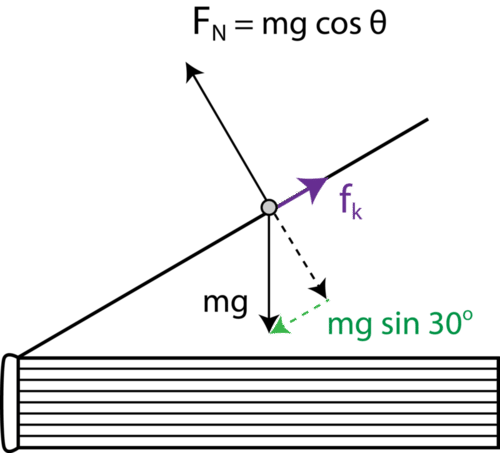
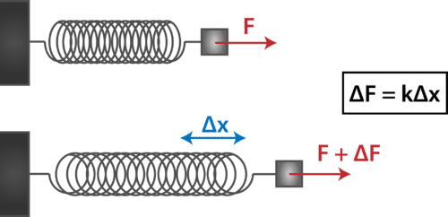
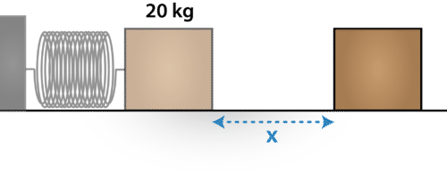
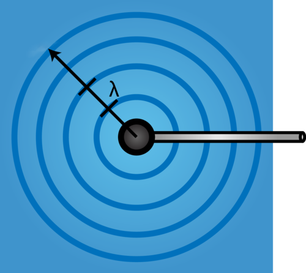
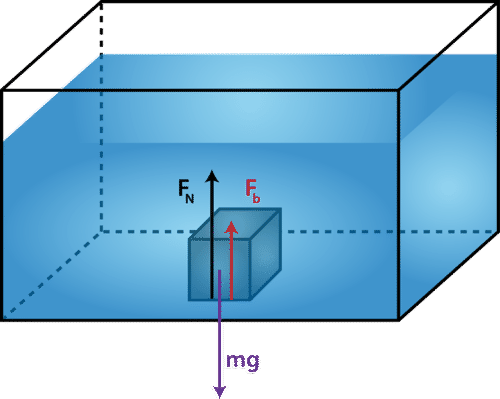
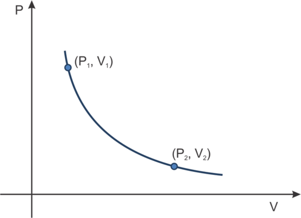
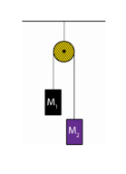
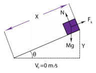
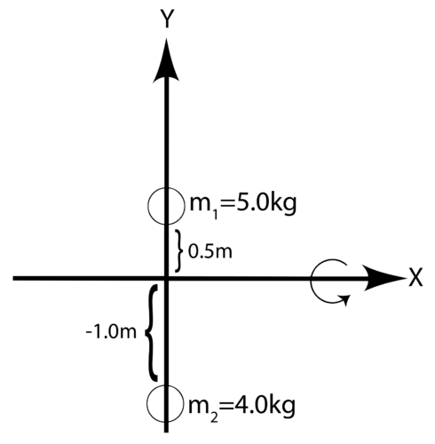
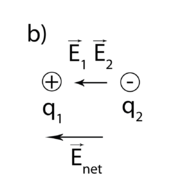

<!--
author:   Ira Nirenberg, M.A.

email:    LiaScript@web.de

version:  0.0.1

language: en

narrator: US English Female

comment:  CK-12 Physics - Intermediate is a high school FlexBook® resource covering all standard high school physics topics with mathematical rigor and detailed examples.

logo:     ../cover.jpg

tags:      physics, science

-->

# CK-12 Physics - Intermediate

> This document was automatically translated to LiaScript from
>
> https://www.ck12.org/book/ck-12-physics-intermediate/

## 1.0 What Is Science?

<article>

</article>

### 1.1 Scientific Inquiry

<article>

### Objectives

* Explain the role of using postulates in science.
* Explain the role of mathematics in science.
* Explain how scientists investigate nature by ensuring their models are falsifiable and tested by independent researchers.
* Describe the difference between a hypothesis, theory, and law.
* Explain that new theories explain phenomena more accurately than preexisting theories, and such theories are consistent with the correct predictions of previous theories.
* Describe the scientific method.

### Vocabulary

* **hypothesis:** A proposed explanation for an observation, phenomenon, or scientific problem that can be tested by further investigation.
* **inquiry:** An approach to learning that involves exploring the natural or material world, then leads to asking new questions and making new discoveries.
* **scientific law:** A concise mathematical relationship that always occurs under specific conditions. A law is not an explanation, and it is no more or less final than a theory.
* **scientific method:** A systematic approach used to investigate the natural world that must make predictions, be testable, come from evidence, and be potentially disprovable.
* **theory:** A statement or set of statements devised to explain a group of observations or phenomena. Theories have often been repeatedly tested or are widely accepted, and can thus be used to make predictions about natural phenomena.

### Introduction

")

A scientific explanation is always subject to revision based on new evidence and can be discredited at any point. It can never be absolutely proven.

* The explanation must be logically consistent.
* The explanation must make predictions.
* The predictions must be testable.
* The tests must be based on evidence.
* The explanation must be falsifiable, meaning that it can potentially be disproved based on the test results.

There are a few important clarifications to how the scientific process has been defined so far:

* There is nothing more solid or final than a **theory**.
    * A theory is never formally changed to anything else, no matter how much evidence there is. It becomes harder and harder to disprove with more evidence, but it is never upgraded from a theory to a “scientific fact” or a **scientific law**. A scientific law is a specific mathematical relationship, which is tested in the same way as a theory and just as open to being disproven at any time.
* Steps can be skipped as long as the explanation is valid and tested.
    * As a scientist, you could have a strong hunch before investigating, so you create a **hypothesis** immediately and then move on to testing it. Alternatively, you could devise a series of tests to try out before you have a definite hypothesis.
* Scientists conduct investigations for a wide variety of reasons.
    * A scientist can conduct work for any purpose, which is still completely scientific as long as it maintains some basic ethics. As a scientist, you could do your work because of the money it would make. Alternately, you could pursue a theory because you like the “beauty” of the explanation. Further still, you could do your work based on religious conviction, in the tradition of religious scientists like Galileo and Newton. As long as you do not falsify evidence, your reasons are unimportant.
* Scientists make mistakes and report them.
    * Scientists are never perfect, and even if they follow all procedures properly, unforeseen circumstances can sometimes throw off the results of an experiment. The key to scientific processes is not to throw away the unexpected results, but to keep them, analyze them, and report them. This can help other scientists who might run into the same problem, or can even result in new discoveries. It is unethical to throw out odd results unless you know exactly what caused them.

Unethical scientists may alter data to give the results that support what the experiment was intended to show. This could be to enhance their reputation, make more money, or to prove the result that they prefer for personal reasons. A result like this may stand for years, but in time it will be disproven as other scientists attempt investigations to confirm or follow up on the false result. Both intentional deception and honest mistakes are eventually discovered.

In order for a result to be taken seriously by the scientific community, researchers must explicitly show how they conducted their work, how the testing was done, and how the data was collected. Presenting their results to their peers allows for feedback, corrections, and insights that may not have occurred to the experimenters themselves.

### Development of Ideas Over Time

One example of developing better explanations is in the case of falling objects. Since ancient times, it was widely accepted as true that heavier objects fell faster than lighter objects. The multi-talented Aristotle (384–322 BC) of ancient Greece held this belief, and scholars took his word for centuries. This idea is based on good experimental evidence, because very light objects like feathers do fall much more slowly than heavy objects like rocks.

Years later, Galileo Galilei (1564–1642) looked in further detail at the nature of falling objects. He carefully timed marbles as they rolled down a slanted wooden block. He also dropped objects of varying weights. He found that very light objects like feathers were the exception. Heavy objects all fall in about the same time regardless of how heavy they are. Galileo hypothesized that a feather falls slowly due to resistance from the air. Heavier objects are easily pushed through the air, and thus experience little effect from air resistance.

He hypothesized that in the absence of air, all objects would fall at the same rate. Robert Boyle first confirmed this hypothesis twenty years after Galileo died. In 1660, Boyle pumped all the air out of a glass tube and then dropped both a feather and a coin inside that tube. Centuries later in 1971, astronaut David R. Scott repeated this investigation during a live TV broadcast from the Moon, as shown in the following video.

http://www.youtube.com/watch?v=5C5_dOEyAfk

!?[0](https://www.youtube.com/watch?v=5C5_dOEyAfk)

This explanation is more complicated, because it involves two effects: gravity and air resistance. It can be hard to reconcile these two, especially if you don’t know how they were discovered. Many students learn that all objects fall at the same rate only as an unexplained fact, but don’t know how to relate this to the common case of a feather.

The following is a video of high school graduates talking about their understanding of falling objects.

http://www.youtube.com/watch?v=_mCC-68LyZM 

!?[0](https://www.youtube.com/watch?v=_mCC-68LyZM)

### Mathematics and Technology

As science has advanced, evidence has gone beyond just what we can see with our eyes. Modern experiments use technology to collect data and mathematical analysis to reveal patterns within that data.

Mathematics can be used to prove a scientific law. As explained above, a scientific law is no more or less absolute than a theory. Rather, it is a mathematical relation that may or may not have an explanation. For example, you might prove that the weight of water is proportional to how much volume it takes up.

</article>

### 1.2 Fundamental Units and Standard Units

<article>

### Objectives

* List and use fundamental units in the study of mechanics.
* List and use standard units in the study of mechanics.
* Use dimensional analysis.

### Vocabulary

* **dimensional analysis:** Checking your mathematical equations by keeping units with every number, or predicting units based on the relation of other units.
* **length:** The measurement of the extent of something along its greatest dimension.
* **mass:** A property of matter equal to the measure of an object's resistance to changes in either the speed or direction of its motion. The mass of an object is not dependent on gravity and therefore is different from but proportional to its weight.
* **meter stick:** A ruler exactly one meter in length.
* **scalar:** A quantity, such as mass, length, or speed that is completely specified by a single number. It is said to have magnitude, but no direction.
* **SI units:** The most modern version of the metric system, also known as the International System of Units (SI). 
* **time:** An ordered continuum in which events occur in succession from the past through the present to the future.
* **vector:** A quantity, such as velocity or force, that must be completely specified by both a magnitude and a direction. For example, if an object is moving, we must know both the amount of motion as well as the direction of motion to know the vector quantity velocity.

### Equations Including Units

Mathematics is central to science in general and especially physics.  The math in physics is always connected to real physical quantities, however.  In a math class, an equation might read: 

However, in physics all numbers represent a specific physical quantity and they have units.

Each of the quantities in the equation has abbreviations for units beside it.  For example, this is the formula for how high an object would be after dropping for two seconds from the top of a six-story building.

### Standard Units—SI Units (Standard International Units)

Especially in scientific work, it is vital that we use a consistent and logical set of units.  For almost all scientists, that system is the **International System of Units**, abbreviated **SI**.  This the most modern form of the metric system.  It is used universally for all scientific work.  It is also used on a daily basis in almost all the world.  The three countries that do not officially use metric units in some form today are Burma, Liberia, and the United States.

Map of countries not officially using the metric system worldwide.

Students often learn the basics of metric units, but are not fluent in them. Especially in physics, it is important not just to perform abstract calculations, but to be able to mentally picture what measurements look like. 

* How heavy is a 10kg weight?
* How short is someone who is 155cm tall?

The standard unit of length used in physics today is the meter, which is roughly the distance from the tip of your nose to the end of your outstretched arm. The **meter sticks** you have in your classroom do not have this accuracy.

The standard unit of **mass** is the kilogram.  A one-kilogram mass corresponds to a weight of approximately 2.2 pounds. Mass and weight are not the same property. Weight is the product of the gravitational acceleration, , and the mass of the object: . The corresponding standard weight unit is the Newton, where 4.45 Newtons is equal to 1 pounds.

The standard unit of **time** is the second, which is familiar to most students. 

The standard unit of temperature is the degree Celsius.  One degree Celsius is the same as one degree Kelvin, but they measure from a different starting point.  Celsius measures up from the freezing point of water, while Kelvin measures up from the point called "absolute zero". 

These fundamental units are combined into _derived units_, such as for speed.  Speed and velocity have the derived units of .  Other derived units include force, energy, voltage, and so forth.

### Vectors and Scalars

If we wish to fully define the motion of an object we must state the object’s magnitude and the object’s direction. In the case of motion, the magnitude is the speed of the object. Quantities such as displacement are represented by net distance (magnitude) and direction. Any quantity requiring a magnitude and a direction is called a **vector** quantity. Force is another vector quantity. For example: A 150 N punch (magnitude) to the stomach (direction, loosely speaking!). Quantities that require only a magnitude for their complete description are called **scalars**. Mass and temperature are examples of scalar quantities.

A vector requires both a magnitude and direction.

### Dimensional Analysis

**Dimensional analysis** is the method of using fundamental or standard units in detecting an error and discerning the correct relationship between physical quantities. As a simple example, recall our old friend , where is a distance, is a rate, and is time. If we accidentally rewrite the equation as , we see that the units are inconsistent since m/s do not equal s/m. If the derived units are not the same on each side of the equation, we know that a mistake was made. The converse is not true. If the units agree, a mistake may still have been made. (Why?)

### Check Your Understanding

1. The density of mercury is 13.5 g/cm_3_. What is the formula for density?

**Answer**: The units of density are given as g/cm_3_. Grams are a measure of mass, and cm_3_ is a measure of volume. Density therefore has units of mass/volume. So the formula for density is: , where is density. Of course, there may be a “dimensionless” quantity in this formula. Not all formulas have only physical quantites in them. Consider the volume, , of a sphere: . Here, is the radius of the sphere and it has units of length. But the quantity has no units. It is a “pure number.” Dimensional analysis cannot determine what, if any, pure numbers are in a formula. But, at the very least, a statement of proportionality is always possible, as in the case of  is proportional to .

2. In the formula, , has units of meters and has units of seconds. What are the units of ?

**Answer**: The acceleration, , has units of m/s_2_.

</article>

### 1.3 Unit Conversions

<article>

### Objectives

* Perform unit conversions.
* Properly use scientific notation.

### Vocabulary

* **conversion factor:** A mathematical expression equating two different units, such as 1 m = 100 cm.
* **scientific notation:** A number expressed in scientific notation is written as a number between 1 and 10 multiplied by a power of ten.

### Introduction

Just as there are many spoken languages, there are many ways of expressing the same quantities in science. All scientists throughout the world measure length using centimeters, meters, and kilometers rather than inches, feet, and miles. Even within this single system of measurement, it is still necessary to reinterpret, or convert, quantities. For example, it is more efficient to express 1,000 meters as 1 kilometer, or to express 150 centimeters as 1.5 meters (**Table** [below](#x-ck12-dGFibGU6RXF1aXZVbml0cw..)).

|     |     |
| --- | --- |A Few Select Unit Equivalencies
| Unit | Equivalent Unit |
| --- | --- |
| **LENGTH** |     |
| 1 kilometer (km) | 1000 meters (m) |
| 1 m | 100 centimeters (cm) |
| 1 cm | 10 millimeters (mm) |
| **MASS** |     |
| 1 kilogram (kg) | 1000 grams (g) |
| 1 g | 1000 milligrams (mg) |

A United States five cent piece has a mass of five grams.

### Examples Using Unit Conversions

Note: Answers to the illustrative examples below will be expressed in **scientific notation.**  A number expressed in scientific notation is written as a number between 1 and 10 multiplied by a power of ten. For example: . 

#### Illustrative Examples

For our purposes, let us regard the statement 1 km = 1000 m as an “equation.”

1. How many meters are there in 10 km?

**Answer:** First we need a **conversion factor.**  We know that 1 km = 1000 m.  Dividing both sides by 1000 m,

, or equivalently .

The first result is useful if we wish to convert meters to kilometers, and the second result is useful if we wish to convert kilometers to meters.  Using this conversion factor, we put the units that we want on the top.  Since the result is in meters, we must convert from km to m. We use the unit conversion factor .

2. Convert 10 m to km.

**Answer:** Here we use the conversion factor .

3. Convert 100 km/h to m/s.

**Answer:** Recall that 1 h = 60 min = 3600 s.

### Interactive Simulation

!?[undefined](media/181037.mp4 "video")

### Check Your Understanding

1. Convert 60 mph (mi/h) to ft/s.

**Answer:**

Given: 5280 ft = 1 mile

2. Convert 80 mg to kg.

**Answer:** 

3. Convert 60.0 mi/h to m/s, given 1.609 km = 1.00 mi

**Answer:**

</article>

### 1.4 Measurement and Recording Data

<article>

### Objectives

* Describe measurement.
* Explain what is meant by significant digits.
* Determine the number of significant digits in a measurement.
* Add, subtract, multiply, and divide with significant digits.
* Use scientific notation.

### Vocabulary

* **precision:** The smallest unit that a device can measure.
* **significant digits:** The number of precisely-measured digits in a measurement or result.
* **uncertainty (in measurement):** The possible variance between a measurement and the true result.

### How to Measure

A typical meter stick is accurate to a millimeter.  Assuming the object being measured lines up well with the meter stick and has a sharply-defined end, you can clearly see it measuring closer to one millimeter mark than to another.  This is expressed as **precision** of ± 0.5 mm, or equivalently, ± 0.05 cm. A measurement of 42.78 cm can be read exactly to 42.7 cm (**Figure** [below](#x-ck12-MjAxMjEyMDYxMzU0ODE0NzYxMTUwMTI4XzQ3NGU0NjBlYzhkMWQwOTkyNmZkNjAyMzY0YTBhNDY5LTIwMTIxMjA2MTM1NDgxNTEzODY4ODgyOQ..)). The “8” in 42.78, that is, 0.08 cm, is a reasonable estimate, where the actual measure lies within a range of values between 42.78 ± 0.05 cm → \[42.73 - 42.83\]. This measurement has 4 **significant digits**.

### Introduction

A person stands on their bathroom scale. What is a reasonable weight for the scale to show?

A reasonable weight might be:

a. 120.5 lbs

b. 120.53 lbs

c. 120.534 lbs

In all likelihood you chose answer A. Good! Why didn’t you choose B or C?

Most likely, you did not select B or C because the finest measure on most bathroom scales is to the pound. At best we can estimate to one decimal place.

This example highlights when and why significant digits are used in science, and especially in physics. When an experiment is conducted, data measurements can only be as precise as the equipment used to make the measurement.

### Significant Digits—Reporting Data Correctly

The length of the pen shown in the **Figure** [below](#x-ck12-MjAxMjEyMDYxMzU0ODE0NzYxMTYyNDkwXzRjOTRjOWU5MWUzYmZiMjQ2MmE3MmU1YTFlMzgzNDc2LTIwMTIxMjA2MTM1NDgxNTEzODkwMjA3NA..) is measured as 14.58 cm. It’s easy to see that the pen is clearly larger than 14 cm and that it is past the 14.5 cm mark, as well. Where does the 8 (at the end of this measurement) come from? The 8 represents an estimate by the person measuring the pen. The end of the pen is somewhere between the fifth and sixth millimeter. If it had appeared to have fallen exactly in the center of this interval, the final digit would have been reported as a 5. In fact, depending upon who read the ruler, the final digit may have been reported as a 7 or 9, giving us a measurement of 14.57 or 14.59. **The last digit of any measurement is significant but uncertain - but not** **_completely_** **uncertain!** It’s reasonable to argue based on varying individual perspectives about whether the last digit is a 7, 8, or 9 (you may even say 14.60) but no one will argue, based on what they can see, that the reading is between 14.50 and 14.55. There is a difference, however, in reading the ruler as best as you can, and the actual **uncertainty** of the ruler. Mass-produced measuring tools typically have a precision of no better than $\pm \frac{1}{2}$ of the smallest interval of the device. Therefore, 14.58 cm is recorded as 14.58 ± 0.05 cm, \[14.53-14.63\].

Note: we will not cite our results using a range of values when working on problems in later chapters. This method should, however, be used in reporting laboratory data.

What if someone had used the same ruler in **Figure** [above](#x-ck12-MjAxMjEyMDYxMzU0ODE0NzYxMTYyNDkwXzRjOTRjOWU5MWUzYmZiMjQ2MmE3MmU1YTFlMzgzNDc2LTIwMTIxMjA2MTM1NDgxNTEzODkwMjA3NA..) to measure the pen and stated it was 14.573 cm? How believable is it that they could read a measurement of 0.003 cm with this ruler? It’s not believable at all! (Think of the example above.) The 7 was a reasonable guess, but there’s nothing reasonable about claiming the 3 is readable—it’s a physical impossibility with this ruler. The ruler measures a maximum of 2 significant figures to the right of the decimal- no more and no less!

What about zero?

Zero can be a source of confusion when it comes to recording significant digits. Let’s see if we can understand the source of this confusion.

Using the ruler in **Figure** [below](#x-ck12-MjAxMjEyMDYxMzU0ODE0NzYxMTc1MzQ5XzExY2QwNmRiNzE4ZjY0YTQ1MWUxZjc5ODg2YjRhNDYxLTIwMTIxMjA2MTM1NDgxNTEzOTE1OTQ1MQ..), a student measures a calculator’s length as 18 cm. What’s wrong with how this measurement is reported? A measurement must include a last digit, which is always an estimate. This final estimated number is uncertain but reasonable (significant). This last digit informs us of the precision of the device used.

Since 8 is the last digit, it must be an estimate. Therefore it is impossible for the tool to measure numbers like 18.2 or 18.26. But this isn’t true. The way to state the measurement and include the precision of the ruler is to write 18.00. Reading 18.00 informs us that the measurement appears exactly at the 18 cm mark but is also capable of measuring one more digit to the right with certainty, and estimating yet another digit to the right. The measurement 18.00 has four significant figures, while the measurement 18 has only two significant digits.

### Zero as a Placeholder

A United States penny has a diameter of 1.91 cm as measured with our ruler. Even though the ruler can measure lengths like 11.91 cm, the penny has no “tens of centimeter” value. You can’t measure what is not there, so there is no added “significance” if we write a zero in front of the ones-units to indicate there are no tens, like this: 01.91. This number has only three significant figures. The zero is not a measure of anything and the diameter of the penny is in the range \[1.86 - 1.96. cm.

### Check Your Understanding

1. How many significant digits are there in:

1.  0.191
2.  0.190
3.  00.19
4.  10.90
5.  10.060
6.  010.060

**Answers**:

1.  3
2.  3
3.  2
4.  4
5.  5
6.  5

### Ambiguous Recording

How many significant digits are there for the number 100? We have a problem with this. As it is written, we don’t know whether the zeros are placeholders or if the tool used to measure 100 can actually measure to the tens place. Had the number been written as “100.” (with a decimal point after the third digit), then we could say, yes, and we would know the measurement has three significant digits, with the ones-place being an estimate. But we don’t typically write a number terminating in a decimal point. The best method for writing significant digits is using scientific notation.

Let us restate the definition of scientific notation.  Scientific notation expresses a measurement as a number between 1 and 10, then multiplied by a power of ten.

Some examples:

* 5,400 (2 significant figures) = 5.4 × 10_3_
* 5,400 (3 significant figures) = 5.40 × 10_3_
* 5,400 (4 significant figures) = 5.400 × 10_3_
* 0.0200 (3 significant figures) = 2.00 × 10_\-2_

If we had intended three significant digits for 100, we would have written it as 1.00 × 10_2_, using scientific notation. Had we intended one significant digit then we would have written it as 1 × 10_2_ using scientific notation.

### Check Your Understanding

1. Using scientific notation, write 2800 with four significant figures.

**Answer**: 2.800 × 10_3_.

2. Using scientific notation write 28,000 with three significant figures.

**Answer:** 2.80 × 10_4_.

### Computing with Significant Digits

There are set rules used to determine the number of significant digits (or figures or numbers!) to report when adding, subtracting, multiplying, and dividing with significant numbers. Let’s consider these rules.

### Adding and Subtracting with Significant Digits

Rule: When adding or subtracting significant numbers, round to the smallest number of places past the decimal, of the least precise number in the group.

Example 1: 23.56 + 47.0 = 70.56 = 70.6 (least precise measure is the tenths place)

Example 2: 512 + 48.6295 = 560.6295 = 561 (least precise measure is the ones place)

Example 3: 6 \\times 10^2 - 10.76 = 589.24 = 600 (least precise measure is the hundreds place)

Consider why this rule is reasonable. In each example, the two numbers being added or subtracted could not have been measured with the same instrument. The second number in each pair was measured with a tool of greater precision. A less accurate measurement cannot be made more accurate by the addition or subtraction of a more accurate number, no more so than a more precise measuring tool can impart greater precision to a less precise measuring tool. The precision of the sum or difference computation is therefore always determined using the least precise tool.

### Multiplying and Dividing with Significant Digits

Rule: When multiplying and dividing with significant digits, the final result must be rounded to the same number of significant digits as the number with the minimum number of significant digits.

Example 1: 23.56 × 47.0 = 1107.32 = 1110 = 1.11 × 10_3_ (round to three significant digits)

Example 2: 512 × 48.6295 = 24898.304 = 24900 = 2.49 × 10_3_ (round to three significant digits)

Example 3: (6 × 10_2_)/10.7 = 56.07476636 = 60 = 6 × 10_1_ (round to one significant digit)

Consider why this rule is reasonable.

Recall that the last digit in each number is not an exact measure, but an estimate. When multiplying (or dividing), the uncertainty of the estimated digits affects every digit. This rule ensures that the uncertainty is never greater than two digits having a direct calculation from an estimated digit.

</article>

### 1.5 Working with Error

<article>

### Objectives

* Describe systematic and random error.
* Explain precision and accuracy as they relate to error.

### Vocabulary

* accuracy
* precision
* **random error:** Error that varies within the inherent uncertainty of a measuring device.
* **systematic error:** An error of constant value that is made repeatedly.

### Introduction

There is a difference between what we mean by _mistake_ and _error_ in a laboratory setting. A mistake, for example, is accidentally writing 3 × 5 = 8 rather than 15. On the other hand, a **systematic error** is one of a constant value that is made repeatedly. **Random error** varies within the inherent uncertainty of a measuring device: a meter stick (± 0.05 cm) or human reaction time (at worst ± 0.2 s). We will discuss both of these sources of error, along with **precision** and **accuracy**.

The classic target example below is a good way of explaining precision.

1. A data set can be precise, but inaccurate, as displayed in **Figure** [below](#x-ck12-MjAxMjEyMDYxMzU0ODE0NzYxMjI4NTQyXzBmMDc1OTQxODAzMWIyNDk1NzczMzgwNGE2NDg2YWJmLTIwMTIxMjA2MTM1NDgxNTEzOTU5NzMzMg..).

2. A data set can be imprecise, yet accurate, as displayed in **Figure** [below](#x-ck12-MjAxMjEyMDYxMzU0ODE0NzYxMjQwMzc1Xzc4M2I2YWM0OTY2YTg0YTkyMGZkMGNiZTY0NTQ5OGY1LTIwMTIxMjA2MTM1NDgxNTEzOTg2OTY1Mg..).

3. A data set can be imprecise, and inaccurate, as displayed in **Figure** [below](#x-ck12-MjAxMjEyMDYxMzU0ODE0NzYxMjY2NDY2XzJmZTcxZjU2MjI1ZDdjMTI3NmQ3Mzc5Y2VlNDUzODEwLTIwMTIxMjA2MTM1NDgxNTE0MDA4NzI2Nw..).

4. A data set can be both precise and accurate, as displayed in **Figure** [below](#x-ck12-MjAxMjEyMDYxMzU0ODE0NzYxMjc4ODM3XzEzMDM2NmY3MjE3YmE1NDc5M2E4NmNkNGUwZTJhZGE3LTIwMTIxMjA2MTM1NDgxNTE0MDI5OTUyNw..).

### Defining Error

The error that generates a precise but inaccurate result is typically associated with systematic error. Systematic error is usually a result of an error of calibration, like a scale that is not zeroed. A nurse’s aide recording the weights of a group of toddlers may not realize that the scale reads two pounds before any weight is placed on it. Therefore, each toddler’s weight appears two pounds greater than it really is (see **Figure** [below](#x-ck12-OTgwNDUtMTM1NjY1NzcxMS0xMi03MC1QaHktSW50LUhvbm9ycy0wMS0yMw..)). Systematic error is detected when an ordered pair of data should have a direct relationship (the function should pass through the origin of a Cartesian coordinate system) yet does not by a greater uncertainty than the measuring tool suggests. In general, this kind or error can be corrected by a constant shift in the data.

Random error generally refers to the limits of the equipment and people involved in an experiment. It does not mean that such an error is necessarily correctable.

Consider the example below:

A group of students wish to find the time of fall for a golf ball dropped from a height of 4.9 m. Students take turns dropping the ball and recording the time. They've devised this procedure to avoid the systematic error introduced by having the same person drop the ball and the same person time the fall for each trial. They make sure that at least ten data points are collected. The data appear as follows in **Figure** [below](#x-ck12-OTgwNDUtMTM1NjY1Nzc0My02OS0xNi1QaHktSW50LUhvbm9ycy0wMS0yNA..).

The resulting data was the following times: 0.92, 0.96, 1.12, 0.94, 1.07, 1.03, 1.00, 0.98, 0.91, 0.99

The average value of the data set is: 0.992 = 0.99 s.

The theoretical value (the accepted value) is 1.00 s.

It seems clear from the data that the timing device’s smallest interval of precision is 0.1 s. Therefore, the last digit of each measurement (0.01 s) was significant but uncertain. The timing device has a precision of ± 0.05 s, so the final result is within the range \[0.94 - 1.04. s. This means the experiment worked quite well, since the accepted value of 1.00 s fell within the range of the experiment.

You can see from the data set that the worst deviation from the average value was: 1.12 - 0.99 = 0.13 s. This is quite reasonable, factoring in the timing device and the person’s response time. If an experiment is performed well, the random error, for the most part, should be evenly distributed near the accepted (theoretical) value. The data should be both precise and accurate.

Watch the following video as an example:

 !?[0](https://www.youtube.com/watch?v=5APhVxCEPFs)

</article>

## 2.0 One-Dimensional Motion

<article>

</article>

### 2.1 Locating an Object: Distance and Displacement

<article>

### Objectives

* Define scalar and vector.
* Define distance and displacement.
* Distinguish between distance and displacement.
* Graphically model distance and displacement.

### Vocabulary

* **displacement:** The difference between final and initial positions.
* **distance:** The positive length between two points.
* **position:** The place of an object represented in the same way we might represent a point on a number line.
* **scalar:** Term used when referring only to magnitude.
* **vector:** Term used when referring to both magnitude and direction.

### Equations

Distance: $X = |P_1-P_2| + |P_2-P_3| + \ldots$

Displacement: $\Delta x = P_f - P_i$

### Introduction

We begin our study of motion in the simplest terms possible- motion that takes place along a straight line. This is called one-dimensional motion. A car traveling east, west, north, or south is an example of this kind of motion.

When we imagine a car moving along on a road, we think of the car as represented by a particle. We define the position of a particle in the same way we would define the position of a point on a number line. Later on we will take up the case of two-dimensional motion, like the motion of baseball through the air.

### Scalars and Vectors

Consider the dashboard of a car shown in **Figure** [below](#x-ck12-MjAxMjEyMDYxMzU0ODE0Nzc2OTQ1MDMxXzNmOTMyMzhlYjZlNzU4MTIyOGVhZDI5YjExZDRjMTFkLTIwMTIxMjA2MTM1NDgxNTE4NTcxNDI3OA..). It displays information about the motion of the car. The odometer shows the miles driven by the car during its lifetime. The speedometer shows the instantaneous speed of the car. These values describe amount, or size, or (as we say in physics) magnitude, but they do not include information about the direction of the car’s motion.

In order to describe the motion of an object completely, two pieces of information are required

1.  Magnitude (how far or how fast) and 
2.  Direction

 shows the distance the car has traveled and the speedometer shows the instantaneous speed of the car (61 mph).")

In physics we use the term **scalar** when referring only to magnitude. Distance (i.e. 30 miles) and speed (i.e. 30 mph) are two examples of scalar quantities. We use the term **vector** when referring to both magnitude and direction. Two examples of vectors are:

1.  Displacement (ex. 30 miles due west) and 
2.  Velocity (ex. 30 mph due west)

### Check Your Understanding

1. Which statement best describes a vector quanitity?

a. A race car moving at 110 mph

b. A turtle strolling at 200 cm/min

c. An SUV moving at at 40 km/h east

**Answer**: C, since both speed and direction are given. Speed is considered the scalar component of velocity.

2. Is time a scalar or a vector quantity?

**Answer:** We do not associate any direction with time, since we cannot choose to move in whatever direction we wish through time. This is not to say that t = -3.0 s has no meaning. It simply refers to a situation that occurred three seconds before our observation began. It does not imply that we can move backward in time.

### Position

We need to know where things are, both in the context of daily life and in the complexities of modern science. Physics defines the location of an object by assigning a position to it. Just as with mathematics, physics typically uses a coordinate system. The coordinate system must have a zero point or origin in order to properly reference position. Since we are discussing one-dimensional motion we will use the simplest coordinate system- a number line with a marked zero, negative values to the left of zero, and positive values to the right of zero.

**Distance** is a scalar quantity giving the positive length between two points. The total length for a series of distances can be computed by adding the absolute values of each length segment. $X = |P_1 - P_2| + |P_2 - P_3| + \ldots$

**Displacement** is the difference between final and initial positions.

$\Delta x = P_f - P_i$, where $P_f$ is the final position of the object and $P_i$ is the initial position of the object.

### Determining Distance and Displacement

Place a dot anywhere along a line and you have identified a position for an object. Let’s imagine a marble on the line at position, P1 = 3 units, that travels to position P2 = 7 units, and then turns around, ending its journey at the origin P3 = 0 units (illustrated in **Figure** [below](#x-ck12-MjAxMjEyMDYxMzU0ODE0Nzc3MDY1ODg2X2QyNWUxMDE1MjhjZGE0ZTc4NjYzZTIxZGMxOTRhMzk1LTIwMTIxMjA2MTM1NDgxNTE5NjA2MjE0Ng..)).

1.  What distance has the marble traveled from P1 to P3?
2.  What is the displacement of the marble from P1 to P3?

To answer the first question, we add the distance the marble moved from P1 to P2 and then from P2 to P3 without regard for direction.

|P1 - P2| = 4 units

|P2 - P3| = 7 units

|P1 - P2| + |P2 - P3| = 11 units

To answer the second question we note where the marble started (3 units) and where the marble ended (0 units).

P1 = 3 units

P3 = 0 units

P3 - P1 = 0 - 3 units = -3 units

The displacement of the marble is therefore three units to the left. Notice that the first case (distance) gives no information on the final position of the marble, and the second case (displacement) gives no information about the total distance the marble travels.

The use of negative signs in physics typically indicates direction, rather than quantity. A position of -3 units is not a larger position than -5 units, even though mathematically, negative three is larger than negative five.

### Using Graphs to Distinguish Between Distance and Displacement

Mr. Jones lives on the same road as the high school where he works. During his morning commute, Mr. Jones drives two miles in two minutes to reach the donut shop. He spends six minutes at the shop and then realizes he’s forgotten his lunch at home. He returns home, again covering two miles in two minutes. How should the data be graphed to represent the motion of Mr. Jones’ car?

Which of the two graphs below is correct?

Both of these graphs are correct, but they provide different information. Graph 1 in **Figure** [above](#x-ck12-MjAxMjEyMDYxMzU0ODE0Nzc3MDc3MzA4XzU4MDdjZjc0NjQ2YmY3YmIyNDZhMTA2ZDM1ZmJmY2RhLTIwMTIxMjA2MTM1NDgxNTE5NjQ2OTU1Mg..) displays the distance traveled by the car as a function of time, while Graph 2 in **Figure** [above](#x-ck12-MjAxMjEyMDYxMzU0ODE0Nzc3MDg4MDYyXzZiNzg3MjVlZjc5ZjZhZjAwMWI1OGI0NWZlNWRlZmJjLTIwMTIxMjA2MTM1NDgxNTE5NjY4MDQ1MA..) displays the position of the car as a function of time. After ten minutes, the car has traveled four miles (Graph 1 in **Figure** [above](#x-ck12-MjAxMjEyMDYxMzU0ODE0Nzc3MDc3MzA4XzU4MDdjZjc0NjQ2YmY3YmIyNDZhMTA2ZDM1ZmJmY2RhLTIwMTIxMjA2MTM1NDgxNTE5NjQ2OTU1Mg..)), and it is back where it started (Graph 2 in **Figure** [above](#x-ck12-MjAxMjEyMDYxMzU0ODE0Nzc3MDg4MDYyXzZiNzg3MjVlZjc5ZjZhZjAwMWI1OGI0NWZlNWRlZmJjLTIwMTIxMjA2MTM1NDgxNTE5NjY4MDQ1MA..)).

Using Graph 2 in **Figure** [above](#x-ck12-MjAxMjEyMDYxMzU0ODE0Nzc3MDg4MDYyXzZiNzg3MjVlZjc5ZjZhZjAwMWI1OGI0NWZlNWRlZmJjLTIwMTIxMjA2MTM1NDgxNTE5NjY4MDQ1MA..), the total distance the car traveled can be found by adding up the segments of its motion, while the final position of the car can immediately be read from the graph. Using Graph 1 in **Figure** [above](#x-ck12-MjAxMjEyMDYxMzU0ODE0Nzc3MDc3MzA4XzU4MDdjZjc0NjQ2YmY3YmIyNDZhMTA2ZDM1ZmJmY2RhLTIwMTIxMjA2MTM1NDgxNTE5NjQ2OTU1Mg..), the total distance the car traveled can immediately be read from the graph, but there is no way to determine the car’s final position. Graph 2 in **Figure** [above](#x-ck12-MjAxMjEyMDYxMzU0ODE0Nzc3MDg4MDYyXzZiNzg3MjVlZjc5ZjZhZjAwMWI1OGI0NWZlNWRlZmJjLTIwMTIxMjA2MTM1NDgxNTE5NjY4MDQ1MA..), the position versus time graph, is more useful.

### Interactive Simulation

!?[undefined](media/181144.mp4 "video")

### Check Your Understanding

1. Under what condition will the numerical values of distance and displacement be equal?

**Answer**: As long as all of the motion takes place in only one direction.

2. Two bicyclists travel from House 1 to House 2 as in seen in the **Figure** [below](#x-ck12-MjAxMjEyMDYxMzU0ODE0Nzc3MTAyMjM4XzhhNTg4MjFjNWQ5NDgwOGUwMGJiNjMzNDJmNDdmYTE0LTIwMTIxMjA2MTM1NDgxNTE5Njg3MzM5OA..). Path A is straight and Path B is curved. Which path has greater displacement?

**Answer:** Consider the definition of displacement: $\Delta x = P_f-P_i$. Since the initial and final positions for both paths are identical, the displacement must be the same for paths $A$ and $B$.

</article>

### 2.2 Speed and Velocity in One Dimension

<article>

### Objectives

* Define constant speed and velocity.
* Distinguish between speed and velocity.
* Determine velocity from position-time graphs.

### Vocabulary

* **average speed:** Total distance traveled divided by total travel time.
* **average velocity:** Change in position divided by change in time.
* **uniform speed**
* **uniform velocity**

### Equations

Average speed equation and uniform speed equation:

$v=\frac{x}{t}$ , where $x$ is the total distance traveled and $t$ is time.

This equation is equivalent to $r= \frac{d}{t}$ or $d=rt$ , where $d$ is distance and $r$ is rate.

Average velocity equation and uniform velocity equation:

$\Delta v = \frac{\Delta x}{(t_f-t_i)}$ , where $\Delta x = (P_f - P_i)$

### Average Speed and Instantaneous Speed

Suppose you are travelling along a long straight highway.  You start driving, and an hour later, you are 100 km away.  Your **average speed** is the 100 km/hr.  The information you have is time and distance. You can calculate your speed by dividing the distance you’ve traveled by the time of travel.

$$
\text{Speed} = \frac{\text{distance}}{\text{time}} = \frac{\Delta x}{\Delta t} = \frac{100 \ \text{km}}{1 \ \text{hour}} = 100\ \text{km/hr}
$$

During the hour that this trip took, your speedometer may have many different readings.  You might have been traveling faster during the first part of the hour, and then slower in the second half.  The reading on the speedometer is your instantaneous speed. 

If you go back on a return trip, the calculation of the speed is the same. The result is still 100 km/hr (also abbreviated "kph" for "kilometers per hour").  Like distance, speed is a scalar quantity and thus always positive.  The speedometer reading is the same no matter what direction you are driving in.  Speed cannot provide information about direction.

### Average Velocity

**Velocity** is different than speed because velocity is a vector quantity and as such will have both a magnitude and a direction.  Velocity is the combination of speed and direction.  We define velocity as the change in position divided by the change in time.  Change of position can be either positive or negative, so velocity can be positive or negative.

$$
v = \frac{(P_f-P_i)}{(t_f-T_i)}
$$

In the example above, the velocity on the outbound trip is +100 km/hr, while the velocity on the return trip is -100 km/hr (**Figure** [below](#x-ck12-OTgwNDUtMTM1NjcxNzAwMi0wOC03OC1QaHktSW50LUhvbm9ycy0wMi0wNy1tb2Q.)). See below for detailed calculations.

Velocity (1): $\frac{\Delta x}{\Delta t} = P_f - P_i = \frac{(100\text{km}-0\text{km})}{(1\text{hr}-0\text{hr})} = +100 \ \text{km/hr}$

Velocity (2): $\frac{\Delta x}{\Delta t} = P_f - P_i = \frac{(0\text{km}-100\text{km})}{(1\text{hr}-0\text{hr})} = -100 \ \text{km/hr}$

### Check Your Understanding

1.  In the example above, the round trip speed and velocity are:
    1.  the same
    2.  different

**Answer:** B

2.  The average speed for the entire trip is:
    1.  0 km/hr
    2.  100 km/hr
    3.  200 km/hr

**Answer**: B. The speed is$\frac{200 \ \text{km}}{2 \ \text{hrs}} = 100 \ \text{km/hr}$.

3.  The velocity for the round trip is (_Hint_, consider the displacement.): 
    1.  0 km/hr
    2.  +100 km/hr
    3.  \-200 km/hr

**Answer:** A. The displacement is zero, therefore $\frac{0 \ \text{km}}{2 \ \text{hrs}} = 0 \ \text{km/hr}$.

4.  Construct a table showing the distance, speed, displacement, and velocity over the time intervals \[0, 2\], \[2, 8. and \[8, 10. for Mr. Jones’ travels in the last section.

|     |     |     |     |     |     |
| --- | --- | --- | --- | --- | --- |Mr. Jones' Travels
| **Time Interval (min)** | **Distance (miles)** | **Speed miles/min** | **Time Interval (min)** | **Displacement (miles)** | **Velocity miles/min** |
| --- | --- | --- | --- | --- | --- |
| \[0, 2. | 2.0 | 1.0 | \[0, 2. | +2.0 | +1  |
| \[2, 8. | 0.0 | 0.0 | \[2, 8. | 0.0 | 0   |
| \[8.10. | 2.0 | 1.0 | \[8, 10. | \-2.0 | \-1 |

Look back at the position vs. time graph for Mr. Jones. Mr. Jones’ velocity during the time interval \[0, 2. is calculated using the definition of velocity: $\frac{\Delta x}{\Delta t} = \frac{(2.0 - 0)}{(2 - 0)}$. What is the slope of the line for the interval \[0, 2\]? A bit of thought would lead you to the conclusion that the slope is identical to the definition of velocity, as long as the units are included. In fact, the units of velocity are an aid in determining how to calculate velocity; miles “over” minutes imply division. This is a very important result: any slope in a position vs. time graph has units of distance/time. Therefore, the slope of the line in a position-time graph is velocity. During the interval \[8, 10\], the slope of the line is negative. We can immediately surmise that the motion is toward the left on a conventional number line. During the interval \[2, 8\], the line is horizontal, so the slope is zero, which in turn indicates that the velocity is also zero. This conclusion makes sense physically, since Mr. Jones (and his car) are at the same position during the time interval \[2, 8\]. If his position is not changing, then of course, he’s not moving. So his velocity must be zero.

Let’s state some general conclusions regarding position-time graphs, using the sign conventions of a number line.

1.  A positive slope indicates positive velocity; motion is to the right.
2.  A negative slope indicates negative velocity; motion is to the left.
3.  A horizontal line indicates zero velocity, the position remains unchanged.

### Interactive Simulation

!?[undefined](media/181132.mp4 "video")

### Check Your Understanding

1.  An ant travels with constant velocity from position +10 m to position -15 m for a time of 5 s; it instantaneously turns around, and moves from position -15 m to position +3 m with constant velocity, for a time of 6 s. Plot the ant’s motion in a position-time graph and indicate the ant’s velocity for each interval.
    
    
    
    \[Figure 2\]
    
    **Answers**: The ant has a velocity of -5 m/s over the first five seconds and a velocity of +3 m/s over the last six seconds (**Figure** [above](#x-ck12-OTgwNDUtMTM1NjcxNjcxMC04NS02LVBoeS1JbnQtSG9ub3JzLTAyLTA4)).
    
2.  The motion of a rolling marble is represented in the position-time graph in **Figure** [below](#x-ck12-OTgwNDUtMTM1NjcxNzA5MC0xOC00OC1QaHktSW50LUhvbm9ycy0wMi0wOQ..). Write a sentence or two that describes its motion.
    
    
    
    \[Figure 3\]
    
    **Answers**: During the first five seconds the marble rolls to the right, slowly.  During the next five seconds, it continues rolling to the right but faster.  During the next five seconds, the marble rolls to the left a bit slower than during the previous five seconds.  During the last five seconds, the marble is stationary.

</article>

### 2.3 Average Speed, Velocity, and Instantaneous Velocity

<article>

### Objectives

* Calculate average speed for varying rates.
* Explain what is meant by instantaneous velocity.

### Vocabulary

* **average speed:** Found by dividing the total distance traveled by the total time required to travel.
* **instantaneous velocity:** Velocity at a specific time, estimated by finding an average velocity over smaller and smaller time intervals.

### Equations

$\text{Average speed} = \frac{(d_1 + d_2 + \ldots)}{(t_1+t_2+\ldots)}$

$\text{Average velocity} = \frac{(p_f - p_i)}{(t_f-t_i)}$

### Introduction

**Average speed** is always found by dividing the total distance traveled by the total time required to travel.  If you are always given numbers in distances and times, this is easy.  If you are given speeds, then you need to convert those speeds into distances before taking the average.

**Example 1:**

A person travels for 60 miles at 20 miles per hour, and then travels another 60 miles at 60 mph.  What is their average speed?  To find the average speed, we first need the total time. 

Time to drive the first 60 miles: $60~\text{miles} / 20~\text{mph} = 3~\text{hrs}$. 

Time to drive the second 60 miles: $60~\text{miles} / 60~\text{mph} = 1~\text{hr}$. 

The average speed for the trip is then:

 $\text{Average speed} = \frac{\text{total distance}}{\text{total time}} = \frac{(60 + 60) \ \text{miles}}{3+1 \ \ \text{hours}} = \frac{120~\text{miles}}{4~\text{hrs}} = 30 \ \text{mph}$

There is a common error that the average of 20 mph and 60 mph should be 40 mph, but that is only if they traveled those speed for equal times. 

**Example 2:**

A person travels for two hours at 30 miles per hour and then travels for one hour at 60 mph. What is the person’s average speed? 

Total distance covered at 30 mph: $30\text{mph} \times 2\text{hrs} = 60 \ \text{miles}$.

Total distance covered at 60 mph: $60\text{mph} \times 1\text{hr} = 60 \ \text{miles}$. $\text{Average speed} = \frac{\text{total distance}}{\text{total time}} = \frac{(60 + 60) \ \text{miles}}{3 \ \text{hours}} = 40 \ \text{mph}$

### Check Your Understanding

1. The first part of a trip is traveled at a speed of 40 mph for 1.5 hours and the second part of the trip is traveled at a speed of 60 mph for three hours. What is the average speed for the trip?

**Answer: 

$$
v = \frac{\text{total distance}}{\text{time}} = \frac{(40 \times 1.5 + 60 \times 3)}{(1.5 + 3)} = 53 \frac{1}{3} \ \text{mph}
$$

**

2. A person travels across the George Washington Bridge (GWB) across the Hudson River between New Jersey and New York at 25 mph and returns at 40 mph. What is the average speed for the round trip?

**Answer:** There is no mention of the length of the bridge. The information is probably unnecessary. What is known? The length of the bridge is the same regardless of which way it is traversed. Call the length of the bridge $L$. Since we don’t know the time that it takes for each trip over the bridge, let’s call the time going: $t_1$ and the time returning $t_2$. We use the definition for average speed:$v = \frac{\text{total distance}}{\text{total time}}$

The distance going can be expressed as: $L=25 t_1$, and the distance returning can be expressed as

$L=40 t_2$. Solving each of these equations for time, permits the time of each trip to be expressed as:

$t_1=\frac{L}{25}$ and $t_2=\frac{L}{40}$ . The total distance for the trip is $L+L=2L$. Therefore:

$\frac{\text{Total distance}}{\text{total time}} = \frac{(2L)}{\left(\frac{L}{25}+ \frac{L}{40}\right)}$.

Notice $\frac{L}{L}$ can be factored out of the equation, which means the length is irrelevant to the problem’s solution as we had surmised. A bit of algebraic rearranging gives us:

$\frac{2}{\frac{1}{25} + \frac{1}{40}} = \frac{2}{\frac{40}{(25)(40)} + \frac{25}{(25)(4)}} = 2 \left[\frac{(25)(40)}{(25 + 40)}\right] = 30.769 = 30.8 \ \text{mph}$

### Determining Average Velocity

If the motion is always in the same direction, the average velocity will have the same numerical value as the average speed, except that a direction of motion must also be given.

If motion changes direction, though, the average velocity will be different than the average speed.  Average velocity depends on the total displacement, defined as the line from the final position from the initial position.  If we assign the zero position on the New Jersey side of the bridge, then when traveling to New York, the displacement is: $P_f-P_i=L-0$.  Traveling back from New York, the displacement is $P_f-P_i=0-L$. The total displacement is $L+(-L)=0$. The average velocity for the round trip over the bridge is 0 mph.

### Interactive Simulation

!?[undefined](media/181140.mp4 "video")

### Check Your Understanding

A car moves due east at 30 mph for 45 min, turns around, and moves due west at 40 mph for 60 minutes. What is the average velocity for the entire trip?

**Answers**:

East displacement: $30 \times \frac{3}{4} = +22.5 \ \text{miles}$

West displacement: $-40(1) = -40 \ \text{miles}$

Total displacement: $-40 + (+22.5) = -17.5 \ \text{miles}$

Average velocity = $\frac{-17.5}{1.75} = -10.0 \ \text{mph}$

### Instantaneous Velocity

As we said earlier, instantaneous speed is like the reading of a car's speedometer.  It is the speed at any exact point in time. **Instantaneous velocity** refers to velocity at a specific time, such as $t = 3.0 \ \text{s}$. It is like the reading of a speedometer combined with a pointer for current direction. 

In practice, we cannot find a truly instantaneous velocity.  Instead, we find an average velocity over smaller and smaller intervals of time.  For example, a modern car speedometer works by measuring the fraction of a second it takes for the car's wheels to turn once.  For driving, this is close to instantaneous.  When we measure average velocity over a smaller and smaller intervals of time ($\Delta t$), we get closer and closer to instantaneous velocity. 

The diagram below shows the position of an object at the times $t_2$, 5.00 s and $t_1$, 3.00 s. If $t_1$ is held fixed and $t_2$ permitted to approach $t_1$, the slope of the line between $t_2$ and $t_1$ progressively comes closer to the slope of a tangent line through $t_1$. The slope of the line through $t_1$ is called the instantaneous velocity at $t_1$. In general, the slope of the tangent line to a curve in a position-time graph gives the instantaneous velocity.

</article>

### 2.4 Uniform Acceleration

<article>

### Objectives

The student will:

* define and explain acceleration.

### Vocabulary

* **average acceleration:** The change in velocity divided by the duration of the time period.
* **constant acceleration:** A type of motion in which the velocity of an object changes by an equal amount in every equal time period.

### Equation

* $\vec{a}_\text{avg}=\frac{\Delta \vec{v}}{\Delta t}$ , where the arrows indicate that $\vec{a}$  and $\vec{v}$  are vector quantities

### Introduction

In everyday life, we use “acceleration” to refer to an object getting faster and picking up greater speed.  In physics, though, we use “acceleration” to mean _any_ change in velocity.  In physics, acceleration can refer to speeding up, slowing down, or turning.  Because velocity is a vector, it has a direction.  A change in direction is a change in velocity.  In a car, using the gas pedal is accelerating, but so is using the brakes or the steering wheel. 

To see what a change of velocity means, it is best to represent an object’s motion with a velocity-time graph.  This is extremely useful in determining acceleration and displacement.

Average acceleration is a change in velocity, divided by a change in time.  It can be calculated with this equation:

$\vec{a}_\text{avg} = \frac{\Delta \vec{v}}{\Delta t}$

If the rate of change in velocity is uniform, the acceleration is uniform, as well. Note that uniform acceleration and constant acceleration mean the same thing. We will only consider uniform acceleration unless otherwise stated.

### Check Your Understanding

1. How can braking provide for both negative and positive acceleration?

**Answer:** If the brakes are applied while moving to the right the acceleration is to the left and therefore negative. If the breaks are applied while the car is traveling to the left, the acceleration is to the right and is therefore positive.

2. How can you have a negative acceleration without braking?

**Answer:** Increase your velocity to the left.

As common as the term acceleration is, there is a good deal of confusion surrounding the concept. An object can have any acceleration and simultaneously have a zero velocity. The velocity of an object at any instant (think of the speedometer in your car) gives no information in determining the object’s acceleration, only the _rate of change_ of velocity can be used to determine the object’s acceleration.

### Thinking About Acceleration

Suppose that a cheetah, starting from rest, has an acceleration of over 33 (km/hr/s), or kilometers per hour per second. After one second, the cheetah has a speed of 33 km/h, after two seconds, its speed is 66 km/h, and after three seconds, its speed is 99 km/h and 99 km/h is over 60 mph. So it takes a cheetah only three seconds to “go from zero to 60.”

The cheetah increases its velocity by 33 km/h every second. The units help to explain that acceleration depends upon the changing rate of velocity.  33 km/h is the same as 9.2 m/s (meters per second).  So an acceleration of 33 km/h per second is 9.2 m/s per second.  This is expressed as  9.2 m/s_2_.  Using dimensional analysis, we can see this from the formula for acceleration, $a = \frac{\Delta v}{\Delta t} = \left(\frac{\text{m}}{\text{s}}\right)\left(\frac{1}{\text{s}}\right) = \frac{\text{m}}{\text{s}^2}$.

### Check Your Understanding

1. Thompson’s gazelle can reach a speed of 65 km/h in four seconds. What is its acceleration in km/h/s and m/s_2_?

**Answer:** A useful conversion to remember is $1~\text{km/h} = \frac{5}{18}~\text{m/s}$.

$(1 \ \text{km/h}) \times \left(\frac{1000 \ \text{m}}{1 \ \text{km}} \right) \times \left( \frac{1\ \text{h}}{3600 \ \text{s}} \right) = \frac{5}{18} ~ \text{m/s}$

Using this conversion, 65 km/h = 18 m/s, the acceleration is: $a = \frac{\Delta v}{\Delta t} = \frac{18 \ \text{m/s}}{4\ \text{s}} = 4.5 \ \text{m/s}^2$.

2. A Thompson’s gazelle has a maximum acceleration of $4.5 \ \text{m/s}^2$. At this acceleration, how much time is required for it to reach a speed of 40 km/h?

**Answer:** Using our conversion from before, $1~\text{km/h} = \frac{5}{18}~\text{m/s}$, we can make a conversion fraction for km/h to m/s. 

$40~\text{km/h} \times \frac{ \frac{5}{18} \ \text{m/s} }{ 1~\text{km/h} } = 11~\text{m/s}$

If the gazelle started from rest, and accelerates at $4.5 \text{m/s}^2$, then after the first second its speed is 4.5 m/s, after the second second, its speed is 9.0 m/s, and after the third second its speed is 13.5 m/s.  So we know the answer must be between two and three seconds.  Using the definition of acceleration, $a = \frac{\Delta v}{\Delta t}$; substitution gives: $4.5~\text{m/s} ^2 = \frac{ 11~\text{m/s} }{ \Delta t }$. Rearranging and solving, gives:

$\Delta t = \frac{ 11~\text{m/s} }{ 4.5~\text{m/s} ^2 } = 2.4~\ \text{s}$

</article>

### 2.5 The Kinematic Equations

<article>

### Objectives

The student will:

* interpret area in an acceleration-time graph.
* represent motion using a velocity-time graph.
* interpret slope and area in a velocity-time graph.

### Vocabulary

* **linear:** Related to, or resembling a straight line.
* **midpoint:** The point of a line segment or curvilinear arc that divides it into two parts of the same length; a position midway between two extremes.

### Equations

1.  $\vec{v}_{avg} = \frac{\Delta x}{\Delta t}$, always true
2.  $\vec{a}_{avg} = \frac{\Delta \vec{v}}{\Delta t}$, always true
3.  $\vec{v}_f = \vec{a} t + \vec{v}_i$, constant acceleration only
4.  $\vec{v}_{avg} = \frac{(\vec{v}_f+\vec{v}_i)}{2}$, constant acceleration only
5.  $\vec{x} = \frac{1}{2}\vec{a}t^2+\vec{v}_it+\vec{x}_i$, constant acceleration only
6.  $\vec{v}{_f}^2 = \vec{v}{_i}^2+2\vec{a} \Delta \vec{x}$ , constant acceleration only

### Introduction

The units associated with real world variables are a great aid in understanding physical phenomena. In this section it will become clear why labeling variables associated with the slope, or the instantaneous slope (given by the tangent to a curve), and area under a curve, are so useful.

### Graphs of Acceleration vs Time

We begin with a car stopped at a red light. When the light turns green, the car begins to move with a constant (uniform) acceleration of $2.0~\text{m/s}^2$. We define the instant that the car begins to move as $t = 0.0~\text{s}$, and the initial position of the car, at the red light, as 0.0 m.

How is the graph of acceleration versus time over the time interval \[0.0, 4.0. seconds plotted?

Since the acceleration is uniform, it remains $2.0~\text{m/s}^2$, the entire four seconds, which suggests a horizontal line for the acceleration-time graph.

 \times \left(\frac{\text{s}}{1}\right) = \frac{\text{m}}{\text{s}}$. But m/s are the units for either speed or velocity. If we treat acceleration as a vector, allowing for a change in direction, then the area in the acceleration-time plane is the change in velocity. Using the area to compute speed from an acceleration-time graph is only correct for motion in one direction. However, computing the change in velocity from an acceleration-time graph is always true, and so unless otherwise stated, we will only use this method for velocity calculations.")

Use the area under an acceleration-time graph to create a velocity-time table. Note the velocity is the instantaneous velocity.

Consider the rectangular area formed for the time interval \[0, 1. (horizontal “length”) and the corresponding acceleration interval, \[0, 2. (vertical “length”). The area for the interval is $(1.0 \ \text{s}) \times (2.0 \ \text{m/s}^2) = 2.0 \ \text{m/s}$. The result is interpreted, as follows: During the time interval \[0, 1. the car has gained a velocity of 2.0 m/s. Thus, at the instant $t = 1.0 \ \text{s}$, the car has an instantaneous velocity of 2.0 m/s. The area of the rectangle for the time interval \[0, 2. and the corresponding acceleration interval \[0, 2. $= (2.0 \ \text{s}) \times (2.0 \ \text{m/s}^2) = 4.0 \ \text{m/s}$. Therefore, at $t = 2.0 \ \text{s}$, the car has an instantaneous velocity of 4.0 m/s. Repeated applications of this process for time intervals \[0, 3. and \[0, 4\], leads to the **Table** [below](#x-ck12-eC1jazEyLWNuRTBZMmRtWm1OaE53Li4.).

|     |     |
| --- | --- |Velocity-Time Table
| $t(s)$ | $v(m/s)$ |
| --- | --- |
| 0.0 | 0.0 |
| 1.0 | 2.0 |
| 2.0 | 4.0 |
| 3.0 | 6.0 |
| 4.0 | 8.0 |

/s} \rightarrow 2.0 \ \text{m/s}$more, with each passing second, s. This suggests an equation to compute instantaneous velocity using uniform acceleration: $V_f = at$. If $a = 2.0 \ \text{m/s}^2$, then, $V = 2t$, thus, at $t = 3.0 \ \text{s}, V = 2.0(3.0)= 6.0 \ \text{m/s}$, just as in the table. (Note: $t$ in the equation is any real number. When $t = 1.2 \ \text{s}$, the instantaneous velocity is 2.4 m/s.)")

The equation $v_f=at$ should not come as a surprise if we consider the definition of acceleration. $a = \frac{\Delta v}{\Delta t} = \frac{(v_f-v_i)}{(t_f-t_i)}$. Rearranging we have: $(v_f-v_i)=a(t_f-t_i)$. Assuming that $t_i=0$, we have, $v_f = at+v_i$.

### Check Your Understanding

1. A bus accelerates at $1.5 \ \text{m/s}^2$ from rest, due east. What is the instantaneous speed of the bus at 4.0 s? What is the instantaneous velocity of the bus at 4.0 s?

**Answer:** We begin by realizing that “from rest” means the initial velocity (and speed) of the bus is zero. Conceptually, we imagine that every second the bus gains 1.5 m/s of additional speed. Therefore, at the end of the fourth second, the bus has a speed of 6.0 m/s and a velocity of 6.0 m/s due east.

2. A toy rocket is launched straight upward with an initial velocity of + 30.0 m/s. If the time interval from launch to highest position reached is 3.0 s, what is the magnitude and direction of the rocket’s acceleration during its upward flight?

**Answer:** At its highest position above ground, before falling back to Earth, its velocity is 0.0 m/s.

$a=\frac{\Delta v}{\Delta t} = \frac{(v_f-v_i)}{(t_f-t_i)}, \ a = \frac{(0 - 30)}{(3)} = -10 \ \text{m/s}^2$

3. A toy rocket falls from the top point, straight down, landing with a velocity of -30.0 m/s. If the time interval from release to ground level is 3.0 s, what is the magnitude and direction of the rocket’s acceleration during its downward flight?

**Answer:** $a=\frac{\Delta v}{\Delta t} = \frac{(v_f-v_i)}{(t_f-t_i)} , \ a = \frac{(-30-0)}{(3)} = -10 \ \text{m/s}^2$

Questions to consider:

1.  What causes the rocket’s acceleration?
2.  Why is the acceleration the same whether the rocket is ascending or descending?

### Interactive Simulation

!?[undefined](media/189734.mp4 "video")

### Gravitational Acceleration

The rate at which a freely falling object increases its velocity is attributed to the gravitational force that the Earth exerts on bodies near its surface. The force of gravity near the Earth’s surface is assumed to be constant, and therefore the gravitational acceleration near the Earth’s surface is constant, as well. It was Galileo who challenged the accepted wisdom of Aristotle. Aristotle hypothesized that objects fell at a rate proportional to their weight. Galileo, on the other hand, insisted that all objects, regardless of their weight, in the absence of air resistance, fall at the same rate. 

The exact value of gravitational acceleration varies with your position on the Earth, going from $-9.75~\text{m/s}^2$ to  $-9.83~\text{m/s}^2$, but the value of -10 will be used for our calculations.

!?[0](https://www.youtube.com/watch?v=_mCC-68LyZM)

 

The acceleration-time graph below is for a toy rocket launched upward with an initial velocity of +30 m/s. Note that the initial velocity _cannot_ be determined from the graph—it must be a supplied piece of information; or, as we say, “an initial condition.”

See the **Table** [below](#x-ck12-eC1jazEyLVluSnBjR00wY1d0dGFnLi4.):

| $T(s)$ | $V(m/s)$ |
| --- | --- |
| 0   | +30 |
| 1   | +20 |
| 2   | +10 |
| 3   | 0   |
| 4   | \-10 |
| 5   | \-20 |
| 6   | \-30 |

1. Do the units of the slope provide any information concerning the rocket?

**Answer:** Yes. The units of the slope are m/s divided by s, which equal $\text{m/s}^2$. Thus, the slope has units of acceleration. The numerical value of the slope (choose any two points on the line) is$-10 \ \text{m/s}^2$. Now that we know the slope, $m = -10 \ \text{m/s}^2$, let’s write the equation of the line.  In a pure math class, the slope of a line is represented by $y=mx+b$.  In this case, however, our vertical axis is $V$ for velocity while our horizontal axis $t$ for time.  The constant $m$ is the slope, that we will call “$a$” for acceleration.  The constant $b$ is the vertical intercept, which we will call $v_i$ for velocity (initial), meaning the velocity at time $t=0$. This gives us

$v=at+v_i$

If we replace our variable names for the specific values in this problem, the resulting equation is:

$v = -10~\text{m/s} ^2 \times t + 30~\text{m/s}$

2. Do the units of the area in the velocity-time plane provide any information concerning the rocket?

**Answer:** Yes. Using the same method to find the units of the area, multiplying the vertical units by the horizontal units, we have $\left(\frac{\text{m}}{\text{s}}\right)\left(\frac{\text{s}}{1}\right)=\text{m}$. Thus, the area in the velocity-time plane represents the displacement of the rocket at a specific time. Let’s use the area in the velocity-time plane in order to generate a position-time graph for the rocket. Let’s say the initial position of the rocket is +10 m. Consider the trapezoidal area under the graph for the time interval \[0, 1. (see **Figure** [above](#x-ck12-MjAxMjEyMDYxMzU0ODE0Nzc3MzYwOTk1Xzk2YWRlNjgyYzU1MDVkNTM1OTA1M2E0Y2VlYjIwZTE5LTIwMTIxMjA2MTM1NDgxNTIwOTUzNTEzMw..)). It is helpful to break the trapezoid into a rectangle and triangle in order to compute the area. The rectangle can be formed with a “horizontal side” (length) of “1.0 second long” and a “vertical side” (height) of “+20 m/s high”. The triangular area can be formed with a base of 1.0 second and height of +10 m/s. The area of the rectangular is then $(1.0 \ \text{s})(20 \ \text{m/s}) = +20 \ \text{m}$ and the area of the triangle is $\frac{1}{2}(1.0 \ \text{s})(+10 \ \text{m/s}) = + 5 \ \text{m}$. The total area gives a displacement of +25 m. Recall however, that the rocket started at +10 m. Therefore, at $t= 1.0 \ s$, the rocket’s position is $(+10) + (+25)= +35 \ \text{m}$.

### Deriving the Kinematic Equations

We begin with a familiar problem.

Parachutists can land safely because they are not in free fall (more than the force of gravity acts upon them). Air resistance early on in the jump is responsible for quickly bringing a parachutist to a comparatively small, constant rate of fall, commonly called the terminal velocity. If the terminal velocity is 7 m/s how far will a parachutist fall in 3 seconds?

We have: $x=vt=7 \times 3 = 21 \ \text{m}$.  

Consider a question with varying velocity.

A toy rocket is launched with an initial velocity of +30 m/s. How far has the rocket traveled after three seconds if it started from an elevation of +10 m?

We can still solve this problem using $x=vt$ but we need to determine what the appropriate $v$ is. We make use of the area in the velocity-time plane do to this.

Rather than add up the areas in the velocity-time plane, one second at a time, let’s find the area under the graph for the interval of time \[0, 3\]. This area is a triangle, with a base of 3 s and a height of 30 m/s. The area of the triangle is $\frac{1}{2}(3.0)(30) = 45 \ \text{m}$ (remember we had an initial position of +10 m in the problem so we end up with +55 m). The equation used to find 45 m can be reinterpreted as $(3.0)\left[\frac{(30)}{2}\right] = 3.0 \times 15$. Geometrically, this represents a rectangle of “length” 3 s and “height” 15 m/s. The average velocity for the time interval \[0, 3.0. is $\frac{(30 +0)}{2} = 15 \ \text{m/s}$. This result suggests that whether we find the triangular area under the graph from 0 to 3 seconds, or the area of a rectangular using the average speed times the time interval, the result is the same.

This is not a coincidence since 15 m/s is the **midpoint** of the **linear** function $v_f=at+v_i$ between 0 and 3 seconds. For the first half of the time interval \[0, 1.5. the velocity of the rocket is slower than 15 m/s, and for the second half of the time interval \[1.5, 3.0. it is faster than 15 m/s. The midpoint of the interval can therefore be used as the average velocity. Thus, $v_{avg} = \frac{(v_i+v_f)}{2}$.

### Interactive Simulation

!?[undefined](media/189732.mp4 "video")

### Check Your Understanding

In a circus act, a performer is shot from a vertical cannon with an initial speed of 40 m/s. Using $-10 \ \text{m/s}^2$ as an approximation for the acceleration due to gravity:

1.  Determine the time it takes the performer to reach the highest altitude above the ground.
2.  Determine the performer’s highest altitude above the ground.
3.  What is the performer’s displacement at $t = 7.0 \ \text{s}$ (Note, the ground is at position 0.0 m)?
4.  How far has the performer traveled at $t = 7.0 \ \text{s}$?

**Answer:** Though many problems can be solved this way, there are more difficult problems requiring a bit more mathematical sophistication. We now derive two useful one-dimensional kinematic equations.

All that is necessary in order to derive the next two kinematic equations are the use of:

Equation A: $x_f=\frac{(v_i+v_f)t}{2}+x_i$ and

Equation B: $v_f=at+v_i$

Substitute $v_f$ from B into A and after rearranging and simplifying we have:

$x_f=\frac{1}{2}at^2+v_it+x_i$

Using B, find $t=\frac{v_f-v_i}{a}$

Substitute $t$ from B into A and after rearranging and simplifying we have:

$v{_f}^2 = v{_i}^2 + 2a \Delta x$

### Kinematic Equations

1.  $v_{avg} = \frac{\Delta x}{\Delta t}$, always true
2.  $a_{avg} = \frac{\Delta v}{\Delta t}$, always true
3.  $v_f = at+v_i$, constant acceleration only
4.  $v_{avg}=\frac{(v_f+v_i)}{2}$, constant acceleration only
5.  $x = \frac{1}{2}at^2+v_it+x_i$, constant acceleration only
6.  $v{_f}^2 = v{_i}^2+2a \Delta x$, constant acceleration only

</article>

## 3.0 Two-Dimensional Motion

<article>

</article>

### 3.1 Independence of Motion Along Each Dimension

<article>

### Objectives

The student will:

* understand how motion along each axis can be resolved independently
* solve problems involving objects which are simultaneously under the influence of uniform acceleration and constant velocity along different dimensions

### Vocabulary

* **free fall:** The condition of acceleration due only to gravity.  An object in free fall is not being held up, pushed, or pulled by anything except its own weight.  Though objects moving in air experience some force from air resistance, this is sometimes small enough that it can be ignored and the object is considered to be in free fall. 
* **instantaneous velocity of a projectile:** The velocity of an object at one instant during its motion. In the case of a projectile, the instantaneous velocity vector would be the result of a constant velocity horizontal motion and an accelerated velocity vertical motion.
* **projectile motion:** Projectile motion is a form of motion where a projectile is thrown near the Earth's surface with some horizontal component to its velocity.  The projectile moves along a curved path under the action of gravity. The path followed by a projectile is called its trajectory. Projectile motion is motion in two directions. In the vertical direction, the motion is accelerated motion and in the horizontal direction, the motion is constant velocity motion.
* **range:** A projectile launched with specific initial conditions will travel a predictable horizontal displacement before striking the ground. This distance is referred to as the projectile's range. 

### Equations

$x_f = v_x t + x_i$

$y_f = \frac{1}{2} gt^2 + y_i$  (only for no initial vertical velocity)

### Independence of Motion

The key to understanding motion in two or more dimensions is one principle: _Motion in each dimension works independently._ 

What does this mean? 

### Interactive Simulation

!?[undefined](media/190345.mp4 "video")

Let's say we slide an object along a horizontal surface with little friction, like a hockey puck over ice, it will keep going in the same direction and speed _\-_ constant velocity.  If we drop an object in the air, it will fall with speed increasing at the same rate - constant acceleration.  What happens if we combine these, like if we slide an object off the end of a table so that it falls? 

* In the horizontal direction, it continues with the constant speed.
* In the vertical direction, it speeds up with constant acceleration exactly as if dropped.

These two combine to make a path (or trajectory) that curves downward.  This is a special case of what is called **projectile motion**. 

### Free Fall

**Free fall** is an idealized state of motion in which air resistance is neglected and only gravity acts upon a falling object.  We consider situations in which objects are in free fall, after being launched with a certain horizontal velocity. Examples of such motion would be a baseball thrown with an initial horizontal velocity (a “line-drive”) or rifle aimed horizontally and shot. We will discuss the more general case of an object fired at some angle above the horizontal in the next section.

Take two pennies and place them on a table top. Position one penny close to the edge of the table. Then, slide the other penny into the stationary penny with a glancing (very off center) blow. Both pennies will fall off of the table, but the one that was motionless will fall almost straight down (you may have to try this several times) while the other penny should slide off the table with an evident horizontal velocity. Have a friend watch the result to confirm that the pennies impact the ground at about the same instant. Gravity does not care how fast an object moves horizontally (just as the forward motion of the boat, in the last section, was unaffected by the current.)

The faster-moving penny follows an obvious parabolic path to the ground. The parabola is the result of the penny engaged in two one-dimensional motions, simultaneously: horizontal motion at a constant velocity (air resistance is negligible) and vertically accelerated motion due to gravity. Because the penny accelerates vertically, it does not move equal distances in equal times, as is the case for the horizontal direction. If the horizontal and vertical distances stayed in a fixed ratio to each other, the penny would appear to fall diagonally, not with the curve of a parabola.

A gun is positioned horizontally 1.75 m above the ground. A bullet exits with a muzzle velocity of 400 m/s. At the same instant as the bullet leaves the gun, an identical bullet is dropped from the height of the gun barrel. The second bullet falls straight down, landing at the feet of the shooter.

**Answer:** Yes, they do.

2. What is the **range** of the fired bullet? By “range” we mean the horizontal distance the bullet has traveled.

**Answer:** The answer to this question relies on two pieces of information: (1) the horizontal velocity of the bullet and (2) the time it takes the bullet to fall to the ground. Since we’re told how fast the bullet is moving horizontally (400 m/s) we need to know how much time elapses before bullet hits the ground. Once we have the time, the range is only a matter of using $x=vt$, where $x$ is the range of the bullet. The time is found by using the one-dimensional kinematic equation: 

$$
y_f = \frac{1}{2}a t^2 + v_i t + y_i
$$

Setting $y_f = 0, a = g = -10 \ \text{m/s}^2, v_i=0$ (in the $y-$direction), $y_i=1.75 \text{m}$

Therefore, $0 = \frac{1}{2}(-9.8)t^2+1.75, t=0.598 \ s$.

So, the range of the bullet is: $x = vt = (400 \text{m/s})(0.589 \text{s}) = 239.2 = 239 \text{m}$.

By convention we often specify $x$ as $R$ for the range, hence $R= 239 \ m$.

Note, this is an idealized example since air resistance is substantial for a bullet traveling at a speed of 400 m/s.

3. Based on the above idealized problem, we can see that the range of a gun fired horizontally is dependent upon:

1.  The height at which the gun is fired.
2.  The muzzle velocity of the bullet from the barrel.
3.  Both the height and the muzzle velocity
4.  Both a and b and the weight of the bullet.

**Answer:** The correct answer is C.  Consider a bullet fired from the same height but an exit speed of 500 m/s:

$\text{range} = 500(0.598) = 299 \ \text{m}$.

Consider the height of the gun lowered to 1.50 m with the same exit speed of 400 m/s.

Time to ground and time of flight = 0.553 s, $r= 400(0.553) = 221.3 \ \text{m}$.

Here is a video demonstrating this experiment:

http://www.youtube.com/watch?v=D9wQVIEdKh8

#### Lab Example

Students are given the task of finding the muzzle velocity for a toy dart gun. The gun is held horizontally and the distance from the floor to the dart is 1.5 meters. The dart is fired half a dozen times and the average horizontal displacement is 6.0 meters. What is the velocity of the dart as it exits the barrel of the gun? (See **Figure** [below](#x-ck12-MjAxMjEyMDYxMzU0ODE0Nzk0ODgxNzU5Xzg1ZTVkMDA1YjgyZGQ4MmI4ODM1MDBlOTQ1YWQzYjI5LTIwMTIxMjA2MTM1NDgxNTI0MjQ0NjA1NQ..).)

This motion has two components: Vertical free-fall and horizontal motion at constant velocity. A chart to keep track of the data is useful.

| **Horizontal** | **Vertical** |
| --- | --- |
| $x = 6.0 \ m$ | $y = 1.5 \ m$ |
| $v = ?$ | $v = 0 \ m/s$ |
| $a = 0$ | $a = -10 \ \text{m/s}^2$ |
| $t = ?$ | $t = ?$ |

The amount of time that the dart takes to hit the ground is also the amount of time it spends traveling horizontally. Therefore, once the time for the dart to fall 1.5 m is calculated, it can be used to determine the dart’s horizontal velocity. Furthermore, since we can determine the vertical velocity of the projectile at any point along its trajectory, we can also determine its **instantaneous velocity** at any time during its flight.

Inserting our values, we find the time equals 0.55 seconds. Therefore, the dart has traveled a horizontal distance of 6.0 m in 0.55 seconds. Its horizontal component of velocity is therefore

$$
v_x=\frac{6.0\text{m}}{0.55\text{s}}=10.9 \ \text{m/s}
$$

When it hits the floor after 0.55 seconds, it has the same horizontal velocity that it started with.  Its vertical velocity at that time is

$v_y = at = (-10 \text{m/s}^2) (0.55 \text{s}) = -5.5\text{m/s}$

The vertical and horizontal velocities are independent, and can be solved separately. 

### Plotting the Motion of the Dart in the **$x$** and **$y$** Directions

It would be instructive to graphically display the horizontal and vertical motions of the dart since their graphical forms are different. The horizontal motion of the dart has constant velocity.  The dart covers equal horizontal displacements in equal time, and its representation in a position-time graph is linear as seen in **Figure** [below](#x-ck12-MjAxMjEyMDYxMzU0ODE0Nzk0OTA5OTc4XzZlNzM5MGVlZDg3YzFiOWFmYTEwMTVjNDgxNTM3MjU1LTIwMTIxMjA2MTM1NDgxNTI0MzA2NTE0Nw..).

The vertical motion of the dart has constant acceleration.  The dart does not cover equal vertical displacements in equal time, and its representation in a position-time graph is parabolic as seen in **Figure** [below](#x-ck12-OTgwNDUtMTM1Njc0MTE5NC0zOC0yOC1QaHktSW50LUhvbm9ycy0wMy0yMg..).

</article>

### 3.2 Vector Representation

<article>

### Objectives

The student will:

* explain the relationship between coordinates and components.
* use vectors and vector components to add and subtract vectors.
* use trigonometric relationships to express vector components.

### Vocabulary

* **resultant vector:** A single vector that is the vector sum of two or more other vectors.
* **trigonometric functions:** sine, cosine, tangent, inverse tangent
* **vector addition:** Vector addition is the process of finding one vector that is equivalent to the result of the successive application of two or more given vectors. Another way to define addition of two vectors is by a head-to-tail construction that creates two sides of a triangle. The third side of the triangle determines the sum of the two vectors.
* **vector components:** Parts of a vector that add up to the whole.  In two-dimensional problems, there are usually two components- the horizontal x-component and the vertical y-component.  Vector addition of all the components yields the original vector.
* **vector subtraction:** An operation identical to adding a negative inverse of a vector, defined as a vector in the opposite direction to the vector with the same magnitude.

### Equations

$r = \cos \theta$

$y = r \sin \theta$

$\theta = \tan^{-1} \frac{y}{x}$

### Introduction

The key to understanding motion in two or more dimensions is one principle: _Motion in each dimension works independently._ 

The real world has three spatial dimensions. Representing motion in two dimensions can model many real world phenomena more completely than modeling in one dimension. Some examples of two-dimensional motion are:

* an arrow shot into the air
* a baseball hit into left field
* a ball rolling off a table top

### Representing Vectors in Two Dimensions

If you were asked to give directions to the point (3, 4) in **Figure** [below](#x-ck12-MjAxMjEyMDYxMzU0ODE0Nzk0NTcxNDU4X2E1ODAzNDAwYTVlNmVlMzQxMTY5NDFhOTIzN2Q1MDcyLTIwMTIxMjA2MTM1NDgxNTIzODMyMDIxNw..), you might suggest: Beginning at the origin of the coordinate system, walk along the $x-$axis, 3 units, then, turn left and walk 4 units in the $y-$direction.

The arrow, drawn from the origin to the point (3, 4) is a graphical representation of a vector quantity. By definition, a vector quantity must have magnitude (amount) and direction. The length of the arrow indicates the magnitude of the vector and the inclination of the vector to the $x-$axis indicates its direction. Later on, we will indicate the direction of a vector using the angle, $\theta$, it makes with the positive $x-$axis.

.")

When we discuss vectors, we often refer to the $x$ and $y$ coordinates of a point as the components of the vector; _“the $x-$component of $\vec{A}$  and the $y-$component of_ _$\vec{A}$_ ,” where the bolded _$\vec{A}$_  is read as, _“vector $A$.”_ **Figure** [below](#x-ck12-MjAxMjEyMDYxMzU0ODE0Nzk0NTgzMzQyXzk4M2NkMWIxNzc5ZDM2NmJkOGJjZWUzNTc0NTdhMWUzLTIwMTIxMjA2MTM1NDgxNTIzODUyNTE3Mg..) shows the graphical representation of the $x$ and $y$ components of the vector (3, 4). The components of the vector may represent position, velocity, acceleration, force, and many other concepts.

.")

### Adding Vectors

If we move over ${\color{red}\mathbf{+3}}$ and up ${\color{red}\mathbf{+4}}$ as instructed above, we end up standing at the tip of the arrowhead. If are now instructed to move ${\color{blue}\mathbf{+6}}$ more units in the $x-$direction and ${\color{blue}\mathbf{+2}}$ more units in the $y-$direction, where do we end up with respect to the origin of the coordinate system?

) = {\color{green}\mathbf{+9}}, y = ({\color{red}\mathbf{+4}} + ({\color{blue}\mathbf{+2}})) = {\color{green}\mathbf{+6}}$. Therefore, our final position is ${\color{green}\mathbf{(+9, +6)}}$. A new vector from the origin to the point ${\color{green}\mathbf{(+9, +6)}}$ can now be drawn. This vector represents the sum of the two vectors and is called the **resultant vector.** (See the green vector in **Figure** [above](#x-ck12-MjAxMjEyMDYxMzU0ODE0Nzk0NTk0MjIzXzNiZjQ3ZGMyY2U1YmQyMzQwMTk0NjZmZGMxZWYxNDM4LTIwMTIxMjA2MTM1NDgxNTIzODczMDUxOQ..).)")

$\text{vector} \ (+3, +4) + \text{vector} \ (+6, +2) = \text{the resultant vector} \ (+9, + 6)$.

We define vector (+3, +4) as _$\vec{A}$_ , and vector (+6, +2), as $\vec{B}$ , and vector (+9, +6), as $\vec{C}$ . Thus we can state: $\vec{A} + \vec{B} = \vec{C}$ , and consider this process as **vector addition_._** If vectors _$\vec{A}$_  and $\vec{B}$  had originally been drawn from the origin (see **Figure** [below](#x-ck12-MjAxMjEyMDYxMzU0ODE0Nzk0NjA5MjY5XzhjZWFlZDIxMTE5ZWE4ODQwMDYwNzQ1YzRiYTcyNGI0LTIwMTIxMjA2MTM1NDgxNTIzODk2MTQ0MQ..)), we could still add the two vectors together. Two methods to do so are presented below.

 Add each vector’s respective $x$ and $y$ components.")

**Method 2**: (Graphical-see **Figure** [above](#x-ck12-MjAxMjEyMDYxMzU0ODE0Nzk0NjA5MjY5XzhjZWFlZDIxMTE5ZWE4ODQwMDYwNzQ1YzRiYTcyNGI0LTIwMTIxMjA2MTM1NDgxNTIzODk2MTQ0MQ..)) Keep _$\vec{A}$_  where it is and slide $\vec{B}$  parallel to itself—preserve its direction and length—until the tail (the end) of $\vec{B}$  connects to the tip (head) of _$\vec{A}$_ , as we originally had done. Since the order of addition for Method 1 is irrelevant, that is: $x = +3 + (+6)$ or $6 + (+3)$ and $y = +4 + (+2)$ or $+2 + (+4)$, this suggests that for the graphical method, the same resultant is formed regardless of whether $\vec{B}$  is slid and _$\vec{A}$_  remains where it or _$\vec{A}$_  is slid and $\vec{B}$  remains where it is. In using the graphical method an appropriate scale must be devised, such as 1.0 cm = 10.0 m or 1.0 cm = 5.0 m/s. Such a scale ensures that when vectors are drawn, they are correctly represented relative to each other. A protractor can also be used in order to draw the vectors correctly.

In general, both methods are valid for any number of vectors as well as for subtracting vectors.

### Vector Subtraction

**Method 1**: Subtract $\vec{B}$  from _$\vec{A}$_ : Multiply the $x$ and $y$ components of $\vec{B}$  by (-1) and then add our new $\vec{B}$  (let’s call it $-\vec{B}$ ) to _$\vec{A}$_ . Thus, $\vec{A} + ( -\vec{B} )$, gives: $x = (+3 + (-6)) = -3$, and $y = (+ 4 + (-2)) = +2$. Recall that $\vec{A} + ( -\vec{B} )$ can be written as $\vec{A} - \vec{B}$ . Therefore, $\vec{A} - \vec{B} = \vec{C}^{\prime}= (-3, +2)$.

**Method 2**: Since a vector can be made into its negative by multiplying its components by (-1), the graphical transformation of this multiplication process is a vector of the same length as the original vector but directed opposite to the original vector (see **Figure** [below](#x-ck12-MjAxMjEyMDYxMzU0ODE0Nzk0NjI2MDAzXzI1ZDU3ZDdkOGE5MzkxNmYwODAzMDVjOGEzZTEwOWYyLTIwMTIxMjA2MTM1NDgxNTIzOTE3ODEyNg..)). This is exactly what occurs when an ordered pair of coordinates has both of their signs changed. Therefore, all that is required to subtract vector $\vec{B}$  from vector _$\vec{A}$_ , is to reverse the direction of $\vec{B}$ , and add it to  _$\vec{A}$ :_ $\vec{A} + ( -\vec{B} ) = \vec{C}$ .

!?[undefined](media/181144.mp4 "video")

### Check Your Understanding

1. Vector $\vec{P}$  has components (2, -7) and Vector $\vec{Q}$  has components (0, -6).  Using the mathematical method find the sum of $\vec{P}$  and $\vec{Q}$ , call the resultant vector $\vec{R}$ .

**Answer:** $\vec{R} = (+2 + 0, -7 + -6) = (+2, -13)$.

2. Find $\vec{P} - \vec{Q} = \vec{R}^{\prime}$.

**Answer:** $\vec{R}^{\prime} = (+2 - 0, -7 - (-6)) = (+2, -1)$.

### Using Trigonometric Functions to Express Vector Components

Let’s return to the situation we began with: finding our way from the origin to the point (3, 4). There is yet another set of directions that will take us from the origin, (0, 0) to (3, 4). Instead of moving in the $x$ and $y$ directions, we could move some number of units at a certain angle to the $x-$axis. For this particular example, moving 5 units at an angle of $53.13^{\circ}$ is equivalent to walking +3 units in the $x-$direction, turning left, and walking +4 units in the $y-$direction. (Why do you think it is exactly 5 units?)

If both methods yield the same result, there must be a way to mathematically show they are identical. And there is. It can be done using a few definitions involving ratios associated with a right triangle.

The reference angle referred to in the sine, cosine, and tangent functions is $A$. See **Figure** [above](#x-ck12-MjAxMjEyMDYxMzU0ODE0Nzk0NjM5Nzg4XzhmMjA0ZmYyMjg2M2VjZjMwZjNmZGVjNGExMzMxYjI5LTIwMTIxMjA2MTM1NDgxNTIzOTQwNjI3NA..) and the definitions given below. The reference angle is _usually_ the angle formed with the positive $x-$axis, though as we will see, angle $B$ can just as easily be used as the reference angle.

Due to a bit of history, linguistics, and custom, we define these ratios as follows:

The **sine** ratio is $\sin A = \frac{y}{r}; \frac{(\text{side opposite the reference angle} = y )}{(\text{hypotenuse} = r )}$

The **cosine** ratio is $\cos A = \frac{x}{r}; \frac{(\text{side adjacent the reference angle} = x )}{(\text{hypotenuse}= r)}$

The **tangent** ratio is $\tan A = \frac{\sin A}{\cos A} = \frac{y}{x}; \frac{\text{(side opposite the reference angle)}}{\text{(side adjacent the reference angle)}}$

The reference angle is the angle opposite the $y$ side of the triangle. Once this angle is known, it’s the same angle for all the trigonometric functions. Again: $\sin A = \frac{y}{r} , \cos A = \frac{x}{r}$ and $\tan A = \frac{y}{x}$.

### Interactive Simulation

!?[undefined](media/181145.mp4 "video")

### Check Your Understanding

1. There are two acute angles in a right triangle. What ratios define sine, cosine, and tangent of angle $B$ in the **Figure** [above](#x-ck12-MjAxMjEyMDYxMzU0ODE0Nzk0NjM5Nzg4XzhmMjA0ZmYyMjg2M2VjZjMwZjNmZGVjNGExMzMxYjI5LTIwMTIxMjA2MTM1NDgxNTIzOTQwNjI3NA..)?

**Answer:** $\sin B = \frac{x}{r}, \cos B = \frac{y}{r}$ and $\tan B = \frac{x}{y}$

2. $A = 53.13^{\circ}$ and $c = 5.00 \ units$. Use the above definitions to verify the lengths of two legs of the right triangle.

**Answers:** $x-$leg: Using the definition of the cosine:$\cos (53.13^{\circ}) = \frac{x}{5} , \rightarrow 5 \cos (53.1^{\circ}) = x = 3.00$

$y-$leg: Using the definition of the sine: $\sin (53.13^{\circ}) = \frac{y}{5}, \rightarrow 5 \sin (53.1^{\circ}) = y = 3.999 = 4.00$.

3. Use angle $B$ to do the same:

**Answers:** $x-$leg: Using the definition of the sine:$\sin (36.87^{\circ}) = \frac{x}{5} , \rightarrow 5 \sin (36.87^{\circ}) = x = 3.00$

$y-$leg: Using the definition of the cosine: $\cos (36.87^{\circ}) = \frac{y}{5}, \rightarrow 5 \cos (36.87^{\circ}) = y = 4.00$

In general, when the reference angle is along the $x-$axis: $x=r \cos \theta$ and $y=r \sin \theta$; and the ordered pair$(x,y)=(r \cos \theta, r \sin \theta)$. A notation used to represent a vector in terms of an angle (direction) and a length (magnitude), is $(r,\theta)$. Using the numerical values in the last example we have $(5,53.13^{\circ})$. We interpret$(5,53.13^{\circ})$, to mean the vector makes a positive 53.13 degree angle, when rotated counterclockwise from the positive $x-$axis, and has a length of 5 units from the origin to the tip of the arrowhead.

4. Given: $\vec{C} = (10.0, 30^{\circ})$ and $\vec{D} = (20.0, 60^{\circ})$, find the components of $\vec{R}$ , where $\vec{R} = \vec{C} + \vec{D}$ .

**Answer:** $C_x + D_x = 10 \cos (30^{\circ}) + 20 \cos (60^{\circ}) = 18.7$

$C_y + D_y = 10 \sin (30^{\circ}) + 20 \sin (60^{\circ})= 22.3$

$\vec{R} = (18.7, 22.3)$

25 What is the magnitude of $\vec{R}$ ?

**Answer:** Use the Pythagorean formula: $\sqrt{(18.7^2 + 22.3^2)} = 29.1$

Magnitude of $R = 29.1$

6. Find the direction of $\vec{R}$  as measured counterclockwise from the positive $x-$axis.

**Answer:** $\vec{R}$  is in the first quadrant, since both $x$ and $y$ are positive. Hence, we know the angle must be between 0 and 90 degrees. Furthermore, since $y$ is larger than $x$, the angle must be greater than 45 degrees. Using the ratio associated with the tangent function we have:

$\text{Tan} \ \theta = \frac{22.32}{18.66}$ 

Therefore, we need to find the angle which gives the ratio $\frac{22.32}{18.66}$. This can be done using the inverse function on your calculator. $\theta = \tan^{-1} 1.196 = 50.10^{\circ}$. Finally, $\vec{R} = (29.09, 50.10^{\circ})$.

</article>

### 3.3 Inertial Frames and Relative Motion

<article>

### Objectives

The student will:

* explain frames of reference and inertial frames.
* solve problems involving relative motion in one dimension.
* solve problems involving relative motion in two dimensions.

### Vocabulary

* **inertial frame:** A reference frame in which the observers are not subject to any accelerating force.
* **reference frame:** A coordinate system or set of axes within which to measure the position, orientation, and other properties of objects in it.  It may also refer to an observational reference frame tied to the state of motion of an observer.
* **relative velocity:** The vector difference between the velocities of two bodies, or the velocity of a body with respect to another body which is at rest.

### Equations

$\vec{V} _{ba} = \vec{V}_b - \vec{V}_a$ (velocity of $b$ relative to $a$)

$\vec{V} _{ab} = \vec{V}_a - \vec{V}_b$ (velocity of $a$ relative to $b$)

### Introduction

Velocity is always measured relative to something.  We measure how fast a person runs or how fast a car drives relative to the ground.  However, we know from astronomy that the Earth itself is both turning around its axis and going around the Sun.  A **reference frame** is a fixed point and we measure directions relative to it.

If you are on a bus going north at 60 mph, then the person seated across the aisle from you has velocity 60 mph north relative to the ground and velocity zero relative to you. If the bus is going at a steady speed, you can toss a coin across to them, and it works the same as if you were standing on solid ground.  In the bus frame of reference, you and the other passenger have velocity zero, and the coin has a slight velocity east (say 20 mph).  In this frame of reference, someone standing to the side of the road would have a velocity 60 mph south. 

With the ground as your frame of reference, you and the other passenger are both moving 60 mph north, while the coin is moving diagonally northeast.  The coin's velocity vector is 60 mph north and 20 mph east added together. 

Both of these frames of reference are correct.  You can solve any problem using either one, as long as you use it consistently.  Some problems, though, are easier in one frame of reference than in another.  If you wanted to solve how long it would take for the coin to go across the aisle, for example, then the bus frame of reference is much simpler.  

### Inertial Frames

There are endless examples of relative motion. Suppose that you’re in an elevator that is rising with a constant speed of 2 m/s relative to the ground. If you release a ball while in this reference frame, how will the motion of the ball differ than had you dropped the ball while standing on the ground? 

Had you been asleep in this reference frame and woke after the compartment was in motion, you would have no idea you were in motion. There is no experiment that can be performed to detect constant velocity motion. If you’ve ever traveled in a jet moving 1000 km/h (about 600 mph) with no air turbulence, then you know from firsthand experience that you felt motionless. After the brief acceleration period, you can no longer sense the motion of the elevator. The ball will move as if it has been released in the reference frame of Earth.

As a general statement, we consider all constant velocity reference frames to be equivalent. This idea is known as The Galilean Principle of Relativity. Constant-velocity reference frames are called **inertial frames** of reference. An “at-rest” reference frame is an arbitrary construct. If you’re traveling with a constant velocity in your car, the reference frame of the car is an at-rest frame. The elevator compartment moving 2 m/s is an at-rest frame with respect to the compartment. You- who are sitting and reading this firmly placed on the earth- consider yourself to be in an at-rest reference frame. But you know the Earth itself is in motion. It rotates about its axis with a speed of about 1600 km/h (1000 mph) at the equator, and it orbits the sun with an average speed of 108,000 km/h (67,000 mph).  In fact, the Earth isn’t even an inertial frame of reference, since it rotates about its axis and its orbital speed varies. (Remember, velocity is constant only if its magnitude and direction do not change—objects in circular motion do not qualify!) We usually approximate the Earth as an inertial frame of reference since we do not readily sense the earth’s acceleration.  Objects on Earth's surface have a maximum acceleration due to its rotation of about $0.03~\text{m/s}^2$—which we don’t typically concern ourselves with since the acceleration due to gravity is $10~\text{m/s}^2$.

### Relative Motion: Part 1

The **Figure** [below](#x-ck12-OTgwNDUtMTM1NjczODYyOS02Mi0yMi1QaHktSW50LUhvbm9ycy0wMy0wOA..), a moving walkway, provides us with our first example of relative motion. Let us consider two Cartesian coordinate systems. One is attached to the “stationary” Earth. The other is attached to a walkway moving with a constant horizontal velocity of 1 m/s with respect to the earth. If a ball is thrown with an initial horizontal velocity of 3 m/s in the direction the walkway is moving by a person standing on the walkway, what horizontal velocity does a person standing on the ground measure for the ball? The person in the Earth frame sees the ball having a combined velocity of 4 m/s. The person in the “moving frame” will measure it as 3 m/s. According to The Principle of Galilean Relativity, the velocity, $V$, seen from the at-rest frame is additive, that is, $V = 1 \ m/s + 3 \ m/s$. See **Figure** [below](#x-ck12-MjAxMjEyMDYxMzU0ODE0Nzk0NjcyNzAxXzI4ZDdhN2VlZDJiODUxYmE3MzNjNWMwMmM3OGZmOGU3LTIwMTIxMjA2MTM1NDgxNTIzOTg2OTcxNg..).

.")

a. What is the velocity of car $B$ relative to the velocity of car $A$?

We define motion to the east as positive (+30 mph), and motion to the west as negative (-60 mph).

From our previous statements regarding **relative velocity** we can “feel” that the relative velocity is greater than either speed: If we define the relative velocity (the velocity of car $B$ relative to the velocity of car $A$) as: $\vec{V}_{ba} = \vec{V}_b - \vec{V}_a$, then $-60 - 30 = -90 \ mph$, a person in car $A$ sees car $B$ moving west at 90 mph. The person in car $A$ sees himself as “motionless” while car $B$ is moving toward him with car $B$’s speed and his own speed which he does not perceive.

b. What is the velocity of car $A$ relative to the velocity of car $B$? This means we are assuming car $B$ is our “at rest” coordinate system.

$\vec{V}_{ab} = \vec{V}_a - \vec{V}_b = 30~\text{mph} - (-60~\text{mph}) = + 90~\text{mph}$. A person in car $B$ sees car $A$ moving east at 90 mph.

The person in car $B$ sees himself as motionless, while car $A$ is moving toward him with car $A$’s speed and his own speed, which he does not perceive.

Note: The “at-rest” frame sees its motion reversed in the “moving frame.”

Car $A$ is moving due east with a speed of 30 mph and Car $B$ is moving due north with a speed of 30 mph.

a. What is the velocity of car $A$ relative to car $B$?

$\vec{V} _{ab} = \vec{V}_a - \vec{V}_b$ The two vectors are not along the same line so we’ll use their components

$\vec{V}_a = ( +30 , 0)$ and $\vec{V}_b = (0, +30)$, where east is $+x$ and north is $+y$

$-\vec{V}_b = (0 , -30)$, therefore, $\vec{V}_a - \vec{V}_b = (30+0 , 0-30) = (30 , -30)$. The components are directed east and south, so the direction is southeast. Since both components have the same magnitude, the angle must be $45^{\circ}$. But since the vector is in the southeast direction it is in the $4^{th}$ quadrant so the angle is $315^{\circ}$, and the magnitude is the Pythagorean sum $(30^2 + 30^2)^{\frac{1}{2}} = 42.4 \ mph$

Thus: $\vec{V} _{ab} = 42.4~\text{mph}$ in direction $315^\circ$

b. What is the velocity of car $B$ relative to car $A$?

The magnitude of the relative speed is the same, but the direction is reversed.

Thus: $\vec{V}_{ba} = 42.4~\text{mph}$ in direction $135^\circ$

### Relative Motion: Part 2

We begin Part 2 with a boat trip!

A boat moving at 4.0 m/s crosses a still lake, leaving from Point $A$ and arriving at Point $B$. The distance between points $A$ and $B$ is 100 m.

The path of the boat is directly from $A$ to $B$ and the time of travel is quickly found: $\frac{100}{4} = 25 \ s$. (See **Figure** [below](#x-ck12-MjAxMjEyMDYxMzU0ODE0Nzk0NzU0OTIxXzM4NzZiODk1ZjhiOGRhM2JkZjkxNDNhYTYxMTAwOGEyLTIwMTIxMjA2MTM1NDgxNTI0MDg2MTUyOA..).)

).")

1.  How much time is required for the boat to reach the opposite bank of the river?
2.  What distance downstream of Point $B$ is the boat when it arrives at the opposite bank of the river?
3.  What is the speed of the boat with respect to an observer at Point $A$?
4.  What is the direction of the boat’s motion with respect to an observer at Point $A$?

In order to answer the first question we must decide if the presence of the current increases or decreases the northerly speed of the boat.

What do you think?

Let’s think this through.

If the current were flowing northeast or northwest, the boat’s northerly speed would increase (think of a tail wind adding speed to an airplane’s motion). We already agree that the eastern (or western) component will cause the boat to veer off course.

If the current, however, were flowing southeast or southwest, then the boat’s northerly speed would decrease (think of a headwind, subtracting speed from an airplane’s motion). Again, the eastern (or western) component of the current’s motion will cause the boat to veer off course. (See **Figure** [below](#x-ck12-MjAxMjEyMDYxMzU0ODE0Nzk0Nzc5NzMwXzQxMmYxNzM3MzEzZDczY2E4NzYzY2ZmZTkwMjlkZWNmLTIwMTIxMjA2MTM1NDgxNTI0MTMxMTgzOQ..).)

 current cannot affect the forward (northward) motion of the boat. True, it can change the overall velocity of the boat. In **Figure** [below](#x-ck12-MjAxMjEyMDYxMzU0ODE0Nzk0NzkzMDczX2EwZGZiODlhOTdiNGQyNDZmNWVhMTRlN2FlNDE5NmI2LTIwMTIxMjA2MTM1NDgxNTI0MTUzMzUwNw..) the boat is moving both east, due to the current, _and_ north under its own power. So, as seen from Point $A$ or Point $B$, the boat is moving northeast. Since its velocity due north has not been affected by the current, the boat’s northern component of speed in still 4.0 m/s, and since the boat moves east with the current, it now has an eastward velocity of 3.0 m/s.")

**Answers to questions 1 – 4**:

2.  The boat has the same speed as the current so it travels 3.0 m/s for 25 s eastward. The boat therefore is $(3.0)(25) = 75 \ m$ downstream from point $B$.
3.  The boat is moving 4.0 m/s north and 3.0 m/s east. Its resultant speed can be found using the Pythagorean formula: square root of $\sqrt{3^2+4^2} = 5 \ m/s$.
4.  The angle as measured from a north-south line (line $AB$) can be determined using any of the trigonometric functions, sine, cosine, or tangent, since all three sides of the right triangle are known. For example, using the tangent function we have: $\tan^{-1} \left(\frac{3}{4}\right)=36.87^{\circ}$.

A final consideration is the interesting case of determining how to steer the boat such that it follows a straight course from point $A$ to point $B$, in spite of the current. Recall that if there were no current the boat could just be aimed due north and it would easily move from point $A$ to point $B$. We can intuit that the only hope of having the boat go from point $A$ to point $B$ is to aim the boat, somewhat, “into the current”, or upstream. In other words, we can effectively travel straight across as we did in the “no-current” situation by aiming the boat some amount into the current. Why does this work?

First, consider what happens if a boat is aimed directly upstream with a speed equal to that of the current. The boat has a velocity of 3.0 m/s west and the water current has a velocity of 3.0 m/s east. What would someone positioned at point $A$ see the boat do? If you think of the motions as two vectors for a moment: +3.0 m/s (current) + -3.0 m/s (boat), the vector sum is zero. In other words, the boat appears to be motionless to the observer at point $A$. So if the boat in our problem is aimed into the current such that its westward component is 3.0 m/s, we effectively have a situation equivalent to no current. The boat has a velocity of 4.0 m/s relative to the water and its westward component must be 3.0 m/s relative to the water if it is to cross directly from $A$ to $B$. Using the Pythagorean formula we find the boat’s northern component of motion to be the square root of 7.0 m/s or about 2.65 m/s. The boat will move due north at 2.65 m/s and arrive at the point $B$ in $\frac{100}{2.65} = 37.7 \ seconds$. With no current, the trip took 25 seconds. Some of the boat’s forward motion had to be sacrificed in order to maintain the correct direction of travel. We can also enquire about the direction the boat was aimed in order to make the trip directly to point $B$. Since the components of the vector triangle are known, any trigonometric function will do. Let’s use the sine and find the angle as measured from the north-south line.

$\sin^{-1} (\frac{3}{4}) = 48.59^{\circ}$ 

Note, this was not the same angle that resulted when the boat was aimed due north and the current carried it downstream of $B$.

</article>

### 3.4 Projectile Motion

<article>

### Lesson Objectives

The student will:

* draw and interpret graphs involving two-dimensional projectile motion
* solve for the instantaneous velocity of a projectile
* predict a projectile’s range

### Vocabulary

__Free fall__

The condition of acceleration which is due only to gravity.  An object in free fall is not being held up, pushed, or pulled by anything except its own weight.  Though objects moving in air experience some force from air resistance, this is sometimes small enough that it can be ignored and the object is considered to be in free fall.

__Projectile motion__

Projectile motion is a form of motion where an object (called a projectile) is thrown near the earth's surface with some horizontal component to its velocity.  The projectile moves along a curved path under the action of gravity. The path followed by a projectile is called its trajectory. Projectile motion is motion in two directions. In the vertical direction, the motion is accelerated motion and in the horizontal direction, the motion is constant velocity motion.

__Instantaneous velocity of a projectile__

Instantaneous velocity is the velocity of an object at one instant during its motion. In the case of a projectile, the instantaneous velocity vector would be the resultant of a constant velocity horizontal motion and an accelerated velocity vertical motion.

__Range__

A projectile launched with specific initial conditions will travel a predictable horizontal displacement before striking the ground. This distance is referred to as the projectile's range.

### Equations

$y = \left(\frac{v_i+v_f}{2}\right)t$

$x_f = (v \cos \theta)t + x_i$

$y_f = \frac{1}{2} gt^2 + (v \sin \theta)t + y_i$

$v_x = v \cos \theta$

$v_y = v \sin \theta$

### Introduction

“Independence of Motion along Each Dimension” looks at the special case of throwing an object in a purely horizontal direction.  **Projectile motion** is the general case of throwing an object in any direction, from sliding an object off a desk to kicking a soccer ball as shown in the **Figure** [below](#x-ck12-MjAxMjEyMDYxMzU0ODE0Nzk0OTM2MzUxXzI5MTVmMTMwM2Q4YjlkNmE0YjJlYzQwYWNmN2FjOTNjLTIwMTIxMjA2MTM1NDgxNTI0MzQ2OTg4Mw..).

### Finding Instantaneous Velocity

Let's look back at the case of a dart fired out from a dart gun, using vector mechanics.  Consider the trajectory of the dart sometime between pulling the trigger and striking the ground. The diagram below is a representation of the instantaneous velocity components of the dart.

Using only one-dimensional mechanics, we found that in the y-direction, it takes 0.55 seconds for the dart to hit the floor from a height of 1.5 meters.  If the dart traveled a horizontal distance of 6.0 m in 0.55 seconds, then its horizontal component of velocity is therefore 

$$
v_x=\frac{6.0\text{m}}{0.55\text{s}}=10.9 \ \text{m/s}
$$

.

What is the _vector velocity_ at time, $t = 0.25 \text{s}$ ?

The $x$ and $y$ velocity components represent the legs of the right triangle (see **Figure** [above](#x-ck12-OTgwNDUtMTM1Njc0MDM1OC01LTM5LVBoeS1JbnQtSG9ub3JzLTAzLTIw)) and the hypotenuse represents the instantaneous resultant velocity of the projectile. Using the Pythagorean Theorem, $v_x{^2}+v_y{^2}=v^2$, gives the magnitude of the instantaneous velocity of the projectile once the square root is taken.

The $x$ velocity is constant, so we know it is $10.9 \  \text{m/s}$ at all times. For the $y$ velocity, we know from one-dimensional motion that $v_f=at+v_i$. The acceleration from gravity is constant, giving: $(-10 \text{m/s}^2) (0.25\text{s}) + 0\text{m/s} = -2.5 \ \text{m/s}$. 

Now that both legs of the right triangle are known, we can apply the Pythagorean Theorem to solve for the instantaneous speed (the hypotenuse of the right triangle) at time, $t = 0.25 \ s$.

$$
v = \sqrt{v_x^2 + v_y^2} = \sqrt{(10.9\text{m/s})^2+(2.5\text{m/s})^2}=  11.2 \ \text{m/s}
$$

If all that was asked for in this problem was the instantaneous speed of the dart at 0.25 s we would be done. However, you may be asked for the dart’s instantaneous velocity at $t = 0.25 \ s$. In that case, you need to determine the instantaneous direction of the dart as well (recall that velocity is a vector quantity, and as such, has a magnitude _and_ a direction).

Finding the instantaneous direction of the velocity of the dart at $t = 0.25 \ s$:

Using the tangent function is the most efficient method. The angle that we need to find is somewhat arbitrary; after all, other than the right angle, the triangle has two perfectly good angles to choose from. The angle usually preferred, however, is measured from $x-$direction. Using the inverse tangent relationship which can be found on your calculator, we have:

$\tan \theta = \frac{2.5\text{m/s}}{10.9\text{m/s}} \ ; \  \tan^{-1} \theta = 12.7^{\circ}$

If you are asked to represent the vector using the trigonometric definition of angle measurement, than either $-12.7^{\circ}$ or $347.3^{\circ}$ would do. The final vector result can be stated as $(11.2\text{m/s}, -12.7^{\circ})$.

### Components of Projectile Motion

In the problem that follows we imagine the projectile launched from the ground with an angular elevation between 0 and 90 degrees, with an initial $x-$component of velocity of +30 m/s and an initial $y-$component of velocity of +40 m/s.

Some typical questions that can be asked in such a situation are:

1.  What is the time the projectile takes to reach the highest position above the ground?
2.  What is the projectile’s highest position above the ground?
3.  What is the velocity of the projectile at its highest position above the ground?
4.  What is the range of the projectile?

1. In order to answer the first question, let’s consider what determines the amount of time the projectile remains airborne. A velocity of 30 m/s in the $x-$direction, does not affect the time in the air; no more so than the gun or dart’s airborne time was affected by their horizontal motion. The vertical component of motion, however, must determine how much time the projectile spends airborne since only the vertical motion is subject to gravity. If we imagine just the vertical component of +40 m/s we can quickly estimate (if we make the approximation that -9.8 is close enough to -10) the amount of time it takes the projectile to reach its highest position (peak); it’s about 4 seconds, or if we need more accuracy; $\frac{40}{9.8} = 4.08 \ s = 4.1 \ s$. Remember that the projectile loses 9.8 m/s of velocity every second it ascends. Thus,

1.  Answer: $t = 4.1 \ s$
2.  Answer: Once again we can use $x=vt$ that is, $y=\frac{v_i+v_f}{2}t$, as long as we understand that $v$ represents the average velocity for the _ascent_ part of the projectile’s motion. Since the projectile began with an initial velocity in the $y-$direction of 40 m/s and has a final velocity of 0 m/s, at the top of its motion in the $y-$direction, its average velocity is $\frac{(40 + 0)}{2} = 20 \ m/s$. Its highest position above the ground is therefore, $(20 \ m/s)(4.08) = 81.6 = 82 \ m$.
3.  Answer: It is often incorrectly thought that the velocity of the projectile at its peak position is zero. It must be remembered that until the projectile hits the ground, it is always moving horizontally. Though the vertical velocity is zero at the top of its motion, the horizontal velocity is still +30 m/s. Therefore, the velocity of the projectile at its highest position above the ground is +30 m/s (the + indicating the projectile is moving with a velocity of 30 m/s to the right).
4.  Answer: The range of the projectile is determined by finding the total time the projectile is airborne and multiplying that time by its speed in the horizontal direction $(x=vt)$. The projectile’s motion is symmetric in the absence of air friction so the total time for the trip is twice 4.08 s or 8.16 s. The range is, therefore, $(30)(8.16) = 244.8 \ m = 240 \ m$.

Of course, instead of using a bit of physical reasoning and simple arithmetic, we could have used more sophisticated equations to answer all these questions, but why make things more complicated than they have to be?

Before leaving this problem, let’s alter the given information, in order to see another way the problem could have been stated.

_A projectile is launched from the ground at an angle of 53.13 degrees with a speed of 50 m/s._

Find the answers to questions 1-4 above.

Our claim is that both problems are, in fact, _identical_ and have the same answers. If we’re not given the horizontal and vertical components of the velocity, it is good policy to find them before trying to solve a problem of this sort.

The $x-$component (horizontal) is: $v_x = v \cos \theta \rightarrow 50 \cos 53.13^{\circ} = 30 \ m/s$

The $y-$component (vertical) is: $v_{yi} = v \sin \theta \rightarrow 50 \sin 53.13^{\circ} = 39.999 \rightarrow 40 \ m/s$,

Since we see that the components are identical to the original problem, we can solve the problem the same way.

_An interesting aside: If at 4.1 s, (the time when the projectile has reached its maximum height) we pretend to erase the first half of the projectile’s motion and label the projectile at its peak position with a vector (rather an a component of a vector) pointing to the right with a speed of 30 m/s, the remaining path of the projectile would be similar to the bullet and dart of the previous section (3.3 “A Special case of Projectile Motion”) and the problem would be solved in the same manner as both bullet and dart problems._ See **Figure** [below](#x-ck12-MjAxMjEyMDYxMzU0ODE0Nzk0OTc2NTI4XzUzMTBmYzk0ZGY4NzIwOTkxNDNjYjYzNmRhZjRmOGQ5LTIwMTIxMjA2MTM1NDgxNTI0Mzg5NDUyNA..).

### Interactive Simulation

!?[undefined](media/190349.mp4 "video")

### Check Your Understanding

Let's take a trip!

Imagine a small airplane flying at a constant elevation of 80 m over your school soccer field, with a velocity of 50 m/s, (about to 110 mph), eastward; see **Figure** [above](#x-ck12-MjAxMjEyMDYxMzU0ODE0Nzk0OTg5OTE5X2E5MzUzZDZmMTU4YWE5YjM2MGUyZGNiMzgyOGY2ZmNiLTIwMTIxMjA2MTM1NDgxNTI0NDE0OTczNA..). Ignore air resistance. 

**1.** What would the motion of the package look like to an observer on the ground?

**Answer:** An observer on the ground would see the package fall in a parabolic arc, as if it had been projected horizontally with a speed of 50 m/s; the same motion performed by the bullet and dart; (though the package would remain directly below the airplane).

**2.** What would the motion of the package look like to an observer on the plane?

**Answer:** The package would appear to fall straight down, since the package and the airplane both have the horizontal velocity of 50.0 m/s.

**3.** The plane releases the package when it flies over a target marked $A$ on the ground, will the package land on $A$?

**Answer:** No, it will not, since, as the package falls, it is moving at the horizontal velocity 50 m/s.

**4.** How far from point $A$ does the package land?

**Answer:**

If we know how much time the package spends traveling at 50.0 m/s after it is released, we can use $x=vt$ to solve the problem.

The time the package remains in the air is found using our one-dimensional equation:

$y_f = \frac{1}{2}at^2 + v_{iy}t + y_i$ where $a=g=-10 \ \text{m/s}^2 \ , \  v_{iy} = 0 \ \text{m/s}$ (at the instant the package is released it has no velocity in the $y-$direction), $y_f=0$ and $y_i=100 \ m$; therefore, $\frac{1}{2} (-10\text{m/s}^2) t^2 + 0 + 80\text{m}= 0$. Solving for $t$, we find $t = 4.0 \ \text{s}$.

Thus  $x = (50.0\text{m/s})(4.0\text{s}) = 200 \text{m}$. The package fell 200 m past target $A$.

In order for the pilot to hit target $A$, the package must be released 200m before reaching the target, or 4.0 seconds before reaching target $A$. See **Figure** [below](#x-ck12-MjAxMjEyMDYxMzU0ODE0Nzk1MDA2NTcwX2MwMjZmMWQxYWI2NGRhMGQ1OTI3OGM3MGMwMzNmM2QyLTIwMTIxMjA2MTM1NDgxNTI0NDM2OTQ4OA..)

### Deriving some general results from the projectile equations

From the problems that we discussed, it should be reasonably clear that the equations we derived for one-dimensional kinematics can be used, with caution, for 2-dimentional kinematics. The only difference is that care must be taken in correctly identifying velocity components. Recall that if velocity is stated as $V$ at an angle of $\theta$ then the initial $x$ and $y$ components of the velocity are, $v \cos \theta$ and $v \sin \theta$, respectively. With this in mind, we rewrite our kinematic equations as follows:

1. $x-direction: x_f=R=(v \cos \theta)t+x_i$

2. $y-direction: y_f=\frac{1}{2}gt^2+(v \sin \theta)t+y_i$

The other equations are treated the same way, using the initial velocity in the $y-$direction:

3. $v_{yf}=gt+v \sin \theta$

4. $v_{yf}{^2}=(v \sin \theta)^2 + 2g \Delta y$

5. $v_{ave}=\frac{v \sin \theta + v_{fy}}{2}$

### Interactive Simulation

!?[undefined](media/181143.mp4 "video")

### Special cases

What is the maximum range, $R$, of a projectile if $y_i=y_f=0$?

_Setting_ $y_i$ _and_ $y_f=0$ in equation 2, and factoring out $t$, we have:

$t\left(\frac{1}{2}gt+v \sin \theta \right)=0$

There are two solutions:

$t=0$ and $t=\frac{-2v \sin \theta}{g}$

The trivial condition is satisfied at launch $(t=0,y_i=0)$ and the nontrivial condition is satisfied at landing $\left(t=\frac{-2 \sin \theta}{g}, y_f=0 \right)$.

If $t=\frac{-2v \sin \theta}{g}$ is substituted into equation $1:R=(v \cos \theta)t$

We have: $R=(v \cos \theta)\left(\frac{-2v \sin \theta}{g}\right)=\frac{-2v^2 \sin \theta \cos \theta}{g}$

Using the trigonometric identity $2 \sin \theta \cos \theta = \sin 2 \theta$, we have:

$R=\frac{-v^2 \sin 2 \theta}{g}$

We can extract a useful result from the range equation. Assuming that $g$ is constant, the range is a function of the $V$ and $\theta$. Let’s consider the angle. Since the maximum value of the sine is 1.0 then whatever angle makes $\sin 2\theta=1$, will also maximize the range. Since $\sin 90^{\circ}=1$, $2 \theta = 90^{\circ}$ and the angle which produces the greatest range is $45^{\circ}$. The range continually increases with increasing velocity so there is no “interesting” information we can get out of $V$, except to say that $V$ must be is at least some minimum value if the intended target is to be reached.

Since $45^{\circ}$ gives the greatest range, what kind of range will smaller and larger angles than $45^{\circ}$ give? Forty-five degrees is an optimum condition and we notice that for $\theta=30^{\circ}$ _and_ $\theta=60^{\circ}$ (equally distributed about $45^{\circ}$ we have $2 \theta = 2(30^{\circ})= 60^{\circ}$, _and_ $2 \theta = 2(60^{\circ}) = 120^{\circ}$ which gives $\sin 60^{\circ} = \sin 120^{\circ}$. The implication is that the range is the same for angles $(45^{\circ}+ \theta)$ _and_ $(45^{\circ}- \theta)$. This condition can be readily proven with a bit of trigonometry: Is $\sin (2(45^{\circ}+\theta)) = \sin(2(45^{\circ}-\theta))$ an identity? The distribution gives $\sin(90^{\circ}+2 \theta) = \sin (90^{\circ}-2 \theta)$, which after expansion gives: $\cos (2 \theta) = \cos (2 \theta)$ and confirms the statement is an identity.

Lastly, we consider expressing $y$ as a function of $x$, rather than $t$.

By solving equation 1 for $t$ and substituting the result into equation 2, we have, after recalling $\tan \theta=\frac{\sin \theta}{\cos \theta}$,

$$
y_f=\frac{1}{2}g\frac{(\Delta x)^2}{(v \cos \theta)^2} + \Delta x \tan \theta + y_i
$$

If $X_i = 0$ then $\Delta x$ above can be replaced with $X$, or $R$.

</article>

## 4.0 Newton's Three Laws

<article>

Newton's three Laws of Motion are the core of our understanding of _force_, which is how objects affect each others' motion. In this chapter, we will cover the definition of force, an object's innate resistance to being moved by force – called _inertia_ – and how forces interact with each other.

</article>

### 4.1 Newton's First Law

<article>

### Objectives

The student will:

* Describe what force is and different types of forces
* Understand the meaning of inertia and Newton's First Law

### Vocabulary

* **force:** Any effect on the motion of another object. This includes pushing and pulling, as well as resistance to being moved across or through.
* **inertia:** The resistance of any object to changing its state of motion, equal to its mass.
* **mass:** A measure of the amount of matter in an object. Weight on Earth's surface is based on mass, but an object's mass is the same wherever it is taken.
* **net force:** The combination of all the forces on a single object.

### Introduction to Newton

Isaac Newton was a 17_th_ century scholar, scientist, and mathematician who formalized our present understanding of **force**. Our everyday experience is that moving objects always tend to stop, but Newton proved that this was the result of other things getting in the way – like air resistance or friction. If you slide a book across a table, it comes to a stop. If you slide it along ice, it will go further before it stops. In the absence any opposing force, an object will slide forever. Newton's work showed that the “natural” state of moving objects in the absence of an opposing force is not rest, but continuous motion.

### Force

In everyday English, we use “force” to mean pushing or being pushy. For example, someone is called “forceful” if they insist on getting their way. In physics, pushing is a force, but force also means resisting being pushed. When you are standing, the ground is exerting force on you that keeps you from falling. The ground is not doing anything, but is still exerting a force known as a normal force.

Common types of forces include:

1.  The _normal force_ is an object's resistance to things going through it. The force always points away from the flat surface – known as the normal or perpendicular to that surface.
2.  _Friction_ is a force that a surface exerts when something tries to slide across it. A hockey rink has a low friction force. That means it’s easy to slide across it. A football field has a medium friction force – if you fall you may slide a little on the grass. A tennis court has a high friction force – you won’t slide at all if you fall, though you may tumble. The friction force also depends on your weight – the harder you’re pushing on the ground, the harder it is for you to slip.
3.  _Air resistance_ is the force of drag that the air has on things moving through it, like the force on your hand held out the window of a moving car. The force depends on how fast you’re going. If the car is going faster, your hand is pushed back harder. It also depends on the area facing the wind. If you hold your palm sideways, the wind pushes it harder than if you turn your palm down. A football going point-first has less air resistance than one that’s sideways or tumbling.

These three together are known as contact forces. Other forces include:

1.  _Gravity_ is force that acts at a distance between any two objects. The more massive the object, the greater the force of gravity it exerts. In everyday life, only Earth itself is large enough to create noticeable force, but sensitive instruments can detect the pull of gravity from a mountain or other feature.
2.  Other fundamental forces include electrical force, magnetic force, and nuclear forces. These will be studied in other contexts.

A **net force** is not a type of force, but rather the combination of all the forces on a given object.

### Newton’s First Law: Inertia

Galileo's discovery of inertia helped to formulate Newton's first law.

**Newton’s First Law of Motion: An object remains at rest or in a state of uniform motion unless acted upon by an unbalanced force.**

A very important idea is implicit in this statement. Objects at rest and objects in uniform motion (constant velocity) are equivalent. Both states – rest and uniform motion – are _arbitrary_, they are, in effect, interchangeable. Any frame of reference (reference frame) which can be said to exhibit a state of “at-rest” or uniform motion, with respect to any other frame of reference is said to be an inertial frame of reference. We usually associate a coordinate system with a frame of reference. If you’re standing on a street corner and a bus passes, you see the passengers on the bus in motion and they see you in motion. If you’re seated on the bus and a passenger gets up from her seat and walks down the length of the bus, you assume you’re at rest and she’s in motion.

Typically, an at-rest reference frame is understood to mean a frame of reference attached to Earth. (In fact, the Earth is not a perfectly inertial frame of reference since it rotates, but it’s a good approximation for most uses.) Any reference frame moving with constant velocity relative to you can be used as an at-rest reference frame. If you’re in an elevator moving with constant velocity, up or down, and conduct an experiment to determine the acceleration of gravity, you’ll measure the same value of the acceleration if you conduct the experiment standing on Earth – no matter what experiment you use! All inertial frames give rise to the same laws of physics.

### Check Your Understanding

1. You’re in an elevator which is moving upward with a constant velocity of 3.0 m/s. You release a ball from waist height. You then perform the same experiment when you’re standing on the ground. The time of fall to the elevator floor compared to the time of fall to the ground is:

a. Less

b. More

c. The same

**Answer:** C. All experimental results are the same regardless of which inertial frame is used to conduct the experiment.

**Inertia** is one of the most baffling ideas in physics. One of the common choices in the question above is option A. Many people reason that since the elevator floor is moving upward, the ball will impact it sooner than it would the ground. Perhaps we can explain what is happening in the elevator by asking what we would see while standing on the Earth and viewing only the motion of the ball. Initially, we see the ball rising with a constant velocity of 3 m/s. At the instant the ball is dropped, we see the ball begin to slow down, as it continues to briefly ascend no differently than had the ball left own hand with a velocity of 3 m/s. The acceleration of gravity that the ball experiences is the same whether you toss the ball into the air or simply drop the ball. In the reference frame of the elevator, the ball simply appears to drop to the floor. The elevator floor is no more “rushing up” to meet the ball then the “stationary” Earth does. (We will be more precise with this statement when we discuss Newton’s Third Law.)

We associate inertia with **mass**: the more mass, the more inertia. The more mass an object has, the more force is required to alter its state of motion. Pulling a table cloth out from under the dishes, putting a coin on your elbow and quickly retracting your elbow and catching the coin, and removing the support under a coin with a fast horizontal motion allowing the coin to drop through an opening it was suspended above, are all examples of tricks where an object’s inertia is responsible for the perceived magic. An unfortunate example of inertia in action is so-called “whiplash injury.” Suppose a moving car rear-ends another car that is at rest. Imagine that the driver’s seat of the “front” car does not have a head rest. In that case, the car, and the driver’s body, lurch forward, but the driver’s head tends to stay in place due to its inertia, straining the neck. The resulting damage to the neck is called a whiplash injury. This bit of physics often creeps into the courtroom.

It’s not uncommon in science fiction shows to show a space ship “towing” another disabled ship. As long as the towing ship is moving with constant velocity, there is no reason to keep towing. The disabled ship’s inertia will maintain the same velocity since there is negligible friction in deep space. In reality, we can send unmanned probes into deep space with only enough fuel to break out of Earth's orbit. Once the probe is moving fast enough to escape the Earth’s gravity, its thrusters are turned off for months or years depending upon how far the journey.

We use the symbol $F$ to mean force in physics and we use the Greek letter sigma, $\sum$, read as “the sum of” to express the condition under which Newton’s First Law holds, that is:

$\sum F = 0$; the sum of all forces acting on an object is zero (in other words, the net force, $F_{net}$ on the object is zero, $\sum F = F_{net} = 0$). Under this condition the object may be at rest or have a constant velocity. 

### Check Your Understanding

A student holds a physics text book out the window of a helicopter ascending with a speed of 10 m/s. When the helicopter reaches a height of 100 m, she releases the text. The highest position above the ground that the book achieves is:

a. 100 m

b. Greater than 100 m

**Answer:** The correct answer is B. Due to the book’s inertia it continues moving upward after being released. The unbalanced force of gravity slows the book down until it reaches its highest position above the ground. (The book’s highest position is approximately 105 m.)

</article>

### 4.2 Newton's Second Law

<article>

### Objectives

* Define Newton's Second Law and net force
* Calculate acceleration from force and mass
* Calculate force from acceleration and mass
* Calculate mass from force and acceleration

### Newton’s Second Law

### $\sum F = F_{net} = ma$

Kick a small stone and it moves fairly fast. Kick a larger stone with the same force and it doesn’t move so fast. We hypothesize that force is capable of producing acceleration and the size of acceleration is dependent upon the mass of the object to which the force is applied. If we use, without stating a precision definition, the term “mass,” we see a relationship between the net force, acceleration, and mass.

**Newton's Second Law: The acceleration, $a$, of an object is directly proportional to the net force, $\Sigma F$, upon it and inversely proportional to its mass, $m$.**

As long as one force is involved, this is pretty simple. The more massive something is, the harder you have to push it – and the harder you push it, the more you can accelerate it. These are all linearly proportional, which means that they are found by simple multiplication. Suppose on a muddy day, an opposing player with the ball loses his footing and starts slipping toward you, and you bring him to a stop. Because he slipped, he’s not pushing back, so your push is the only force on him. Suppose later that game, a similar case happens. Here are some cases of how linear proportionality works in a case like this:

* If you use twice as much force, you can accelerate the next player twice as quickly, bringing him to a stop in half the time.
* If you use twice as much force, you can accelerate a player twice as massive, bringing them to a stop in the same time. If the new player is twice as massive, it would take twice as much force to accelerate them the same amount. Alternately, if the new player is twice as massive and you apply the same force, he will only accelerate half as much. He would come to a stop more slowly, taking twice as long.
* If the new player comes to a stop twice as quickly (twice the acceleration), then he may have had twice the force applied to him. Alternately, if the new player comes to a stop twice as quickly (twice the acceleration), then he may have the same force applied to him, but he is only half as massive.

> ### Units of Force
> 
> When you calculate force, if you use mass in kilograms (kg) and acceleration in meters per second squared (m/s_2_), then the resulting force comes out in a unit called the “Newton,” after Isaac Newton. If you’re using other units, you’ll need to convert. In American Imperial units, the pound is used as a measure of both mass and force. The conversions are:
> 
> * 1 pound (lbs) = 0.45 kilograms (kg)
> * 1 pound (lbs) = 4.4 Newtons (N)
> 
> Side Note: The unit “Newton” is written with a capital N. Units that are named after people are capitalized just like that person's name, while other units, like meter and kilogram, are not.

### Interactive Simulation

!?[undefined](media/190577.mp4 "video")

### Calculating Acceleration From Force

Mass is the “stuff” (matter) that an object possesses. The pull of gravity on mass is the mass’s weight. The more mass an object has, the more inertia it has, and the more weight it has at a particular location.

However, we do not need gravity to define mass. Imagine, for instance, a rectangular block of wood of mass m resting upon a horizontal frictionless surface.

")

Measuring the position of the block as a function of time, we are able to determine the acceleration of the block is $2.00 \ m/s^2$. Since $F=ma$, we have $30 \ N = m(2.0 \ m/s^2)$ and $m = 15 \ kg$. Notice we did not use gravity to determine the mass of the block.

Had we weighed the block we would have found its weight to be 147 N. Using $W = mg$, we find the block’s mass as 15 kg.

Things to consider:

1.  Newton’s First Law defines what we mean by an inertial frame. Physics is easier to interpret from the point of view of an inertial frame.
2.  One object may be subject to many forces. In a situation where an object has forces acting upon it yet the object moves with a constant velocity, the net force on the object is zero. For example: A person places a 100 N force upon a box while moving it with a constant velocity of 2 m/s. This statement is indirectly stating that another 100 N force (or forces adding up to 100 N) is directed opposite the 100-N force that the person is applying.

### Mass vs. Weight

Mass is a scalar quantity having units of kilograms. Weight is a vector quantity measured in Newtons. Your mass does not change regardless of where you are in the universe. Your weight on the other hand is dependent upon gravitational acceleration. Hence, your weight changes depending upon which planet you’re on.

We use the word gravity to represent the force that keeps our feet on the ground. When we jump, we don’t just keep moving upward. We reach a high point, depending on how much effort we put into the jump, and then fall back to Earth. Galileo determined that the acceleration, $g$, due to gravity for all falling bodies close to Earth’s surface has a numerical value of about $10 \ \text{m/s}^2$. It is important not to confuse the acceleration due to gravity, $g$, and the force of gravity $W$ or $mg$.

Weight, $W$, is defined as the product of mass, $m$, and acceleration due to gravity, $g$: $W = mg$. The weight of a 1.0 kg mass is: $W = (10 \  \text{m/s}^2)(1.0\text{kg}) = 10 \  \text{kg} \times \text{m/s}^2 = 10\text{N}$. The weight is 10 Newtons.

### Interactive Simulation

!?[undefined](media/181146.mp4 "video")

### Check Your Understanding

1. The mass of a 1.00-N weight is:

1.  1.0 kg
2.  10. kg
3.  0.10 kg

**Answer:** C. $W = mg$ so $m = \frac{W}{g}$. Putting in the weight of 1 Newton and $g$, we get $\frac{1 \ N}{10 \ m/s^2} = 0.10 \text{kg}$.

2. What is the force of gravity acting on a 15.0-kg mass?

**Answer:** $W = mg = (15.0)(9.81) = 147 \ N$

3. Find the acceleration due to gravity in the following cases.

1.  A 70.0 kg astronaut weighs 261.1 N on the Mars. Find the acceleration of gravity on the surface of the Mars.
2.  A 70.0 kg astronaut weighs 113.4 N on the Moon. Find the acceleration of gravity on the surface of the Moon.

 Person weighing on Mars. (B) Person weighing on Moon.")

**Answers:**

a. $W = mg; \ g = \frac{261.1 \ N}{70.0 \ kg} = 3.73 \ m/s^2$.

b. $W = mg; \ g = \frac{113.4 \ N}{70.0 \ kg} = 1.62 \ m/s^2$.

</article>

### 4.3 Newton's Third Law

<article>

### Objectives

* Understand Newton's Third Law
* Understand the difference between countering force and action-reaction
* Use Newton's three laws to solve problems in one dimension

### Vocabulary

* **center of mass**: The point at which all of the mass of an object is concentrated.
* **dynamics**: Considers the forces acting upon objects.
* **free-body diagram (FBD)**: A diagram that shows those forces that act upon an object/body.

### Equations

$\sum F = Ma$

### Newton’s Third Law: Forces or Pairs of Forces

It was Newton who realized singular forces could not exist: they must come in pairs. In order for there to be an “interaction” there must be at least two objects, each “feeling” the other’s effect.

**Newton’s Third Law: Whenever two objects interact, they must necessarily place equal and opposite forces upon each other.**

Mathematically, Newton’s Third Law is expressed as $F_{AB} = - F_{BA}$, where the subscript $AB$ means the force exerted on $A$ by $B$ and the subscript $BA$ means the force exerted on $B$ by $A$. Forces $F_{AB}$ and $F_{BA}$ are identical forces and never act upon the same object. Forces that are equal and opposite and act upon the same object are not a pair.  

### Interactive Simulation

!?[undefined](media/181147.mp4 "video")

### Problem Solving

We use Newton’s laws to solve **dynamics** problems. Dynamics, unlike kinematics, considers the forces acting upon objects. Whether it is a system of stars gravitationally bound together or two colliding automobiles, we can use Newton’s laws to analyze and quantify their motion. Of Newton’s three laws, the major mathematical “workhorse” used to investigate these and endless other physical situations is Newton’s Second Law (N2L): $\sum F = Ma$.

In using Newton’s laws, we assume that the acceleration is constant in all of the examples in the present chapter. Newton’s laws can certainly deal with situations where the acceleration is not constant, but for the most part, such situations are beyond the level of this book. A notable exception to this is when we investigate oscillatory motion. As a last simplification we assume that all forces act upon the **center of mass** of an object. The center of mass of an object can be thought of as that point where all of the mass of an object is concentrated. if your finger were placed at this point, the object would remain balanced. The 50 cm point is, for example, the center of mass of a meter stick.

### Free-Body Diagrams

A diagram showing those forces that act upon a body is called a **free-body diagram (FBD)**. The forces in a FBD show the direction in which each force acts, and, when possible, the relative magnitude of the each force by the length of the force vector. Each force in a FBD must be labeled appropriately so it is clear what each arrow represents.

#### Example 1: Sitting Bull

In the **Figure**[below](#x-ck12-OTgwNDUtMTM1NzMyNjk2OS03Mi02Ni1QaHktSW50LUhvbm9ycy0wNC0xMw..), a 1.0 kg bull statue is resting on a mantelpiece. Analyze the forces acting on the bull and their relationship to each other. There are two vertical forces that act upon the bull:

1.  The Earth pulling down on the center of mass of the bull with a force of $W = mg = (1.0)(9.8) = 9.8 \ N$
2.  The floor pushing back against the weight of the bull, with a normal force $F_N$. The term normal force comes from mathematics, where normal means that the force is perpendicular to a surface. The normal force vector (often stated as “the normal”) is drawn perpendicular to the surface that the bull rests upon. Normal forces are usually associated with a push upon an object, not a pull.

$ indicates that the Earth pulls on the statue downward. Usually, when solving problems with N2L, forces that point down and to the left are expressed negatively and forces that point up and to the right are expressed positively. These are just conventions and any consistent set of conventions is permissible. It is also important (when enough information is provided) to draw the length of a vector in proportion to its magnitude. In the diagram above, $F_N$ and $mg$ are drawn the same length, reflecting the fact that they have the same magnitude. Important: in the diagrams, the arrows must originate inside the object, pointing “outward”")

The statue is stationary so it has zero acceleration. This reduces the problem to $F_n = mg$, which intuitively seems reasonable. When the problem is solved, it shows the magnitudes of the forces are equal. It must be kept in mind that their directions are opposite and that they are not a N3L pair.

#### Example 2: Hanging Light

In the **Figure** [below](#x-ck12-OTgwNDUtMTM1NzMyNzQ2MS02Ny0yNC1QaHktSW50LUhvbm9ycy0wNC0xNA..), a chandelier is hanging from a cable attached to the ceiling. The chandelier's mass is 75 kg. Use $g = 9.8 \ m/s^2$.

2a. Draw the chandeliers FBD.

\[Figure 2\]

2b. What is the tension in the cable?

**Answer:** We assume the mass of the cable is negligible. Including the mass of the cable is not particularly difficult, but we’re just starting out!

The convention in physics is to use label $T$, for “tension”. A tension force is transmitted through a string, cord, or rope.

Once again, we apply $\sum F = Ma$, where $\sum F = T - mg = ma = 0$ since $a = 0$.

$T = mg = (75.0)(9.8)=735 \ N = 740 \ N$

#### Example 3: Sliding Away

A 4900 N block of ice, initially at rest on a frictionless horizontal surface, has a horizontal force of 100 N applied to it.

**Answer:** Always begin by drawing an FBD of the problem.

Typically, applied forces are either written as $F$ or $F_{ab}$. If there are multiple forces, depending on the wording of the problem, each force may have a subscript that reflects its meaning, or may just be numbered.

, use $9.8 \ m/s^2$ for $g$.")

**Answer:**$W = mg, \ m = \frac{4900 \ N}{9.8 \ m/s^2} = 500 \ kg$

3b. Find the acceleration of the block of ice in **Figure**[above](#x-ck12-OTgwNDUtMTM1NzMyNzkxNi05NS05NS1QaHktSW50LUhvbm9ycy0wNC0xNQ..).

**Answer:**$\sum F = Ma, \ \sum F = F_{ap} = ma$.

$100 \ N = (500 \ kg) a, \ a = 0.20 \ m/s^2$

3c. Find the velocity of the block at _$t = 100 \ s$_

**Answer:**$V_f = at + V_i, \ (0.20)(100) + 0 = 20 \ m/s$

3d. Find the displacement of the block at _$t = 100 \ s$._

**Answer:**$\Delta x = \frac{1}{2} (V_i + V_f) t = \frac{1}{2} (0+20)(100) = 1000 \ m$

#### Example 4: A Touching Story

In **Figure**[below](#x-ck12-OTgwNDUtMTM1NzMyOTg4OC0yNS00My1QaHktSW50LUhvbm9ycy0wNC0xNg..), Block $A$ has a mass of 10.00 kg and Block $B$ has a mass of 6.00 kg. Both blocks are in contact with each other, with Block $A$ experiencing an applied 70.0 N force to the right as shown. Note that both blocks have the same acceleration.

Note: When referring to more than one mass we often use the word “system.”

This force is labeled: $-F_{AB}$ (force on $A$ by $B$)

Block $B$ is pushed to the right with the same force that it exerts upon block $A$, according to N3L

This force is labeled: $F_{BA}$ (force $B$ by $A$); the magnitudes of $F_{AB}$ and $F_{BA}$ are, of course, equal, according to N3L.

4b. Find the acceleration of the system.

**Answer:** We use N2L applied to each block:

Block $A: \ \sum f = MA. \ \sum F = 70.0 - F_{AB} = 10.00a$.

Block $B: \ \sum F = MA. \ \sum F = F_{BA} = 6.00 a$.

We have a system of two equations and two unknowns since the magnitudes of $F_{AB}$ and $F_{BA}$ are identical.

Adding $F_{BA}$ to left side of the Block $A$ equation and $6.00a$ to the right side of it, we have:

$70.0 = 16.00a, \ a = 4.375 = 4.38 \ m/s^2$.

Notice that on the left side of the resulting equation, the sum of $-F_{AB}$ and $F_{BA}$ is zero and on the right side of the equation the sum is $10.00a + 6.00a$. The N3L pair of forces, $-F_{AB}$ and $F_{BA}$ is considered as a pair of internal forces with respect to the system. When solving a system of equations having an N3L pair of forces, these internal forces add up to zero. Additionally, the right-hand side of the equation must always equal the total mass of the system. For this example $(m_A + m_B)a$. In more complicated problems, care must be taken if different parts of the system have different accelerations.

4c. What is the magnitude of the force between Block $A$ and Block $B$ ($F_{AB}$ or $F_{BA}$)?

**Answer:** This is answered by solving either the Block $A$ or Block $B$ equation. The Block $B$ equation is certainly easy to solve. Dropping the subscript: $F = 6.00(4.375) = 26.25 = 26.3 \ N$

### Interactive Simulation

!?[undefined](media/190576.mp4 "video")

### The Atwood Machine

The Atwood Machine (invented by English mathematician Reverend George Atwood, 1746-1807) is used to demonstrate Newton’s Second Law, notably in determining the gravitational acceleration, $g$.

\[Figure 6\]

Atwood used a pendulum mechanism for timing the system of masses and adjusted the distances of the masses to ensure an integral number of seconds.

**Example 5:**

One end of the rope in **Figure**[below](#x-ck12-MjAxMjEyMDYxMzU0ODE0ODEwOTcyNjcwXzMyMDYyYjJhM2FmMWJkYzc2ZGEzODBkZjE1ZjFkMWE0LTIwMTIxMjA2MTM1NDgxNTI0ODk0ODg2Mw..) is attached to a 3.2-kg mass, $m_1$ and the other end is attached to a 2.0-kg mass $m_2$. Assume the system is frictionless and the rope has negligible mass.

5a. Draw FBDs for the $m_1$ and $m_2$.

**Answer:**

**Answer:** Before we begin, we decide in which direction the system accelerates. Since the mass of the $m_2$ is smaller than the mass of $m_1, m_2$ will accelerate up and $m_1$ will accelerate down. Therefore the tension in the rope is greater than the weight of $m_1$ but smaller than the weight of $m_2$. Using N2L we write the equations of motion for$m_1$and$m_2$.

$\sum F = (3.2)(9.8) - T = 32a$ (since $T < mg_1, a> 0$)

$\sum F = T - (2.0)(9.8) - T = 2.0a$ (since $T < mg_2, a> 0$)

The equations are set up so that the acceleration has a consistent sign.

Had we chosen the direction of the acceleration incorrectly, our answer would have been a negative number, informing us of our error.

Solving the system of equations we have:

$(3.2)(9.8) - (2.0)(9.8) = 5.2a$, solving for the acceleration gives: $a = 2.26 \ m/s^2 = 2.3 \ m/s^2$.

5c. Find the tension in the rope.

**Answer:** Again, either equation will provide the answer. Using the second equation above, we have:

$T = (2.0)(9.8) + (2.0)(2.26) = 24.12 \ N = 24 \ N$

One possible check on the problem is to insure that: $mg_2 < T < mg_1$

$mg_{ax} = (2.0)(9.8) = 19.6 \ N = 20 \ N$ and $mg_{log} = (3.2)(9.8) = 31.36 \ N = 31 \ N$.

Therefore: $20 < 24 < 31$.

</article>

## 5.0 Forces in Two Dimensions

<article>

</article>

### 5.1 Normal Force and Friction Force

<article>

### Objectives

The student will:

* Understand how to solve problems involving the normal force.
* Understand how to solve problems involving friction.

### Vocabulary

* **friction:** A force that opposes two objects sliding against each other.  Friction acts in a direction along the flat surface of an object.
* **normal force:** The force exerted by the ground or other object that prevents other objects from going through it.
* **vector components**

### Introduction

Just as velocity and acceleration are vectors that can point in any direction, force is a vector that has both a magnitude and a direction. 

### The Normal Force

As discussed in one-dimensional forces, a **normal force** is the force exerted by the ground or other object that prevents other objects from going through it.  In the **Figure** [below](#x-ck12-OTgwNDUtMTM1NzU5MTM0NS01MS02Ny1QaHktSW50LUhvbm9ycy0wNS0wMQ..), a block that rests upon the ground is pulled in a diagonal direction up and to the right. Just as velocity and acceleration can be  $x$ and $y$ components, we will need the same skills in resolving the force vector in the **Figure** [below](#x-ck12-OTgwNDUtMTM1NzU5MTM0NS01MS02Ny1QaHktSW50LUhvbm9ycy0wNS0wMQ..).

 and the other component acts upward (the $y-$component). Consider the effect that the $y-$component has on the normal force. Since $y-$component of the force $\vec{F}$  acts in the upward direction, it effectively “eases” some of the block’s weight off the ground. If the $y-$component were equal in magnitude to the weight of the block, the ground would not experience any force upon it due to the weight of the block. We can see that upward forces reduce the reaction force on the block. Thus, upward forces acting on the block reduce the normal force.")

### Check Your Understanding

In the **Figure** [above](#x-ck12-OTgwNDUtMTM1NzU5MTM0NS01MS02Ny1QaHktSW50LUhvbm9ycy0wNS0wMQ..), the weight, $mg$, of the block is 100 N and the force, $\vec{F}$ , has a $y-$component, $F_y$, of 25 N.

1. What normal force, $\vec{F}_N$, does the ground exert upon the block?

**Answer:**  We know that gravity and the normal force act only in the $y-$direction, and that the block is not moving (velocity and acceleration zero).  We can use Newton's Third Law, which can be applied to the net force in the $y-$direction and the acceleration in the $y-$direction. 

$\sum \limits_{y} F = F_N + F_y - mg = ma_y = 0$.

Therefore, $F_N = 100 - 25 = 75 \ N$

#### llustrative Examples

1a. A 25.0 kg block experiences an applied force $\vec{F}$ , of 100 N acting at an angle $30^\circ$ above the horizontal. What is the normal force, $F_N$, on the block?

**Answer:** The first thing to do is to resolve the applied force into its $x$ and $y$ components:

$$
\begin{align*}
F_x = F \cos\theta &= F \cos 30^\circ = 100\cos 30^\circ = 86.6 \ N\\
F_y = F \sin\theta &= F \sin 30^\circ = 100\sin 30^\circ = 50.0 \ N
\end{align*}
$$

Next, since we were given the mass of the block, we need to find its weight:

$W = mg = (25.0\text{kg})(10\text{m/s}^2) = 250 \ \text{N}$

The question concerns the forces in the $y-$direction.

$\sum  F_y = F_N + 50\text{N} - 250\text{N} = ma_y = 0$, therefore, $F_N = 200 \ \text{N}$

1b. What is the horizontal acceleration of the block in 1a?

**Answer:** This question concerns the forces in the $x-$direction.

$\sum F_x = 86.6 \  \text{N} = ma_x = (25.0\text{kg})a_x$, therefore, $a = 3.46 \ \text{m/s}^2$

### Check Your Understanding

Had the applied force been directed as shown in this diagram, what effect do you think it would have had on the normal force? See diagram below.

 The normal force is greater than the weight of the block.")

(b) The normal force is less than the weight of the block.

(c) The normal force equals the weight of the block.

**Answer:** The answer is A. See if you can convince yourself that the normal force in this situation would be 295 N if the values of the given quantities were the same as in the previous question, but with the direction of $F$ as shown above.

### Interactive Simulation

!?[undefined](media/181629.mp4 "video")

### Friction

**Friction** is a force that opposes two objects sliding against each other, and is a contact force like the normal force.  While the normal force acts perpendicular to the flat surface, friction acts in a direction along the flat surface of an object.

We generally speak of two kinds of friction: kinetic friction and static friction. We will begin our discussion of friction with kinetic friction.

### Kinetic Friction

“Kinetic” means _moving_.  Kinetic friction means friction between two objects sliding against each other, such as: (1) sliding a book across a desktop and (2) your foot slipping on an icy pavement.  The force from kinetic friction is abbreviated $f_k$.  (Friction forces by convention use a lower case f.) 

We know a force must exist on the book because it eventually stops moving.  Newton’s Second Law implies there must be some force acting on the book to slow it down and eventually bring it to rest. We call this force kinetic friction. Friction arises because no matter how smooth the surface of the book or the surface it is in contact with may look or feel, microscopically the two surfaces are rough. The smallest unevenness of the surfaces acts to impede the motion of the book. In fact, a force must be applied to the book just to overcome this “roughness” before it can be set into motion. The force that acts on the book before it is set into motion is called the static friction force, which we will discuss after dealing with kinetic friction.

Kinetic friction follows three basic rules:

1.  The frictional force is independent of the relative velocity between the two surfaces for conventional speeds.
2.  The frictional force is independent of contact surface area. If you slide a book lying flat or turn it on edge, the force of friction is the same.
3.  The frictional force, $f_k$, is directly proportional to the normal force the two objects press against each other with, $F_N$, and also directly proportional to the roughness or stickiness of the surface, called its coefficient of friction.  We write this as $f_k = \mu_kF_N$, where $\mu_k$ is the coefficient of friction.  The symbol, $\mu$, is the Greek letter mu and pronounced “myoo” in English.  The rougher or stickier the contact between two surfaces, the larger the value of $\mu_k$. A frictionless surface would have $\mu_k = 0$.

As you well know, it’s easier to push an object from one point to another than to carry it from one point to another. We usually just accept this observation as obvious. But why is this so?

This observation leads to the conclusion that the force of kinetic friction is usually less than the weight of the object to be moved. If not, why push when you could more easily lift?

The coefficients of friction, $\mu_k$, are measured experimentally. A typical experimental set-up, which is often encountered in school physics laboratories, is to use a spring scale to pull increasing weights at a constant velocity, **Figure** [below](#x-ck12-OTgwNDUtMTM1NzU5MTQ0MC04OS0xOS1QaHktSW50LUhvbm9ycy0wNS0wMw..). Since the velocity is constant, the force that the spring scale exerts is equal to the magnitude of the kinetic friction. As the weight that is pulled increases, so too does the minimum force required to set the weight in motion. But as noted above, we would expect the force reading on the spring scale to be smaller than the weight being pulled. The ratio of the force on the spring scale to the weight of the object is found to be constant, and is $\mu_k$.

#### The Set-Up:

| **Weight (N)** | **Spring reading = friction force (N)** |
| --- | --- |
| 20  | 10  |
| 40  | 20  |
| 60  | 30  |

If we graph kinetic friction force vs. weight, we would find a straight line with a slope of 0.5. The slope of this graph represents the coefficient of friction, $\mu_k$. Notice that friction is measured in Newtons since it is a force. What are the units of $\mu_k$?

**Figure** [below](#x-ck12-OTgwNDUtMTM1NzU5MTI4Mi0xNS05NC1QaHktSW50LUhvbm9ycy0wNS0wNA..) shows two experiments measuring the coefficient of kinetic friction for brick and wood on polished oak.

1. What are the units of $\mu_k$?

**Answer:** Since $\mu_k$ is defined as the ratio $\frac{f_k}{F_N}$, it must be a “pure” number. It has no units since it is a ratio of force units: $\frac{N}{N}$ which “cancel out.”

2. It is typically stated that $\mu_k$ is less than 1 for common materials. There are exceptions, of course.  Sliding rubber on rubber, for example, can result in $\mu_k>1$.  How can $\mu_k = 1$ be interpreted if the motion takes place along a horizontal surface?

**Answer:** The force needed to slide the object is the same as the force needed to lift the object.

$f_k = (1)(F_N) = mg$

Since $u_k$ is usually found to be less than 1, it substantiates the notion that it’s easier to push (or drag) an object than lift it!

#### Illustrative Example 1

, a force $F$ of 60 N acts at an angle of 30 degrees above the horizontal upon a block of weight 100 N moving it with constant velocity.")

(a) Draw the Free Body Diagram (FBD) for the problem.

(b) Determine the friction force between the block and the surface.

(c) Determine the normal force on the block.

(d) Determine the coefficient of kinetic friction, $\mu_k$.

**Answers:**

(a) See **Figure** [above](#x-ck12-OTgwNDUtMTM1NzU5MTQ5OC01MS0xMS1QaHktSW50LUhvbm9ycy0wNS0wNQ..). Notice how the friction force is represented in FBDs. It is drawn as an “interface” vector.

(b) Since the block moves at constant velocity $\sum\limits_{x} F = 0$.

Therefore $\sum\limits_{x} F = F \cos\theta - f_k = 0, 60 \cos 30^\circ = f_k; f_k = 51.96 = 52 \ N$.

(c) We assume the block has no vertical motion, therefore, $\sum \limits_{y} F = 0$

$\sum \limits_{y} F = F_N + F \sin\theta-mg = 0; F_N = mg-F \sin \theta = 100-60 \sin 30^\circ = 70 \ N$

(d) Since $f_k = \mu_k F_N; \mu_k = \frac{f_k}{F_N} = \frac{52}{70} = 0.74; \mu_k = 0.74$

### Static Friction

The original meaning of “static” is “not moving”.  Static friction, $f_s$, exists when the contact surfaces do not slide relative to one another. Two examples would be: (1) a coin on an inclined surface that remains stationary and (2) exerting a force on a heavy couch that refuses to move.

For a given pair of surfaces, the coefficient of static friction $\mu_s$ is larger than the coefficient of kinetic friction, $\mu_k$. Put simply, there is less friction when objects are in motion. We mentioned earlier in the section that regardless of how smooth the surfaces of two objects appear, at the microscopic level they are very rough. Atoms actually interact along the irregular contact areas between the surfaces forming electrical bonds. As soon as there is relative motion between the surfaces, the bonds begin to break. Heat due to friction continues to aid in breaking the bonds, making it easier to maintain motion.  Kinetic friction is smaller than static friction; and $\mu_k < \mu_s$.

Consider **Figure** [below](#x-ck12-OTgwNDUtMTM1NzU5MTU0OS01OS03MS1QaHktSW50LUhvbm9ycy0wNS0wNg..).

 such that the net force on the couch remained zero, and the couch remained at rest. We call this force static friction. But unlike kinetic friction, the static friction force is not confined to one value. For example, if $F_1$ was 100 N and $F_2$ was 150 N in **Figure** [above](#x-ck12-OTgwNDUtMTM1NzU5MTU0OS01OS03MS1QaHktSW50LUhvbm9ycy0wNS0wNg..), then the static friction forces were $f_{s1} = 100 \ N$ and $f_{s2} = 150 \ N$, respectively. In fact, the static friction force can take on any value greater than or equal to zero up to the maximum force at which the couch is set into motion. At the point the couch is set into motion, static friction is gone and kinetic friction begins. Because static friction can take on any value up to the point of motion, we define static friction using an inequality: $f_s \le \mu_s F_N$")

The coefficient of static friction, $\mu_s$, is found by determining the maximum force, $f_{s \ max}$, just before the instant an object is set into motion. We will generally drop the subscript on the static friction force when the context is clear.

#### Illustrative Example 2

The couch in **Figure** [above](#x-ck12-OTgwNDUtMTM1NzU5MTU0OS01OS03MS1QaHktSW50LUhvbm9ycy0wNS0wNg..) just begins to move when a force of 175 N is applied to it.

(a) What is the maximum static friction force, $f_s$, between the couch and the floor?

(b) What is the coefficient of static friction, $\mu_s$, if the couch weighs 1000 N?

**Answers:**

(a) Since the maximum force applied before the couch moves is 175 N, this must be the maximum static friction: $f_s = 175 \ N$.

(b) $\mu_s = \frac{f_s}{F_N} = \frac{175N}{1000N} = 0.175$

Notice that the coefficient of static friction, $\mu_s$, is a pure number (it has no units) just as the coefficient of kinetic friction, $\mu_k$. This is because the coefficient of static friction, $\mu_s$, depends upon the nature of the materials in contact and it is a ratio of two forces, as is the coefficient of kinetic friction, $\mu_k$.

Kinetic and static friction oppose motion. Friction acts to oppose the motion caused by an applied force, thus opposing the relative motion between two surfaces.

If you attempt to accelerate your car and there is insufficient static friction between the tires and the road (for example, if you’re on ice), the tires would spin and the car would gain no additional speed. Kinetic friction would oppose the motion of the tires, even on ice, and you’d “burn rubber.” However, during those moments when your tires made contact with the asphalt, static friction would oppose the applied force your tires put upon the road and send the car forward. At the area of contact between the tire and the road, the tire pushes back on the pavement and the pavement pushes on the tire in the forward direction (Newton’s Third Law in action!).  The force of static friction is responsible for pushing the car forward. The force of static friction opposes the motion of the tire relative to the road, but has the same direction as the velocity of the car.

### Interactive Simulation

!?[undefined](media/181630.mp4 "video")

### Check Your Understanding

1. How does the magnitude of the force of friction change as the angle of $F$ increases from the horizontal?

**Answer**: As the angle increases, the normal force decreases so the friction force must also decrease. If the normal force goes to zero, so does the friction force.

2. If the man in the **Figure** [below](#x-ck12-OTgwNDUtMTM1NzU5MTYxNS04OC05OC0zMjk2MTY1MjQ3X2M0ZGI4YzhlMjJfYi1yb3VuZA..) were taller and he applied the force of the same magnitude to the weight, how would the normal force on the weight change?

**Answer**: The taller he is, the more vertical the force, so the normal force would decrease.

).")

(a) What is the magnitude of the static friction force on the calculator?

(b) Can the static friction force ever be smaller or larger than 1 N?

**Answers**:

2a. Since the calculator remains stationary, the force of static friction and the force that the student exerts must be equal and opposite.

2b. The static force can easily be smaller. Any force less than 1 N that the student exerts upon the calculator will be equal and opposite to the static friction force. The static friction can take on an infinite number of values below the threshold force that sets the calculator in motion.

The static friction force may possibly be larger than 1 N if the student applies a bit more force and the calculator remains motionless. The force at which the calculator just begins to move is the maximum force that static friction can provide.

</article>

### 5.2 Inclined Planes

<article>

### Objectives

The student will:

* Understand how to analyze and work with forces on inclined planes
* Understand how to apply Newton’s Second Law to the inclined plane problems

### Vocabulary

* **inclined plane:** Any flat surface tilted somewhere between horizontal and vertical.

### Introduction

An **inclined plane** is any flat surface tilted somewhere between horizontal and vertical, like a ramp, a flat side of a hill, or a playground slide.  Problems using inclined planes shows us how to divide up vector forces including gravity, normal force, and friction. 

### Using Inclined Planes

For objects in motion along inclined planes, it is convenient to establish the $x-$axis along the plane. An object undergoing motion along an inclined plane has at least two forces acting upon it: the force of gravity and the normal force from the inclined plane.

As we will see, the normal force is always less than the weight when the object is placed on an inclined plane. To understand this, consider two extremes for an inclined plane:

1.  A horizontal inclined plane $(\theta = 0 \ \text{degrees})$
2.  A vertical inclined plane $(\theta = 90 \ \text{degrees})$.

In the first case, the object is at rest because the net force on it is 0. In the second case the object has a net force on it of $mg$ and therefore accelerates at $g$.

 shows an example between the two extremes. An object of weight 100 N is sliding down a frictionless 30-degree inclined plane. We expect the acceleration of the object to be between 0 and $g$, and the normal force to be between 0 and 100 N.")

1a. What normal force does an inclined plane provide in supporting a 100 N crate accelerating down a 30-degree inclined plane?

1b. What acceleration, in the absence of friction, does the crate have along the inclined plane?

1c. What is the velocity of the crate after three seconds?

1d. What is the displacement of the crate after three seconds?

In order to answer these questions, we establish a coordinate system such that the $x-$axis is along the inclined plane and the $y-$axis is perpendicular to the plane. Next, we construct a Free-Body-Diagram (FBD) for the crate.

1.  The components of $mg$ in the diagram above are dashed.
2.  The angle of the incline is the same as the angle between the $y-$axis and $mg$.
3.  The $x-$component of $mg$ is $mg \sin 30^\circ$ and the $y-$component of $mg$ is $mg$ $\cos 30^\circ$.

We use Newton’s Second Law in the $x$ and $y$ directions in order to answer questions 1 and 2.

1. To determine the normal force that the inclined plane provides we use Newton's Second Law for the forces in the $y-$direction.

$$
\begin{align*}
\sum F_y &= F_N - mg \cos\theta = 0\\
F_N &= mg \cos\theta\\
F_N &= 100\text{N} \cos 30^\circ\\
F_N &= 100\text{N} (0.87) = 87 \ \text{N}
\end{align*}
$$

2. To determine the acceleration of the crate down the plane, we use Newton's Second Law for the forces in the $x-$direction.

$$
\begin{align*}
\sum F_x &= mg\sin\theta = ma,\\
a &= g\sin\theta,\\
a &= (9.8 \text{m/s}^2) \sin 30^\circ = 4.9 \ \text{m/s}^2
\end{align*}
$$

3. To determine the velocity of the crate at $t = 3.0 \ \text{s}$ we use the fact that $a = 4.9 \ \text{m/s}^2$.

Every second the crate gains another 4.9 m/s of velocity, so after 3.0 s: $(4.9 \text{m/s}^2)(3.0\text{s})=15 \  \text{m/s}$

In other words, $v_f = at + v_i$, where the initial velocity is zero.

4. To determine the displacement of the crate at $t = 3.0 \ s$, we can use either acceleration or average velocity. For the former, $a = 5.0 \ \text{m/s}^2$ and for the latter, $\frac{Vi+Vf}{2} = \frac{0+15}{2} = 7.5 \  \text{m/s}$,

Using the acceleration:

$$
\begin{align*}
x_f &= \frac{1}{2}at^2+v_it+x_i,\\
x_f &= \frac{1}{2}(4.9\text{m/s}^2)(3.0\text{s})^2+0+0 = 22.1 \  \text{m}
\end{align*}
$$

Using the average velocity: $x = v_\text{avg}t = (7.5\text{m/s})(3.0\text{s}) = 22.1 \  \text{m}$

### Check Your Understanding

1. True or False: The direction of the normal force the inclined plane exerts on an object is opposite to the direction of $mg$.

**Answer:** False. The normal force is perpendicular to the inclined plane.

2. True or False: The weight of a crate is 200 N. Its weight on an inclined plane will be smaller than 200 N.

**Answer:** False.  Its weight is always 200 N.

3. True or False: The weight of a crate is 200 N. The normal force exerted on it when placed on an inclined plane will be smaller than 200 N.

**Answer:** True. The normal force is $F_N = mg \cos\theta$. Since the cosine function decreases as the angle increases, the normal force decreases, as well.

3. What is the acceleration of an object sliding down a frictionless inclined plane?

**Answer:** $a = g \sin\theta$

### Friction and Inclined Planes

There’s a quick activity that can be used to show the effect of static friction on an inclined plane. You will need a book and a coin (see picture below). Place the coin on the top of the cover of the book and slowly begin to lift the cover. You’ll notice that as you raise the cover the coin stays put. If the cover were a frictionless surface, the coin would slide down immediately as you began to lift the cover. Static friction keeps the coin stationary. However, there is a point at which the coin will begin to slide. There’s a critical height (angle) at which the component of the force of gravity down the inclined cover exceeds the force of static friction. If you play with this set-up for a while, you’ll notice that once the coin begins to slide you can slightly lower the cover and the coin continues sliding, even though the cover is raised to a less extent than what was needed to have the coin begin its slide. This is another reminder that static friction tends to be greater than kinetic friction. We like to quantity how static and kinetic friction affect objects on inclined planes. We will take the case of static friction first.

 shows the coin at the point where it is just about to slide. Up to this point static friction, $f_s$, is equal and opposite to the component of force due to gravity down the inclined plane, $mg \sin\theta$. We can use Newton's Second Law to solve for the coefficient of static friction $\mu_s$.")

$$
\begin{align*}
& \sum \limits_{x} F = f_s-mg \sin\theta = 0, \ replacing \ f_s \ with \ \mu_s F_N,\\
& \mu_s F_N*mg \sin\theta = 0, \ replacing \ F_N \ with \ mg \cos\theta,\\
& \mu_s (mg \cos\theta)-mg \sin\theta = 0,\\
& \mu_s = \frac{\sin\theta}{\cos\theta},\\
& \mu_s = \tan\theta
\end{align*}
$$

### Check Your Understanding

1. A coin rests on a 30-degree inclined plane. It is determined that if the plane’s angle is increased further, the coin will slide down the plane. What is the coefficient of static friction between the coin and the plane?

**Answer:** Since $\mu_s = \tan\theta, \mu_s = \tan 30^\circ = 0.577, \mu_s = 0.58$

2. True or False: Since the friction force is dependent upon the normal force, the coefficient of friction must have units of newtons.

**Answer:** False. As you can see from the inclined plane problem, the coefficient of friction is dependent only upon the tangent of the angle. Recall that the definition of $\mu_s$ is the ratio of the friction force to the normal force and therefore as no units (it is a pure number).

If we exceed the maximum angle at which the static friction can hold the coin, the coin will slide and kinetic friction will act upon the coin. We consider this situation next. **Figure** [below](#x-ck12-MjAxMjEyMDYxMzU0ODE0ODI2NTExNDg0XzUxNDkyZTEyZGU3ZGQ5N2M1MmZkYTk1M2FmMGI3MmQ2LTIwMTIxMjA2MTM1NDgxNTI1MjYwODUxOQ..) is almost identical to **Figure** [above](#x-ck12-MjAxMjEyMDYxMzU0ODE0ODI2NDk3MDgxX2Y0ZWE1NWIxMTU5ZDk5YjA3YmM5MmNmMDlhMDhjNjg0LTIwMTIxMjA2MTM1NDgxNTI1MjI2ODIyMA..). The only differences are that the coin is represented as a dot and the kinetic friction vector has been drawn a bit smaller than the static friction vector.

$$
\Sigma F_x = mg \sin \theta - f_k = ma_x
$$

, replacing $f_k$ with 

$$
\mu_k F_N
$$

$$
mg \sin\theta - \mu_k F_N = ma_x
$$

, replacing $F_N$ with 

$$
mg \cos\theta
$$

$$
mg \sin \theta - \mu_k(mg \cos \theta) = ma_x
$$

$$
a_x = g(\sin\theta - \mu_k \cos\theta)
$$

### Check Your Understanding

1. A block slides down a 25-degree incline with a constant velocity. What is the coefficient of kinetic friction between the block and the incline?

**Answer:** $\mu_k = 0.466 = 0.47$. Hint: Consider the result of the last example.

2a. A skier of mass 60 kg skies down a slope of 18 degrees with an acceleration of $2.1 \ m/s^2$. What is the force of friction on the skis?

**Answer:**

$$
\begin{align*}
\sum F &= mg\sin\theta-f_k = ma\\
f_k &= mg\sin\theta-ma \rightarrow (60)(9.8)\sin 18^\circ-(60)(2.1)\\
f_k &= 55.7 = 56 \ N
\end{align*}
$$

2b. What is $\mu_k$?

**Answer:** $f_k = \mu_k F_N = \mu_k(60)(9.8)\cos18^\circ = 55.7 \ N$ and therefore $\mu_k = 0.099 = 0.10$

2c. The skier is hurt and a member of a rescue team pulls the skier up the slope at a constant velocity.

(i) What force must he exert?

(ii) Of this force, what percentage is the skier's weight? 

**Answers:**

(i) $F = (60)(9.8)\sin18^\circ+0.099(60)(9.8)\cos18^\circ = 237 = 240 \ N$

(ii) $W = mg = (60)(9.8) = 588 = 590 \ N \rightarrow ratio = \frac{F}{W} = \frac{237}{588} = 0.403 = 40\%$

2d. What is one benefit of using an inclined plane to lift heavy objects?

**Answer:** A smaller force is usually required to move objects up the plane than lifting against gravity.

### An Incline Plane-Pulley System

#### Illustrative Example

How do we determine the acceleration and the tension between two masses when one of the masses is on the inclined plane and the other hangs over the plane, as in **Figure** [below](#x-ck12-OTgwNDUtMTM1NzM0MDk3Ny0zMi01OS1QaHktSW50LUhvbm9ycy0wNS0xNA..)?

$M = 40.0 \ kg$

$m = 30.0 \ kg$

$\theta = 25.0^\circ$

Find, (A) the acceleration of the system and (B) the tension in the rope.

**Finding the acceleration of the system**

We always start by drawing FBDs and resolving vectors.

1. Draw an FBD for each mass.

The $x-$component of $Mg$: $Mg \sin \theta$

The $y-$component of $Mg$: $Mg \cos \theta$

Newton's Second Law equation for the mass $m$:

We assume that $mg$ moves down and therefore $mg > T$. (This is an arbitrary choice.)

$\sum \limits_{m} F = mg-T = ma; \rightarrow \sum \limits_{m} F = (30\text{kg})(9.8\text{m/s}^2)-T = 30a$

Newton's Second Law equation for $M$

Since $m$ moves down, $M$ moves up the incline.  Therefore $T > Mg$.

$\sum \limits_{M} F = T - Mg \sin \theta = Ma \rightarrow \sum \limits_{M} F = T - (40)(9.8) \sin 25^\circ = 40a$

Solving the two equations above simultaneously for the acceleration gives:

$(30)(9.8)-T+T-(40)(9.8) \sin 25^\circ = 70a; a = 1.83 = 1.8 \ m/s^2$

Had the answer come out negative it would have indicated that we had chosen the direction of the acceleration incorrectly. It is also helpful to note that the tensions, $T$ and $-T$, add to zero. The tensions $T$ and $-T$ are a Newton’s Third Law (N3L) pair of forces. Such a pair cannot act on the same object. The object in this case is the system. From the point of view of the system, a Newton's Third Law pair of forces is considered internal to the system. Internal forces must always add to zero when a simultaneous set of Newton's Second Law equations are solved. The only forces remaining (on the left side of the equation) are the “external” forces acting on the system.

**Finding the tension in the rope**

Since the acceleration is known, we can substitute its value in either the Newton's Second Law equation for the mass $m$ or the mass $M$. Using the equation for the mass $m$ is a bit simpler so:

$T = (30)(9.8)-(30)(1.83) = 239.1 = 240 \ N$

As a check for reasonableness we can determine if the tension is greater than $Mg \sin\theta$ and less than $mg$. Try it and see!

### Check Your Understanding

1. True or False: In order for a hanging mass $M_1$ to move a mass $M_2$ up along an inclined plane, $M_1$ must be greater than $M_2$.

**Answer:** False. As we saw in the last problem, $m$ was smaller than $M$ and $M$ still moved up the plane.  There is, however, a “special” value of the mass $m$ which can keep the system stationary or have the system move up or down the plane with constant velocity. We consider this situation in question 2.

2. For a given mass $M$, what value of the mass $m$ would keep the system at rest or moving with a constant velocity?

**Answer:** We go back to the equations for $m$ and $M$ in the last problem and assume the acceleration is zero. Simplifying, we have:

$mg-Mg \sin\theta = 0$

Thus $m = M \sin \theta$ is the condition for which the system remains at rest or moves with constant velocity. A mass $m$ of 16.9 kg would satisfy this condition in the last problem. (Can you see why?)

### A Pulley System with Friction along the Inclined Plane

#### Illustrative Example

Refer back to **Figure** [above](#x-ck12-OTgwNDUtMTM1NzM0MTA1OS01Ny03LVBoeS1JbnQtSG9ub3JzLTA1LTE0Yg..). Assume that friction exists between the mass $M = 40 \ kg$ and the plane. A diagram of this situation is identical to **Figure** [above](#x-ck12-OTgwNDUtMTM1NzM0MTA1OS01Ny03LVBoeS1JbnQtSG9ub3JzLTA1LTE0Yg..) except that friction is included opposing the motion of $M$. (See **Figure** [above](#x-ck12-OTgwNDUtMTM1NzM0MTA1OS01Ny03LVBoeS1JbnQtSG9ub3JzLTA1LTE0Yg..)). Let’s find the acceleration of the system and the tension in the rope for this problem. We’ll assume that the mass $m = 30 \ kg$ accelerates down the plane.

Since friction is directed along the plane, it has only an $x-$component, directed opposite the tension $T$ and in the same direction as $Mg \sin\theta$. The Newton's Second Law equation for the hanging mass $m$ remains the same. Let’s assume that $\mu_k = 0.20$ and keep all other values the same as in the last problem.

a. Find the acceleration of the system.

Newton's Second Law $m$:

$$
\sum \limits_{m} F = (30)(9.8)-T = 30a \ Equation \ m
$$

NSL $M$:

$$
\begin{align*}
& \sum \limits_{M} F = T-(40)(9.8)\sin 25^\circ-f_k = 40a, \ replacing f_k \ with \ \mu_k F_N,\\
& T-(40)(9.8)\sin 25^\circ-\mu_k F_N =40a, \ replacing \ F_N \ with \ mg \cos\theta,\\
& T-(40)(9.8)\sin 25^\circ-0.20(40)(9.8)\cos25^\circ = 40a \ Equation\ M
\end{align*}
$$

Solving Equations $m$ and $M$ simultaneously we find, $a = 0.818 =0.82 \ m/s^2$.

b. Find the tension.

Using Equation $m$ we have $T = 269 = 270 \ N$

### **Check Your Understanding**

In the absence of friction, if $m = M \sin \theta$, the system may either move with constant velocity or remain stationary. If kinetic friction is present, is it possible for the system to move with constant velocity if $m \neq M \sin \theta$?

**Answer:** Yes. Try solving the equations with acceleration equal to zero, but keep $\mu_k$ as an unknown. The value that you find for $\mu_k$ will give the coefficient of friction necessary to keep the system moving with constant velocity while $m$ and $M$ remain 30 kg and 40 kg, respectively. If you’ve done the work correctly, you should find $\mu_k = 0.47$.

</article>

### 5.3 Circular Motion

<article>

### Objectives

Students will learn that in circular motion there is always an [acceleration](/cbook/ck-12-middle-school-physical-science-flexbook-2.0/section/9.7/primary/lesson/acceleration-ms-ps "acceleration") (and hence a force) that points to the center of the circle defined by the objects motion. This force changes the direction of the [velocity](/cbook/ck-12-middle-school-physical-science-flexbook-2.0/section/9.6/primary/lesson/velocity-ms-ps "velocity") vector of the object but not the [speed](/cbook/ck-12-middle-school-physical-science-flexbook-2.0/section/9.4/primary/lesson/speed-ms-ps "speed"). Students will also learn how to calculate that speed using the period of motion and the [distance](/cbook/ck-12-middle-school-physical-science-flexbook-2.0/section/9.2/primary/lesson/distance-ms-ps "distance") of its path (circumference of the circle it traces out).

### Vocabulary

* **[centripetal acceleration](/c/physics/centripetal-acceleration "centripetal acceleration"):** The inward acceleration that keeps an object in circular motion.
* **[centripetal force](/cbook/ck-12-physics-flexbook-2.0/section/5.2/primary/lesson/centripetal-force-phys "centripetal force"):** The inward force that keeps an object in circular motion.

### Introduction

A satellite orbits around the Earth in **Figure** [below](#x-ck12-MjAxMjEyMDYxMzU0ODE0ODI2NTgyODUxXzg4YzYyODM3MzE3ZmQwNDdhZWNiZDk4MzI2MjdhMzY4LTIwMTIxMjA2MTM1NDgxNTI1MzU3ODU2Nw..).  A car travels around a curve in **Figure** [below](#x-ck12-MjAxMjEyMDYxMzU0ODE0ODI2NjAyMDMzXzMzMjA4MjhhYTk0YWY2MmMzNzRkZGUzMTQ3ZjZkYWEzLTIwMTIxMjA2MTM1NDgxNTI1Mzc5MTg5Mg..). All of these objects are engaged in circular motion.

Let us consider the satellite first. The satellite is held in place by the Earth’s gravity. The gravity holds the satellite in its orbit. In what direction does this force act? If the earth were “magically” gone, the satellite would fly off tangent to its motion at the instant gravity no longer held it. The force preventing this from happening must keep pulling the satellite toward the center of the circle to maintain circular motion.

### Interactive Simulation

!?[undefined](media/181639.mp4 "video")

 that prevents the car from skidding off the road? If you guessed “the [friction](/cbook/ck-12-physics-flexbook-2.0/section/3.2/primary/lesson/friction-phys "friction") between the tires and the road” you’d be correct. But is it static or kinetic friction? Unless the tires skid, there can be no kinetic friction. It is static friction that prevents the tires from skidding, just as it is static friction that permits you to walk without slipping. In **Figure** [below](#x-ck12-OTgwNDUtMTM1NzM0MTM4MC0yNy0xNS1QaHktSW50LUhvbm9ycy0wNS0xOA..), you can see the foot of a person who walks toward the right by pushing their foot backward with a horizontal component of force $F$. They move forward because the ground exerts a horizontal component force $f_s$ in the opposite direction. (Note that vertical forces are ignored.) The force the ground exerts on the person’s foot is a static friction force. Because the foot does not slide, we know that $F$ and $f_s$ are equal opposed forces. We can easily see which direction the static friction force must act when we walk, but what about a car performing circular motion? In what direction does the static friction act on the car in **Figure** [above](#x-ck12-MjAxMjEyMDYxMzU0ODE0ODI2NjAyMDMzXzMzMjA4MjhhYTk0YWY2MmMzNzRkZGUzMTQ3ZjZkYWEzLTIwMTIxMjA2MTM1NDgxNTI1Mzc5MTg5Mg..)?")

 shows the top view of a car moving around a circular track with a constant speed. Since acceleration is defined as $a = \frac{\Delta v}{\Delta t}$, you may be tempted to say that since the speed remains constant, $\Delta v = 0$, the acceleration must also be zero. But that conclusion would be incorrect because $\Delta v$ represents a change in velocity, not a change in speed. The velocity of the car is not constant since it is continuously changing its direction. How then do we find the acceleration of the car?")

**Figure** [below](#x-ck12-OTgwNDUtMTM1NzU5MTkxNy0zMS04Ni1QaHktSW50LUhvbm9ycy0wNS0xOQ..) shows the [instantaneous velocity](/cbook/ck-12-physics-flexbook-2.0/section/2.3/primary/lesson/instantaneous-velocity-phys "instantaneous velocity") [vectors](/c/physics/vectors "vectors") for the car in two different positions a very small time apart.

$.) The direction of the acceleration points in the direction of $\Delta V$ since acceleration is defined as $a = \frac{\Delta \vec{v}}{\Delta t}$. This is reasonable, since if there were no force directed toward the center of the circle, the car would move off tangent to the circle.")

We call the inward force that keeps an object in circular motion a “center seeking”, or **centripetal** force and the acceleration, centripetal acceleration. The centripetal acceleration is often denoted as $a_c$ In order to find the correct expression for the magnitude of the centripetal acceleration we’ll need to use a little geometric reasoning. **Figure** [below](#x-ck12-OTgwNDUtMTM1NzM0Mjk2NC0zMS0xMDAtUGh5LUludC1Ib25vcnMtMDUtMjA.) show two “almost” similar triangles.

). We construct an approximate ratio between the two triangles by assuming that during the time $\Delta t$, the car has traveled a distance $\Delta s$ along the circle. The ratio below is constructed in order to determine the acceleration.")

$\frac{\Delta s}{r} \doteq \frac{\Delta v}{v}$, which leads to, $v \Delta s \doteq r \Delta v$.

Dividing both sides of the equation by $\Delta t$, we have: $v\frac{\Delta s}{\Delta t} \doteq r \frac{\Delta v}{\Delta t}$.

But $\frac{\Delta s}{\Delta t}$ is the speed $v$ of the car and $\frac{\Delta v}{\Delta t}$ is the acceleration of the car.

If we allow the time to become infinitesimally small, then the approximation becomes exact and we have:$v^2 = ra, a = \frac{v^2}{r}$.  Thus, the magnitude of the centripetal acceleration for an object moving with constant speed in circular motion is $a_c = \frac{v^2}{r}$, and its direction is toward the center of the circle.

### Interactive Simulation

!?[undefined](media/181638.mp4 "video")

#### **Illustrative Examples using Centripetal Acceleration and Force**

Example 1A: A 1000 kg car moves with a constant speed 13.0 m/s around a flat circular track of radius 40.0 m. What is the magnitude and direction of the centripetal acceleration?

**Answer:** The magnitude of the car’s acceleration is $a_c = \frac{v^2}{r} = \frac{132}{40} = 4.225 = 4.23 \ m/s^2$ and the direction of its acceleration is toward the center of the track.

Example 1b: Determine the force of static friction that acts upon the car in **Figure** [below](#x-ck12-OTgwNDUtMTM1NzM0MzMzNy0yNi05NC1QaHktSW50LUhvbm9ycy0wNS0yMg..).

Using [Newton's Second Law](/cbook/ck-12-middle-school-physical-science-flexbook-2.0/section/11.3/primary/lesson/newtons-second-law-ms-ps "Newton's Second Law"): $\sum F = f_s = ma = 1000(4.225) = 4225 = 4230 \ N$

Example 1c: Determine the minimum necessary coefficient of static friction between the tires and the road.

**Answer:**

$\sum_{y} F = F_N - Mg = 0, F_N = Mg$ but $f_s = \mu_s F_N = ma$

Thus, $\mu_s Mg = Ma, \mu_s g = a, \mu_s = \frac{a}{g} = \frac{4.225}{9.8} = 0.431 = 0.43$

### **Check Your Understanding**

True or False?

1. Kinetic friction is responsible for the traction (friction) between the tires and the road.

**Answer**: False. As long as the car does not skid, there is no relative motion between the instantaneous contact area of the tire and the road.

2. True or False? The force of static friction upon an object can vary.

**Answer**: True. In attempting to move an object, a range of forces of different magnitudes can be applied until the maximum static friction between the object and the surface it rests upon is overcome and the object is set into motion. Recall that the magnitude of static friction is represented by the inequality: $f_s \le \mu_s F_N$

3. The greater the mass of the car, the greater the coefficient of friction.

**Answer**: False. The coefficient of friction is independent of the mass of an object. Recall that it is the ratio of the friction force to the normal force.  As such, it is a pure number dependent only upon the nature of the materials in contact with each other- in this case rubber and asphalt.

</article>

### 5.4 Forces in Translational Equilibrium

<article>

### Objective

The student will:

* Understand how to apply Newton’s Second Law under equilibrium conditions in two dimensions.

### Vocabulary

* **static equilibrium:** Objects in static equilibrium are motionless.  

### Introduction

, the mountain climbers want their ropes to keep them from moving downward. We construct buildings and bridges to be as motionless as possible. We want the acceleration (and velocity) of these objects to be zero. For an object to be in **static equilibrium** (that is, motionless) the right-hand side of Newton’s Second Law, $\sum F = ma$, must be zero.  Thus, $\sum F = 0$. This equation is simple enough when an object is held with a single support.  In an earlier example,  we depicted Joe Loose hanging by a single rope (**Figure** [below](#x-ck12-OTgwNDUtMTM1NzM0NzQ1MC0yNC04Ny1QaHktSW50LUhvbm9ycy0wNS0yMw..)). Joe’s goal was to remain hanging in equilibrium (just like the climbers in the photograph). The force of gravity pulling Joe down was exactly balanced by the tension in the rope that supported him.")

. Soon it will snap. But Joe’s in luck, because a rescue team has come to his aid. They arrive just in time to secure two more ropes to the mountain side and toss Joe the slack to tie around his waist before his rope snaps! Joe is saved. But does Joe thank the rescue team like any sane person would? No. Instead, still in midair, he pulls out a pad and pencil from his back pocket in order to analyze the forces acting on him (**Figure** [below](#x-ck12-OTgwNDUtMTM1NzM0NzU1MC00LTk4LVBoeS1JbnQtSG9ub3JzLTA1LTI0)).")

### Static Equilibrium—Saving Joe

The procedure for solving problems with forces in equilibrium is as follows:

1.  Place **Figure** [above](#x-ck12-OTgwNDUtMTM1NzM0NzU1MC00LTk4LVBoeS1JbnQtSG9ub3JzLTA1LTI0) in a coordinate plane with the object at the origin.
2.  Resolve the tension vectors $T_1$ and $T_2$ into their $x-$ and $y-$components.
3.  Use Newton's Second Law: $\sum F_x = 0$ and $\sum F_y = 0$.

In order to solve this problem, we’ll need more information, including the angles that the ropes make with the vertical. The information is provided below, along with **Figure** [below](#x-ck12-OTgwNDUtMTM1NzM0NzU4My0zNS0zOS1QaHktSW50LUhvbm9ycy0wNS0yNQ..).

$\theta_1 = 45^\circ$

$\theta_2 = 30^\circ$

$Mg = 800 \ N$

Find $T_1$ and $T_2$

First, we find the components of vectors $T_1$ and $T_2$.

$$
\begin{align*}
T_{1x} &= T_1 \sin 45^\circ \ and \ T_{1y} = T_1 \cos 45^\circ\\
T_{2x} &= T_2 \sin 30^\circ \ and \ T_{2y} = T_2 \cos 30^\circ
\end{align*}
$$

Next we apply Newton's Second Law.

$$
\begin{align*}
\sum F_x: T_2 \sin 30^\circ - T_1 \sin 45^\circ &= 0\\
\sum F_y: T_2 \cos 30^\circ + T_1 \cos 45^\circ &= 800
\end{align*}
$$

The first equation can be quickly simplified to give $T_2 = \sqrt{2}T_1$. $T_2$ is then substituted in the second equation and $T_1$ is found. Once $T_1$ is found, $T_2$ can easily be computed using $T_2 = \sqrt{2}T_1$.

$$
\begin{align*}
& T_1 = 414.11 = 414 = 410 \ N\\
& T_2 = 585.56 = 586 = 590 \ N
\end{align*}
$$

### Check your understanding

What general equation can be written for $\sum \limits_{y} F$ if the angles in **Figure** [above](http://www.ck12.org/editor/book/CK-12-Physics-Intermediate/r112/section/5.4/#x-ck12-OTgwNDUtMTM1NzM0NzU4My0zNS0zOS1QaHktSW50LUhvbm9ycy0wNS0yNQ..) are equal?

**Answer**: The sum of the $y-$components is responsible for supporting the weight. If the angles are equal, the ropes have equal tension. Therefore, the tension in the $y-$direction of either rope can quickly be found since:

$$
\sum \limits_{y} F = 2T_y = mg \rightarrow T_y = \frac{mg}{2}
$$

### Interactive Simulation

!?[undefined](media/181145.mp4 "video")

</article>

## 6.0 Work and Energy

<article>

</article>

### 6.1 Work

<article>

### Objectives

The student will:

* Understand how work is defined in physics
* Be able to solve problems involving work

### Vocabulary

* **scalar quantity**
* **work:** Force applied over a distance.

### Introduction

In the language of physics, **work** is force applied over a distance.  Note that the force may be slowing the object down, speeding it up, or maintaining its velocity --- any number of things.  It is an amount equal to the distance the object moves multiplied by the component of force in that direction.  For example, suppose you climb a ladder. On average, the force you apply upwards to climb a ladder is equal to your weight.  The total work done then is your weight, $mg$,  multiplied by the height of the ladder, $h$, giving the equation: $W = mgh$.

This work is important because it is one way of measuring **energy**.  By climbing the ladder, you have developed energy that can be used for other purposes. 

### Units of Work: The Joule

The SI unit for work and energy is the Joule.  This is pronounced like “jewel”, and is named after an English physicist, James Joule (1818-1889). James Joule was a small-town brewer whose pioneering discoveries about work, energy, and heat led to the metric standard unit of work being named in his honor.  Joule discovered the relationship between heat and mechanical work.

One Joule is defined as one Newton of work applied through one meter of distance.  It is abbreviated as a capital J.  

$1 \text{J} = 1 \text{N} \times 1 \text{m}$

### Vector Definition

Work can also be done where the force is applied in a different direction to the displacement.  If an object has traveled a distance $d$ under force $\vec{F}$ , the work done on it will be equal to $d$ multiplied by the component of $\vec{F}$  along the object's path.  The component of the force on the path will be $F d \cos \theta$, where $\theta$ is the angle between the direction of the force and the direction of the object's movement. Consider three special cases:

1. A force is pushing the object in the direction that it is going, so

$\theta = 0^\circ; \cos 0^\circ=1$

and that force is said to be doing positive work upon the object.2. The force is pushing opposite the object's motion, so

$\theta=180^\circ; \cos 180^\circ = -1$

and the force is said to be doing negative work upon the object.3. The force is perpendicular to the object, making it turn but not speed up or slow down, so

$\theta=90^\circ; \cos 90^\circ=0$

and no work is done upon the object.

In general, for any angle \[0, 90) between the force and displacement, positive work is done upon the object.  For any angle (90, 180. between the force and displacement, negative work is done upon the object.

 with the respect to the displacement.")

### Computing Work

#### Illustrative Example 6.1

In **Figure** [below](#x-ck12-OTgwNDUtMTM1NzM0ODI3My0xNi00Mi1QaHktSW50LUhvbm9ycy0wNi0wNA..) a man is pushing a crate with a force of 500 N over a distance of 3.0 meters.

$W=(F \cos \theta)x$, where the angle $\theta$ between $F$ and $x$ is $0^\circ$.

**Answer:** $W=(500 \text{N})(3 \text{m})=1500 \  \text{N} \cdot \text{m}$.

One thing we immediately see from this exercise is the units of work.

A N\*m is the same as $\frac{kg \cdot m^2}{s^2}$ which is given the name “Joule,” abbreviated “J.”

Therefore, the man in **Figure** [above](#x-ck12-OTgwNDUtMTM1NzM0ODI3My0xNi00Mi1QaHktSW50LUhvbm9ycy0wNi0wNA..) has done 1500 J of work on the crate.

The Joule takes its name from the 19_th_\-century British physicist James Prescott Joule (1818-1889), which we will have more to say about in Chapter 14 (Thermodynamics).

#### Illustrative Example 6.1.3

The weightlifter in **Figure** [below](#x-ck12-OTgwNDUtMTM1NzM0ODkyOS0yNi0zMC1QaHktSW50LUhvbm9ycy02LTA2) is about to lift a barbell of mass 120 kg through a height of 0.85 m. How much work will he do on the barbell?

**Answer:** $W=Fx=(mg)x=(120)(9.8)(0.85)=999.6=1000 \ J$

#### Illustrative Example 6.1.4

The man in **Figure** [below](#x-ck12-OTgwNDUtMTM1OTYwNzAwMC04NC02LVBoeS1JbnQtSG9ub3JzLTA2LTA3LVRpcmUtZHJhZy1leGFtcGxl) is exerting a force of 300 N at angle of 25 degrees to the floor in order to pull the tire a distance of 3.25 m. How much work is he doing on the tire?

 in order to analyze the problem.")

, force $F$ has the magnitude of 300 N and makes a 25.0-degree angle with the floor. Care must be taken in computing the work the girl does on the block. The force she is applying to move the block is not directed in the direction the block will move. We must find the component of the force acting parallel to the floor. Using vector resolution, we find:")

$$
F_x=F \cos \theta=300 \cos 25.0^\circ=271.89=272 \ N
$$

The work she is doing on the block is therefore:

$$
W=F_x x=(271.9)(3.25)=883.68=884 \ J
$$

### Interactive Simulation

!?[undefined](media/181641.mp4 "video")

### Check Your Understanding

1. In **Figure** [below](#x-ck12-OTgwNDUtMTM1OTY1NDg1Ni0yOS02MC1QaHlzLUludC1Ib25vcnMtMDYtMDktTHVnZ2FnZS1leGFtcGxl), is the woman who is holding her bag doing more work than the man whose suitcase is on the ground?

**Answer:** No, she’s not. It doesn’t matter if the woman holding the bag will tire of holding it eventually. As long as she doesn’t move the bag, she does no work on it no matter how much her arm aches or how much the bag weighs.

2. If the woman holding the bag is walking at a constant speed, is she then doing work on the bag?

**Answer:** No, she’s not. The force she’s exerting on the bag is perpendicular to the direction of motion. It cannot cause or impede the motion of the bag, so it can do no work upon it.

(Recall that $W=(F \cos \theta)x, \ if \ \theta=90^\circ, \ W=0$.)

</article>

### 6.2 Energy

<article>

### Objectives

The student will:

* Understand the relationship between work and energy
* Be able to distinguish between kinetic and potential energy
* Understand the role of friction as it pertains to work and energy
* Be able to solve problems involving kinetic and potential energy and friction.

### Vocabulary

* **energy:** The ability to do an amount of work.  Different forms of energy can do work indirectly.
* **kinetic energy:** Energy of an object from its motion.
* **potential energy:** Energy from an object's position. 
* **Work-Energy Principle:** The net work done on an object is equal to its change in kinetic energy. 

### Introduction

In the language of physics, **energy** is the ability to do work.  Remember that we previously defined work as force applied over distance.  Doing work creates energy, and energy can be used to do work.  Force and work can come in endless forms, from nuclear to microscopic to everyday objects.  **Figure** [below](#x-ck12-OTgwNDUtMTM1OTU3NzA2OC04My03MS1JbnRQaHlzQy0wNi0wMi1FbmVyZ3ktZGlhZ3JhbQ..) are some icons portraying different types of energy.  From left to right, there is a lightning bolt, a campfire, a speeding bullet, a battery, a log, and a rock on a hill. 

* lightning → moving electrical charge → electrical energy
* campfire → moving molecules → thermal energy or heat
* bullet → moving object → mechanical kinetic energy or just “kinetic energy”

The three on the right represent less obvious forms of energy, known as potential energy. 

* battery → can release electrical energy → chemical potential energy
* log → can release thermal energy → chemical potential energy
* rock on hill → can release kinetic energy → gravitational potential energy

### Kinetic Energy

The simplest result of work is kinetic energy.  If you have a stationary object and you push it with some force over a distance, then it is moving and thus has kinetic energy.  Suppose you push a baseball of mass $m$ with force $F$ over distance $d$.  The work done would be $F \times d$.  We know from our previous mechanics that $F = ma$.  If it started from rest and accelerated from only this force, then the distance it went is $d = \frac{1}{2}at^2$ and its final velocity is $v = at$.  This tells us that the work done is:

$W = F \times d = (ma)(\frac{1}{2}at^2) = \frac{1}{2} m(at)^2 = \frac{1}{2} mv^2$

This expression is true for all kinetic energy, regardless of how it was accelerated.  Kinetic energy is abbreviated $KE$ and is found by the standard formula:

$$
KE=\frac{1}{2} mv^2
$$

The units of energy are the same as for work, the Joule.  1 Joule is 1 Newton × 1 meter, or more fully, since 1 Newton is  $\frac{\text{kg} \cdot \text{m}}{\text{s}^2}$, a Joule is $\frac{\text{kg} \cdot \text{m}^2}{\text{s}^2}$.

#### Example 1

a. Aroldis Chapman of the Cincinnati Reds is credited with throwing the fastest baseball during a game. The ball had a speed of 46.95 m/s and a mass of 145.0 g. What was the kinetic energy of the ball?

(46.95~ \text{m/s})^2=159.8 \ \text{J}$")

b. How would the kinetic energy compare for a ball with half the mass thrown with the same speed?

**Answer:** The kinetic energy would be $\frac{1}{2}$ as great.

c. How would the kinetic energy compare for a ball thrown with half the speed but the same mass?

**Answer:** The kinetic energy would be $\frac{1}{4}$ as great.

#### Example 2

a. A race car of mass 900 kg is at rest on the starting line, then uniformly accelerates at $5 \ \text{m/s}^2$ over a distance of $60 \text{m}$67.1 m. What was its change in kinetic energy?

**Answer:** We can solve the change in velocity from the kinematic equation: $v{_f}^2=v{_i}^2+2a \Delta x$.

From our kinetic energy formula, the initial kinetic energy is $\frac{1}{2}mv{_i}^2$, while the final kinetic energy is   $\frac{1}{2}mv{_f}^2$.  Combining this with the previous kinematic equation, we have:

$KE_f = \frac{1}{2}mv{_f}^2 = \frac{1}{2}m (v{_i}^2+2a \Delta x) = \frac{1}{2}mv{_i}^2 + (ma) \Delta x$

We know from Newton's Second Law that $\Sigma F = F_{net}=ma$, so this final term is just $F \Delta x$, which is the _net work_ done on the object.

The equation $W_{net}=\Delta KE$ is referred to as the **Work-Energy Principle**_._

What we have learned from the above is that the change in kinetic energy can easily be found by computing the work done. The change in kinetic energy of the race car is therefore:

$W=Fx=(ma)x=(900 \text{kg})(5 \text{m/s}^2)(60 \text{m}) = 270,000 \ \text{J}$

### Check Your Understanding

1a. Let’s revisit Example 6.1.4, where we’re told that the man is pulling a tire with a force of 300 N. We’ll assume he is pulling the tire at a constant speed in a fixed direction. If so, what is the net work done on the tire? See **Figure** [below](#x-ck12-OTgwNDUtMTM2MDE4Nzc0Mi0wNy01OS1QaHktSW50LUhvbm9ycy0wNi0xMA..).

1b. True or False: Since the net work done on the tire is zero, there must be negative work done on the tire.

**Answer:** True

1c. What force is responsible for doing negative work on the tire?

**Answer:** Friction

1d. Explain how friction does negative work.

**Answer:** Work is defined as $W=(F \cos \theta)x$. Since the friction force opposes the motion of the tire it acts oppositely to the tire’s displacement. The angle, $\theta$ between the force of friction and the displacement is 180-degrees, and the $\cos 180^\circ = -1$.

Recall that the displacement of the tire was 3.25 m and the force which the man applied in the direction of the tire’s motion was 272 N. The force of friction therefore must have been -272 N: $f_k = F \cos 180^\circ = 272 (-1) = -272 \ N$. The work done by friction is therefore $(-272)(3.25)=-884 \ J$.

The work done by friction is transformed into heat energy. (The bottom of the tire is warmer than its surroundings.) Eventually, the heat dissipates but it does not “disappear.” The work due to friction is transformed into thermal energy, which increases the internal energy of the universe. Energy can neither be created nor destroyed, but it can be transformed from one form of energy into another form of energy.

### Potential Energy

In understanding force, we know that an object close to the surface of the Earth experiences a force equal to $mg$, where $g$, is called the intensity of the field. In introductory physics, $g$ is more commonly known as the gravitational acceleration and has an average value of approximately $10 \  \text{m/s}^2$.

When an object is lifted in the gravitational field, work is done upon it since a force $F$ lifts the object a height $h$. See **Figure** [below](#x-ck12-OTgwNDUtMTM1NzM0OTQ0NC02Ni0yMi1QaHktSW50LUhvbm9ycy0wNi0xMQ..). If $F = Mg$, the work the force $F$ does on the object in lifting it a height $h$ is $Mgh$.

Lifting the object increases its potential energy by $Mgh$. In general, we establish an arbitrary zero point for the potential energy.  This zero point is usually set at the lowest level at which the object finds itself in the situation described.

In **Figure** [above](#x-ck12-OTgwNDUtMTM1NzM0OTQ0NC02Ni0yMi1QaHktSW50LUhvbm9ycy0wNi0xMQ..), suppose you lifted a volleyball from the ground to over your head.  The volleyball has a weight of  $mg = 3 \text{N}$ and the height it is lifted to is $h = 2.0 \text{m}$ above the ground.  Your lifting force $F$ has done $6 \text{J}$ of work upon the object.

### Check Your Understanding

1a. What is the net work done on the object in **Figure** [above](#x-ck12-OTgwNDUtMTM1NzM0OTQ0NC02Ni0yMi1QaHktSW50LUhvbm9ycy0wNi0xMQ..)?

**Answer:** The net force, $\sum F$ on the object is zero since gravity is exactly matched by the lifting force.  We know this because the ball is not accelerating - it is only lifting at a constant speeed. Since the net force is zero, the net work, $W = (\sum F)h = Fh - mgh = 0$.

1b. True or False: Gravity does negative work on the object in **Figure** [above](#x-ck12-OTgwNDUtMTM1NzM0OTQ0NC02Ni0yMi1QaHktSW50LUhvbm9ycy0wNi0xMQ..).

**Answer:** True. Gravity acts in the opposite direction of the motion of the object and therefore does negative work on the object.

1c. True or False: Gravity does positive work on the object in **Figure** [above](#x-ck12-OTgwNDUtMTM1NzM0OTQ0NC02Ni0yMi1QaHktSW50LUhvbm9ycy0wNi0xMQ..) if the object is released from the height $h$.

**Answer:** True. In this case the force of gravity is in the same direction as the motion of the object.

### Potential Energy and Springs

The spring is a useful and ubiquitous invention that is often overlooked. There are spring-loaded screen doors and toys and a host of other devices that hide the springs away so we are privy only to their “magical” movements. In a “clockwork universe,” springs may not be kings, but you’d be hard pressed to find many other things so important! But it is more than just the mechanical workings of springs that are important to physicists. As we will see in later chapters, the spring behavior has rich analogies in many other branches of physics.

A force must be applied in order to stretch or compress a spring.  Work therefore must be done on the spring. The work done on the spring is stored in the form of potential energy in the spring. In order to find the work done on the spring, we calculate the product of the applied force and the distance the spring moved. But the force applied to a spring is _not_ constant; it does not, for example, take the same force to stretch a spring 5 cm as it does to stretch it 10 cm. Fortunately, the relationship between the force and the distance a spring is stretched is a simple one.  Robert Hooke (1635, 1703) discovered that the force is directly proportiona_l_ to the distance the spring is stretched (or compressed). In other words, it takes twice the force to stretch the spring twice the distance, three times the force to stretch it three times the distance, and so on. Mathematically, we have $F=kx$, where $F$ is the applied force, $k$, is the _spring constant_ with units N/m and $x$ is the distance the spring is stretched.

#### Illustrative Example

A plot of the applied force, $F$ vs. $x$, the distance the spring is stretched, is shown in **Figure** [below](#x-ck12-OTgwNDUtMTM1NzM0OTUzOS0zMy04NS1QaHktSW50LUhvbm9ycy0wNi0xMw..).

 as an example, we notice that the initial force is 0.0 N and the final force is 3.0 N. The average force is therefore $\frac{0+3.0}{2} = 1.5 \text{N}$ and so the total work in stretching the spring 0.25 m (and hence the amount of energy stored in the spring) is:")

$$
W = F_{avg} x = (1.5)(0.25) = 0.375 \ J
$$

An equation for the potential energy stored in a spring can be derived as follows:

Taking the initial force as zero and the final force as $F_f$, we have, $W=F_{avg} x = \frac{(0+F_f)}{2}x = \frac{(0+kx)}{2} x = \frac{1}{2} kx^2$. This is the equation for the potential energy $(PE)$ stored in a spring: $W_{applied} = PE = \frac{1}{2} kx^2$.

### Interactive Simulaiton

!?[undefined](media/190938.mp4 "video")

### Check Your Understanding

1. Why is a spring with a 200 N/m spring constant more difficult to stretch than a spring with a 100 N/m spring constant?

**Answer:** A spring constant of 200 N/m is understood to mean that it requires a force of 200 N to stretch or compress the spring 1 meter. A spring constant of 100 N/m requires half the force (100 N) to stretch or compress the spring the same distance, 1 meter.

2a. The force required to stretch a spring 10 cm is 20 N. What force is needed to stretch the spring 20 cm?

**Answer:** Since the force is directly proportional to the distance the spring is stretched, twice the force must be applied to stretch the spring 20 cm or 40 N.

2b. What is the value of the spring constant, $k$ of the spring?

**Answer:** $F = kx: \ 20 = k(0.10), \ k = 200 \ N/m$

2c. What is the energy stored in the spring when it is stretched 10 cm?

**Answer:** $PE = \frac{1}{2}kx^2 = \frac{1}{2} (200)(0.10)^2 = 1.0 \ J$

2d. What is the energy stored in the spring if it is stretched another 10 cm?

**Answer:** $PE = \frac{1}{2}kx^2 = \frac{1}{2} (200)(0.20)^2 = 4.0 \ J$.  Notice, by reviewing (2c) and (2d) that the $PE$ is directly proportional to the square of the distance.

</article>

### 6.3 Energy Conservation

<article>

### Objectives

* Understand the meaning of energy conservation
* Be able to use energy conservation in solving problems.

### Vocabulary

* **Conservation of Mechanical Energy:** The total of kinetic energy and potential energy in a system remains constant as long as there are no dissipative forces or interaction with outside the system. 
* **Conservation Principle:** A conserved quantity is a quantity where the total cannot increase or decrease. 
* **dissipative forces:** Forces such as friction that change mechanical energy into other types of energy, such as heat energy.

### Introduction

In the language of physics, a conserved quantity is a quantity where the total can never increase or decrease.  Conservation of energy means that energy is transformed from one type to another, but is never added or removed.  Consider climbing up to the top of a half-pipe at a skate park. 

By climbing up a ladder, a person is adding in mechanical energy.  There is chemical potential energy within their body that is expended by using their muscles.  In physics terms, they do work climbing to the top of the half-pipe.  This creates gravitational potential energy. 

Suppose the half-pipe is 4 meters tall and the person has a weight $(mg)$ of 900 Newtons.  This means that there is $(900 \text{N})(4 \text{m}) = 3600 \text{J}$ of gravitational potential energy created by climbing up. 

If the person skates off the edge, they are lowering their height (reducing potential energy) but also speeding up (gaining kinetic energy).  This is a basic energy transformation and illustrates the principle of **Conservation of Mechanical Energy**. The total energy- both kinetic and potential- will remain constant as long as there is no friction and the person does not expend more muscle energy pushing off. 

Friction is often referred to as a **dissipative force**. If the skater falls down and skids to a stop, then friction has taken effect.  The friction does negative work, reducing the kinetic energy.  The dissipated kinetic energy is turned into heat energy.  This is why rubbing two objects together makes them warmer.  Mechanical energy is conserved only when dissipative forces are absent.

The conservation of mechanical energy can be rephrased as follows: Assuming there aren't any non-conservative forces acting upon a system, the initial kinetic and potential energy contained within a closed system equals the final kinetic and potential energy contained within that system.

Mathematically:

$KE_i + PE_i = KE_f + PE_f$

The initial sum of kinetic energy and potential energy is equal to the final sum of kinetic energy and potential energy. 

#### Illustrative Example 1

A 0.145 kg ball leaves the earth with an upward velocity of 15.0 m/s.

a. Qualitatively describe the changes in kinetic and potential energies of the ball during its ascent and descent in **Figure** [below](#x-ck12-OTgwNDUtMTM1NzU4OTE5NC04Ni01NS1QaHktSW50LUhvbm9ycy0wNi0xNQ..). Take the ground as the point of zero gravitational potential energy.

b. What is the total energy of the ball at half of its maximum height?

**Answer:** The total energy of the ball remains constant, so it is irrelevant at which position the total energy of the ball is found. Therefore:

$$
KE = \frac{1}{2} mv^2 = \frac{1}{2} (0.145 \text{kg}) \left( 15.0 \text{m/s}^2 \right)^2 = 16.3 \ \text{J}
$$

c. Use the Conservation of Mechanical Energy to find the maximum height the ball reaches.

**Answer**:  $E_i = E_f$,

$$
\begin{align*}
E_i & = KE_i + PE_i = \frac{1}{2} mv^2 + 0\\
E_f & = KE_f + PE_f = 0 + mgh\\
\frac{1}{2} mv^2 & = mgh, \ \frac{1}{2}v^2 = gh, \ h = \frac{v^2}{2g} = \frac{(15 \text{m/s})^2}{(2)(10\text{m/s}^2)} = 11.2\text{m}
\end{align*}
$$

d. What is the $KE$ of the ball at position 5.00 m?

**Answer:** The $PE$ of the ball at this position is: $PE = mgh = (0.145 \text{kg})(10 \text{m/s}^2)(5.00 \text{m}) = 7.2 \text{J}$

The total energy of the ball is 16.3 J and therefore the $KE$ is: $16.3 - 7.1 = 9.2 \ \text{J}$

e. What is the speed of the ball at position 5.00 m?

**Answer:**

$$
\begin{align*}
KE & = \frac{1}{2} mv^2,\\
7.11 & = \frac{1}{2}(0.145 \text{kg})v^2\\
v & = 9.9 \ \text{m/s}
\end{align*}
$$

Notice that the equation in part (c),

$\frac{1}{2}mv^2 = mgh$, can be solved as $v^2 = 2gh$, and is identical to the kinematic equation:

$v{_f}^2 = v{_i}^2 + 2a \Delta x$, where $v_f = 0$, and $a=-g$.

#### Illustrative Example 2

Qualitatively describe the kinetic and potential energies for the bob on the pendulum in **Figure** [below](#x-ck12-OTgwNDUtMTM1NzU4OTI0OS02My05My1QaHktSW50LUhvbm9ycy0wNi0xNg..) at positions $P_1, P_2, P_3$.

a. $P_1$: The bob is momentarily at rest at its highest position, so all the energy is in the form of gravitational potential energy.

b. $P_2$: The bob is at its lowest position, so all of the energy is in the form of kinetic energy.

c. $P_3$: The bob is between its lowest and highest positions, so it has a combination of kinetic and potential energies.

#### Illustrative Example 3

The kinetic and potential energies used to solve problems related to the gravitational field of the earth can often be reduced to kinematic equations. Why then, you might wonder, do we bother with energy in the first place? Perhaps the next example will clarify this.

A sled slides from rest from a height of 4.00 m down a frictionless curved ramp. What is the maximum speed that the sled can achieve? See **Figure** [below](#x-ck12-OTgwNDUtMTM1NzU4OTM3MC0zOC0zNy1QaHktSW50LUhvbm9ycy0wNi0xNw..)

$$
\begin{align*}
mgh & = \frac{1}{2}mv^2, \ gh = \frac{1}{2}v^2, \ v^2 = 2gh, \ v = \sqrt{2gh}\\
v & = \sqrt{2(9.81)(4.00)}\\
v & = 8.86 \ m/s
\end{align*}
$$

Consider trying to solve this problem using Newton’s Laws. What acceleration would you use along the ramp? Since the ramp is curved, the acceleration is changing at every instant. This problem would be very difficult to solve using Newton’s Laws and more information would be required as well. We would need to know the function that describes the shape of the ramp and then we would need to make use of calculus, which is beyond the scope of this book.

### Interactive Simulation

!?[undefined](media/181646.mp4 "video")

### Check Your Understanding

1. If the sled had fallen straight down from a height of 4.00 m, what speed would it have upon reaching the ground?

**Answer:** If you were to use the kinematic equation: $v{_f}^2 = v{_i}^2 + 2a \Delta x$

where $a = -9.81 \frac{m}{s^2}, \ v_i = 0,$ and $\Delta x = - 4.00m$

$$
v{_f}^2 = 0+2(-9.81)(-4.00) = 78.4, \ v_f = 8.86 \ m/s
$$

The speed at the bottom of the ramp is identical to the speed the sled would have had, had it fallen straight down. Energy conservation is independent of the path the object takes, as long as there are no non-conservative forces present.

#### Illustrative Example 4

In **Figure** [below](#x-ck12-OTgwNDUtMTM1NzU4OTQyOS0zMS04NC1QaHktSW50LUhvbm9ycy0wNi0xOA..), an amusement park ride is constructed such that a car carrying passengers is initially locked against a huge compressed spring. When the spring is released, the car is projected along a straight horizontal segment of track before encountering a curved ramp. The system is assumed to have negligible friction.

What is the maximum height the car meets above the ground if the spring is compressed 0.75 m, the spring constant is 25,000 N/m, and the car and passengers have a mass of 500 kg?

#### 

$$
\begin{align*}
E_i & = E_f,\\
E_i & = \frac{1}{2}kx^2\\
E_f & = mgh\\
\frac{1}{2} kx^2 & = mgh, \ h = \frac{1}{2} \frac{kx^2}{mg} = \frac{1}{2} \frac{(25,000)(0.750)^2}{(5.00)(9.81)} = 1.433 = 1.43 \ m
\end{align*}
$$

#### Illustrative Example 5

In this example, we will introduce the effect of a dissipative force. Though the mechanical energy will not be conserved, the total energy will be conserved. To solve problems that involve friction, we have to keep track of the energy that is transformed into heat. In **Figure** [below](#x-ck12-OTgwNDUtMTM1NzU4OTQ4NS05Ni03OC1QaHktSW50LUhvbm9ycy0wNi0xOQ..), the 20.0-kg block is pushed 0.50 m against a spring with a spring constant of 500 N/m. The ground underneath the spring is frictionless, but at the point the mass is free of the spring, the coefficient of kinetic friction, $\mu_k$ between the mass and the ground is 0.20. Find the distance $x$ the mass travels before stopping.

As in the last example, the initial energy is all potential energy and it is stored within the spring. As soon as the block is free of the spring it has its greatest kinetic energy, but it also begins to immediately transform that energy into heat. When all of the block’s kinetic energy has been transformed into heat, it will no longer have kinetic energy and it will come to a stop. We write the initial energy, $E_i$ of the system (spring plus mass) as: $KE_i + PE_i = 0 + \frac{1}{2}kx^2$ and the final energy $E_f$ of the system as $KE_f + PE_f + Q$, where $Q$ is the mechanical energy lost to heat. $Q$ is the work done by friction: $W = Q = fx$, where $f = \mu N = \mu mg$.

Thus,

$$
\begin{align*}
E_i &= E_f \rightarrow KE_i + PE_i = KE_f + PE_f + Q\\
E_i &= 0 + \frac{1}{2}kx^2 \ and \ E_f = 0 + 0 + Q = \mu mgx
\end{align*}
$$

_Therefore_; $\frac{1}{2} kx^2 = \mu mgx, \rightarrow x = \frac{kx^2}{2(\mu mg)} = \frac{(500)(0.50)^2}{2(0.20)(20)(9.81)} = 1.59 = 1.6 \ m$

### Check Your Understanding

1. True or False: When dissipative forces are present, the mechanical energy of the system is not conserved.

**Answer:** True. Dissipative (or non-conservative) forces transfer the kinetic and potential energies of large-scale objects to small-scale objects such as atoms.

2. True or False: In the presence of non-conservative forces the final kinetic and potential energies of the system can never be determined.

**Answer:** False. In the case where all of the mechanical energy has been transformed into heat we know the resulting kinetic and potential energies are zero. In cases where we can measure the instantaneous velocity and position of the objects in the system, the kinetic and potential energies can be found, as well as the energy “lost to heat.”

</article>

### 6.4 Power

<article>

### Objectives

The student will:

* Understand how power is defined in physics
* Be able to solve problems involving power

### Vocabulary

* **power:** The rate at which work is done.

### Introduction

In the language of physics, work is defined as force applied over a distance $(W=F \Delta x)$.  No mechanical work is done when holding a heavy weight for a long period of time. You may grow tired but no mechanical work is done unless there is a displacement.

**Power** is defined as the rate at which work is done. The faster work is performed, the more power is delivered. The average power is found by dividing the work done (or energy used or energy produced) by the time it takes to perform the work: $P_{avg} = \frac{W}{t}$. If the rate at which the work is done is constant, then $P$, of course, is constant.

Power has standard metric units of Joules per second, called Watts $(\text{W})$.  These units are named for the Scottish engineer James Watt (1736-1819), picture in the **Figure** [below](#x-ck12-MjAxMjEyMDYxMzU0ODE0ODQyODY5OTM2XzgwZDg5MzJmYzNiMDhkZTQzZTFhYjBlMGJmNWM1ZjViLTIwMTIxMjA2MTM1NDgxNTI2MDc2MzAwMw..), who, among many other achievements, perfected the steam engine.

1. A crane applies a 2500N force to lift an object 2.4m above the ground. The first lift takes 3 seconds and the second lift takes 6 seconds. Calculate the power expended by the crane in both lifts.

**Answer:**

$$
\begin{align*}
& First \ lift : \ P_{avg} = \frac{W}{t} = \frac{Fx}{t} = \frac{(2500)(2.40)}{3.00} = 2000 \ W\\
& Second \ lift : \ P_{avg} = \frac{W}{t} = \frac{Fx}{t} = \frac{(2500)(2.40)}{6.00} = 1000 \ W
\end{align*}
$$

2. A weightlifter lifts a barbell a height $h$ over a period of time $t$. If he lifts the same weights to the same height over a period of time $2t$, which lift requires the greater power?

**Answer:** Since the first lift required only half the time of the second lift, the first lift required twice the power of the second lift. (See 1 above.)

It is also useful to re-express the equation for power in terms of average speed and constant force. Since power is defined as $P_{avg} = \frac{W}{t} = \frac{Fx}{t}$ we can also write $\frac{Fx}{t}$ as $F\frac{x}{t}$ where $\frac{x}{t}$ is average speed and $F$ is constant. Thus: $P_{avg} = Fv$.

### Interactive Simulation

!?[undefined](media/181650.mp4 "video")

#### Illustrative Example 1

A jogger of mass 65.0 kg wishes to run up a hill of height 10 meters in 16 seconds (**Figure** [below](#x-ck12-OTgwNDUtMTM1NzU4OTcwNi0wOC01OS1QaHktSW50LUhvbm9ycy0wNi0yMg..)). What power must the jogger produce?

**Answer:** If we assume only conservative forces, then the work the runner does running along the incline a distance $x$, to a height of 10 m, is no different than the work he would do lifting his weight directly to a height of 10 m.  In other words, the work is independent of the path taken. The calculation below is done along the incline but the final result is identical to lifting his weight a height of 10 m in a time of 16 s. See **Figure** [below](#x-ck12-OTgwNDUtMTM1NzU4OTcwNi0wOC01OS1QaHktSW50LUhvbm9ycy0wNi0yMg..).

(x)}{t} = \frac{mg(x\sin \theta)}{t} = \frac{mgh}{t} = mg \left ( \frac{h}{t} \right ) = mgv$")

Note: $h = x \sin \theta, \ v = \frac{h}{t}$

The average vertical speed the jogger must have is $v = \frac{10 \text{m}}{16 \text{s}} = 0.62 \ \text{m/s}$ and the force required is the jogger’s weight, $mg = (65.0 \text{kg})(10 \text{m/s}^2)=650 \ \text{N}$, thus, $P = mgv = Fv = (650 \text{N})(0.62 \text{m/s}) = 406 \ \text{W}$

### Horsepower

The term horsepower is often associated with automobiles. It is not uncommon for car salespeople to make a point of including horsepower rating as a selling point. If they are trying to sell a sport car then horsepower definitely enters the conversation. For more fuel efficient cars, a sales person is apt to make comments regarding “miles per gallon” and then add “and it still manages” and then quote some number of horsepower. So what exactly do we mean by the term “horsepower?”

James Watt (see **Figure** [above](#x-ck12-MjAxMjEyMDYxMzU0ODE0ODQyODY5OTM2XzgwZDg5MzJmYzNiMDhkZTQzZTFhYjBlMGJmNWM1ZjViLTIwMTIxMjA2MTM1NDgxNTI2MDc2MzAwMw..)) is credited with the invention of the unit of horsepower. Supposedly, he created the term in order to measure the power output of the steam ships he was marketing. He wanted a unit that anyone during the early 19_th_ century would understand. So Watt chose the given amount of work a horse could do over a given period of time, settling on the definition that one unit of horsepower was equal to the power output of a horse lifting 550 pounds a height of one foot in one second, that is 1.00 hp = 550ft-pounds/s. In SI units, this is equivalent to 1.00 hp = 746 W.

#### Illustrative Example 2

The Le Mans car race lasts 24 hours.  It is not uncommon during that time for a car to travel at a constant speed of 240 km/h in straight line motion while experiencing a drag force of 4600 N due to air resistance. What power, under the given conditions above, does a race car engine develop in units of horsepower?

Since the speed of the car is constant and its direction of travel unchanging, the net force on the car must be zero. The force the engine provides, therefore, must be equal in magnitude to the drag force.

Since power can also be expressed as $P = Fv$, the units of power are also N\*m/s. Before we begin, we must remember to convert 240 km/h to m/s:

$$
\left ( 240 \ \frac{\text{km}}{\text{h}} \right ) \left ( \frac{1000 \ \text{m}}{1 \ \text{km}} \right ) \left ( \frac{1 \ \text{h}}{3600 \ \text{s}} \right ) = 66.666 = 66.7 \ \text{m/s}
$$

The power the engine develops is $P = Fv = (4600 \text{N})(66.7 \text{m/s}) = 307,820 = 308,000 \ \text{W}$

Converting to horsepower: $\left( \frac{308,000 \ \text{W}}{1} \right) \left( \frac{1 \ \text{hp}}{746 \ \text{W}} \right) = 411.287 = 411 \ \text{hp}$

#### Illustrative Example 3

1a. If you look at your utility bill, you’ll see that you’re charged, typically, between 8 and 12 cents per kilowatt-hour (kWh). Are you being charged for your power consumption or the energy you use?

1b. What is the cost to run a 100-Watt light bulb for 24 hours at 12 cents per kWh?

**Answers:**

1a. You’re charged for the energy you use. Since a kilowatt is a unit of power (1000 W = 1000 J/s), multiplying energy/time by time results in just units of energy (joules).

_Note_: $1.00 \ kWh = \left (1000 \frac{J}{s} \right ) \left (3600 \frac{s}{h} \right) = 3,600,000 = 3.60 \times 10^6 \ J$

1b. We first convert 100 W into kW and then multiple by the number of hours, 24.

$100 \ W = 0.100 \ kW$, therefore, $(0.100 \ kW)(24 \ h) = 2.4 \ kWh \rightarrow \left ( 2.4 kWh \right ) \left ( \frac{\$ 0.12}{kWh} \right ) = 0.288 = \$ 0.29$ or 29 cents.

</article>

## 7.0 Momentum

<article>

</article>

### 7.1 Momentum

<article>

### Objectives

The student will:

* Know how momentum is defined
* Be able to solve problems using momentum

### Vocabulary

* **momentum:** An object's tendency to stay in motion, calculated as the product of its mass and velocity.  Momentum has both magnitude and direction, so is a vector quantity. 

### Introduction

Heavier objects are harder to stop.  The same is true of faster-moving objects.  These observations are described well in Newton's Laws.  An alternate way of analyzing the same tendency, though, is the property of **momentum**.  Within a given reference frame, an object's momentum is defined as the product of mass and velocity, and is represented by the letter $p$, making the formula $\vec p = m \vec v$ .  The arrows indicate that both momentum $\vec p$  and velocity $\vec v$  have direction, and thus are vector quantities.

Most poeople understand that being hit by a 100-kg person running at 3.0 m/s is less desirable than being hit by a 50-kg person running at 3.0 m/s. Intuitively, we recognize that being hit by a small mass is preferable to being hit by a large mass when they are moving with the same velocity.

### Check Your Understanding

What momentum do the football players in **Figure** [above](#x-ck12-OTgwNDUtMTM1OTYwODc4MS01LTg5LXNodXR0ZXJzdG9ja182NTM3NDQ0MQ..) and **Figure** [above](#x-ck12-OTgwNDUtMTM1OTYwODg0OS02OS04LXNodXR0ZXJzdG9ja18xMTM2NjAyNTQtW0NvbnZlcnRlZF0.) have?

**Answer:**

$$
p_{large} = m_{large}v \rightarrow (100 \ \text{kg}) \left(3.0 \text{m/s}\right) = 300 ~ \frac{\text{kg} \cdot \text{m}}{\text{s}} \\
p_{small} = m_{small}v \rightarrow (50 \ \text{kg}) \left(3.0 \text{m/s}\right) = 150 ~ \frac{\text{kg} \cdot \text{m}}{\text{s}}
$$

As can be seen above, the SI unit of momentum is $\frac{\text{kg} \cdot \text{m}}{\text{s}}$.  There is no special name for this unit.

#### Illustrative Example 7.1.1

The cat in **Figure** [below](#x-ck12-MjAxMjEyMDYxMzU0ODE0ODU3MjEwMjMyX2RlNGNkNmJiMTY2MDljZTJiNzhkZjk2Y2VjZjNmYzFlLTIwMTIxMjA2MTM1NDgxNTI2MjI2MDgxNg..) has a mass of 6.1-kg and the mouse in **Figure** [below](#x-ck12-MjAxMjEyMDYxMzU0ODE0ODU3MjI3MTc2XzJhNDk5YzE4YjViNDM2OGZkMWIyZGM4ZmRiOTY4NDE3LTIwMTIxMjA2MTM1NDgxNTI2MjQ0Mjg1NA..) has a mass of 0.074 kg. What velocity would the mouse require in order to have the same momentum as the cat, if the cat walks with a velocity of 0.50 m/s?

**Answer:**

The cat's momentum is $p_c = (6.1 ~ \text{kg}) (0.50 ~ \text{m/s} ) = 3.05 ~ \frac{\text{kg} \cdot \text{m}}{\text{s}}$

The mouse's momentum is : $p_m = (0.74 \ \text{kg})(v_m)$

In order to find the velocity of the mouse we equate their momenta (plural form of momentum).

$$
p_c = p_m \rightarrow 3.05 = (0.074 ~ \text{kg}) v_m \rightarrow v_m = \frac{3.05 ~ \frac{\text{kg} \cdot \text{m}}{\text{s}} }{0.074 ~ \text{kg}} = 41 \text{m/s}
$$

This is about 92 mph. Massive objects moving at low speeds can easily have more momentum than light objects traveling at their fastest. (An economy car, for example, would need a speed of about 67 m/s to have the same momentum as an 18-wheeler with a speed of 4.5 m/s. What is the ratio of their masses?)

http://www.youtube.com/watch?v=y2Gb4NIv0Xg

### A Change in Momentum

It is important to remember that momentum is a vector quantity. This can best be illustrated by considering a change in momentum.

#### Illustrative Example 7.1.2

Earlier, we stated that Aroldis Chapman of the Cincinnati Reds was credited with throwing the fastest baseball during a game. The ball had a speed of 46.95 m/s and a mass of 145.0 g. We will calculate the change in momentum for two cases. In Case 1, Chapman makes his throw, it’s a “swing and a miss” by the batter, and the ball is caught by the catcher. In Case 2, the ball is “bunted” by the batter. A bunt means that the bat is brought to rest at about waist level and the ball is permitted to bounce off it. We will assume that the bunted ball leaves the bat opposite to the direction it was thrown and at the same speed it was thrown.

 Ball caught by catcher. (B) Batter bunting ball.")

**Case 1:** We calculate initial momentum of the ball as it leaves Chapman’s hand and the final momentum of the ball in the catcher’s mitt. The work is shown below:

$$
\begin{align*}
p_i = mv_i &= (0.145 ~ \text{kg}) (46.9  \text{m/s}) = 6.81 \frac{\text{kg} \cdot \text{m}}{\text{s}} \\
p_f = mv_f &= (0.145 ~ \text{kg}) (0.00  \text{m/s}) = 0.00 \frac{\text{kg} \cdot \text{m}}{\text{s}}
\end{align*}
$$

The change in momentum of the ball, $\Delta p$, is: $p_f-p_i=0-(+6.81)=-6.81 \frac{\text{kg} \cdot \text{m}}{\text{s}}$

**Case 2:** The ball hits the bat with a horizontal speed of 46.95 m/s and it leaves the bat with a horizontal speed of 46.95 m/s.

What would you guess is the magnitude of the horizontal momentum change of the ball?

a. 0

b. $6.81 \frac{\text{kg} \cdot \text{m}}{\text{s}}$

c. $13.6 \frac{\text{kg} \cdot \text{m}}{\text{s}}$

It is not uncommon to choose answer A but that is incorrect. Had the problem been stated using velocity instead of speed and direction, the correct answer may have been more obvious. That is:

The ball hits the bat with a horizontal _velocity of 46.95 m/s_ and it leaves the bat with a horizontal velocity of _\-46.95 m/s_.

Remember that speed is only the magnitude of velocity, but momentum is a vector quantity.  Therefore, we must always consider the velocity of objects when working with momentum.

Let’s work out Case 2 with **Figure** [below](#x-ck12-OTgwNDUtMTM1NzYwNzg5OC0wMi01NS1QaHktSW50LUhvbm9ycy0wNy0wNw..) in mind.

, then")

$$
p_i = mv_i = (0.145 ~ \text{kg}) (46.9 ~ \text{m/s}) = 6.81 \frac{\text{kg} \cdot \text{m}}{\text{s}}
$$

The final momentum of the ball is negative since it moves in the opposite direction.

$$
p_f = mv_f = m(-v_i)=(0.145 ~ \text{kg}) (-46.9 ~ \text{m/s}) = -6.81 \frac{\text{kg} \cdot \text{m}}{\text{s}}
$$

The change in momentum of the ball is therefore:

$\Delta p=p_f-p_i=-6.808-(+6.808) = -13.6 \frac{\text{kg} \cdot \text{m}}{\text{s}}$ or a magnitude of $13.6 \frac{\text{kg} \cdot \text{m}}{\text{s}}$

</article>

### 7.2 Impulse

<article>

### Objectives

Students will learn the meaning of impulse force and how to calculate both impulse and impulse force in various situations.

### Vocabulary

* **impulse**

### Introduction

Earlier, we solved a problem dealing with change in [momentum](/cbook/ck-12-middle-school-physical-science-flexbook-2.0/section/11.7/primary/lesson/momentum-ms-ps "momentum"). We emphasized that momentum is a vector quantity and that care must therefore be taken in dealing with the direction of [velocity](/cbook/ck-12-middle-school-physical-science-flexbook-2.0/section/9.6/primary/lesson/velocity-ms-ps "velocity"). Now, we will again discuss a change in momentum, but we will investigate it from the point of view of Newton’s Second Law (N2L). The connection between the change in momentum and N2L will help to explain some everyday occurrences involving collisions, for example, why it is a good idea to bend your knees when landing on the ground, why it is a good idea to bring your arm back as you catch a fast ball, or why it hurts more to land on concrete than on a mattress bed.

We can explain the reasons for these statements by defining a quantity called an **impulse**.

### Newton’s Second Law Revisited

Recall that N2L can be stated as $\sum F=F_{net}=ma$. We will rewrite this equation dropping the “net” subscript. We will also assume that $F$ represents the average net force (we will see why in a moment) and express the [acceleration](/cbook/ck-12-middle-school-physical-science-flexbook-2.0/section/9.7/primary/lesson/acceleration-ms-ps "acceleration") as $a=\frac{\Delta v}{\Delta t}=\frac{(v_f-v_i)}{\Delta t}$, giving us:

$$
F=m \frac{(v_f-v_i)}{\Delta t} = \frac{mv_f-mv_i}{\Delta t} \rightarrow F \Delta t=mv_f-mv_i=\Delta p \rightarrow F \Delta t = \Delta p
$$

We call $F \Delta t=\Delta p$ the impulse-momentum equation. The left-hand side is referred to as the impulse and the right-hand side is referred to as the change in momentum. The equation suggests that we needn’t only use the unit $\frac{kg*m}{s}$ to express momentum since the change in momentum is equivalent to $F \Delta t$, expressed in the unit $N-s$.

In typical collisions there is a rapid buildup of force between the objects colliding and a rapid diminishing of the force as they either come to rest or separate from each other. In either case the force is not constant and the time of interaction is brief. **Figure** [below](#x-ck12-OTgwNDUtMTM1OTYwODk1NC0yMy04NC1QaHktSW50LUhvbm9ycy0wNy0wNi1CYXNlYmFsbC1JbXB1bHNlLUNvbXBvc2l0ZQ..) shows a baseball as it compresses and expands as it’s being hit by a bat. **Figure** [below](#x-ck12-OTgwNDUtMTM1OTYwODk1NC0yMy04NC1QaHktSW50LUhvbm9ycy0wNy0wNi1CYXNlYmFsbC1JbXB1bHNlLUNvbXBvc2l0ZQ..) shows a graph of the force on the baseball as function of time during the interaction with the bat. The times for such interactions are measured in milliseconds and the force is in kilo-newtons.

#### Illustrative Example 7.2.1

If a ball thrown by Aroldis Chapman remains in contact with a baseball bat for 0.70 milliseconds:

(a) What is the impulse the ball experiences?

(b) What is the magnitude of the average force the ball experiences?

Recall the mass of the ball is 0.145-kg and the velocity is 46.95 m/s.

**Answers**:

a. In an earlier example, we showed that the change in momentum $\Delta p$ was:

$\Delta p = p_f-p_i = -6.808 - (+6.808) = -13.62 \rightarrow -13.6 \frac{kg*m}{s}$ or a magnitude of $13.6 \frac{kg*m}{s}$

(Note-the negative sign indicates that the direction of the force on the ball is opposite to the ball’s incoming direction.)

Since $\Delta p = F \Delta t$ ,the impulse the ball experiences is -13.6 N-s

b. The magnitude of the average force is $\bar F = \frac{\Delta p}{\Delta t} = \frac{13.6 \ N-s}{0.70 \times 10^{-3}}=19428=1.9 \times 10^4 \ N$

#### Illustrative Example 7.2.2

We continue with our baseball example with a question for the catcher. It is a very good idea when catching a fastball to move your arm back as you catch the ball. Let’s determine the force on the catcher’s mitt under two conditions:

(1) The catcher moves his arm back 1.00-cm in catching the ball and

(2) The catcher moves his arm back 10.00-cm in catching the ball.

We use the values given in the original problem: $m=0.145 - kg$ and $v_i=46.95 \frac{m}{s}$, in addition to the two displacements- 1.00-cm and 10.00-cm- to solve the problem.

##### **Case 1**

There are several ways to work the problem. We will find the time it takes the ball to come to rest in each case and then use the change in momentum to solve for the force.

To find the time we divide the displacement of the ball by its [average velocity](/cbook/ck-12-physics-flexbook-2.0/section/2.2/primary/lesson/average-velocity-phys "average velocity"), that is,

$$
\begin{align*}
v_{avg} &= \frac{(0+46.95)}{2} = 23.475 \rightarrow 23.48 \frac{m}{s}\\
x &= v_{avg} \Delta t \rightarrow \Delta t = \frac{x}{v_{avg}} = \frac{0.010 \ m}{23.475 \frac{m}{s}} = 4.26 \times 10^{-4} \rightarrow 4.3 \times 10^{-4} \ s
\end{align*}
$$

Recall that the change in momentum was calculated already as $-6.81 \frac{kg*m}{s}$. We now use $F = \frac{\Delta p}{\Delta t} = \frac{-6.81 \frac{kg*m}{s}}{4.26 \times 10^{-4} \ s}=-15,986 \rightarrow -1.60 \times 10^4 \ N$

This is a very large force, equivalent to 3,600 pounds. In all likelihood, this would result in serious damage to the catcher’s wrist.

##### **Case 2**

Since the displacement is ten times greater in this case, the time to bring the ball to rest will be ten times longer $\rightarrow \Delta t = \frac{0.10 \ m}{23.475 \frac{m}{s}}=4.26 \times 10^{-3} \rightarrow 4.3 \times 10^{-3} \ s$

And as before $F=\frac{\Delta p}{\Delta t} = \frac{-6.81 \frac{kg*m}{s}}{4.26 \times 10^{-3} \ s} = -1,599 \rightarrow -1.60 \times 10^3 \ N$.  Even though the force in Case 2 is ten times smaller, you wouldn’t want to do this without a really good catcher’s mitt!

### Interactive Simulation

!?[undefined](media/181653.mp4 "video")

### Check Your Understanding

Why is it less painful to fall on a mattress bed than on concrete?

**Answer:** Let’s say you’re standing up and decide to let yourself fall over like a slightly tipped bowling pin. In one case, at floor level, there is a mattress and in another case there is concrete. We’ll assume in each case you have the same initial velocity (close to zero) as you begin your fall. The velocity $v_1$ with which you hit both the mattress and the concrete is the same, since you fall through the same displacement. Let’s define velocity $v_1$ as the initial velocity of impact and the final velocity as zero, since the mattress and concrete have brought you to rest. In each case, the change in your velocity is the same as you’re brought to rest, and your mass is the same, as well. Therefore, the change in your momentum (and therefore impulse) is the same in both cases. The only difference is, since the mattress “gives” more than the concrete, it will take more time for the mattress to bring you to rest than the concrete.  As we saw above, if the change in momentum is constant, force is decreased the longer it takes to come to rest.

</article>

### 7.3 Conservation of Momentum and Center of Mass

<article>

### Objectives

The student will:

* Understand conservation of momentum
* Be able to solve problems using the conservation of momentum
* Understand the motion of the center of mass of a system

### Vocabulary

* **center of mass:** The balancing point of a system, or the point at which all of the mass in a system is concentrated.
* **Conservation of Momentum:** The change in the total momentum of a system is zero.

### Introduction

A conservation principle states that there is a quantity which remains constant within a system. Earlier, we concentrated on the conservation of mechanical energy. We now consider the conservation of momentum by once again referring back to Newton’s Second Law (N2L). As a reminder, N2L states that a net force on a mass $m$ will accelerate the mass $m$, that is $\sum F = F_{net} = ma$.

When we discussed impulses, we rewrote N2L as $F = \frac{mv_f - mv_i}{\Delta t} \rightarrow F \Delta t = mv_f - mv_i = \Delta p$. Recall that $F$ represents the net force on the object (or system) in question. The equation states that if the net force on the system is zero, the change in momentum of the system must also be zero since $0=\frac{mv_f-mv_i}{\Delta t} = \Delta p \rightarrow \Delta p = mv_f-mv_i=0$. We can write this result as a conservation principle by stating $\Delta p = p_f - p_i = 0 \rightarrow p_i=p_f$. We claim that it represents a conservation principle because we’re led to a similar conclusion as we saw with the conservation of energy.  The initial energy of the system equaled the final energy of the system $(E_i=E_f)$. Here, we have been lead to the conclusion that the initial momentum of the system equals the final momentum of the system $(p_i=p_f)$.

In general, for any isolated system, the change in the total momentum of the system is zero. As long as this condition holds, the momentum of a system with any number of interacting objects is conserved.

#### Illustrative Example 7.3.1

This is a very familiar example of momentum conservation. You may have seen this using a “Newton’s Cradle” apparatus (**Figure** [below](#x-ck12-OTgwNDUtMTM1NzY4MjExOC04OC01Ny1QaHktSW50LUhvbm9ycy0wNy0wNy1OZXd0b24tQ3JhZGxl)), but the same conservation principle can be easily demonstrated using two identical marbles or two identical coins.

, the ball on the left is permitted to swing into the remaining hanging balls, and the ball on the right swings out. We say the momentum of the left ball has been transferred to the momentum of the right ball.  The momentum is actually transferred through each of the balls.")

The same can be demonstrated with two identical marbles.  One is at rest and one is in motion, causing a head-on collision with the marble at rest. We solve this problem (and all others, unless stated otherwise) assuming that the interacting objects form an isolated system. In **Figure** [below](#x-ck12-OTgwNDUtMTM1NzY4MjcwNi05OC01Ni1QaHktSW50LUhvbm9ycy0wNy0xMQ..), marble $A$ has mass $m$ and moves with velocity $v_i$ along a horizontal surface toward marble $B$ with mass $m$, and initial velocity $v_{Bi}=0$. After the collision (**Figure** [below](#x-ck12-OTgwNDUtMTM1NzY4MjgwMS05OC03MC1QaHktSW50LUhvbm9ycy0wNy0xMg..)), marble $A$ is at rest and marble $B$ is moving with the final velocity $v_{Bf}$.

")

\[Figure 3\]

Using **Conservation of Momentum,** we first write the initial momentum of the system, $p_i$ and then write the final momentum of the system $p_f$. Once these quantities are known, we use the conservation of momentum $p_i=p_f$.

$$
\begin{align*}
p_i &= mv_{Ai}+m_{Bi} = mv_{Ai} + m(0) = mv_{Ai}\\
p_f &= mv_{Af} + mv_{Bf} = m(0) + mv_{Bf}\\
p_i &= p_f \rightarrow mv_{Ai} = mv_{Bf} \rightarrow {\color{blue}v_{Ai}=v_{Bf}}
\end{align*}
$$

We find the final velocity of marble $B$ is the same as the initial velocity of marble $A$. In other words, all of the momentum of marble $A$ has been transferred to marble $B$. You can get a feel for the truth of this result using two identical coins. What you’ll see when you have them collide head-on is that the first coin will stop and the second coin will move. However, because of the effect of friction between the coins and the surface, you will not be able to see the target coin move along with the same velocity as the incoming coin.

### Check Your Understanding

Two identical marbles of mass $m$ are moving directly toward each other with equal speeds $v$. The momentum of the system is:

a. zero

b. $mv$

c. $2mv$

**Answer:** The correct answer is A. Since the marbles are moving directly toward each other, they must have opposite velocities.  Therefore, one marble has momentum $mv$ and the other marble has momentum $-mv$. The momentum of the system is $mv+(-mv)=0$.

#### Illustrative Example 7.3.2

A car of mass 1000-kg at rest at a stop light is hit from behind when a second car of mass 900-kg moving at a speed of 13.4 m/s, collides with it. If the two cars lock bumpers, what common speed do they move off with after the collision?

We use Conservation of Momentum to solve the problem, writing the initial and final momenta of the system and then setting them equal.

$$
\begin{align*}
p_i &=(1000 \ kg)(0)+(900 \ kg) \left(13.4 \frac{m}{s}\right)\\
p_f &= (1000 \ kg + 900 \ kg)v_f\\
p_i &= p_f \rightarrow (1000 \ kg)(0)+(900 \ kg) \left(13.4 \frac{m}{s}\right)=(1900 \ kg )v_f\\
v_f &= \frac{(900 \ kg) \left(13.4 \frac{m}{s}\right)}{1900 \ kg}=6.347 \rightarrow 6.35 \frac{m}{s}
\end{align*}
$$

### Check Your Understanding

1. In the last Illustrative Example, what would $v_f$ have been if both cars had mass 900-kg?

**Answer**: If we redo the problem, we find that $v_f$ is half of the initial speed of the car that caused the accident, $\frac{13.4}{2}=6.7  \frac{m}{s}$.

2. If the accident had been between two identical trucks having masses of 8500-kg each, where one truck, moving with a speed of 13.4 m/s, collided with the other at rest, what would be their common speed after the collision?

**Answer:** The result is the same as in number 1, namely, $\frac{13.4}{2}=6.7 \frac{m}{s}$.

As long as two objects have the same mass, they will move off together with half the incoming speed after the collision, as shown below.

$$
\begin{align*}
p_i &= (mv_i)+(m)(0)=mv_i\\
p_f &= mv_f+mv_f=2mv_f\\
p_i &= p_f \rightarrow mv_i = 2mv_f \rightarrow v_f = \frac{v_i}{2}
\end{align*}
$$

#### Illustrative Example 7.3.3

Consider the case of two objects, $m_1$ moving with initial velocity $v_{1i}$ and $m_2$ having an initial velocity $v_{2i}=0$, colliding head-on and moving together after the collision. Find their final common speed.

$$
\begin{align*}
p_i &= m_1 v_{1i}+m_2(0) \ and \ p_f=(m_1+m_2)v_f\\
p_i &= p_f \rightarrow m_1v_{1i} = (m_1+m_2)v_f \rightarrow v_f= \frac{m_1}{m_1+m_2}v_{1i}
\end{align*}
$$

Note that for $m_1 = m_2 \rightarrow v_f = \frac{v_{1i}}{2}$

#### Illustrative Example 7.3.4

In **Figure** [below](#x-ck12-OTgwNDUtMTM1NzY4ODcwNC03OS03NC1QaHktSW50LUhvbm9ycy0wNy0xMy1tb2Q.), a girl of mass 30-kg stands motionless upon a frictionless horizontal surface with a bag of ten baseballs. The baseballs have a mass of 0.145 kg each and the total mass of the balls and bag is 1.70-kg. The girl takes one baseball out of the bag and throws it with a velocity of 7.00 m/s due west relative to the ground. What is the velocity of the girl after she throws the baseball?

We assume that momentum conservation holds and therefore determine the initial and final momenta of the system.

The initial momentum of the system, (girl + bag + baseballs) is zero since the girl, baseballs and bag are at rest; $p_i=0$

The final momentum of the system is composed of two motions, the baseball’s momentum and the momentum of the girl, remaining baseballs, and bag. We find the final momentum of the baseball first:

$p_{bf}=(0.145 \ kg)\left(7.00 \frac{m}{s}\right)$

The final momentum of the rest of the system belongs to the girl, baseballs, and bag. But we must remember that the bag contains one fewer baseball. Thus, the mass of the remaining baseballs + mass of the bag is $1.70 \ kg - 0.145 \ kg = 1.555 \ kg$. The mass of the girl is 30-kg and therefore the total mass is 31.1555-kg. The final momentum of this part of the system is:

$p_{gf}=(31.555 \ kg)v_{gf}$

Using Conservation of Momentum, $p_i=p_f$ we have:

$$
\begin{align*}
0 &= (0.145 \ kg) \left(7.00 \frac{m}{s}\right)+(31.555 \ kg)v_{gf}\\
v_{gf} &= \frac{(-0.145 \ kg) \left(7.00 \frac{m}{s}\right)}{31.555 \ kg} = \frac{-1.015 \frac{kg*m}{s}}{31.555 \ kg} = -0.03216 \rightarrow -0.0322 \frac{m}{s} \rightarrow -3.22 \frac{cm}{s}
\end{align*}
$$

Notice that the solution is a negative number. This indicates that the girl is moving opposite the baseball.  She’s moving due east. The girl’s motion is, in principle, the same kind of motion that occurs when a spacecraft fires its thrusters in outer space. The thrusters eject mass (exhaust gases) in one direction, and the spaceship is propelled in the opposite direction, thus insuring that the momentum of the system is conserved. (The force on the exhaust gases and the force on the spacecraft are a Newton’s Third Law pair of forces). Airplanes and jets use momentum conservation as well but they do not rely on the exhaust gases as a spacecraft must. Instead, the propellers of an airplane act to push air toward the back of the plane, thus pushing the plane forward. A jet does effectively the same thing, only it uses its turbine to move the air backward. Though ejection of the exhaust in each case gives the airplane and jet a bit of forward motion, this is not the primary cause of their forward motion as it is with a spacecraft. The resulting motion that occurs due to mass ejection is often referred to as recoil.

A final comment on Example 7.3.4: It is clear that throwing one baseball did not give the girl an appreciable velocity. Had she kept throwing balls, her velocity would continue to increase. Even so, considering the very small increase in her velocity after throwing one ball, it seems clear that in order to increase her velocity appreciably, she would need to throw many baseballs. This highlights the enormous fuel requirements for spacecraft. The recoil needed for a spacecraft to leave earth is considerable. In fact, 90% of the mass of a spacecraft is fuel! It is an interesting problem, though, beyond the scope of this book, to show that ejecting mass continuously rather than all at once (for example, throwing one baseball at a time as opposed to all of them at once) will achieve a greater recoil velocity.

### Interactive Simulation

!?[undefined](media/181654.mp4 "video")

### Check Your Understanding

1a. If a second baseball is thrown from the bag, and another computation is done in order to determine the girl’s resulting velocity, what is the initial momentum of the system?

**Answer:** It depends!

(1) If she takes the ground as her reference frame she now has a nonzero momentum. In fact, her momentum (along with the remaining 9 baseballs and bag) has the same magnitude as the momentum of the first baseball that she threw: $1.015 \frac{kg*m}{s}$

(2) Nothing prevents her from assuming that she is at rest with an initial momentum of zero and the ground is in motion moving away from her with a speed of 3.22 cm/s.

1b. Is it as easy for the girl to throw the second ball with a velocity on 7.00 m/s due west relative to the ground as it was for her to throw the first ball?

**Answer:** No, she must throw the baseball with a bit more force. Remember that she is moving 3.22 cm/s due west and she throws the baseball due east. If she threw the baseball exactly as before, its velocity relative to the ground would be a bit less:

$7.00 \frac{m}{s} - 0.0322 \frac{m}{s} = 6.968 \rightarrow 6.97 \frac{m}{s}$

(3) The resulting velocity of the girl of Example 7.3.3 is quite small. However, should she keep throwing more baseballs, her speed relative to the ground will keep increasing

### Center of Mass

The fact that momentum is conserved only if the net force on the system is zero has a rather interesting implication. Recall Newton’s First Law:

An object at rest stays at rest or an object in motion stays in the same state of motion, unless acted upon by an unbalanced force, that is, a net force not equal to zero.

In other words, if the net force on the system is zero, the system must remain moving without change. At first glance this appears a strange statement in light of what we’ve seen in these examples. After all, the motion of the objects in the system clearly seemed to change in these situations. The car that was hit from behind in Example 6 certainly did not remain at rest, and neither did the girl in Example 7. The key to understanding that everything remains in the same state is to look at the system, not the parts of the system.

In order to analyze the motion of the system, we must focus our attention on the **center of mass** of the system. It turns out that it is the center of mass of the system that obeys Newton’s First Law.

The location of the center of mass of a system can be thought of as the balancing point of the system. For example, if you place your figure at the 50-cm mark under a meter stick, the meter stick will balance on your finger. In effect, it is the point at which all of the mass of the system is concentrated. Say, we have two identical 5-g marbles placed 16 cm apart from each other. If we imagine a fine wire rigidly connecting the two marbles, we could balance the system by placing our finger at a distance of 8-cm from each marble. The 50-cm position of the meter stick and the 8-cm position between the two marbles are the center of mass of each system. For the simple case of two-mass systems where the masses are identical, the center of mass will always be at the geometric center of the system. If the masses are not identical, finding the exact location of the center of mass becomes a bit more challenging and we will not consider it here.

### The Center of Mass and Newton’s First Law

#### Illustrative Example 7.3.5

In **Figure** [below](#x-ck12-OTgwNDUtMTM1NzY4NTIxNi03Ni02Ni1QaHktSW50LUhvbm9ycy0wNy0xNA..), block $A$ with mass $m$ is moving with a velocity 10 m/s and block $B$ with the same mass $m$ is at rest. The two blocks are initially separated by a distance of 100 m. (a) Where is the center of mass $(CM)$ of the two-block system? (b) What is the velocity of the center of mass of the two-block system?

a. Since both blocks have the same mass and are separated by a distance of 100-m, the center of the two-block system is located at the 50-m position.

b. In order to determine the velocity of the center of mass we will allow an arbitrary amount of time to pass, say 2.0 s, and then determine the new position of block $A$. Once we have this position we will find the new location of the center of mass of the two-block system and find the displacement of the center of mass. Then, the velocity of the center of mass can easily be determined.

</article>

### 7.4 Collisions and Conservation Principles

<article>

### Objectives

The student will:

* Understand the difference between elastic and inelastic collisions.
* Be able to solve problems using both energy and momentum conservation.

### Vocabulary

* **elastic collisions:** Collisons in which we assume the kinetic energy is conserved.

* **inelastic collisions:** Collisions where kinetic energy is not conserved.

### Introduction

There is a common misconception in the study of the conservation of momentum.  It is often believed that if the kinetic energy of a system is not conserved, neither is the momentum. This is not true. Kinetic energy can be lost in many ways. When objects collide, some of their kinetic energy invariably is transformed into heat and sound. However, if the losses are negligible we often assume that the kinetic energy is conserved. Collisions in which we assume the kinetic energy is conserved are called **elastic collisions.** Collisions where the kinetic energy is not conserved are called **inelastic collisions**.

### Elastic Collisions

We have already encountered elastic collisions, but we haven’t used the term yet. The collision between the two marbles in a previous example was an elastic collision.  The kinetic energy of the first marble was completely transferred to the second marble.

As we have already seen, conservation principles are very useful in solving problems that would be very difficult to solve using Newton’s Laws. It is much simpler if we need only concern ourselves with the initial and final state of a system rather than needing a detailed mathematical description of the intervening motion. 

#### Illustrative Example 7.4.1

A cube of mass 10.0-kg moving with a velocity of 7.00 m/s along a frictionless horizontal surface collides elastically with a stationary ball of mass 4.00-kg as shown in **Figure** [below](#x-ck12-OTgwNDUtMTM1NzY4ODg4NS0zNy0xNy1QaHktSW50LUhvbm9ycy0wNy0xNg..). What are the final velocities of the cube and the ball?

**Answer:**

There are two unknowns in the problem, $v_{cf}$ and $v_{bf}$.  We will therefore need a system of two equations to solve the problem. We can readily assume that the net force acting on the system is zero and therefore the momentum of the system is conserved. Additionally, we can further assume that the kinetic energy of the system is conserved since the collision is elastic. Thus, we can generate two equations and two unknowns using the Conservation of Momentum and the Conservation of Energy. It will be easier to solve this problem in general terms rather than using the given values at first.

$$
\begin{align*}
& p_i = m_cv_{ci}+m_b(0)\\
& p_f = m_cv_{cf}+m_bv_{bf}\\
& p_i = p_f \rightarrow m_c v_{ci}+m_b(0) = m_cv_{cf}+m_bv_{bf}\\
& \text{EQUATION} \ 1 \rightarrow m_cv_{ci} = m_c v_{cf} + m_b v_{bf}
\end{align*}
$$

Using Conservation of Energy:

$$
\begin{align*}
& KE_i = \frac{1}{2}m_c v{_{ci}}^2+\frac{1}{2}m_b(0)^2\\
& KE_f = \frac{1}{2} m_c v{_{cf}}^2 + \frac{1}{2}m_bv{_{bf}}^2\\
& KE_i = KE_f \rightarrow \frac{1}{2}m_c v{_{ci}}^2 = \frac{1}{2} m_c v{_{cf}}^2+\frac{1}{2}m_bv{_{bf}}^2 \rightarrow m_c v{_{ci}}^2 = m_cv{_{cf}}^2+m_bv{_{bf}}^2\\
& \text{EQUATION} \ 2 \rightarrow m_cv{_{ci}}^2=m_cv{_{cf}}^2+m_bv{_{bf}}^2
\end{align*}
$$

Equation 2 can be re-expressed as: $m_c(v_{ci}-v_{cf})(v_{ci}+v_{cf}) = m_b v{_{bf}}^2$

Equation 1 can be re-expressed as: $m_c(v_{ci}-v_{cf})=m_bv_{bf}$

By dividing Equation 2 on the left by $m_c(v_{ci}-v_{cf})$ and on the right by $m_bv_{bf}$ we arrive at:

$v_{ci}+v_{cf}=v_{bf} \rightarrow \text{EQUATION \ 3}$

The velocities $v_{cf}$ and $v_{bf}$ can be found by using Equation 3 and Equation 1.

$$
\begin{align*}
v_{cf} &= \frac{m_c-m_b}{m_c+m_b}v_{ci} = \frac{10.0 \ kg - 4.0 \ kg}{10.0 \ kg + 4.0 \ kg}\left(7.00 \frac{m}{s}\right)=3.00 \frac{m}{s}\\
v_{bf} &= \frac{2m_c}{m_c+m_b}v_{ci} = \frac{2(10.0 \ kg)}{10.0 \ kg + 4.0 \ kg } \left(7.00 \frac{m}{s}\right) = 10.0 \frac{m}{s}
\end{align*}
$$

### Check Your Understanding

1a. Verify the equations found for $v_{cf}$ and $v_{bf}$ of Example 7.4.1

1b. Verify that both momentum and energy are conserved in Example 7.4.1.

**Answers:** You should be able to show that $p_i = p_f = 70 \frac{kg*m}{s}$ and $KE_i=KE_f=245 \ J$

2a. If both masses in Example 7.4.1 are identical, does the equation for $v_{cf}$ yield a reasonable result?

**Answer:** Yes. If the masses are identical, then $v_{cf}$ must be zero as the equation shows. The result of the collision is that all the momentum of $m_c$  is transferred to $m_b$. 

2b. If $m_c$ and $m_b$ of Example 7.4.1 can be altered as we wish, is possible for the final velocity of $m_b$ to be three times the initial velocity of $m_c$?

**Answer:** No. The limiting value of $v_{bf}$ is $2v_{ci}$. In principle, it can take on values in the range $(0, 2v_{ci})$.

(Hint: Consider what happens as $m_c$ grows infinitely large and $m_b$ remains constant in the equation for $v_{bf}$.)

### Inelastic Collisions

If the collision is elastic, then the sum of the kinetic energies of the objects after the collision must be equal to the kinetic energy of the moving object before the collision.

##### Illustrative Example 7.4.2

In **Figure** [below](#x-ck12-OTgwNDUtMTM1NzY5MDA2Ni05My0yOC1QaHktSW50LUhvbm9ycy0wNy0xNw..) block $B$ is initially at rest and block $A$ is moving with a velocity of 10.00 m/s. Both blocks have masses of 3.00-kg and move together after the blocks collide. Determine if the kinetic energy of the system is conserved, and if not, determine the amount of heat generated in the collision.

The initial kinetic energy of Block $A$ is

$$
KE_i = \frac{1}{2} mv{_{Ai}}^2 = \frac{1}{2}(3.00 \ kg)\left(10.0 \frac{m}{s}\right)^2 = 150 \ J
$$

The final kinetic energy of the system is

$$
KE_f = \frac{1}{2}(m_A+m_B)\left(\frac{v_{Ai}}{2}\right)^2 = \frac{1}{2}(6.00 \ kg)(5.00)^2 = 75.0 \ J
$$

Clearly, the kinetic energy is not conserved and, therefore, the collision is not elastic. In fact, 50% of the kinetic energy is lost in the collision and 75.0 J of kinetic energy is transformed into heat. Do you think it is possible to lose more than 50% of the energy is an inelastic collision?

#### Illustrative Example 7.4.3

Awesome Physics Man $(A)$ and his evil twin brother Bad Physics Man $(B)$ each have mass $m$ and speed $v$. They approach each other at right angles as shown in **Figure** [below](#x-ck12-OTgwNDUtMTM1NzY5MDMzNC00Ni01Ni1QaHktSW50LUhvbm9ycy0wNy0xOA..). The two collide in mortal combat and fly off together. What is their final momentum $\vec p$  immediately after the collision? We are asked for a vector quantity and therefore must provide both magnitude and direction.

Magnitude of momentum

This example is a bit different than the previous ones we have encountered because it takes place in two-dimensions. Still, the net force on the system is zero, so the total momentum of the system remains conserved. $A$ has momentum $mv$ directed due north and $B$ has momentum $mv$ directed due west before they collide. After the collision, they must still have the same momentum north and the same momentum west (momentum must stay conserved). We have set up a coordinate system is **Figure** [above](#x-ck12-OTgwNDUtMTM1NzY5MDMzNC00Ni01Ni1QaHktSW50LUhvbm9ycy0wNy0xOA..) showing the direction of motion after the collision. The final momentum must be composed of a northern-component of momentum of $mv_{north}$ and a western-component of momentum $mv_{west}$. Since the components are at right angles, we can use the Pythagorean Theorem to calculate the magnitude of the momentum. Dropping the subscripts on the velocities, we have $\sqrt{(mv)^2+(mv)^2}=\sqrt{2} mv$.

Direction of momentum

Remember that in the absence of a net force, the center of mass of a system cannot change direction or speed. This implies that the center of mass must continue to travel along the black dashed line of **Figure** [above](#x-ck12-OTgwNDUtMTM1NzY5MDMzNC00Ni01Ni1QaHktSW50LUhvbm9ycy0wNy0xOA..), both before and after the collision. Since the components of the resultant vector are equal in magnitude, the direction of the resultant vector must be a 45-degree angle. Using the orientation of the axes in **Figure** [above](#x-ck12-OTgwNDUtMTM1NzY5MDMzNC00Ni01Ni1QaHktSW50LUhvbm9ycy0wNy0xOA..), the direction of the brothers after colliding is $90^{\circ}+45^{\circ}=135^{\circ}$ counterclockwise as measured from the positive $x-$axis. We note that the orientation of the axes are arbitrary; the $x-$axis could just as well have been along the direction of motion of the center of mass. The solution could have also been found using any of the trigonometric functions.

### Interactive Simulation

!?[undefined](media/181657.mp4 "video")

</article>

## 8.0 Angular Motion and Statics

<article>

</article>

### 8.1 Angular Momentum

<article>

The difficulty it requires to push an object through space is called [inertia](/cbook/ck-12-middle-school-physical-science-flexbook-2.0/section/11.2/primary/lesson/inertia-ms-ps "inertia") or more precisely translational inertia.  Inertia is equal to mass.  The difficulty required to turn an object is called **rotational inertia** or sometimes “moment of inertia”.  This is symbolized by the letter $I$ (for inertia). 

Try this out.  Take a long object like a broomstick or baseball bat.  Lay it flat and try to spin it with one hand.  This can be difficult.  Now instead, stand it upright and just give a twist with your fingers to turn it around.  The same object is more difficult to spin one way than the other.   Rotational inertia depends on both the mass and the mass distribution of an object. Mass closer to the axis is easier to turn.  Mass farther from the axis is harder to turn.

**Angular [velocity](/cbook/ck-12-middle-school-physical-science-flexbook-2.0/section/9.6/primary/lesson/velocity-ms-ps "velocity")** is defined as how quickly an object is turning, and is symbolized by the Greek letter omega: $\omega$.  In physics, angular velocity is generally measured in one of two units:

* Revolutions per second, or $\text{rev/s}$.  A complete rotation or revolution is equivalent to motion through 360-degrees. An object that turns around 30 times in one minute has an angular velocity of 0.5 rev/s. 
* Radians per second or $\text{rad/s}$.  A **radian** is the [distance](/cbook/ck-12-middle-school-physical-science-flexbook-2.0/section/9.2/primary/lesson/distance-ms-ps "distance") around the edge of a circle of radius 1.  It takes $2 \pi$ radians to complete one circle, so $2 \pi-$radians are equivalent to 1 revolution (360 degrees).

Use the simulation below to learn more about how a balancing pole can increase the rotational inertia of a tightrope walker and decrease his angular [acceleration](/cbook/ck-12-middle-school-physical-science-flexbook-2.0/section/9.7/primary/lesson/acceleration-ms-ps "acceleration") around the rope:

!?[undefined](media/181658.mp4 "video")

Linear [momentum](/cbook/ck-12-middle-school-physical-science-flexbook-2.0/section/11.7/primary/lesson/momentum-ms-ps "momentum") is defined as the product of mass and linear velocity $(p=mv)$.  In the same way, **angular momentum** is defined as the product of rotational inertia and angular velocity**_._**  The formula for angular momentum is stated as:

$L=I \omega$

where $I$ is the rotational inertia (a term related to the distribution of mass) and the Greek letter omega $\omega$ is the angular velocity.  Just like momentum in a given direction, objects undergoing rotation obey a similar conservation principle called conservation of angular momentum, which can be expressed as $I_i \omega_i=I_f \omega_f$.

An important difference is that in linear momentum, the inertia is always the same.  In angular momentum, the rotational inertia $I$ and the angular velocity $\omega$ can change.  Perhaps you’ve noticed that when a spinning figure skater pulls in her arms close to her body, her rotational velocity increases. Or perhaps you’ve seen a high driver spring off the diving board, tuck his legs close to his body, and spin quickly. What’s going on? In each case the person brings more of their mass closer to the axis about which their body spins. The result is that their angular velocity increases.

The conservation of angular momentum ensures that, should the mass in the system move closer to the axis of rotation, the system will spin (rotate) more quickly. A classic demonstration of the conservation of angular momentum is shown in the following video.  As the student in the figure moves the weights inward toward his body, his angular velocity increases, but his angular momentum stays constant.

### Further Reading

* [Angular Speed](https://www.ck12.org/c/physics/angular-speed/)
* [Kinematics of Rotation](https://www.ck12.org/c/physics/kinematics-of-rotation/)

### Summary

* The angular momentum of an object is the product of rotational inertia and angular velocity.
* The angular velocity of an object is how quickly an object is turning.
* The rotational inertia is the difficultly required to turn an object.

### Review

1.  You have two coins; one is a standard U.S. quarter, and the other is a coin of equal mass and size, but with a hole cut out of the center.
    1.  Which coin has a higher moment of [inertia](https://www.ck12.org/c/physics/inertia "Inertia")?
    2.  Which coin would have the greater angular momentum if they are both spun at the same angular [velocity](https://www.ck12.org/c/physics/velocity "Velocity")?
2.  A star is rotating with a period of 10.0 days. It collapses with no loss in mass to a white dwarf with a radius of $.001$ of its original radius.
    1.  What is its initial angular [velocity](https://www.ck12.org/c/physics/velocity "Velocity")?
    2.  What is its angular velocity after collapse?
3.  A merry-go-round consists of a uniform [solid](https://www.ck12.org/c/physical-science/solid "Solid") disc of $225 \;\mathrm{kg}$ and a radius of $6.0 \;\mathrm{m}$. A single $80 \;\mathrm{kg}$ person stands on the edge when it is coasting at $0.20$ revolutions per sec. How fast would the device be rotating after the person has walked $3.5 \;\mathrm{m}$ toward the center. (The moments of [inertia](https://www.ck12.org/c/physics/inertia "Inertia") of [compound](https://www.ck12.org/c/chemistry/compound "Compound") objects add.)

### Explore More

!?[0](https://www.youtube.com/watch?v=MJblcgZUlmY)

1.  The system pictured in the video above (which includes the student, weights, and spinning seat) has an initial rotational inertia ${I}_{i}$ and an initial angular velocity ${ω}_{i}$ 2.00 rev/s. After the student pulls the weights toward his chest, the final rotational inertia of the system is only 80% of its initial rotational inertia- that is 0.800 ${I}_{i}$.
    
    Assuming that the angular momentum of the system is conserved, what is the final angular velocity of the system?

</article>

### 8.2 Torque

<article>

It is easier to get a seesaw to move if you push on the board near the end rather than near the middle. This is due to torque - the rotational version of force.

The amount of force applied, as well as the location and the direction of the force with respect to the axis of rotation, determines the relative difficulty in causing a rotation. The longer the length of the seesaw, the easier it is to lift a heavy object. 

We call the arm a **[lever](/cbook/ck-12-middle-school-physical-science-flexbook-2.0/section/13.10/primary/lesson/lever-ms-ps "lever") arm** or a **moment arm**. The component of a force applied perpendicular to a lever arm produces a **torque**. The torque is the product of the length of the lever arm and the force applied perpendicular to the lever arm. In **Figure** [above](#x-ck12-OTgwNDUtMTM1NzY5MjQxOC0wMS05Mi1QaHktSW50LUhvbm9ycy0wOC0wMg..) the force $F$ is applying a torque. For our purposes, we will consider torque to be a scalar quantity possessing clockwise and counterclockwise directions. Use the seesaw simulation below to further explore the concept of torque:

!?[undefined](media/181661.mp4 "video")

### The Direction of Torque

We define the direction of the torque by noting clockwise (CW) and counterclockwise (CCW) motion of an object as a result of an applied force. Whether the object actually rotates or not is unimportant. We ask how the object _would_ move were it free to do so. For example, in **Figure** [above](#x-ck12-OTgwNDUtMTM1NzY5MjQxOC0wMS05Mi1QaHktSW50LUhvbm9ycy0wOC0wMg..) the force $F$ would rotate the meter stick in a counterclockwise direction. This is the same direction we turn a jar lid in order to loosen it.

**Example 1**

If a force $F^\prime$ was applied parallel to $F$, but to the left of $P$ (see **Figure** [above](#x-ck12-OTgwNDUtMTM1NzY5MjQxOC0wMS05Mi1QaHktSW50LUhvbm9ycy0wOC0wMg..)), in what direction would the meter stick turn?

**Answer:** The meter stick would turn clockwise.

You may be familiar with the expression: “Righty tighty, lefty loosey.”

We define the counterclockwise direction as positive and the clockwise direction as negative. The sign of the direction is based upon the Right Hand Rule. To understand this rule, hold your right hand with your thumb pointed up and curl your fingers into a fist. Notice that the direction your fingers curl in is counterclockwise (you’re looking down). We define the upward direction in which the thumb points as positive, and the corresponding counterclockwise torque as positive. If you turn your hand such that your thumb now points down and curl your fingers into a fist, you’ll see your fingers turn clockwise. We define the downward direction in which your thumb points as negative, and the corresponding clockwise torque as negative. (For those readers who have grown up using only digital clocks, the term clockwise originated from the rotational direction that the hands of an analog clock move; counterclockwise being the reverse rotational direction.)

### Mathematical Definition of Torque

We can state the magnitude of the torque in two ways:

(1) The product of the perpendicular [distance](/cbook/ck-12-middle-school-physical-science-flexbook-2.0/section/9.2/primary/lesson/distance-ms-ps "distance") from the axis of rotation $r$ (to the applied force) and the perpendicular component of the force $F \sin \theta$.

(2) The product of the perpendicular distance $r \sin \theta$ to the direction in which the force acts, and $F$.

Both (1) and (2) are equivalent to the product of $r, F$, and the sine of the angle between them. The symbol for torque is the Greek letter tau $(\tau)$. Thus, we can write $\tau=rF \sin \theta$, where the angle $\theta$ is the angle between [vectors](/c/physics/vectors "vectors") $r$ and $F$. If the angle between $r$ and $F$ is $90^\circ$ then the torque is simply $\tau=rF$. We can see by the definition of the torque that the units of torque are _m\*N_ though they are usually expressed as _N\*m_ but never as joules even though they are dimensionally equivalent.

**Example 2**

An engineer is trying to turn a difficult nut.  Using a long wrench, he applies a 105 N force at a distance 30.0-cm from the nut shown in **Figure** [below](#x-ck12-OTgwNDUtMTM1OTY1NjYwOS01OC0zNi1QaHlzLUludC1Ib25vcnMtMDgtMDMtbGFiZWxlZA..). What is the magnitude of the torque applied by the plumber?

**Answer:** The lever arm is 30 cm and the angle between the force and the lever arm is 90-degrees. $\tau = Fr \sin \theta=(105 \text{N})(0.30\text{m})\sin 90^\circ \rightarrow 31.5 \ \text{N} \cdot \text{m}$

If the minimum torque required turning the pipe in **Figure** [above](#x-ck12-OTgwNDUtMTM1OTY1NjYwOS01OC0zNi1QaHlzLUludC1Ib25vcnMtMDgtMDMtbGFiZWxlZA..) is 31.5 N·m,, could a force smaller than 105 N be used?

**Answer:** Yes. The workman could extend the length of the handle of the tool he’s using to turn the pipe. The longer the arm of the tool, the smaller the force required. You have probably experienced this phenomenon yourself. If you have ever had a problem turning a [screw](/cbook/ck-12-middle-school-physical-science-flexbook-2.0/section/13.9/primary/lesson/screw-ms-ps "screw"), increasing the thickness of the screw driver handle enables you to provide the same torque with a smaller force. The fatter the handle, the farther your hand is from the axis of rotation, and so the smaller the force needed to turn the screw. This is how a lever works. For example, the longer the lever arm on a bottle opener, the smaller the force needed to pry the bottle cap open. You may have heard the famous dictum of Archimedes: "Give me a place to stand on and with a lever I will move the world." In other words, with a long enough lever arm, even the weakest person can move a tremendous [weight](/cbook/ck-12-physics-flexbook-2.0/section/3.1/primary/lesson/mass-versus-weight-phys "weight").

#### Example 4

A door of width 0.810 m requires a minimum torque of _14.47 m\*N_ in order to open. The door knob is positioned 5.70 cm from the left edge of the door.

(a) What minimum force is required to open the door?

(b) If the doorknob is moved to the center of the door, what is the minimum force required in opening the door? Assume that the force acts perpendicular to the plane of the door. See **Figure** [below](#x-ck12-OTgwNDUtMTM1NzY5MjkyMy0wOC05My1QaHktSW50LUhvbm9ycy0wOC0wNA..).

(a.) The force is perpendicular to the lever arm so $\tau=rF=14.47 \ m*N$. Since the doorknob is 5.7 cm from the left edge of the door, the distance from the axis of rotation is $r=0.81m-0.057m=0.753m$. The force required is then:

$F=\frac{14.47 \ m*N}{0.753 \ m}=19.216 \rightarrow 19.2 \ N$

(b.) Since the doorknob is now in the center of the door, it is $\frac{0.81 \ m}{2}=0.405 \ m$ from the axis of rotation. Therefore, the force required is $\frac{14.47 \ m*N}{0.405 \ m}=35.73 \rightarrow 35.7 \ N$

How much force would be necessary to open the door if the doorknob were placed along the axis of rotation?

**Example 5**

In **Figure** [below](#x-ck12-OTgwNDUtMTM1NzY5MzIxMy0yNC03Ny1QaHktSW50LUhvbm9ycy0wOC0wNQ..), a force $F$ of 95.0 N is applied to a hinged rod of length $r = 2.2 \ m$. The angle between $F$ and $r$ is 130-degrees. Find the magnitude of the torque that the force $F$ exerts upon the rod.

Once again, $\tau=r(F \sin \theta)$, but this time since $\theta \neq 90^\circ$, the equation does not reduce to $\tau=rF$.

Therefore, $\tau=(2.20m)(95.0N)\sin 130^\circ=160.1 \ m*N$

The drawbridge in the simulation below has a cable that pulls on the bridge in order to rotate it counter-clockwise. Try to adjust the sliders so that all the forces in the bridge system are in equilibrium. Then, play around and see what conditions cause the bridge’s cable to snap:

!?[undefined](media/196624.mp4 "video")

### Further Reading

* [Moment of Inertia](https://www.ck12.org/c/physics/moment-of-inertia/)
* [Newton's Second Law for Rotation](https://www.ck12.org/c/physics/newtons-second-law-for-rotation/)

### Summary

* Torque is the component of a force applied perpendicular to a lever arm. It can have a clockwise or counter-clockwise direction.
* Torque can be calculated by taking the product of the length of a lever arm and the force applied perpendicular to a lever arm. 

### Review

1. Why do we not calculate the torque using the cosine of the angle between $r$ and $F$?

2. Mathematically, the definition of torque can also be expressed as $\tau=(r \sin \theta)F$. In other words, we can always assume that $F$, rather than a component of the force, is responsible for rotation. How can this be?

</article>

### 8.3 Two Conditions of Equilibrium

<article>

### Objective

The student will:

* Understand the necessity for two conditions of equilibrium to ensure static equilibrium.

### Vocabulary

* **rotational equilibrium:** A state in which net torque is equal to zero.
* **static equilibrium:** The state in which a system is stable and at rest.  To achieve complete static equilibrium, a system must have both rotational equilibrium (have a net torque of zero) and translational equilibrium (have a net force of zero).
* **translational equilibrium:** A state in which net force is equal to zero.

### Introduction

The word equilibrium means balance.  In particular, **static equilibrium** means that a system is stable and at rest.  This means that the net force must be zero – called **translational equilibrium**.  However, to be complete the net torque must also be zero – called **rotational equilibrium**.  For complete static equilibrium, both of these two conditions must be fulfilled.  

Consider the Free Body Diagram (FBD) in the **Figure** [below](#x-ck12-OTgwNDUtMTM1NzY5Mzg1MC0xMi00My1QaHktSW50LUhvbm9ycy0wOC0wNw..). A meter stick is lying on a smooth flat surface with two equal and opposite forces acting upon it. It is clear that the horizontal forces $\sum F_x=F_{net \ x}=0$ and the vertical forces $\sum F_y=F_{net \ y}=0$, and therefore, the meter stick is either at rest or moving with constant velocity. We will assume that it is at rest.

, forces $-F$ and $F$ will cause the meter stick to rotate with an increasingly angular velocity since both forces now act to turn the meter stick in the same counterclockwise direction. The meter stick has a net torque working on it equal to $\tau=2rF \sin 90^\circ=2rF$.")

It should be noted that just as an object in translational equilibrium can be at rest or moving with constant translational velocity, so too an object in rotational equilibrium can be at rest or rotating with constant angular velocity. Here, though, we will concern ourselves only with the special case of static equilibrium.

Two conditions of equilibrium must be imposed to ensure than an object remains in static equilibrium. Not only must the sum of all the forces acting upon the object be zero, but the sum of all the torques acting upon the object must also be zero. That is, both static translational and static rotational equilibrium conditions must be satisfied.

Condition 1: $\sum F_x=0, \sum F_y=0$, translational equilibrium

Condition 2: $\sum \tau=0$, rotational equilibrium

</article>

### 8.4 Applications of Equilibrium Conditions

<article>

### Objective

The student will:

* Use the conditions of equilibrium to solve problems.

Vocabulary
----------

* **fulcrum/pivot:** The point about which a seesaw rotates.

Introduction
------------

If you’re planning to study structural engineering or have hopes of becoming an architect, then at some point in your education you will need to take up the study of statics. Structural engineers are involved in designing roads, bridges, and large buildings. Architects must have an understanding of what is structurally possible when they design a structure. It is not uncommon for beginning structural engineering students to design structures that fail. The forces necessary to maintain the structure they have designed are improperly balanced and the conditions for static equilibrium are not achieved. Fortunately, with the advent of computers, very fast feedback for students is possible with the dynamic mathematical modeling of computer-aided design and drafting (CADD) software systems. Students can quickly see if their designs are feasible.

The study of statics also involves topics such as the strength of the materials. A building may be designed correctly and it may be in static equilibrium, but if the materials used in construction are of poor quality, failure may occur from a “stress overload.”  Very bad weather conditions may also add too much weight in the form of ice to a structure, causing the structure to fail. Every once in a while, we hear about such tragedies on the news.

In this section we look at some simple systems that we wish to keep in static equilibrium. In solving the problems of this section, we will always use the location of the center of mass of each object in order to determine the distance between the axis of rotation and the applied force.

#### Illustrative Example 1: The Seesaw

In **Figure** [below](#x-ck12-OTgwNDUtMTM1OTU4MzI2NC01NC03MC1QaHktSW50LUhvbm9ycy0wOC0xMC1ub3RleHQ.) Jessica has mass $m_e$ of 27.0-kg and is located 0.500 m from the left end of the seesaw. Boris has a mass $m_b$ of 33.0-kg and is located on the right end of the seesaw. If the seesaw is to remain balanced as in **Figure** [below](#x-ck12-OTgwNDUtMTM1OTU4MzI2NC01NC03MC1QaHktSW50LUhvbm9ycy0wOC0xMC1ub3RleHQ.), how far from the center of seesaw must Boris be seated? The seesaw is 5.50 m long and has a uniformly distributed mass $m_s$ of 8.30-kg.

 is called the **pivot**, or the **fulcrum**.  It is the point about which the seesaw rotates. The axis of rotation is perpendicular to your computer screen, through $P$. If we choose the pivot $P$, then the torque contributed by the seesaw will be zero since the center of mass of the seesaw is at the pivot $P$, thus simplifying our calculations. Since the problem has unknown distance, we will use the equilibrium condition $\sum \tau=0$.")

Let us first find the weights of Jessica, Boris, and the seesaw:

$m_e g=(27. \text{kg}) (10 \text{m/s}^2) = 270 \text{N}$

$m_b g=(33. \text{kg}) (10 \text{m/s}^2) = 330 \text{N}$

$m_s g=(8.3 \text{kg}) (10 \text{m/s}^2) = 83 \text{N}$

Jessica is 0.50 m from the left edge and therefore $2.75\text{m}-  0.50\text{m}$ from the pivot $P$.

She contributes a (negative) clockwise torque about the pivot

$P$ of $\tau_E=-rF \sin \theta=(2.75\text{m}-0.50\text{m})(270\text{N}) \sin 90^\circ = - 607 ~ \text{m}\cdot\text{N}$

Boris contributes a (positive) counterclockwise torque about the pivot

$P$ of $\tau_B=rF \sin \theta=(x)(330\text{N}) \sin 90^\circ= (x)(330\text{N})$

$\sum \tau=0 \rightarrow (-607 \text{m} \cdot \text{N}) + (330 \text{N}) x=0$

$x=\frac{607 \text{m} \cdot \text{N}}{330\text{N}}=1.84m$

In order to balance the seesaw, Boris must sit 1.84 m from the pivot while Jessica sits 2.25 m from the pivot. Does this seem reasonable to you, given that Boris has a greater mass than Jessica?

### Check Your Understanding

What is the value of $F_N$ in Example 1?

**Answer:** Even though only one equation of equilibrium $\sum \tau=0$ was explicitly used to solve the problem, both conditions must still be satisfied. Therefore:

$\sum\limits_y F=F_{net \ y}=0 \rightarrow F_N-264.9-81.4-323.7=0$

$F_N=670 \ N$

### Interactive Simulation

!?[undefined](media/181661.mp4 "video")

#### Illustrative Example 2: The Daredevil

A daredevil with mass $m_d$ of 60.0-kg walks along a uniform steel beam with mass $m_b$ of 270.0-kg, and unknown length $L$. One-third of the length of the beam hangs over the edge of a tall building. How far can the daredevil walk along the beam without the beam tipping over the edge of the building? Express the answer in terms of the length $L$ of the beam. See **Figure** [below](#x-ck12-OTgwNDUtMTM1OTU4MzUzNy00Ni02NS1QaHktSW50LUhvbm9ycy0wOC0xMQ..). 

We must determine the distance, $x_b$ from the center of mass of the beam to the pivot, $P$.

Since the location of the center of mass is $\frac{1}{2}L$ and the location of the pivot is $\frac{2}{3}L$, (see **Figure** [above](#x-ck12-OTgwNDUtMTM1OTU4MzYzNy0zNC00OS1QaHktSW50LUhvbm9ycy0wOC0xMg..)) the distance between the center of mass and the pivot is $x_b=\frac{2}{3}L-\frac{1}{2}L=\frac{1}{6}L$. The condition for rotational equilibrium gives $\sum \tau=0 \rightarrow m_b g \frac{L}{6}-m_d gx_d=0$.

After canceling $g$ and substituting the givens we have

$\sum \tau=0 \rightarrow (270kg) \left(\frac{1}{6}L\right)-(60kg)x_d=0 \rightarrow x_d=\frac{3}{4}L$

Well, just how much of a daredevil is he?

### Check Your Understanding

The result of Example 2 shows that the “daredevil” cannot tip the beam. The beam only extends one-third of its length beyond the building.  Even at the very edge of the beam, there is no chance of it tipping, since he would need to be $\frac{3}{4}L$ beyond the point, $P$.

What weight beam would he need in order to ensure that tipping begins at the end of the beam, thus making this feat a bit more worthy of a daredevil?

**Answer:** We wish the beam to be on the verge of tipping when the daredevil reaches the end of the beam, that is, when he is $\frac{1}{3}L$ past the pivot point. At this point, the torque due to the weight of the beam must just balance the torque due to the weight of the daredevil. The distance between the center of mass of the beam and the pivot $\frac{1}{6}L$ is one-half the distance from the pivot to the edge of the beam; note, $\frac{1}{6}$ is one-half of $\frac{1}{3}$. Therefore the beam must weigh twice that of the daredevil.

#### Illustrative Example 3 Trucking

A loaded 18-wheeler of mass $m_t  = 3.6 \times 10^4 ~ \text{kg}$ is traveling across a flat bridge of length $L$, 75.0m and mass $m_b$ of $6.0 \times 10^6 ~ \text{kg}$. The Free Body Diagram for the bridge is shown in **Figure** [below](#x-ck12-OTgwNDUtMTM1OTYwOTU5MC0yMy04Ni1QaHktSW50LUhvbm9ycy0wOC0xNA..). At the point the truck is 10.0m from point $P$ what forces, $F_A$ and $F_B$ must the supports provide in order for the system to remain in static equilibrium?

Equation 1: $\sum F=0 \rightarrow F_A+F_B-m_t g-m_bg=0$

Equation 2 provides that the rotational equilibrium condition is satisfied, that is, that the net torque is zero. We will compute the torques about the point, $P$ in **Figure** [above](#x-ck12-OTgwNDUtMTM1OTYwOTU5MC0yMy04Ni1QaHktSW50LUhvbm9ycy0wOC0xNA..). Doing so, $F_A$ will provide a clockwise torque and the weight of the bridge and truck will provide counterclockwise torques. Again, the angle between $r$ and $F$ is $90^\circ$.

Equation 2: $\sum \tau =0 \rightarrow -F_AL+m_tgx_t+m_bg \frac{L}{2}=0$

Equation 2 is used to solve for $F_A$; use $g=10 \text{m/s}^2$.

$$
\begin{align*}
F_A & = \frac{m_tgx_t+m_bg \frac{L}{2}}{L}=\frac{(m_tx_t+m_b \frac{L}{2}) ~ g}{L}\\
 & = \frac{\left((3.6 \times 10^4 kg)(10.0\text{m})+(6.0 \times 10^6~\text{kg})\left(\frac{75.0 \text{m}}{2}\right) \right) (10 \text{m/s}^2)}{75.0 \text{m}} \\
 & = 3 \times 10^7 \text{N}
\end{align*}
$$

We solve for $F_B$ using Equation 1.

$$
\begin{align*}
F_B &= m_tg+m_bg-F_A = (m_t + m_b)g - F_A\\
 &= (3.6 \times 10^4\text{kg} + 6.0 \times 10^6 \text{kg})(10 \text{m/s}^2) - (3 \times 10^7 \text{N}) = 3. \times 10^7 \text{N}
\end{align*}
$$

thus $F_B=3 \times 10^7 \ N$.

Does it seem reasonable that $F_A$ and $F_B$ should be the same to only one significant figure? In the Check you understanding section below, we do an example in which the support forces are very different. 

### Check Your Understanding

1a. Consider a similar example to Example 3 in **Figure** [below](#x-ck12-OTgwNDUtMTM1OTYwOTY5NC0yMS0zOS1QaHktSW50LUhvbm9ycy0wOC0xNQ..), where a uniform plank with a mass $m_p$ of 6.00-kg and length $L$ of 3.0 m is suspended from two bathroom scales, $A$ and $B$. A set of books with mass $m_b$ 4.00 kg rests upon the plank a distance $x_b$ of 0.75 m from Scale $A$. Find the reading on each scale.

Choose your own pivot point and use $g=10 \frac{m}{s^2}$.

**Answers:** $F_A=60 \ N$ and $F_B=40 \ N$ (Hint: use the same equations as in Example 3.)

1b. If the books were sitting on the plank over Scale $A$, what would each scale read?

**Answer:** Scale $A$ now sees all of the weight of the books and Scale $B$ sees none of the weight. However, each scale still supports half of the weight of the plank. Therefore Scale $A$ reads $F_A=40 \ N+30 \ N=70 \ N$ and Scale $B$ reads $F_B=0 \ N+30 \ N=30 \ N$.

1c. Here’s a challenge! Try this on your own before looking at the solution.

The books in the above example are substituted with a remote-controlled toy tank with the same mass as the books.

Assume the tank begins at Scale $A$ and moves with a constant velocity of 0.50 m/s from one end of the plank to the other. Find an equation that gives the reading of Scale $A$ as a function of time.

**Answer:** The distance of the tank from Scale $B$ can be expressed as $L-x$, where, $x=vt$. Thus,

$$
\begin{align*}
F_AL &= m_bg(L-x)+m_pg \frac{L}{2} \rightarrow m_bg(L-vt)+m_pg \frac{L}{2} \rightarrow F_A=\frac{(40)(3-0.5t)+60 \left(\frac{3}{2}\right)}{3} \rightarrow\\
F_A &= 40-\frac{20t}{3}+30 \rightarrow F_A=70-\frac{20t}{3}
\end{align*}
$$

Does the result satisfy the condition $t = 0$ in part 1b? How about when the books are on Scale $B$ at time $t = 6 \ s$?

### Interactive Simulation

!?[undefined](media/181662.mp4 "video")

#### Illustrative Example 4: A Sign of the Times

A sign of weight 100.0 N hangs from a rod of weight 80.0 N and length 1.2 m. A cable with unknown tension $T$ at an angle of $60^\circ$ from the horizontal and a hinge $H$ supports the sign and rod. See **Figure** [below](#x-ck12-OTgwNDUtMTM1OTYxMDExNi0xOS03NC1QaHktSW50LUhvbm9ycy0wOC0xNg..) and **Figure** [below](#x-ck12-OTgwNDUtMTM1OTYxMDIwOS01NS03MC1QaHktSW50LUhvbm9ycy0wOC0xNw..).

**Answer:**

The equations for the $x$ and $y$ forces in translational equilibrium are (see **Figure** [above](#x-ck12-OTgwNDUtMTM1OTYxMDIwOS01NS03MC1QaHktSW50LUhvbm9ycy0wOC0xNw..)):

Equation 1: $\sum F_x=0 \rightarrow H_x-T_x=0$

Equation 2: $\sum F_y=0 \rightarrow H_y+T_y-W_s-W_r$

We can also write the equation for rotational equilibrium:

Equation 3: $\sum \tau=0 \rightarrow T_yL-W_r \frac{L}{2}-W_s L=0$

It will be more efficient to work with Equation 3 first since the only unknown in the equation is $T_y$. Solving for $T_y$, we have $\sum \tau =0 \rightarrow T_y=(80.0)\left(\frac{1.20}{2}\right)+100.0(1.20)=168N \rightarrow T_y=168 \ N$.

Using Equation 2, we can use $T_y$ to solve for $H_y$

$\rightarrow H_y+T_y-W_s-W_r=0 \rightarrow H_y=-168 \ N+100 \ N+80 \ N=12 \ N$

Using Equation 1 we can solve for $H_x$ by finding $T_x$.

Let us resolve the components of the tension $T$:

$T_y=T \sin \theta$ and $T_x=T \cos \theta$ or $T_y=T \sin 60^\circ$ and $T_x=T \cos 60^\circ$

Since $T_y = 168 \ N$, we can solve for $T \rightarrow 168=T \sin 60^\circ \rightarrow T=\frac{168N}{\sin 60^\circ}=193.99 \rightarrow 194 N$

Finally, using Equation 1 we have $T_x=H_x \rightarrow T \cos 60^\circ=H_x \rightarrow (194N)(0.50)=97N$

Thus $(H_x, H_y)=(97N, 194N)$

</article>

## 9.0 Newton's Universal Law of Gravity

<article>

</article>

### 9.1 Kepler’s Laws

<article>

Objectives
----------

The student will:

* Understand Kepler’s Laws.
* Use Kepler’s Third Law to solve problems.

Vocabulary
----------

* **epicycle**
* **geocentric:** A model of the planets in which Earth is at the center of all other planets.
* **heliocentric:** The model of the planets in which all planets revolve around the Sun.  This is the model that was eventually proven correct.
* **period**

Introduction
------------

Johannes Kepler (1571 - 1630) (**Figure** [below](#x-ck12-MjAxMjEyMDYxMzU0ODE0ODgzOTUyMTQ0X2UwNjg5MzJlZDdjZWIzYTFjZWFkNDE1YjBmODdiMGZmLTIwMTIxMjA2MTM1NDgxNTI3MTA0NTg5MQ..)) was a German mathematician and astronomer.  He read Nicholas Copernicus’s _De Revolutions_, which proposed that both Earth and the other planets revolved around the Sun.  The problem was that up until that point, there was no proof of Copernicus's ideas.  In fact, the **geocentric** model, which placed the Earth at the center of the rest of the planets, gave better predictions.  Copernicus had intriguing ideas, but he assumed that the orbits were perfect circles.  It was up to Kepler, a superior mathematician as well as a profound thinker, to put his idea on a firmer basis.  

Kepler’s life story is one of triumph over adversity. He was born into a time when religious wars between Catholics and Protestants ravaged central Europe. Kepler held the very modern view that no one should be persecuted for their religious beliefs.

In 1600, Kepler met Tycho Brahe (1546 - 1601) (**Figure** [below](#x-ck12-MjAxMjEyMDYxMzU0ODE0ODgzOTgyNTM5XzNkMDgzMGRiMDNiYmE2M2NjOTkxYmVkNjcxNmNkMWMzLTIwMTIxMjA2MTM1NDgxNTI3MTI3NTUwOQ..)), arguably the greatest naked-eye astronomer who ever lived (the telescope had not yet been invented). Tycho had accumulated a wealth of planetary data over a period of twenty years of painstaking observations. In particular, the data he collected on Mars was the most extensive ever compiled. Through a rather roundabout series of events, Kepler acquired Tycho’s Mars data, and eventually, after Tycho’s death, acquired (by theft) the remainder of the data. Both Tycho and Kepler were fascinating historical figures, and certainly deserve more time than this lesson can afford.

Over the next twenty years Kepler used that data to fully establish the **heliocentric** model and overthrow the geocentric model of Ptolemy. Kepler’s work established what has come to be known as Kepler’s Three Laws of Planetary Motion.  We state them below.

1.  The orbital paths of the planets about the sun are ellipses with the sun at one focus.  A circle is the set of all points that are equal distance from a single point.  An ellipse is the set of all points where the sum of the distance to two foci is always equal. See **Figure** [below](#x-ck12-OTgwNDUtMTM1OTY1ODUzOS0wNy03NS1QaHktSW50LUhvbm9ycy0wOS0wNw..).
2.  If an imaginary line is drawn from the sun to a planet as the planet orbits the sun, this line will sweep out equal areas in equal times. (A planet moves faster when it is closer to the sun and slower when it is farther away from the sun.) See **Figure** [below](#x-ck12-OTgwNDUtMTM2MDE3NzQ0OC03Ny00My1QaHktSW50LUhvbm9ycy0wOS0wOA..).
3.  The square of the time $T^2$ for one orbital **period** of a planet about the sun is proportional to the cube of the average distance $r^3$ between the sun and the planet. That is, $T^2 \propto r^3$ (where $\propto$ is read as “proportional to”). As an equation we write $T^2 = kr^3$ where the value of $k$ is the constant of proportionality, and its corresponding form in the SI system of units. 

For the time being, we can treat $k$ as a unity if we choose time in units of years and distance in units of astronomical units (AU) - where 1.0 AU is the average distance between the sun and the earth.  For example, since Mars is, on average, about one and one half times farther from the sun than the Earth, Mars is 1.5 AU from the sun, or, more precisely 1.52 AU.

### Check Your Understanding

1. Show, given the information above, that $k$ must have a value equal to 1.

**Answer:** Since the period of the Earth about the sun is one year and by definition it is a distance of one AU from the sun, we have:

$T^2 = kr^3 \rightarrow (1)^3 = k(1)^2 \rightarrow k = 1$

2. Mars is 1.52 AU from the sun. How long, in years, does it take Mars to complete one orbit about the sun? In other words, how long is a Martian year?

**Answer:**

Using Kepler’s Third Law: $T^2 = r^3 \rightarrow T^2 = (1.52)^3 \rightarrow T = \sqrt{(1.52)^3} \rightarrow 1.874 \rightarrow 1.87 \ years$

3. It takes Pluto 248 years to make one orbit about the sun. What is Pluto’s average distance from the sun in AU?

**Answer:** $r^3 = T^2 \rightarrow r^3 = (248)^2 \rightarrow r = \sqrt[3]{(248^2)} = 39.47 \rightarrow 39.5 \ AU$.

Kepler’s Third Law, in the form that we have presented it, is valid as long as the central body (the object that is being orbited) is much more massive than the orbiting object. For example, we could time the period for a moon of Jupiter and then use Kepler’s Third Law to find the average distance that the moon is from Jupiter (Jupiter would then be the central body). Or we can use Kepler’s Third Law to determine the period of a satellite in orbit about the earth if we knew its distance from the Earth (the Earth would now be the central body).  Later we will learn that $r$ represents the distance between the center of the orbiting body and the center of the central body. For the time being, though, we will simply accept this as true without explanation.

http://www.youtube.com/watch?v=gG7M7Rf3xN4

### Interactive Simulation

!?[undefined](media/183025.mp4 "video")

#### Illustrative Example 1

A satellite is to be placed in orbit about the Earth halfway between the Earth and the moon. The period of the moon about the Earth is 27.3 days. What is the period of the satellite?

**Answer:**

Let us call the distance between the Earth and moon $R$ and the distance from the Earth to the satellite $\frac{R}{2}$. Using Kepler’s Third Law for the Earth and Moon, we first solve for $k$.

$T^2 = kr^3 \rightarrow (27.3)^2 = kR^3 \rightarrow k = \frac{(27.3)^2}{R^3}$. Now that we know $k$ we solve for the period $T_s$ of the satellite.

$T{_s}^2 = k\frac{R^3}{2^3} \rightarrow$ substitute for $k \rightarrow \frac{(27.3)^2}{R^3} \rightarrow T{_s}^2 = \frac{(27.3)^2}{R^3} \frac{R^3}{2^3} \rightarrow$ solve for $T_s = \frac{\sqrt{(27.3)^2}}{\sqrt{2^3}} = 9.65 \ days$

### Interactive Simulation:

!?[undefined](media/183026.mp4 "video")

### **Check Your Understanding:**

Two exoplanets (planets that orbit stars other than the sun), Close and Far, orbit their parent sun such that Close is 2.0 AU from its sun and Far is 4.0 AU from its sun. If Close takes $n$ years to orbit its sun, then Far will take:

a. Less than $\frac{1}{2} n$ years

b. $\frac{1}{2} n$ years

c. $2n$ years

d. More than $2n$ years

**Answer:** This problem is, essentially, the same as Example 1. In that problem, two bodies orbited the Earth, one twice as far from the Earth as the other. We saw that the period of the moon which was twice as far away as the satellite had a period of 27.3 days and the satellite had a period of 9.65 days. Clearly, the relationship (which we can see from the equation) is not linear. Since the moon’s period is greater than twice the satellite’s period, in fact, almost three times as much, it will take Far longer than $2n$ years to orbit its sun. The answer is therefore, D.

</article>

### 9.2 Newton’s Universal Law of Gravity

<article>

 

Objectives
----------

The student will:

* Understand Newton’s Universal Law of Gravity.
* Use Newton’s Universal Law to solve problems.

Vocabulary
----------

* **eccentricity**

* **empirical**

Introduction
------------

Humanity has always known that objects fall to the ground, but for many years, no one understood why gravity works.  A key breakthrough came from the work of Isaac Newton (1642-1727), (**Figure** [below](#x-ck12-OTgwNDUtMTM1OTY2MDQ0NS03MS0yMS1QaHlzLUludC1Ib25vcnMtTmV3dG9u)).  In 1687, Newton published his most important book, _Philosophiæ Naturalis Principia Mathematica_, which connected the falling of objects on Earth with the motion of the planets.  Prior to his book, those two concepts were thought to be completely unrelated. 

The possibility that gravity extended beyond the Earth first occurred to Newton in 1666. According to his personal accounts, he watched an apple fall from a tree and wondered if the same force that acted upon the apple also acted upon the Moon and other bodies of the solar system. As he expressed it, gravity acts between all objects according to their mass.  On Earth, only the force of gravity with the Earth itself is noticeable because the Earth is much more massive than all other objects.  However, there is a tiny gravitational force between all other objects as well.  Newton expressed the force of gravity as follows:

> ###  **The Universal Law of Gravity**
> 
> The force, $F$ between two objects is directly proportional to the product of their masses $m_1m_2$ and is inversely proportional to the square of the distance $r^2$ between their centers:
> 
> $F=\dfrac{Gm_1m_2}{r^2}$
> 
> where $G$ is a constant of proportionality called the _universal gravitational constant_ and has a value of $G=6.67 \times 10^{-11} \frac{\text{N} \cdot \text{m}^2}{\text{kg}^2}$.
> 
> (Note: In using the Universal Law of Gravity we will assume that the mass of each body is concentrated at its geometric center.)

### Check Your Understanding

What is the gravitational force between the two objects in **Figure** [below](#x-ck12-OTgwNDUtMTM1OTY2MDU2OC01NC0yMy1QaHktSW50LUhvbm9ycy0wOS0xMA..) if each object has mass of $10.0 \text{kg}$ and they are separated by a distance $r = 2.00 \text{m}$?

$$
F = \frac{Gm_1m_2}{r^2} = \frac{(6.67 \times 10^{-11} \frac{\text{N} \cdot \text{m}^2}{ \text{kg}^2 })(10.0 \text{kg})(10.0 \text{kg})}{(2.00 \text{m})^2} = 1.6675 \times 10^{-9} \rightarrow 1.67 \times 10^{-9} ~\text{N}
$$

This is an amazingly small force.  It is a little bit larger than one-billionth of a Newton or about four-tenth of one-billionth of a pound. Gravity is a very weak force unless there is a huge amount of mass involved, or the distance between the masses is very small. In fact, gravity is the weakest of the four fundamental forces we discussed earlier.

A natural question at this point is- How did Newton arrive at this equation describing the forces between objects? No doubt, Newton was a genius, but even a genius seeks reassurance. We will see that Kepler’s work helped to convince Newton that his final form for the Universal Law of Gravity was quite reasonable.

### Newton’s Verification of His Inverse Square Law

In order to understand why Newton believed in the validity of the Universal Law of Gravity, we need to go back to an earlier lesson in which we learned that the acceleration of an object in circular motion is directed toward the center of the circle it travels in and has acceleration, $a$, of magnitude $a = \frac{v^2}{r}$.

We will assume the orbit of the moon is circular in the example below (it is really slightly elliptical), that the distance between the Earth and Moon from center to center is $R$, that the magnitude of the Moon’s velocity is $v$, and that the period of the Moon’s orbit about the earth is $T$. Recall that the circumference of a circle is $C = 2\pi R$. See **Figure** [below](#x-ck12-OTgwNDUtMTM1OTY2MTI4OS0wMi03Mi1QaHktSW50LUhvbm9ycy0wOS0xMQ..).

Since $x = vt$, we can substitute $C$, the distance the moon travels during one orbit about the Earth, for $x$, and substitute $2\pi R$ for $C$ Thus, $x = vt \rightarrow C = vT \rightarrow 2\pi R = vT$ solving for $v \rightarrow v = \frac{2\pi R}{T}$.

If we now replace $v$ with $\frac{2\pi R}{T}$ in $a = \frac{v^2}{r}$ and $r$ with $R$, we have, $a = \frac{\frac{(2\pi R)^2}{T^2}}{R} \rightarrow \frac{4\pi^2 R}{T^2}$, thus $a = \frac{4\pi^2 R}{T^2}$. This is the centripetal acceleration of the Moon relative to the Earth. The force that the Earth exerts upon the Moon, according to Newton’s Second Law, is $\sum F = m{_m} a = m{_m} \frac{4\pi^2 R}{T^2}$, (Equation 1), where $m_m$ is the Moon’s mass.

On the other hand, according to the Universal Law of Gravity, the $F$ in Equation 1 (see **Figure** [above](#x-ck12-OTgwNDUtMTM1OTY2MTI4OS0wMi03Mi1QaHktSW50LUhvbm9ycy0wOS0xMQ..)) is the same as the $F$ as in $F = \frac{Gm{_m} m_e}{R^2}$, Equation 2, where $m_e$ is the mass of the Earth.

Thus, we can equate the two forces:

$$
\frac{Gm{_m} m_e}{R^2} = m_m \frac{4\pi^2 R}{T^2} \ \text{and solve for} \ T^2 \rightarrow T^2 = \frac{4\pi^2 R^3}{Gm_e}.
$$

The derived expression, not coincidentally, looks a lot like Kepler’s Third Law (applied to circular orbits), where the constant $k$ mentioned above is equal is $k = \frac{4\pi^2}{Gm_e}$. The fact that the Universal Law of Gravity yielded Kepler’s Third Law gave a good deal of support to its validity. It also explained that Kepler’s Third Law had the form it did as a result of an inverse square force law.

It is important to note that the mass in the denominator of $k$ is the mass of the central body.  In the work above, it is the mass of the Earth. The mass of the orbiting body does not enter the equation. It is beyond the scope of this book, but a more general statement of Kepler’s Third Law does use both masses.

#### Illustrative Example 1

1a. Use the Universal Law of Gravity to find the period of the Moon about the Earth.

Note, $G = 6.67 \times 10^{-11} \frac{N*m^2}{kg^2}$, the distance between the centers of the Earth and Moon is $R = 3.84 \times 10^5 \ km$ and the mass of Earth is $m_e = 5.97 \times 10^{24} \ kg$.

**Answer:**

From the above we have $T^2 = \frac{4\pi^2}{Gm_e} R^3$. We must remember that the SI system of units uses meters and seconds, and therefore we must convert $R = 3.84 \times 10^5 \ km \rightarrow R = 3.84 \times 10^8 \ m$.

Substituting into the above equation we have:

$$
\begin{align*}
T^2 &= \frac{4\pi^2}{Gm_e} R^3 \rightarrow \frac{4\pi^2}{(6.67 \times 10^{-11})(5.97 \times 10^{24})}(3.84 \times 10^8)^3 = 5.614 \times 10^{12}\\
&\rightarrow T^2 = 5.614 \times 10^{12} \rightarrow T = 2.369 \times 10^6 \ s
\end{align*}
$$

Let us go one step further and represent this result in days instead of seconds. One day has 86,400 seconds, therefore $\frac{2.369 \times 10^6 \ s}{86, 400 \frac{s}{d}} = 27.42 \ days$. The actual period of the Moon is closer to 27.3 days. Still, a good enough result to assure us that the Universal Law of Gravity yields correct results!

1b. Show that the gravitational acceleration $g$ varies as the inverse square with the distance from the center of the Earth.

**Answer:**

For an object of mass $m$ at rest upon the surface of the Earth, the object experiences a force $F$ due to the Earth, of $F = mg$. But force $F$ must be the same as that given by the Universal Law of Gravity, namely $F = \frac{Gm_e m}{R^2}$, where $R$ is the radius of the Earth. Thus, $mg = \frac{Gm_e m}{R^2} \rightarrow g = \frac{Gm_e}{R^2}$. This is why in all of our work so far we have always made the statement that $g = 9.81 \frac{m}{s^2}$ near the Earth’s surface. Try substituting the values for $G, m_e,$ and $R$ in the above equation for $g$ to show that $g = 9.81 \frac{m}{s^2}$.

### Interactive Simulation

!?[undefined](media/181639.mp4 "video")

### Check Your Understanding

What gravitational acceleration does an object experience at the instant it is released at one Earth radius above the surface of the Earth? See **Figure** [below](#x-ck12-OTgwNDUtMTM1OTY2MTMxNC02NC0zMy1QaHktSW50LUhvbm9ycy0wOS0xMg..).

Since $g = \frac{Gm_e}{r^2}$, we substitute $r = 2R$

$$
g = \frac{Gm_e}{r^2} = \frac{Gm_e}{(2R)^2} = \frac{Gm_e}{4R^2} = \frac{1}{4} \frac{Gm_e}{R^2} = \frac{1}{4}g = \frac{1}{4}(9.81 \frac{m}{s^2}) = 2.45 \frac{m}{s^2}
$$

Remember that the distance $r$ is measured from the center of the Earth!

#### Illustrative Example 2

Another support for the Universal Law of Gravity comes from computing the acceleration of the Moon toward the Earth. The distance from the center of the Moon to center of the Earth is 60.27 Earth radii $(R_e)$, so the acceleration of the Moon toward the Earth should be $\frac{1}{(60.27)^2}g_e$, where $g_e = 9.81 \frac{m}{s^2}$ the acceleration of gravity at the Earth’s surface.

a. Find the acceleration of the Moon $(g_{at \ moon})$ relative to the Earth using the equation $a = \frac{v^2}{r}$.

**Answer:** We have already shown that $a = \frac{4\pi^2 R}{T^2}$, that the period of the Moon about the Earth in seconds is $T = 2.369 \times 10^6 \ s$, and the distance between their centers in meters is $R = 3.84 \times 10^8 \ m$. Substituting these values into $a = \frac{4\pi^2 R}{T^2}$, we have $a = \frac{4\pi^2 (3.84 \times 10^8 \ m)}{(2.369 \times 10^6 \ s)^2} = 0.00270 \frac{m}{s^2}$

b. Find the acceleration of the Moon relative to the Earth if the distance between their centers is $60.27 R_e$ using Newton’s Universal Law of Gravity. As discussed above, the Universal Law of Gravity gives the acceleration of the Moon at a distance of $60.27 R_e$ as $\frac{1}{(60.27)^2} g$.

**Answer:**

$\frac{1}{(60.27)^2} g = \frac{9.81}{(60.27)^2} = 0.00270 \frac{m}{s^2}$

A more complete solution is:

$$
\begin{align*}
g_{at \ moon} &= \frac{Gm_e}{r^2} = \frac{Gm_e}{(60.27 R)^2} = \frac{Gm_e}{(60.27)^2 R^2} = \frac{1}{(60.27)^2} \frac{Gm_e}{R^2} \rightarrow g_{at \ moon} = \frac{1}{(60.27)^2} g_e\\
&= \frac{1}{(60.27)^2}\left(9.81 \frac{m}{s^2}\right) = 0.00270 \frac{m}{s^2}
\end{align*}
$$

We see the results are same, to three significant figures, using the equation for the centripetal acceleration we derived earlieir and Newton’s Universal Law of Gravity.

### Another Inverse Square Law

It often happens in Physics that the form of an equation which describes one phenomenon is found describing a seemingly different phenomenon. This is the case with static electricity. Fifty-eight years after the death of Isaac Newton, in 1785, the French physicist, Charles Augustin de Coulomb (1736 - 1806), **Figure** [below](#x-ck12-MjAxMjEyMDYxMzU0ODE0ODg0MjM0NzUxXzNmZjc5ZTFhODdiYjM1ZmI2MTUzODI4Yjk4ZTIzMmFmLTIwMTIxMjA2MTM1NDgxNTI3Mjk5MDU5Mg..), published a work giving the force of attraction between two charge particles as $F = \frac{kq_1q_2}{r^2}$.  In this equation, $q_1$ and $q_2$ are two charges measured in units of coulombs (C), $k$ is a constant of proportionality, and $r$ the distance between the two charges.

You can very quickly get an idea of the force of electric charges by ripping a small piece of paper into even smaller, tinier pieces. If you then have a plastic pen, try rubbing the pen on your shirt and then hold the pen over the tiny pieces of paper. You will probably see some of the tiny pieces attach themselves to the pen. This is the result of an electrical attraction. Clearly, the force of gravity was unable to keep the tiny bits of paper from sticking to the pen and therefore we can conclude that the electrostatic force involved in this activity is greater than the gravitational force. Electrostatics will be discussed in much greater detail later. We will note, however, that the force between a positive and negative charge of $10^{-6} \ C$, the typical unbalanced charges produced by the kind of action described above, at a distance of 2.00 m, gives rise to an attractive force of $2.5 \times 10^{-2} \ N$. Recall that the gravitational force between two 10.0-kg objects was of the order of $10^{-9} \ N$. In other words, the electric attraction is of the order of ten million times larger in comparing these two examples. Had we used the actual masses of $10^{-6} \ C$ and computed the gravitational attraction, we would have found that the electric force is some 40 orders of magnitude $(10^{40})$ greater than the gravitational force!

Even though mathematically Newton’s Universal Law of Gravity and Coulomb’s Law are similar, the forces they describe have different natures and, usually, very different magnitudes. Also, whereas gravity is always an attractive force, the electrostatic force can either attract (opposite charges) or repel (like charges).

</article>

### 9.3 Circular Orbits

<article>

 

Objective
---------

The student will:

* Use Newton’s Universal Law of Gravity and Kepler’s Third Law to solve problems.

Vocabulary
----------

* **geosynchronous:** An orbit where the satellite remains over the same position on the Earth. 

* **orbit:** The path of one object revolving around the other, such as the Moon around the Earth, or the Earth around the Sun.  Orbits can be circular or elliptical.

Introduction
------------

Putting together the principles of gravity and the principles of circular motion allows us to solve problems relating to circular **orbits**.  The planets and their moons do not have circular orbits, but many artificial satellites do. 

The first artificial satellite was the Russian satellite Sputnik, which was launched October 4, 1957 and successfully orbited the Earth at an altitude of 228 km, circling the Earth every 98 minutes. Sputnik was considered a challenge to American military and technological dominance, and thus started the Space Race. Since 1957, the United States has landed twelve men on the Moon, had an active Space Shuttle program, been a partner in building the International Space Station, and has been one of several countries to send robotic probes all over the solar system. Currently, the US maintains numerous artificial satellites in Earth orbit for the purposes of navigation, communication, monitoring the weather, scientific studies, and spying.

Solving problems with a circular orbit combines centripetal acceleration and universal gravity. 

* An object moving at constant speed has acceleration toward the center of a circle of  $a_c = \frac{v^2}{r}$.
* Any object has the force of gravity from another object of $F = \frac{G m_1 m_2}{r^2}$.

Putting these together with Newton's Second Law, $F = ma$, we can solve problems regarding orbits.  When dealing with the Earth, we can simplify gravity because we know the acceleration due to gravity at the surface of the Earth:

$F = \frac{G m m_e}{R_e^2} = mg = m(9.81 \text{m/s}^2) \rightarrow \frac{G m_e}{R_e^2} = 9.81 \text{m/s}^2$

In orbital calculations, we use the more exact figure for the acceleration due to gravity $g$. 

### Check Your Understanding

1. What is the acceleration due to gravity for a satellite at the height of one-half the Earth's radius, $\frac{1}{2} R_e$ ?

**Answer:**  With this height above the surface of the Earth, the satellite has a distance from the center of the Earth of $1.5 R_e$.  The force of gravity is then

**

$$
\begin{align*}
F &= ma = \frac{G m m_e}{(1.5 R_e)^2} = \frac{1}{1.5^2} ~ \frac{G m m_e}{R_e^2} = \frac{1}{1.5^2} ~ mg \\
a &= \frac{1}{1.5^2} ~ g = \frac{1}{1.5^2} (9.81 \text{m/s}^2) = 4.36 \text{m/s}^2
\end{align*}
$$

**

2. If the satellite is in a circular orbit at this height, what is its velocity?

**Answer:** In this case, the acceleration due to gravity is the centripetal acceleration.

$$
\begin{align*}
a & = \frac{v^2}{r} \rightarrow v^2 = ar \rightarrow v = \sqrt{ar} \\
v & = \sqrt{(4.36 \text{m/s}^2)(6370\text{km})} \\
v & = \sqrt{(4.36 \text{m/s}^2)(6.37 \times 10^6 \text{m})} \\
v & = 5.27 \times 10^3 \text{m/s}
\end{align*}
$$

### Orbital Altitudes

Satellite orbits are typically split into three groups: low, medium, and high.  Low orbits extend to a height of 2000 km, while medium go up to approximately 20,000 km. 

The satellite in **Figure** [below](#x-ck12-MjAxMjEyMDYxMzU0ODE0ODg0Mjg1OTk1Xzg4YzYyODM3MzE3ZmQwNDdhZWNiZDk4MzI2MjdhMzY4LTIwMTIxMjA2MTM1NDgxNTI3MzE3MDU5Mg..) is in orbit at a height $h$ of 250 km above the surface of the Earth. The radius of the Earth varies.  For this, use $R_e = 6370 \text{km}$.

a. What is the orbiting satellite’s acceleration due to gravity $g_s$ at this location?

**Answer:** Using a familiar formula for $g_s$ we have, $g_s = \frac{Gm_e}{r^2}$.

But what value should we use for $r$? The distance from the center of the Earth to the satellite is: $r = R_e + h = 6370 \text{km} + 250 \text{km} = 6620 \text{km}$.

We can express this in terms of a ratio to the radius of the Earth,  $\frac{r}{R_e} = \frac{6620 ~ \text{km}}{6370 ~ \text{km}} \rightarrow r = 1.039 R_e$. Substituting into the equation for $g_s$ we have:

$$
a = \frac{Gm_e}{(1.039R_e)^2} = \frac{1}{(1.039)^2} \frac{Gm_e}{R{_e}^2} = \frac{1}{(1.039)^2} ~ g = 9.08 \text{m/s}^2
$$

b. What is the speed of the satellite?

**Answer:** We know that $a = \frac{v^2}{r}$ and we have just found that $a = g_s = 9.08 \text{m/s}^2$. We also know $r = 6630 ~ \text{km} = 6.63 \times 10^6 ~ \text{m}$, thus

$v = \sqrt{a r} = \sqrt{(9.08 \text{m/s}^2)(6.63 \times 10^6 \text{m})} = 7.76 \times 10^3 \text{m/s}$

This is about 17,353 miles per hour, a typical “near-Earth” orbital velocity.

c. We often see pictures of astronauts floating within their spacecraft. It is not unusual for their craft to have a similar orbit about the Earth as the satellite in this example. Sometimes you’ll hear someone claim that the reason the astronaut is floating is because “there is no gravity up there,” or because the astronaut is “weightless.” Is it true that the astronaut no longer experiences a gravitational force and is, by extension, weightless?

**Answer:** No, it is not true. As we can see from part A, the gravitational acceleration is close to 93% as much as it is on the surface of the Earth $\rightarrow \frac{9.08}{9.81} \times 100 = 92.6 \%$. If we were on a planet with a gravitational acceleration of $9.08 \frac{m}{s^2}$, an astronaut who weighs 600 N on Earth would weigh 555 N on this planet.  She would hardly be weightless. The same 600 N astronaut does indeed have a 555 N force acting on her within the spacecraft. The gravitational force from the Earth is what maintains her orbit about the Earth. If gravity were somehow to “turn-off” while she was in orbit, the astronaut would move off tangentially to the orbit that she had been following- note the dashed red line in **Figure** [below](#x-ck12-OTgwNDUtMTM1OTY2MTkzNi0zOC0zOC1QaHktSW50LUhvbm9ycy0wOS0xNQ..). The fact that she does not fly off tangentially reinforces the notion that a force must be present to maintain her circular motion path (recall Newton’s First Law). In fact, the distance $h$ in **Figure** [below](#x-ck12-OTgwNDUtMTM1OTY2MTkzNi0zOC0zOC1QaHktSW50LUhvbm9ycy0wOS0xNQ..) represents the distance she effectively has fallen in her orbit about the Earth. Astronauts are in a perpetual state of free fall about the Earth and this is why they “float.” They have an apparent weight of zero, only in that a scale reading of their weight, while in orbit, would read zero.

#### Illustrative Example 2

A **geosynchronous** satellite is one which remains above a fixed point on the Earth’s surface in its revolution about the planet. What distance $R_s$ from the surface of the earth must a satellite be placed in order to achieve such an orbit?

**Answer:**

First, we must ask ourselves, what period $T$ must a satellite have in order to remain positioned over the same point on the Earth’s surface?

Since the satellite appears fixed in space as seen from the surface of the Earth, it must have a period of revolution equal to the period of rotation of the Earth, that is $T_e = 1.00 \ \text{days} \rightarrow 24.0 \ h \rightarrow 86,400 \ s$.

Again, $G = 6.67 \times 10^{-11} \frac{N*m^2}{kg^2}$ and $m_e = 5.97 \times 10^{24} \ kg$

Recall, $T^2 = \frac{4\pi^2}{Gm_e} r^3$ or $r^3 = \frac{Gm_e}{4\pi^2} T{_e}^2$

$$
\begin{align*}
r^3 &= \frac{Gm_e}{4\pi^2} T{_e}^2 \rightarrow \ r = \sqrt[3]{\frac{(6.67 \times 10^{-11})(5.97 \times 10^{24})}{4\pi^2} (86,400)^2} = 42,226,910 \rightarrow\\
r &= 4.22 \times 10^7 \ m \rightarrow 4.22 \times 10^4 \ km
\end{align*}
$$

But this result is measured from the center of the Earth, not the surface of the Earth.  Thus,

$$
R_s = r-R_e = 42,227 \ km - 6,378 \ km = 35,849 \ km \rightarrow 3.58 \times 10^4 \ km
$$

### Interactive Simulation

!?[undefined](media/181640.mp4 "video")

#### Illustrative Example 3

a. Exoplanet Gliese 1214b has a mass 6.35 times greater than Earth’s and a radius 2.78 greater than Earth’s. What is the gravitational acceleration at the surface of Gliese 1214b?

**Answer:** We use Newton’s Universal Law of Gravity.

We know that the acceleration at the surface of the Earth is $g_e = \frac{Gm_e}{R{_e}^2}$, and therefore, in general, the acceleration of gravity on the surface of any planet is $g = \frac{Gm}{R^2}$.  In this case, the mass $m$ and the radius $R$ is of Gliese 1214b. We are given that $m_{gliese} = 6.35m_e$ and $R_{gliese} = 2.78R_e$.

Substituting, we have $g_{gliese} = \frac{G(6.35 m_e)}{(2.78 R_e)^2} = 0.8216 \frac{Gm_e}{R^2{_e}} \rightarrow 0.8216(9.81) = 8.059 \rightarrow 8.06 \frac{m}{s^2}$.

b. What would a person who weighs 700 N on Earth weigh on Gliese 1214b?

**Answer:** Let’s solve this two ways.

i. Use the person’s mass and multiply it by the acceleration of gravity on Gliese 1214b.

The mass of the person is $m = \frac{W}{g_e} = \frac{700 \ N}{9.81 \frac{m}{s^2}} = 71.356 \ kg$.  Therefore, the weight of the person on Gliese 1214b is $W = mg = (71.36)(8.06) = 575.1 \rightarrow 575 N$

ii. Find the ratio of the gravitational acceleration on Gliese compared to the Earth, and multiply the weight of the person on Earth by that ratio.

$\frac{8.06}{9.81}(700) = 575.1 \rightarrow 575 N$

</article>

## 10.0 Periodic Motion

<article>

</article>

### 10.1 Simple Harmonic Motion

<article>

 

### Objectives

The student will:

* Understand periodic motion.
* Understand simple harmonic motion.

Vocabulary
----------

* **periodic motion:** Motion that repeats the same path at a regular time.

* **simple harmonic motion:** A kind of one-dimensional (back-and-forth) periodic motion in which the farther the object moves from the center, the more it is pulled back toward the center. 

Introduction
------------

The word periodic simply means something that repeats at regular intervals, such as days of the week (weekly), birthdays, and holidays (yearly). **Periodic motion** is motion that repeats the same path – round-and-round, back-and-forth, or similar.  Familiar cases of periodic motion include the Earth orbiting the Sun (**Figure** [below](#x-ck12-OTgwNDUtMTM2MjA4MDAyNy01LTExLVBoeS1JbnQtSG9ub3JzLTEwLTAx)) and an elastic collision of a ball rebounding off of a flat surface (**Figure** [below](#x-ck12-OTgwNDUtMTM2MjA4MjQ2NS05OC01LVBoeS1JbnQtSG9ub3JzLTEwLTAy)). Two very important vibrating motions discussed in this chapter are objects vibrating on the end of springs and pendulums.

")

\[Figure 2\]

A special case of periodic motion is **simple harmonic motion (SHM)**.  This is a particular kind of back-and-forth motion, in which the farther the object moves from the center, the more it is pulled back.  Two common cases of SHM are:

* A pendulum on a string (called a simple pendulum).  The farther out the pendulum swings, the more gravity pulls it back. 
* A mass vibrating on a spring.  The more the string is stretched or squashed, the more force it exerts. 

SHM is especially important because it serves as a model for related processes.  Similar vibrations of molecules are responsible for sound, and similar vibrations of electrically-charged particles at a microscopic scale are responsible for radio waves, light, and x-rays. 

### Simple Harmonic Motion from Uniform Circular Motion

An object vibrating back and forth on the end of a spring is an example of simple harmonic motion (SHM). For such motion, the force responsible for the vibration is directly proportional to the object’s displacement. Other examples of objects performing SHM are the tuning fork in **Figure** [above](#x-ck12-cGh5LUludC1Ib25vcnMtMTAtMDM.), a lightly plucked taut string, some forms of molecular vibrations, and pendulum motion close to the bottom of its swing. It is by no means obvious but as we shall see, SHM is related to uniform circular motion.

Recall that in uniform circular motion, an object travels with a constant speed around a circle. If the object’s motion is projected onto a vertical or horizontal line, it resembles the motion of a vibrating object on the end of a spring. In other words, it is equivalent to SHM.

### Projected Motion

Imagine viewing one of the cars (shown as blue dots below) of a Ferris wheel edge-on as in **Figure** [below](#x-ck12-OTgwNDUtMTM2MjA4MjYyNS02Ni0zNC1QaHktSW50LUhvbm9ycy0xMC0wNA..). _T_he car appears to move up and down. Effectively, we are projecting the circular motion of the car onto a vertical line. If we were watching from above, we would be projecting the motion onto a horizontal line. In either case, the projected motion of the car would appear as an up-and-down or back-and-forth motion.

!?[0](https://www.youtube.com/watch?v=BaIquQNHYpQ)

 mathematical derivation showing the relationship between the projection of uniform circular motion and simple harmonic motion is beyond the scope of this book, we will nonetheless give a plausible mathematical argument for it later.")

### Conditions for Simple Harmonic Motion

For the moment, we state without proof that the motion of a mass (the block in **Figure** [below](#x-ck12-OTgwNDUtMTM2MjA4MjY3NC01LTU0LVBoeS1JbnQtSG9ub3JzLTEwLTA1), for example) moving back and forth on the end of a spring, is the same as the projected motion of the Ferris wheel car in **Figure** [above](#x-ck12-OTgwNDUtMTM2MjA4MjYyNS02Ni0zNC1QaHktSW50LUhvbm9ycy0xMC0wNA..).

, the equilibrium point of the mass on the spring is labeled 0. The spring is assumed to have negligible mass and the mechanical energy of the mass-spring system is assumed to be conserved. (Unless otherwise stated, we will always assume that the mass of the spring is negligible and the mechanical energy of the system is conserved.) When the mass is pulled sideways and released, the spring will cause the mass to move back toward its equilibrium position. The tension force $F_a$ of the spring upon the mass is, therefore, directed toward the equilibrium position and is proportional to the displacement of the mass (recall Hooke’s Law). The mass will pass through the equilibrium position and as it does, the spring will begin to slow the mass down until it is brought to rest at position–$x$, opposite to where the mass started.")

After the mass passes its equilibrium position, force $F_b$ of the spring upon the mass changes direction so that it keeps pointing toward the equilibrium position. In other words, the force on the mass by the spring is always directed toward the equilibrium position of the mass.  We call this force a restoring force.

These observations lead us to the conditions for simple harmonic motion:

An object performing SHM must have a restoring force acting upon it that seeks to return it to its equilibrium position. The magnitude of that force is directly proportional to the object’s displacement.  That is, $F=-kx$ where the negative sign indicates that the restoring force and displacement are oppositely directed and $k$ is a constant of proportionality.

### Motivating the Conditions for Simple Harmonic Motion

Let us return to uniform circular motion. **Figure** [below](#x-ck12-OTgwNDUtMTM2MjA4MzE3OS01NC0yMS1QaHktSW50LUhvbm9ycy0xMC0wNg..) shows an object $P$ in uniform circular motion along with its acceleration $a$ and radius $r$ indicating the location of the object $P$ along the circle. We have dropped the subscript on the centripetal acceleration $a_c$ we used earlier.

, the acceleration $a$ and position vector $r$ have components in the $x-$direction and $y-$direction. We have not bothered to label the $y-$components, though everything that is true for the $x-$components is equally true for the $y-$components.")

Notice that when the object is in the first quadrant, the $x-$component of the acceleration $-a_x$ is negative whereas the $x-$component of the displacement $+x$ is positive and that when the object is in the second quadrant, the $x-$component of the acceleration is positive $+a_x$ and the $x-$component of the displacement $-x$ is negative.

Since $F=ma,F_x$ and $a_x$ must be in the same direction, and therefore $F_x$ is oppositely directed to $x$ as we have insisted for SHM. We have also shown that the acceleration for uniform circular motion can be expressed as $a = \frac{4 \pi^2}{T^2}r$. But we can write the acceleration $a_x$ as $a_x=a \cos \theta$ and rearranging write $a=\frac{a_x}{\cos \theta}$. Substituting $\frac{a_x}{\cos \theta}$ for $a$ in $a=\frac{4 \pi^2}{T^2}r$ yields $a_x=\frac{4 \pi^2}{T^2} r \cos \theta$. Since $r \cos \theta = x$ substitution yields, $a_x=\frac{4 \pi^2}{T^2}x$. But $a_x$ and $x$ are oppositely directed thus $a_x= \frac{4 \pi^2}{T^2}x \rightarrow a_x = \frac{4 \pi^2}{T^2}(-x)$ (Equation 1). The quantity $\frac{4 \pi^2}{T^2}$ is a constant and so $a$ is directly proportional to the displacement $-x$. But the force $F$ is directly proportional to the acceleration $a$ as well since $F=ma$. Therefore, the force is directly proportional to the opposite of the displacement.

We have shown two conditions for uniform circular motion: (1) the force and displacement are oppositely directed and (2) the force and displacement are directly proportional. These are the same conditions for SHM.

</article>

### 10.2 Mass on a Spring

<article>

Objective
---------

The student will:

* Solve problems dealing with simple harmonic motion.

Vocabulary
----------

* **amplitude:** The maximum distance from equilibrium of an object's periodic motion.

* **frequency**: The reciprocal of the period $f=\frac{1}{T}$.

* **Hertz**: Units used in place of revolutions per second, as well as cycles per second. Hertz is equivalent to $\frac{1}{s}$ cycle and revolution and has no SI units.

* **period:** The amount of time it takes an object to repeats its motion.

Introduction
------------

A mass on a spring is the simplest case of simple harmonic motion (SHM).  

, the equilibrium point of the mass on the spring is labeled 0.  This is the rest position of the spring, when it is neither contracting or expanding. ")

When the mass is pulled sideways and released, the spring will cause the mass to move back toward its equilibrium position. The tension force $F_a$ of the spring upon the mass is, therefore, directed toward the equilibrium position and is proportional to the displacement of the mass (recall Hooke’s Law). The mass will pass through the equilibrium position and as it does, the spring will begin to slow the mass down until it is brought to rest at position –$x$, opposite where the mass started.

After the mass passes its equilibrium position, force $F_b$ of the spring upon the mass changes direction so that it keeps pointing toward the equilibrium position. In other words, the force on the mass by the spring is always directed toward the equilibrium position of the mass. We call this force a restoring force.

These observations lead us to the conditions for simple harmonic motion:

An object performing SHM must have a restoring force acting upon it that seeks to return it to its equilibrium position. The magnitude of that force is directly proportional to the object’s displacement.  That is, $F=-kx$, where the negative sign indicates that the restoring force and displacement are oppositely directed and $k$ is a constant of proportionality.

Examples of such a spring pendulum would include a bungee jumper or just a large spring, as shown in the video below:

!?[0](https://www.youtube.com/watch?v=JjGLte4Iq-A)

### The Period for a Mass on a Spring in SHM

The amount of time it takes an object to repeat its motion is called the **period** of the oscillations, written as $T$. Imagine stretching the spring with the attached mass of **Figure** [above](#x-ck12-OTgwNDUtMTM2MjA4NDA0MC00Ni02MC1QaHktSW50LUhvbm9ycy0xMC0wNQ..) to some position $+x$ and releasing it.  The period is how much time is required for the mass to once again arrive at position $+x$. 

Since we have shown that the projection of uniform circular motion is SHM and that a mass vibrating on a spring is in SHM, we can use the results of uniform circular motion to answer this question.

We know that the magnitude of the force on the mass is $F=kx$ when the spring is stretched a distance $x$. But we also know that $F_x=ma_x$, and so $ma_x=kx$ (Equation 2). The $x$\-component of the acceleration, however, is $a_x=\frac{4 \pi^2}{T^2}x$ (Equation 1). Substituting for $a_x$ from Equation 1 into Equation 2, we have $m \frac{4 \pi^2}{T^2}x=kx \rightarrow m \frac{4 \pi^2}{T^2}=k$.  Solving for the period, $T \rightarrow m \frac{4 \pi^2}{T^2}=k \rightarrow T^2 = 4 \pi^2 \frac{m}{k} \rightarrow T=2\pi \sqrt{\frac{m}{k}}$.

### Check Your Understanding

Assume the block in **Figure** [above](#x-ck12-OTgwNDUtMTM2MjA4NDA0MC00Ni02MC1QaHktSW50LUhvbm9ycy0xMC0wNQ..) has a mass of 1.50-kg and is attached to a spring with spring constant 25.0 N/m.  What is the period $T$ of the block?

**Answer:** We know $T=2 \pi \sqrt{\frac{m}{k}}$.  Substitution into this equation gives us $T=2 \pi \sqrt{\frac{1.50 \ kg }{25.0 \frac{N}{m}}}=1.539 \rightarrow 1.54 \ s$.

In the study of vibrational motion, it is useful to define two other quantities in addition to the period $T$.

### Frequency

The **frequency** of periodic motion is defined as the reciprocal of the period $f=\frac{1}{T}$. For example, if an object requires a quarter of a second, $0.25 ~ \text{s}$, to complete one cycle of its motion, it has a frequency of

$f=\frac{1}{0.25 ~ \text{s}}=4.0 ~ \frac{1}{\text{s}} = 4.0 ~ \text{Hz}$.

The unit Hz is **Hertz**, named after the German physicist Heinrich Rudolf Hertz (1857-1894), who we will discuss again later. The Hertz is used in place of revolutions per second, as well as cycles per second. Hertz is equivalent to $\frac{1}{s}$, cycle and revolution and has no SI units.

### Check Your Understanding

A block attached to the end of a spring, displaced from equilibrium and released, has a period of 5.00 s.

a. What is the frequency of the block’s vibrations?

**Answer:** $f=\frac{1}{T}=\frac{1}{5.00 ~ \text{s}}=0.20 ~ \text{Hz}$

b. How many times has the blocked passed its equilibrium position, from the time of its release, if it is permitted to vibrate for only 6.00 s?

**Answer:** The block will pass its equilibrium position twice each cycle. Since one cycle of its motion takes 5.00 s it will have completed only one cycle during 6.00 s and therefore it will pass its equilibrium position 2 times. Regardless of where the block is released from equilibrium it will take 1.25 s to reach equilibrium (why?). Since the block returns to its release position in 5 s, it will not have enough time to pass its equilibrium position a third time.

### Amplitude

The **amplitude** of an object’s periodic motion is defined as the maximum distance from equilibrium. We usually use the symbol $A$ for amplitude.

### Check Your Understanding

A horizontal spring with a block attached is stretched 8.40 cm beyond its equilibrium position. What is the maximum compression of the spring after passing through its equilibrium position?

**Answer:** A block initially stretched 8.40 cm beyond its equilibrium position will have amplitude 8.40 cm. Since the motion of the block is symmetric about the equilibrium position, the spring will have a maximum compression of 8.40 cm.

#### Illustrative Example 1

a. A 5.00-kg block in **Figure** [below](#x-ck12-OTgwNDUtMTM2MjA4NDEwMS05LTY4LVBoeS1JbnQtSG9ub3JzLTEwLTA3) is attached to a spring with a force constant of $k = 75.0 \frac{N}{m}$. The spring is stretched +0.35m beyond its equilibrium position 0 and released. Use the conservation of mechanical energy to find the velocity of the block when it is at position 0.15 m.

The law of conservation of mechanical energy states that $E_i=E_f$. Let us choose the initial state at which the block is located at the 0.35 m position and the final state when the block is located at the 0.15 m position. At the position 0.35 m, all of the energy of the block-spring system is stored as potential energy in the spring. The initial energy of the block-spring system is $E_i=\frac{1}{2}kA^2$. In its final state, the block-spring system will have both potential and kinetic energy since the spring is still stretched at the 0.15 m position and the block now is in motion. If the final position of the block is $x$ and the final velocity of the block is $v$, the final energy of the block-spring system can be written as $E_f=\frac{1}{2}kx^2+\frac{1}{2}mv^2$.

Solving, we have $E_i=E_f$

$$
\begin{align*}
& \rightarrow \frac{1}{2} kA^2 = \frac{1}{2}kx^2+\frac{1}{2}mv^2 \rightarrow \frac{1}{2}(75.0)(0.35)^2 = \frac{1}{2}(75.0)(0.15)^2+\frac{1}{2}(5.00)v^2 \rightarrow \\
& 5.00 v^2 = (75.0)(0.35)^2 - (75.0)(0.15)^2 \rightarrow v^2 = \frac{(75.0)(0.35)^2 - (75.0)(0.15)^2}{5.00} \rightarrow \\
& v^2 = 0.100 \rightarrow v = \pm 0.316 \rightarrow \pm 0.32 \frac{m}{s}
\end{align*}
$$

Notice there are two solutions to the problem. Since the block is moving toward the left, the correct solution is $v=-0.32 \frac{m}{s}$.

b. What is the block’s speed when it passes through its equilibrium position?

**Answer:**

This occurs at the position where the spring is no longer stretched, that is, when it is at equilibrium. Taking the initial energy at the block’s maximum extension (its amplitude $A=0.35 \ m$) and the final energy at equilibrium $x=0.00 \ m$, the conservation of mechanical energy $E_i=E_f$ gives

$$
\begin{align*}
& \frac{1}{2}kA^2 = \frac{1}{2}kx^2 + \frac{1}{2}mv^2 \rightarrow \frac{1}{2}(75)(0.35)^2 = \frac{1}{2}(75.0)(0)^2 + \frac{1}{2}(5.00)v^2 \rightarrow \\
& v^2 = \frac{75.0(0.35)^2}{5.00} \rightarrow v = \pm 1.36. \ \text{The speed of the block is therefore} \ 1.4 \frac{m}{s}.
\end{align*}
$$

c. What is the period of oscillations $T$ of the block?

**Answer:**$T=2 \pi \sqrt{\frac{m}{k}} = 2 \pi \sqrt{\frac{5.00}{75.0}} = 1.622 \rightarrow 1.62 \ s$

d. How much time does it take the block to go from its maximum extension of 0.35 m to its equilibrium position 0.00 m?

**Answer;** We will solve the problem in two different ways: 

i. Since SHM is the projection of circular motion, the time for an object to travel from its maximum extension to equilibrium is the same time it takes the object to travel one-fourth of a revolution about a circle. Click on the link to see this idea animated.

$$
\frac{T}{4} \rightarrow \frac{1.62 \ s}{4} = 0.405 \ s
$$

ii. Using kinematics, we see that the total displacement of the block between the extremes of its motion is $-0.35 \ m -(+0.35 \ m) = -0.70 \ m$. We can safely assume that the time it takes to travel from 0.35m to -0.35m is half the period $T$, since other than the direction of the block’s motion, the second half of its cycle is identical to the first half of its cycle. (The same reasoning would lead us to assume the time from maximum extension to equilibrium must be one-fourth of the period). The time of travel is $t=\frac{T}{2}=\frac{1.62 \ s}{2}=0.81 \ s$. The average velocity is then $v=\frac{\Delta x}{\Delta t}=\frac{-0.70 \ m}{0.81 \ s}=-0.864 \rightarrow -0.86 \frac{m}{s}$ and the time to travel from +0.35m to equilibrium 0.00m is $t=\frac{\Delta x}{v}=\frac{-0.35 \ m}{-0.864 \frac{m}{s}}=0.405 \rightarrow 0.41 \ s$

### Check Your Understanding

1a. We know that at the instant the block in the previous problem is released, its instantaneous speed is zero and its speed at equilibrium is $1.4 \text{m/s}$.

Why can’t we also use the “good old” kinematic equation $x=\frac{v_i+v_f}{2}t$ where the distance $x=0.35 \ m, \frac{v_i+v_f}{2}=\frac{0+(1.4)}{2}=0.7\frac{m}{s}$ and just solve for time? If we did, we would have had $t=\frac{0.35 \ m}{0.70 \frac{m}{s}}=0.50 \ s$. This result is not in agreement with the previous result of 0.41 s. Why do you think this is?

**Answer:** The equation $x=\frac{v_i+v_f}{2}t$ is only true if the acceleration is constant. Since the force on the block is $F=-kx \rightarrow ma = -kx$, the acceleration $a$ varies with $x$ and is therefore not constant.

1b. How does the period of oscillation of the block in the previous example change if the spring is stretched twice as much, that is, if the amplitude of oscillations are doubled to 0.70 m?

The period would be:

a. The same.

b. Half as great.

c. Twice as great.

**Answer:** The answer is A.

The farther the spring is stretched, the greater the force on the object attached to the spring (recall that $F \propto -x \rightarrow a \propto -x$) and so the greater the average speed of the block. The larger average speed makes up exactly for the greater distance the block must travel during one cycle.

1c. If the spring constant is increased, the period is:

a. The same

b. Decreased

c. Increased

**Answer:** The answer is B. The spring constant is in the denominator, so a larger value must make the result $T$ smaller. This is reasonable, since the larger the spring constant, the stiffer the spring and so the more force pulling on the object, shortening the time needed to complete a cycle of motion. What effect do you think increasing the mass would have on the period? Would twice the mass double the period?

We end this section with an example of an object attached to a vertical spring.

#### Illustrative Example 2

A 3.50-kg block stretches a vertical spring 9.50 cm beyond its unstretched length $L_0$ (**Figure** [below](#x-ck12-OTgwNDUtMTM2MjA4NDgwMy0yNy00LVBoeS1JbnQtSG9ub3JzLTEwLTA4LW1vZA..)) as shown at position $A$. If the block is pulled down, stretching the spring an additional amount $d$ (position $B$), and released, with what frequency will the block vibrate?

At first glance it may seem that we don’t have enough information to solve the problem, since we require both the mass of the block and the spring constant in order to find the period of the block and eventually the frequency. But we must remember that the block is in equilibrium at position $A$ in **Figure** [above](#x-ck12-OTgwNDUtMTM2MjA4NDgwMy0yNy00LVBoeS1JbnQtSG9ub3JzLTEwLTA4LW1vZA..).  The Free-Body-Diagram of the block is drawn at position $A$. The weight of the block $mg$ is balanced by the force that the spring exerts in the upward direction $kx$. The net force on the block at position $A$ is zero, so $\sum F=kx-mg=0 \rightarrow k=\frac{mg}{x}$.

We may then use the equation $T=2 \pi \sqrt{\frac{m}{k}}$.

We will use this equation in order to write a useful equation for the frequency:

Since the frequency is $f=\frac{1}{T}$, substituting $2 \pi \sqrt{\frac{m}{k}}$ for $T$ gives $f=\frac{1}{2\pi\sqrt{\frac{m}{k}}}=\frac{1}{2 \pi}\sqrt{\frac{k}{m}}\rightarrow f=\frac{1}{2 \pi}\sqrt{\frac{k}{m}}$

(Equation 3).

Substituting $k=\frac{mg}{x}$ into Equation 3, we have

$$
f = \frac{1}{2 \pi} \sqrt{\frac{g}{x}} = \rightarrow f = \frac{1}{2 \pi}\sqrt{\frac{9.81}{0.0950}}=1.617 \rightarrow 1.62 \ Hz
$$

Notice the additional distance $d$ the spring was stretched did not enter into the calculation for the period of frequency.

</article>

### 10.3 Simple Pendulum

<article>

Objectives
----------

The student will:

* Understand  a simple pendulum.
* Solve problems involving a simple pendulum.

Vocabulary
----------

* **simple pendulum:** Constructed by attaching any object to one end of a string and attaching the other end of the string to a fixed point, allowing them to swing back and forth.

Introduction
------------

A **simple pendulum** consists of any object (called a pendulum bob), and a length of string.  The dimensions of the bob are small compared to the length of string. The pendulum is constructed by attaching the bob to one end of the string and attaching the other end of the string to a fixed point. The bob and string can now swing back and forth. The effective length of the string is measured from the point at which the string is fixed to the center of mass of the bob (see **Figure** [below](#x-ck12-OTgwNDUtMTM2MjA4NjAyMy0xLTQ3LVBoeS1JbnQtSG9ub3JzLTEwLTA5)).

Does a simple pendulum perform simple harmonic motion (SHM)?  It does, as long as certain assumptions are met. 

The string cannot stretch or twist, and the angle of swinging cannot be too great.  If the bob moves through as wide an angle as shown in **Figure** [above](#x-ck12-OTgwNDUtMTM2MjA4NjAyMy0xLTQ3LVBoeS1JbnQtSG9ub3JzLTEwLTA5), then the condition that the restoring force be proportional to the displacement is not well obeyed (consider the **Figure** [below](#x-ck12-OTgwNDUtMTM2MjA4NTgwNy02My01LVBoeS1JbnQtSG9ub3JzLTEwLTEw)). The component of the bob’s weight, $F_x$ is responsible for the back and forth motion of the pendulum and acts as the restoring force, which tries to bring the pendulum back to it equilibrium position at the bottom of its swing. But as we can see in **Figure** [below](#x-ck12-OTgwNDUtMTM2MjA4NTgwNy02My01LVBoeS1JbnQtSG9ub3JzLTEwLTEw), the restoring force is not parallel to the displacement of the bob.  It dips below the $x-$axis rather than being along the $x-$axis, and the restoring force is therefore not proportional to the displacement of the bob. However, if the angle $\theta$ is made small enough as in the case of the green bob, then the restoring force will, indeed, be approximately proportional to the displacement, $x$.

.")

In **Figure** [below](#x-ck12-OTgwNDUtMTM2MjA4NjI1Mi0zNS02Mi1QaHktSW50LUhvbm9ycy0xMC0xMQ..) we assume that $mg$ is almost equal to the tension $T$ in the string.  The bob is hanging almost vertically. We can form one triangle composed of the weight $mg$ of the bob and the component of weight $F_x$,, and another triangle composed of the displacement $x$ of the bob and the length $L$ of the pendulum. The triangles are almost similar, so $\frac{ma_x}{mg} \dot= \frac{x}{L}$.

Note that the symbol $\dot=$ stands for approximately.

Substituting $\frac{4 \pi^2}{T^2}x$ for $a_x$ in the approximate proportionality above and eliminating the mass $m$, we arrive at $\frac{4 \pi^2x}{T^2 g}=\frac{x}{L} \rightarrow T^2=\frac{4 \pi^2 L}{g} \rightarrow T = 2 \pi \sqrt{\frac{L}{g}}$.

The period of the simple pendulum, $T=2 \pi \sqrt{\frac{L}{g}}$ is therefore proportional to the square root of the length of the pendulum.

#### Illustrative Example 1

a. What is the period of a simple pendulum of length 40.0 cm?

**Answer:** Since $L=40.0 \ cm \rightarrow 0.400 \ m$, the period is $T=2 \pi \sqrt{\frac{L}{g}}=T=2 \pi \sqrt{\frac{0.400}{9.81}}=1.269 \rightarrow 1.27 \ s$

b. How long of a string would be necessary for a pendulum with a period of 2.00 s? (A simple pendulum with the period of two second is sometimes referred to as a “seconds pendulum,” since the time between the extremes of its motion is one second.)

**Answer:** The period is given as $T=2.00 \ s$

$\rightarrow T= 2 \pi \sqrt{\frac{L}{g}} \rightarrow 2.00 = 2 \pi \sqrt{\frac{L}{9.81}} \rightarrow L = \frac{(4.00)(9.81)}{4 \pi^2} = 0.9940 \ m$, almost one meter!

c. How long would a “seconds pendulum” have to be on Mars? The gravitational acceleration at the Martian surface is 0.38 that of Earth.

**Answer:** Let us write $g_{mars}=0.38g_{earth}=0.38 \left(9.81 \frac{m}{s^2}\right)=3.728 \frac{m}{s^2}$

$$
\rightarrow T = 2 \pi \sqrt{\frac{L}{g_{mars}}} \rightarrow 2.00 = 2 \pi \sqrt{\frac{L}{3.728}} \rightarrow L = \frac{(4.00)(3.728)}{4 \pi^2}=0.3777 \rightarrow 0.378 \ m
$$

Notice that the length of the pendulum must be shorter than that on Earth. Does this seem reasonable? Since the gravity on Mars is smaller than on Earth, identical pendulums will swing slower on Mars than on Earth. In order for the period to remain 2.00 s, the length of the pendulum on Mars will need to be smaller.

See if you can show that $L_{mars}=\frac{g_{mars}}{g_{earth}}L_{earth}$.

### Check Your Understanding

1a. If the length of a simple pendulum is doubled, the original period $T$ of the pendulum will:

a. Remain the same

b. be somewhere between $T$ and $2T$

c. be $2T$

d. be $4T$

**Answer:** The correct answer is B. Remember that the period $T$ is proportional to the square root of the pendulum’s length $L$.  That is, $T \propto \sqrt{L}$.

What answer above would be correct if the length of the pendulum had been four times greater?

(**Answer:** C)

1b. If the mass of the pendulum bob is doubled the period $T$, the pendulum will:

a. Remain the same

b. be somewhere between $T$ and $2T$

c. be $2T$

d. be $4T$

**Answer.** The answer is A. The mass of the bob has no effect on the period of the pendulum. We can see this by looking at the equation for the period of the simple pendulum.  There is no dependence on mass in the equation.

</article>

### 10.4 Waves and Wave Properties

<article>

Objectives
----------

The student will:

* Be able to distinguish between types of waves.
* Be able to recognize the behavior of waves.

Vocabulary
----------

* **diffraction:** The bending and stretching of waves.

* **longitudinal wave**: Consists of vibrations that are parallel to the wave direction.

* **reflection:** The process of light bouncing off boundaries between two media.

* **refraction:** The process of light bending.

* **transverse wave**: Consists of vibrations that are perpendicular to the wave direction.

Introduction
------------

Energy is an abstract concept, defined as the ability to do work (force times distance), as opposed to more directly measured phenomena such as displacement, velocity, acceleration, force, and mass. Often, work is being done through wave motion. It is not uncommon to hear about the devastation brought about by a tsunami. Waves transports energy. You may have heard of the devastating effects at the Fukushima Daiichi nuclear power plant complex caused by the Tohoku earthquake and the resulting tsunami. **Figure** [below](#x-ck12-OTgwNDUtMTM2MjA4NzI0My0zOS02Ny0yMDA0LXRzdW5hbWktcm91bmQ.) and **Figure** [below](#x-ck12-MjAxMjEyMDYxMzU0ODE0ODk3NzExNDI4Xzc4MDliYTMzYTdjMTU3ZWIwODZkOTY1NjFmYmZlMmUxLTIwMTIxMjA2MTM1NDgxNTE0MzkxMjU4MA..) show some of the remarkable effects of the energy transported by waves.

Energy can also be transported by waves during an earthquake. The Richter Scale (invented in 1935 by Charles Richter and Beno Gutenberg) is used to measure the energy released during an earthquake. The waves that carry the energy away from the center of an earthquake are called seismic waves. Seismic waves contain several different kinds of waves. Two in particular are P-waves and S-waves. The links below demonstrate how P-waves and S-waves travel.

!?[0](https://www.youtube.com/watch?v=gl4FvHKzAlU)

### Longitudinal waves

A **longitudinal wave** consists of vibrations that are parallel to the wave direction.  Examples include sound, or an earthquake P-wave.  Such a wave is generated by pressing back and forth in the direction that the wave goes. How does a longitudinal wave transport (or propagate) energy?

Imagine a long coiled spring stretched out several meters in length. If several coils of the spring are compressed and then released, you will see a pulse move through the spring as in **Figure** [below](#x-ck12-OTgwNDUtMTM2MjA4NzI5Ny05NC01NS1QaHktSW50LUhvbm9ycy0xMC0xNA..). If coils are continually compressed and released, a train of compressions and expansions (a set of vibrations, or a wave) will appear to move through the spring. The energy propagating through the spring results in the vibrations of the spring coils. The vibrations cause the coils of the spring to oscillate about their equilibrium positions. It is important to realize that there is no net transfer of mass through the spring.  Only energy is transferred. The properties of the spring such as its mass, tension, and force constant will determine at what speed the energy is propagated.

 vibrates parallel to the direction of travel of the wave (v).")

!?[0](https://www.youtube.com/watch?v=ubRlaCCQfDk)

### Transverse Waves

A **transverse wave** consists of vibrations that are perpendicular to the wave direction.  Examples of transverse waves include cracking a whip, earthquake S-waves, and light (as well as other electromagnetic radiation).  How does a transverse wave transport (or propagate) energy?

Imagine a long rope held at one end by a person and the other end anchored as shown in **Figure** [below](#x-ck12-OTgwNDUtMTM2MjA4NzM3NC0wNy04Ni1QaHktSW50LUhvbm9ycy0xMC0xNQ..). If the person moves the rope in an up-and-down motion, parts of the rope will move up and down as the energy is propagated along the rope. The motion of each portion of the rope will be perpendicular to the direction of propagation of energy (that is, the direction of the wave).

 vibrates perpendicular to the direction of wave travel (v).")

Just as in the case of longitudinal waves, there is no net transfer of mass in transverse waves. In the example above, each piece of the rope will vibrate up and down about its equilibrium position as the energy propagates through the rope. Similar to the longitudinal example, the speed with which the energy propagates through the rope depends upon the properties of the rope, for instance, its linear density and tension.

### Waves Undergo Reflection

It is easy to see that light waves can **reflect**.  That is, they can bounce off the boundaries between the two media, as shown in **Figure** [below](#x-ck12-OTgwNDUtMTM2MjA4NzQ0Ni02My01Mi1QaHktSW50LUhvbm9ycy0xMC0xNg..). When we look into a mirror, the light travels from our face to the mirror and back to our eyes and the light waves reflect off the mirror. It may not be obvious, but all waves can reflect. Water waves that come up along the shore are partially reflected. Drop a pebble into still water as in **Figure** [below](#x-ck12-MjAxMjEyMDYxMzU0ODE0ODk3Nzk5NjQwXzFlM2UyZjQwMjQ3MzRlYzg5ZTQyMjhhZjUwNWY4OGRlLTIwMTIxMjA2MTM1NDgxNTE0NDgxMTEwMA..) and you’ll see the wave eventually reflect.

Sound waves reflect and cause echoes. If you go to a concert, you’ll notice that there are heavy drapes positioned around the concert hall. The heavy material helps to absorb the sound energy, thus reducing the amount of reflected sound which can negatively affect your listening pleasure! The fact that the drapes can absorb some of the sound energy implies that some of the wave energy can be transmitted to another medium. We will study wave transmission later.

### Waves Undergo Refraction

To **refract** means to bend. We usually associate the refraction of a wave with light, as in **Figure** [below](#x-ck12-OTgwNDUtMTM2MjA4NzU2NC0zNC0xMy1QaHktSW50LUhvbm9ycy0xMC0xOA..), but, again, all waves can refract. It is very fortunate, indeed. If light waves could not be refracted, we could never form images with microscopes or telescopes. Eye glasses could not exist. All of the optical phenomena we associate with lenses would be impossible if light did not refract. We will study refraction and lenses in greater detail later.

An interesting phenomenon illustrating the bending of sound involves the temperature difference between a warm road (asphalt) and the cooler air above the road. For our purpose, we state without explanation, that sound travels faster through a warmer medium than through a cooler medium. Those sound waves closer to the road will move faster than those sound waves farther from the road. The sound waves will therefore refract, as shown in **Figure** [below](#x-ck12-cGh5LUludC1Ib25vcnMtMTAtMTk.). In general, waves refract when they pass into a medium where the wave speed is different.

### Waves Undergo Diffraction

Not only do waves undergo reflection and refraction, but they can also bend around objects and spread through openings, changing their shape and the direction of their motion (**Figure** [below](#x-ck12-OTgwNDUtMTM2MjA4Nzc2OC0zMi04OS1QaHktSW50LUhvbm9ycy0xMC0yMC1Db21ibw..)). The bending and spreading of waves is called **diffraction**. It’s not too difficult to accept that waves are subject to diffraction as they travel around obstacles or through openings. Consider the fact that you’re able to hear sound through a small opening even when you’re not in line with the opening or that you’re able to listen to a conversation two people are having around a corner from you. Light that passes through a small opening can illuminate an entire room. It is more difficult to detect the diffraction of light than that of sound. You might try having a thin object cast a shadow on a very bright day. If you look at the edges of the shadow, you may be able to see that edge is not sharp. The lack of sharpness is due to the light bending about the object. All waves diffract around objects and spread out through any openings available to them as in **Figure** [below](#x-ck12-OTgwNDUtMTM2MjA4Nzc2OC0zMi04OS1QaHktSW50LUhvbm9ycy0xMC0yMC1Db21ibw..). There is a relationship between the size of the opening and the nature of the wave that determines the degree to which the wave spreads that will be discussed later.

### Interactive Simulation

!?[undefined](media/186102.mp4 "video")

</article>

## 11.0 Vibrations and Sound

<article>

</article>

### 11.1 Transmission of Sound

<article>

 

Objectives
----------

The student will:

* Describe how mechanical waves are transmitted.
* Explain what is meant by the superposition of waves and interference.
* Explain and evaluate sound intensity.

Vocabulary
----------

* **amplitude**: The magnitude of the greatest departure from the equilibrium position or density of the wave disturbance.

* **frequency:** The number of times a specified periodic phenomenon occurs within a specified interval.
* **intensity**: The intensity of any wave is the time-averaged power it transfers per area through some region of space.
* **superposition:** The superposition principle, also known as superposition property, states that, for all linear systems, the net response at a given place and time caused by two or more stimuli is the sum of the responses which would have been caused by each stimulus individually.

* **wave interference**: A phenomenon in which two waves superimpose to form a resultant wave of greater or lower amplitude.
    * **constructive interference**: Occurs when waves are superimposed and form a wave with a larger amplitude than either of the original waves.  
        
    * **destructive interference**: Occurs when waves are superimposed and form a wave with a smaller amplitude than either of the original waves.

* **wavelength:** The distance between one peak or crest of a wave and the next corresponding peak or crest.

Introduction
------------

What is sound?  How does sound travel from one location to another?

Sound is a wave composed of vibrations.  We can feel the vibrations if we put a hand in front of a speaker playing loud music, and we can see the vibrations if we put a cup of water in front of the speaker.  If we were to look at sound being produced very slowly, we would see the speaker push forward and compress the air in front of it.  This compressed air then presses against the regular air past it, and the compression moves forward as a wave (specifically a longitudinal _wave_). 

Like simple harmonic motion, sound waves have a number of basic properties.  The **Figure** [below](#x-ck12-OTgwNDUtMTM2MjA5MTIwNi0zMi01OC1QaHktSW50LUhvbm9ycy0xMS0wMg..) shows the **wavelength** and **amplitude** of a physical wave. We will use such wave representations for both longitudinal and transverse waves. The Greek letter “lambda” $( \lambda )$ is used to represent wavelength. The wavelength of a wave is the distance between two successive crests or troughs, or, for that matter, any two identical points on the wave.

The amplitude, as **Figure** [below](#x-ck12-OTgwNDUtMTM2MjA5MTIwNi0zMi01OC1QaHktSW50LUhvbm9ycy0xMS0wMg..) shows, is the maximum distance the wave extends beyond the equilibrium line (0).  It is measured either from the equilibrium to the crest or peak (highest point) of the wave, or from equilibrium to the trough (lowest point) of the wave. The distance from crest to trough is twice the amplitude $(2A)$. The maximum is the highest peak above the equilibrium line, occurring at positions 0.50 m and 2.5 m, as shown in **Figure** [below](#x-ck12-OTgwNDUtMTM2MjA5MTIwNi0zMi01OC1QaHktSW50LUhvbm9ycy0xMS0wMg..). The minimum is the lowest point below equilibrium, occurring at positions 1.5 m and 3.5 m, in **Figure** [below](#x-ck12-OTgwNDUtMTM2MjA5MTIwNi0zMi01OC1QaHktSW50LUhvbm9ycy0xMS0wMg..). The period $T$, as with simple harmonic motion, is the time required for each vibrating point to complete a full cycle.

Waves can interfere with each other so that their resulting amplitude can be either greater or smaller than the amplitude of either wave. If two waves overlap crest on crest and trough on trough, they are said to be completely in phase and the amplitude of the combined wave will be twice that of either wave $(A + A=2A)$. The same is true if two waves are of different amplitudes. As long as the crest (or trough) of both waves overlap, their combined amplitude will equal the sum of the maximum amplitudes. This is called completely **constructive interference**, **Figure** [below](#x-ck12-OTgwNDUtMTM2NDUxMjg1NS01MS0xMi1QaHktSW50LUhvbm9ycy0xMS0wMy1Db21wb3NpdGU.) A. Conversely, if two identical waves are completely out of phase_,_ their resultant amplitude is zero $(A + -A = 0)$. This is called completely **destructive interference**_,_ as shown in **Figure** [below](#x-ck12-OTgwNDUtMTM2NDUxMjg1NS01MS0xMi1QaHktSW50LUhvbm9ycy0xMS0wMy1Db21wb3NpdGU.) B. Waves may produce various degrees of constructive or destructive interference, as shown in **Figure** [below](#x-ck12-OTgwNDUtMTM2NDUxMjg1NS01MS0xMi1QaHktSW50LUhvbm9ycy0xMS0wMy1Db21wb3NpdGU.) C. The process of adding two or more waves together is called **superposition**. The superposition of two or more waves is the sum of their respective amplitudes at their corresponding $x-$values.

 over which the sound travels from each speaker. When the sound sources are equidistant from the listener, as in **Figure** [below](#x-ck12-OTgwNDUtMTM2MjA5MTgwNS05NS0yMi1QaHktSW50LUhvbm9ycy0xMS0wNg..), or a multiple of whole-wavelengths, the superposition of the waves is constructive_._ But when the path length difference between the waves is a multiple of odd half-lengths (the crest of one wave overlaps with the trough of the other wave), the superposition of the waves is destructive_,_ as shown in **Figure** [below](#x-ck12-OTgwNDUtMTM2MjA5MTg0OS03OC01Ni1QaHktSW50LUhvbm9ycy0xMS0wNw..). We associate the volume of the sound with the amplitude of the resultant wave.  The larger the amplitude, the louder the sound.")

### Interactive Simulation

!?[undefined](media/191500.mp4 "video")

### Check Your Understanding

1. Two waves with the same wavelength and period, but with different amplitudes of 4.0 cm and 3.0 cm interfere.

a. What is the maximum amplitude of their superposition?

**Answer**: The positive sum of their amplitudes is $4.0 \ cm + 3.0 \ cm = 7.0 \ cm$.

b. What is the minimum amplitude of their superposition?

**Answer:** The absolute value of their difference $4.0 \ cm - 3.0 \ cm$ or $|3.0 \ cm - 4.0 \ cm| = 1.0 \ cm$

2. The difference in path length between the two speakers of a stereo system is 2.0 m with respect to the listener. Will the listener hear two f-notes of wavelength 0.98 m undergo constructive or destructive interference?

**Answer:** Correctly employing significant digits, we find that two complete wavelengths of an f-note will fit into the path difference. So the f-notes undergo complete constructive interference.

$$
\frac{path \ difference}{wavelength} = \frac{2.0 \ m}{0.98 \ m} = 2.04 \rightarrow 2.0 \ wavelengths
$$

### Beats

Another result of wave interference is the phenomenon of beats_._ When two sound waves have frequencies very close to each other we can hear a “wobbling” sound of the vibrations of the waves, as represented in **Figure** [below](#x-ck12-OTgwNDUtMTM2MjA5MTk1NS03NC03NS1QaHktSW50LUhvbm9ycy0xMS0wOA..). The maximum amplitude of the “green wave” (or envelope) corresponds to the maximum sound of the wobble. Essentially, some segments of each wave interfere constructively while others interfere destructively. The wobbling sound mentioned above is louder as the waves interfere constructively. Conversely, the sound is softer as the waves interfere destructively. The frequency with which the sound alternately increases and decreases its volume is called _the beat frequency._ When tuning forks of frequencies 261 Hz and of 268 Hz are struck, you will hear the characteristic beat frequency. If you have ever listened to someone tune a guitar by striking one string and slowly changing the tension in another string, you may have heard a beat frequency when the two strings were nearly tuned. In fact, hearing the beat frequency is a sign that the tuning is proceeding correctly!

### Sound Intensity

The **intensity** of a wave is defined as the average power produced by some source (a horn and a light bulb are two examples) divided by the surface area over which the energy is transmitted. The equation for the intensity is: $I = \frac{W}{A}$

$I$ represents intensity, $W$ power (the wattage), and $A$ the area over which the energy, in a given amount of time, has spread.

Intensity $I$ has units of watts per square meter. Recall that a watt is joule per second, or $\frac{J}{S}$.

Since power is a measure of energy per unit time, the intensity depends upon the rate at which the energy is produced. The intensity is dependent upon the frequency of vibration of the source, as well as the density of the medium. Perhaps the most obvious factor determining the intensity, though, is the amplitude of the source.

We stated earlier that the amplitude of a sound is associated with the loudness of that sound. Strike a tuning fork gently and the displacement (the amplitude) of the prongs is small and the sound is soft. Strike the tuning fork harder and the amplitude of the prongs is larger and the sound is increased. We state without proof, for spherical waves, if only the amplitude of a wave varies, than the intensity of a wave is directly proportional to the square of the amplitude and inversely proportional to the square of the distance from the energy source.

We can understand intuitively that a sound is louder the closer we are to it and softer the farther we are away from it. If a sound source is suspended in midair so that its sound is transmitted equally in all directions, the sound energy will spread out spherically. If the sound source is limited to a short burst, it will die out quickly. The sound is gone. But of course, this is impossible. Once produced, the sound exists forever. But because a finite amount of sound energy spreads over a larger and larger volume of space there is less energy per square meter. As shown in **Figure** [below](#x-ck12-OTgwNDUtMTM2MjA5MjA2My0wMS0yMS1JbnQtUGh5cy0xMS0wNi1Tb3VuZC1JbnRlbnNpdHk.), after the energy has traveled from $R_1$ to $2R_1$, the sphere of energy will be spread out over four times the area. The energy passing through each per square meter at $2R_1$ will have only one-fourth the energy it did after passing point $R_1$. After the energy has traveled a distance from the source three times as great, $3R_1$, the energy will be spread out over nine times the area. The energy passing through each square meter will have only one-ninth the energy it did after passing point $R_1$. The energy continues to spread until the amount of energy passing through each per square meter is too small to be detected by the human ear.

1. The minimum sound intensity that a typical human ear can detect is $10^{-12} \frac{W}{m^2}$. Normal conversation occurs with a sound intensity of about $10^{-6} \frac{W}{m^2}$ at a distance of 1.00 m between each person.

a. How far would a third person need to be from the conversation in order not to hear any sound from the conversation?

**Answer:** An intensity of $10^{-6}\frac{W}{m^2}$ is one-million times greater than an intensity of $10^{-12}\frac{W}{m^2}$ since $\frac{10^{-6}}{10^{-12}} = 10^6 = one \ million$. If the intensity diminished as $\frac{1}{r}$, we would need to be one million times farther away or one million meters away. But the intensity diminishes as $\frac{1}{r^2}$ so $r^2 = 10^6 \rightarrow r = 10^3$ or a factor of one thousand $\rightarrow (1 \ m) \times 10^3 = 10^3 \ m$, that is one-kilometer from the source; or if you prefer $\frac{10^{-6}}{r^2} = 10^{-12} \rightarrow r^2 = 10^6 \rightarrow r = 10^3 \rightarrow (1 \ m)(10^3)=10^3 \ m$.

This is a rather astounding result. A third person one kilometer away will be on the verge of still hearing sound emanating from the conversation.  If a person is any farther away, no sound is detectible. It must be understood that this is possible under very controlled conditions with no other distracting or overwhelming sounds and that our answer, in the real life, is considerably less.

The human ear is an amazing organ. The lowest intensity sound that we can hear corresponds to a vibration of amplitude 0.3 billionths of a centimeter.  Of course, there are a huge number of molecules being displaced by this distance inside the auditory canal.

### Frequency Range of Human Hearing

When we listen to a piece of music we speak of pitch, loudness and quality_._ We have already said that the loudness of a sound is associated with the amplitude of the wave. Pitch is associated with the **frequency** of the sound, or the number of cycles per second of the vibration. High pitch sounds can be painful and annoying- think of a finger nail moving across a chalk board.

The human ear is responsive to a frequency range of about 20 Hz – 20,000 Hz $(20 \ Kilohertz = 20 \ kHz)$. Most people cannot hear at the very low end or the very high end of this range. Most human speech occupies the range between 500Hz - 5000 Hz.

Consonant sounds are most important in distinguishing one word from another. In the English language, distinguishing words like slides and flies can be challenging to the hard-of-hearing. The s-sound in English is a high-frequency sound, about 10 kHz. It’s also the sound we associate with electrical static. People who become hard-of-hearing usually lose the ability to hear well at higher frequencies and many s-sounds are either lost or misheard.

The ear can also distinguish between the sounds that have the same frequency and intensity. For example, most people can tell the difference between a c-note played on two different musical instruments. This is called the quality or timbre of the sound. This is a result of resonance_,_ which will be discussed later.

### Frequencies Beyond Human Hearing

Modern technology has found ways of using sounds that the human ear is incapable of hearing. You may be familiar with the term sonar, which stands for "sound navigation and ranging_."_ Sonar uses ultrasonic sound (sound waves beyond human hearing) ranging infrequencies of 20 kHz to 100 kHz. Sonar has been used extensively in the military in dealing with submarine warfare, see **Figure** [below](#x-ck12-OTgwNDUtMTM2NDUxMjQyMS03Ny02MS1QaHktSW50LUhvbm9ycy0xMS0xMA..). Sonar signals can detect submarines and determine their location. Since the velocity of sound in water is known, half of the round-trip time of travel of the signal is the distance to the submarine. Sonar is also used in mapping the ocean bottom, commercial fishing, determining the extent of icebergs under water, and mapping geologic strata. 

\[Figure 7\]

</article>

### 11.2 Wave Speed

<article>

 

Objective
---------

The student will:

* Solve problems involving wavelength, wave speed, and frequency.

Vocabulary
----------

* **wave equation:** Relates wavelength and wave speed.  Distance is speed times time,  $x = vt$, so wavelength is wave speed times period $\lambda = vT$.
* **wave speed:** How quickly the peak of each wave is moving forward.

### The Wave Equation

Simple harmonic motion, moving back and forth in place, has amplitude along with period and frequency.  Wave motion means that the back-and-forth change is also moving through space.  This means that there are two further qualities of a wave. 

* The wavelength is the distance between two compressions in the direction of motion of the wave, and is represented by the Greek letter lambda, $\lambda$. For an ocean wave, it would be the distance in meters from the top of one wave to the next. 
* The **wave speed** is how quickly the peak of each wave is moving forward, and is represented by $v$ (for velocity, although for our current purpose the direction is not important). 

These two are related by the period $T$ of the wave.  The period is the time it takes for a wave to complete one cycle, which is the time it takes for a peak to move forward one wavelength.  The **wave equation** expresses this.  Distance is speed times time,  $x = vt$, so wavelength is wave speed times period $\lambda = vT$.

This can alternately be expressed in terms of frequency.  Suppose there are three waves every second.  This is frequency $f = 3.0 ~ \text{Hz}$, equivalent to period $T = \frac{1}{3} ~ \text{s}$.  This means that during one second, three waves come out from the source.  Since each peak is one wavelength, $\lambda$, ahead of the other, this means that during that one second, the lead wave has gone ahead three wavelengths.  The distance the wave goes in one second is the wave speed.  So, the wave speed is equal to the frequency times the wavelength, $v = \lambda f$.

Because $f = \frac{1}{T}$, these are mathematically the same:

$\lambda = vT \rightarrow v = \frac{\lambda}{T} = \lambda \frac{1}{T} = \lambda f$

The wave equation says distance wavelength is equal to wave speed multiplied by period $T$. 

#### Illustrative Example 1

a. The ripple tank arm in **Figure** [below](#x-ck12-cGh5LUludC1Ib25vcnMtMTEtMTI.) has a period of 0.25 s and the length of the arrow in the figure is 3.76 cm. What is the wavelength of the water waves if the picture is to scale?

b. What is the velocity of the wave?

**Answer:**

Since the period is $T = 0.25 ~ \text{s}$, the frequency is_,_ $f = \frac{1}{T} = \frac{1}{0.25 ~ \text{s}} = 4.0 ~ \text{Hz}$ or four cycles per second.  _So_ the velocity is $v = \lambda f = (0.94 ~ \text{cm})(4.0 ~ \text{Hz} ) = 3.76 ~  \frac{\text{cm}}{\text{s}}$.

### Interactive Simulation

!?[undefined](media/183036.mp4 "video")

### Check Your Understanding

1. A sound wave travels at the speed of $343.0 ~ \text{m/s}$ through the air at room temperature, $20.0 ^\circ C (68.0^\circ F)$. If the frequency of the sound is 261.6 Hz (a middle-C note), what is the wavelength of the note?

**Answer:** $v = \lambda f \rightarrow \lambda = \frac{v}{f} = \frac{343.0 ~ \text{m/s}}{261.6 ~ \text{Hz}} = 1.311 ~ \text{m}$

2. X-rays are electromagnetic waves.  A particular type of x-ray has a frequency of $3.0 \times 10^{17} ~ \text{Hz}$ and a wavelength of $1.0 \times 10^{-9} ~ \text{m}$. What is the velocity of this type of x-ray? 

**Answer:** $v = \lambda f = \left(1.0 \times 10^{-9} ~ \text{m})(3.0 \times 10^{17} ~ \frac{1}{\text{s}} \right ) = 3.0 \times 10^8 ~ \text{m/s}$

This result is true for any electromagnetic radiation traveling in a vacuum, including visible light. 

3. Compared to the speed of sound in air at a temperature of $20^\circ C$, how many times faster is the speed of light through the air at the same temperature?

**Answer:** We’ll assume that the velocity of light $v_L = 3.0 \times 10^8 \frac{m}{s}$ is approximately the same through the air as it is through a vacuum. Number 1 above gave the velocity of sound for a temperature of $20^\circ C$ as $v_s = 343.0 \frac{m}{s}$.

Answer: $\frac{V_L}{V_s} = 874,635.57 \rightarrow 8.7 \times 10^5$. The velocity of light is indeed a good deal greater than the velocity of sound in air. In fact, the velocity of light in vacuum is the greatest velocity that exists. No material object can travel at this velocity! We will discuss these ideas in Chapter 22 (The Special Theory of Relativity).

4. At the moment a lightning flash is seen, a person begins to count off seconds. If he hears the thunder after seven seconds, approximately how far away from the person did the lightning flash originate?

**Answer**: We’ll assume that the sound travels at a velocity of 343 m/s. In seven seconds the sound has traveled $x = vt \rightarrow x = \left( 343 \frac{m}{s} \right ) (7s) = 2401 \rightarrow 2400 \ m$.

5. Sound travels about 1,500 m/s in water. A destroyer ship locates an enemy submarine using a sonar signal which takes a 4.3 s to travel to, reflect, and return to the destroyer. How far is the sub from the destroyer?

**Answer**: The time for the signal to reach the sub is half of the total time of travel, $\rightarrow \frac{4.3 \ s}{2} = 2.15 \rightarrow 2.2 \ s$. Using $x = vt \rightarrow x = \left(1,500 \frac{m}{s} \right)(2.15 \ s) = 3225 \rightarrow 3200 \ m$ or 3.2 km.

</article>

### 11.3 Resonance with Sound Waves

<article>

 

Objectives
----------

The student will:

* Understand the conditions for resonance.
* Solve problems with strings and pipes using the condition for resonance.

Vocabulary
----------

* **beat frequency**

* **natural frequency:** The frequency at which a system vibrates normally when given energy without outside interference.

* **resonance:** Timing force to be the same as natural frequency.

* **sympathetic vibrations**

### **Introduction**

Many systems have a tendency to vibrate. When the forced vibration frequency is the same as the natural frequency, the amplitude of vibration can increase tremendously. A well-known example of this situation is pushing a person on a swing, **Figure** [below](#x-ck12-OTgwNDUtMTM2MjEwMTkyMS0xMy02MC1QaHktSW50LUhvbm9ycy0xMS0xMC1Td2luZw..).  We know from study of simple pendulums that without being pushed, the person in the swing rocks back and forth with a frequency that depends on gravity and the length of the chain.

$f = \frac{1}{2 \pi} \sqrt{\frac{g}{L}}$

This is one example of a **natural frequency** – the frequency at which a system vibrates normally when given energy without outside interference. 

 affects the vibration of another object (the person swinging).  To get the most effect, the person pushing will start just at the very back of the swing. In other words, the frequency of how often they push is exactly the same as the frequency of the swing. Suppose they do not push at the right time, but instead push at some other frequency.  That would mean that sometimes they are pushing forward when the swing is still going backward.  In that case, the swing would slow down – i.e. the amplitude of the swing will be reduced.")

Timing the pushes to be the same as the natural frequency is called **resonance**.  For this reason, the natural frequency is also known as the resonant frequency.  If the pushes are timed just right, then even if each individual push is small, the vibration will get larger with each push. 

A classic example of an unfortunate consequence of a forced vibration at resonant frequency is what happened to the Tacoma Narrows Bridge, in 1940. See the link below.

http://www.youtube.com/watch?v=3mclp9QmCGs

In **Figure** [below](#x-ck12-OTgwNDUtMTM2MjEwMjAwMi0yMy01OC1QaHktSW50LUhvbm9ycy0xMS0xNA..), the bridge is beginning to resonate, in part, due to the frequency of vibration of the wind gusts. In **Figure** [below](#x-ck12-MjAxMjEyMDYxMzU0ODE0OTE0NjIwOTYxX2I5Mzk3ZWMwNTllNGYxNTU5NDI2ODhmYWI3ZGY1MjMwLTIwMTIxMjA2MTM1NDgxNTE0OTU0ODIxNg..), we see that the bridge is no longer able to respond elastically to the tremendous amplitude of vibration from the forced vibration of wind energy (at its resonant frequency), and it is torn apart.

")

\[Figure 3\]

Modern bridges are built to avoid this effect, but through history there are a number of documented situations where a forced vibration at resonance had dire results. The Broughton Suspension Bridge (1831) and the Angers Bridge (1850) are two examples of bridges believed to have collapsed due to the effect of soldiers marching at a regular pace that caused resonance. The Albert Bridge in West London, England has been nicknamed The Trembling Lady because it has been set into resonance so often by marching soldiers. Though soldiers no longer march across the bridge, there still remains a sign of concern as shown in **Figure** [below](#x-ck12-MjAxMjEyMDYxMzU0ODE0OTE0NjMzMTQxXzg2NGFmYjg3MGEzMTU3OTA5M2JjYjEwMjczNDJmYjRlLTIwMTIxMjA2MTM1NDgxNTE0OTc1MDkzNw..).

There is a typical classroom physics demonstration where one tuning fork is set into motion and an identical tuning fork, if placed closed enough, will also be set vibrating, though with smaller amplitude. The same effect occurs when tuning a guitar.  One string is plucked and another, whose length is shortened by holding it down some distance from the neck of the guitar, will also be set into vibration. When this condition is met, both strings are vibrating with the same frequency. We call this phenomenon **sympathetic vibration_._**

!?[0](https://www.youtube.com/watch?v=tnS0SYF4pYE)

In **Figure** [above](#x-ck12-OTgwNDUtMTM2MjEwMjI4Mi03My0xMi1QaHktSW50LUhvbm9ycy0xMS0xNw..), a set of pendulums are fixed to a horizontal bar that can be easily jostled. Pendulums $A$ and $E$ have the same length. If one of them is set swinging, the horizontal bar will be forced into moving with a period equal to that of the pendulum, which, in turn, will cause the other pendulum of the same length to begin swinging. Any pendulum that is close in length to pendulums $A$ and $E$, for example, pendulum $D$, will also begin to swing. Pendulum $D$ will swing with smaller amplitude than pendulums $A$ and $E$ since its resonant frequency is not quite the same as pendulums $A$ and $E$. Pendulums with lengths dramatically different from pendulums $A$ and $E$ will hardly move at all. 

Resonance is a very common phenomenon, especially with sound.  The length of any instrument is related to what note it plays.  If you blow into the top of a bottle, for example, the note will vary depending on the height of air in the bottle.  This plays an important role in human voice generation. The length of the human vocal tube is between 17 cm and 18 cm.  The typical frequencies of human speech are in the range of 100 Hz to 5000 Hz.

http://www.youtube.com/watch?v=7YmuOD5X4L8

The resonance of sound is also a mechanical analogue to how a radio set receives a signal.  The **Figure** [below](#x-ck12-OTgwNDUtMTM2MjEwMjUxNC0wNC05OS1QaHktSW50LUhvbm9ycy0xMS0xNC1UZW1w) shows one of the earliest radio designs, called a crystal radio because the element which detected the radio waves was a crystalline mineral such as galena.

In modern times, the air is filled with all manner of radio waves. In order to listen to your favorite radio station, you must tune your radio to resonate with only the frequency of the radio station.  When you hear the tuning number of a radio station, such as “101.3 FM”, that is the measure in _megahertz,_  $101.3 ~ \text{MHz} = 1.013 \times 10^8 ~ \text{Hz}$.  The coiled wire (called an inductor) and the capacitor in **Figure** [above](#x-ck12-OTgwNDUtMTM2MjEwMjUxNC0wNC05OS1QaHktSW50LUhvbm9ycy0xMS0xNC1UZW1w) act together to tune in a specific radio station_._ Effectively, the capacitor and inductor act analogously to a pendulum of a specific length that will only respond to vibrations of another pendulum of the same length. So when tuned, only a specific radio frequency will cause resonance in the radio antenna.

### Strings Fixed at Both Ends

A case of natural frequency that you can observe plainly is when you pluck a string or stretched rubber band.  Normally, the string will vibrate at a single widest point in the middle.  This is called the fundamental or first harmonic resonance of the string. This is the same as the natural frequency of a simple pendulum or mass on a spring.  Because it vibrates all along its length, though, the string also lets us see further patterns of resonance. 

By vibrating the end of the string rather than just plucking it, we can force vibration at frequencies other than the first harmonic.  When the string is set into vibration, energy will travel down the string and reflect back toward the end where the waves are being generated.  This steady pattern of vibration is called a standing wave_._ The points where the reflecting waves interfere destructively with the “generated’ waves are called nodes. The points where the reflecting waves interfere constructively with the generated waves are called anti-nodes.

**Figure** [below](#x-ck12-MjAxMjEyMDYxMzU0ODE0OTE0NzIwNTQ4XzNjMzg3YmJhODRjN2EzMzE2ZDgzMDAzMmQyYTYwMjNkLTIwMTIxMjA2MTM1NDgxNTE1MDgyNjk4MQ..) shows a string fixed at both ends vibrating in its fundamental mode. There are two nodes shown and one antinode. The dashed segment represents the reflected wave.

, it will be apparent that the first harmonic contains one-half of a wavelength, $\lambda$. Therefore $L$, the length of the unstretched string, is equal to one-half the wavelength, which is $\frac{1}{2} \lambda_1 = L \rightarrow \lambda_1 =2L.$")

The second harmonic contains an entire wavelength $\frac{2}{2} \lambda_2 = L \rightarrow \lambda_2 = L$ as shown in **Figure** [below](#x-ck12-MjAxMjEyMDYxMzU0ODE0OTE0NzMyOTY0XzllMTRjZGNhYjY3ZDk1YTRiYzY5YmFjOTg0M2I1MGY5LTIwMTIxMjA2MTM1NDgxNTE1MTA2ODIxMQ..).

 as $L = \frac{n}{2} \lambda_n$ or $\lambda_n = \frac{2}{n}L$, where $L$ is the length of string and $n = 1,2,3 \ldots$.")

### Interactive Simulation

!?[undefined](media/183039.mp4 "video")

### Check Your Understanding

1. How many nodes and anti-nodes are shown in **Figure** [above](#x-ck12-MjAxMjEyMDYxMzU0ODE0OTE0NzQ0NDcwX2MyZWRhNWEyNjY5N2EzM2I2NmMzNGRlZDZmYmZhOWQ2LTIwMTIxMjA2MTM1NDgxNTE1MTI2NDQ4MQ..)?

**Answer:** There are three nodes and two anti-nodes.

2. If the length of the unstretched string is 20 cm, what is the wavelength for the 10th harmonic?

**Answer:** $\lambda_n = \frac{2}{n} L \rightarrow \lambda_{10} = \frac{2}{10}L =  \frac{1}{5}(20 ~ \text{cm}) = 4 ~ \text{cm}$

### Strings Fixed at One End and Opened at One End

A string fixed at one only end displays a different standing wave pattern. In this case, the unbounded end of a string of length $L$ is an antinode. The fundamental mode (the first harmonic) for the length $L$ of string contains only one-fourth of a wavelength as shown in **Figure** [below](#x-ck12-MjAxMjEyMDYxMzU0ODE0OTE0NzcyMzY0X2M5MWFjYWZlZTUwMDExNGM0Y2ZlODdkZDgwYTg2MThhLTIwMTIxMjA2MTM1NDgxNTE1MTQ3NzQ5NQ..). Therefore L, the length of the unstretched string, is equal to one-quarter the wavelength, which is $\frac{1}{4} \lambda_1 = L \rightarrow \lambda_1 = 4L$.

.")

.")

As long as the tension in the string remains fixed, the velocity of the wave along the string remains constant. Does it seem reasonable that a sagging string will not support the same wave velocity as a taut string? Since $v = \lambda f$ product $\lambda f$ is constant as long as the wave velocity remains constant. Therefore, for a string vibrating in many different modes, we have $v = \lambda_1f_1 = \lambda_2f_2 = \lambda_3f_3 \ldots$.

#### Illustrative Example 1

1a. If the frequency of the first harmonic for a string fixed at both ends is $f_1$, determine the frequency for successive harmonics in terms of $f_1$.

**Answer:** We know that $\lambda_n = \frac{2}{n}L$ and $v = \lambda f$. Combining, we have $v = \left ( \frac{2}{n} L \right ) f \rightarrow f_n = \frac{n}{2L}v$. But $v$ can be expressed $v=\lambda_1f_1=2Lf_1$ and substituted into $f_n = \frac{n}{2L}v$, giving

$f_n = \frac{n}{2L}(2Lf_1)=nf_1 \rightarrow f_n=nf_1$

1b. If the first harmonic has frequency of 261 Hz, what frequencies do the second and third harmonics have?

**Answer:**

Since

$$
\begin{align*}
f_n &= nf_1 \rightarrow 2(261 ~ \text{Hz}) = 522 ~ \text{Hz} \\
f_n &= nf_1 \rightarrow 3(261 ~ \text{Hz}) = 783 ~ \text{Hz}
\end{align*}
$$

All whole number multiples of the first harmonic (the fundamental) are called harmonics. String instruments, as well as non-string instruments, can actually vibrate with many different frequencies simultaneously (called modes). For example, a string may vibrate with frequencies 261 Hz, 522 Hz and 783 Hz simultaneously.

One of attributes of the “quality” or “timbre” of musical instruments depends upon the combination of the various overtones produced by the instrument.

### Check Your Understanding

1. A tuning fork has a frequency of 512 Hz stamped on it. When it is struck, a student claims she can hear higher frequencies from the tuning fork. Is this possible?

**Answer**: Yes, it is. The tuning fork may be producing harmonics, in which case the student may be hearing frequencies in multiples of 512 Hz, such as 1,024 Hz and 1,536 Hz.

2. A string with a fundamental frequency of 220 Hz vibrates in its third harmonic with a wavelength of 60 cm. What is the wave velocity on the string?

**Answer**: $v = \lambda f$ but $f = 3f_1 = 3(220 ~ \text{Hz}) = 660 ~ \text{Hz}$, so 

$$
\begin{align*}
\lambda &= 0.60 ~ \text{m} \\
v &= (660 ~ \text{Hz})(0.60 ~ \text{m}) = 396 ~ \text{m/s}
\end{align*}
$$

.

### Open and Closed Pipes and Tubes

In our discussions of pipes, the length of the pipe will be assumed to be much greater than the diameter of the pipe.

An open pipe, as the name implies, has both ends open. Though open pipes have antinodes at their ends, the resonant conditions for standing waves in an open pipe are the same as for a string fixed at both ends. Thus for an open pipe we have: for $n = 1,2,3..., L = \frac{n}{2} \lambda_n$, or $\lambda_n = \frac{2}{n}L$.

There is a simple experiment your instructor may have you do in class that demonstrates resonance in an open tube. Roll two sheets of long paper into two separate tubes and use a small amount of tape to keep them rolled. Have the diameter of one tube just small enough to fit inside the other tube so the inside tube can freely slide back and forth. Hold a struck tuning fork (your instructor will make sure the frequency is adequate) close to the end of the outer tube while the inside tube is moved slowly. When the total length of the tubes is the proper length to establish resonance, you’ll hear a noticeable increase in the volume of the sound. At this moment, there are standing waves present in the tubes.

A closed pipe is closed at only one end. Closed pipes have the same standing wave patterns as a string fixed at one end and unbound at the other end. They therefore have the same resonant conditions as a string fixed at only one end, for $n = 1,3,5 \ldots, L = \frac{n}{4} \lambda_n$ or $\lambda_n = \frac{4}{n}L$.

A closed pipe supporting the first harmonic (the fundamental frequency) will fit one-fourth of the wavelength, the second harmonic will fit three-fourths, and so on, as shown in **Figure** [below](#x-ck12-MjAxMjEyMDYxMzU0ODE0OTE0ODI1MzMyX2VhNGFlMTRjOTIyMjMyOWZlOGNmMjA0ZjRmMTY2NjhiLTIwMTIxMjA2MTM1NDgxNTE1MjI5NTY2OQ..). Compare these pictures to those in the figures above for a string fixed at only one end

. The water level in a pipe is slowly changed until the first harmonic is heard.")

!?[undefined](media/183040.mp4 "video")

#### Illustrative Example 2

Resonance is established in a hollow tube similar to that shown in **Figure** [above](#x-ck12-MjAxMjEyMDYxMzU0ODE0OTE0ODQxMjUxX2M1MWNjNjM1MWM2ZWI1NTNiYzYwZjdhNGVjZjMyNjY3LTIwMTIxMjA2MTM1NDgxNTE1MjQ5NjgzMA..) with a tuning fork of 512 Hz. The distance from the tube opening to the water level is 16.8 cm.

a. What is the velocity of sound according to this experiment?

**Answer:**  The wave velocity equation is $v = \lambda f$. One-fourth of the wave occupies the length of the tube for the first harmonic. So the wavelength of the resonant wave must be four times the length of the hollow tube.  That is,

$$
\begin{align*}
\lambda_1 &= 4L = 4 \times 16.8 ~ \text{cm} = 67.2 ~ \text{cm} = 0.672 ~ \text{m} \\
v &= (0.672 ~ \text{m}) ( 512 ~ \text{Hz}) = 344 ~ \text{m/s}
\end{align*}
$$

b. The velocity of sound changes with temperature as given by the formula $v = 330 + 0.6T$, where $T$ is the temperature in degrees centigrade. Using the result of part A, determine the temperature at the location the experiment was conducted.

**Answer:** We simply set the result of part A equal to the given equation:

$344 = 330 + 0.6 T \rightarrow T = 23.3^\circ C$ (or about $74^\circ F$).

</article>

### 11.4 Doppler Effect

<article>

 

Objective
---------

The student will:

* Understand the Doppler effect.

Vocabulary
----------

* **Doppler effect:** 

Introduction
------------

Have you ever heard a car honking its horn or ambulance blaring its siren as it zooms past you at high speed?  It has a distinctive sound, like “eerrrrrrrroooooooom”.  It is not just that the sound gets louder, but it changes pitch, as well.  In other words, it changes in both amplitude and frequency_._  The sound is illustrated in the video below:

!?[0](https://www.youtube.com/watch?v=a3RfULw7aAY)

The car horn distinctly sounds like it has a higher pitch as it is getting closer, and a lower pitch as it goes away.  Why does this happen?

### Moving Source, Stationary Observer

Sound is a vibration that travels through the air.  Once the sound leaves the car, it travels at its normal wave speed through the air, regardless of how the car is moving. So if the car is moving quickly, it is catching up to the sound waves that it is sending forwards.  This means that the wavelength is effectively shorter by exactly how far the car moves over one period_._  When the car passes the observer and is moving away, then the car is moving away from the sound waves it sends out, so the wavelength is longer. See **Figure** [below](#x-ck12-OTgwNDUtMTM2MjEyMjA1Ny05Mi02My1JbnQtUGh5cy0xMS0yMS1Eb3BwbGVy).

, the waves arrive together more frequently.  The higher frequency means a higher note or pitch,  When the waves are farther apart, as in the left of the **Figure** [above](#x-ck12-OTgwNDUtMTM2MjEyMjA1Ny05Mi02My1JbnQtUGh5cy0xMS0yMS1Eb3BwbGVy), the waves arrive less frequently.  Frequency decreases, meaning a lower note or pitch.  This matches what we know from the wave equation:")

$$
v = \lambda f ~~ \rightarrow ~~ \lambda = \frac{v}{f}
$$

Double the frequency means half the wavelength, and vice versa. The pitch sounds high as the car approaches, and low after it goes past. 

Using this, we can figure out exactly what the change is.  When the car is going away, the wavelength is longer by exactly how far the car moves during the time of one period, $T = \frac{1}{f}$.   As before, we will call the wave speed $v$  The car is the source of the wave, so its velocity is labeled $v_s$ for velocity of the source.  Then the effectively longer wavelength $\lambda '$ (called “lambda prime”) is:

$$
\lambda ' = \lambda + vT = \left( \frac{v}{f} \right) + \left( \frac{v_s}{f} \right) = \frac{v + v_s}{f}
$$

This can alternately be expressed by what the effective new frequency $f '$ is compared to the original frequency $f$.

$$
f ' = \frac{ v }{ \lambda ' } = v \left( \frac{f}{v+v_s} \right) = f \frac{v}{v+v_s}
$$

The denominator here is larger, so this longer wavelength means a smaller frequency.  It will be heard as a lower pitch or note. 

If the car is approaching us, then the new wavelength is shorter by the same amount.  We can use the same equation, but put in a negative value for the velocity of the source $v_s$. 

* Positive $v_s$  is the source moving away for longer wavelength.
* Negative $v_s$  is the source moving closer for shorter wavelength.

### Moving Observer, Stationary Source

A similar effect is true if you are in a car going past a source of sound.  There is a small but important difference, though, because we assume that the air is stationary and the sound moves at a fixed speed through the air.  Therefore, the actual wavelength of the sound in the air is the same.  The difference is that as we move toward the source, we move past more waves per second.  So the wavelength is unchanged, but the effective wave speed is different.

In this case, the car is the receiver of the sound rather than the source, so we will call the car's speed $v_r$ for velocity of the receiver.  If the car is heading toward the source, then the waves are effectively moving faster. 

$$
v ' = v + v_r ~~ \rightarrow ~~ f ' = \frac{v'}{\lambda} = \frac{v + v_r}{\lambda}
$$

The effect is similar.  Moving toward the source means that there is a higher frequency, so a higher pitch or note. 

As before, the opposite is true if the car is moving away from the source.  Because the car is moving away, the waves have to catch up to the car, so their effective speed is slower.  We can represent this by putting in a negative number for $v_r$ in the equation above.

* Positive $v_r$ is the receiver moving toward the source for faster effective wave speed
* Negative $v_r$ is the receiver moving away from the source for slower effective wave speed

### Source and Observer in Motion

Now let us consider if we are in a car that is chasing after an ambulance.  In this case, the source of sound is moving away with velocity $v_s$, making a longer wavelength.  The receiver is moving toward the sound with velocity $v_r$, making an effectively higher wave speed. 

$$
f^{\prime} = \frac{v'}{\lambda'} = \frac{v + v_r}{\lambda + v_s T} = \frac{v + v_r}{v T + v_s T} = \left( \frac{1}{T} \right) \left( \frac{v + v_r}{v + v_s} \right) = f \left( \frac{v + v_r}{v + v_s} \right)
$$

Here both the velocity of the source and the velocity of the receiver are defined as before.

### Interactive Simulation

!?[undefined](media/183041.mp4 "video")

### Check Your Understanding

a. The siren of an ambulance produces a sound of frequency 700 Hz. If the ambulance approaches a person standing by the road with a velocity of 31.0 m/s, what is the frequency heard by the person? Take the velocity of sound to be $v = 343 ~ \text{m/s}$.

**Answer**: The ambulance is the source of the sound moving towards a stationary receiver. The source moving toward is an effectively shorter wavelength, so negative $v_s$. 

$$
f^{\prime} = f \frac{v}{v + v_s} = (700 ~ \text{Hz}) \left( \frac{343 ~ \text{m/s}}{343 ~ \text{m/s} + (-31 ~ \text{m/s})} \right) = 770 ~ \text{Hz}
$$

b. The ambulance passes the person standing.  The siren of an ambulance produces a sound of 700 Hz as it moves away from a stationary receiver with a velocity of 31 m/s. What is the frequency perceived by the observer? 

**Answer:** The source is moving away for an effectively longer wavelength, so $v_s$ is positive.

$$
f^{\prime} = f \frac{v}{v + v_s} = (700 ~ \text{Hz}) \left ( \frac{343 ~ \text{m/s}}{343 ~ \text{m/s} + 31.0 ~ \text{m/s}} \right ) = 642 ~ \text{Hz}
$$

c.  The ambulance is now stopped by the side of the road still blaring its siren at 700 Hz, and a driver is approaching the ambulance at a velocity of 31 m/s. What frequency does the car driver hear? 

**Answer:** The receiver is moving toward the source for an effectively higher wave speed, so $v_r$ is positive. 

$$
f^{\prime} = f \frac{v + v_r}{v} = (700 ~ \text{Hz}) \left ( \frac{343 ~ \text{m/s} + 31.0 ~ \text{m/s}}{343 ~ \text{m/s}} \right ) = 763 ~ \text{Hz}
$$

d. The car has now passed the stopped ambulance, and is moving away from the ambulance at 31 m/s.  What frequency does the driver hear? 

**Answer:** The receiver is moving away from the sound, so effective wave speed is smaller and the velocity of the receiver $v_r$ is negative.

$$
f^{\prime} = f \frac{v + v_r}{v} = (700 ~ \text{Hz}) \left ( \frac{343 ~ \text{m/s} + (-31.0 ~ \text{m/s})}{343 ~ \text{m/s}} \right ) = 637 ~ \text{Hz}
$$

</article>

## 12.0 Fluid Mechanics

<article>

</article>

### 12.1 Pressure in Fluids

<article>

Objectives
----------

The student will:

* Understand density and be able to solve problems with density.
* Understand pressure and be able to solve problems with pressure.

Vocabulary
----------

* **density**: The ratio of an object's mass divided by its volume.

* **pressure**: Force per unit area.

Introduction
------------

In the language of physics, **density** is defined as the ratio of the mass of an object (or a material) $m$ divided by the volume $V$.  It is represented by the Greek letter rho – written $\rho$ and pronounced “row” .

$$
\rho = \frac{m}{V}
$$

This is different than in everyday English, where we tend to use “dense” only to describe heavy or thick objects.  In physics, a massive object may have a small density, and a very light object may have a large density, depending on volume. For example, an empty aluminum soft drink can is very light compared to a full one.  However, aluminum is 2.7 times denser than water. The typical mass of an empty soda can is about 15 grams, but the soft drink in it has a mass of about 336 grams. So, a small amount of a denser material can easily have a smaller mass than a large amount of a less dense material. 

The typical units for density are kilograms per meter cubed $\text{kg/m}^3$ or grams per centimeter cubed $\text{g/cm}^3$. 

In the language of physics, **pressure** is defined as force per unit area.  

$$
P = \frac{F}{A}
$$

This is also different than in everyday English, where we often use “pressure” to mean the same as “force” (i.e. “he was pressured to sign” is like “he was forced to sign”).  The SI unit of pressure is called the pascal, abbreviated $\text{Pa}$ and defined as one Newton per square meter, $\frac{N}{m^2}$.  It is named after the French mathematician and physicist Blaise Pascal (1623-1662), pictured in the **Figure** [below](#x-ck12-MjAxMjEyMDYxMzU0ODE0OTMxNDE0ODE3XzU5NjI2YWVlZWZhZjY1MmExNjk4Zjg2NzIyZjQwMDI4LTIwMTIxMjA2MTM1NDgxNTE1MzU5NDY0Mw..).  We will use both $\frac{ \text{N} }{ \text{m}^2 }$ and $\text{Pa}$ in this text, but they have exactly the same meaning, so $1 ~ \frac{ \text{N} }{ \text{m}^2 } = 1 ~ \text{Pa}$.

Measured in these grams per cubic centimeter, density is the same as **specific gravity**, defined as the ratio of the object's density to the density of water.  The density of water (at $4.0^\circ C$) is

$$
\rho_{~\text{water}} = \frac{1.00 ~ \text{g}}{\text{cm}^3} = \frac{1000.0 ~ \text{kg}}{\text{m}^3}
$$

So, the specific gravity of water is 1.00, and the specific gravity of aluminum is 2.7.  There are no units for specific gravity, because it is defined as the ratio of one density to another. 

#### Illustrative Example 1

a. A United States 25-cent coin (a quarter) is composed of copper sandwiched between two coatings of nickel, **Figure** [below](#x-ck12-OTgwNDUtMTM2MjA5OTk2Ni04My0zOC1QaHktSW50LUhvbm9ycy0xMi0wMg..).

The copper in a quarter occupies a volume of $5.84 ~ \text{cm}^3$ and has a mass of $5.198 ~ \text{g}$. What is the density of copper?

**Answer:**  

$$
\rho_{~ \text{copper}} = \frac{m}{V} = \frac{5.198 ~ \text{g}}{0.584 ~ \text{cm}^3} = 8.90 \text{g/cm}^3
$$

.

b. What is the specific gravity of copper?

**Answer:**

$$
sg = \frac{\text{density of material}}{\text{density of water}} = \frac{8.90 ~ \text{g/cm}^3}{1.00 ~ \text{g/cm}^3} = 8.90
$$

### Check Your Understanding

1a. The nickel of the quarter in Example 1 is $0.4723 ~ \text{g}$ and occupies a volume of $0.0530 ~ \text{cm}^3$. What is the density of nickel?

**Answer**:

$$
\rho_{~\text{copper}} = \frac{m}{V} = \frac{0.4723 ~ \text{g}}{0.0530 ~ \text{cm}^3} = 8.91 ~ \text{g/cm}^3
$$

The densities of copper and nickel are almost the same (see Example 1). Does this surprise you? By comparison, the density of silver is $10.5 ~ \text{g/cm}^3$, and the density of gold is $19.3 ~ \text{g/cm}^3$.

1b. The current value of copper is 0.8455 cents per gram, and the current value of nickel is 1.8931 cents per gram. What is the value of a United States 25-cent piece based on its metallic content?

**Answer**: $\text{Total value of copper} = \left(0.8455 \frac{cents}{g} \right)(5.198 \ g) = 4.394 \ cents$

$\text{Total value of nickel} = \left(1.8931 \frac{cents}{g} \right)(0.4723 \ g) = 0.89411 \rightarrow 0.8941 \ cents$

$\text{Total value} = 4.394 \ cents + 0.8941 \ cents = 5.288 \ cents$.

This is not too surprising when you consider that it takes the same amount of paper to print a one-dollar bill as it does a 100 dollar bill!

2. The specific gravity of steel is 7.8. What is the density of steel in grams per cubic centimeter?

**Answer**: $7.8 ~ \text{g/cm}^3$. Do you see why this is so? 

#### Illustrative Example 2

Let’s consider the crate in **Figure** [below](#x-ck12-OTgwNDUtMTM2MjEwMDA2NC03My0zMC1QaHktSW50LUhvbm9ycy0xMi0wNA..). The crate has a weight of 1500 N and it is initially placed on the ground. The area of the crate that rests upon the ground is $0.750 ~ \text{m}^2$. The pressure on the crate (and the ground under the crate) is $P = \frac{F}{A} = \frac{1,500 \ N}{0.750 \ m^2} = 2,000 \frac{N}{m^2}$.

If the crate is now turned on its narrow side, **Figure** [below](#x-ck12-OTgwNDUtMTM2MjEwMDE0NS0yNC01NS1QaHktSW50LUhvbm9ycy0xMi0wNQ..), the area which rests upon the ground is $0.40 ~ \text{m}^2$ and the pressure is $P = \frac{F}{A} = \frac{1,500 \ N}{0.400 \ m^2} = 3,750 \frac{N}{m^2}$

")

\[Figure 4\]

### Check Your Understanding

A woman of weight 540 N stands on the floor. The area of the bottom of each of her feet is $0.0135 \ m^2$. What is the pressure on each of her feet?

**Answer**: Each foot supports half of her weight, so

$$
F = \frac{540 ~ \text{N}}{2} = 270 ~ \text{N} \rightarrow P = \frac{270 ~ \text{N}}{0.0135 ~ \text{m}^2} = 2.00 \times 10^4 \frac{\text{N}}{\text{m}^2}
$$

.

Does the answer seem rather large to you? Remember, the answer is given in units of $\frac{\text{N}}{\text{m}^2}$. A square meter is a large area when compared to the area of a person’s foot. In Newtons per square centimeter, the answer is $2.00 \frac{\text{N}}{\text{cm}^2}$.

### Hydrostatic Pressure

Hydrostatic pressure is the pressure produced by a fluid under gravity when at equilibrium. Under hydrostatics pressure, a fluid remains motionless. For example, a vertical column of water confined behind a dam experiences hydrostatic pressure.

**Figure** [below](#x-ck12-OTgwNDUtMTM2MjEwMDY0NS01OC01Ni1QaHktSW50LUhvbm9ycy0xMi0wNS1Ib292ZXItRGFtLWFuZC1TY2hlbWF0aWM.) shows a picture of Hoover Dam and a typical cross section of a dam. Have you ever noticed that dams tend to be bottom heavy, that is, there is more reinforcement at the bottom of the dam than at the top of the dam? Why do you suppose this is?

. Water will flow out of the bottom hole at a greater pressure (and velocity) than the top hole. The reason for this and the reason why dams are reinforced more at their base is hydrostatic pressure. Pressure increases with depth.")

 shows a column of water visualized as three “cubes” of water, one on top of the other. Each cube is identical, with length, width, and height equal to $d$ and of weight $mg$. The entire column of cubes rests upon area $A$. The normal force upon each cube increases with depth since each cube must support the weight of all the cubes above it. The surface area $A$ remains constant but the force acting upon this area increases with $mg, 2 mg, 3 mg$, and so on. We will show that the pressures $P_1, P_2$, and $P_3$ at the points shown in **Figure** [below](#x-ck12-OTgwNDUtMTM2MjEwMTMyNi03My00MC1QaHktSW50LUhvbm9ycy0xMi0wOQ..) increase with the height, if the density of the fluid is constant. We define $P_0 = 0$.")

Using the definition of density, we can rewrite the mass $m$ in terms of the volume $V$ and density $\rho$ as $m = \rho V$. The volume of each cube is $d^3$ and the area of the any side of the cube is $d^2$. Substituting $m = \rho V = \rho d^3$ and $d^2$ for $A$ in each pressure equation we have $P_1 = \frac{F}{A} = \frac{\rho d^3 \ g}{d^2}; P_2 = \frac{F}{A} = \frac{2\rho d^3 \ g}{d^2}; P_3 = \frac{F}{A} = \frac{3 \rho d^3 \ g}{d^2} \rightarrow P_1 = \rho gd; P_2 = 2 \rho gd; P_3 = 3 \rho gd$.

In each case, $d, 2d, 3d$ represent the depth of the water as measured from the top of the column where $P_0 = 0$. We can replace $d, 2d, 3d$ _with_ $\Delta h$, where $\Delta h$ represents the height difference in any two positions along the column. We can then express the corresponding difference in pressure as $P_2-P_1 = \Delta P = \rho g \Delta h$. If we arbitrarily set $P_1 = 0$, we can write $P = \rho gh$. The pressure depends on the density and height (or depth) of the column of fluid.  We will always assume that $g$ is constant. If the density is constant, the pressure varies only with the height $h$.

### Check Your Understanding

1. Lake Pontchartrain in Louisiana, **Figure** [below](#x-ck12-MjAxMjEyMDYxMzU0ODE0OTMxNTcyODkyXzRjNTczZmFjZWU2ODc4ZDEyZmE3YjA2NGY2ZDAzZjE3LTIwMTIxMjA2MTM1NDgxNTE1NTM4NTM3MQ..), has an area of approximately $1600 \ km^2$ and an average depth of 4.0 m. The average density of the water in the lake is very close to the density of fresh water.

a. What is the average pressure at the bottom of the lake?

$P = \rho gh = \left(1000 \frac{kg}{m^2} \right) \left(9.81 \frac{m}{s^2} \right)(4.0 \ m) = 39,240 \rightarrow 3.9 \times 10^4 \frac{N}{m^2}$

b. A tall thin tank of water has dimensions of radius 30 cm and height 4.5 m. Compare the pressure at the bottom of the tank to the average pressure at the bottom of Lake Pontchartrain.

**Answer:** The pressure at the bottom of the tank is greater. No calculation is necessary since the depth of the water tank is greater than the depth of Lake Pontchartrain. Remember that pressure gives force per unit area (how much force a given area experiences). The fact that Lake Pontchartrain has 6.4 billion cubic meters of water compared to the 1.3 cubic meters of water in the tank is irrelevant. The question to consider is: How much force does each square meter at the bottom of Lake Pontchartrain experience?

#### Illustrative Example 3

A campsite has an open water storage tank whose bottom is elevated 3.00 m above a water faucet.The depth of water in the tank is 1.25 meters.

a. Determine the water pressure at the bottom of the tank. See **Figure** [below](#x-ck12-OTgwNDUtMTM2MjEwMTU5MS0wNC0xNy1QaHktSW50LUhvbm9ycy0xMi0xMQ..).

**Answer:**

Since the water depth in the tank is 1.25 m

$P_2 = \rho gh = 1000 \frac{kg}{m^3} \left(9.81 \frac{m}{s^2} \right)(1.25 \ m) = 12,262.5 \rightarrow 1.23 \times 10^4 \frac{N}{m^2}$,

**Answer;**

The hose that runs between the water tank and the faucet has a vertical displacement of 3.00 m. The pressure at the faucet is therefore no different than the pressure 4.25 m directly beneath the water level of the tank. (Imagine the hose extending to the water level of the tank as in **Figure** [below](#x-ck12-OTgwNDUtMTM2MjEwMTY0MC0yNy0xNy1QaHktSW50LUhvbm9ycy0xMi0xMg..).)

The pressure at the faucet is difference in pressure $P_2-P_1$. We set $P_1 = 0$ since $h = 0.00 \ m$ and $P_2 = \rho gh = 1000 \frac{kg}{m^3} \left(9.81 \frac{m}{s^2} \right)(4.25 \ m) = 41692.5 \rightarrow 4.17 \times 10^4 \frac{N}{m^2}$

</article>

### 12.2 Measuring Pressure

<article>

Objectives
----------

The student will know:

* How atmospheric pressure is measured.
* How gauge pressure is defined.

Vocabulary
----------

* **atmospheric pressure:** The pressure from the Earth's atmosphere.

* **barometer:** The oldest design for scientifically measuring pressure.

* **gauge pressure:** The pressure above the current atmospheric pressure.

Introduction
------------

We live at the bottom of an immense ocean of air.  The air high up is pulled down by gravity, pressing on the air below it, which also presses on the air below it.  The weight of all the air above above you combines to exert **atmospheric pressure**, the pressure from the Earth's atmosphere.  This constantly presses on all sides of things in contact with open air, and is what makes suction cups stick to walls, lets vacuum cleaners suck up dirt, and lets people drink through straws. At sea level such as a coastal city like New Orleans or New York, the typical atmospheric pressure is 101,325 pascals – the equivalent of a three-story high (10.3 meter) column of water.  This is also known as one **standard atmosphere** of pressure, abbreviated $1 ~ \text{atm}$.  

$$
1 ~ \text{atm} =  101,325 ~ \text{Pa} = 1.013 \times 10^5 \frac{\text{N}}{\text{m}^2} = 101.3 ~ \text{kPa}
$$

Calculating pressure from gas is different than pressure from fluids, because gases change their density easily.  The Earth's atmosphere is denser close to sea level, and gets less dense the higher you go. Thus, there is no simple relationship between the height of air and pressure.  Indeed, the actual pressure at sea level often changes with the location, climate, and current weather.  Human beings can detect the differences in air pressure when our altitude changes a few hundred feet.  This is most noticeable when your ears pop when driving up or down a mountain, or taking a plane flight. 

The oldest design for scientifically measuring pressure is the **barometer**, invented in 1643.  The main part of it is just a glass tube closed at one end and open on the other, filled with liquid and put open side down in a dish.  The closed end can hold liquid up, just like when you put your finger on the end of a straw, it lets you hold water in the straw.  The open end has full atmospheric pressure pressing on it, while the sealed side has no pressure. The **Figure** [below](#x-ck12-OTgwNDUtMTM2MjEwMzk3Ny0zNi00LUJhcm9tZXRlclRlbXA.) shows a mercury-filled barometer.

#### Illustrative Example 1

We can calculate the height of mercury lifted up by one standard atmosphere of pressure, $P_{atm}$.  Mercury has a density of $\rho = 13.6 \times 10^3 ~ \text{kg/m}^3$.  So, if the hydrostatic pressure from this mercury is equal to $P_{atm}$, we have:

$$
\begin{align*}
& P_{atm} = P = \rho gh ~~  \rightarrow ~~ h = \frac{P_{atm}}{\rho g}\\
& h = \frac  { \left( 101,396 \frac{\text{N}}{\text{m}^2} \right) }  {\left(13.6 \times 10^3 \frac{kg}{m^3} \right) \left(9.81 ~ \frac{\text{m}}{\text{s}^2} \right) } = 0.760 ~ \text{m}
\end{align*}
$$

.

So the pressure of one standard atmosphere hold a column of mercury with a height of 0.76 meters.  As the atmospheric pressure changes, the height of the column of mercury changes. 

### Check Your Understanding

In the above experiment, if water had been used rather than mercury what would the height of the column of water have been?

**Answer**: Mercury is 13.6 times denser than water. So the atmosphere can support a column of water 13.6 times higher than a column of mercury.

Height of water column: $(0.76 \ m)(13.6) = 10.34 \rightarrow 10.3 \ m$

A column of water 10.3 m high has the same weight as a column of mercury 0.76 m. Mercury barometers are therefore much more practical than water barometers.

### Gauge Pressure

In practice, most examples of pressure happen inside atmospheric pressure.  When a faucet pushes out water, that water is pressing out against atmospheric pressure.  The **gauge pressure** is the pressure above the current atmospheric pressure.  For example, a completely deflated tire still has pressure on it.  Atmospheric pressure is pushing on both the inside and outside of the tire.  What matters is how much additional pressure we put in when the tire is inflated. 

When dealing with liquids, we typically refer to the pressure $P = \rho gh$ as the gauge pressure $P_g$. The total pressure $P_t$ is therefore $P_t = P_{atm} + P_g = P_{atm} + \rho gh$.

### Check Your Understanding

1. A tire pressure gauge reads 32 pounds per square inch (psi) when measuring tire pressure. What is the total pressure in pounds per square inch?

**Answer:**  Atmospheric pressure is 101,325 Newtons per square meter.  To convert, we use:

* 1 pound = 4.45 newtons
* 1 inch = 0.0254 meters

$$
\begin{align*}
& P_{atm} = 101,325 ~ \frac{\text{N}}{\text{m}^2} \times \left( \frac{1 ~ \text{lbs}}{4.45 ~ \text{N}} \right) \times \left( \frac{0.0254 ~ \text{m}}{1 ~ \text{in}} \right)^2 = 14.7 ~ \frac{\text{lbs}}{\text{in}^2} \\
& P_t = P_{atm} + P_g = 14.7 ~ \frac{\text{lbs}}{\text{in}^2} + 32 ~ \frac{\text{lbs}}{\text{in}^2} = 46.7 ~ \frac{\text{lbs}}{\text{in}^2}
\end{align*}
$$

.

2. The bottom of Lake Pontchartrain has a gauge pressure of $3.9 \times 10^4 ~ \frac{\text{N}}{\text{m}^2}$.  What is the total pressure in units of standard atmospheres of pressure, $\text{atm}$?

**Answer:** To find the pressure in the units of $\text{atm}$, we convert from $\frac{\text{N}}{\text{m}^2}$ to $\text{atm}$, then adding in the atmospheric pressure of 1.0 $\text{atm}$.

$$
\begin{align*}
& P_g = \left( 3.9 \times 10^4 ~ \frac{ \text{N} }{ \text{m}^2} \right)  \times \left( \frac{1 ~ \text{atm}  }{  1.01 \times 10^5 ~ \frac{ \text{N} }{\text{m}^2}   } \right) = 0.39 ~ \text{atm} \\
& P_t = P_{atm} + P_g = 1.0 ~ \text{atm} + 0.39 ~ \text{atm} = 1.39 ~ \text{atm}
\end{align*}
$$

.

</article>

### 12.3 Pascal’s Law

<article>

Objective
---------

The student will:

* Understand and be able to solve problems using Pascal’s Principle.

Vocabulary
----------

* **Pascal’s Law:** Increasing the pressure of fluid anywhere in a system increases the pressure everywhere in the system.

Introduction
------------

Pressure is defined as force divided by area, but this does not explain in itself how pressure transfers. Blaise Pascal, after whom the metric unit of pressure is named, also clarified a useful physical principle that is now named after him. **Pascal's Law** states that any confined incompressible fluid under pressure will transmit pressure equally throughout the system.  In other words, increasing the pressure of the fluid anywhere increases the pressure everywhere. 

If you have ever been to an auto repair shop, you’ve probably seen cars raised high enough above the ground so that the mechanics can perform their repairs. The device that raises the car is called a hydraulic lift (**Figure** [below](#x-ck12-OTgwNDUtMTM2MjEwNDc0Ny02Mi0xNS1DYXItbGlmdA..)).  A hydraulic lift can create a very large force to lift the car with only a small force. 

 shows a cross-section of a hydraulic lift with square pistons. The pressure applied at the narrow piston of surface $A$ is transmitted to the bottom of the wide piston of surface area $A' = 9A$. If, for example, the pressure is $P$ at the narrow piston is $1000 ~ \frac{\text{N}}{\text{m}^2}$, the bottom of the wide piston will have the same pressure applied to it, but over nine times the area. The total force on the wide piston will be nine times greater, for a total of $F' = PA' = P (9A) = 9000 ~ \text{N}$.")

The force is multiplied in proportion to the ratio $\frac{A_{wide}}{A_{narrow}}$.

More formally, we can write $P_{narrow} = P_{wide} \rightarrow \frac{F_{narrow}}{A_{narrow}} = \frac{F_{wide}}{A_{wide}} \rightarrow \frac{A_{wide}}{A_{narrow}} = \frac{F_{wide}}{F_{narrow}}$; it is often the case that “narrow” is replaced with “in” and “wide” is replaced with “out.”

It may seem that we “are getting more out of the system than we’re putting into it.” After all, in the example above we only needed to input 1,000 N in order to output 9,000 N.

As you may suspect, this is not the case.

If we wish to raise the car, work must be done. And energy conservation tells us that we can never get more energy out of a system than we put into a system. In fact, because of friction, we always need to put more energy in than we get out.

If we wish to raise a 9,000 Newton car by 10 centimeters, it requires 900 joules of energy.

$W = Fx = (9,000 ~ \text{N})(0.10 ~ \text{m}) = 900 ~ \text{J}$

Therefore, we will have to move the narrow piston nine times farther than the distance that the wide piston rises. By the Law of Energy Conservation (assuming no energy is transformed into heat by friction):

$$
\begin{align*}
E_i = E_f  ~~ \rightarrow ~~ & W_{input} = W_{output} \\
 &  (1,000 ~ \text{N})(0.90 ~ \text{m}) = (9,000 ~ \text{N})(0.10 ~ \text{m})
\end{align*}
$$

### Interactive Simulation

!?[undefined](media/183055.mp4 "video")

### **Check Your Understanding**

The input force of a hydraulic lift is 800 Newtons and the output force is 16,000 Newtons. What is the ratio $\frac{A_{out}}{A_{in}}$?

**Answer:** 

$$
\frac{A_{out}}{A_{in}} = \frac{F_{out}}{F_{in}} = \frac{16,000 ~ \text{N}}{800 ~ \text{N}} = 20
$$

.

</article>

### 12.4 Archimedes’ Law

<article>

 

Objectives
----------

The student will:

* Understand buoyancy and how it applies to Archimedes’ Law.
* Be able to solve problems using Archimedes’ Law.

Vocabulary
----------

* **buoyancy**: The force that pushes upward on an object that is partially or wholly submerged in water.

Introduction
------------

Objects float in water or sink based on their density.  **Buoyancy** is the force that pushes upward on an object that is partially or wholly submerged in water.  This happens because the water lower down has higher pressure than the water around the top, so the bottom of the object is pushed up more than the top of the object is pushed down. 

For an object of irregular shape, calculating the force as pressure times area, $F = P \times A$, could potentially be difficult.  However, there is a simple principle for how much force comes from buoyancy, attributed to the ancient Greek engineer and physicist Archimedes (287 BC – 212 BC).  Archimedes' principle states the following:

The force of buoyancy on an object immersed in liquid is equal to the weight of liquid displaced by that object.

Expressed mathematically, the buoyant force $F_B$ is equal to the weight of the liquid displaced, and we know that weight is $mg$.  The mass of the liquid displaced is equal to mass times density, $\rho V$.  This gives us:

$F_B = mg = (\rho_{\text{liq}} V) g$

This is phrased simply, but can be shown to have many immediate consequences. 

* If an object is more dense than water, then water with equal volume to it has less mass.  If so, $F_B$ is less than the object's weight, and it will sink.
* If an object is less dense than water, then water with equal volume to it has more mass.  If so, $F_B$ is more than the object's weight, and it will float.

We can derive this by looking at a case of a simple cube floating upright in the water. The pressure of the water is always $P = \rho g h$, where $h$ is the depth in the water.  The cube has area $A$ for all faces.  It is pushed down by the pressure on the top, $F_{\text{top}} = P_{\text{top}} A$, while is it pushed up by the higher pressure on the bottom, $F_{\text{bottom}} = P_{\text{bottom}} A$.  The difference between these is:

$$
\begin{align*}
F_{\text{bottom}} - F_{\text{top}} &= P_{\text{bottom}} A - P_{\text{top}} A \\
& = (\rho gh_{\text{bottom}}) A - (\rho gh_{\text{top}}) A \\
& = \rho g ~ (h_{\text{bottom}} - h_{\text{top}}) A \\
& = \rho g V
\end{align*}
$$

Note that the area of a face times the height of the cube is equal to the volume of the cube $V$. 

### Interactive Simulation

!?[undefined](media/183054.mp4 "video")

### Check Your Understanding

Show that the buoyant force is equal to the weight of the fluid displaced.

**Answer:**

Recall that the density is given by $\rho = \frac{m}{V}$.

Substitute $\frac{m}{V}$ for $\rho$ into the equation $F_b = \rho gV$.

$F_b = \rho gV = \left(\frac{m}{V} \right) gV = mg \rightarrow F_b = mg$, where $m$ is the mass of the fluid displaced and $mg$ is its weight.

#### Illustrative Example 1

a. A cube of iron with side length 25.0 cm is submerged in a tank of water with temperature $4^\circ C$ such that the bottom of the cube is 1.00 m below the surface of the water **Figure** [below](#x-ck12-OTgwNDUtMTM2MjExMjQ0Ni04OS0xMi1QaHktSW50LUhvbm9ycy0xMi0xNw..). Calculate the buoyant force on the iron cube.

^3 = 0.015625 \rightarrow 0.0156 \ m^3$. This is the same volume as the displaced water. Recall that water at a temperature of $4^\circ C$ has a density of $1,000 \frac{kg}{m^3}$. The buoyant force is therefore $F_b = mg = \rho Vg = \left(1,000 \frac{kg}{m^3} \right)(0.01563 \ m^3) \left(9.81 \frac{m}{s^2} \right) = 153.3 \rightarrow 153 \ N$.")

b. What is the minimum force required to hold the cube in equilibrium while it remains in water? The density of iron is $7,860 \frac{kg}{m^3}$.

**Answer**: We begin with the Free-Body-Diagram of **Figure** [below](#x-ck12-OTgwNDUtMTM2MjExMjQ3OS0zLTg3LVBoeS1JbnQtSG9ub3JzLTEyLTE4).

As the Free Body-Diagram in **Figure** [above](#x-ck12-OTgwNDUtMTM2MjExMjQ3OS0zLTg3LVBoeS1JbnQtSG9ub3JzLTEyLTE4) shows, the normal force equals the difference of the buoyant force and the weight of the cube.

$\sum F = 0 \rightarrow F_N+F_b-mg = 0 \rightarrow F_N = mg-F_b$.

A force equal to the normal force $F_N$ applied to the cube will keep the cube in equilibrium anywhere beneath the water surface. The weight of the iron block is

$$
\begin{align*}
m_{iron} g &= \rho_{iron} Vg = \left(7,860 \frac{kg}{m^3} \right)(0.01563 \ m^3) \left(9.81 \frac{m}{s^2} \right) = 1,205.2 \rightarrow 1,205 \ N\\
\rightarrow F_N &= mg-F_b = 1,205-153 = 1,052 \ N.
\end{align*}
$$

!?[0](https://www.youtube.com/watch?v=VDSYXmvjg6M)

### Floating Objects

Archimedes’ principle is no different for objects that are only partially submerged. The weight of the volume of fluid displaced is still equal to the buoyant force. But since the object is in equilibrium while floating, the upward force on the object is the buoyant force.

#### Illustrative Example 2

a. The density of yellow pine is $420 \frac{kg}{m^3}$. What volume of water at a temperature of $4^\circ C$ does a cylindrical log of pine with dimensions $r = 15.0 \ cm$ and length $L = 7.60 \ m$ displace in order to float? See **Figure** [below](#x-ck12-OTgwNDUtMTM2MjExMzU1NC04Ni05Mi1QaHktSW50LUhvbm9ycy0xMi0xNy1Mb2c.).

 $m_{water} g$.")

$$
\begin{align*}
m_{log} g &= m_{water} g \rightarrow m_{log} = m_{water} \rightarrow \rho_{log} V_{log} = \rho_{water} V_{water} \rightarrow\\
V_{water} &= \frac{\rho_{log}}{\rho_{water}} V_{log}
\end{align*}
$$

The volume of the log is $V_{log} = (\pi r^2)L \rightarrow (3.14)(0.150 \ m)^2(7.60 \ m) = 0.5369 \ m^3 \rightarrow 0.537 \ m^3$.

$V_{water} = \frac{\rho_{log}}{\rho_{water}}V_{log} = \frac{420 \frac{kg}{m^3}}{1000 \frac{kg}{m^3}}(0.537 \ m^3) = 0.2255 \rightarrow 0.226 \ m^3$

### Check Your Understanding

True or False: Steel cannot float because it is denser than water.

**Answer**: False. Large ships are usually made of steel and other comparatively dense materials. It is true that a solid block of material with a density greater than water will sink. But if the block is molded into the shape of a boat (hollowed out), it will be able to displace a greater volume of water than when it was a solid block. The result is that the hollowed block will be able to displace a volume of water equal to its weight before sinking. It will float.

#### Illustrative Example 3

Let’s return to King Hiero’s problem now that we have an understanding of Archimedes' principle. Recall that the king commissioned the goldsmith to craft a crown of gold from a specific amount of gold given to him by the king. The king then became suspicious that the goldsmith had replaced some of the gold with a cheaper metal, perhaps silver. The problem was that the finished crown weighed the same as the gold given to the goldsmith. How could Archimedes determine if the crown was pure gold without damaging it?

There is no way of knowing the exact amount of gold given to the goldsmith, nor is this particularly relevant. We seek only a method whereby Archimedes could have made a conclusive statement regarding the honesty of the goldsmith. There are several methods he could have used, none of which require any calculation. The most accurate was given by Galileo, which we will use.

To make the problem interesting, we’ll choose a 500 g mass of gold. Furthermore, we’ll assume that the goldsmith kept 20% (100 g) of the gold for himself and replaced it with an equal mass of silver. Note that this method assumes that the volumes of gold and silver are additive.

a. Calculate the volume of 100 grams of gold. Gold has a density of $19.3 \frac{g}{cm^3}$.

**Answer**:

$\rho = \frac{m}{V} \rightarrow V = \frac{m}{\rho} = \frac{100 \ g}{19.3 \frac{g}{cm^3}} = 5.181 \rightarrow 5.18 \ cm^3$.

b. Calculate the volume of 100 grams of silver. Silver has a density of $10.5 \frac{g}{cm^3}$.

**Answer**:

$\rho = \frac{m}{V} \rightarrow V = \frac{m}{\rho} = \frac{100 \ g}{10.5 \frac{g}{cm^3}} = 9.524 \rightarrow 9.52 \ cm^3$

c. What is the volume of 500 g of gold and 400 grams of gold alloyed with 100 grams of silver?

**Answer**:

The method below is one of many.

$\text{Volume of 500 grams of gold} = \frac{5.181 \ cm^3}{100 \ g}(500 \ g) = 25.905 \rightarrow 25.9 \ cm^3$

$$
\begin{align*}
\text{Volume of 400 grams of gold + 100 grams of silver} &= \frac{5.181 \ cm^3}{100 \ g}(400 \ g) + \frac{9.52 \ cm^3}{100 \ g}(100 \ g)\\
&= 30.244 \rightarrow 30.2 \ cm^3
\end{align*}
$$

It seems clear the crown has a larger volume than the original volume of the gold given to the goldsmith. If a scale balance in air had the crown on one side and the original amount of gold on the other, it would balance since the weights are equal. But if the balance and its load were submerged in water, the buoyant force on the crown would be greater since it displaces a greater volume of water. And since the buoyant force is greater on the crown, the scale would sense a smaller weight on the side with the crown, and so this side of the scale would rise.

It has often been said that Archimedes filled a tank of water to its brim and placed the crown in it. He then either measured the overflow or the amount the water level dropped in the tank compared to when it was full. He repeated the experiment for an identical quantity of gold given to the goldsmith. The problem with this method is that unless the original quantity of gold was substantial, the difference in volume would be difficult to measure. The difference for the problem above is only $4.3 \ cm^3$. Galileo reasoned that it would be more accurate to simply see if the scale became unbalanced. See if you can show that the buoyant force on the crown is $1.166 \rightarrow 1.17$ times greater than the buoyant force on the original volume of gold given the goldsmith.

</article>

### 12.5 Bernoulli's Law

<article>

Objective
---------

The student will:

* Understand Bernoulli’s principle and be able to discuss its implications.

Vocabulary
----------

* **Bernoulli’s Principle**: A key principle connecting velocity and air.  At those points in space where the velocity of a fluid is high, the pressure is low.  At those points in space where the velocity of a fluid is low, the pressure is high.

Introduction
------------

Flying has always been one of the great goals of human engineering.  The key question is, what moves the force upward on an airplane wing?  We can measure air speed and show that the shape of a wing makes the air go faster over the top of the wing than below the wing.  How does this create lift, though? 

.  **Bernoulli's Principle** states:")

At those points in space where the velocity of a fluid is high, the pressure is low.  At those points in space where the velocity of a fluid is low, the pressure is high.

The mathematical equation that Bernoulli derived based on this principle is stated below.

Bernoulli’s Equation: $P_1 + \frac{1}{2} \rho v{_1}^2 + \rho gh_1 = P_2 + \frac{1}{2} \rho v{_2}^2 + \rho gh_2 = \text{constant}$

where $P$ is the pressure of the fluid, $\rho$ is the density of the fluid, $v$ is the velocity of the fluid, and $h$ is the height of the fluid.  Though each term in the equation has units of pressure, Bernoulli derived the equation based on the conservation of energy. The equation is, in fact a statement of the conservation of energy.

A demonstration of this principle can be seen with a device called a venture tube, **Figure** [below](#x-ck12-OTgwNDUtMTM2MjExNDAyMC0wMi01Ny1QaHktSW50LUhvbm9ycy0xMi0yMA..).

 that where the fluid has a greater velocity, the vertical tube  as a lower water level. This is  the result of a lower internal pressure in the fluid at this point. If you have ever placed your finger partly over the opening of a garden hose, you’ve probably seen water velocity increase. The water sprays out! In the same way, in **Figure** [above](#x-ck12-OTgwNDUtMTM2MjExNDAyMC0wMi01Ny1QaHktSW50LUhvbm9ycy0xMi0yMA..), equal volumes of fluid must flow through the large cross sectional area $(A_1)$ and small cross sectional area $(A_2)$ of the tube. Therefore, the flow through the $A_2$ must have a greater velocity than the flow $A_1$.")

</article>

## 13.0 Heat

<article>

We know that heat rises from a hot object.  This chapter studies the details of how heat moves between objects, based on their temperature and other properties.  Topics will include temperature, kinetic theory of temperature, heat energy,  and heat transfer via conduction, convection, and radiation.

</article>

### 13.1 Temperature

<article>

Objectives
----------

The student will:

* Explain what is meant by temperature.
* Use the centigrade (Celsius) and Kelvin temperature scales.

Vocabulary
----------

* **temperature**: measurement of the average kinetic energy of the molecules in an object or system. Temperature can be measured with a thermometer or a calorimeter.

### Introduction

Objects that appear to be motionless with the human eye still have motion inside them. Matter is typically found in three states: solids, liquids, and gases. Solids have their molecules rigidly bound together by electrical forces, but the molecules can still vibrate back and forth in place. Liquids have molecules that touch and attract each other, but can move freely around each other. Gases have almost no electrical attraction between their molecules, and can move freely in any direction.

**Temperature** is a measure of the motion of the molecules of a substance. It is traditionally measured with a thermometer, which uses a liquid that can readily expand and contract in a tube. As the liquid gets hotter, it expands and shows a higher number on the tube. There are two closely related metric units of temperature– degrees Celsius, $^\circ \text{C}$, and Kelvin, $\text{K}$, as well as the common non-metric unit, degrees Fahrenheit, $^\circ \text{F}$.

### The Fahrenheit Scale

The first modern thermometer was invented by Daniel Fahrenheit (1686-1736), shown in the **Figure** [below](#x-ck12-MjAxMjEyMDYxMzU0ODE0OTQyNzQ4MzkwXzI2MDMyNDhjYmE5YTU1ZWE1YjliNDc2NDY3ZGUzYjMyLTIwMTIxMjA2MTM1NDgxNTE1ODI2NDI4Nw..). The Fahrenheit scale is common in the United States but rarely used elsewhere. The scale was originally based on the range between zero at the temperature of brine (an equal mix of ice, water, and ammonium chloride) and 100 at average human body temperature.

The average is closer to 66.6 degrees above freezing (98.6 degrees). Since the freezing and boiling points of water make for good references, they were kept, and the average human body temperature was readjusted.

### The Celsius Scale

The two metric scales are based on the work of Swedish astronomer Anders Celsius, shown in the **Figure** [below](#x-ck12-MjAxMjEyMDYxMzU0ODE0OTQyODIwNzA1X2YzYmZjZDY4MmI3MmQ0Y2U5YmRlMDg1MzU5MjdmOTE0LTIwMTIxMjA2MTM1NDgxNTE1ODQ4NDI2Nw..). His scale also was defined from zero to 100, but the scale was based on the freezing point and boiling point of water. Zero degrees Celsius, $0^\circ \text{C}$, is the temperature at which water freezes under standard conditions, and one hundred degrees Celsius, $100^\circ \text{C}$, is the temperature at which water boils under standard conditions.

### The Kelvin Scale

The other metric scale was invented later, after it was determined that temperature is based on motion. William Thomson, titled Lord Kelvin (1824 - 1907), **Figure** [below](#x-ck12-MjAxMjEyMDYxMzU0ODE0OTQyODM5OTcyXzExNjllYTc1NGE2ZjJiMzI4MzAxYTUzNGJmMDM2NzM4LTIwMTIxMjA2MTM1NDgxNTE1ODcwNDMwNA..), was an Irish physicist and engineer who devised a temperature scale that had an absolute zero. Although he did not fully understand the nature of heat, his calculations predicted there was a minimum temperature where the object had absolutely no heat.

The lowest temperature (0 °K) on the Kelvin scale is equal to “absolute zero” or about -273 °C on the Celsius scale. The relationship between the two scales is a simple one: If you’re given a temperature $T_c$ measured in the Celsius scale of $x^\circ C$ and wish to find the corresponding temperature $T_{K}$ in the Kelvin scale, then:$T_K=T_C \left(1 \frac{K}{C}\right)+273 K$ or more simply $\rightarrow T_K=T_C+273$, where the answer is in units of Kelvin.

!?[0](https://www.youtube.com/watch?v=fXoaGwgUNQg)

### Check Your Understanding

1. What is a temperature of 20 °C in Kelvin?

**Answer**: $T_K=T_C+273 \ T_K=20+273=293 K$

2. What is the temperature of -300 °C in Kelvin?

**Answer**: $T_K=T_C+273 \rightarrow T_K=-300+273=-27 K$

This answer is impossible. 0 K is the lowest possible temperature. There can be no temperature lower than $-273^\circ C$.

</article>

### 13.2 Kinetic Theory of Temperature

<article>

 

Objectives
----------

The student will:

* Describe the relationship between temperature and kinetic energy.

Vocabulary
----------

* **internal energy:**The total kinetic and potential energy associated with the motions and relative positions of the molecules of an object, excluding the kinetic or potential energy of the object as a whole. An increase in internal energy results in a rise in temperature or a change in phase.

* **Kinetic Theory:** A theory concerning the thermodynamic behavior of matter, especially the relationships among pressure, volume, and temperature in gases. It is based on the dependence of temperature on the kinetic energy of the rapidly moving particles of a substance. According to the theory, energy and momentum are conserved in all collisions between particles, and the average behavior of the particles can be deduced by statistical analysis.

Introduction
------------

James Clark Maxwell (1831-1879) determined a very important relationship between the motion of molecules and temperature within a gas in the mid-19th century.

**Kinetic Theory** relies upon the following assumptions:

1.  The number of molecules in a gas is very large and their motion is random.
2.  The average distance between any two molecules is much greater than the diameter of the any molecule.
3.  The molecules interact in accordance with Newton’s laws. Only the **kinetic energy** of the molecules is considered, and all the interactions between molecules are elastic.

Under these conditions, a gas is referred to as an ideal gas.

When we ask what the temperature is outside, we’re indirectly asking for a measure of the average kinetic energy of the air molecules. Maxwell was able to show that the relationship between the average kinetic energy of a gas and its temperature is $\overline{K} \overline{E} =\frac{1}{2}m(\overline{v}_t)^2=\frac{3}{2}kT$, where $\overline{v}_t$ is the mean translational velocity of the molecules, $m$ is their mass, $k$ the Boltzmann constant, is equal to $1.38 \times 10^{-23} \frac{J}{K}$, and the temperature $T$ is expressed in Kelvin.

The equation states that the average translational kinetic energy, $\overline{K} \overline{E}$ of the molecules is directly proportional to the temperature $T$ of the gas.

#### Illustrative Example 1

Determine the average velocity of random motion of an oxygen molecule at $22.0^\circ C$. The mass of an oxygen molecule is $5.36 \times 10^{-26}kg$, and the constant $k=1.38 \times 10^{-23} \frac{J}{kg}$.

**Answer:** Recall that the temperature must be expressed in degrees Kelvin.

$T_K=T_C+273 \rightarrow 22+273=295K$.

$\overline{K} \overline{E}=\frac{1}{2}m(\overline{v}_t)^2=\frac{3}{2} kT \rightarrow m(\overline{v}_t)^2=3kT \rightarrow (\overline{v}_t)^2=\frac{3kT}{m} \rightarrow$

$\overline{v}=\sqrt{\frac{3kT}{m}}=\sqrt{\frac{3\left(1.38 \times 10^{-23} \frac{J}{K}\right)(295K)}{(5.36 \times 10^{-26}kg)}}=477.34 \rightarrow 477 \frac{m}{s}$

### Internal Energy

The temperature of a gas is directly proportional to the average kinetic energy of the particles of the gas. But the total kinetic energy of the molecules of a gas is a measure of the internal energy, or thermal energy of the gas.

The internal energy $U$ of a gas is, therefore, the product of the number of molecules $N$ of the gas and the average kinetic energy of each molecule:

$U=N \left(\frac{1}{2}m\overline{v}^2\right)$

But according to the kinetic theory,

$\frac{1}{2} m \overline{v}^2=\frac{3}{2}kT$

Therefore, the internal energy can be directly related to the temperature of a gas as

$U=N \left(\frac{3}{2}kT\right) \rightarrow U=\frac{3}{2}NkT$

The internal energy is, therefore, dependent upon the temperature and the number of particles within a substance. This means that a small quantity of substance at a high temperature may have less internal energy than a large quantity of substance at a low temperature. For example, a boiling pot of water has a higher temperature than a large cool mountain lake. But the internal energy of the lake is considerably larger than the internal energy of the boiling water. Even though the average kinetic energy of the molecules of the lake water is smaller than that of the boiling water, there’s a good deal more molecules in the lake.

### Interactive Simulation

!?[undefined](media/183057.mp4 "video")

</article>

### 13.3 Heat

<article>

Objectives
----------

The student will:

* Explain the relationship between heat and energy transfer.
* Describe how the calorie is a measure of energy.

Vocabulary
----------

* **calorie**: The amount of energy needed to increase the temperature of 1 gram of water by 1 °C at standard atmospheric pressure (101.325 kPa). This is approximately 4.2 joules.

* **heat**: The sum of all the kinetic energies of all the molecules in an object or substance.

Introduction
------------

**Heat** is yet another common word that has a very specific meaning in physics. We place our hands in front of a fire and speak of heat. We step with bare feet onto a tiled floor in an unheated room during winter and our feet feel cold. We speak of “losing heat.” Human beings have expressed comfort and discomfort concerning the pleasant and unpleasant effects of heat since the advent of language. But an understanding of the nature of heat was not a simple affair. Even as late as the 18th century it was still not properly understood. For example, it was still commonly accepted that if two objects had the same temperature then they “contained” the same amount of heat. We know today that this is not true. During the latter half of the 18th century, the idea that heat was a form of matter called caloric became generally accepted. This, too, was proven incorrect. It was not until the 19th century that physicists were finally able to explain the nature of heat.

### Understanding Heat

By the mid-19th century, R.J. Mayer constructed the principle of the conservation of energy. He based his premise on an experiment comparing mechanical energy and heat. Mayer’s ideas were taken up by James Prescott Joule, whose work was discussed earlier. One of Joule’s famous experiments involved heating a fluid mechanically, using friction. In Joule’s experiment, a paddle wheel inside a container of fluid was rotated, resulting in an increase of the fluid’s temperature. The rise in the temperature of the fluid indicated that the work done in rotating the paddle wheel was equivalent to heating up the fluid (with a flame, for example). Heat could therefore be viewed as a transfer of energy, involving a temperature change. Thus the definition of heat is given as:

Energy that is transferred from one object to another object due to a temperature difference between the objects.

To restate: When we speak of heat, we do not mean a material substance, nor do we mean a form of energy.  Again, by heat we mean a transfer of energy.

### The Calorie

The amount of energy required to raise the temperature of one gram of water by one degree Celsius is defined as one **calorie**, or, as it is sometimes referred to, one “small” calorie. The calorie is therefore a measure of energy.  It is equal to about 4.186 J. Using the definition above, the caloric content of the average banana is 80,000 calories. A more useful unit to measure food calories is called the “big” calorie, which equals 1000 “small” calories. Thus, the average banana contains 80 “big” calories, or 80 food calories.

$$
1000 \ small \ calories =1 \ food \ calorie=4186J \rightarrow
1.00kcal=1.00kC=4186J
$$

.

### Check Your Understanding

Your doctor recommends an average caloric intake of 2,000 calories per day.

How many joules is this?

**Answer**: Since 1 food calorie equals 4186 J: $(2000 \ C)(4186 \frac{J}{C})=8,372,000 \rightarrow 8.372 \times 10^6 \ J$

#### Illustrative Example 13.1.1

a. How long can a 60 W light bulb burn if supplied with $8.372 \times 10^6 \ J$?

**Answer**: 60 W is the same as $60 \frac{J}{s}$. Thus ,a 60 W lightbulb uses 60 J every second.

If $8.372 \times 10^6 J$ are available, then $\frac{8.372 \times 10^6 J}{60 \frac{J}{s}}=139,533 \rightarrow 140,000s$. Since there are 86,400 seconds in one day, $\frac{139,533}{86,400}=1.6149 \rightarrow 1.61 \ days$, or close to 39 hours.

b. To what height could a 70.0 kg person climb using this much energy? See **Figure** [below](#x-ck12-MjAxMjEyMDYxMzU0ODE0OTQyODc0ODQ2X2EwOGFjMzI3OWQ0NmIwODY0ZTczMTdmM2VjZjhlZGVhLTIwMTIxMjA2MTM1NDgxNTE1OTE1OTEyMg..)

**Answer:** We know that 2,000 kcal equals $8.372 \times 10^6 J$. So, 20% of this is $0.20 \times 8.372 \times 10^6=1.674 \times 10^6 \ J$

Recall that the net work done by a climber of weight mg over a vertical displacement of $\Delta h$ is equal to the change in his potential energy:

$\Delta PE=mg \Delta h$ (Assuming the change in his kinetic energy is zero.)

Therefore:

$mg \Delta h=1.674 \times 10^6 \rightarrow (70.0kg)\left(9.81 \frac{m}{s^2}\right) \Delta h=1.674 \times 10^6 \rightarrow$

$\Delta h=\frac{1.674 \times 10^6}{(70.0kg)\left(9.81 \frac{m}{s^2}\right)}=2437.75 \rightarrow 2,440m!$

Most of the calories (energy) that we consume are used by our bodies even if we do not exercise or otherwise exert ourselves physically. For example, they are used to maintain a constant body temperature and keep our heart pumping. It turns out that about 80% of our caloric intake is used just to keep us alive. The remainder of the energy is used to perform work, such as climbing a flight of stairs, taking a walk, eating, talking, or anything else that requires you to use energy in your daily routine. If you use more than the remaining 20% of the energy you’ll lose weight, since your body uses your stored fat to make up the difference. On the other hand, if you don’t use up the remaining 20%, the excess is converted to fat and you’ll gain weight.

#### Illustrative Example 13.2.2

a. A dieting person decides to eliminate the cream from his coffee. If he typically drinks two cups of coffee per day with one serving of cream added to each cup, how many calories would be saved over the course of a year? One serving of cream (about 15 grams, or one tablespoon) contains about 20 calories.

**Answer:**

$40 \frac{Cal}{day} \times 365 \ days=14,600 \ Cal$

b. Assuming the person’s metabolic rate remains fixed while dieting, (highly unlikely, actually) what maximum weight loss can be expected? One kilogram of fat contains about 8,800 calories (one pound of fat has about 4000 calories).

From part A we know that 14,600 cal were saved, therefore

$\frac{14,600 \ Cal}{8,800 \frac{Cal}{kg}}=1.659 \rightarrow 1.66 \ kg \ (3.65 \ pounds)$.

</article>

### 13.4 Heat Transfer

<article>

Objectives
----------

The student will:

* Describe how energy is transported through the processes of conduction, convection, and radiation.

Vocabulary
----------

* **conduction**: The transfer of heat through matter by communication of kinetic energy from particle to particle (molecular collision), with no net displacement of the particles.

* **convection**: The transfer of heat from one place to another by the movement of fluids, also known as convective heat transfer.

* **heat**: The sum of all the kinetic energies of all the molecules in an object or substance.

* **radiation**: Energy emitted in the form of electromagnetic waves and covers the entire electromagnetic spectrum, extending from the radio-wave portion of the spectrum through the infrared, visible, ultraviolet, x-ray, and gamma-ray portions.

Introduction
------------

Energy can be transferred as **heat** in three ways: through **conduction**, **convection**_,_ and **radiation**_._

### Heat Conduction

Conduction occurs when a temperature difference exists, causing the molecules of an object to transmit energy throughout the object. We usually associate conduction with solids. The atomic structure of a solid is more rigid than a liquid or gas, and thus better able to communicate atomic vibrations caused by heating. Conduction is the transfer of kinetic energy from one molecule to another by molecular collision. Conduction occurs, for example, when a metal spoon is put into a hot cup of tea and the handle of the spoon gets hot.

We mentioned above that some of the food energy we consume is used to maintain a constant body temperature. What happens on a hot day when our body temperature is the same as the outside temperature? No energy will be transferred, since the temperatures are equal and therefore we’ll feel uncomfortably warm since we won’t be able to shed our heat. In contrast, when it is very cold, the temperature difference between our body and the outside temperature can be considerable and thus energy is transferred (rather quickly, if we’re not dressed warmly) from our body to the outside environment. We interpret this rapid transfer of energy as feeling cold_._

On a cold day, an object made of metal typically feels colder to the touch than wood, because energy leaves your hand more quickly when touching metal than wood. We say that metal has a higher conduction rate than wood. For example, for the same temperature difference, the conduction rate of copper is over 3,000 times greater than that of wood. Energy will flow from your hand 3,000 times more quickly if you hold a piece of copper, compared to holding a piece of wood of the same temperature. This means, of course, that you don’t want to grab the handle of a copper (or any metal) pot when it’s being heated on your stove. Heat conduction assures that the energy from the flame under the pot is conducted to the handle of the pot and to your hand should you touch it. &#160;Ouch!

The relationship between the rate of heat flow (heat conduction) $\frac{\Delta E}{\Delta t}$ and the temperature difference $\Delta T$ is

$\frac{\Delta E}{\Delta t}=kA \frac{\Delta T}{t}$. The rate of heat flow $\frac{\Delta E}{\Delta t}$, is measured in $\frac{J}{s}, k$ is the thermal conductivity that depends upon the properties of the object, $A$ is the cross-section of the object, and $t$ is distance over which the heat is conducted between the two temperatures $\Delta T=T_2-T_1$.

Note: Typically when we discuss heat flow, the letter $E$ is replaced with the letter $Q$. We will use $Q$ in the section on specific heat below.

### The Direction of Heat Flow

There is a misconception regarding heat flow that we should dispel at this point. Under normally occurring conditions, heat flows only from a hot environment to a cold environment, never in reverse. An open door on a very cold day does not&#160;let the cold in. It permits the heat to flow more readily to the outside.

On a cold day, even in a warm room, if you put your hand on a window pane inside your home, it will feel cold. The room temperature may be comfortable, but heat is flowing from the inside of the room to the outside through the glass pane. The air close to the glass pane inside the room has a lower temperature than the average temperature of the room because of its proximity to the outside. Conversely, the layer of air on the outside of the window pane has a higher temperature than the air farther from the window. On windy days, this effect is considerably lessened.

#### Illustrative Example 1

The temperature very near a glass window pane on the inside of a house is measured as $13^\circ \text{C}$ and the temperature on the outside near the window is measured as $10^\circ \text{C}$. The window has dimensions 1.25 m by 0.90 m.&#160;The thickness $t$ of the window is _4_ mm, and its thermal conductivity $k$ is $0.80 ~ \frac{\text{J}}{ \text{s} \cdot \text{m}} ^\circ \text{C}$. Find the rate at which energy is transferred from the inside of the room to the outside environment.

**Answer:**

Remembering that the area $A=(1.25 \text{m})(0.90 \text{m})$, and substituting the givens into the equation $\frac{\Delta E}{\Delta t}=kA \frac{\Delta T}{t}$ we have:

$$
\frac{\Delta E}{\Delta t}= \left(0.80 \frac{ \text{J} }{ \text{s} \cdot \text{m} \cdot ^\circ \text{C} } \right) (1.25 \text{m}) (0.90 \text{m}) \left( \frac{ 13^\circ \text{C}  - 11^\circ \text{C}}{0.004 \text{m} } \right) = 450 ~ \frac{\text{J}}{\text{s}}
$$

This amount of energy transfer is equivalent to seven-and-one-half incandescent 60-W light bulbs. And this is through only one window! Installing energy-efficient windows in your home saves a good amount of money and helps the environment since most people still use fossil fuels to heat their homes.

### Convection

Convection typically arises from the movement of gases or liquids over large distances. Convection takes place throughout the Earth’s atmosphere all the time. Heated air is less dense than cooler air, so it rises. As the air rises, it cools down and becomes denser. The air then falls back to the ground where it is heated again, and the process repeats. A convection cell, which is a circulating pattern of moving energy, is created. The **Figure** [below](#x-ck12-OTgwNDUtMTM2MjExODQwMS05Ni0xNi1QaHktSW50LUhvbm9ycy0xMy0wNg..) shows how the convection cell reverses direction from day to night due to the ground giving off the heat in the evening that it absorbed during daylight hours.

Imagine the air that is heated by the asphalt and the concrete within a city rising, cooling, falling back, and being reheated by the asphalt and concrete, over and over again.

Many atmospheric conditions are the result of convection.

In hot climates, convection is used to cool homes. Ducts within the house provide pathways for the warm air to circulate. As the sun goes down and the temperature drops outside, the warmer air in the house flows through the ventilation ducts and to the cooler environment outside.

Convection is not restricted to earthly phenomena. The interior region of the sun is in a constant state of convection, which is seen in photographs showing what astronomers call “granulation.” The granulation represents an innumerable amount of convection cells "boiling” to the sun’s surface. See **Figure** [below](#x-ck12-OTgwNDUtMTM2MjExOTM0Ny0xOC0zMi1QaHktSW50LUhvbm9ycy0xMy0wNw..) for a diagram of the sun’s interior and a photograph of the convection cells (granulation).

### Radiation

Both conduction and convection rely upon moving matter. Radiation does not. Radiation is energy transferred by electromagnetic waves (or photons). We will say more about radiation when we discuss the electromagnetic spectrum.

Energy transferred by radiation from the sun travels millions of kilometers through the vacuum of space before reaching the Earth. Some of this energy is visible radiation (sunlight, for example), while other energy is invisible. Heat radiation is an example of invisible radiation. It belongs to a part of the electromagnetic spectrum below the threshold of human sight. Just as there are sounds we cannot hear, there is light we cannot see.

When you sit next to a campfire or a fireplace and feel all warm and cozy, thank radiation! If the only heating we could experience was through convection, we would not be warmed. We would benefit very little from a convection cell up a chimney or directly above a campfire. It is the flow of radiation from the fire that warms us.

### Check Your Understanding

What form of energy transfer is the most likely cause of sunburn?

a. conduction

b. convection

c. radiation

**Answer**: The answer is C. If it’s a hot day and you touch any metal on a car, you might suffer a burn. This happens through conduction. If you feel a warm breeze, this is through convection. But sunburn is caused by ultraviolet radiation from the sun. As with infrared radiation, ultraviolet radiation is also invisible. It is, however, just above the threshold of human vision. And just as some animals can hear higher frequency sounds than we can (dogs, for example), other animals can see higher frequencies of light than we can (bees can see ultraviolet light).

</article>

### 13.5 Specific Heat

<article>

Objective
---------

The student will:

* Solve problems involving specific heat.

Vocabulary
----------

* **specific heat:** The amount of heat required to raise the temperature of one gram of a substance by one Celsius degree.

Specific Heat
-------------

We know that when we heat an object, its temperature increases. But a given quantity of heat will not produce the same temperature change for every object. Recall that it requires 4.186 J of energy to raise the temperature of one gram of water by one degree Celsius. It can be determined experimentally that the same 4.186 J, if transferred to one gram of copper, will raise its temperature by 10.7 degrees Celsius.

For a given mass, experiments show that the temperature rise due to a fixed amount of energy transfer depends upon the material heated. The **specific heat** $c$ of a material is the amount of energy needed to raise the temperature of one kilogram of a particular substance by one-degree Celsius. The change in temperature $\Delta T$ of an object depends upon the amount of mass $m$ of the object being heated, the specific heat $c$ of the material the object is composed of, and the amount of energy $\Delta Q$ transferred to the object. It can be shown experimentally that:

$\Delta T=\frac{\Delta Q}{mc} \rightarrow \Delta Q=mc \Delta T$

The SI units of specific heat are $\frac{J}{kg^\circ C}$.

The **Table** [below](#x-ck12-dGFibGU6aGVhdHZhbHVlcw..) gives specific heat values for some common materials.

| Substance | Specific heat $\left(\frac{J}{kg^\circ C}\right)$ at standard atmospheric pressure and at 20°C |
| --- | --- |
| Liquid Water | 4,186 |
| Wood | 1,700 |
| Glass | 840 |
| Zinc | 390 |
| Copper | 390 |
| Silver | 230 |

### Check Your Understanding

One kilogram of the each of the substances in table 13.1.1 has 100 J of energy transferred to it at an initial temperature of 20°C. Which substance experiences the largest increase in temperature?

**Answer**: Since silver has the smallest specific heat, it has the largest temperature rise.

#### Illustrative Example 1

A United States penny, **Figure** [below](#x-ck12-MjAxMjEyMDYxMzU0ODE0OTQzMDAzMzk0X2YxYjhiZTFmMGMxMDhlMTE5ZWVhYjk5M2UwNmM2YTcwLTIwMTIxMjA2MTM1NDgxNTE2MDI1NTU5NA..), is made almost entirely from zinc. The penny has a mass of 2.5 g and an initial temperature 20°C.

a. Find the temperature increase of the penny if 380 J is transferred to it.

**Answer**:

Since the SI units of the specific heat contain kilograms, we must express 2.5 grams in kilograms:

$(2.5g) \frac{1.000kg}{1000g}=0.0025kg$.

We should expect the temperature to increase to be greater than 1°C. 

$\Delta Q=cm \Delta T \rightarrow 380 J=\left(390 \frac{J}{Kg°C}\right)(0.0025kg) \Delta T \rightarrow$

$\Delta T=\frac{380J}{\left(390 \frac{J}{Kg°C}\right)(0.0025kg)}=389.74 \rightarrow 390^\circ C$

b. What is final temperature of the penny?

**Answer**:

Since the penny was initially 20°C and the change in temperature was 390°C, the final temperature of the penny is 410°C. This is ten degrees away from its melting temperature.

### Check Your Understanding

a. Equal amounts of zinc and silver, at the same initial temperature, absorbed the same amounts of heat. For every one degree increase in the temperature of the zinc, find the increase in the temperature of the silver.

**Answer**: The ratio of the specific heats of zinc to silver is $\frac{390 \frac{J}{kg^\circ C}}{230 \frac{J}{kg^\circ C}}=1.696 \rightarrow 1.70$.

Therefore, the temperature of the silver will go up by $1.70^\circ C$ for every $1.00^\circ C$ increase in temperature of the zinc.

b. The temperature of a zinc coin increases from $20.0^\circ C$ _to_ $25.0^\circ C$ after absorbing heat. What is the final temperature for a silver coin of the same mass at the same initial temperature which absorbs the same amount of heat?

**Answer**: $(5.0^\circ C)(1.696)=8.48 \rightarrow 8.5^\circ C$ increase in the temperature for the silver.  The final temperature is $28.5^\circ C$.

### Calorimetry

If a system is insulated well for a period of time so that no appreciable energy is transferred beyond the system, we can think of such a system as being nearly “isolated.” This means for an isolated system composed of two objects with unlike temperatures, the hotter object will transfer energy to the colder object until the temperatures of both objects are identical.

Since energy must be conserved, we can find the final temperature of an isolated system. The energy lost by some of the objects must equal the energy gained by other objects. That is,

$-Q_{lost}=Q_{gained}, Q_{lost} <0$

The energy lost by the hotter object is equal to the energy received by the colder object.

#### Illustrative Example 2

Let us imagine an isolated system consisting of a 30-g block of zinc heated to $300.0^\circ C$ which is placed into contact with a 30-g block of silver initially at a temperature of $20.0^\circ C$.

What is the final temperature of the system, after equilibrium is reached?

**Answer:**

The energy transferred by the zinc block is $-Q_{lost}=-c_{zinc}m_{zinc} \Delta T_{zinc}$ and the energy received by the silver block from is $Q_{gained}=c_{silver}m_{silver} \Delta T_{silver}$.

Thus, $-c_{zinc}m_{zinc} \Delta T_{zinc} =c_{silver}m_{silver} \Delta T_{silver}$. But $m_{zinc}=m_{silver}$, so we can write:

$-c_{zinc} \Delta T_{zinc}=c_{silver} \Delta T_{silver}$

$\Delta T_{zinc}=T_f-300.0^\circ C$ _and_ $\Delta T_{silver}=T_f-20.0^\circ C$

$-c_{zinc}(T_f-300.0^\circ C)=c_{silver}(T_f-20.0^\circ C) \rightarrow$

$c_{zinc} T_f+c_{silver}T_f=(20.0^\circ C)c_{silver}+(300.0^\circ C)c_{zinc} \rightarrow$

$T_f=\frac{(20.0^\circ C)c_{silver}+(300.0^\circ C)c_{zinc}}{c_{zinc}+c_{silver}}=$

$\frac{(20.0^\circ C) \left(230 \frac{J}{kg^\circ C}\right)+(300^\circ C)\left(390 \frac{J}{kg^\circ C}\right)}{\left(390 \frac{J}{kg^\circ C}+230 \frac{J}{kg^\circ C}\right)} \rightarrow 196.13 \rightarrow 196^\circ C$

</article>

## 14.0 Thermodynamics

<article>

</article>

### 14.1 The Ideal Gas Law

<article>

 

Objectives
----------

The student will:

* Explain the Ideal Gas Law.
* Solve problems using the Ideal Gas Law.

Vocabulary
----------

* **Avogadro’s number:** The constant, $6.022 \times 10^{23}$, representing the number of atoms in a gram atom, or the number of molecules in a gram molecule.
* **Boyle's Law:** States that the absolute pressure and volume of a given mass of confined gas are inversely proportional, if the temperature remains unchanged within a closed system. Thus, it states that the product of pressure and volume is a constant for a given mass of confined gas as long as the temperature is constant, PV = k when T = k. The law was named after chemist and physicist Robert Boyle, who published the original law in 1662.

* **Charles’s Law:** An experimental gas law which describes how gases tend to expand when heated. A modern statement of Charles' Law is: At constant pressure, the volume of a given mass of an ideal gas increases or decreases by the same factor as its temperature on the absolute temperature scale (i.e. the gas expands as the temperature increases). $V = kT$
* **Guy-Lussac’s Law:** The pressure of a gas of fixed mass and fixed volume is directly proportional to the absolute temperature of the gas. $\frac{P}{T}=k$
* **Ideal Gas Law:** A law that describes the relationships between measurable properties of an ideal gas. The law states that P × V = n × (R) × T, where P is pressure, V is volume, n is the number of moles of molecules, T is the absolute temperature, and R is the gas constant (8.314 Joules per degree Kelvin or 1.985 calories per degree Celsius). A consequence of this law is that, under constant pressure and temperature conditions, the volume of a gas depends solely on the number of moles of its molecules, not on the type of gas. This is also called the Universal Gas Law.

* **mole**: A unit of measurement used in chemistry to express amounts of a chemical substance.  A mole is defined as an amount of a substance that contains as many elementary entities (e.g., atoms, molecules, ions, electrons) as there are atoms in 12 grams of pure carbon-12 ($^{12}C$), which is the isotope of carbon with atomic weight 12. This corresponds to a value of $6.02214179 \times 10^{23}$ elementary entities of the substance. It is one of the base units in the International System of Units, and has the unit symbol mol.

* **molecular mass:** The mass of a molecule.

Introduction
------------

In the chapter covering temperature and heat, we discussed the kinetic theory of temperature for an ideal gas. The kinetic theory stated that the temperature of such a gas is directly related to the kinetic energy of the molecules of the gas, which, in turn, is equal to the internal energy of the gas. The more we heat a gas, the faster the random motion of its molecules and the greater the increase in temperature and pressure. This seems perfectly reasonable if the gas is confined so that its volume cannot increase. Heat an empty glass bottle with a cork at the top for a sufficiently long time and the molecules of the air in the bottle gain enough kinetic energy to eventually “pop” the cork out of the bottle. In other words, the pressure (force per unit area) becomes great enough to force the cork out of the bottle. But what happens if we heat a gas and allow the volume to increase, or compress a gas while cooling it? In this chapter, we explore the relationships between the mass, volume, pressure, and temperature of ideal gases which are confined, compressed, and expanded.

### Atomic Mass Units

Before we continue, it will be helpful to discuss how the masses of different atoms (and molecules) are compared to each other.

The idea that all matter is composed of tiny building blocks called atoms goes back to antiquity. It was only during the last two hundred years or so, however, that some measurements could be made suggesting the truth of the idea. Measurements made when different substances combined led to the conclusion that the ratios of atomic masses tended to be simple proportions and that hydrogen had the smallest mass of all atoms. Compared to a hydrogen atom, for example, a carbon atom had 12 times the mass, an oxygen atom-16, and nitrogen-14.

Today we define the mass of one-twelfth of a carbon atom as one unified atomic mass unit $(amu)$ or $(u)$

$1 \ u = 1.66 \times 10^{-27} \ kg$

Using this definition, a carbon atom has a mass of 12.0000 u, and a hydrogen atom has a mass of 1.0078 u.

### The Mole

A basic unit in SI system is the **mole** (mol). The mole is defined as the amount of a substance that contains the same number of atoms or molecules as exactly 12 grams of carbon-12. For example, it is found that 16 grams of oxygen contains the same number of atoms as does 12 grams of carbon-12. Note that carbon-12 is the most common isotope of carbon. We’ll have more to say about isotopes later.

### Molar Mass

Molar mass is the mass of one mole of a substance.

Using the atomic mass of a compound, we can quickly determine the mass of one mole of the compound. For example, carbon monoxide (CO) is a chemical compound composed of one carbon atom and one oxygen atom. The unified atomic mass of carbon is 12 and the unified atomic mass of oxygen is 16. The total unified atomic mass number for carbon monoxide is therefore:

$12+16=28 \ u$

The molar mass of carbon dioxide is numerically equal to the atomic mass number, but in grams. Therefore, carbon dioxide has a molar mass of 28 grams.

Another definition of the mole can be stated as: The number of grams of a substance that is equal to its molar mass.

### Check Your Understanding

The atomic mass of aluminum oxide Al2O3 (2 aluminum atoms and 3 oxygen atoms) is 102 _u_.

a. What is the mass of one mole of aluminum oxide?

**Answer**: 102 grams

b. What is the molar mass of aluminum oxide?

**Answer**: By definition, the mass of one mole of a substance is its molar mass: 102 grams

c. You are given 230 grams of aluminum oxide. How many moles $n$ of aluminum oxide do you have?

**Answer**: $n=\frac{230 \ g}{102 \frac{g}{mol}}=2.25 \ mol$

d. What is the atomic mass of aluminum?

**Answer**: As cited above, one atom of oxygen has atomic mass 16 _u_.

Therefore, three oxygen atoms has atomic mass of

$3 \times 16 = 48 \ u$

So, two atoms of aluminum must have anatomic mass of

$102 \ u - 48 \ u = 54 \ u$

Thus, one atom of aluminum has atomic mass of

$\frac{54 \ u}{2}= 27 \ u$

### Avogadro’s Number

In 1811, Amedeo Avogadro (1776-1856), in the **Figure** [below](#x-ck12-MjAxMjEyMDYxMzU0ODE0OTUzODQ4NzM4XzEwZTE5NDc5ZDYxMWE0ZmM0NTdmM2Q1YTZkMzBlOGJiLTIwMTIxMjA2MTM1NDgxNTE2MDY0ODMwMA..), published a paper hypothesizing that equal volumes of different gases gas at equal pressure and temperature would have an equal number of molecules. Today we know that a volume of 22.4 liters of an ideal gas at standard atmospheric pressure and 20°C contains one mole of gas.

The number of molecules in one mole was not determined until the early 20th century. The number is known today as **Avogadro’s Number** $N_A=6.022 \times 10^{23}$ and is defined as one mole.

http://www.youtube.com/watch?v=g_BelGwRxG8&feature=related

### Check Your Understanding

1a. How many atoms of silver does one mole of silver contain?

**Answer**: One mole (abbreviated as mol), by definition, contains 6.022×10_23_ particles. In this case, it is 6.022×10_23_ atoms of silver.

1b. A United States silver dollar, **Figure** [below](#x-ck12-MjAxMjEyMDYxMzU0ODE0OTUzODcyMjEyXzY0MzM2ZTk1YzQ2N2E0Y2VlODlkMzZmNWZkMDRkMDEzLTIwMTIxMjA2MTM1NDgxNTE2MDg1MzI1Ng..), contains approximately 24.06 grams of silver. The **molecular mass** of silver is $107.87 \frac{g}{mol}$. How many moles of silver are in a silver dollar?

**Answer**: $n=\frac{24.06 \ g}{107.87 \frac{g}{mol}}=0.22304 \rightarrow 0.2230 \ mol$

2a. The mass of a United States penny (primarily zinc) is 2.50 grams. What is the molar mass of one mole of pennies?

**Answer**: There are 6.022×10_23_ particles in every mole. Therefore, one mole of pennies is 6.022×10_23_ pennies.

$\left(2.50 \frac{g}{penny}\right)(6.022 \times 10^{23} \ pennies) = 1.5055 \times 10^{24} \rightarrow 1.51 \times 10^{24} \ grams$ or $1.51 \times 10^{21} \ kg$. This is the mass of Pluto’s moon, Charon, see **Figure** [below](#x-ck12-cGh5LUludC1Ib25vcnMtMTQtMDM.). Clearly, a mole is a very large number.

By comparison, the amount of zinc in about 23 pennies is equivalent to one mole of zinc atoms.

Clearly, atoms are very small.

### Three Laws

In the three laws that follow, we assume an ideal gas, as described by the Kinetic Theory.  The mass of the gas is held constant, and that the pressure of the gas remains fairly low.

### Boyle’s Law

Robert Boyle (1627-1691), in the **Figure** [below](#x-ck12-MjAxMjEyMDYxMzU0ODE0OTUzOTAzMDQxXzYyMWNkZmFkZjQzNzM1NjYxYzAxMmFlMjVmOWViMzdmLTIwMTIxMjA2MTM1NDgxNTE2MTI3OTk2OA..), is regarded as the first modern chemist. In the early 1660s he stated what has become known as **Boyle’s Law**_,_ which states that if the temperature of a gas is kept constant, then the volume $V$ and pressure $P$ form an inverse relationship.

$\rightarrow V \propto \frac{1}{P}, \ or \ PV = \text{constant}$.

**Figure** [below](#x-ck12-MjAxMjEyMDYxMzU0ODE0OTUzOTI1ODQyXzk3ZTA1MzFkN2M1Njg2ZDIwMjU3ZGM2MmM3ZDYxM2QzLTIwMTIxMjA2MTM1NDgxNTE2MTUxNTM4NA..) shows the relationship as a graph. Notice that as the pressure increases, the volume decreases, if the temperature remains constant. This may not seem obvious.

Let us try to understand why it happens. If the temperature does not increase, then the average velocity of the gas molecules does not increase. As we showed earlier, a change in momentum $(\Delta p=F \Delta t)$ is proportional to force. Recall that pressure is force per unit area. If the volume decreases, then more molecules impact a smaller surface area, thus there is more force per unit area.

In an 1802 paper, scientist Joseph Louis Gay-Lussac, who we shall have more to say about shortly, credited Jacques Charles (1746-1823), **Figure** [below](#x-ck12-MjAxMjEyMDYxMzU0ODE0OTUzOTUyMDAxXzExZjBkMTlmYTViNjliY2M4NjNiMTQ0MzRhNzA0ZTk4LTIwMTIxMjA2MTM1NDgxNTE2MTcyOTk5MQ..), with what is now known as **Charles’s Law**. According to Charles’s Law, if the pressure of a gas is kept constant, the volume $V$ of a gas varies directly with the absolute temperature $T$ (expressed, as you may recall, in Kelvins), $V \propto T$ **Figure** [below](#x-ck12-MjAxMjEyMDYxMzU0ODE0OTUzOTgwOTUyXzJkN2ZmNGNhYjQwZDg5OTQ4MGIzNjk0NDQ2MjBiNGQ3LTIwMTIxMjA2MTM1NDgxNTE2MTkzMzU4Mg..). Close to absolute zero, all gases will liquefy. The graph in **Figure** [below](#x-ck12-MjAxMjEyMDYxMzU0ODE0OTUzOTgwOTUyXzJkN2ZmNGNhYjQwZDg5OTQ4MGIzNjk0NDQ2MjBiNGQ3LTIwMTIxMjA2MTM1NDgxNTE2MTkzMzU4Mg..) is therefore extrapolated for temperatures close to absolute zero. We note that experimentally reducing the temperature of any substance to zero $K$ is not possible.

Joseph Louis Gay-Lussac (1778-1850), **Figure** [below](#x-ck12-MjAxMjEyMDYxMzU0ODE0OTUzOTkyNTUwXzgwZGZiOWQ1ZDFmYjA5NTI5NmZkMDAwZDJjMTI1OTczLTIwMTIxMjA2MTM1NDgxNTE2MjEzNDA3OA..), is also credited with stating that when the volume of a gas is held constant, the pressure $P$ is directly related to the temperature $T$(Kelvin), $P \propto T$ **Figure** [below](#x-ck12-MjAxMjEyMDYxMzU0ODE0OTU0MDEyNTU2XzdiOWYyMjc4ZGZhY2UzZjMzYzJmYTBjNTgxZTQwZGFlLTIwMTIxMjA2MTM1NDgxNTE2MjM4ODE3MQ..). This graph is also extrapolated for temperatures close to absolute zero.

For the three laws above, we assumed that the mass of the gas was constant. But the mass of a gas can increase or decrease. Fill a tire with air (a gas) and there is an increase in mass.  If the air flows out of the tire, the mass decreases. In both cases, the volume of the tire will change. Once a tire is close to its rated pressure, however, filling it with more air will hardly increase the volume. But the pressure can still increase a good deal. The increase in pressure is due to the increase in mass of the gas because there are more molecules hitting the inside of the tire. Both volume $V$ and pressure $P$, therefore, increase with mass in direct proportion $m \rightarrow P \propto m$ and $V \propto m$.

### The Ideal Gas Law

The three gas laws we have previously discussed in addition to the relationship between volume, pressure, and mass, lead to a more general statement of proportionality $\rightarrow PV \propto mT$. We can write this as an equation $\rightarrow PV = CmT$, but we can show that if the mass $m$ is used in the equation, then the constant of proportionality $C$ depends upon the particular gas. If however, the mass is expressed using the number of moles $n$, a constant of proportionality (known as the universal gas constant) $R=8.314 \frac{J}{mol-K}$, is applicable for any gas.

Under these conditions the **Ideal Gas Law** can be expressed as $PV=nRT$, where the temperature $T$ must be in Kelvins. No gas exactly follows the Ideal Gas Law. But if the assumptions made for the kinetic theory of gases are valid (that is, if the gas has high temperature and low pressure), then the Ideal Gas Law is applicable. Unless stated otherwise, throughout this chapter we will assume that we deal with an ideal gas.

### Interactive Simulation

!?[undefined](media/183781.mp4 "video")

#### Illustrative Example 14.1.1

What is the volume of one mole of any gas at one atmosphere of pressure at room temperature $20.0^{\circ}C$?

**Answer**:

Recall from earlier that $1 \ atm = 1.01 \times 10^5 \frac{N}{m^2}$ and that the temperature in the Ideal Gas Law equation must be in Kelvin. Remember that

$$
\begin{align*}
& T_k = T_c+273 \rightarrow 20+273=293 \ K\\
& PV = nRT \rightarrow \left(1.01 \times 10^5 \frac{N}{m^2}\right)V = (1.00 \ mol)\left(8.314 \frac{J}{mol*K}\right)(293 \ K) \rightarrow \\
& V = \frac{(1.00 \ mol) \left(8.314 \frac{J}{mol*K})\right (293 \ K)}{\left(1.01 \times 10^5 \frac{N}{m^2}\right)}=0.0241=24.1 \times 10^{-3} \frac{J*m^2}{N} \rightarrow \\
& 24.1 \times 10^{-3} \frac{N*m^3}{N} \rightarrow 24.1 \times 10^{-3} \ m^3
\end{align*}
$$

What would the volume be at $0.00^{\circ}C$?

**Answer**: $22.4 \times 10^{-3} m^3$

#### Illustrative Example 14.1.2

An ideal gas is contained in a rigid vessel at a pressure of $1.15 \ atm \ at \ 29^{\circ}C$. What is the pressure if the vessel is heated to a temperature of $90^{\circ}C$? Express the answer in atm.

**Answer:**

The volume and mass remain constant, therefore $PV=nRT \rightarrow \frac{P}{T} = \frac{nR}{V}=$ constant. Before calculating, don’t forget to change the temperature to Kelvins!

$$
\frac{P_i}{T_i}=\frac{P_f}{T_f} \rightarrow \frac{1.15P_{atm}}{(29.0+273)K}=\frac{P_f}{(90.0+273)K} \rightarrow P_f = \frac{363K}{302K}(1.15 P_{atm})=1.382P_{atm} \rightarrow 1.38P_{atm}
$$

#### Illustrative Example 14.1.3

A spherical helium balloon of radius 20.00 cm is initially inflated to a pressure $P_i$ of 1.05 atm at a temperature of $30.00^{\circ}C$. The balloon remains in direct sunlight and the temperature of the helium increases to $37.00^{\circ}C$. If the pressure inside the balloon increases by 1.00%, by what percent does the volume of the balloon increase?

**Answer**:

Since the number of moles remains unchanged, $\frac{P_iV_i}{T_i}=nR=\text{constant} \rightarrow$

$\frac{P_iV_i}{T_i}=\frac{P_fV_f}{T_f} \rightarrow V_f = \frac{T_f}{T_i} \frac{P_i}{P_f}V_i$, however $P_f=P_i(1+0.01)=1.01 P_i \rightarrow$

Substituting for $1.01 P_i$ _for_ $P_f$

$$
V_f=\frac{T_f}{T_i}\frac{P_i}{P_i(1.01)}V_i=\frac{(37.00+273)}{(30.00+273)}\frac{1}{1.01}V_i=1.013V_i \rightarrow V_f = 1.013 V_i \rightarrow
$$

Percent increase in volume is $1.013-1.000=0.013 \rightarrow 1.3 \%$

#### Illustrative Example 14.1.4

Boltzmann’s constant $k$, is defined as $k=\frac{R}{N_A}$. Show that the internal energy of a gas can be stated as $U=\frac{3}{2}nRT$.

**Answer**:

If $\frac{R}{N_A}$ is substituted for $k$ in $U=\frac{3}{2}kNT$, then $U=\frac{3}{2}\frac{N}{N_A}RT$.

But $\frac{N}{N_A}=n$, since $N$ is the total number of particles divided by the number of particles in one mole $N_A$. We can therefore state that $U=\frac{3}{2}nRT$.

</article>

### 14.2 First Law of Thermodynamics

<article>

Objectives
----------

The student will:

* Describe the First Law of Thermodynamics.
* Solve problems using the First Law of Thermodynamics.

Vocabulary
----------

* **adiabatic process:** A thermodynamic process in which no heat enters or leaves the system.

* **Heat Reservoir**

* **isobaric process:** A thermodynamic process that takes place at constant pressure.

* **isochoric process:** A thermodynamic process that takes place at constant volume, also known as an isovolumetric process.

* **isothermal process:** A thermodynamic process that takes place at constant temperature.

Introduction
------------

The word thermodynamics puts together “thermo-”, meaning heat, and “dynamics”, meaning change.

Thermodynamics is the study of processes by which energy is transferred by heat and work.

When studying thermodynamics, we will often refer to “the system," which is often a gas within some sort of container.  There are three types of systems: isolated, closed, and open. Mass and energy cannot enter or leave an isolated system. Only energy may enter or leave a closed system. Both mass and energy may enter or leave an open system. 

Heat as explained earlier is the transfer of energy due to a temperature difference. Work is a transfer of energy when there is no temperature difference.

James Joule showed that mechanical work was equivalent to heat. A given amount of work done on a system could raise the temperature of the system the same as if a flame had transferred energy to the system (as if the system was heated). But we know from the Kinetic Theory that when energy is transferred to a system, the molecules gain kinetic energy. If we restrict our attention to ideal gases, then the sum of the kinetic energy of the molecules is equal to the internal energy of the substance.

The internal energy of a system can increase or decrease by heat flowing into or out of the system. The internal energy of a system can also increase or decrease when work is done on the system or the system does work on the environment (we will describe how work is done on the system and how the system does work on the environment later).

The relationship that was established in the 19th century among internal energy, heat, and work is now known as the Law of Conservation of Energy. Though we have made use of conservation of energy in our work on mechanics, it was not until the concept of heat was understood that a formal statement on the conservation of energy was proposed. This formulation is now known as the First Law of Thermodynamics, stated below:

The change in the internal energy of a closed system is equal to the heat delivered into (or out of) a system, plus the work done on the system (or by the system).

http://www.youtube.com/watch?v=3lrakjtd1hU

It is represented symbolically as $\Delta U=Q+W$, where $\Delta U$ is the change in internal energy $(U),Q$ is heat, and $W$ is work.

It is important to follow the proper sign conventions in using the First Law:

1.  When heat flows into the system, $Q$ is positive.
2.  When heat flows out of the system, $Q$ is negative.
3.  When work is done on the system, $W$ is positive.
4.  When the system does work on the environment, $W$ is negative.

One further definition will be useful. It is often the case that we wish to transfer energy into or out of a system or maintain a system at a constant temperature. To do so, we put the system in contact with a **heat reservoir**. The reservoir is considered large enough so that any heat that flows into it or out of it does not affect its temperature. It is incorrect to think of the heat reservoir as something that is necessarily hot. It is a reservoir that can accept or deliver heat.

#### Illustrative Example 1

1. An air-filled cylinder with a movable piston has a heat reservoir in contact with it, **Figure** [below](#x-ck12-OTgwNDUtMTM2MjEyMjgxNi0wNC05NS1QaHktSW50LUhvbm9ycy0xNC0xMA..). The heat reservoir transfers 500 J of energy into the cylinder. Due to the energy transfer, the piston does 300 J of work on the environment.

**Answer:** Since the heat flowed into the system, $Q$ is positive.

b. What is the sign of the $W$?

**Answer:** Since the piston did work on the environment, $W$ is negative.

c. What is the change in internal energy of the system?

**Answer:** $\Delta U = Q+W \rightarrow \Delta U = +500 J - 300 J = 200 J$

### Four Definitions

It is possible to carry out a thermodynamic process under several special conditions:

A thermodynamic process that takes place at constant temperature is called an **isothermal process**.

A thermodynamic process that takes place at constant volume is called an **isochoric, or isovolumetric, process**.

A thermodynamic process that takes place at constant pressure is called an **isobaric process**.

A thermodynamic process in which no heat enters or leaves the system is an **adiabatic process**.

This condition can be realized by a system that is well insulated, like a thermos bottle, or if a process occurs rapidly enough so that heat does not have time to enter or leave the system (see example 14.2.5).

#### Illustrative Example 2

In example 14.2.1, the thermodynamic process is isobaric. The load is lifted at a constant velocity and the mass of the piston is negligible in comparison to the load $(mg)$ lifted. Show that the work done in lifting the load is equal to the product of the pressure $P$ inside the cylinder and the change in volume $\Delta V$ of the gas inside the cylinder, that is, $P \Delta V$.

Recall that work is equal to the product of the displacement $x$ and the force $F$ in the direction of the displacement. The force $F$ acting on the piston is in the direction of the displacement $x$, see **Figure** [above](#x-ck12-OTgwNDUtMTM2MjEyMjgxNi0wNC05NS1QaHktSW50LUhvbm9ycy0xNC0xMA..).

The work done on the load is $W=Fx$, where $F=mg$, since the load is lifted at constant velocity and $x$ is the displacement of the load. The volume of the cylinder at any instant is the product of area of the piston $A$ and the height $h$ of the piston within the cylinder.

$V_{cylinder}=Ah=\pi r^2 h$.

Recall that the pressure $P$ is given by $P=\frac{F}{A}$.

The product $P \Delta V=\frac{F}{A}(V_f-V_i)=\frac{F}{\pi r^2}(\pi r^2h_f-\pi r^2h_i)=F((h+x)-h)=Fx$

We might have expected this result had we bothered to investigate the units of $PV$.

$PV \rightarrow \frac{F}{A}(Ax)=Fx \rightarrow$ _work or_

$PV \rightarrow \left(\frac{F}{A}\right)V=\left(\frac{kg*\frac{m}{s^2}}{m^2}\right)m^3=kg*\frac{m^2}{s^2} \rightarrow$ which are, clearly, the units of kinetic energy, the product of mass and velocity squared.

#### Illustrative Example 3

A thermodynamic process is carried out isothermally.

What is the change in internal energy $\Delta U$?

**Answer**:

The internal energy of a gas can be expressed as $U=\frac{3}{2}kNT$, where $k$ is the Boltzmann constant, $N$ the total number of molecules (or atoms) and $T$ the temperature of the gas. For an isothermal process, the internal energy must remain constant since the temperature remains constant, therefore $\Delta U=0$.

#### Illustrative Example 4

A gas-filled cylinder with a movable piston is put in contact with a heat reservoir so that the temperature of the gas remains constant. If 400 J of heat are transferred out of the system, describe whether work was done by or on the system.

**Answer**:

The sum $Q+W=0$ because $\Delta U = 0 \rightarrow 0 = Q + W \rightarrow W = -Q$. The work is equal to $-Q$, but since heat left the system $Q<0$, that is, $Q=-400J \rightarrow W = -(-400J)= +400 J$. Work is, therefore, done on the system.

#### Illustrative Example 5

a. An isochoric process transfers 1,500 J of heat to a gas inside a cylinder with a fixed piston. How much work is done by the gas in the process?

**Answer**:

Since the process is isochoric, the volume of the gas must remain constant. If the gas does not expand or contract, no work can be done by the gas on the environment or by the environment on the gas, since the displacement of the piston is zero $\rightarrow W = P \Delta V = F \Delta x = F(0)=0$ (see example 14.1.1).

b. How much does the internal energy of gas change?

**Answer**: $\Delta U = Q+W \rightarrow \Delta U = Q+0 \rightarrow \Delta U = Q \rightarrow \Delta U = 1,500 J$

#### Illustrative Example 6

Explain why a system may experience a temperature decrease during an adiabatic process.

**Answer**:

The heat cannot enter or leave the system $(Q=0)$. By the First Law, we have

$\Delta U = Q+W = 0+W \rightarrow \Delta U = W$.

If we assume that the system does work on the environment, then $W<0$.

In cases when the work is less than zero, the internal energy of the system must decrease, since $\Delta U = U_f-U_i < 0 \rightarrow U_f < U_i$.

The internal energy of a gas is directly related to the temperature of the gas $U=\frac{3}{2}nRT$.  The smaller the internal energy $U$, the cooler the temperature $T$.

http://www.youtube.com/watch?v=dQeCEqkE9eE

</article>

### 14.3 Second Law of Thermodynamics

<article>

 

Objectives
----------

The student will:

* Understand the second law of thermodynamics
* Understand how to calculate the efficiency of a heat engine
* Understand how a Carnot engine operates
* Understand that entropy is a measure of disorder

Vocabulary
----------

* Heat engine
* Reversible process
* Irreversible process
* Efficiency
* Carnot engine
* Entropy

Introduction
------------

The first law of thermodynamics is a statement of the conservation of energy. But not all processes that conserve energy are physically possible. For example, it would not violate the law of conservation of energy if a glass of water at room temperature were to freeze. Nothing in the first law prevents the molecular motion of the water molecules from transferring heat through the glass to the atmosphere and therefore lowering the water temperature enough for it to freeze. But this never happens.

The second law of thermodynamics describes the direction in which physical phenomena can occur. _One statement of the second law is: Heat can flow spontaneously from hot to cold but never from cold to hot._

There are certain processes that we know can never happen in reverse: A tea cup falls and shatters after hitting the floor. But it does not put itself back together again and float back up from where it fell. All natural processes are irreversible. Even after one swing, a pendulum is not back to the height from where it was released. Friction ensures that some of the gravitational potential energy of the pendulum is converted into heat. On the other hand, heat does not spontaneously convert into potential energy: the pendulum would never start to swing wider while cooling down, will it?

Nature’s tendency is to go from a more ordered state to a less ordered state.

### Heat Engines

Any device that uses heat (thermal) energy to produce mechanical work is called a _heat engine_. One of the first heat engines was the steam engine. Wood or coal was burned, and the thermal energy released by the fuel was transferred to water and produced steam. The steam was then directed into a cylinder with a movable piston which turned a crank of some sort that was attached to another mechanical device which turned a paddle wheel. Thus, work was performed. But plenty of thermal energy was also transmitted to the environment (the engine room on a steamship gets pretty hot!).

Using thermal energy to produce mechanical work led to the question of _efficiency_: How much of the energy input to a system can be used to produce a given amount of work? It is never the case that all of the thermal energy can be converted to mechanical energy. Here is another way of stating the second law of thermodynamics: no heat engine can be 100% efficient. There is a simple way to appreciate this fact. If you have ever felt the hood of an automobile after it’s been running for a while (do this carefully) you’ll notice that the hood is very hot. The engine has grown hot while performing work and heated the hood of the car. The heat engine in this case is the internal combustion engine.

The internal combustion engine is not very efficient. About two-thirds of the energy of the gasoline used to power an automobile is converted to heat. That is why automobiles have cooling systems composed of radiators, water pumps and fans. As the water circulates through the system, heat is transferred from the hot engine to the cooler water. The water is then cooled by the radiator fan (and the “wind” through the grills of the car).

Briefly, the internal combustion process is as follows.

1.  (Intake) Gasoline and air are mixed together in a cylinder that expands against a piston.
2.  (Compression) A crankshaft then moves the piston upward compressing the mixture.
3.  (Ignition) At the instant of maximum compression a spark plug “fires” (it releases an electric spark into the mixture) igniting the gasoline-air mixture and rapidly increasing the temperature in the cylinder.
4.  (Expansion—the power stroke) The hot mixture $Q_H$ expands rapidly.
5.  (Exhaust) The exhaust gases $Q_L$ are ejected at a lower temperature as the piston and the process repeats.

During the internal combustion process, some of the thermal energy produced by burning gasoline is used to perform work (to move the car!) but a good deal of the thermal energy is used to heat the engine as well as the exhaust gases which do not perform work. The second law of thermodynamics tells us that only some of the chemical energy of the gasoline is available to perform work. **Figure** [below](#x-ck12-OTgwNDUtMTM2MjEyMzI1OC0zMi03MS1QaHktSW50LUhvbm9ycy0xNC0xMQ..) explains how the typical heat engine works. The quantity $Q_H$ is the initial thermal energy transferred to the system and $W$ is the work done by the system. (In the case of the internal combustion process, $Q_H$ is the heat produced when the spark ignites the gasoline-air mixture.) The remaining thermal energy $Q_L$ leaves the engine at a lower temperature.

The efficiency of a heat engine $e$ is defined as

$e=\frac{W}{Q_H} \times 100$ (Multiplication by 100 expresses the efficiency as a percentage.)

#### Illustrative Example 1

a. Use the conservation of energy to express the relationship between, $Q_H$ the high $(H)$ temperature thermal energy, the low $(L)$ temperature thermal energy, $Q_L$ and the work performed $W$ by a heat engine.

Solution:

Let $Q_H$ be the initial energy of the system, $Q_L$ the energy of the spent gases, and $W$ the work output.

Conservation of energy states $E_i=E_f \rightarrow Q_H=Q_L+W$

b. Use the result above to express the efficiency $e$ in terms of $Q_H$ _and_ $Q_L$.

Solution:

Since $Q_H=Q_L+W \rightarrow W=Q_H-Q_L$ substitution into $e=\frac{W}{Q_H} \times 100$ gives

$$
e=\frac{W}{Q_H} \times 100 = \frac{Q_H-Q_L}{Q_H} \times 100 = \left(1- \frac{Q_L}{Q_H}\right) \times 100 \rightarrow e = \left(1- \frac{Q_L}{Q_H}\right) \times 100.
$$

### Interactive Simulation

!?[undefined](media/183783.mp4 "video")

### **Check your understanding**

At high temperature (Ignition) an engine transfers $8.52 \times 10^4 \ J$ into the system and at low temperature (Exhaust) transfers $5.96 \times 10^4 \ J$ out of the system.

What is the efficiency of the engine?

Answer: $e = \left(1- \frac{Q_L}{Q_H}\right) \times 100 \rightarrow \left(1-\frac{5.96 \times 10^4 \ J}{8.52 \times 10^4 \ J}\right)\times 100 =30.0 \%$

### The Carnot Engine

Maximizing the efficiency of a heat engine was an important topic during the early 19_th_ century. The Frenchman Sadi Carnot (1796-1832), analyzed the characteristics of an ideal heat engine. Such an engine assumes that each process the engine preforms is reversible. The **Carnot engine**, as it is called today, belongs to the same idealized category as the frictionless inclined plane. (Such an engine is a mathematical abstraction conceived by assuming physical processes that are impossible. Carnot was able to establish the upper limit of a heat engine’s efficiency by using his idealized model.

He assumed his reversible engine could perform with maximum efficiency if an ideal engine made use of isothermal and adiabatic processes only. All processes were assumed to occur infinitely slowly, having the engine move from one approximate equilibrium state to the next, thus ensuring that the processes could be reversed. Such an engine of course could never exist. The idea of constructing infinitely slow processes is impossible. The Carnot engine, as we will see, is just a useful conceptual idea for establishing the upper limit of a heat engine’s efficiency for a given pair of high and low temperatures.

Carnot was able to show that at maximum efficiency the high $Q_H$ and low $Q_L$ energy transfers were proportional to the high $T_H$ and low $T_L$ temperatures under which the engine operated.

We can therefore write $e= \left(1-\frac{T_L}{T_H}\right)\times 100 \%$ where $T$ is in kelvins.

This was a very important result because it showed, all things being equal, that those substances that could produce the highest temperature when burning would produce greater efficiency.

### Check Your Understanding

1. In the unlikely event of the boiler room of a steamship reaching the same temperature as the steam in the steam engine, what would the efficiency of the steam engine be?

Answer: Since there is no temperature difference between the outside environment (the room) and the environment inside (the steam engine) the efficiency would be zero; the engine could perform no work. $e= \left(1-\frac{T_L}{T_H}\right)\times 100= \left(1-\frac{T_H}{T_H}\right)\times 100 = (1-1) \times 100 = 0$.

2. What is the theoretical (ideal) efficiency of a heat engine with $T_L=20^{\circ}\text{C}$ and $T_H=125^{\circ}\text{C}$?

Answer: The temperature must be expressed in Kelvin so

$T_{L}=20+273=293^{\circ} \text{K}$ and $T_{H}=125+273=398^{\circ}\text{K}$

$e=\left(1-\frac{T_L}{T_H} \right)\times 100 = \left(1-\frac{293}{398}\right) \times 100 = 26.38 \rightarrow 26.4 \%$

3. What is the ideal efficiency of a heat engine if the maximum increase in temperature achievable for the heat engine is 75% of its low temperature?

Answer: If $T_L$ is the low temperature of the heat engine then high temperature is

$$
\begin{align*}
& T_H=T_L+0.75T_L=1.75T_L \\
& e=\left(1-\frac{T_L}{1.75T_L}\right) \times 100 = \left(1-\frac{1}{1.75}\right) \times 100 = 42.9 \%
\end{align*}
$$

### Entropy and the Second Law of Thermodynamics

Building on the work of Sadi Carnot, the German physicist Rudolf Clausius (1822-1888), formulated the second law of thermodynamics in 1865 by introducing the concept of **entropy**.

Consider an isolated system composed of a box containing a hot object and a cold object separated by a layer of air. As heat flows from the hot object to cold object, a pinwheel placed between them will turn (work is done on the pinwheel) due to the movement of the warm air. Eventually, the hot and cold objects will reach the same temperature. The heat will stop flowing and the pinwheel will no longer turn. Work will no longer be possible, yet the energy of system has not changed. How can it be that the same energy is available but work can no longer be performed? It is not the energy that matters here; it is the _difference_ in energy levels.

In general, when there is a difference in energy levels there is a difference in the how “ordered” the system is. The order of a system is a measure of _entropy_ of the system. _The most general statement of the second law is: For all natural processes the total entropy of a system increases_. It may be that certain _parts_ of the system may become more ordered, but this order will be more than offset by an increase in disorder in other parts of the system.

The sun supplies the necessary energy for flowers to grow, thus sustaining a very ordered biological system. But the disorder the sun suffers in releasing enormous amounts of energy will eventually cause its demise (don’t worry, we still have at least a billion of years left... as far as the sun is concerned). The result is an increase in entropy (disorder) for the flower-sun system.

Generally, a solid is a more ordered system than a liquid, and a liquid more ordered than a gas because of the arrangement of the atoms in these states of matter. A solid has a very rigid (orderly) arrangement of particles, a liquid not quite as rigid (less orderly) and a gas the least orderly arrangement since there is almost no binding of the particles to each other. Yet we can still speak of a gas with increasing disorder. For example, a hot gas dispersing into the space around it goes from a more concentrated orderly arrangement to a more disorganized less concentrated arrangement.

But entropy need not be restricted to the physical arrangement of real particles. The amount of entropy in a system (or more properly, the change in entropy) is also a matter of _probability_ which we discuss below. Entropy can be expressed also as the _information_ a system has (or loses). The link between entropy and “information theory” is quite complicated and beyond the scope of this book.

### Entropy as Probability

There is a statistical explanation of entropy which says that the most disorder state is the most probable one. Suppose you flip two coins at once. Let’s list the possible outcomes.

We’ll use $T=tails$ and $H=heads$

One possibility for two tails: $TT$

One possibility for two heads: $HH$

Two possibilities for one head and one tail: $TH$ or $HT$

There are a total of four possible outcomes with a 25% chance of getting two tails and a 25% chance of getting two heads. But there is a 50% chance of getting one head and one tail.

The more organized states (those above with a 25% probability) have a lower probability of occurring.

The most probable outcomes in the natural world are those with the greatest disorder. A tea cup falling and shattering is a disordered state and much more likely to occur than is a shattered tea cup reconstructing itself into a more ordered state. Similarly, stars (highly organized objects) transfer energy to the near-absolute-zero vacuum of interstellar space until all that remains are burned out cinders and a slightly warmer interstellar vacuum. One cosmological possibility is that the highest probable state of universe is the so-called “heat death” of the universe: A universe with one low (uniform) temperature.

</article>

## 15.0 Electrostatics

<article>

</article>

### 15.1 Static Electricity

<article>

Objectives
----------

The student will:

* Understand how an imbalance of electric charge is produced.
* Understand that there are two different kinds of electric charge.
* Understand that electric charge is conserved.
* Understand that electric charges hold atoms together.
* Understand the difference between conductors and insulators.

Vocabulary
----------

* **conductors**: Any material that permits electrons to readily move.
* **electric charge**

* **electron:** A particle that carries negative charge and resides in the center of an atom.  Electrons attract protons and are in motion around the nucleus.  

* **ion:** An atom that has gained or lost an electron.  Ions do not have an equal number of positive and negative charges.

* **insulators:** Materials that do not conduct electric current, also known as non-conductors.

* **negative charge**

* **neutron**: A neutral particle that has no electric charge.  Neutrons reside in the center of an atom.  

* **positive charge**

* **proton:** A particle that carries positive charge and resides in the center of an atom.  Protons attract electrons.

* **static electricity**: An imbalance of one kind (positive or negative) of charge.  It can be caused by friction between two materials or placing objecs in contact.

Introduction
------------

People have always experienced the effects that electrical charges produce, especially in dry climates and cold weather.  Some examples of this include:

* Rub your hand against animal fur (ex. pet a cat) in dry weather, as in **Figure** [below](#x-ck12-cGh5LUludC1Ib25vcnMtMTUtMDE.).  Your cat may get an unwelcome electric shock!
* Use a plastic comb on your hair in a dark room and you may see electric sparks.
* Rub an inflated balloon against your shirt and then place it against a wall in your home. The balloon will “stick” to the wall.
* Plastic shrink wrap from the casing of a CD or DVD sticks to your hands after you open it.
* In cold or dry weather, you may get a painful shock when you reach for a doorknob after walking on a carpet.

The intrinsic property of objects that helps describe all these and many other phenomena is known as **electric charge**.  Electric charge is a fundamental property of matter, because every atom is composed of both **positive charge** and **negative charge**. If enough positive and negative charges attract one another, an electric discharge may occur.  In an electric discharge, negative charge moves rapidly to an area of excessive positive charge and the separate charge distributions neutralize. We will describe below how the properties of electric charges.

### Static Electricity

An imbalance of one kind of charge is called **static electricity**, and it can be caused by friction between two materials or simply placing two objects in contact.  If enough static electricity builds up, then it can discharge, resulting in a shock or spark as the electric charge jumps to another object.  

The American statesman and scientist Benjamin Franklin (1706-1790) assigned the terms _positive_ and _negative_ to the two different kinds of electrical charges. We will describe a demonstration below which aids in substantiating the Law of Charges, which states that opposite charges attract, but like charges repel.

Franklin correctly believed that during an electrostatic interaction between two objects, an apparent increase of one form of charge (say, positive charge) on one of the objects meant there must be an apparent increase of the other form of charge (negative charge) on the other object. The number of both positive and negative charges remained the same, but their distribution was altered. Today, we call this principle the law of **conservation of electric charge** and state it as:

The total charge remains constant in a closed system.

For example, when the cat in **Figure** [above](#x-ck12-cGh5LUludC1Ib25vcnMtMTUtMDE.) is petted, it is now known that the negative charge from the cat’s fur is transferred to your hand (a brush even works better at accumulating negative charge). Because of a “loss” of negative charge, the cat has become positively charged. No new charge has been created. The work done in petting the cat has redistributed the negative charges.

It will be explained below that it is the negative charge that moves when an electric shock is experienced. If enough negative charge accumulates on your hand (the best chance of this is on a dry day), the electrostatic attraction between the negative charge on your hand and positive charge on the cat will result in a discharge of the negative charges.  The cat (and your hand) experience an electrical shock.

### A Simple Model of the Atom

During the 20th century, it was discovered that atoms are composed of three types of particles: the **electron**, the **proton**, and the **neutron**. The electron and proton are oppositely charged particles without which atoms could not be held together; the electrons and the protons attract each other. The neutron has no electric charge (it is neutral). Protons and neutrons reside at the center of an atom (in the nucleus) and the electrons, in the simplest atomic model, travel around the nucleus like planets around a star. We know today that this model is vastly oversimplified.

The charges of the electron and the proton are of exactly equal magnitude but of opposite polarity (sign).

The smallest unit of electric charge (an elementary charge), found on an electron and a proton, has a magnitude of $1.6 \times 10^{-19} \ C$.

The symbol $C$ represents the fundamental unit of electric charge, coulomb, which we will discuss later.

By convention, we say that electrons carry negative charge and protons carry positive charge. An atom is always neutral, having the same number of protons in the nucleus as electrons in orbit about the nucleus. Though the magnitudes of their charges are equal, their masses are quite different.  The proton has about eighteen hundred times more mass then the electron.

The atoms of solids remain in relatively fixed positions due to the electrostatic bonds between their atoms. Electrons, as we have stated, are in motion about the nucleus of an atom. Some of the farther (outer) electrons in an atom are held very weakly by the electrical attraction from the nucleus. Friction (or merely contact if the other substance strongly attracts electrons) provides enough energy to completely free some of the electrons from their atoms. These electrons are then able to transfer from one object to another.

When an atom loses or gains electrons we call the atom an **ion**. Ions do not have an equal number of positive and negative charges.

### Conductors

The fact that electrons can easily move gives rise to what is known as an electric current, or a flow of electrons. We will further discuss electric current later.

Some materials allow electrons to move more easily than others. In metals, for example, **Figure** [below](#x-ck12-MjAxMjEyMDYxMzU0ODE0OTY5Njc4NjM5X2YyZDgxODBlMTJiMGViYmU3YmMwNTg0ZmU0NzQwMTY1LTIwMTIxMjA2MTM1NDgxNTE2NDY5MjIzNg..), electrons can move very easily. The metals are considered to be the best **conductors** of electric current. Any material that permits electrons to readily move is called a conductor. You may be familiar with the fact that current is “conducted” by wires. The wires of electrical devices such as lamps, computers, and TV sets conduct electrons. We will discuss the flow (current) of electricity later.

### Check Your Understanding

How do free electrons distribute themselves on a conducting sphere?

**Answer**: Since like charges repel each other, they distribute themselves in a symmetrical fashion as far from each other as possible on the surface.

### Insulators

Materials that do not conduct electric current are called non-conductors, or **insulators**. Glass, wood, plastic, and rubber are examples of insulators, as shown in **Figure** [below](#x-ck12-MjAxMjEyMDYxMzU0ODE0OTY5NzA4Nzk2X2VmNjhhNWU2OTlhOTRmZGU4Y2UyMTczMmZmNmFlZmY2LTIwMTIxMjA2MTM1NDgxNTE2NDkwNTIxNw..). Insulators are very important in protecting us from the dangers of electricity, since they do not permit a current to pass through our bodies.

http://www.youtube.com/watch?v=pyfM_fKSICE

### Check Your Understanding

If similar charges are placed on a spherical insulator, will they move as far from each other as possible?

**Answer**: They won’t move at all. They will remain wherever they are since they cannot move freely on an insulator.

Now that we know a bit about the structure of the atom and about conductors and insulators, we can describe some simple demonstrations involving objects that have contain an unbalanced amount of charge, called “a charged object.”

### Charging by Friction: Demonstrating that Like Charges Repel

We have already explained that an imbalance of charge can be achieved by rubbing one material against another. In any such exchange, both objects are oppositely charged. One object will gain negative charge and the other object will “gain” positive charge (by losing the negative charge the other received).

Try this experiment:

Inflate two balloons and tie each one with strings measuring about 50-cm long. Give one balloon to a friend and keep one for yourself. Have your friend rub her balloon with her hair while you do the same with yours. Whatever charge the balloons now have will be of the same kind.

Holding the balloons by the strings, slowly bring them together until they are a few centimeters apart. You should see the balloons move away from each other. The balloons now both carry an excess of the same type of charge and repel each other, which helps confirm to us that like charges repel.

(Note: If the air has too much moisture, our efforts may not succeed. The charges will be attracted by the water molecules in the air and “leak off” the balloons. Electrostatic experiments work best when the air is dry, not humid.)

### Charging by Conduction

Charging by conduction is the same as charging by contact. For example, if a neutral (uncharged) metal object, say a coin, is brought into contact with a coin that is positively charged, electrons will move from the uncharged coin to the charged coin, see **Figure** [below](#x-ck12-MjAxMjEyMDYxMzU0ODE0OTY5NzQ5MDg0X2FkMzE4NDZmZTk4ODliMjVmNWE4ZGE1ZjY1YzJjYjZhLTIwMTIxMjA2MTM1NDgxNTE2NTEyNDc0MA..) and **Figure** [below](#x-ck12-cGh5LUludC1Ib25vcnMtMTUtMDg.).

The positively charged coin in **Figure** [above](#x-ck12-MjAxMjEyMDYxMzU0ODE0OTY5NzQ5MDg0X2FkMzE4NDZmZTk4ODliMjVmNWE4ZGE1ZjY1YzJjYjZhLTIwMTIxMjA2MTM1NDgxNTE2NTEyNDc0MA..) lacks electrons. The neutral coin in **Figure** [above](#x-ck12-MjAxMjEyMDYxMzU0ODE0OTY5NzQ5MDg0X2FkMzE4NDZmZTk4ODliMjVmNWE4ZGE1ZjY1YzJjYjZhLTIwMTIxMjA2MTM1NDgxNTE2NTEyNDc0MA..) has weakly held electrons that move to the charged coin upon contact, **Figure** [above](#x-ck12-cGh5LUludC1Ib25vcnMtMTUtMDg.). Using this very simplified example (typically there would be many trillions of electrons), four electrons from the neutral coin move to the charged coin. The coin on the left has a final charge of $(+8)+(-4) = +4$ elementary charges $\rightarrow 4(1.6 \times 10^{-19} \ C)$.

The coin on the right has lost four electrons and now has a net positive charge $0-(-4) = +4$. After contact, both coins have the same charge. Do you think both coins would have the same charge if they were not identical?

A reasonable question at this point would be: How do we know both coins are charged? For that matter, how could we have known the first coin was charged?

### The Electroscope and Charging by Induction

The electroscope is a device that can detect the presence of excess charge on an object through a process known as induction. The first gold-leaf electroscope was constructed in 1787 by Abraham Bennet (1749-1799), **Figure** [below](#x-ck12-MjAxMjEyMDYxMzU0ODE0OTY5ODM5MDU1XzRjNjVkMjA5NWM2OTE4YjIxOWY4NDRlYmEzM2ZmYTQ3LTIwMTIxMjA2MTM1NDgxNTE2NTY1NjM3Mg..). He used the gold leaf for several reasons.  Gold is an excellent conductor, gold leaf can be made very thin and light-weight, and gold is very malleable.

Consider the coin in **Figure** [below](#x-ck12-MjAxMjEyMDYxMzU0ODE0OTY5ODUxMzQwX2NiMTU0N2Y3MTFkNTFkYjhjNDNjZTU5OThmYjk3YmY4LTIwMTIxMjA2MTM1NDgxNTE2NTg1MjczNQ..). In order to ensure that the coin retains its charge (assuming we were able to apply the charge in the first place) we suspend it by an insulating thread, **Figure** [below](#x-ck12-MjAxMjEyMDYxMzU0ODE0OTY5ODUxMzQwX2NiMTU0N2Y3MTFkNTFkYjhjNDNjZTU5OThmYjk3YmY4LTIwMTIxMjA2MTM1NDgxNTE2NTg1MjczNQ..).

, is typically contained within glass. A metal rod or disk (see figure) protrudes through the top of the glass. Attached to the metal disk (in this case) within the glass is a very thin, light-weight folded foil-- the “leaves” of the electroscope.")

When a charged object is brought close to the top of the disk, the electrons in the rod and the leaves of the electroscope will either move toward the charged object or away from the object. If the object is positively charged as in the case of the coin in **Figure** [above](#x-ck12-OTgwNDUtMTM2MjEyNDUyMS00NC0yLVBoeS1JbnQtSG9ub3JzLTE1LTEx), the electrons are attracted toward the coin. This produces a surplus of positive charges on the two leaves. Since both leaves have the same charge, they repel each other. We can be certain now that the coin is charged.

If the object is negatively charged, the electrons are repelled and move away from the object. The two leaves now are negatively charged and still repel each other. Notice that the two leaves have the same charge as the object which caused the induction. The net charge in the rod and the leaves has not changed. What did change was the distribution of charges. Electrostatic induction is a process in which the charges of opposite sign (polarity) are separated without direct contact. We define electrostatic induction more completely below.

Electrostatic induction is an electrostatic redistribution of charges caused by the introduction of a charged object. No contact is made in the process of electrostatic induction.

http://www.youtube.com/watch?v=tnBjZ66ualU

http://www.youtube.com/watch?v=2PmWlPjV6n0

### **Two Ways to Charge Using Induction**

If the charged object is withdrawn from the electroscope, the charges will no longer remain separated. The electrons will move back into the leaves and the leaves will collapse. No permanent charging of the electroscope will have occurred. What if we did wish to charge the electroscope?

#### **Method 1: Charging by Induction and Conduction**

Allow the coin to touch the metal plate in **Figure** [above](#x-ck12-OTgwNDUtMTM2MjEyNDUyMS00NC0yLVBoeS1JbnQtSG9ub3JzLTE1LTEx). Electrons on the plate would then transfer to the coin. The electroscope would be left with a deficiency of negative charge, and the leaves of the electroscope would remain positively charged and separated even after the coin was withdrawn.

#### **Method 2: Charging by Induction through Grounding**

In order to properly describe the second method, we must first explain what is meant by electrically grounding an object.

The Earth can act as a huge reservoir for charge. It can readily accept a flow of electrons or it can deliver a flow of electrons. An object that is grounded is connected to the earth by a conductor. A pathway is established which allows electrons to flow freely between the object and the Earth. The symbol for electrical grounding is shown in **Figure** [below](#x-ck12-OTgwNDUtMTM2MjEyNDY3Mi0zMi00MC1QaHktSW50LUhvbm9ycy0xNS0xMw..).

In **Figure** [below](#x-ck12-OTgwNDUtMTM2MjEyNDYwMi01My0xLVBoeS1JbnQtSG9ub3JzLTE1LTEy), Disk A is negatively charged and Disk B is neutral. When Disk A is brought close to Disk B (without touching it), the negative charges on Disk B move as far away as possible from the negative charges on Disk A. If a conducting wire is attached to Disk B and to the Earth as shown in **Figure** [below](#x-ck12-OTgwNDUtMTM2MjEyNDY3Mi0zMi00MC1QaHktSW50LUhvbm9ycy0xNS0xMw..), the negative charge on Disk B will move to the “ground.” Removing the conducting wire between Disk B and the Earth, **Figure** [below](#x-ck12-OTgwNDUtMTM2MjEyNDcwNy05LTE1LVBoeS1JbnQtSG9ub3JzLTE1LTE0), while Disk A remains in place, ensures a permanent loss of negative charge from Disk B. Disk B is now positively charged.

 on the left and Disk B (green) on the right.")

Permanently charging with induction by grounding:

### Check Your Understanding

1a. The leaves of the electroscope are negatively charged. How would the leaves behave if a negatively charged object is brought close to the top of the electroscope?

**Answer**: The leaves would separate more, since additional negative charges would be repelled into the leaves, increasing the repulsion.

1b. The leaves of the electroscope are negatively charged. How would the leaves behave if a positively charged object is brought close to the electroscope?

**Answer**: The leaves would move closer together since the negative charges on the leaves would be attracted to the positively charged object, leaving the leaves less negative.

2. Why is it that only the negative charges move?

**Answer**: Positively charged ions may also move (in gases or liquids, for example) but not in solid objects. When we speak of a positively charged object, the object has lost electrons and has become positively charged. It has not experienced an actual transfer of positive ions.

There is a fourth state of matter called plasma, which is a highly ionized gas typically formed at high temperatures and consisting of freely moving ions and electrons. The sun’s “solar wind” is an example of plasma which interacts with the earth’s atmosphere. The plasma from the sun is responsible for ionizing the upper atmosphere of the earth, contributing to the plasma found in the earth’s radiation belts.

### Charge on Metallic Conductors

It has been shown experimentally that any excess electrons on a metal conductor will migrate to the outside surface of the conductor. For example, if electrons are deposited inside an open tin can, the electrons will migrate to the outside of the can. No free electrons will remain inside the can.

This is very useful information. It means we would be safe from an electrical discharge (such as lightning) inside of a “metal cage” since all the charge is conducted to the outside of the metal cage. So, stay inside your car during a lightning storm! Electronic components are protected also from electrical discharges by enclosing them inside metal containers.

</article>

### 15.2 Coulomb’s Law

<article>

 

Objectives
----------

The student will:

* Understand Coulomb’s law
* Understand how to solve problems using Coulomb’s law

Vocabulary
----------

* **Coulomb’s constant:** A constant of proporitonality equal to $k = 8.99 \times 10^9 ~ \frac{ \text{N} \cdot \text{m}^2}{ \text{C}^2 }$.
* **Coulomb’s law:** The force between two charges is directly proportional to the product of the charges and inversely proportional to the square of the distnace between the two charges.

Introduction
------------

We know that opposite electric charges attract each other, and like electric charges repel each other.  The question is, what is the amount of that force?  Recall that Newton’s universal law of gravity described how masses attract and how to calculate the force of attraction, $F = G \frac{m_1 m_2}{r^2}$.

In 1785, fifty-eight years after the death of Isaac Newton, the French naval engineer and physicist Charles Augustin de Coulomb (1736-1806), **Figure** [below](#x-ck12-MjAxMjEyMDYxMzU0ODE0OTY5OTMwNDI1XzNmZjc5ZTFhODdiYjM1ZmI2MTUzODI4Yjk4ZTIzMmFmLTIwMTIxMjA2MTM1NDgxNTE2Njg3NjQxOQ..), published a work stating the force between two charged particles was based on a similar law. 

**Coulomb’s law**: The force between two charges is directly proportional to the product of the charges and inversely proportional to the square of the distance between the two charges.

The amount of charge is measured in a new unit, called the coulomb after the physicist himself.  It is abbreviated _$\text{C}$_ (capitalized because it is based on his name).  Using units of coulombs, the force of the charge is expressed as

$$
F = k \frac{q_1 q_2}{r^2}
$$

,

where $q_1$ and $q_2$ are two charges measured in units of coulombs, $k = 8.99 \times 10^9 ~ \frac{ \text{N} \cdot \text{m}^2}{ \text{C}^2 }$ is a constant of proportionality called **Coulomb’s constant,** and $r$ is the distance between the two charges.

The coulomb is a fairly big charge.  Only a small fraction of a coulomb will be in most static electricity, like a balloon sticking to a wall.  A high power light bulb will pull around 1 coulomb of charge per second.  Like other metric units, coulombs are also measured in smaller units, like the millicoulomb $\text{mC} = 10^{-3} ~ \text{C}$, or the microcoulomb $\mathrm{\mu C} = 10^{-6} ~ \mathrm{C}$.

The smallest unit of electric charge is the charge on electrons and protons. The charge of an electron is approximately $q_{e^-} = -1.60 \times 10^{-19} ~ \text{C}$ and the charge on a proton has the same magnitude, but is positive.

http://www.youtube.com/watch?v=b49DF-qN4n8

#### Illustrative Example 1

a. What is the magnitude and direction of the electrostatic force between two electrons separated by a distance of 1.00 centimeters?

**Answer:** For Coulomb's law, $r$ must be in meters  $1.00 ~\text{cm} = 0.0100 ~ \text{m} = 1.00 \times 10^{-2} ~ \text{m}$

Since we’re dealing with like charges, we know the force is repulsive. We will, therefore, ignore the sign of the charges.

$$
\begin{align*}
F & = k \frac{q_1 q_2}{r^2} \\
  & = \left(8.99 \times 10^9 \frac{ \text{N} \cdot \text{m}^2 }{ \text{C}^2 }\right) \frac{(1.60 \times 10^{-19} ~ \text{C})(1.60 \times 10^{-19} ~ \text{C})}{(1.00 \times 10^{-2} ~ \text{m})^2} \\
  & = 2.30 \times 10^{-24} ~ \text{N}
\end{align*}
$$

The forces are of equal magnitude and directed away from each other.  Since like charges repel, see **Figure** [below](#x-ck12-OTgwNDUtMTM2MjEyNTA2MS0xMi0yOC1QaHktSW50LUhvbm9ycy0xNS0xNg..).

**Answer:**

$$
\begin{align*}
F & = G \frac{m_e m_e}{r^2} \\
 & = \left(6.67 \times 10^{-11} \frac{ \text{N} \cdot \text{m}^2}{ \text{kg}^2} \right) \frac{(9.11 \times 10^{-31} ~ \text{kg})^2}{(1.00 \times 10^{-2} ~ \text{m})^2} \\
 & = 5.54 \times 10^{-67} ~ \text{N}
\end{align*}
$$

c. What is the ratio of the electrostatic force to the gravitational force for the electron?

$$
\frac{F_e}{F_g} = \frac{2.30 \times 10^{-24} ~ \text{N}}{5.54 \times 10^{-67} ~ \text{N}} = 4.15 \times 10^{42}
$$

This is an enormous ratio! All things being equal, the electrical force is some 40 orders of magnitude greater than the gravitational force!

#### Illustrative Example 2

A $-5.0 \ \mu C$ point charge is placed between a positive point charge of $+10.0 \ \mu C$ and a negative point charge of $-6.0 \ \mu C$, along a horizontal line, as shown in **Figure** [below](#x-ck12-OTgwNDUtMTM2MjEyNTEyNi0yMS03NS1QaHktSW50LUhvbm9ycy0xNS0xNw..). What is the net force on the $-5.0 \ \mu C$ point charge?

The prefix $\mu$ stands for “micro” and represents one-millionth, therefore $\mu = 10^{-6}$.

Let us first draw a Free-Body-Diagram (FBD) for the $-5.0 \ \mu C$ charge.

$F_1 = k \frac{(q_{+10}) (q_{-5})}{r{_1}^2} = \left(8.99 \times 10^9 \frac{N*m^2}{C^2} \right) \frac{(10.0 \times 10^{-6} \ C) (5.0 \times 10^{-6} \ C)}{(0.25 \ m)^2} = 7.19 \rightarrow 7.2 \ N$

The distance between the $-5.0 \ \mu C$ charge and the $-6.0 \ \mu C$ charge is $0.65 \ m - .25 \ m = 0.40 \ m$.

$F_2 = k\frac{(q_{-6}) (q_{-5})}{r{_2}^2} = \left(8.99 \times 10^9 \frac{N*m^2}{C^2} \right) \frac{(6.0 \times 10^{-6} \ C) (5.0 \times 10^{-6} \ C)}{(0.40 \ m)^2} = +1.69 \rightarrow +1.7 \ N$

The net force on the $-5.0 \ \mu C$ charge is therefore $F_1+F_2 = +7.2 \ N + 1.7 \ N = 8.9 \ N$, directed toward the left.

### Interactive Simulation

!?[undefined](media/183784.mp4 "video")

#### Illustrative Example 3

Three charges form a right triangle as shown in **Figure** [below](#x-ck12-OTgwNDUtMTM2MjEyNTI1Mi05Ny02My1QaHktSW50LUhvbm9ycy0xNS0xOA..). Determine the net force acting on the $20 \ \mu C$ point charge.

**Answer**:

The forces acting on the $20 \ \mu C$ point charge are displayed in **Figure** [below](#x-ck12-OTgwNDUtMTM2MjEyNTI1Mi05Ny02My1QaHktSW50LUhvbm9ycy0xNS0xOA..). Since the forces are not collinear, it is necessary to use vector resolution.

^2 + (0.40 \ m)^2} = 0.50 \ m$.")

The FBD below show the forces on the $20 \ \mu C$ point charge along with the vector resolution of force $F_1$.

$F_1 = k \frac{q_{20} q_{80}}{r{_1}^2} = \left(8.99 \times 10^9 \frac{N*m^2}{C^2} \right) \frac{(20 \times 10^{-6} \ C) (80 \times 10^{-6} \ C)}{(0.50 \ m)^2} = 57.5 \rightarrow 58 \ N$

The force $F_2$ is a repulsive force placed on the $20 \ \mu C$ by the $60 \ \mu C$ point charge.

$F_2 = k \frac{q_{20} q_{60}}{r{_2}^2} = \left(8.99 \times 10^9 \frac{N*m^2}{C^2} \right) \frac{(20 \times 10^{-6} \ C)(60 \times 10^{-6} \ C)}{(0.40 \ m)^2} = 67.4 \rightarrow 67 \ N$

The angle $\theta$ must be determined in order to find the components of the force $F_1$.

Using the tangent function we have $\tan \theta = \frac{0.30 \ m}{0.40 \ m} \rightarrow \theta = \tan^{-1} \frac{0.30 \ m}{0.40 \ m} = 36.9^\circ \rightarrow 37^\circ$.

The components of $F_1$:

$F_{1x} = F_1 \sin \theta = 67.4 \sin 37.9^\circ = 41.4 \rightarrow 41 \ N$

$F_{1y} = F_1 \cos \theta = 67.4 \cos 37.9^\circ = 53.2 \rightarrow 53 \ N$

The net force on the $20 \ \mu C$ point charge in the $x-$direction is $\sum F_x = F_{1x} = 41 \ N$.

The net force on the $20 \ \mu C$ point charge in the $y-$direction is $\sum F_y = F_2-F_{1y} = 67 \ N - 53 \ N = 14 \ N$.

The net force on the $20 \ \mu C$ point charge is the Pythagorean sum of the components $\sqrt{41^2+14^2} = 43.3 \rightarrow 43 \ N$

The direction of the force is $\tan \theta = \frac{\sum F_y}{\sum F_x} = \frac{14 \ N}{41 \ N} \rightarrow \theta = \tan^{-1} \frac{14}{41} = 18.9^\circ \rightarrow 19^\circ$.

The final result can be written as $<43 \ N, 19^\circ>$. Does the graphical sum of the vectors $F_1$ _and_ $F_2$ in the FBD above agree with the mathematical result? (The vectors are not quite to scale!)

</article>

### 15.3 Electrostatic Fields

<article>

 

Objectives
----------

The student will:

* Understand what a field is.
* Understand how to solve electrostatic field problems.

Vocabulary
----------

* **electric field:** The field that surrounds a charged particle.

* **electric field line:** A simple way of representing an electric field, also known as electric lines of force.

* **test charge:** Used to measure an electric field.  The electric field is defined as the ratio of the force acting on the positive test charge, at some point in space, to the magnitude of the test charge.

Introduction
------------

Even though Isaac Newton felt confident about the universal law of gravity, he wondered just how the Earth reached across the “empty” space and exerted a force upon the Moon. It was one thing to speak of contact forces.  Hitting a baseball, kicking a can-- these forces made intuitive sense. But gravity was a force that acted through a distance like some invisible hand extending over a limitless space. The same is true of the electrical force. Both equations suggest that there is no end to the reach of this “invisible hand.” (The denominators of the equations show that regardless of the distance between two objects, a force remains present.)

It wasn’t until the 19th century that Michael Faraday (1791-1867), **Figure** [below](#x-ck12-MjAxMjEyMDYxMzU0ODE0OTcwMDI5MzIyXzA2OWQzMmQ3YzBkOGIzOGYwN2UwNWFkNTI1NjY2NDc0LTIwMTIxMjA2MTM1NDgxNTE2ODM4MzY0Mg..), proposed the field concept, which stated that the space between two electrical charges (or two masses) was permeated by a field.  This field communicated each object’s presence. The field distorted the space around each object such that the forces experienced by the objects obeyed an inverse square law. Faraday conducted experiments to measure the intensity of the field surrounding charged objects, thus supporting the field concept.

### The Electric Field

The field that surrounds a charged particle is called an **electric field**.

The electric field is measured by observing the force on a small positive “**test charge**” placed within the field. (The test charge has to be small so it would have no effect upon the charges which have created the field we wish to measure.) The electric field is then defined as the ratio of the force acting on the positive test charge, at some point in space, to the magnitude of the test charge.

That is, $\vec {E} = \frac{\vec {F}}{q}$.

The electric field is a vector quantity (also called a vector field) since force is a vector quantity and charge is a scalar quantity. We will not always use the vector notation throughout our discussion.

It is helpful to express the analogous quantity for the gravitational case as $\vec {g} = \frac{\vec {F}}{m}$. A small test mass $m$ placed two Earth radii from the center of the earth experiences a gravitational field only one-fourth as strong as the field at the Earth’s surface.

### Check Your Understanding

1. Coulomb’s law gives the force between two point charges. Use Coulomb’s law to find the equation for the electric field due to a point charge.

**Answer**: $E = \frac{F}{q^\prime} = \frac{k \frac{qq^\prime}{r^2}}{q^\prime} = k \frac{q}{r^2} \rightarrow E = k \frac{q}{r^2}$

2. What are the units of $E$?

**Answer**: Since $E = \frac{F}{q^\prime}$ the units of $E$ can be expressed as $\frac{N}{C}$.

### Electric Field Lines

The force that a small positive test charge experiences at various positions in an electric field can be represented by the common vector representation of an arrow indicating the instantaneous magnitude and direction of the electric force. The magnitude is shown by the length of the arrow. The electric field which produces the force could be represented as a series of arrows in space proportional in length to the force vectors $(E \propto F)$. This would be rather tedious. A simpler way of representing the electric field is with electric lines of force, or **electric field lines.**

### Electric Field Lines for Isolated Positive and Negative Charges

The force experienced by a test charge in the presence of a positive charge is directed away from the positive charge, since like charges repel. The electric field lines would therefore be drawn pointing away from the positive charge. Similarly, the force experienced by the test charge in the presence of a negative charge is directed toward the negative charge, since unlike charges attract. The electric field lines would therefore be drawn pointing away from the negative charge.

The electric field lines for an isolated positive charge and an isolated negative charge are shown in **Figure** [below](#x-ck12-OTgwNDUtMTM2MjEyNTQ2OS0xMy02My1QaHktSW50LUhvbm9ycy0xNS0yMA..). Notice that the field lines for both charges radiate out in straight lines. The positive charge has field lines that point away from the positive charge. The negative charge has field lines that point toward the negative charge.

 The field lines for a positive charge. (right) The field lines for a negative charge.")

### Rules for Drawing Field Lines when More Than One Charge is Present

1.  Field lines always start on a positive charge and end on a negative charge.
2.  Field lines never cross.
3.  The more field lines passing through a perpendicular area, the greater the magnitude of the electric field.
4.  Field lines are always drawn in proportion to the magnitude of the charge. For example, if there is three times as much positive charge as negative charge, then three times as many field lines are drawn from the positive charge.
5.  Any line drawn tangent to a field line indicates the direction of the field at that point.

Field lines are also referred to as lines of force, because they indicate the direction of the force on a positive charge $q$. The electric field $\vec{E} = \frac{F}{q}$ can be rewritten in the form $\vec{F} = q\vec{E}$ . The charge $q$ in this case is not restricted to a positive point charge.

### Interactive Simulation

!?[undefined](media/183790.mp4 "video")

### Check Your Understanding

1. What is the magnitude and direction of the electric field at a point 0.75m from a positive charge of $+25 \ \mu C$?

**Answer:** The magnitude of the electric field is $E = k \frac{q}{r^2} = (8.99 \times 10^9) \frac{25 \times 10^{-6} \ C}{(0.75 \ m)^2} = 399,556 \rightarrow 4.0 \times 10^5 \frac{N}{C}$

The electric field is directed radially outward.

The field pattern for a pair of opposite charges of equal magnitude (known as “electric dipole”) is shown in **Figure** [below](#x-ck12-OTgwNDUtMTM2MjEyNTUzNy0yNC04My1QaHktSW50LUhvbm9ycy0xNS0yMg..).

?")

**Answer**: A positive test charge would be repelled by the positive charge in **Figure** [above](#x-ck12-OTgwNDUtMTM2MjEyNTUzNy0yNC04My1QaHktSW50LUhvbm9ycy0xNS0yMg..). The electric field lines point in the same direction as the electric force.

3. What is the direction of the force on a positive test charge in the electric field of **Figure** [above](#x-ck12-OTgwNDUtMTM2MjEyNTUzNy0yNC04My1QaHktSW50LUhvbm9ycy0xNS0yMg..)?

**Answer**: A positive test charge would be attracted by the negative charge in **Figure** [above](#x-ck12-OTgwNDUtMTM2MjEyNTUzNy0yNC04My1QaHktSW50LUhvbm9ycy0xNS0yMg..). The electric field lines point in the same direction as the electric force.

4. A $90.0 \ \mu C$ charge is placed in an electric field at a point where the magnitude of the electric field is equal to $5.20 \times 10^5 \frac{N}{C}$. What is the magnitude of the electrostatic force acting on the charge?

**Answer**: We Use the equation $F = qE = (90.0 \times 10^{-6} \ C) \left(5.20 \times 10^5 \frac{N}{C} \right) = 46.8 \ N$

#### Illustrative Example 15.3.1

A positive test charge $q^\prime$ is placed in the field of the positive charge $+Q$ and negative charge $-Q$ as seen in **Figure** [below](#x-ck12-OTgwNDUtMTM2MjEyNTc3MS05Mi0zOS1QaHktSW50LUhvbm9ycy0xNS0yNA..). Draw the forces acting on $q^\prime$.

The charge $-Q$ attracts $q^\prime$ with a smaller force than $+Q$ repels it, since it is farther from the test charge $q^\prime$ than the positive charge $+Q$. The forces that $-Q$ and $+Q$ place upon $q^\prime$ are shown dashed. The net force, drawn solid, is shown as the vector sum of the two dashed vectors. The curved line represents one of the lines of force between the positive and negative charges.

\[Figure 5\]

</article>

## 16.0 Electric Potential

<article>

If there is a strong enough electric field, sparks form in the air where the electricity jumps from one object to another.  In this chapter, we discuss electrical energy and electric potential.

</article>

### 16.1 Reviewing Gravitational Potential Energy

<article>

Objectives
----------

The student will:

* Review gravitational potential energy.
* Understand gravitational potential.

Vocabulary
----------

* **gravitational potential:** The potential energy per unit mass, represented by $V_g$.

Introduction
------------

Earlier, we compared Newton’s law of universal gravity with Coulomb’s law. In this chapter, we will use gravitational potential energy to draw an analogy with electrical potential energy. Let us begin by reviewing gravitational potential energy.

### A Review of Gravitational Potential Energy

If we remain close to the surface of the earth, the gravitational acceleration $g$ is considered constant. The gravitational potential energy of an object then increases if we lift it higher. We have done work on the object and increased the potential energy of the object. The Earth, however, has done negative work on the object, because as the object is lifted, the force on the object due to gravity is opposite to the object’s displacement, **Figure** [below](#x-ck12-OTgwNDUtMTM2MTQwNjY1MS04Ny04Mi1QaHktSW50LUhvbm9ycy0xNi0wMQ..). Conversely, if the object is dropped, its potential energy decreases, but the work done by gravity is positive, because the force on the object due to gravity is in the same direction as the object’s displacement, **Figure** [below](#x-ck12-OTgwNDUtMTM2MTQwNjczOS00LTgyLVBoeS1JbnQtSG9ub3JzLTE2LTAy).

If the object has mass $m$, then the change in potential energy when it is lifted is $\Delta PE=mgh_f-mgh_i$ .  The change in potential energy is positive, but the work done by gravity is negative. We can therefore write $W=-\Delta PE$. The negative sign ensures that the work done by gravity is negative when the object is lifted. The equation is true regardless of whether the object is lifted or dropped. When the object is dropped, its change in potential energy is negative and the work done by gravity is positive (the gravitational force and the displacement are in the same direction when the object falls).

If the object is lifted at a constant velocity, the work $W$ that an external force does on the object is $W=\Delta PE$ (no negative sign). The external force is in the same direction as the displacement of the object when lifting it, and opposite to the displacement when lowering it.

### Check Your Understanding: Review

a. An object of mass 10.0 kg falls from a height of 8.00 m to a height of 3.00 m. What is the change in potential energy of the object?

**Answer**:

$\Delta PE=mgh_f-mgh_i=(10.0 kg)\left(9.81 \frac{m}{s^2}\right)(3.00m-8.00m)=-490.5 \rightarrow -4.91 \times 10^2 \ J$

b. How much work has the gravitational force done on the object?

**Answer**: $W=-\Delta PE=-(-4.91 \times 10^2 \ J)=4.91 \times 10^2 \ J$

c. Assuming the object was lifted at a constant velocity, how much work would be done on the object by the lifting force to move it from 3.00 m to 8.00 m?

**Answer**: $W=\Delta PE \rightarrow$

$\Delta PE=mgh_f-mgh_i=(10.0kg)\left(9.81 \frac{m}{s^2}\right)(8.00m-3.00m)=490.5 \rightarrow 4.91 \times 10^2 \ J$

### Gravitational Potential

Though gravitational potential is not often discussed in introductory physics books, it may be helpful to define the concept as a comparison to the electric potential which we will discuss soon.

Let us rewrite the equation expressing the gravitational potential energy $(PE=mgh)$, as $\frac{PE}{m}=gh$. We define the quantity $gh$ as the **gravitational potential** (the potential energy per unit mass) and represent it with the symbol $V_g$.

Hence,

$V_g=gh$

Since potential energy and mass are scalar quantities, so is the gravitational potential $V_g$. If $g$ is constant, as it is near the surface of the Earth, then the gravitational potential $V_g$ is directly proportional to the position $h$ of the mass. Recall that only differences in potential are meaningful. Therefore we define the gravitational potential $V_g=0$, when $h=0$.

</article>

### 16.2 Electric Potential

<article>

Objectives
----------

The student will:

* Understand how to solve problems using electric potential energy.
* Understand how to solve problems using voltage differences.
* Understand how to solve problems in a uniform electric field.

Vocabulary
----------

* **electric potential:** Energy per unit charge.

* **electric potential difference:** The difference in electric potential between two points within an electric field.

* **voltage:** The amount of work done by the electric field per unit charge in moving a charge between two points in the electric field $\Delta V=\frac{W}{q}$, also known as a change in potential energy.

Introduction
------------

In order to draw an analogy between **gravitational potential energy** and **electrical potential energy**, we liken the electric field $E$ to the gravitational acceleration $g$ and the mass $m$ of a particle to the charge $q$ of a particle. Of course, $g$ is assumed constant (uniform) when we remain close to the surface of the Earth. As of yet, we have not encountered an example of a uniform electric field $E$.

But that won’t stop us from making a prediction!

Since the gravitational potential energy of a mass $m$ in a uniform gravitational field is $PE_{gravity}=(mg)h$, we predict the electric potential energy $(PE_{electric})$ of a charge $(q)$ in a constant electric field is $PE_{electric}=(qE)h$.

Furthermore, the **electric potential** (the energy per unit charge) can be defined as $V_e=\frac{PE_{electric}}{q}$ (The subscript “e” will be dropped from now on.) We will discuss electric potential later.

It must be understood that, just as with gravity, the electric potential energy and the electric potential are measured at the same point. If a point charge $q$ has electric potential energy $PE_{x_1}$ at point $x_1$, the electric potential at $x_1$ is $V_{x_1}$

$$
PE_{x_1}=qV_{x_1} \rightarrow V_{x_1}=\frac{PE_{x_1}}{q}
$$

Again, only differences in electric potential and electric potential energy are meaningful.  That is, $\Delta PE$ or $\Delta V \rightarrow V_f-V_i=\frac{PE_f}{q}-\frac{PE_i}{q}$.

The unit of electric potential is called the volt and from the definition above we see that the volt is equivalent to $\frac{Joules}{Coulomb}\rightarrow V=\frac{J}{C}$.

### Electric Potential Difference

The **electric potential difference** is the difference in electric potential between two points within an electric field. For example, a 1.5-volt battery has a potential difference of 1.5 volts (written 1.5 _V_) between its positive and negative terminals.

### Parallel Plate Conductors: A uniform Electric Field $E$

The equation $E=k \frac{q}{r^2}$ for the electric field holds for point charges or for a charge distribution that effectively acts as a point charge. It turns out, however, that if opposite charges are placed on two parallel conducting plates, the electric field between the plates is more or less uniform as long as the distance between the plates is much smaller than the dimensions of the plates. The plates can be charged by connecting them to the positive and negative terminals of a battery.

A battery contains a substance (called an electrolyte) which causes two dissimilar metals to acquire opposite charges. The two dissimilar metals form the positive and negative terminals of the battery. If a metal plate is connected to the positive terminal of the battery, and another metal plate is connected to the negative terminal of the battery, and the two plates brought closely together, a parallel plate arrangement (parallel-plate conductors) can be constructed with a uniform electric field between the plates (seen edge on) in **Figure** [below](#x-ck12-OTgwNDUtMTM2MTQwNzAxMy0yOC0xMC1QaHktSW50LUhvbm9ycy0xNi0wMw..). We will see later that parallel plate conductors are also referred to as capacitors_._

Just as in the case of the battery, one of the plates of the parallel-plate conductor will be at a higher potential than the other plate. Think, for example, of a standard AA battery with a **voltage** rating of 1.5V, **Figure** [below](#x-ck12-OTgwNDUtMTM2MTQwODE3Ni02LTgxLVBoeS1JbnQtSG9ub3JzLTE2LTA0).

### Electrical Potential Energy

In our gravitational analogy, the energy that a charge possesses at the plate with the higher potential is analogous to the energy a mass possesses above the ground. Additionally, now that we have found a way to create a uniform electric field, we have an analog to a uniform gravitational field.

If a positive charge $+q$ is placed at the positive plate in **Figure** [below](#x-ck12-OTgwNDUtMTM2MTQwODI0NS0yMy01NS1QaHktSW50LUhvbm9ycy0xNi0wNQ..), it will be repelled by the positive charges on the plate and move toward the negative plate. (Think of $+q$ as the object $m$ falling toward the ground.)

What is the force acting on the $+q$ charge? Recall that the Coulomb force on a charge placed in an electrostatic field is $F=qE$. The work that the electric field does on the charge is equal to the negative change in the potential energy of the charge, just as in the gravitational case. We can find an expression for the electric potential energy by finding the work that is done on the charge. Recall that $W=F \Delta x$.  We write

$$
\begin{align*}
W_{field} & =F \Delta x=(qE) \Delta x=-\Delta PE \rightarrow\\
qE(x_f-x_i) & =-\Delta PE \rightarrow\\
qEx_f-qEx_i & =-\Delta PE
\end{align*}
$$

The expression for the electric potential energy is thus: $PE_{electrical}=qEx$.

Recall that the equation for the gravitational potential energy is $PE_{gravitational}=mgh$.

We can compare the terms in the gravitational and electrical cases as follows:

$$
\begin{align*}
& m \rightarrow q\\
& g \rightarrow E\\
& h \rightarrow x
\end{align*}
$$

Thus, we see that our prediction for the equation of electric potential energy stated in the introduction of the lesson, was correct!

### Check Your Understanding

1a. The electrical potential at the negative plate in **Figure** [above](#x-ck12-OTgwNDUtMTM2MTQwODI0NS0yMy01NS1QaHktSW50LUhvbm9ycy0xNi0wNQ..) is defined as zero volts. What is the electrical potential energy of a charge $+q=15.0 \mu C$ at the positive plate if the electric field between the plates is $25.0 \frac{N}{C}$?

The positive plate has position $6.00cm=6.00 \times 10^{-2} \ m$ according to **Figure** [above](#x-ck12-OTgwNDUtMTM2MTQwODI0NS0yMy01NS1QaHktSW50LUhvbm9ycy0xNi0wNQ..).

**Answer**: $PE_{positive \ plate}=qEx=(15.0 \times 10^{-6} \ C)\left(25.0 \frac{N}{C}\right)(6.00 \times 10^{-2} \ m)=3.75 \times 10^{-4} \ J$

1b. What is the change in the electrical potential energy $\Delta PE$ of the charge $+q=15.0 \mu C$ if its potential changes from 1.5 _V_ to 1.0 _V_?

**Answer**: Just as in the case of a change in gravitational potential energy, the charge must lose potential energy, since it gains kinetic energy.

The charge moves from the position $x_i=6.00 \times 10^{-2} \ m \ (1.5 \ V)$ to the position $x_i=4.00 \times 10^{-2} \ m \ (1.0 \ V)$.

$$
\begin{align*}
& \Delta PE=qEx_f-qEx_i=qE(x_f-x_i)=\\
& (15.0 \times 10^{-6} \ C)\left(25.0 \frac{N}{C}\right)(4.00 \times 10^{-2} \ m-6.00 \times 10^{-2} \ m)=-7.50 \times 10^{-6} \ J.
\end{align*}
$$

1c. What is the work done on the charge by the electric field?

**Answer:**

$$
W_{field}=-\Delta PE=-(-7.50 \times 10^6)=7.50 \times 10^6 \ J
$$

Notice that the electric field does positive work on the charge, since the electric force and the displacement of the charge have the same direction.

We should recall a very important point: It is only the change in potential energy that is meaningful, whether we are discussing the gravitational potential energy or the electrical potential energy.

2. An electron placed at the negative plate of a parallel-plate conductor will move toward the positive plate. The potential energy of the electron:

A. Decreases

B. Increases

C. Remains the same.

**Answer**: The correct answer is A. The electron is repelled by the negative charges of the conducting plate and therefore gains kinetic energy. Just as an object that is dropped gains kinetic energy and loses potential energy, so does the electron. Recall our discussion of the conservation of energy. As long as the total energy remains conserved, the sum of the initial kinetic and potential energies must equal the sum of the final kinetic and potential energies:

$$
KE_{i}+PE_{i}=KE_{f}+PE_{f} \rightarrow \Delta KE=-\Delta PE
$$

The gain in kinetic energy occurs due to the loss in potential energy.

In order for the charges of the same sign to be brought together, as in the example above, positive work must be done by an external force against the electrostatic repulsion between the charges. The work increases the potential energy stored in the electric field. When the charges are released, the potential energy of the field is converted into the kinetic energies of the charges. The link below may be helpful in learning more about the work done upon charges in electric fields.

http://www.youtube.com/watch?v=elJUghWSVh4

### Electric Potential Difference in a Uniform Electric Field

In working with the change in potential energy above, we wrote the equation

$\Delta PE=qEx_{f}-qEx_{i}=qE(x_f-x_i) \rightarrow$ Let us call this Equation A.

Recall that the electric potential was defined at a specific point $V_{x_1}=\frac{PE_{x_1}}{q}$.

We therefore see that $PE_{x_1}=qV_{x_1}\rightarrow$ Let us call this Equation B.

Comparing Equation A and Equation B, we see that the electric potential can be expressed as $V_{x_1}=Ex_1$. If the electric potential is defined as $V=0$ at $x=0$, then the potential at any point in the electric field is $V=Ex$. (Assuming that vector $E$ is directed along the $x-$axis).

Note: It is common to write $V=Ed$, where $V$ is understood to mean the voltage (or potential difference) between the plates of a parallel-plate conductor, and $d$ is the distance between the plates.

### Check Your Understanding

Verify that the potential difference between the plates in **Figure** [above](#x-ck12-OTgwNDUtMTM2MTQwODI0NS0yMy01NS1QaHktSW50LUhvbm9ycy0xNi0wNQ..) is 1.5 _V_. Recall that the electric field is $E=25.0 \frac{N}{C}$.

**Answer**: $V=Ed=\left(25 \frac{N}{C}\right)(6.00 \times 10^{-2} \ m - 0.00 m)=1.5 \ V$

### Work

We state again:

1.  The electric potential is defined as the energy per unit charge $\rightarrow V_{x_1}=\frac{PE_{x_1}}{q}$.
2.  The electric potential difference (the voltage) is $V_f-V_i=\frac{PE_f}{q}-\frac{PE_i}{q}$
3.  An arbitrary reference level must be established for zero potential (just as in the case of gravitational potential energy).
4.  The units of electric potential and electric potential difference are $\frac{J}{C}$ since $V_{x_1}=\frac{PE_{x_1}}{q}$.

It is often useful to express the voltage in terms of the work done on a charge.

From $V_f-V_i=\frac{PE_f}{q}-\frac{PE_i}{q}$, we have $PE_f-PE_i=q(V_f-V_i) \rightarrow \Delta PE=q(V_f-V_i)$.

But the work done on a charge by the field is $W_{field}=-\Delta PE$.

Combining $\Delta PE=q(V_f-V_i)$ and $W_{field}=-\Delta PE$ gives $W_{field}=-q(V_f-V_i)$.

An external force that does work on a charge in an electric field exerts a force in the opposite direction to the field (just as the external force acting on a spring acts opposite to the spring force). The work that an external force does is therefore $W_{external \ force}=q(V_f-V_i)$.

The voltage can be thought of as the amount of work done by the electric field per unit charge in moving a charge between two points in the electric field $\Delta V=\frac{W}{q}$.

We often refer to a change in potential as simply “the voltage.”

In computing the work, it is often easier to ignore the sign in the equation and simply see if the force and displacement on the charge are in the same direction (positive work) or opposite to one another (negative work). Recall that the force and displacement need not be in the same direction or oppositely directed. In general, work is expressed as $W=Fx \cos \theta$

http://www.youtube.com/watch?v=F1p3fgbDnkY

### Other Units for the Electric Field

The electric field has units $\frac{N}{C}$, since $\overrightarrow{E}=\frac{\overrightarrow{F}}{q}$. But the electric field has been also defined using the scalar equation $V=Ex$. Transposing terms, the electric field is $E=\frac{V}{x}$. So the units of the electric field can be also expressed as volts per meter $\frac{volts}{meter} \rightarrow \frac{V}{m}$.

If we compare the units for the electric field $\frac{N}{C}$ and $\frac{V}{m}$, we see that a $(N*m)$ is equivalent to a $(C*V)$. A Joule can therefore be expressed as a Coulomb-Volt. Recall that work, measured in Joules, is the product of charge and voltage $W=q \Delta V$.

#### Illustrative Example 16.2.1

All questions refer to **Figure** [above](#x-ck12-OTgwNDUtMTM2MTQwODI0NS0yMy01NS1QaHktSW50LUhvbm9ycy0xNi0wNQ..).

a. What is the potential at $x=2.0 \ cm$? The electric field is $E=25.0 \frac{N}{C}$.

**Answer**:

The potential $V$ varies directly with the position $x$ between the plates $(V=Ex)$. Thus, $V=25.0 \frac{N}{C}(2.0 \times 10^{-2} m)=0.50 \ V$.

b. Sketch a graph showing the relationship between the potential and the position.

**Answer:**

**Answer:** An external force must pull the charge away from the positive plate so the force will be in the same direction as the displacement.

$$
W=q(V_f-V_i)=(-2.0 \times 10^{-6}C)(0.00V-1.50V)=3.0 \times 10^{-6} \ J
$$

d. What is the magnitude of the Coulomb force acting on the charge?

**Answer:**

$$
\begin{align*}
W & = F \times \rightarrow 3.0 \times 10^{-6} \ J=F(6.00 \times 10^{-2} \ m)\\
F & = \frac{3.0 \times 10^{-6} \ J}{6.00 \times 10^{-2} \ m}=5.0 \times 10^{-5} \ N
\end{align*}
$$

#### Illustrative Example 16.2.2

a. A particle of mass $m$ of $2.00 \times 10^{-5} \ kg$ is has a charge $q$ of $+3.00 \times 10^{-3} \ C$. If the particle is released from the positive plate of a parallel-plate conductor with an electric field $E$ of $1.30 \times 10^5 \ \frac{N}{C}$, determine the acceleration of the particle, see **Figure** [below](#x-ck12-OTgwNDUtMTM2MTQwODMyMy04NC02My1QaHktSW50LUhvbm9ycy0xNi0wNw..).

**Answer**:

If we ignore gravity, the only force acting on the particle is the electric force $F=qE$. Using Newton’s Second Law, the net force on the particle is equal to $\sum F=ma \rightarrow qE=ma$.

The acceleration is $a=\frac{Eq}{m}=\frac{\left(1.30 \times 10^5 \ \frac{V}{m}\right)(3.00 \times 10^{-3} \ C)}{2.00 \times 10^{-5} \ kg}=1.95 \times 10^7 \ \frac{V*C}{kg*m}$.

b. Show that the units $\frac{V*C}{kg*m}$ are equivalent to the units $\frac{m}{s^2}$.

**Answer**:

$$
\frac{V*C}{kg*m}=\frac{J}{kg*m}=\frac{N*m}{kg*m}=\frac{N}{kg}=\frac{kg*\frac{m}{s^2}}{kg}=\frac{m}{s^2}
$$

c. The plates have separation of 8.00 mm. Determine the velocity of the particle when it reaches the negative plate

**Answer**:

This is a kinematics problem, where the displacement and acceleration are known and the velocity is to be found. Recall the equation $v^2_f=v^2_i+2a \Delta x$.

$$
\begin{align*}
\rightarrow v^2_f & =0+2 \left(1.95 \times 10^7 \ \frac{m}{s^2}\right)(8.00 \times 10^{-3} \ m)=312,000 \frac{m^2}{s^2}\\
v & = 558.6 \rightarrow 5.59 \times 10^2 \ \frac{m}{s}.
\end{align*}
$$

d. What is the potential difference between the plates?

**Answer**:

$$
V=Ex=\left(1.30 \times 10^5 \ \frac{V}{m}\right)(8.00 \times 10^{-3} \ m)=1.04 \times 10^3 \ V
$$

e. How much work has the field done on the particle as it moved from one plate to the other?

$$
W=q\Delta V=(3.00 \times 10^{-3} \ C)(1.04 \times 10^3 \ V)=3.12 \ J
$$

#### Illustrative Example 16.2.3

An electron is accelerated from rest through a potential difference of 30,000 V. The mass of the electron is $9.11 \times 10^{-31} \ kg$ and the charge of the electron is $1.60 \times 10^{-19} \ C$. Find its velocity.

**Answer**: Recall that the Work-Energy Principle states that $W=\Delta KE$.

$$
\begin{align*}
W & =\Delta KE\\
W & =q \Delta V\\
\Delta KE & =q \Delta V\\
\frac{1}{2} mv^2_f-\frac{1}{2}mv^2_i & =q \Delta V\\
v_i & =0 \rightarrow v^2_f=\frac{2q \Delta V}{m} \rightarrow v_f=\sqrt{\frac{2q \Delta V}{m}} \rightarrow\\
v_f & =\sqrt{\frac{2(1.60 \times 10^{-19} \ C)(3.00 \times 10^4 \ V)}{9.11 \times 10^{-31} \ kg}}=1.026 \times 10^8 \rightarrow 1.03 \times 10^8 \frac{m}{s}
\end{align*}
$$

#### Illustrative Example 16.2.4

What magnitude of an electric field is required to balance the gravitational force acting on an electron in **Figure** [below](#x-ck12-OTgwNDUtMTM2MTQwODM1Ny04Mi05MS1QaHktSW50LUhvbm9ycy0xNi0wOA..)?

**Answer**:

Draw a Free-Body-Diagram (FBD) of the situation. The electrostatic force that acts on the electron points upward and the gravitational force that acts upon on the electron points downward. The electron is suspended motionless (or moves with a constant velocity) when the net force on the electron is zero.

$$
\begin{align*}
\sum F & =0 \rightarrow eF=mg \rightarrow F=\frac{mg}{e}\\
but \ F & = eE \rightarrow \frac{mg}{e}=eE \rightarrow E=\frac{mg}{e^2}\rightarrow\\
E & = \frac{(9.11 \times 10^{-31} \ kg)\left(9.81\frac{m}{s^2}\right)}{(1.60 \times 10^{-19} \ C)^2}=3.49 \times 10^8 \ \frac{V}{m}
\end{align*}
$$

http://www.youtube.com/watch?v=wT9AsY79f1k

### The Electron-Volt

It is often convenient when dealing with small particles such as electrons, protons, and ions to express the energy of these particles with a smaller unit of measure. The electron-volt is defined as the change in potential energy that an electron acquires when moving through a potential difference of 1 _V,_ or equivalently, its change in kinetic energy after moving through a potential difference of 1 _V_.

That is,  $PE=eV=(1.60 \times 10^{-19} \ C)(1.00 \ V)=1.60 \times 10^{-19} \ J$.

The energy $1.60 \times 10^{-19} \ J$ is defined as one electron-volt. We write one-electron-volt as $1 \ eV=1.60 \times 10^{-19} \ J$.

### Check Your Understanding

1. What is the change in kinetic energy $KE$ when an electron is released at the negative plate of a parallel plate conductor with a potential difference of 3,500 V? Express your answer in eV.

**Answer**: The electron is repelled at the negative plate and therefore gains kinetic energy (and loses potential energy). The change in $KE$ is positive and equal to

$$
\begin{align*}
\frac{1 \ eV}{1 \ V} & = \frac{x \ eV}{3,500 \ V} \rightarrow x=3,500 \ eV\\
\Delta KE & =3,500 \ eV
\end{align*}
$$

It is simplest to think that for every one volt of potential difference the particle experiences, it gains (or loses) 1 _eV_.

2. An alpha-particle (the nucleus of a helium atom) is fired toward the positive plate of a parallel plate conductor and passes through a potential difference of 1,500 V. What is the change in its kinetic energy? Express your answer in eV.

**Answer**:

Protons are the only charges inside the nucleus of an atom and so the alpha particle must be positively charged. A helium nucleus contains two protons (and two neutrons) with a total charge of $2(1.60 \times 10^{-19} \ C)$.

The alpha particle must slow down due to the electrostatic repulsion from the positive plate. It must, therefore, lose kinetic energy and gain potential energy.

Each proton loses 1,500 _eV_ of kinetic energy. $\Delta KE=-3,000 \ eV$.

3. An electron and a proton both gain kinetic energy of 1 _eV_.

True or False: Their speeds must be the same, since they both gained the same amount of energy.

**Answer**: False. The mass of a proton is nearly 2000 times greater than the mass of an electron. Remember that kinetic energy depends on both the speed and mass of an object. Therefore, the final speed of the electron will be much greater.

#### Illustrative Example 16.2.5

a. An electron and a proton both gain kinetic energy of 1 eV. What is the ratio of the electron’s speed to the proton’s speed?

**Answer**:

As discussed above, though both particles gain the same kinetic energy, their speeds will not be the same, since they have different masses. The mass of the proton is nearly 2000 times as great as the electron’s so:

$$
\begin{align*}
\frac{KE_e}{KE_p} & =\frac{\frac{1}{2}m_ev^2_e}{\frac{1}{2}m_pv^2_p}=1 \rightarrow m_ev^2_e=m_pv^2_p \rightarrow \frac{v^2_e}{v^2_p}=\frac{m_p}{m_e}=\frac{2000m_e}{m_e}=2,000 \rightarrow\\
\frac{v_e}{v_p} & =\sqrt{2,000}=44.7 \rightarrow 45
\end{align*}
$$

The electron will move about 45 times faster than the proton.

b. What is the speed of a proton which has a kinetic energy of 37 _MeV_?

The mass of a proton is $1.67 \times 10^{-27} \ kg$.

**Answer**:

Because the electron-volts are a very small unit, they are typically expressed in _KeV_ (1000 electron-volts) and _MeV_ (one million electron-volts). The electron-volt is a convenient unit of measure but it is not an SI unit. In order to find the velocity of a particle if its energy is given in units of _eV_, we must convert back into Joules.

$$
\begin{align*}
37 \ MeV & =(37 \times 10^{6})(1.60 \times 10^{-19} \ J)=5.92 \times 10^{-14} \ J\\
\frac{1}{2}m_pv^2 & =5.92 \times 10^{-14} \ J \rightarrow \frac{1}{2}(1.67 \times 10^{-27} \ kg)v^2=5.92 \times 10^{-14} \ J \rightarrow\\
v & =8.4 \times 10^6 \ \frac{m}{s}
\end{align*}
$$

</article>

### 16.3 Capacitance

<article>

Objectives
----------

The student will:

* Understand capacitance.
* Understand how to solve problems involving capacitance.

Vocabulary
----------

* **capacitance:** The constant ratio of charge to voltage, which is a property of all capacitors.

* **capacitor:** Common name for a parallel plate conductor.

* **farad:** The unit of capacitance, which equals coulombs per volts.

**Introduction**
----------------

We begin our study of **capacitors** with the study of **capacitance**, a property of all capacitors. In order to do this, we must consider the physical dimensions of a capacitor. What is the area of the capacitor plates? What is their separation distance? It will be shown that the physical dimensions of a capacitor are very important in determining capacitance.

### Capacitance

As was mentioned earlier, a parallel plate conductor is often referred to as a capacitor. The charge on either plate of the capacitor is referred to as $Q$. It should be kept in mind that the net charge on the capacitor is zero.

Consider a capacitor charged by a voltage source, in this case a 12-Volt battery as shown in **Figure** [below](#x-ck12-OTgwNDUtMTM2MTM5ODIwMy0zLTc4LVBoeS1JbnQtSG9ub3JzLTE3LTAx).

Experiments show that the charge $Q$ acquired by a capacitor is directly proportional to the voltage $V$ of the source. If the voltage is increased, each plate acquires more charge, but the ratio of charge to voltage remains constant

$$
\frac{Q}{V} \rightarrow constant(C) \rightarrow Q = CV
$$

.

The constant of proportionality $C$ is called the capacitance.

The unit of capacitance is coulombs per volts, which is given the name farad $(F)$ in honor of Michael Faraday, the great 19th-century British physicist and chemist.

$\frac{1 \ C}{V}=1 \ F$

### Understanding Capacitance

Imagine a constant-voltage source charging two small conducting plates (a small capacitor) that are placed a distance $d$ apart. Imagine also the same voltage source charging two large conducting plates (a large capacitor) placed a distance $d$ apart. Do you think both capacitors will eventually acquire the same charge on their plates? If your intuition tells you no, you’re right! It is certainly reasonable to assume that larger plates would hold more charge than smaller plates.

Here’s why: The smaller the area of a plate, the less charge the plate can hold because of the electrostatic repulsion between like charges. However, a larger number of like charges can be separated by the same distance as a smaller number of charges, over a greater area. We than can say

$$
C \propto A
$$

(Note: With enough charge, the electrostatic repulsion can become so great that “electrical breakdown” or “discharge” occurs.  The negative charge crosses the gap between the plates and the potential difference between the plates goes to zero. The battery must then recharge the plates. In all likelihood, though, the capacitor is ruined.)

Now imagine two capacitors with the same-size plates. The plates of one capacitor are very close together and the plates of the other capacitor are very far apart. Each capacitor is connected to the same voltage source. Do you think both capacitors will acquire the same charge on their plates? The answer is once again, no.

Here’s why:

We know that the farther apart the charged particles are from each other, the more weakly they interact (Coulomb’s law). Fewer charges will therefore be attracted to each plate.

We then can say

$$
C \propto \frac{1}{d}
$$

The capacitance $C$ is, therefore, directly proportional to the area of the plates and inversely proportional to the distance between the plates of the capacitor.

$$
C \propto \frac{A}{d}
$$

Experiments show that if the charge $Q$ and voltage $V$ of a capacitor are measured, along with its area $A$ and separation $d$, a constant of proportionality (denoted as the Greek letter Epsilon $\varepsilon_0$) is found by considering that

$$
C \propto \frac{A}{d} \rightarrow \frac{Q}{V} \propto \frac{A}{d} \rightarrow \frac{Q}{V}=\varepsilon_0 \frac{A}{d}\rightarrow \varepsilon_0=\frac{Qd}{VA}
$$

Epsilon $(\varepsilon_0)$ is called the permittivity of free space and has units

$\frac{C}{V*m} \rightarrow \frac{C^2}{N*m^2}$.

The latter set of units can be shown to be the reciprocal of Coulomb’s constant $k$, and the numerical value of Epsilon is

$$
\varepsilon_0=\frac{1}{4 \pi k}=8.85 \times 10^{-12} \frac{C}{N*m^2}
$$

Notice that the capacitance $C$ is independent of the charge or voltage of the capacitor. It is only dependent upon the physical dimensions of the capacitor, and, as we shall see, upon the type of the insulator placed between its conducting plates.

### Check Your Understanding

1. The plates of a capacitor are 1.5 mm apart. What area must the plates have in order for the capacitance to be 1.0 _F_?

**Answer:**

$$
C=\varepsilon_0 \frac{A}{d} \rightarrow A = \frac{Cd}{\varepsilon_0} \rightarrow A = \frac{(1.0 \ F)(1.5 \times 10^{-3} \ mm)}{8.85 \times 10^{-12} \frac{C^2}{N*m^2}}=1.69 \times 10^8 \rightarrow 1.7 \times 10^8 \ m^2
$$

Assuming the plate is a square, it would have a side length of 13 km.

One farad is, indeed, a very large capacitance. We often find it more practical to express capacitance in terms of microfarads $(\mu F \rightarrow 10^{-6} \ F)$ and picofarads $(pF \rightarrow 10^{-12} \ F )$.

2. The plates of a capacitor have dimensions 3.00 cm by 2.00 cm and are separated by a distance of $1.00 \times 10^{-3} \ m$. What is the capacitance of the capacitor?

**Answer:**

$$
C=\varepsilon_0 \frac{A}{d}=(8.85 \times 10^{-12})\frac{(3.00 \times 10^{-2} \ m)(2.00 \times 10^{-2} \ m)}{1.00 \times 10^{-3} \ m}=5.31 \times 10^{-12} \rightarrow 5.31 pF
$$

3. The capacitance of a parallel plate capacitor is $250 \mu F$.

a. What is the maximum amount of charge deposited on each plate if the capacitor is connected to a 9.0 V battery?

**Answer:**

$$
Q=CV \rightarrow Q = (250 \times 10^{-6} \ F)(9.00 \ V)=2.25 \times 10^{-3} \ C
$$

Do not get confused in thinking that the capacitor has twice $(2Q)$ the amount of charge since each plate has charge $Q$. The battery has transferred electrons (amounting to charge $Q$) from the positive plate of the capacitor to the negative plate of the capacitor. The total charge of the capacitor is actually zero.  The “charged” capacitor, is, technically, neutral.

b. What is the electric field between the plates of the capacitor?

**Answer:**

$$
V = Ex \rightarrow E = \frac{9.00 \ V}{1.00 \times 10^{-3} \ m} = 9,000 \frac{V}{m}
$$

### Capacitors

If you open the back of almost any electronic device, you’re bound to see numerous capacitors. **Figure** [below](#x-ck12-MjAxMjEyMDYxMzU0ODE0OTkyNjg1NzQyXzc2ZjIzY2RkNDBmODk3ZDQ5ZDRhYTE2MWQxZGZkYjM1LTIwMTIxMjA2MTM1NDgxNTE3MjQ0NzkzNQ..), **Figure** [below](#x-ck12-MjAxMjEyMDYxMzU0ODE0OTkyNzAwMDU4XzdjMTJlYjMwYWJmZDZmYmZiNzJhNWY5M2ViZWYzY2NjLTIwMTIxMjA2MTM1NDgxNTE3MjY0OTk4NQ..), and **Figure** [below](#x-ck12-MjAxMjEyMDYxMzU0ODE0OTkyNzE3MDQwXzkzYjE2NTE5NTVmNzBlNDM5YWQ3YTRlM2Q0YWY1OTQ3LTIwMTIxMjA2MTM1NDgxNTE3Mjg2MjEwNg..) show some of the common commercial capacitors. Capacitors are very useful components in the electronic circuits. They are able to store and release energy innumerable times during their working lifetime.

You may wonder why it is important to do so. By storing charge, voltage differences can be sustained in computers. Voltage differences mean a computer can store information digitally in the form of zeros and ones.

A capacitor in a camera can control the discharge of electricity, providing the characteristic light flash or “electrical spark.”

Most timing circuits make use of the stored charge (and discharge) in a capacitor. A device that can discharge at various rates is well suited for such a task.

It is not uncommon to see the power light remain on after an electronic device is shut down. Stored charge on electronic components does not instantly disappear. Just as inertia always exists, there is always a capacitance in electronic circuits.

Your teacher may show you a demonstration where a light-emitting diode (LED) is connected to a capacitor that was charged by a battery. The capacitor lights the LED as it discharges through it. In this instance, a capacitor functions like a battery.

---

### Interactive Simulation

!?[undefined](media/183785.mp4 "video")

</article>

### 16.4 Dielectrics

<article>

Objectives
----------

The student will:

* Understand what a dielectric is and how it affects the capacitance of a capacitor.
* Solve problems involving capacitors with dielectrics.

Vocabulary
----------

* **dielectric constant:** The factor by which the dielectric increases the capacitance.  The dielectric constant is particular to each dielectric material.

* **dielectric material:** An insulating material placed between the conducting plates of a capacitor.

* **polarization:** A process simular to induction, in which the molecules of the inductor align such that the positive end of the molecules will be attracted to the negative conducting plate and the negative end of the molecules will be attracted to the positive conducting plate.  An electric field is created inside the dielectric that is opposite to the electric field between the two conducting plates of the capacitor.

Introduction
------------

We mentioned earlier that electrostatic repulsion can cause an electrical breakdown or discharge across the plates of a capacitor. Generally, this is not something that we wish will happen. We also mentioned that the capacitance was dependent upon the physical dimensions of the capacitor and the insulator placed between its plates. The insulator is called a **dielectric material**, **Figure** [below](#x-ck12-OTgwNDUtMTM2MTQwMDAzOS01NS01MS1QaHktSW50LUhvbm9ycy0xNy0wNQ..). We now investigate how the capacitance is affected by a dielectric.

### Dielectrics

As we have just mentioned, a dielectric material is an insulating material inserted between the conducting plates of a capacitor.

Let us consider the effect of inserting a dielectric between the plates of a charged capacitor. We assume the capacitor is charged and then disconnected from the charging source (a battery, for example), **Figure** [below](#x-ck12-OTgwNDUtMTM2MTQwMDE2MC05My04Mi1QaHktSW50LUhvbm9ycy0xNy0wNg..).

A process similar to induction occurs, called **polarization**. When an insulator is inserted between the conducting plates of the capacitor, the molecules of the inductor will align such that the positive end of the molecules will be attracted to the negative conducting plate and the negative end of the molecules will be attracted to the positive conducting plate, see **Figure** [below](#x-ck12-OTgwNDUtMTM2MTQwMDE4Ni0xNC0zNi1QaHktSW50LUhvbm9ycy0xNy0wNw..). An electric field is therefore created inside the dielectric that is opposite to the electric field between the two conducting plates of the capacitor, **Figure** [below](#x-ck12-OTgwNDUtMTM2MTQwMDIxMi0xNC01LVBoeS1JbnQtSG9ub3JzLTE3LTA4).

The net effect is that the electric field of the capacitor is reduced along with the voltage across the capacitor, since $V=Ex$. By decreasing the voltage, the plates acquire more charge once they are reconnected to the battery. A dielectric, therefore, increases capacitance. The amount of increase depends upon the material of the insulator. 

The dielectric material increases the capacitance $C$ of the capacitor by a factor of $k$, called the **dielectric constant** (particular to each dielectric material). The resulting capacitance of the capacitor is then $\rightarrow C = k\varepsilon_0 \frac{A}{d}$.  The permittivity of the material is typically defined as $\varepsilon = k\varepsilon_0$, where $k > 1$.

### A Mathematical Explanation of $C = k\varepsilon_0 \frac{A}{d}$

The charge $Q_0$ on each side of the capacitor remains constant since the capacitor is disconnected from the battery. Thus, if $C_0$ is the original capacitance and $V_0$ is the original voltage of the capacitor, then

$Q_0 = C_0 V_0$  (Equation A)

After the dielectric has been inserted into the capacitor, the new voltage is less than the original $V_0 \rightarrow V$ voltage, where $V < V_0$. But the product of capacitance and voltage must equal the same charge $Q_0$. Thus, if the voltage decreases, the capacitance increases, since $Q_0$ remains constant.

$Q_0 = CV$ (Equation B)

Setting Equation A equal to Equation B and solving for $C$:

$C_0V_0 = CV \rightarrow C = C_0 \frac{V_0}{V}$  (Equation C)

We define $V = \beta V_0$, where $\beta < 1$, and substitute $\beta V_0$ for $V$ in Equation C.

$C = C_0 \frac{V_0}{\beta V_0} = C_0 \frac{1}{\beta}$,

since $\beta < 1, \frac{1}{\beta} > 1$.

Define $\frac{1}{\beta} = k$, and therefore

$C = kC_0$, and recall that $C_0 = e_0 \frac{A}{d}$, and finally,

$C = e_0 k \frac{A}{d}$.

### Reconnecting the Voltage Source to the Capacitor

An increase in capacitance means the capacitor can acquire more charge without an electrical breakdown, since there is less electrostatic repulsion. The induced charges on the insulator have reduced the net electric field, and we now can have a greater $Q$ for the same $V$.

Consider the following example:

A capacitor is charged by a 12-Volt battery. The battery is now removed and a dielectric is inserted between the plates of the capacitor. We now measure the new potential difference between the plates and it found to be 4 V.

The 12-V battery is now reconnected to the capacitor and the potential difference between the plates of the capacitor quickly increases to 12 V. The plates have now acquired more charge.

The same amount of charge on an air-gap capacitor could result in an electrical breakdown. There would be too much electrostatic repulsion between like charges, and the plates would discharge.

One of the uses of capacitors is to block the flow of charge in order to protect delicate circuitry. If a sudden increase in current were to occur in an electrical circuit, a capacitor with a dielectric would have a much better chance of handling the increase in voltage without an electrical breakdown.

**Table** [below](#x-ck12-dGFibGU6ZGllbGVjdHJpY2NvbnN0YW50) gives dielectric constant values for some common dielectrics. To learn more about dielectrics, follow the link below.

http://www.youtube.com/watch?v=e0n6xLdwaT0

| **Material** | **Dielectric Constant $(k)$ At $t = 20^\circ \ C$** |
| --- | --- |
| Vacuum | 1.0000 |
| Air | 1.0006 |
| Rubber | 2.8 |
| Vinyl | 2.8 - 4.5 |
| Paper | 3 - 7 |
| Glass | 4 - 7 |
| Water | 80  |
| Titanium Oxide | 100 |

### Check Your Understanding

A capacitor has a layer of rubber inserted between its conducting plates while connected to a battery. By what factor will the charge on the capacitor increase? The voltage on the capacitor remains constant.

**Answer:** We can answer this by just looking at the table above. The capacitance of rubber is 2.8 times greater than air, so we should expect the charge on the capacitor to be 2.8 times greater, as well. Using the equation $Q_0 = C_0V$, where $C_0$ is the capacitance of air and $Q_0$ is the original amount of charge on the capacitor:

$$
Q_0 = C_0V \rightarrow C = KC_0 = 2.8C_0 \rightarrow Q = 2.8(C_0 V) \rightarrow 2.8Q_0 \rightarrow Q = 2.8Q_0
$$

</article>

### 16.5 Electrical Energy Storage

<article>

 

Objectives
----------

The student will:

* Understand how energy is stored in a capacitor.
* Solve problems involving energy stored in capacitors.

Introduction
------------

A capacitor stores electrical energy within the electric field between its plates. Otherwise, there would be no energy for the electrical discharge for such things as camera flashes. The ability of capacitors to store and release energy is one of their most important attributes and is directly related to the functioning of most electronic devices. Recall that we described the effect of electrical resonance between a capacitor and a coiled wire in a crystal radio set, **Figure** [below](#x-ck12-MjAxMjEyMDYxMzU0ODE0OTkyODMzMTQ0XzE4OTcxMjBjODNmOTAxZTFhNGIzMmRjZTAyNzNkNzJiLTIwMTIxMjA2MTM1NDgxNTE3NDA2OTYxNQ..). The effect occurs because the capacitor is able to store and release energy many hundreds of thousands of times (for AM radio) per second through the coiled wire. The same effect is true for modern radios, televisions, computers, and cell phones. Any electrical device that receives a signal requires that capacitors store and release energy.

### How Energy is Stored in Capacitors

Energy is stored in a capacitor when work is done by the battery in removing electrons from one plate (the positive plate) and depositing them on the other plate (the negative plate) of the capacitor. A capacitor cannot be charged instantaneously. As more charge is added to each plate of the capacitor, the battery must do increasingly more work per unit charge, because like charges repel. This is analogous to stretching a spring.  The farther the spring is stretched, the more force is required to stretch it further. The total energy stored within the spring is equal to the work done in stretching the spring. The work $W$ is the product of the average force $\overline{F}$ and displacement of the spring $x$.

Analogously, the work done to charge the capacitor is $W = \overline{F}x = (Q\overline{E})x = Q(\overline{E}x) = Q \overline{V} = Q \left(\frac{V_i+V_f}{2} \right) = \frac{1}{2} QV_f$. The total charge placed on the capacitor is $Q$ and the initial voltage $V_i$ of the capacitor is assumed to be zero.

The work can equally be expressed as $W = \frac{1}{2}QV = \frac{1}{2}(CV)V = \frac{1}{2}CV^2$ by substituting $Q = CV$ or as $W = \frac{1}{2}QV^2 = \frac{1}{2} \frac{Q^2}{C}$. The subscript has been dropped on the voltage $\rightarrow V = V_f$.

The potential energy stored within the capacitor is the same as the work done by the battery, that is, $PE_{cap} = \frac{1}{2}CV^2$ _or_ $PE_{cap} = \frac{1}{2} \frac{Q^2}{C}$. The symbol $PE$ is often replaced with the letter $U \rightarrow U = \frac{1}{2}CV^2$ or $U = \frac{1}{2} \frac{Q^2}{C}$.

### Interactive Simulation

!?[undefined](media/192161.mp4 "video")

### Check Your Understanding

1. The energy in a capacitor is 5.0 J and its capacitance is $4000 \ \mu F$. What is the potential difference across its plates?

**Answer:** $U = \frac{1}{2}CV^2 = V^2 = \frac{2U}{C} \rightarrow V = \sqrt{\frac{2U}{C}} = \sqrt{\frac{2(5.0 \ J)}{4000 \times 10^{-6} \ f}} = 50 \ V$

2. Two 1.0 mm gap capacitors, $A$ and $B$, are separately charged by a 12-V battery. Each capacitor is removed from the battery after charging. The plates of capacitor $B$ are pulled farther apart creating a 5.0 mm gap.

Which of the following is correct?

a. The charge and voltage of both capacitors remain the same.

b. Only the charge on the capacitors is different.

c. Only the voltage of the capacitors is different.

d. The charge and voltage of both capacitors are different.

**Answer**: The correct answer is C.

The charges on the capacitors are the same since both capacitors were charged under identical conditions and then disconnected from the battery.

Work, however, was done on capacitor $B$, since a force was applied (through a displacement) in order to increase the gap to 5 mm. The work increased the potential difference between the plates.

Consider the equation $Q = CV$. If the distance between the plates is increased, then the capacitance decreases, since $C = \varepsilon_0 \frac{A}{d}$, in this case $d \rightarrow 5d$ so $C \rightarrow \frac{1}{5}C$. The voltage $V^\prime$ therefore must increase $Q = CV \rightarrow \frac{1}{5}CV^\prime \rightarrow V^\prime = 5\frac{Q}{C} = 5V$.

Similarly, the electric field $E$ remains constant, because we have two conducting parallel plates $V = Ed \rightarrow V^\prime = E(5d) = 5Ed = 5V$.

</article>

## 17.0 Circuits

<article>

</article>

### 17.1 Electric Current

<article>

 

Objectives
----------

The student will:

* Understand how electric current is defined
* Solve problems involving electric current

Vocabulary
----------

* **electric current:** A flow of charges under the influence of an electric field, such as between the terminals of a battery.  The rate $I = \frac{\Delta Q}{\Delta t}$ at which charges flow within a conducting wire past any point in the wire.

Introduction
------------

The term **electrical current** is familiar to most people. Many electrical devices have electrical specifications printed on them. **Figure** [below](#x-ck12-OTgwNDUtMTM2MTQwMjI5Mi04Ni0xNC1QaHktSW50LUhvbm9ycy0xNy0xMA..) shows a typical AC adapter (“plug”) with its “specs.” Can you guess what the terms 5 VDC and 500 mA printed on the adapter mean?

### Electric Current

An electric current is a flow of charges under the influence of an electric field. A flow of charges can be established, for instance, between the terminals of a battery, as in **Figure** [below](#x-ck12-MjAxMjEyMDYxMzU0ODE0OTkyODc5NjUxX2NlY2YzZmQ3MjM0YWI0NDk5YmI2YTMwODJhMjU0NDBjLTIwMTIxMjA2MTM1NDgxNTE3NDQ5NDcyMg..). The rate $I = \frac{\Delta Q}{\Delta t}$ at which charges flow within a conducting wire past any point in the wire is defined as the electric current.

The unit of current is $\frac{coulombs}{second}$ which is called the _ampere_ or _amp_ (named for the French physicist Andre’-Marie Ampere, 1775-1836), **Figure** [below](#x-ck12-MjAxMjEyMDYxMzU0ODE0OTkyODkwMTQxX2JlOGYyNTRlODE5YzM3M2Y0OTlhYTBjZGUyZjZlNmYyLTIwMTIxMjA2MTM1NDgxNTE3NDcwMDI4NQ..).

The symbol $A$ is used to represent the ampere. A rate of one coulomb per second is equivalent to one ampere: $\frac{1C}{1s} = 1A$

 shows a flow of electrons $(e^-)$ from the positive terminal of a battery through a lightbulb to the negative terminal of a battery.")

One ampere is a very large current. The current of 1 A can easily kill a person. In fact, about 0.20 A can kill rather easily. Even relatively small voltage can produce these currents, which is why care must always be taken when dealing with all electrical appliances and any electrical device that is plugged into a wall outlet. A typical 12-V car battery can also be dangerous. Under the right circumstances, it does not take a huge voltage to cause deadly currents.

It is common to express current in milliamperes $1~\mathrm{mA} = 10^{-3}~\mathrm{A}$, or microamperes $1 ~ \mathrm{\mu A} = 10^{-6} ~ \mathrm{A}$.

### Interactive Simulation

!?[undefined](media/192162.mp4 "video")

#### Illustrative Example 17.4.1

A total of $7.9 \times 10^{12}$ electrons move past a point in a conducting wire every 1.45 s. What is the average current in the wire?

**Answer**:

The total charge moving past the point is the product of the electric charge of an electron and the number of electrons moving past the point. The total charge is: $\rightarrow Q = \left(1.6 \times 10^{-19} \frac{C}{electron} \right)(7.9 \times 10^{12} \ electrons) = 12.6 \times 10^{-7} \rightarrow 13 \times 10^{-7} \ C$

The current is $I = \frac{\Delta Q}{\Delta t} = \frac{12.6 \times 10^{-7}}{1.45 \ s} = 8.69 \times 10^{-7} \ A \rightarrow 0.87 \ \mu A$.

</article>

### 17.2 Ohm’s Law

<article>

 

Objectives
----------

The student will:

* Understand how conventional current is defined.
* Understand what is meant by electrical resistance.
* Understand how to solve problems using Ohm’s law.

Vocabulary
----------

* **Ohm’s law**: $R = \frac{V}{I}$, meaning that resistance is equal to the proportion of velocity to current.

* **resistance**: The effect of the movement of electrons through a wire, which is not smooth.

Introduction
------------

We discussed voltage and electrical current earlier.  At that time, we took for granted that a wire connected to the terminals of a battery should conduct an electrical current. As we will see, there is a very important relationship between current $I$ and potential difference $V$ which we shall shortly discuss.

We begin with a few brief statements concerning batteries and current flow.

### Batteries and Current

We often use the flow of water to model some of the properties of electrical current, although they are two very different things. Water may be stored in a tank just as electrical charge (and electrical energy) may be stored in a battery (or a capacitor).

The first battery was constructed in 1800 by the Italian physicist Allessandro Volta (1745-1827), **Figure** [below](#x-ck12-MjAxMjEyMDYxMzU0ODE1MDA1ODkwNDI2X2ZhMzYyNjU0OWY2MzgwZjZmNjgwMjllZDczOTZkMWE1LTIwMTIxMjA2MTM1NDgxNTE3NTE4MTMyMw..). This was the first device that provided a continuous flow of electricity. Prior to this, the only type of electrical current created in the laboratory was the rapid discharge of an electrical spark. Volta’s invention sparked the beginning of a new age.

Volta’s basic battery construction has not changed in the last two hundred years. Batteries are made of two different metals which react with a liquid called an electrolyte, and cause one of the metals to become positively charged and the other to become negatively charged. We refer to the positive and negative parts of the battery as the _terminals_ of the battery. If one end of a conducting wire is connected to the positive terminal of a battery and the other end is connected to the negative terminal of the battery, a direct current will exist in the wire because of the potential difference between the terminals. The symbol DC is often used when referring to direct current.

It was once assumed (incorrectly) that an electrical current in metals was a flow of positive charge. In spite of discovering the error, scientists have maintained that assumption. A positive flow of charge is referred to as conventional current flow. Diagrams showing conventional current have an arrow directed from the positive to the negative terminal of the battery (or whatever source is used to create a potential difference) as shown in **Figure** [below](#x-ck12-cGh5LUludC1Ib25vcnMtMTgtMDI.).

**Figure** [below](#x-ck12-cGh5LUludC1Ib25vcnMtMTgtMDI.) shows a simple electrical circuit with conventional current flow. An electrical circuit is a closed path that can conduct an electric current. An electrical component of some sort is located between the two terminals of the battery in an electrical circuit. In the case of **Figure** [below](#x-ck12-cGh5LUludC1Ib25vcnMtMTgtMDI.), there is a light bulb.

The left side of the figure is shown in red, indicating that this terminal of the circuit is at a potential of $6 \ V$. The right terminal of the figure is shown in blue, indicating that this side of the circuit is at a potential of $0 \ V$. It is only the potential difference of the battery that is meaningful. Assigning one terminal a potential of $6 \ V$ and the other terminal is $0 \ V$ is arbitrary. We could just as well, for example, assign potentials of $20 \ V$ and $26 \ V$ to the negative and positive terminals of the battery, respectively (though this would be needlessly confusing).

### Check Your Understanding

a. A small lightbulb has a $6V$ potential difference applied to it, as shown in **Figure** [above](#x-ck12-cGh5LUludC1Ib25vcnMtMTgtMDI.). If the wire at point $a$ in the figure is disconnected from the positive terminal of the battery and reconnected to the negative terminal of the battery, and the wire at point $b$ is disconnected from the negative terminal of the battery and reconnected to the positive terminal of the battery (that is, the wires are reversed), will the bulb remain lighted?

**Answer**: Yes. As long as a potential difference remains across the bulb, the bulb remains lit.

b. Is the current flowing through the bulb in the same direction?

**Answer**: No. If the wires are reversed, the direction of current is reversed.

**Figure** [below](#x-ck12-MjAxMjEyMDYxMzU0ODE1MDA1OTI2OTg2XzExMjkzN2YxMzkwZjc4YzQ3M2EyZjkyZDNlMDdjNzE4LTIwMTIxMjA2MTM1NDgxNTE3NTY0MjMyNw..) shows a toy motor with the red wire connected to the positive terminal of the battery and the yellow wire connected to the negative terminal of the battery. When the wires on the battery are reversed as in **Figure** [below](#x-ck12-MjAxMjEyMDYxMzU0ODE1MDA1OTU0MTY2X2QzNzE1NzBmYzIxNTdmZDg2NmFhYWZiZjMxNGJmOWUyLTIwMTIxMjA2MTM1NDgxNTE3NjAyOTUwOQ..), the motor will spin in the opposite direction. If the motor were connected to the axle of a car, the wheels on the car would turn in the opposite direction.

The potential difference, which is responsible for the current, is often likened to water pressure.

The pressure in a water storage tank makes it possible for the water to be transferred to connecting pipes and eventually to its destination. A battery puts forth “electrical pressure” called potential difference, or voltage. The voltage is responsible for conveying an electrical current.

Care should be taken in extending mechanical analogies, like flowing water, to a “flow” of electricity, as explained below.

Water pipes may initially be full or empty of water. If the pipes are full, then the pressure is conveyed very quickly and water at any point within a pipe flows. If the pipes are empty, then there will be a noticeable time delay before the water can move from the tank through the pipes to its destination. Think of a long garden hose. On the other hand, electrical wires are never “empty.” There is no such thing as a conducting wire that is empty of electrons

Our analogy can be continued, however, with friction. An electrical current, just as a flow of water, encounters **resistance**. When potential difference is applied to the ends of a wire, electrons are compelled to move through the wire. But their movement does not happen in an orderly fashion like a troop of marching soldiers. Their movement is more like that of people running through a crowded train station. The effect produces an analogue to mechanical friction called electrical resistance.

### Ohm’s Law

It was a French physicist Georg Simon Ohm (1787-1854) **Figure** [below](#x-ck12-MjAxMjEyMDYxMzU0ODE1MDA1OTgyNTkzX2MxODRiYmJmMmM1OWI2NDA2M2ExOGFmNjcwOTlkYTJiLTIwMTIxMjA2MTM1NDgxNTE3NjIzNTQxNg..), who first proposed that a current $I$ is directly proportional to a potential difference (voltage) $V \rightarrow I \propto V$ for metallic conductors, as long as the conductor does not heat up too much. Otherwise, the relationship does not remain linear. Ohm’s law is, therefore, only applicable if heating does not alter the characteristics of the circuit. In general, heating does have an effect on most circuits, and thus Ohm’s law has a very limited range of usefulness. **Ohm’s law** is not really a law, if by “law” we mean a universally correct brief statement explaining a broad expanse of phenomena.

An electric current, as mentioned above, is subject to resistance. If the voltage remains constant and the resistance increases by a certain factor, the electric current decreases by the same factor. The current $I$ is, therefore, inversely proportional to the resistance $R$

$I \propto \frac{1}{R}$

Ohm, however, concluded that

$I \propto V$

Combining the two proportions, we have

$I \propto \frac{V}{R}$

If the resistance is defined with units $\frac{V}{A}$, it can be shown that the proportionality constant is one. Therefore,

$I = \frac{V}{R}$

Ohm’s law can then be stated as $R = \frac{V}{I}$

In honor of Georg Simon Ohm the unit of resistance is called the ohm. The ohm is represented using the Greek symbol capital omega $\Omega$.

$1 \ \Omega = \frac{1 \ V}{1 \ A} = \frac{1(V*s)}{1 \ C}$

If a potential difference of one volt produces an electric current of one ampere, then a resistance of one ohm is present in the circuit.

### Interactive Simulation

!?[undefined](media/183794.mp4 "video")

### Check Your Understanding

Find the current in an electrical circuit with a voltage source of $12 \ V$ and a resistance of $30 \ \Omega$.

**Answer:** $V = IR \rightarrow I = \frac{V}{R} = \frac{12 \ V}{30 \ \Omega} = 0.40 \ A$

</article>

### 17.3 Resistivity

<article>

Worksheet
---------

**Name\_\_\_\_\_\_\_\_\_\_\_\_\_\_\_\_\_\_\_ Class\_\_\_\_\_\_\_\_\_\_\_\_\_\_ Date\_\_\_\_\_\_\_\_**

_Answer each of the questions below to show your achievement of the lesson objectives._

**Lesson Objective: Understand how to solve problems involving resistivity.**

1.  Describe the relationship between resistivity and conductivity.  
      
      
      
    
    ­
    
    ­
    
2.  What does the gauge of a wire describe? Why is it important?  
      
      
    
    ­
    
    ­
    
3.  As the gauge of a wire increases, its resistivity
    1.  Increase
    2.  Decreases
    3.  Stays the same
    4.  Not enough information to determine
4.  Compare and contrast the diameter, and resulting resistivity, of a 10-gauge wire with an 18-gauge wire.  
      
      
      
      
    
    ­
    
    ­
    
5.  Which is more conductive, a 12-gauge wire or a 24 gauge wire? Why?  
      
      
      
    
    ­
    
    ­
    
6.  Which of the following wires allows the greatest current to flow through it?
    1.  A 10 cm piece of 10-gauge wire
    2.  A 10 cm piece 12-gauge wire
    3.  A 10 cm piece of 18-guage wire
    4.  A 10 cm piece of 22-gauge wire
7.  Explain the reason for your choice in question #6.  
      
      
      
      
      
    
    ­
    
    ­
    
8.  Why do you think it is necessary for electricians to have access to wires with different gauges?  
      
      
      
    
    ­
    
    ­
    
9.  What is the relationship between the length of a wire and its resistivity?  
      
      
      
    
    ­
    
    ­
    
    ­
    
    ­
    
10. Units of resistivity are
    1.  Ohms (Ω)
    2.  Ohms meter (Ω \* m)
    3.  Volts (V)
    4.  Amperes (A)
11. Describe an experiment that you could conduct to determine the resistivity of two wires made of different materials.  
      
      
      
      
    
    ­
    
    ­
    
12. Calculate the resistance of a copper wire (rcopper = 1.7 x 10_\-8_) with a length of 20cm and a cross-sectional area of 4 mm_2_.  
      
      
      
      
      
    
    ­
    
    ­
    

**Lesson Objective: Understand how to read the resistor code.**

Describe the information that can be derived from the following bands on a four-band resistor for questions #13-16:

13. The First Band:  
      
    
    ­
    
    ­
    
14. The Second Band:  
      
    
    ­
    
    ­
    
15. The Third Band:  
      
    
    ­
    
    ­
    
16. The Fourth Band:  
      
      
    
    ­
    
    ­
    

Use the following chart to determine the resistance in ohms of the four-band resistors in questions #17-20:

17. A resistor with a band color sequence of Brown, Red, Brown, Gold has a resistance of
    1.  16
    2.  3.9 x 10_2_
    3.  9.1 x 10_5_
    4.  120
18. A resistor with a band color sequence of Brown, Blue, Black, Gold
    1.  16
    2.  3.9 x 10_2_
    3.  9.1 x 10_5_
    4.  120
19. A resistor with a band color sequence of Orange, White, Red, Silver
    1.  16
    2.  3.9 x 10_2_
    3.  9.1 x 10_5_
    4.  120
20. A resistor with a band color sequence of White, Brown, Yellow, None
    1.  16
    2.  3.9 x 10_2_
    3.  9.1 x 10_5_
    4.  120

</article>

### 17.4 Resistors in Series and Parallel

<article>

Worksheet
---------

**Name\_\_\_\_\_\_\_\_\_\_\_\_\_\_\_\_\_\_\_ Class\_\_\_\_\_\_\_\_\_\_\_\_\_\_ Date\_\_\_\_\_\_\_\_**

_Answer each of the questions below to show your achievement of the lesson objectives._

**Lesson Objective: Be able to distinguish between a series and parallel circuit.**

For questions #1-8, refer to the diagrams of circuits A, B, & C below. Each circuit has identical batteries (9 V) and resistors (100 Ω).

1.  Which circuit has two resistors connected in series?
    1.  Circuit A
    2.  Circuit B
    3.  Circuit C
    4.  None of the above
2.  Which circuit has two resistors connected in parallel?
    1.  Circuit A
    2.  Circuit B
    3.  Circuit C
    4.  None of the above
3.  Which of the following statements correctly describes the path of an electron in Circuit B?
    1.  All electrons pass through only one resistor
    2.  All electrons pass through both resistors
    3.  The electrons will not pass through either resistor
    4.  Not enough information to determine
4.  Which of the following statements correctly describes the path of an electron in circuit C?
    1.  All electrons pass through only one resistor
    2.  All electrons pass through both resistors
    3.  The electrons will not pass through either resistor
    4.  Not enough information to determine
5.  Which circuit has the total lowest current running through it?
    1.  Circuit A
    2.  Circuit B
    3.  Circuit C
    4.  None of the above
6.  Explain the reason for your choice in question #5 above.  
      
      
      
    
    ­
    
    ­
    
7.  In which circuit(s) is the voltage drop across every resistor 9 V?
    1.  Circuit A
    2.  Circuit B
    3.  Circuit C
    4.  Circuit A & C
8.  Explain the reason for your choice in question #7 above.  
      
      
      
    
    ­
    
    ­
    
9.  If the resistors were light bulbs, predict what would happen if one of the bulbs burned out in circuit B.  
      
      
      
    
    ­
    
    ­
    
10. If the resistors were light bulbs, predict what would happen if one of the bulbs burned out in circuit C.  
      
      
      
    
    ­
    
    ­
    
11. If the resistors were light bulbs, predict what would happen to each bulb’s brightness if another bulb was added in series to circuit B.  
      
      
      
    
    ­
    
    ­
    
12. If another 9V battery was added to each circuit, which circuit would experience an increase in current?
    1.  Circuit A
    2.  Circuit B
    3.  Circuit C
    4.  All of the above

**Lesson Objective: Solve problems involving circuits with resistors.**

For questions #13-20, refer to the diagrams of circuits X & Y below. Each circuit has identical batteries (1.5V) and resistors (10 Ω).

13. What is the equivalent resistance of circuit X?  
      
      
    
    ­
    
    ­
    
14. What is the equivalent resistance of circuit Y?  
      
      
    
    ­
    
    ­
    
15. What is the total current running through circuit X?  
      
      
    
    ­
    
    ­
    
16. What is the total current running through circuit Y?  
      
      
    
    ­
    
    ­
    
17. What is the voltage drop across each resistor in circuit X?  
      
      
    
    ­
    
    ­
    
18. What is the voltage drop across each resistor in circuit Y?  
      
      
    
    ­
    
    ­
    
19. What is the current through each resistor in circuit X?  
      
      
    
    ­
    
    ­
    
20. What is the current through each resistor in circuit Y?
    
    ­
    
    ­

</article>

### 17.5 Measuring Current and Voltage

<article>

Worksheet
---------

**Name\_\_\_\_\_\_\_\_\_\_\_\_\_\_\_\_\_\_\_ Class\_\_\_\_\_\_\_\_\_\_\_\_\_\_ Date\_\_\_\_\_\_\_\_**

_Answer each of the questions below to show your achievement of the lesson objectives._

**Lesson Objective: Understand how an ammeter is used.**

Use the diagram of circuit X below to answer questions #1-2:

1.  Where should an ammeter be placed in this circuit?
    1.  Point A
    2.  Point B
    3.  Point A and Point B
    4.  None of the above
2.  What would the ammeter read?  
      
      
      
    
    ­
    
    ­
    

**Lesson Objective: Understand how a voltmeter is used.**

Use the diagram of circuit Y below to answer questions #3-5:

3.  What should voltmeter 1 read?
    1.  0 V
    2.  0.5 V
    3.  0.75 V
    4.  1.5 V
4.  What should voltmeter 2 read?
    1.  0 V
    2.  0.5 V
    3.  0.75 V
    4.  1.5 V
5.  Another 100 Ω resistor is added parallel to this circuit with a voltmeter (called voltmeter 3) connected across it. What should voltmeter 3 read?
    1.  0 V
    2.  0.5 V
    3.  0.75 V
    4.  1.5 V

</article>

## 18.0 Magnetism

<article>

</article>

### 18.1 Magnetic Fields

<article>

Objectives
----------

The student will:

* Know how to determine the direction of a permanent magnetic field.
* Know that a current-carrying wire creates a magnetic field.
* Know how to determine the direction of the magnetic field produced by a current-carrying wire.

Vocabulary
----------

* **magnetic domains:** Certain regions of a material that align with the Earth's external magnetic field.  These regions are responsible for the magnetic properties of the material.

* **magnetic poles:** The two end of a magnet, known as the north pole and the south pole.  Like poles repel each other, and opposite poles attract each other.  Magnetic poles always come in pairs.

* **magnetism:** Certain materials, because of their atomic structure, will have their atoms align parallel to an external magnetic field.

* **right-hand rule:** Used to determine the directio of the magnetic field around a wire.  Point the thumb of the right hand in the direction of the (conventional) current and then curl the fingers into a fist. The fingers curl in the direction of the magnetic field around the wire.

Introduction
------------

Magnets are common items in our daily lives.  Playing around with some magnets, we can see some basic features:

* Magnets exert force on each other, as well as on certain metals.
* This force is strongest when they are touching, but also acts at a distance.
* Magnets can either attract or repel each other, depending on how they are held.

A bit of playing around with real magnets will show that there are two faces to the magnet.  Held one way, two magnets attract each other, but if you flip one of them around, the magnets then repel each other.  We call the two ends of the magnet the **magnetic poles**.  Each magnet has a north pole and a south pole.  Similar to electric charges, like poles repel and opposite poles attract.  

Unlike electric charges, though, magnetic poles always come in pairs.  Every magnet has one north pole and one south pole.  If you break a magnet in half, each half will have its own pair of two poles. 

### Magnetic Compasses

The basic properties of magnets have been known since ancient times, based on observations of natural lodestones.  The first person to describe a magnetic needle compass was the Chinese scientist Shen Kuo (1031–1095), who described that when a magnetic material is freely suspended, it tends to align itself in a north-south direction.  Since magnets line up with each other, this fact led to the reasonable conclusion that the Earth itself behaves as a magnet.  By convention, we define the north magnetic pole of a compass needle as the pole that points northward, and the south magnetic pole of a compass needle as the pole that points southwards. 

In 1269, the Frenchman Pierre de Maricourt used a magnetic needle and a spherical magnet, inspired by the shape of the Earth, to map out the shape of what we know today as the magnetic field lines of the Earth. 

It is important to know that the north geographic pole and the south magnetic pole are not located at exactly the same spot (same goes for the south geographic pole and the north magnetic pole). The magnetic poles of the Earth are not fixed, but migrate all over the globe. We know today that **magnetism** is the result of the atomic alignment of large numbers of “atomic magnets.” By this we mean (roughly) that certain materials, because of their atomic structure, will have their atoms align parallel to an external magnetic field.  This process is very similar to an array of compass needles aligning in the same direction, in parallel, with in the Earth’s magnetic field. The entire material does not have its atoms align. Only certain regions of the material called **magnetic domains** align with the external field. These regions then are responsible for the magnetic properties of the material. During volcanic eruptions, molten rock containing magnetic materials is very susceptible to having magnetic domains form. The alignment of the atoms within the magnetic domains indicates the direction of the Earth’s magnetic field at the time the rock solidified. Thus, they offer a record over many thousands and millions of years of the orientation of the Earth’s magnetic field at different moments in time. Such rocks indicate that the magnetic field of the Earth is very dynamic and does not stay in one place. In fact, we know that within a few decades, the magnetic field of the Earth will be a good deal off from its present location.

It wasn’t until 1750 that a mathematical relationship was determined, much like Newton’s universal law of gravity and Coulomb’s law for electrostatic charges, for the forces that one magnetic pole exerted upon the other. It was Coulomb who determined it. One of the major difficulties with a mathematical description of the magnetic force is in the determination of exactly where the pole of a magnet resides. As tempting as it is to think of magnetism in the same terms as we think of electrostatics, it would be incorrect. Isolated electric charges do exist in nature. As far as we know, there is no such thing as an isolated magnetic pole. One or more north magnetic poles cannot be separated from one or more south magnetic poles. Magnetic poles always remain in pairs. Break a bar magnet in half and you’ll have two smaller bar magnets with two poles each.

### A Magnetic Field

Michael Faraday’s description of the lines of force surrounding an electric charge is also useful when we discuss magnetic phenomena. Just as we imagine an electric field $E$ surrounding electrical charges, we also imagine a magnetic field $B$ surrounding a magnet. The field lines of the magnetic field, however, do not begin on the north pole of the magnet and end on the south pole of the magnet. Because magnetic poles come only in pairs, the magnetic field lines between the poles of a magnet form closed loops. However, the magnetic field, like the electric field, has a magnitude and a direction at every point in space, and thus is a vector quantity.

### The Earth’s Magnetic Field

The magnetic field surrounding the Earth is similar to the field produced by a permanent bar magnet, **Figure** [below](#x-ck12-OTgwNDUtMTM2NDUzMTUxMC05OS0xNS1NUy1QUy0yNS0wMi1NYWduZXQtYXJvdW5kLXdpcmUtd2l0aC1jdXJyZW50). (The magnetic field of the Earth is more complicated, but the model is a useful starting point.) A compass needle that is moved from the north-pole to south-pole of a bar magnet shows the same alignment as a compass needle that is moved near the surface of the Earth (illustrated in the top half of the figure). Your teacher may show you a demonstration using iron filings which dramatically outline the field lines of a bar magnet (illustrated in the lower half of the figure).

### Interactive Simulation

!?[undefined](media/185441.mp4 "video")

### Magnetism from an Electric Current

During the early 18th century, physicists were looking for possible connections between electrical and magnetic phenomena. In 1820, Hans Christian Oersted (1777-1851), made the discovery that a current-carrying wire created a magnetic field.

Oersted arranged a long straight conducting wire and a compass as shown in **Figure** [below](#x-ck12-OTgwNDUtMTM2NDUzMTUxMC05OS0xNS1NUy1QUy0yNS0wMi1NYWduZXQtYXJvdW5kLXdpcmUtd2l0aC1jdXJyZW50) to show the magnetic field around the wire. **Figure** [below](#x-ck12-cGh5LUludC1Ib25vcnMtMTktMDY.) shows iron filings aligned with the magnetic field around the wire.

")

\[Figure 2\]

As soon as a current was initiated in the wire, the compass needle deflected. A magnetic force must be present, produced by an electric current! The compass needle aligned itself perpendicular to the direction of the current. Moving the compass in a plane perpendicular to the wire showed that a magnetic field circled around the wire as in **Figure** [above](#x-ck12-OTgwNDUtMTM2NDUzMTUxMC05OS0xNS1NUy1QUy0yNS0wMi1NYWduZXQtYXJvdW5kLXdpcmUtd2l0aC1jdXJyZW50) and **Figure** [above](#x-ck12-cGh5LUludC1Ib25vcnMtMTktMDY.).

### The Direction of the Magnetic Field for a Current-Carrying Wire

The direction of the magnetic field around a wire can be found using the **right-hand rule**. Point the thumb of the right hand in the direction of the (conventional) current and then curl the fingers into a fist. The fingers curl in the direction of the magnetic field around the wire. **Figure** [below](#x-ck12-cGh5LUludC1Ib25vcnMtMTktMDc.) shows the magnetic field represented as a series of circles around the wire. If the current were in the opposite direction, the field would circle around the wire in the opposite direction.

### Magnetic Field of a Current-Carrying Loop/Coil of Wire

Imagine forming a loop from a long, straight wire. What would the magnetic field of the loop of wire look like? Using the right-hand rule, point your thumb in the direction of the current and imagine your hand moving around the wire. Your fingers would curl, showing the magnetic field as circles through and around the wire as shown in **Figure** [below](#x-ck12-cGh5LUludC1Ib25vcnMtMTktMDg.). Of course, a compass would work just as well for a loop of wire as $s$ straight wire in showing the field.

. The magnetic field through the loops would be greatly increased. The coil shown in **Figure** [below](#x-ck12-cGh5LUludC1Ib25vcnMtMTktMDk.) is often called a solenoid. Another name for a solenoid is an electromagnet.")

If the north pole of a bar magnet (or a thin iron rod) is brought close to bottom of the solenoid, it will be attracted (pulled) into the solenoid. If the solenoid is disconnected from the battery (say, by a switch) the magnet will no longer be attracted to the solenoid.

Solenoids have many practical applications, such as in the electromagnetic switches of many car automobile ignitions and common house doorbells.

### Interactive Simulation

!?[undefined](media/185455.mp4 "video")

</article>

### 18.2 The Magnetic Force acting on a Current-Carrying Wire

<article>

Worksheet
---------

**Name\_\_\_\_\_\_\_\_\_\_\_\_\_\_\_\_\_\_\_ Class\_\_\_\_\_\_\_\_\_\_\_\_\_\_ Date\_\_\_\_\_\_\_\_**

_Answer each of the questions below to show your achievement of the lesson objectives._

**Lesson Objective: Know under which conditions a current-carrying wire experiences a force when placed in a magnetic field.**

1.  Explain why the following statement is a misconception, "A current-carrying wire experiences a force when placed near a magnet because the electrons in the wire are repelled by the electrons in the magnet."  
      
      
      
      
    
    ­
    
    ­
    

**Lesson Objective: Use the right-hand rule to determine the force on a current-carrying wire in a magnetic field.**

Complete the following sentence to answer questions #2-4 below:

______When using the second Right-Hand Rule to determine the direction of the force on a current-carrying wire in a magnetic field .....__

When using the second Right-Hand Rule to determine the direction of the force on a current-carrying wire in a magnetic field .....__

__When using the second Right-Hand Rule to determine the direction of the force on a current-carrying wire in a magnetic field .....__

When using the second Right-Hand Rule to determine the direction of the force on a current-carrying wire in a magnetic field .....__

____When using the second Right-Hand Rule to determine the direction of the force on a current-carrying wire in a magnetic field .....__

When using the second Right-Hand Rule to determine the direction of the force on a current-carrying wire in a magnetic field .....__

__When using the second Right-Hand Rule to determine the direction of the force on a current-carrying wire in a magnetic field .....__

When using the second Right-Hand Rule to determine the direction of the force on a current-carrying wire in a magnetic field .....

2.  The fingers should point in the same direction as
    1.  The current
    2.  The magnetic field
    3.  The magnetic force
    4.  The magnetic domain
3.  You should curl your hand in the same direction as
    1.  The current
    2.  The magnetic field
    3.  The magnetic force
    4.  The magnetic domain
4.  Your thumb should point in the same direction as
    1.  The current
    2.  The magnetic field
    3.  The magnetic force
    4.  The magnetic domain

Use the image of the two current-carrying wires placed side by side to answer questions #5-6:

5.  Does wire B exert a force on wire A?
    
    Yes
    
    No
    
    Explain the reason for your choice:
    
    ­
    
    ­
    
    If yes, determine the direction of the force from wire B on wire A.
    
    ­
    
    ­
    
6.  Does wire A exert a force on wire B?
    
    Yes
    
    No
    
    Explain the reason for your choice:
    
    ­
    
    ­
    
    If yes, determine the direction of the force from wire B on wire A.
    
    ­
    
    ­
    

**Lesson Objective: Solve problems involving the force on a current-carrying wire in a magnetic field.**

7.  Wire X has a length 0.08 m and is carrying a 0.3 A current in the +x-direction. Magnetic field Y has a magnitude of 2.50 T in the +y-direction. Determine the magnitude and direction of the force exerted by magnetic field Y on the current-carrying wire X.
    
    ­
    
    ­

</article>

### 18.3 Magnetic Force on Moving Electric Charges

<article>

Worksheet
---------

**Name\_\_\_\_\_\_\_\_\_\_\_\_\_\_\_\_\_\_\_ Class\_\_\_\_\_\_\_\_\_\_\_\_\_\_ Date\_\_\_\_\_\_\_\_**

_Answer each of the questions below to show your achievement of the lesson objectives._

**Lesson Objective: Know under which conditions a moving electric charge experiences a force when placed in a magnetic field.**

1.  Describe the conditions in which a moving electric charge experiences a force when placed in a magnetic field.  
      
      
    
    ­
    
    ­
    

Decide if each of the particles described in questions #2-5 will experience a force when placed in a magnetic field by circling yes or no. Then, Explain the reason for your choice.

2.  An electron at rest in a magnetic field.
    
    Yes
    
    No
    
    Explain the reason for your choice:
    
    ­
    
    ­
    
3.  A neutron moving perpendicular to the magnetic field.
    
    Yes
    
    No
    
    Explain the reason for your choice:
    
    ­
    
    ­
    
4.  A proton moving perpendicular to the magnetic field.
    
    Yes
    
    No
    
    Explain the reason for your choice:
    
    ­
    
    ­
    
5.  An electron moving parallel to the magnetic field.
    
    Yes
    
    No
    
    Explain the reason for your choice:
    
    ­
    
    ­
    

**Lesson Objective: Use the right-hand rule in order to determine the force on a moving electric charge in a magnetic field.**

Use the prompt below to answer questions #6-9. The magnetic field (B) is illustrated in blue and the velocity vector of the moving electric charge (V) is illustrated in red.

______An electron moves leftward into a magnetic field that is traveling into the page (along the – z-axis).__

An electron moves leftward into a magnetic field that is traveling into the page (along the – z-axis).__

__An electron moves leftward into a magnetic field that is traveling into the page (along the – z-axis).__

An electron moves leftward into a magnetic field that is traveling into the page (along the – z-axis).__

____An electron moves leftward into a magnetic field that is traveling into the page (along the – z-axis).__

An electron moves leftward into a magnetic field that is traveling into the page (along the – z-axis).__

__An electron moves leftward into a magnetic field that is traveling into the page (along the – z-axis).__

An electron moves leftward into a magnetic field that is traveling into the page (along the – z-axis).

6.  When using the second Right-Hand Rule to determine the direction of the force on the moving electron above, the velocity vector (V) is represented by the direction of your
    1.  Thumb
    2.  Fingers
    3.  Palm
    4.  None of the above
7.  When using the second Right-Hand Rule to determine the direction of the force on the moving electron above, the magnetic field (B) is represented by the direction of your
    1.  Thumb
    2.  Fingers
    3.  Hand curling
    4.  None of the above
8.  When using the second Right-Hand Rule to determine the direction of the force on the moving electron above, the force (F) is represented by the direction of your
    1.  Thumb
    2.  Fingers
    3.  Hand curling
    4.  None of the above
9.  According to the second Right-Hand Rule, what is the direction of the force (F) on the moving electron depicted in the magnetic field above? Explain the reason for your choice.  
      
      
      
    
    ­
    
    ­
    

**Lesson Objective: Solve problems involving the force acting on a moving electric charge in a magnetic field.**

10. Calculate the magnitude of the velocity of an electron moving perpendicular to a magnetic field of 2 T that feels a force of 4×10_\-16_ N.
    
    ­
    
    ­
    

</article>

### 18.4 A Practical Application of Magnetic Fields

<article>

Worksheet
---------

**Name\_\_\_\_\_\_\_\_\_\_\_\_\_\_\_\_\_\_\_ Class\_\_\_\_\_\_\_\_\_\_\_\_\_\_ Date\_\_\_\_\_\_\_\_**

_Answer each of the questions below to show your achievement of the lesson objectives._

**Lesson Objective: Understand the basic operation of an electric motor.**

1.  Describe the transformation of energy in an electric motor.  
      
      
      
      
    
    ­
    
    ­
    
2.  Which of the following is an example of a simple electric motor
    1.  Washing machine
    2.  Air conditioner
    3.  DVD players
    4.  All of the above

For questions #3-5, explain the role of each of the parts of a simple electric motor in your own words.

3.  The coil of wire  
      
      
      
      
    
    ­
    
    ­
    
4.  A battery  
      
      
      
      
    
    ­
    
    ­
    
5.  A bar magnet
    
    ­
    
    ­
    

</article>

## 19.0 Electromagnetism

<article>

The connection between electricity and magnetism is at the heart of two key inventions: electic motors and electric generators. Turning coils of wires through magnetic fields can be used to convert mechanical energy into electrical energy.  These interactions are at the center of electromagnetism. 

</article>

### 19.1 Electromagnetic Induction

<article>

Objectives
----------

The student will:

* Understand magnetic flux.
* Understand Faraday’s law of induction.
* Understand Lenz’s law.

Vocabulary
----------

* **electromagnetic induction:** Both a current and a voltage may be produced by changing a magnetic field.

* **induced current:** A current created by the changing magnetic field.

* **magnetic flux:** The product of the magnitude of the magnetic field vector $\vec{B}$ , the magnitude of the area vector $\vec{A}$ , and the cosine of the angle $\theta$ between them.

* **primary coil:** The coil that is always attached to the battery and the iron ring in Faraday's Experiment.

* **secondary coil:** The coil attached to a galvanometer and the iron ring in Faraday's Experiment.

Introduction
------------

We learned earlier that a current-carrying wire produces a magnetic field and that a magnetic field exerts a force on a current-carrying wire. Physicists in the first half of the 19th century believed the converse might also hold, and that a magnetic field should therefore produce an electric current. This was discovered simultaneously by two scientists- the American physicist Joseph Henry (1797-1878) and the British physicist and chemist, Michael Faraday (1791-1867).

### Electromagnetic Induction

What experiment can show that the magnetic field creates electric current? It was already known that a static (unchanging) magnetic field did not induce an electrical current within a stationary conducting wire. The thought, then, was that perhaps a changing magnetic field might cause a current. Below, we describe two experiments designed with that thought in mind.

In **Figure** [below](#x-ck12-UGh5LUludC1Ib25vcnMtMjAtMDM.) and **Figure** [below](#x-ck12-UGh5LUludC1Ib25vcnMtMjAtMDQ.), a bar magnet is being moved toward a loop of wire and away from a loop of wire, respectively. In each case, the loop of wire is connected to a galvanometer. (A galvanometer is a device that detects the presence of electric current.  It is, essentially, a very sensitive ammeter.) While the magnet is in motion, the galvanometer detects a few microamperes of current in the loop of wire, first in one direction (right), **Figure** [below](#x-ck12-UGh5LUludC1Ib25vcnMtMjAtMDM.), and then in the other direction (left), **Figure** [below](#x-ck12-UGh5LUludC1Ib25vcnMtMjAtMDQ.).

Note the directions of the velocity vector (in red) of the magnet in both diagrams.

How do we explain these results?

When the magnet is moved _toward_ the loop of wire, the number of magnet field lines passing through the loop changes (the magnetic field changes), and a current is registered by the galvanometer. The current is called an **induced current**. Notice that the direction of the galvanometer needle is to the right in the **Figure** [above](#x-ck12-UGh5LUludC1Ib25vcnMtMjAtMDM.), and note the direction of the induced current in the loop, as well!

If the magnet is now moved away from the loop as in **Figure** [above](#x-ck12-UGh5LUludC1Ib25vcnMtMjAtMDQ.), the magnetic field through the loop changes once again and the galvanometer needle deflects to the left. The induced current in the loop is directed opposite to the one in **Figure** [above](#x-ck12-UGh5LUludC1Ib25vcnMtMjAtMDM.).

If the magnet is stationary (that is, if there is no change in the magnetic field), the galvanometer measures no current. The experiment would have the same set of results had the magnet been stationary and the loop of wire moved toward and away from the magnet. In this way the magnetic field as experienced by the loop would still change. It is relative motion between the magnet and loop of wire that matters.

### Faraday’s Experiment

In **Figure** [below](#x-ck12-UGh5LUludC1Ib25vcnMtMjAtMDU.), a coil of wire (the **primary coil**) is wrapped around an iron ring.  The iron ring increases the magnetic field when a current flows through the wire.  The coil's ends are attached to a battery. The primary coil is always attached to the battery. The other coil (the **secondary coil**) is wrapped around the same iron ring, its ends attached to a galvanometer.

The switch is initially open and there is no current in the circuit. When the switch is closed, a current is established in the primary coil, and a magnetic field is created around the coil. The galvanometer needle deflects for an instant and quickly returns to a zero current reading, indicating that a current was established in the secondary coil for a brief moment.

If the switch is opened, the current in the primary coil is turned off. As a result, the magnetic field drops to a zero. The galvanometer briefly deflects, again, but this time in the opposite direction, and returns to a zero current reading.

The experiment is, essentially, the same as the one conducted with the magnet, **Figure** [above](#x-ck12-UGh5LUludC1Ib25vcnMtMjAtMDM.) and [above](#x-ck12-UGh5LUludC1Ib25vcnMtMjAtMDQ.). In this experiment, however, the “magnet” was created by a current in the primary coil and the “magnet” was moved by closing and opening the switch. By closing the switch, the secondary coil was exposed to a changing magnetic field (the induced magnetic field lines pass through the secondary coil). The changing magnetic field produced a current in the secondary coil. As soon as the current in the primary coil became constant, the magnetic field also became constant, like a stationary magnet, and the current in the secondary coil ceased. When the switch was opened, the magnetic field collapsed, and a current was induced in the secondary coil in the opposite direction.

We stated earlier that a current is produced when a potential difference (a voltage) exists between the ends of a conductor. A potential difference was established by using a battery. Faraday, however, was able to show that a voltage (and current) could be induced across a secondary coil by a changing magnetic field. No battery needed to be connected directly to the secondary coil in order to produce a voltage or current in the coil. A voltage or current created by the changing magnetic field are called, respectively, an induced voltage and an induced current.

Both of the above experiments confirm that:

* A current may be produced by a changing magnetic field.
* A voltage may be produced by a changing magnetic field.

These phenomena are typically called **electromagnetic induction**.

http://www.youtube.com/watch?v=wGfVVGjGVB8&feature=related

Faraday realized that the rate at which the magnetic field changed would have an effect on the induced voltage. He also realized that the number of lines of magnetic force which crossed the coil (or loop) also needed to be taken into consideration.

In order to calculate the number of field lines that pass through a loop, we define a new term called an area vector $\vec{A}$ , as shown in **Figure** [below](#x-ck12-UGh5LUludC1Ib25vcnMtMjAtMDY.). The area vector has the magnitude equal to the area enclosed by the loop (or any other enclosed surface) and the direction perpendicular (normal) to the plane of the loop (or surface).

We will use the term flux to describe the number of magnetic field lines that pass through a surface.

The product of the magnitude of the magnetic field vector $\vec{B}$ , the magnitude of the area vector $\vec{A}$ , and the cosine of the angle $\theta$ between them, is called the **magnetic flux**, represented with the Greek letter phi $(\Phi)$, as shown in **Figure** [above](#x-ck12-UGh5LUludC1Ib25vcnMtMjAtMDY.).

$\Phi=BA \cos \theta$

We can see from the definition of the flux that the units of flux are $T*m^2$.

The unit of flux is called the weber, for the German physicist Wilhelm E. Weber (1804-1891), **Figure** [below](#x-ck12-UGh5LUludC1Ib25vcnMtMjAtMDc.).

$1 \ T*m^2=1 \ Wb$

**Figure** [below](#x-ck12-UGh5LUludC1Ib25vcnMtMjAtMDg.) (a) shows the maximum number of magnetic field lines passing through a loop $L$ when $\theta=0^\circ$.

The flux is $\Phi_a=BA \cos 0^\circ=BA$.

At point (b) the loop is rotated $45^\circ$ and the number of field lines passing through the loop is smaller than in (a).

The flux is $\Phi_b=BA \cos 45^\circ=0.707 \ BA$.

And at point C the loop is rotated $90^\circ$, and the number of field lines passing through the loop is zero.

The flux is $\Phi_c=BA \cos 90^\circ=0$.

Faraday’s law of induction applied to a coil of $N$ turns: The average induced voltage in a coil is equal to the product of the number of loops $N$ (or the number of turns) in the coil, and the time rate of change in the magnetic flux $\frac{\Delta \Phi}{\Delta t}$ through the coil.

$V=-N \frac{\Delta \Phi}{\Delta t}$

The negative sign indicates that the induced voltage produces a current whose magnetic field opposes the direction of the original change in the magnetic flux_._ This statement is known as Lenz’s law_._

### Lenz’s law

Lenz’s law is named for the 19th century physicist Heinrich Lenz (1804-1865).  In order to understand Lenz’s law, consider **Figure** [above](#x-ck12-UGh5LUludC1Ib25vcnMtMjAtMDM.). As the north pole of the magnet is inserted into the loop, the induced current in the loop produces a magnetic field. The magnetic field (as indicated by the right-hand rule) must be equivalent to the field produced by a magnet with its north pole facing the incoming north pole of the magnet. Two north poles will, of course, repel. Thus, the induced current has set up a magnetic field to oppose the motion of the magnet. What if the reverse occurred? If the induced current were to set up a magnetic field that attracted the magnet, the flux through the loop would increase, and therefore the induced voltage would increase. But a larger voltage would produce yet a larger induced current and an even larger flux. Such a process would lead to ever-increasing induced voltages and currents, violating the law of conservation of energy. The smallest work done in pushing the magnet toward (or away from) the loop would result in more and more energy generated within the system. Instead, Lenz’s law ensures that the induced current always acts to keep the flux constant by opposing whatever change in the magnetic flux that has brought the induced current to life. If the magnetic flux decreases, the induced current produces a magnetic field to increase the flux, and vice versa.

### Check Your Understanding

1. A coil of wire with 20 loops and cross-sectional area $25 \ cm^2$ is stationary in a constant magnetic field of 0.90 _T_. The angle between the magnetic field $B$ and the area vector $A$ is $45^\circ$. What is the induced voltage in the coil?

**Answer**: This is a bit of a tricky question because specific values were cited, but none were required to find the answer. There is no relative motion between the coil and the magnetic field. Since the coil is stationary, the flux through the coil is constant. The rate of change of the flux is therefore zero, as is the induced voltage.

2. If the south pole of a magnetic is pushed toward the center of a coil, what is the direction of the induced current in the coil?

**Answer**: According to Lenz’s law, the induced current must produce a magnetic field that would prevent the flux from increasing. The magnetic field must be equivalent to the field of a magnet with its “south pole” facing the incoming south pole of the magnet. To determine the direction of the induced current, we position the right hand so that the thumb would point away from the incoming magnet. The direction of the current would be the same as the direction in which the fingers are curled.

#### Illustrative Example 1

a. Magnetic field lines pass perpendicularly through a circular loop of wire of radius 15 cm. If the magnitude of the magnetic field changes from 3.6 T to 5.8 T in 0.18 s, what is the average induced voltage in the loop?

**Answer:**

The area of the loop is $A=\pi r^2=\pi (1.5 \times 10^{-1}m)^2=0.0707 \rightarrow 0.071 \ m^2$.

Since the magnetic field lines pass perpendicularly though the loop, the angle between the area vector and the magnetic field is zero degrees. Thus,

$\Phi=BA \cos 0^\circ=BA$.

The induced voltage is therefore $V=-N \frac{\Delta (BA)}{\Delta t}=-\frac{\Delta (BA)}{\Delta t}$, since there is only one loop $(N=1)$.

According to the problem, the magnet field changes, but the area of the loop remains constant

$V=-A \frac{\Delta B}{\Delta t}=-(0.707m^2) \left(\frac{5.8T-3.6T}{0.18s}\right)=-8.64 \rightarrow -8.6 \ V$.

The negative sign indicates that the induced voltage produces a current whose magnetic field opposes the direction of the original change in magnetic flux.

b. If the resistance of the loop is $16 \ \Omega$, what is the induced current in the loop?

**Answer:** Using Ohm’s law, $I=\frac{V}{R}=\frac{8.64}{16}=0.54 \ A$.

</article>

### 19.2 The Electric Generator

<article>

Worksheet
---------

**Name\_\_\_\_\_\_\_\_\_\_\_\_\_\_\_\_\_\_\_ Class\_\_\_\_\_\_\_\_\_\_\_\_\_\_ Date\_\_\_\_\_\_\_\_**

_Answer each of the questions below to show your achievement of the lesson objectives._

**Lesson Objective: Understand how a generator produces an electric current.**

1.  What materials are necessary for a generator to produce an electric current?
    
    ­
    
    ­
    
2.  Describe the difference between a generator and a motor.
    
    ­
    
    ­
    
3.  What is a turbine? How is it used in a generator?
    
    ­
    
    ­
    
4.  What can be done to a turbine to increase the amount of electricity it produces?
    1.  Increase the amount of wires near the turbine
    2.  Increase the strength of the magnetic field near the turbine
    3.  Increase the speed at which the turbine moves
    4.  All of the above
5.  Describe how a fossil fuel power plant generates electricity.
    
    ­
    
    ­
    
6.  Describe how a nuclear plant generates electricity.
    
    ­
    
    ­
    
7.  In a generator, a rotating magnetic produces a magnetic field that increases and decreases relative to a coil of conducting wire. This produces a(n)
    1.  Resistor
    2.  Capacitor
    3.  Direct current
    4.  Alternating current

</article>

### 19.3 Electrical Power Transfer

<article>

Worksheet
---------

**Name\_\_\_\_\_\_\_\_\_\_\_\_\_\_\_\_\_\_\_ Class\_\_\_\_\_\_\_\_\_\_\_\_\_\_ Date\_\_\_\_\_\_\_\_**

_Answer each of the questions below to show your achievement of the lesson objectives._

_'Lesson Objective: Understand how transformers operate._

1.  What is the main function of a transformer?
    
    ­
    
    ­
    
2.  What is the difference between the primary coil and the secondary coil of a transformer?
    
    ­
    
    ­
    
3.  Describe the difference between a step-up transformer and a step-down transformer.
    
    ­
    
    ­
    
4.  Describe the power input of the primary coil and the power output of the secondary coil in a transformer.
    
    ­
    
    ­
    

Use the following prompt to answer questions #5-7:

______A transformer has 300 turns in its primary coil and 150 turns in its secondary coil.__

A transformer has 300 turns in its primary coil and 150 turns in its secondary coil.__

__A transformer has 300 turns in its primary coil and 150 turns in its secondary coil.__

A transformer has 300 turns in its primary coil and 150 turns in its secondary coil.__

____A transformer has 300 turns in its primary coil and 150 turns in its secondary coil.__

A transformer has 300 turns in its primary coil and 150 turns in its secondary coil.__

__A transformer has 300 turns in its primary coil and 150 turns in its secondary coil.__

A transformer has 300 turns in its primary coil and 150 turns in its secondary coil.

5.  Is this a step-up or step-down transformer? Explain the reason for your answer.
    
    ­
    
    ­
    
6.  If 240 V is put across the primary coil, what is the resulting voltage output of the secondary coil?
    
    ­
    
    ­
    
7.  If 1200 W of power is input to the primary coil, what is the power output of the secondary coil? Explain the reason for your answer.
    
    ­
    
    ­

</article>

### 19.4 The Electromagnetic Spectrum

<article>

 

Objective
---------

The student will:

* Understand what the electromagnetic spectrum is.

Vocabulary
----------

* **electromagnetic spectrum:** The entire range of eletromagnetic waves.

* **gamma rays**

* **infrared waves**

* **microwaves**

* **radio waves**

* **ultraviolet light**

* **visible light**

* **x-rays**

Introduction
------------

The nature of light has, for most of human history, been a mystery. Galileo was one of the first scientists who attempted to measure its velocity. He positioned two assistants with shuttered lanterns on high ground several kilometers apart. At the first sight of light from one lantern, the other assistant was to open his lantern. Knowing the distance between the two lanterns and measuring the time interval between the “light signals,” Galileo assumed he could calculate the velocity of light. Galileo’s results were inconclusive- and no wonder! Indeed, the time interval between the light signals was less than a hundred-thousandth of a second, and he had no clock! The best timing tools of the age were the pendulum and water and sand “clocks.”

### The Speed of Light

In 1675, thirty-three years after the death of Galileo, the Dutch astronomer Ole Roemer (1644-1710) made the first successful estimate of the speed of light. He noticed that the period of Jupiter’s moon Io (revolving about Jupiter) seemed to vary. He reasoned that when the Earth was farther (or closer) in its orbit from Jupiter, the light reflecting off the surface of Io would take longer (or shorter) time to reach the Earth. Using Roemer’s data, the Dutch physicist Christian Huygens calculated the speed of light as $2.3 \times 10^8 \frac{m}{s}$.  Though this is more than 23% less than the accepted value today, calculating it was a major achievement at the time. It was the first substantial evidence showing that the speed of light was finite.

It was not until 1849 that the French physicist Armand H. L. Fizeau (1819-1896) devised an experiment which gave the speed of light to within a little more than the 3% of the modern value.

Fizeau’s experiment relied upon a rotating gear. A beam of light was directed between the spaces of the gear’s teeth. For example, the light passing through one opening traveled to a distant mirror and was reflected back through an adjacent gear opening. Knowing the rotation rate of the gear and the distance the light traveled, the speed of light could be determined.

In 1862, the French physicist Jean Foucault (1819-1868) improved upon Fizeau’s method by replacing the gear with a rotating mirror (described below). His result for the speed of light came within less than one percent of the present-day value.

About thirty years later, the American physicist Albert A. Michelson began a series of experiments using Foucault’s method. Michelson used a rotating eight-sided mirror. Light was reflected off one of the mirrors to another mirror far away. As the mirrors rotated, the reflected light returned. If the returning light fell upon one of the rotating mirrors just right, it would further reflect into a narrow tube along which an observer could detect the light. Again, knowing the rotation rate of the mirrors and the distance the light traveled to the distant reflecting mirror, the speed of light could be calculated. Michelson’s final experiment in 1926 gave the speed of light (in a vacuum) to within of the current accepted value of $c=2.997792458 \times 10^8 \frac{m}{s}$.

Unless more precision is needed, we will use the value for the speed of light in a vacuum as $c=3.00 \times 10^8 \frac{m}{s}$.

Note that the symbol $c$ is used to denote the speed of light.

As far as we know today, nothing travels faster than light through a vacuum. The speed of light plays a fundamental role in physics.

### Electromagnetic Waves

But what _is_ light?

A satisfactory answer to this question had to wait until the mid-19th century, despite the best efforts of Newton, Huygens, Young, and others.

In our discussion of electromagnetic induction, we concentrated on the induced voltages and currents produced by changing magnetic flux. We explained those phenomena using wires and magnets. It turns out, however, that neither wires nor magnets are necessary in order to produce electromagnetic induction. The famous Scottish theoretical physicist, James Clark Maxwell (1831-1879), **Figure** [below](#x-ck12-UGh5LUludC1Ib25vcnMtMjAtMTc.), showed that electric and magnetic fields were the fundamental constituents of electromagnetic induction.

We briefly state some of his conclusions:

1.  A changing magnetic field induces an electric field.
2.  A changing electric field induces a magnetic field.
3.  The magnitude of the induced field is proportional to the rate of change of the field.
4.  In all cases, the electric and magnetic fields are at right angles to one another, as shown in **Figure** [below](#x-ck12-UGh5LUludC1Ib25vcnMtMjAtMTg.).
5.  Light is an electromagnetic wave where oscillating electric and magnetic fields continuously give rise to one another.

Maxwell’s determination that light was an electromagnetic wave involved a good deal of mathematics. But perhaps he wasn’t entirely surprised with his result. Light, as we have discussed, has a definite speed, which is a fundamental property of all wave phenomena, along with frequency and wavelength.

Since Maxwell’s work, electromagnetic waves with frequencies and wavelengths differing from visible light have been detected. These waves have all the properties of visible light. They can be reflected and refracted, and they can be focused, just like a magnifying glass focuses the sunlight. They can have wavelengths both much longer and much shorter than visible light. The entire range of eletromagnetic waves is called the **electromagnetic spectrum**, **Figure** [below](#x-ck12-UGh5LUludC1Ib25vcnMtMjAtMTk.).

As you can see from the figure, human vision is limited to a tiny part of the electromagnetic spectrum, with the wavelength range of about 400 to 750 nm. We have, however, built instruments capable of detecting all segments of the electromagnetic spectrum. Infrared goggles (also known as “night goggles”) work by detecting the heat produced by various objects, including people and animals. Astronomical instruments make use of every part of the electromagnetic spectrum. There are radio telescopes, microwave telescopes, infrared telescopes, x-ray telescopes, gamma ray telescopes and, of course, optical telescopes that detect visible light. Some of these telescopes are located on Earth and some in outer space, where the atmosphere does not obscure the part of the spectrum detected by the telescope.

On a more mundane note, microwaves can cause water molecules to oscillate at their resonant frequency and therefore a microwave oven can heat (cook) any substance containing water.

### **Interactive Simulation**

!?[undefined](media/192169.mp4 "video")

</article>

### 19.5 Summary

<article>

1. The area vector $\vec{A}$  has magnitude equal to the area enclosed by a conducting loop (or any other enclosed surface) and the direction perpendicular (normal) to the plane of the loop.

2. We use the term **flux** to describe the number of magnetic field lines that pass through a particular area in space.

3. The product of the magnitude of the magnetic field vector $\vec{B}$ , the magnitude of the area vector, and the cosine of the angle $\theta$ between them, is called the **magnetic flux,** represented with the Greek letter phi $(\Phi)$.

$\Phi=BA \cos \theta$

The units of flux are $T*m^2$ and are called **webers**.

$1 \ T*m^2=1 \ Wb$

4. Faraday’s Law of Induction applied to a coil of $N$ turns: The average induced voltage in a coil is equal to the product of the number of loops $N$ (or the number of turns) in the coil and the time rate of change in the magnetic flux $\frac{\Delta \Phi}{\Delta t}$ through the coil:

$V=-N \frac{\Delta \Phi}{\Delta t}$

The negative sign indicates that the induced voltage produces a current whose magnetic field opposes the direction of the original change in the magnetic flux.  This statement is known as Lenz’s Law.

5. A **generator** is a device that converts mechanical energy into electrical energy.

6. A **motor** is a device that converts electrical energy into mechanical energy.

7. A **transformer** is a device that transfers electrical energy between two circuits using magnetic induction, usually with a change in voltage.

Transformer Equations

Where $V_p$ is the voltage in the primary coil, $V_s$ is the voltage in the secondary coil, $I_p$ is the current in the primary coil, $I_s$ is the current in the secondary coil, $N_p$ is the number of turns in the primary coil, and $N_s$ is the number of turns in the secondary coil.

Equation A: $\frac{V_p}{V_s}=\frac{N_p}{N_s}$

Equation B: $I_pV_p=I_sV_s$

Equation C: $\frac{I_p}{I_s}=\frac{N_s}{N_p}$

5. **Light** is an electromagnetic wave which propagates through a vacuum with a constant velocity of $c=3.00 \times 10^8 \frac{m}{s}$

</article>

## 20.0 Geometric Optics

<article>

Optics is the study of light.  Geometric optics is the classical science of mirrors, glass, and lenses.  It explains how light bends in water, and how images are formed in mirrors, telescopes, microscopes, and other devices.

</article>

### 20.1 Light as a Ray and the Law of Reflection

<article>

Lesson Worksheet
----------------

**Name\_\_\_\_\_\_\_\_\_\_\_\_\_\_\_\_\_\_\_ Class\_\_\_\_\_\_\_\_\_\_\_\_\_\_ Date\_\_\_\_\_\_\_\_**

_Answer each of the questions below to show your achievement of the lesson objectives._

**Lesson Objective: Explain the ray model of light.**

1.  What is light and how does this differ from how light is perceived by our eyes?  
      
      
      
    
    ­
    
    ­
    
2.  What physical phenomena does the ray model of light help to explain?  
      
      
      
    
    ­
    
    ­
    

Describe the following rays of light in your own words:

3.  An incident ray  
      
    
    ­
    
    ­
    
4.  A reflected ray  
      
    
    ­
    
    ­
    
5.  A refracted ray  
      
    
    ­
    
    ­
    

**Lesson Objective: Describe the Law of Reflection.**

6.  Describe the steps involved in using the law of reflection to draw ray diagrams.  
      
      
      
      
    
    ­
    
    ­
    
7.  Follow the steps listed above to determine the angle of reflection and draw the reflecting ray off the mirror below.
    
    
    

**Lesson Objective: Explain how images are formed from flat mirrors.**

8.  Describe the size of an object compared to the size of the image it forms in a flat mirror.  
      
      
      
    
    ­
    
    ­
    
9.  Describe the distance of an object in front of a flat mirror compared to the distance of the image it forms behind the mirror  
      
      
      
    
    ­
    
    ­
    
10. Explain why the following statement is false, “That image in the flat mirror is real.”
    
    ­
    
    ­

</article>

### 20.2 Concave and Convex Mirrors

<article>

Lesson Worksheet
----------------

**Name\_\_\_\_\_\_\_\_\_\_\_\_\_\_\_\_\_\_\_ Class\_\_\_\_\_\_\_\_\_\_\_\_\_\_ Date\_\_\_\_\_\_\_\_**

_Answer each of the questions below to show your achievement of the lesson objectives._

**Lesson Objective: Understand how to draw ray diagrams for concave mirrors.**

Use the image below, illustrating a standard set-up for a ray diagram of concave mirror, to answer questions #1-4:

1.  Which of the following symbolizes the **concave mirror** in the image above?
    1.  A
    2.  B
    3.  C
    4.  D
2.  Which of the following signifies the focal point (f) in the image above?
    1.  A
    2.  B
    3.  C
    4.  D
3.  Which of the following signifies the center of curvature (c) in the image above?
    1.  A
    2.  B
    3.  C
    4.  D
4.  Which of the following signifies the principal axis (p) in the image above?
    1.  A
    2.  B
    3.  C
    4.  D
5.  Provide a general description of the image of an object placed **closer to a concave mirror than its focal point** by circling the correct choices below:
    
    Image orientation:
    
    ­
    
    UPRIGHT / INVERTED
    
    ­
    
    Type of image:
    
    ­
    
    REAL / VIRTUAL
    
    ­
    
    Relative size of the image:
    
    ­
    
    BIGGER / SMALLER
    
    ­
    
    Image location:
    
    ­
    
    IN FRONT OF MIRROR / BEHIND MIRROR
    
    ­
    
6.  Provide a general description of the image of an object placed beyond the focal point of a concave mirror by circling the correct choices below:
    
    Image orientation:
    
    ­
    
    UPRIGHT / INVERTED
    
    ­
    
    Type of image:
    
    ­
    
    REAL / VIRTUAL
    
    ­
    
    Relative size of the image:
    
    ­
    
    BIGGER / SMALLER
    
    ­
    
    Image location:
    
    ­
    
    IN FRONT OF MIRROR / BEHIND MIRROR
    
    ­
    
7.  Describe the three principle rays that can be drawn to construct ray diagrams for concave mirrors.  
      
      
      
    
    ­
    
    ­
    
8.  Use the three principle rays described above to construct a ray diagram for the image of a tree in the following concave mirror.
    
    
    
9.  Describe the image of the tree in question #8 by circling the correct answer choices below:
    
    Image orientation:
    
    ­
    
    UPRIGHT / INVERTED
    
    ­
    
    Type of image:
    
    ­
    
    REAL / VIRTUAL
    
    ­
    
    Relative size of the image:
    
    ­
    
    BIGGER / SMALLER
    
    ­
    
    Image location:
    
    ­
    
    IN FRONT OF MIRROR / BEHIND MIRROR
    
    ­
    
10. What could you do create a virtual image of the tree in the concave mirror?  
      
      
    
    ­
    
    ­
    

**Lesson Objective: Understand how to solve problems involving concave mirrors.**

11. Complete the following chart regarding sign conventions for spherical mirrors:

<table id="x-ck12-YTg3MzNjNzQxMmM2NWE5ODdiOWM3NDAxZjNlOGY5OWQ.-9gc" class="x-ck12-nofloat" border="1"><tbody><tr><td>Term</td><td>Variable</td><td>Sign or Value</td><td>Description</td></tr><tr><td>Distance of the Image</td><td>di</td><td>
Positive (+)

Negative (-)
</td><td>

</td></tr><tr><td>Height of the Image</td><td>hi</td><td>
Positive (+)

Negative (-)
</td><td>

</td></tr><tr><td> Magnification</td><td>m</td><td>
Positive (+)

Negative (-)
Greater than 1 (m&gt;1)

Less than 1 (m&lt;1)
</td><td>
 
 
 

</td></tr></tbody></table>

Use the diagram below of **a tree beyond the focal point of a concave mirror** to answer questions

12. Use the mirror equation ($\frac {1}{d_o} + \frac {1}{d_i} = \frac 1f$) to solve for the image distance (di) in the illustration above.  
      
      
      
    
    ­
    
    ­
    
    ­
    
    ­
    
13. Use the magnification equation ($m = \frac {h_i}{h_o} = - \frac {d_i}{d_o}$) to solve for the magnification of the image (m) in the illustration above.  
      
      
      
      
    
    ­
    
    ­
    
    ­
    
    ­
    
14. Based in your calculations and the chart in question #11, describe the image of the tree in the concave mirror by circling the correct answer choices below:
    
    Image orientation:
    
    ­
    
    UPRIGHT / INVERTED
    
    ­
    
    Type of image:
    
    ­
    
    REAL / VIRTUAL
    
    ­
    
    Relative size of the image:
    
    ­
    
    BIGGER / SMALLER
    
    ­
    
    Image location:
    
    ­
    
    IN FRONT OF MIRROR / BEHIND MIRROR
    
    ­
    
15. Does your mathematical answers and description above match the image formed by your ray diagram in question #8?  
      
      
      
    
    ­
    
    ­
    

**Lesson Objective: Understand how to draw ray diagrams for convex mirrors.**

16. Provide a general description of the image of an object placed **anywhere in front of a convex mirror** by circling the correct choices below:
    
    **Image orientation:**
    
    ­
    
    UPRIGHT / INVERTED
    
    ­
    
    Type of image:
    
    ­
    
    REAL / VIRTUAL
    
    ­
    
    Relative size of the image:
    
    ­
    
    BIGGER / SMALLER
    
    ­
    
    Image location:
    
    ­
    
    IN FRONT OF MIRROR / BEHIND MIRROR
    
    ­
    
17. Describe the three principle rays that can be drawn to construct ray diagrams for convex mirrors.  
      
      
      
    
    ­
    
    ­
    
18. Use the three principal rays described above to construct a ray diagram for the image of a tree in the following **convex mirror**.
    
    
    

**Lesson Objective: Understand how to solve problems involving convex mirrors.**

Use the diagram below of a tree beyond the focal point of a convex mirror to answer questions #19-22:

19. Use the mirror equation ($\frac {1}{d_o} + \frac {1}{d_i} = \frac 1f$) to solve for the image distance (di) in the illustration above.  
      
      
      
    
    ­
    
    ­
    
20. Use the magnification equation ($m = \frac {h_i}{h_o} = - \frac {d_i}{d_o}$) to solve for the magnification of the image (m) in the illustration above.  
      
      
      
    
    ­
    
    ­
    
21. Based in your calculations and the chart in question #11, describe the image of the tree in the convex mirror by circling the correct answer choices below:
    
    **Image orientation:**
    
    ­
    
    UPRIGHT / INVERTED
    
    ­
    
    Type of image:
    
    ­
    
    REAL / VIRTUAL
    
    ­
    
    Relative size of the image:
    
    ­
    
    BIGGER / SMALLER
    
    ­
    
    Image location:
    
    ­
    
    IN FRONT OF MIRROR / BEHIND MIRROR
    
    ­
    
22. Do your mathematical answers and description above match the image formed by your ray diagram in question #18?
    
    ­
    
    ­

</article>

### 20.3 Index of Refraction

<article>

Lesson Worksheet
----------------

**Name\_\_\_\_\_\_\_\_\_\_\_\_\_\_\_\_\_\_\_ Class\_\_\_\_\_\_\_\_\_\_\_\_\_\_ Date\_\_\_\_\_\_\_\_**

_Answer each of the questions below to show your achievement of the lesson objectives._

**Lesson Objective: Understand how the index of refraction is defined.**

1.  What causes the refraction, or bending, of light?  
      
      
    
    ­
    
    ­
    
2.  What information can be derived from the index of refraction?  
      
      
    
    ­
    
    ­
    
3.  Explain why the index of refraction for any material will always be greater than one.  
      
      
    
    ­
    
    ­
    

**Lesson Objective: Solve problems involving the index of refraction.**

4.  Complete the following chart by applying your understanding of the index of refraction and the equation **n = c/v**.

|     |     |     |
| --- | --- | --- |
| Medium | Index of Refraction (n) | Speed of Light (m/s) |
| Vacuum |     | 3.0 x 10_8_ |
| Air |     | 3.0 x 10_8_ |
| Water |     | 2.26 x 10_8_ |
| Crown Glass | 1.52 |     |
| Diamond | 2.41 |     |

**Lesson Objective: Understand Snell’s Law.**

Use the image below to answer questions #5-9:

5.  Which of the following is the **normal line** in the image above?
    1.  A
    2.  B
    3.  C
    4.  Not enough information to determine
6.  Which of the following is **the angle of incidence** (θi) in the image above?
    1.  θ1
    2.  θ2
    3.  θ3
    4.  Both A & C
7.  Which of the following is **the angle of refraction** (θr) in the image above?
    1.  θ2
    2.  θ3
    3.  θ4
    4.  Both A & C
8.  Which of the following statements is correct according to geometry?
    1.  θ1 = θ2
    2.  θ2 = θ3
    3.  θ3 = θ4
    4.  Both A & C
9.  Which of the following statements is correct according to Snell’s law?
    1.  θ1 > θ2
    2.  θ3 > θ4
    3.  Both A & C
    4.  Not enough information to determine

**Lesson Objective: Solve problems involving Snell’s Law.**

Use the image below to answer questions #10-11:

10. If θ is 22°, calculate the measurements of the following angles using Snell’s law:
    
    ­
    
    ­
    
    **θ1**\=
    
    ­
    
    ­
    
    **θ3**\=
    
    ­
    
    ­
    
    **θ4**\=
    
    ­
    
    ­
    
11. Do your mathematical answers match your answers to question #9 above?  
      
      
    
    ­
    
    ­

</article>

### 20.4 Thin Lenses

<article>

Lesson Worksheet
----------------

**Name\_\_\_\_\_\_\_\_\_\_\_\_\_\_\_\_\_\_\_ Class\_\_\_\_\_\_\_\_\_\_\_\_\_\_ Date\_\_\_\_\_\_\_\_**

_Answer each of the questions below to show your achievement of the lesson objectives._

**Lesson Objective: Understand how to draw ray diagrams for convex (converging) lenses.**

Use the image below, illustrating a standard set-up for a ray diagram of a convex lens, to answer questions #1-4:

1.  Which of the following correctly describes the lens above?
    1.  It is a convex lens because it is thicker in the center than its edges
    2.  It is a convex lens because it is thinner in the center than its edges
    3.  It is a converging lens because it makes rays of light parallel to the principal axis converge at the focal point
    4.  Both A & C
2.  Which of the following signifies the focal point (f) in the image above?
    1.  A
    2.  B
    3.  C
    4.  D
3.  Which of the following signifies the ray of light in the image above?
    1.  A
    2.  B
    3.  C
    4.  D
4.  Which of the following signifies the principal axis (p) in the image above?
    1.  A
    2.  B
    3.  C
    4.  D
5.  Provide a general description of the image of an object placed beyond the focal point of a convex lens by circling the correct choices below:
    
    Image orientation:
    
    ­
    
    UPRIGHT / INVERTED
    
    ­
    
    Type of image:
    
    ­
    
    REAL / VIRTUAL
    
    ­
    
    Relative size of the image:
    
    ­
    
    BIGGER / SMALLER
    
    ­
    
    Image location:
    
    ­
    
    SAME SIDE / OPPOSITE SIDE
    
    ­
    
6.  Provide a general description of the image of an object placed closer to a convex lens than its focal point by circling the correct choices below:
    
    Image orientation:
    
    ­
    
    UPRIGHT / INVERTED
    
    ­
    
    Type of image:
    
    ­
    
    REAL / VIRTUAL
    
    ­
    
    Relative size of the image:
    
    ­
    
    BIGGER / SMALLER
    
    ­
    
    Image location:
    
    ­
    
    SAME SIDE / OPPOSITE SIDE
    
    ­
    
7.  Describe the three principle rays that can be drawn to construct ray diagrams for convex lenses.  
      
      
    
    ­
    
    ­
    
8.  Use the three principle rays described above to construct a ray diagram for the image of a tree through the following convex lens.
    
    
    
9.  Describe the image of the tree by circling the correct answer choices below:
    
    Image orientation:
    
    ­
    
    UPRIGHT / INVERTED
    
    ­
    
    Type of image:
    
    ­
    
    REAL / VIRTUAL
    
    ­
    
    Relative size of the image:
    
    ­
    
    BIGGER / SMALLER
    
    ­
    
    Image location:
    
    ­
    
    SAME SIDE / OPPOSITE SIDE
    
    ­
    
10. What could you do create a virtual image of the tree in the convex lens above?  
      
      
    
    ­
    
    ­
    

**Lesson Objective: Understand how to solve problems involving convex (converging) lenses.**

11. Complete the following chart regarding sign conventions for thin lenses:  
    
    <table id="x-ck12-NWU4OTZmM2UyYjNhZDExNTZlNThjYWRjZDI5NTY4NGE.-jny" class="x-ck12-nofloat" border="1"><tbody><tr><td>Term</td><td>Variable</td><td>Sign or Value</td><td>Description</td></tr><tr><td>Distance of the Image</td><td>di</td><td>Positive (+) 
Negative (-)</td><td>
</td></tr><tr><td>Height of the Image</td><td>hi</td><td>
Positive (+)

Negative (-)
</td><td>
</td></tr><tr><td>Magnification</td><td>m</td><td>Positive (+) 
Negative (-) 
Greater than one (m&gt;1) 
Less than one (m&lt;1)</td><td></td></tr></tbody></table>
    

Use the diagram below of **a tree beyond the focal point of a convex lens** to answer questions #12-15:

12. Use the lens equation ($\frac {1}{d_o} + \frac {1}{d_i} = \frac 1f$) to solve for the image distance (di) in the illustration above.  
      
      
      
    
    ­
    
    ­
    
    ­
    
    ­
    
13. Use the magnification equation ($m = \frac {h_i}{h_o} = - \frac {d_i}{d_o}$) to solve for the magnification of the image (m) in the illustration above.  
      
      
      
    
    ­
    
    ­
    
    ­
    
    ­
    
14. Based in your calculations and the chart in question #11, describe the image of the tree in the concave mirror by circling the correct answer choices below:
    
    Image orientation:
    
    ­
    
    UPRIGHT / INVERTED
    
    ­
    
    Type of image:
    
    ­
    
    REAL / VIRTUAL
    
    ­
    
    Relative size of the image:
    
    ­
    
    BIGGER / SMALLER
    
    ­
    
    Image location:
    
    ­
    
    SAME SIDE / OPPOSITE SIDE
    
    ­
    
15. Do your mathematical calculations and description above match the image formed by your ray diagram in question #8?  
      
      
      
      
    
    ­
    
    ­
    

**Lesson Objective: Understand how to draw ray diagrams for concave (diverging) lenses.**

Use the image below, illustrating a standard set-up for a ray diagram of a **concave lens**, to answer question #16:

16. Which of the following correctly describes the lens above?
    1.  It is a concave lens because it is thinner in the center than its edges
    2.  It is a diverging lens because it makes rays of light parallel to the principal axis diverge
    3.  It is a diverging lens because the extension of the refracted ray converge at a focal point to the left of the lens
    4.  All of the above
17. Provide a general description of the image of an object placed anywhere in front of a concave lens by circling the correct choices below:
    
    Image orientation:
    
    ­
    
    UPRIGHT / INVERTED
    
    ­
    
    Type of image:
    
    ­
    
    REAL / VIRTUAL
    
    ­
    
    Relative size of the image:
    
    ­
    
    BIGGER / SMALLER
    
    ­
    
    Image location:
    
    ­
    
    SAME SIDE / OPPOSITE SIDE
    
    ­
    
18. Describe the three principle rays that can be drawn to construct ray diagrams for concave lenses.  
      
      
      
      
      
      
      
      
    
    ­
    
    ­
    
19. Use the three principle rays described above to construct a ray diagram for the image of a tree in the following **concave lens**.
    
    
    

**Lesson Objective: Understand how to solve problems involving concave (diverging) lenses.**

Use the diagram below of a tree beyond the focal point of a **concave lens** to answer questions #20-23:

20. Use the lens equation ($\frac {1}{d_o} + \frac {1}{d_i} = \frac 1f$) to solve for the image distance (di) in the illustration above.  
      
      
      
      
    
    ­
    
    ­
    
    ­
    
    ­
    
21. Use the magnification equation ($m = \frac {h_i}{h_o} = - \frac {d_i}{d_o}$) to solve for the magnification of the image (m) in the illustration above.  
      
      
      
      
    
    ­
    
    ­
    
    ­
    
    ­
    
22. Based in your calculations and the chart above, describe the image of the tree in the concave mirror by circling the correct answer choices below:
    
    Image orientation:
    
    ­
    
    UPRIGHT / INVERTED
    
    ­
    
    Type of image:
    
    ­
    
    REAL / VIRTUAL
    
    ­
    
    Relative size of the image:
    
    ­
    
    BIGGER / SMALLER
    
    ­
    
    Image location:
    
    ­
    
    SAME SIDE / OPPOSITE SIDE
    
    ­
    
23. Do your mathematical calculations and description above match the image formed by your ray diagram in question #19?
    
    ­
    
    ­
    

</article>

### 20.5 Summary

<article>

1. The Law of Reflection states that the angle of incidence is equal to the angle of reflection $\theta_i=\theta_r$.

The incident ray, the reflected ray, and the normal are also coplanar.

2. For the object distance, $d_o$ the image distance $d_i$, and the focal length $f$, both the mirror equation and thin lens equation is $\frac{1}{d_o}+\frac{1}{d_i}=\frac{1}{f}$.

3. For spherical mirrors, $f=\frac{r}{2}$.

4. The lateral magnification $m$ of an object is defined as the ratio of the image height $h_i$ of the object to the actual height $h_o$ of the object.  It is equal to the negative of the ratio of the image distance $d_i$ to the object distance $d_o$.

$m=\frac{h_i}{h_o}=-\frac{d_i}{d_o}$

5. We define the ratio of the speed of light through vacuum $c$ to the speed of the light through a particular medium $v$ as the index of refraction $n$:

$n=\frac{c}{v}$

Since $c > v$, the index of refraction is always greater than 1 when traveling through any medium other than vacuum.

6. Snell’s Law can be defined in terms of the indices of refraction $n$, or the speeds of light in the two media. It expresses the relationship between the angle of incidence $\theta_1$ and the angle of refraction $\theta_2$ at the interface of two media.

$n_1 \sin \theta_1=n_2 \sin \theta_2$

The index of refraction $n_1$ is the medium from which light originates and $n_2$ is the index of refraction of the medium to which light passes. Angle $\theta_1$ is measured with respect to the normal at the interface of the first medium and angle $\theta_2$ is measured with respect to the (same) normal at the interface of the second medium. Snell’s Law can be expressed in terms of the velocities of light in the respective media as,

$v_2 \sin \theta_1=v_1 \sin \theta_2$,

where $v_1$ is the speed of the light in the first medium, and $v_2$ is the speed of light in the second medium.

</article>

## 21.0 Physical Optics

<article>

Physical optics, also called wave optics, is the study of phenomena where light behaves like a classical wave and not like a ray or particle.  A rainbow is a classic example of this, where different colors of light separate based on their wavelength.  This also includes dispersion, the double-slit experiment showing interference, thin films, and polarization. 

</article>

### 21.1 Dispersion

<article>

Worksheet
---------

**Name\_\_\_\_\_\_\_\_\_\_\_\_\_\_\_\_\_\_\_ Class\_\_\_\_\_\_\_\_\_\_\_\_\_\_ Date\_\_\_\_\_\_\_\_**

_Answer each of the questions below to show your achievement of the lesson objectives._

**Lesson Objective: Understand the causes dispersion through a glass prism.**

1.  How does **physical optics** differ from **geometrical optics**?  
      
      
      
      
    
    ­
    
    ­
    
2.  How is does the **color** of a light wave depend upon its frequency?  
      
      
      
      
    
    ­
    
    ­
    
3.  How does the **speed** of a light wave through a glass prism depend upon its frequency?  
      
      
      
      
    
    ­
    
    ­
    
4.  How does the **index of refraction** of a light wave through a glass prism depend upon its frequency?  
      
      
      
      
    
    ­
    
    ­
    
5.  Explain the **dispersion** of light through a glass prism with reference to color, speed, and index of refraction.
    
    ­
    
    ­
    

</article>

### 21.2 The Double-Slit Experiment

<article>

Worksheet
---------

**Name\_\_\_\_\_\_\_\_\_\_\_\_\_\_\_\_\_\_\_ Class\_\_\_\_\_\_\_\_\_\_\_\_\_\_ Date\_\_\_\_\_\_\_\_**

_Answer each of the questions below to show your achievement of the lesson objectives._

**Lesson Objective: Understand the Double-Slit Experiment.**

1.  Provide a simple sketch illustrating the Double-Slit Experiment.  
      
      
      
      
      
    
    ­
    
    ­
    
    ­
    
    ­
    
    ­
    
    ­
    
    ­
    
    ­
    
    ­
    
    ­
    
    ­
    
    ­
    
2.  Explain the significance of the Double-Slit Experiment.  
      
      
      
      
    
    ­
    
    ­
    
3.  What is monochromatic light and how is it used in the Double-Slit Experiment?  
      
      
      
    
    ­
    
    ­
    
4.  What is diffraction and how is it related to the Double-Slit Experiment?  
      
      
      
    
    ­
    
    ­
    

**Lesson Objective: Solve problems involving the Double-slit Experiment.**

5.  In a physics experiment, light was directed upon a screen with two slits spaced 0.002 mm apart. A bright first order fringe appeared at an angle of 17.4°. Determine the color of the light used in this Double-Slit Experiment.

</article>

### 21.3 Thin Films

<article>

Worksheet
---------

**Name\_\_\_\_\_\_\_\_\_\_\_\_\_\_\_\_\_\_\_ Class\_\_\_\_\_\_\_\_\_\_\_\_\_\_ Date\_\_\_\_\_\_\_\_**

_Answer each of the questions below to show your achievement of the lesson objectives._

**Lesson Objective: Understand how thin films recreate constructive and destructive interference.**

1.  What is a thin film? Provide an example.  
      
      
      
      
    
    ­
    
    ­
    
2.  Although monochromatic light consists of one frequency and wavelength, two waves exit a thin film and interfere. Explain how the monochromatic incident light produces these two waves.  
      
      
      
      
    
    ­
    
    ­
    
3.  What conditions are necessary for **constructive** thin film interference?  
      
      
      
      
    
    ­
    
    ­
    
4.  What conditions are necessary for **destructive** thin film interference?  
      
      
      
      
    
    ­
    
    ­
    
5.  What conditions are necessary for a **phase change** to occur in a thin film?
    
    ­
    
    ­

</article>

### 21.4 Polarization

<article>

Worksheet
---------

**Name\_\_\_\_\_\_\_\_\_\_\_\_\_\_\_\_\_\_\_ Class\_\_\_\_\_\_\_\_\_\_\_\_\_\_ Date\_\_\_\_\_\_\_\_**

_Answer each of the questions below to show your achievement of the lesson objectives._

**Lesson Objective: Understand the meaning of polarization and its mechanism.**

1.  Is light a transverse or longitudinal wave? Explain the reason for your choice.
2.  Which of the following best describes the light wave produced by a vertically vibrating electron?
    1.  Vertically polarized light
    2.  Horizontally polarized light
    3.  Non-polarized Light
    4.  Light is not produced by a vibrating electron
3.  Explain why sunlight is non-polarized.

**Lesson Objective: Understand polarization by transmission and reflection.**

4.  Describe how polarizers polarize light by transmission.  
      
      
      
      
    
    ­
    
    ­
    
5.  Describe the polarization of light by the reflection off non-metallic surfaces, such as the ocean.
    
    ­
    
    ­
    

</article>

## 22.0 The Special Theory of Relativity

<article>

Physics at the usual speeds found on Earth mostly follow our intuitive understanding of time and space.  However, in the 20_th_ century, very accurate measurements of the speed of light found that these could not be true.  This puzzle was solved by a new theory of time and space by Albert Einstein, called the Special Theory of Relativity.  This chapter covers the paradox of the speed of light, time dilation, length contraction, simultaneity, and the General Theory of Relativity. 

</article>

### 22.1 Galilean Relativity

<article>

Objectives
----------

The student will:

* Understand the apparent contradiction between Galilean principle of relativity and the invariability of the speed of light.
* Understand that the equations of Galilean relativity must be changed to remain consistent with Maxwell’s equations.

Vocabulary
----------

* **ether**

* **Galilean relativity:** The Galilean equations of motion.

* **inertial frames of reference**

Introduction
------------

The basic principle of relativity is this:

_If you are moving at a constant speed, all physical laws should work the same as if you are at rest, and everything else is moving relative to you._ 

This was true of classical physics, known as **Galilean Relativity**.  However, it ran up against a very difficult paradox with the results of experiments in the speed of light.  The resolution to that paradox was formulated by Albert Einstein, and is known as the Special Theory of Relativity, along with the General Theory of Relativity. 

### Galilean Relativity

Earlier, we discussed the concepts of Galilean relativity and relative motion.  A simple example of relative motion is sound waves.  Sound waves travel at a fixed speed relative to the air, roughly 340 meters per second. Consider these cases:

* A person standing still who shouts will see the sound wave travel off at 340 m/s. 
* A person who is driving at 40 m/s will feel a wind blowing at 40 m/s at them.  If they honk their horn, the sound wave travels at 340 m/s with respect to the air, which is only 300 m/s ahead of the car.  
* An airplane travelling at 350 m/s will create a sonic boom.  The sound from the plane travels at 340 m/s relative to the air, which means that it is slower than the plane. 

In Galilean relativity, the result are very intuitive.  The velocities are simply added together.

### The Speed of Light Paradox

Towards the end of the 19th century, there was growing evidence of a paradox that threw this into doubt.  The essence of the paradox is simple: 

No matter how fast you are moving, light always appears to move away at the same speed, equal to $c = 3.0 \times 10^8 ~ \text{m/s}$ in a vacuum. 

This appears simple, but the consequences of this discovery were enormous.  The principles are illustrated in the diagram below, which ignores the effect of air on the speed of light. 

This appears on the surface to be logically inconsistent.  In the ground frame of reference, the car is traveling in the same direction as the light, and so their relative motion is less than $c$.  However, in the car frame of reference, the light is moving away at exactly $c$.

### How the Paradox Was Proven: The Michaelson-Morley Experiment

Physicists carried out experiments in order to determine the Earth’s motion through the ether. The most famous of these experiments, designed by Albert Michelson (1852-1931) and Edward W. Morley (1838-1923), called the Michelson-Morley experiment, was performed in 1887 at what is now Case Western Reserve University in Cleveland, Ohio. Using the interferometer, developed by Michelson, discussed earlier, they attempted to measure the relative velocity of the earth with respect to the velocity of light through the **ether**. It is important to remember that, like the velocity of sound, the velocity of light is independent of the velocity of the source. Therefore, the thinking was: if we move through the air while sound is traveling toward us in one instance and away from us in another instance, we should be able to measure ourselves moving at different speeds relative to the sound. Similarly, if we move through the ether while light is traveling toward us in one instance and away from us in another instance, we should be able to measure the speed of the Earth relative to the light.

The results, of course, would need to be indirectly determined since the experiment relied upon using an interferometer. The interferometer, as you recall, is based upon the constructive and destructive interference of light waves. A very small difference in the time of travel between two light waves separating and recombining would be detected in the interferometer as a shift in the position of bright and dark fringes. One light wave traveled in the direction of the Earth’s motion through the ether while the other light wave traveled perpendicular to the Earth’s motion through the ether. Michelson thought that there should be a time difference in the light traversing the two paths. Here is his reasoning in his own words, used as an explanation to his daughter: _Two beams of light race against each other, like two swimmers, one struggling upstream and back, while the other, covering the same distance, just crosses and returns. The second swimmer will always win if there is any current in the river_.

With the help of E.W Morley, Michelson’s interferometer, **Figure** [below](#x-ck12-cGh5LUludC1Ib25vcnMtMjMtMDM.), was calibrated so that it could detect a shift of one part in a hundred in the position of a fringe. The shift they anticipated due to the Earth’s velocity through the ether was some forty times that! Clearly, the effect was measureable. Curiously, though, there was no discernible shift in the interference fringes.

The null result of the experiment, from the point of view of measuring the relative velocity between the Earth and the velocity of light through the ether, can be understood as follows:

The velocity of Earth in orbit about the sun is, on average, about $30\frac{km}{s}$. Using that velocity, Michelson calculated the expected shift in an interference fringe. Thus, the experiment should show a shift in fringe corresponding to that speed. When the Earth moves in the same direction as the light in the ether, the shift in fringe should verify the velocity of light with respect to the ether as $v_{rel \ to \ earth} = c-30\frac{km}{s}$.  When the Earth is moving toward the light, a shift in fringe should verify the velocity of light as $v_{rel \ to \ earth} = c+30\frac{km}{s}$. The predicted fringe shift would confirm the velocity of the Earth in orbit about the sun and establish the absolute reference frame of the ether.

However, regardless of which way the light moved through the ether (and, therefore, through the interferometer), it never indicated a change in velocity relative to the Earth. There was no way to detect the Earth’s motion through the ether. That result was absolutely shocking.

What would the result of the Michelson-Morley experiment imply if the results of this experiment applied to everyday objects, such as the ball that the girl on the skateboard had thrown in the example above? (Imagine the ball playing the role of a beam of light, like a flashlight being turned on.) It would mean that a stationary observer would measure the speed of the ball as $6.0\frac{m}{s}$ ,regardless of the direction the ball was thrown or the motion of the girl!

This meant that the Galilean relativity failed to provide the correct results when applied to light (and therefore any form of electric and magnetic phenomena). Were Maxwell’s equations incorrectly stated, perhaps? Or, maybe, Galilean relativity did not apply to light?

### Resolving the Paradox

Many explanations were proposed to explain the null result of the Michelson-Morley experiment. Two prominent late 19th century physicists, Hendrick Antoon Lorentz (1853-1928) and G.F. Fitzgerald (1851-1901**),** independently suggested that the arm of the interferometer, when parallel to the motion through the ether, was shortened (contracted) by an amount just enough to account for the smaller round trip time of the light. Lorentz suggested that the forces between the molecules of matter, being electrical, would perhaps explain the effect. No evidence supported that conjecture, however. The physics community was flabbergasted.

Finally, in 1905, Albert Einstein’s famous paper containing what’s now known as the special theory of relativity was published, giving a much better explanation for the Michelson-Morley experiment. The mathematics which Lorentz (and Fitzgerald) developed in order to explain the apparent length contraction was the same developed by Einstein in his special theory and is now called the Lorentz transformation. What Lorentz (and Einstein) transformed was Galilean relativity (the Galilean equations of motion), in order that electromagnetic phenomena be described properly.

</article>

### 22.2 Time Dilation and Length Contraction

<article>

Objectives
----------

The student will:

* Understand the two postulates of the special theory of relativity.
* Understand what is meant by time dilation and length contraction.
* Understand the twin paradox.

Vocabulary
----------

* **length contraction:** Shortening of distance.
* **time dilation:** Clocks moving relative to an observer run more slowly compared to the clocks that are at rest relative to the observer. 
* **twin paradox:** Illustrates questions of the relativity of time.

Introduction
------------

The surprising results for the speed of light were counter to all logic.  Einstein's special theory of relativity was a resolution to this, which started from two postulates: 

_Postulate 1: The laws of physics must have the same form in all inertial frames of reference._

_Postulate 2: The speed of light through a vacuum is constant, regardless of the motion of the source or observer._

The first postulate means that we cannot solve the paradox by saying that the ground observer correctly sees how the light moves, and the observer in the car or plane measure the speed wrong for some reason.  It has to be that the observer in the plane is correct when they see light move away at the same speed. 

### Check Your Understanding

A space ship traveling with velocity $v = 0.4 \ c$ approaches a space station housing a light beacon. When the ship is still some distance away, the station turns on the light beacon, as shown in the diagram below.

a. $0.6 \ c$

b. $c$

c. $1.4 \ c$

**Answer**: The correct answer is B. The second postulate of special relativity asserts that the velocity of light in a vacuum will always be measured as $c$ regardless of the motion of the source or observer.

### Time dilation

The first result of relativity is that time is not the same for all frames of reference.  The simplest case for relativity is light traveling independently of the direction of motion. 

To answer the question, we will describe a rather simple clock. The clock functions when a beam of light (shown in orange) is emitted from a source/clock  and travels to a mirror. Upon striking the mirror, the light is reflected back, directly opposite the mirror, and both observers $A$ and $B$ record the event, as in **Figure** [below](#x-ck12-cGh5LUludC1Ib25vcnMtMjMtMDg.).

From the point of view of observer $A$, the light goes straight up and down, while the ground and observer $B$ are moving off to the left at velocity $v$.

If the distance between the mirror and the source is $d$, then the round-trip distance the light travels is $2d$. Since the light travels with speed $c$, the one-way travel time $t_A$ as measured by observer $A$ is

$$
t_A = \frac{d}{c}
$$

The light arrives back at the clock in time $2t_A$. 

What time interval will observer $B$ see?  Since the mirror moves with velocity $v$, to the right, observer $B$ will see the light move in a diagonal path as shown in **Figure** [below](#x-ck12-cGh5LUludC1Ib25vcnMtMjMtMDk.).  From their point of view, the light is travelling a longer distance, but it is still travelling at the same speed, $c$, from Postulate #2 of relativity. 

$$
\begin{align*}
(vt_B)^2+d^2 &= (ct_B)^2 \\
d^2 &= (ct_B)^2-(vt_B)^2 \\
d &= t_B \sqrt{c^2-v^2} \\
t_B &= \frac{d}{\sqrt{c^2-v^2}}
\end{align*}
$$

This is the time to go one way from the source to the mirror. The return time is the same, so the total time is $2t_B$.  We can relate this back to the time in $A$'s frame of reference.  

$$
t_B = \frac{t_A}{\sqrt{1-\frac{v^2}{c^2}}}
$$

Since the denominator is smaller than 1, the time interval measured by observer $B$ will be longer than the time measured by observer $A$. We can, therefore, define **time dilation** as follows:

Clocks moving relative to an observer run more slowly compared to the clocks that are at rest relative to the observer. This slowing down of time called time dilation.

For example, Earth-bound observers will measure time moving more slowly (than their own time) when observing a space ship moving with velocity $v$.

The situation is symmetric, with each inertial frame seeing the other’s time as slower. We will shortly see, however, that the symmetry is not preserved if the space ship returns to earth.

We will see in this chapter that the postulates of special relativity suggest that space and time are not independent of each other, but are interdependent. We refer to this interdependence, today, as space-time.

#### Illustrative Example 1

a. A futuristic space ship leaves the Earth traveling at a speed $0.75 \ c$. A clock on board the ship reads an elapsed time of $1.00 \ h$ since the take-off. What time interval does an Earth-bound observer measure at that instant?

**Solution**:

Proper time is measured in the space ship, thus $t_p = 1.00 \ h$.

$t = \frac{t_p}{\sqrt{1-\frac{v^2}{c^2}}} = \frac{1.00 \ h}{\sqrt{1-\frac{(0.75)^2 \ c^2}{c^2}}} = \frac{1.00 \ h}{\sqrt{1-\frac{(0.75)^2}{1}}} = 1.51 \ h$

b. The ship slows to a speed of $100,000 \frac{km}{h}$. Again, if the clock on board the ship measures $1.00 \ h$, what is the amount of time measured on Earth?

**Solution**:

Let us first convert into $100,000 \frac{km}{h}$ into $\frac{km}{s}$.

A speed of $100,000 \frac{km}{h} = 10^5\frac{km}{h} = \left(10^5 \frac{km}{h} \right) \left(\frac{1 \ h}{3,600 \ s} \right) = 27.8 \frac{km}{s}$.

The speed of light is $c = 300,000 \frac{km}{s}$. Therefore, the speed of the space ship in terms of $c$ is

$\frac{27.8}{300,000} c = 9.26 \times 10^{-5} \ c$.

Also, $1.00 \ h = 3,600 \ s$.

Thus,

$t = \frac{t_p}{\sqrt{1-\frac{v^2}{c^2}}} = \frac{3,600 \ s}{\sqrt{1-\frac{(9.26 \times 10^{-5})^2 \ c^2}{c^2}}} = \frac{3,600 \ s}{\sqrt{1-\frac{(9.26 \times 10^{-5})^2}{1}}} = 3,600.000015 \ s$.

This represents a difference in time between inertial frames of $1.5 \times 10^{-5} \ s$, which from an everyday point of view is negligible. The fact that $t$ depends upon the ratio $\frac{v^2}{c^2}$ shows that when $v << c, \sqrt{1-\frac{v^2}{c^2}} \cong 1$. Clearly, the common speeds that we experience are smaller than $100,000\frac{km}{h}$, so there can be no question that $t$ and $t_p$ can be considered essentially equal for day-to-day occurrences.

To date, the speed of the ship given in part B is about 40% greater than that achieved by any space ship or space probe.

You may wonder if the effects of time dilation only apply to clocks. The answer is no! Clocks measure time differently because time itself is different in moving frames of reference. Everything happens slower in such circumstances. Biological systems, for instance, are affected. The process of aging, the beating of one’s heart, the pace of breathing, are all subject to the effects of time dilation. The heart rate of a person traveling in a space ship compared to what is measured on earth is slower. Recognition of this fact suggested what called today as the **twin paradox**.

### The twin paradox

Let’s say one of two twins decides to take a relativistic trip (a trip where the effects of time dilation cannot be ignored). If the traveling twin leaves when she is 20 years old, traveling at about $0.87 \ c$, she will age half as slowly as her twin who remains on earth. If, after 10 years, as measured by a clock aboard her ship, she returns, she’ll find that 20 years will have passed on earth. When the two twins meet again, the traveling twin will be 30 years old and the stay-at-home twin will be 40 years old.

Does this seem reasonable? The objection is sometimes raised that since all inertial frames are equivalent, the stay-at-home twin could make the same argument and thus she should be younger than the traveling twin.

There are several arguments showing that special theory of relativity does not create a paradox and, indeed, it is the twin on the ship who ends up younger. It’s important to recall that the special relativity equations above are valid only for the inertial frames of reference, or frames that do not accelerate. In order for the traveling twin to return to the Earth, she must turn around. Any change in direction indicates a change in velocity and, therefore, acceleration.

Even though the situation has an interval of acceleration, one can still use special relativity to correctly determine the result.  The inertial frame returning may not be the same inertial frame when leaving, but they are both still inertial frames. And if the traveling twin never returns, thus introducing no acceleration, the paradox becomes moot, since there is then no way for the twins to compare ages.

Of course, nothing prevents one from arguing that it was the Earth that had undergone the acceleration, and the space ship that had remained motionless. But how would the Earth do this? The only way the Earth could move back and forth is to suppose the entire universe must be moving back and forth. And even with this assumption it can be shown using Einstein’s general theory of relativity, which deals with accelerating reference frames, that the results of special relativity are still correct. The situation between the Earth and the rocket ship is not symmetrical.

Only the traveling twin has experienced acceleration.  Therefore, the twins’ situations are not equivalent, and the home-bound twin will, in fact, be older. Hey, you can’t expect to find eternal youth by staying home, right? 

### Length contraction

We made mention earlier that as a result of special relativity absolute space and absolute time do not exist.  Rather, the two are interdependent, and any change in time must cause a change in space (length or distance) and vice versa. How can this be explained?

The fact that speed is the ratio of length to time means that both length and time must change, in just the right proportion, in order to ensure the speed of light remain constant.

We, therefore, can determine the change in length by using the result we found for time dilation.

Let us suppose Earth-bound observers watch a spaceship that travels with velocity $v$ between two distant points. The distance between the two points as measured by an Earth-bound observer is $L_p$, and the time for the trip is $t$

We can then state

$L_p = vt$ (Equation A).

However, $t = \frac{t_p}{\sqrt{1-\frac{v^2}{c^2}}}$ (Equation B).

Substituting $t$ in Equation B into Equation A gives us,

$L_p = v\frac{t_p}{\sqrt{1-\frac{v^2}{c^2}}} \rightarrow vt_p = L_p \sqrt{1-\frac{v^2}{c^2}} \rightarrow$, but $vt_p$ is the distance $L$ measured in the spaceship, so $L = L_p\sqrt{1-\frac{v^2}{c^2}}$.

The distance the observers in the space ship measure compared to the distance that observers on Earth measure is therefore shorter, since $\sqrt{1-\frac{v^2}{c^2}} < 1$.

The shortening of distance is called **length contraction** and it is not limited to the “space” between two points. The same contraction occurs for material objects. For example, if one inertial frame, moving with a velocity $v$, passed another inertial frame containing a meter stick, the observers in these frames will not agree on the length of the meter stick. Those at rest relative to the meter stick will claim it does measure one meter. The occupants of the moving frame, on the other hand, will claim it is shorter than one meter.

It must be noted that length contraction is observed only in the direction of motion of the moving object. In our example with a meter stick, the width of the meter stick does not change, only its length.

### Check Your Understanding

1. An Earth-bound observer measures the distance to the star Sirius as 8.7 light years $(Ly)$ (a light year is the distance that light travels in one year). What distance between the Earth and Sirius would be measured by an observer on a space ship moving at speed $0.8 \ c$?

**Answer**:

Using the result derived above, we have

$L = L_p\sqrt{1-\frac{v^2}{c^2}} = 8.7\sqrt{1-\frac{(0.8)^2 \ c^2}{c^2}} = 5.2 \ Ly$

2. If photons were capable of perceiving the effect of length contraction, what length would they assign to an object which measures 1 meter in its proper reference frame?

**Answer**: We can see that the time and length in special relativity are changed by a factor of $\sqrt{1-\frac{v^2}{c^2}}$. In the case of length, we get the rather amazing result that from the point of view of light, all material objects contract to zero length since $v = c$. Therefore, the meter stick, as well as any object, has zero length as measured by our perceptive photons. From a photon’s point of view, then, it takes zero time to get anywhere. You’ll never convince a photon that they’re not on time!

</article>

### 22.3 Simultaneity

<article>

Objectives
----------

The student will:

* Understand what is meant by simultaneous events.
* Understand the twin paradox.

Vocabulary
----------

* **proper time**

* **simultaneity:** A thought experiment used to illustrate the relative nature of time.

### Simultaneity

If the velocity of light is constant regardless of the motion of the source or observer, we can demonstrate that Newton’s idea of absolute time cannot hold. Observers in different inertial frames will measure unequal time intervals when observing the same event. The classic example of this is a “thought experiment” suggested by Einstein. The example involves a railroad embankment and a very long train. The rails are attached to Earth, which we assume represents an inertial frame, and the train moving with velocity $v$ relative to the rails is another inertial frame.

We can define what we mean by simultaneous in this manner:

We mark points $A$ and $B$ on the rails and in the train as shown in **Figure** [below](#x-ck12-cGh5LUludC1Ib25vcnMtMjMtMDY.). At the moment the train is coincident with $A$ and $B$, lightning strikes the rails at $A$ and $B$. An observer $O$ on the ground has positioned himself equidistant from $A$ and $B$. He measures the arrival time of the two light flashes at his location, discovering that the times are identical. Under such conditions we claim that the lightning strikes occurred simultaneously at points $A$ and $B$ with respect to the ground observer. The question, however, is: Will an observer on the train, moving with velocity $v$, as shown, who is positioned exactly above $O$ (in blue) at the instant of the lightning strikes, measure the arrival time of the lightning to be identical?

, we can see that the light moving from $B$ will reach the observer earlier than the light traveling from $A$, since the train is moving toward $B$ and away $A$.  The light from $B$ has less distance to cover than the light from $A$. The observer in the train will, therefore, claim that the lightning strikes are not simultaneous. Thus, the Newtonian idea of an absolute and unchanging time will not hold if the velocity of light is independent of the source and the observer.")

### **Classical Newtonian view**

The reason that an observer on the train moving with velocity $v$ sees the lightning arrive from $B$ sooner than from $A$ is because the velocity of the light from $B$ relative to the observer is $c+v$. Meanwhile, the velocity of light from $A$ relative to the observer is $c-v$.

A Newtonian, or classical, physicist would claim that the events were simultaneous in both inertial frames (the embankment and the train), and assert that time is an absolute quantity unchanged by motion.

### Modern view

According to a modern physicist the (actual) reason the observer on the train sees the light from point $B$ sooner than the light from point $A$ is because the distance the light must travel from $B$ to reach the observer is smaller than the distance the light must travel from $A$. (The train is moving toward the light from $B$ and away from the light at $A$.) The velocity of the light relative to the observer is $c$, regardless if the observer is moving toward or away from the light. This is the second postulate of the theory of special relativity, as counterintuitive as it may seem to be!

### The twin paradox

Let’s say that one of two twins decides to take a relativistic trip, which we define as a trip where the effects of time dilation cannot be ignored. If the traveling twin leaves when she is 20 years old, traveling at about $0.87 \ c$, she will age half as slowly as the twin who remains on Earth. If, after 10 years, as measured by a clock aboard her ship, she returns, she’ll find that 20 years will have passed on Earth. When the two twins meet again, the traveling twin will be 30 years old and the stay-at-home twin will be 40 years old.

Does this seem reasonable? The objection is sometimes raised that since all inertial frames are equivalent, the stay-at-home twin could make the same argument, and thus she should be younger than the traveling twin.

There are several arguments demonstrating that special theory of relativity does not create a paradox and, indeed, that it is the twin on the ship who ends up younger. It’s important to recall that the special relativity equations above are valid only for the inertial frames of reference, or frames that do not accelerate. In order for the traveling twin to return to the Earth, she must turn around. Any change in direction indicates a change in velocity and, therefore, acceleration.

Even though the situation has an interval of acceleration, one can still use special relativity to correctly determine the result. The inertial frame returning may not be the same inertial frame when leaving, but they are both still inertial frames. And if the traveling twin never returns, thus introducing no acceleration, the paradox becomes mute since there is then no way for the twins to compare ages.

Of course, nothing prevents one from arguing that it was the Earth that underwent the acceleration, and the spaceship that remained motionless. But how would the Earth do this? The only way the Earth could move back and forth is to suppose the entire universe must be moving back and forth. Even with this assumption, it can be shown using Einstein’s general theory of relativity, which deals with accelerating reference frames, that the results of special relativity are still correct. The situation between the Earth and the rocket ship is not symmetrical.

Only the traveling twin has experienced acceleration – therefore, the twins’ situations are not equivalent, and the home-bound twin will, in fact, be older. Hey, you can’t expect to find eternal youth by staying home, right? 

### Mass-Energy

Using special relativity, force and momentum must also be altered with the multiplicative factor $\frac{1}{\sqrt{1-\frac{v^2}{c^2}}}$.

The relativistic equations for force and momentum are:

$$
\begin{align*}
F &= ma \rightarrow F = \frac{ma}{\sqrt{1-\frac{v^2}{c^2}}}\\
p &= mv \rightarrow p = \frac{mv}{\sqrt{1-\frac{v^2}{c^2}}}
\end{align*}
$$

Using special relativity, Einstein was also able to show that mass and energy were not independent of each other, but rather, equivalent. In fact, energy could be converted to mass and vice versa.

We state without proof that Einstein derived the relationship between energy and mass as $E = \frac{mc^2}{\sqrt{1-\frac{v^2}{c^2}}}$.

The term $mc^2$ is called the rest energy of the object. Einstein reasoned that since mass and energy were equivalent, a resting object of mass $m$ would have an equivalent energy $mc^2$. Thus, even when an object has no kinetic energy, it still has energy by virtue of the fact it has mass.

The total energy $E$ of the object can be rewritten as

$E = mc^2+KE$

The total energy $E$ of an object is equal to the sum of the rest energy of the object $mc^2$, and the kinetic energy of the object $KE$.  Notice that if the $KE$ of the object is zero, the total energy of the object reduces to $E = mc^2$, Einstein’s iconic equation.

We can also show that the relativistic equation $E = mc^2+KE$ reduces to the Newtonian equation for the kinetic energy when $v \ll c$. We show this result in the following example.

#### Illustrative Example 23.2.2

Show that for the case $v<<c$ the equation $E = mc^2+KE$ reduces to $KE = \frac{1}{2} mv^2$.

**Solution**:

Using the binomial expansion for $\frac{1}{\sqrt{1+\frac{v^2}{c^2}}}$ when $v \ll c$, $E$ can be expressed as follows:

$E = \frac{mc^2}{\sqrt{1-\frac{v^2}{c^2}}} \approx mc^2 \left(1+\frac{v^2}{2c^2}+... \right)$, where additional terms in the expansion add smaller and more negligible terms, and so are ignored.

Substituting the above approximation for $E$ in the equation $E = mc^2+KE$, we have

$$
\begin{align*}
mc^2 \left(1+\frac{v^2}{2c^2}+... \right) &= mc^2+KE \rightarrow mc^2+\frac{1}{2} mv^2 = mc^2+KE \rightarrow\\
KE &= \frac{1}{2}mv^2
\end{align*}
$$

### Check Your Understanding

True or False:  The equation for relativistic kinetic energy for an object of mass $m$ traveling with speed $v$ can be found by substituting $\frac{m}{\sqrt{1-\frac{v^2}{c^2}}}$ for the mass $m$ into the equation $KE = \frac{1}{2}mv^2$.

**Answer**: False. We can see from the equation $E = mc^2+KE$ and Example 23.2.2 that the relativistic form for kinetic energy is not reached in the same way as the relativistic equations for force and momentum.

### Check Your Understanding

a. How much energy is released if a proton of mass $1.67 \times 10^{-27} \ kg$ is completely converted to energy?

**Solution**:

Using the rest energy of a proton, we have

$E = mc^2 = (1.67 \times 10^{-27} \ kg)(3.00 \times 10^8)^2 =1.50 \times 10^{-10} \ J$

b. Express your answer in electron-volts $(eV)$.

**Answer**: Recall that $1.00 \ eV = 1.60 \times 10^{-19} \ J$, therefore

$\frac{1.50 \times 10^{-10} \ J}{1.60 \times 10^{-19} \ J} = 0.9375 \times 10^9 \ eV$ _or_ $938 \ MeV$

### Relative velocity

We began our discussion of relativity by stating that the results of Maxwell’s equations, that light must always travel at a constant velocity $c$ in a vacuum, contradicted the results of Galilean relative velocity. Namely, relative velocity could not be calculated by the vector addition of velocities, that is $\vec{v}_r = \vec{v}_1+\vec{v}_2$. We have seen that in order to preserve Galilean relativity, the expressions for both time and space needed to be changed. Since observers in different inertial frames measure different times and different lengths, the equation for the calculating Galilean relative velocity must also change. Einstein showed how the Galilean equation for relative velocities must be changed in order for light (and the theory of electromagnetism) to remain consistent with Galilean relativity.

The correct relativistic addition of velocities equation which Einstein (and Lorentz) derived looks like this: $v_r = \frac{v_1+v_2}{1+\frac{v_1v_2}{c^2}}$,

where $v_1$ is the velocity of an inertial frame $(S^\prime)$ measured in the proper frame $(S)$, and $v_2$ is the velocity of an object (or light wave) measured with respect to $(S^\prime)$. The relative velocity $v_r$ is with respect to frame $(S)$.

For example, if the above equation is applied to the Michelson-Morley experiment, we have $v_1 = 30\frac{km}{s}$ ,the velocity of the sun $(S^\prime)$ with respect to the earth $(S)$ and the velocity of light $v_2 = c$ with respect to the sun $(S^\prime)$. If we wish to calculate the speed of light $v_r$ relative to the earth we have:

$v_r = \frac{v_1+v_2}{1+\frac{v_1v_2}{c^2}} \rightarrow \frac{30 \frac{km}{s}+c}{1+\frac{30\frac{km}{s}c}{c^2}} = \frac{30 \frac{km}{s}+c}{1+\frac{30 \frac{km}{s}}{c}} = \frac{30\frac{km}{s}+c}{\frac{30 \frac{km}{s}+c}{c}} = \left(\frac{30\frac{km}{s}+c}{1} \right) \left(\frac{c}{30\frac{km}{s}+c} \right) = c$.

This is, of course, the actual result of the experiment: the velocity of light is $c$ regardless of the motion of the Earth.

Recall the example of the girl on the skateboard discussed earlier in the chapter. The girl has velocity $4.0 \frac{m}{s}$ relative to the Earth, when she throws a ball with velocity $6.0 \frac{m}{s}$ relative to herself. The velocity of the ball relative to the Earth, $v_r$ using the relativistic equation for velocity addition is (when the ball is thrown in the positive direction),

$$
\begin{align*}
v_1 &= 4.0 \frac{m}{s} \ and \ v_2 = 6.0 \frac{m}{s} \rightarrow\\
v_r &= \frac{v_1+v_2}{1+\frac{v_1v_2}{c^2}} = \frac{4.0\frac{m}{s}+6.0 \frac{m}{s}}{1+\frac{\left(4.0\frac{m}{s}\right) \left(6.0\frac{m}{s}\right)}{c^2}} = \frac{10.0\frac{m}{s}}{1+\frac{24\frac{m^2}{s^2}}{\left(9 \times 10^{16} \frac{m^2}{s^2}\right)}} \cong 10.0\frac{m}{s}
\end{align*}
$$

Notice how small the factor $\frac{v_1v_2}{c^2}$ is compared to 1. In this non-relativistic case we have $\frac{v_1v_2}{c^2} = 2.67 \times 10^{-16}$. Unless the quantity $\frac{v_1v_2}{c^2}$ is comparable to 1, the relativistic equation will reduce to the old Galilean equation for relative velocity:

$v_r = \frac{v_1+v_2}{1+\frac{v_1v_2}{c^2}} \approx v_1+v_2$.

In fact, all of the equations of special relativity will reduce to the classical ones when $v \ll c$. We typically regard Newtonian physics as a low-speed case of the special theory of relativity. This in known as the principle of correspondence.  The principle of corresponded states that a general theory should always have, as a special case, the theory which it supplants.

</article>

### 22.4 Mass-Energy Equivalence

<article>

Objectives
----------

The student will:

* Understand the equivalence of mass and energy

Vocabulary
----------

* Mass-Energy

Mass-Energy Equivalence
-----------------------

Using special relativity, force and momentum must also be altered with the multiplicative factor $\frac{1}{\sqrt{1-\frac{v^2}{c^2}}}$.

The relativistic equations for force and momentum are:

$$
\begin{align*}
F &= ma \rightarrow F = \frac{ma}{\sqrt{1-\frac{v^2}{c^2}}}\\
p &= mv \rightarrow p = \frac{mv}{\sqrt{1-\frac{v^2}{c^2}}}
\end{align*}
$$

Using special relativity, Einstein was also able to show that mass and energy were not independent of each other, but rather, equivalent. In fact, energy could be converted to mass, and vice versa.

We state without proof that Einstein derived the relationship between energy and mass as $E = \frac{mc^2}{\sqrt{1-\frac{v^2}{c^2}}}$.

The term $mc^2$ is called the rest energy of the object. Einstein reasoned that since mass and energy were equivalent, a resting object of mass $m$ would have an equivalent energy $mc^2$. Thus, even when an object has no kinetic energy, it still has energy by virtue of the fact that it has mass.

The total energy $E$ of the object can be rewritten as:

$E = mc^2+KE$

This equation states that the total energy $E$ of an object is equal to the sum of the rest energy of the object $mc^2$ and the kinetic energy of the object $KE$.

Notice that if the $KE$ of the object is zero, the total energy of the object reduces to $E = mc^2$, which is Einstein’s iconic equation.

We can also show that the relativistic equation $E = mc^2+KE$ reduces to the Newtonian equation for the kinetic energy when $v \ll c$. We show this result in the following example.

#### Illustrative Example 23.2.2

Show that, in the case $v \ll c$, the equation $E = mc^2+KE$ reduces to $KE = \frac{1}{2} mv^2$.

**Solution**:

Using the binomial expansion for $\frac{1}{\sqrt{1+\frac{v^2}{c^2}}}$ when $v \ll c$, $E$ can be expressed as follows:

$E = \frac{mc^2}{\sqrt{1-\frac{v^2}{c^2}}} \approx mc^2 \left(1+\frac{v^2}{2c^2}+... \right)$, where additional terms in the expansion add smaller and more negligible terms, and so are ignored.

Substituting the above approximation for $E$ in the equation $E = mc^2+KE$, we have

$$
\begin{align*}
mc^2 \left(1+\frac{v^2}{2c^2}+... \right) &= mc^2+KE \rightarrow mc^2+\frac{1}{2} mv^2 = mc^2+KE \rightarrow\\
KE &= \frac{1}{2}mv^2
\end{align*}
$$

### Check Your Understanding

1. True or False:

The equation for relativistic kinetic energy for an object of mass $m$ traveling with speed $v$ can be found by substituting $\frac{m}{\sqrt{1-\frac{v^2}{c^2}}}$ for the mass $m$ into the equation $KE = \frac{1}{2}mv^2$.

**Answer**: False. We can see from the equation $E = mc^2+KE$ and Example 23.2.2 that the relativistic form for kinetic energy is not arrived at in the same way as the relativistic equations for force and momentum.

2a. How much energy is released if a proton of mass $1.67 \times 10^{-27} \ kg$ is completely converted to energy?

**Solution**:

Using the rest energy of a proton, we have

$E = mc^2 = (1.67 \times 10^{-27} \ kg)(3.00 \times 10^8)^2 =1.50 \times 10^{-10} \ J$

2b. Express your answer in electron-volts $(eV)$.

**Answer**: Recall that $1.00 \ eV = 1.60 \times 10^{-19} \ J$, therefore

$\frac{1.50 \times 10^{-10} \ J}{1.60 \times 10^{-19} \ J} = 0.9375 \times 10^9 \ eV$ _or_ $938 \ MeV$

### Relative velocity

We began our discussion of relativity by stating that the results of Maxwell’s equations, that light must always travel at a constant velocity $c$ in vacuum, contradicted the results of Galilean relative velocity. Namely, relative velocity could not be calculated by the vector addition of velocities, that is $\vec{v}_r = \vec{v}_1+\vec{v}_2$. We have seen that in order to preserve Galilean relativity, the expressions for both time and space needed to be changed. Since observers in different inertial frames measure different times and different lengths, the equation for calculating Galilean relative velocity must also change. Einstein showed how the Galilean equation for relative velocities must be changed in order for light (and the theory of electromagnetism) to remain consistent with Galilean relativity.

The correct relativistic addition of velocities equation, serived by Einstein (and Lorentz), looks like this: $v_r = \frac{v_1+v_2}{1+\frac{v_1v_2}{c^2}}$.

Here, $v_1$ is the velocity of an inertial frame $(S^\prime)$ measured in the proper frame $(S)$ and $v_2$ is the velocity of an object (or light wave) measured with respect to $(S^\prime)$. The relative velocity $v_r$ is with respect to frame $(S)$.

For example, if the above equation is applied to the Michelson-Morley experiment, we have $v_1 = 30\frac{km}{s}$, the velocity of the sun $(S^\prime)$ with respect to the Earth $(S)$, and the velocity of light $v_2 = c$ with respect to the sun $(S^\prime)$. If we wish to calculate the speed of light $v_r$ relative to the Earth, we have:

$v_r = \frac{v_1+v_2}{1+\frac{v_1v_2}{c^2}} \rightarrow \frac{30 \frac{km}{s}+c}{1+\frac{30\frac{km}{s}c}{c^2}} = \frac{30 \frac{km}{s}+c}{1+\frac{30 \frac{km}{s}}{c}} = \frac{30\frac{km}{s}+c}{\frac{30 \frac{km}{s}+c}{c}} = \left(\frac{30\frac{km}{s}+c}{1} \right) \left(\frac{c}{30\frac{km}{s}+c} \right) = c$.

This is, of course, the actual result of the experiment: the velocity of light is $c$ regardless of the motion of the Earth.

Recall the example of the girl on the skateboard discussed earlier in the chapter. The girl has velocity $4.0 \frac{m}{s}$ relative to the Earth when she throws a ball with velocity $6.0 \frac{m}{s}$ relative to herself. The velocity of the ball relative to the earth $v_r$ using the relativistic equation for velocity addition is (when the ball is thrown in the positive direction),

$$
\begin{align*}
v_1 &= 4.0 \frac{m}{s} \ and \ v_2 = 6.0 \frac{m}{s} \rightarrow\\
v_r &= \frac{v_1+v_2}{1+\frac{v_1v_2}{c^2}} = \frac{4.0\frac{m}{s}+6.0 \frac{m}{s}}{1+\frac{\left(4.0\frac{m}{s}\right) \left(6.0\frac{m}{s}\right)}{c^2}} = \frac{10.0\frac{m}{s}}{1+\frac{24\frac{m^2}{s^2}}{\left(9 \times 10^{16} \frac{m^2}{s^2}\right)}} \cong 10.0\frac{m}{s}
\end{align*}
$$

Notice how small the factor $\frac{v_1v_2}{c^2}$ is compared to 1. In this non-relativistic case we have $\frac{v_1v_2}{c^2} = 2.67 \times 10^{-16}$. Unless the quantity $\frac{v_1v_2}{c^2}$ is comparable to 1, the relativistic equation will reduce to the old Galilean equation for relative velocity,

$v_r = \frac{v_1+v_2}{1+\frac{v_1v_2}{c^2}} \approx v_1+v_2$.

In fact, all of the equations of special relativity will reduce to the classical ones when $v \ll c$. We typically regard Newtonian physics as a low-speed case of the special theory of relativity. This in known as the principle of correspondence: a general theory should always have, as a special case, the theory which it supplants.

</article>

### 22.5 General Theory of Relativity

<article>

 

Objectives
----------

The student will:

* Understand the twin paradox.
* Understand the equivalence of mass and energy.

Vocabulary
----------

* **principle of equivalence:** An accelerating frame of reference is indistinguishable from the acceleration due to gravity.

### The general theory of relativity

The general theory of relativity, as mentioned earlier, deals with frames of reference undergoing acceleration. Einstein published this theory in 1916, eleven years after special relativity. The mathematics needed to understand general relativity is well beyond the level of this book, so we will mention just one of the most important consequences of the theory,  **the principle of equivalence.** 

### The principle of equivalence

The principle of equivalence states that an accelerating frame of reference is indistinguishable from the acceleration due to gravity.

For example, imagine a person in an elevator in deep space far from any gravitational fields. If the elevator is accelerating at $9.81\frac{m}{s^2}$, every experiment conducted in the elevator would produce the same results as that same experiment would on Earth. If the person was not aware of the location of the elevator, they could reasonably assume they were standing stationary on Earth. Additionally, if the elevator were not accelerating, but just floating in deep space with no appreciable gravitational fields and a person held an object and released it, the object would remain floating in front of them. The same event would occur if the elevator was freely falling on the Earth. Again, the occupants of the elevator could not determine if they were accelerating (falling freely) due to a gravitational field, or motionless in deep space.

The general theory of relativity can be thought of as a theory of gravity. Einstein was able to explain the nature of gravity without resorting to action at a distance. The general theory explained gravity as a curvature in space-time produced by mass.  The more massive the body, the greater the curvature. The sun, for example, “warps” the space around it, and the planets follow paths along this warped space as shown in **Figure** below. There is no invisible force reaching out and holding the planets in their orbit. The difference between Newton’s conception of gravity and Einstein’s has been compared to observing a child rolling a ball upon the ground.

Newton is pictured on a tall building observing the child from far away. He notices that when the child rolls the ball, it always moves toward the center of the pavement. Naturally, Newton assumes that a force must be pulling the ball toward the center. Einstein, however, is on the ground observing the child and sees that the pavement is sunken in the middle and this is the reason the ball always rolls toward the center.

!?[0](https://www.youtube.com/watch?v=KYWM2oZgi4E)

</article>

## 23.0 Quantum Physics

<article>

As science began to look at very small sizes down to the scale of an atom, our previous intuition about matter broke down.  Quantum mechanics is the solution to what seemed like inconsistent behavior of atoms and light, that resolves dilemmas over what is a wave and what is a particle.  Lasers create a precise wavelength due to quantum mechanics, and are increasingly found throughout everyday life.  This chapter covers black body radiation and Planck's quantum hypothesis, photons and the photoelectric effect, and wave-particle duality. 

</article>

### 23.1 Blackbody Radiation and Planck’s Quantum Hypothesis

<article>

Objectives
----------

The student will:

* Understand how difficulty with blackbody radiation leads to the particle interpretation of light.
* Understand Planck’s quantum hypothesis.

Vocabulary
----------

* **blackbody radiation:** Ideal approximation of the different spectra of different substances.

* **Planck’s constant: $h=6.626 \times 10^{-34} \ J-s$,** used in Planck's equation.

* **quantized:** Not-continuous, discrete.

Blackbody radiation
-------------------

As objects heat up, they generally begin to glow, giving off light like the hot iron in the picture above.  As their temperature goes up, more light and a different spectrum of light results. Different substances have different spectra, but many approximate an ideal known as **blackbody radiation**. 

We call an idealized body that absorbs all energy a black body because black does not reflect any of the electromagnetic waves. Instead of reflecting the light that shines on it, a black body absorbs the light and its temperature goes up.  From the motion of the temperature, the electrons in it are vibrating and produce electromagnetic waves.  Higher temperature means faster vibration and higher frequencies. 

The sun acts very similarly to a black body, because it releases its internal energy as light from the surface and does not reflect incoming light.  During the late 19th century, physicists were able to experimentally determine what the shape of the curve for blackbody radiation looked like for objects at different temperatures, including the sun. **Figure** [below](#x-ck12-cGh5LUludC1Ib25vcnMtMjQtMDE.) shows two blackbody curves, one where the greatest intensity is at a temperature of 3000 K (a red star) and the other where the greatest intensity is at 6000 K (a yellow star such as our sun).

The Classical Prediction
------------------------

The problem with this observed result is that it did not match with the theoretical results from classic electromagnetism.  Classical electromagnetism treated the radiation as the smooth result of many different vibrations.  With many different vibrations within the body, the classical prediction was that shorter wavelengths were always more common than longer wavelengths.  There was no peak in the middle — only a peak against the extreme of wavelength zero. This is known as Rayleigh-Jeans Law, after British physicist Lord Rayleigh (1842-1919) and Sir James Jean (1877-1946). 

The failure of this prediction was a puzzle for many years. 

Planck's Equation
-----------------

In 1900, at the same time as the classical prediction was made, the German physicist Max Planck (1858-1947) derived a mathematical equation that correctly matched the experimental results. However, at the time, he had no physical explanation for what the equation meant.  The mathematics implied that the energy given off by a blackbody was not continuous, but given off at certain specific wavelengths, in regular increments. If Planck assumed that the energy of blackbody radiation was in the form

$E=nhf$, where

* $n$ is an integer (now called a quantum number),
* $h$, a constant, (now known as **Planck’s constant**), with the value $h=6.626 \times 10^{-34} \ J-s$
* and $f$ is the frequency of the light emitted,

then he could explain what the mathematics represented. This was indeed difficult for Planck to accept, because at the time, there was no reason to presume that the energy should only be radiated at specific frequencies. Nothing in Maxwell’s laws suggested such a thing. It was as if the vibrations of a mass on the end of a spring could only occur at specific energies. Imagine the mass slowly coming to rest due to friction, but not in a continuous manner.  Instead, the mass jumps from one fixed quantity of energy to another without passing through the intermediate energies.

To use a different analogy, it is as if what we had always imagined as smooth inclined planes were, in fact, a series of closely spaced steps that only presented the illusion of continuity.

Nature, it seemed, was quantized (non-continuous, or discrete). If this was so, how could Maxwell’s equations correctly predict this result? Planck spent a good deal of time attempting to reconcile the behavior of electromagnetic waves with the discrete nature of the blackbody radiation, to no avail. It was not until 1905, with yet another paper published by Albert Einstein, that the wave nature of light was expanded to include the particle interpretation of light which adequately explained Planck’s equation.

</article>

### 23.2 Photons and the Photoelectric Effect

<article>

Objectives
----------

The student will:

* Understand photons.
* Understand the mechanism photoelectric effect.
* Solve problems involving the photoelectric effect.

Vocabulary
----------

* **photoelectric cell:** A sealed glass chamber with a vacuum inside, and a gap between the wide metal plate on the negative side and the small metal plate on the positive side.  The light source is set up to shine light on the wide metal surface.  

* **photoelectric effect:** Describes how light gives energy to electrons, allowing them to jump across an electric field.

* **photon:** Particle of light.

* **work function:** The minimum energy $(E_o)E_0=hf_0$ needed to overcome the electrical forces which bind the electron within the metal.

Introduction
------------

The **photoelectric effect** describes how light gives energy to electrons, allowing them to jump across an electric field.  The basic experimental setup is shown below.  The **photoelectric cell** is a sealed glass chamber with a vacuum inside, and a gap between the wide metal plate on the negative side and the small metal plate on the positive side.  The light source is set up to shine light on the wide metal surface.  

The ammeter on the circuit shows current results when light shines on the wide metal surface.  It is understood that the light gives energy to the electrons, enabling some of them to jump across the vacuum gap to the other side.

The **Figure** [below](#x-ck12-cGh5LUludC1Ib25vcnMtMjQtMDM.) shows the result when the light is turned on. It was clear that light somehow initiated a current, by causing electrons from the metal surface to jump across the gap to the anode.  The electrons crossing are shown as blue dashed lines. 

There are two fundamental parameters that can be varied in the effect:

* The frequency of the light
* The intensity of the light

There are also two things that can be measured in the effect:

* The current, as measured in the ammeter, shows the number of electrons released. 
* By varying the voltage in the circuit, a rough measure of the kinetic energy $(KE)$ of the electrons can be obtained.  Less voltage means that the electrons need more $KE$ in order to jump the gap.

Classical Prediction
--------------------

According to the classical theory, the intensity of a wave is directly proportional to the square of the amplitude of the wave. A higher amplitude will shake the electron to a greater degree.  As the electrons are shaken, they will gain energy and eventually be pushed out of their orbit around the nucleus.  We take these key predictions from that:

* If the intensity of the light wave was increased, not only would more electrons be ejected, but those ejected would have a greater kinetic energy. 
* The photoelectric effect should occur for any light, regardless of frequency.  Lower frequency or intensity will have less energy, and will take more time to transfer enough energy for electrons to escape. 

### Experimental Results

The actual results contradicted the classical prediction markedly. 

* Increasing the intensity of the light increased the number of electrons (the current), but had no effect on the kinetic energy of the electrons released.
* Increasing the frequency of the light increased the kinetic energy of the electrons released, but not the current. For some materials, a low-intensity blue light would eject electrons, whereas the red or orange light, no matter how bright, would cause no photoelectric effect at all.

Einstein's Explanation
----------------------

In 1905, Albert Einstein proposed that Planck’s blackbody equation could be explained in terms of the particle, or **photon**, model of light, rather than the wave model. The particle model suggests that light can be thought of as particles called photons, rather than as waves. Einstein suggested an explanation for Planck’s equation based upon a phenomenon called the photoelectric effect, which had been observed but never properly explained. Physicists had known since the late 19th century that when light was incident upon a metal surface, under certain conditions, electrons were ejected from the surface. However, until Einstein’s proposed model, there was no adequate explanation for that mysterious phenomenon, which is known as _t_he photoelectric effect_._

Einstein’s assumption was that photons of light were responsible for ejecting electrons and creating the observed current. Furthermore, he claimed that the energy carried by each photon was given in terms of Planck’s equation:

$E=hf$

Therefore, the greater the frequency of the photon, the greater the kinetic energy of the ejected photon would be. Blue light, for example, should emit electrons with a greater kinetic energy then red light.

Einstein went a step further and said that the photons must have a minimum frequency $f_o$ in order to eject electrons from the metal. This minimum frequency is known as the threshold frequency_._

The threshold frequency corresponds to the minimum energy $(E_o)E_0=hf_0$ needed to overcome the electrical forces which bind the electron within the metal. We now call this minimum energy the **work function** of the metal $(W_o)$, or $W_o=hf_o$.

Einsten gave the maximum kinetic energy of an ejected electron as:

$KE_{max} = hf-hf_o$ or $KE_{max}=hf-W_o$

This equation is known as Einstein's equation for photoelectric effect and is, essentially, a statement of the law of conservation of energy applied to photoelectric effect.

Interestingly, the maximum kinetic energy of the electrons could be relatively easily determined by gradually reversing the potential difference $V$ of the source shown in **Figure** [above](#x-ck12-cGh5LUludC1Ib25vcnMtMjQtMDM.). As the reversed potential is slowly increased, the current in the circuit eventually decreases to zero. The work done in stopping the ejected electrons (also known as “photoelectrons”) would equal their maximum kinetic energy.

$W=eV_o= \Delta KE \rightarrow 0-KE_{max} = eV_o \rightarrow -KE_{max} = eV_o$

But since the potential difference is reversed,

$V_o \rightarrow -V_o$

So $KE_{max} = eV_o$,

Where $V_o$ is called the stopping potential or stopping voltage.

Follow the links below for more information on the photoelectric effect.

http://www.youtube.com/watch?v=X6WNLqFWMN8

http://www.youtube.com/watch?v=N7BywkIretM

**Table** [below](#x-ck12-dGFibGU6SW5jcmVhc2luZ0ludGVuc2l0eQ..) summarizes some of the differences between the predictions of Maxwell’s classical electromagnetic theory and of Einstein’s modern physics theory for the photoelectric effect.

|     | **Increasing Intensity** | **Increasing Frequency** |
| --- | --- | --- |
| Classical (Maxwell) | More electrons ejected with greater kinetic energy | No effect |
| Modern (Einstein) | More electrons ejected with same kinetic energy | Greater kinetic energy of ejected electrons (Minimum frequency required to eject any electrons) $KE=hf-W_o$ |

Note that the relationship between the maximum kinetic energy $KE_{max}$ of the ejected electrons and the frequency of light $f$ incident on the material is linear as shown in **Figure** [below](#x-ck12-cGh5LUludC1Ib25vcnMtMjQtMDQ.).

 gives the work functions $(W_o)$ for some common materials.")

| **Element** | **Average Work Function $(eV)W_o=hf_o$** |
| --- | --- |
| Aluminum | 4.16 |
| Calcium | 2.87 |
| Copper | 4.82 |
| Lead | 4.25 |
| Nickel | 5.20 |
| Potassium | 2.29 |
| Silicon | 4.73 |
| Silver | 4.63 |
| Sodium | 2.36 |
| Uranium | 3.77 |

In the years 1913-1914, Robert A. Millikan (1868-1953) carried out an extensive set of photoelectric experiments that confirmed Einstein’s predictions.

The photoelectric effect has many practical applications. Automatic doors function by using a photoelectric current. When a person attempts to enter or leave a doorway, the photoelectric beam is interrupted, causing a drop in the current that triggers a switch of some sort (perhaps a solenoid, as discussed earlier) which opens the door. When the beam is no longer interrupted, the circuit is closed, as is the door. The photoelectric effect is used in many common devices from burglar alarms to smoke detectors to sophisticated electronic circuitry.

In 1921, Albert Einstein (1879-1955) won the Nobel Prize in physics for his 1905 paper on the photoelectric effect. Interestingly, he never got one for his papers published on the special or general theories of relativity. In 1923, Robert Millikan won the Nobel Prize in physics for his experimental verification of Einstein’s 1905 paper and for determining the charge of the electron.

For more information on the photoelectric effect follow the links below.

http://www.youtube.com/watch?v=N7BywkIretM

http://www.youtube.com/watch?v=v5h3h2E4z2Q

### Check Your Understanding

1a. What energy do photons of wavelength 400 nm (violet light) have?

**Answer**: $E=hf$ but $f=\frac{c}{\lambda}$, thus

$$
E=\frac{hc}{\lambda}=\frac{(6.626 \times 10^{-34} \ J-s)(3.00 \times 10^8 \ \frac{m}{s})}{400 \times 10^{-9} \ m} = 4.968 \times 10^{-19} \rightarrow 1.97 \times 10^{-19} \ J
$$

1b. Express the answer to part a in electron-volts.

**Answer**: $1 \ eV=1.6 \times 10^{-19} \ J$

Therefore,

$E=\frac{4.968 \times 10^{-19} \ J}{1.60 \times 10^{-19} \ \frac{J}{eV}}=3.11 \ eV$.

2. What is the threshold frequency $f_o$ for copper?

**Answer**: **Table** [above](#x-ck12-dGFibGU6RWxlbWVudA..) gives the work function of copper as $W_o=4.82 \ eV$.

The work function must be expressed in joules, not electron-volts, thus,

$$
\begin{align*}
W_o &= (4.82 \ eV) \left(\frac{1.60 \times 10^{-19} \ J}{eV}\right) = 7.71 \times 10^{-19} \ J \rightarrow W_o = hf_o = 7.71 \times 10^{-19} \ J \rightarrow \\
f_o &= \frac{W_o}{h} = \frac{7.71 \times 10^{-19} \ J}{6.626 \times 10^{-34} \ J-s} = 1.16 \times 10^{15} \ Hz
\end{align*}
$$

This frequency corresponds to ultraviolet light (258 _nm_).

#### Illustrative Example 24.2.1

Assuming the average wavelength of solar radiation is 500 nm and the sun’s power output is $P=3.83 \times 10^{26} \ W$, estimate the number of photons the sun emits per second.

**Solution**:

It is given that the solar power output is $3.83 \times 10^{26} \ \frac{J}{s}$. A photon of wavelength 500 nm has energy

$E = \frac{hc}{\lambda}=\frac{(6.626 \times 10^{-34} \ J-s)(3.00 \times 10^8 \ \frac{m}{s})}{500 \times 10^{-9} \ m}=3.976 \times 10^{-19} \rightarrow 3.98 \times 10^{-19} \ J$.

Therefore, the number of photons is

$\# \ of \ photons = \frac{3.83 \times 10^{26} \ \frac{J}{s}}{3.976 \times 10^{-19} \ J}=9.63 \times 10^{44}$

As a comparison, the number of photons emitted each second by a 100-W light bulb is $2.52 \times 10^{20}$.

#### Illustrative Example 24.2.2

a. In **Figure** [above](#x-ck12-cGh5LUludC1Ib25vcnMtMjQtMDM.), a beam of monochromatic light is incident upon a potassium photocell with work function $2.2 \ eV$. If the stopping potential of the ejected electrons is 0.90 V, what is the energy of the incident photons?

**Solution**:

The work required to bring one electron to rest is

$W=eV=(1.00 \times 10^{-19} \ C)(0.90 \ V)=0.90 \ eV$

But,

$$
\begin{align*}
KE_{max} &= W\\
KE_{max} &= 0.90 \ eV \rightarrow KE_{max}=hf-W_o \rightarrow 0.90 \ eV = hf-2.2 \ eV \rightarrow hf = 3.1 \ eV
\end{align*}
$$

b. What is the frequency of the light?

**Solution:**

$f=\frac{E}{h}=\frac{(3.1 \ eV) \left(1.60 \times 10^{-19} \ \frac{J}{eV}\right)}{6.626 \times 10^{-34} \ J-s}=7.49 \times 10^{14} \ Hz \rightarrow 7.5 \times 10^{14} \ Hz$

Light of this frequency is violet.

For more information on the photoelectric effect follow the link below.

http://www.youtube.com/watch?v=RR4T1IlM2Jw&feature=related

</article>

### 23.3 Wave-Particle Duality

<article>

Objective
---------

The student will:

* Understand that light has both wave and particle attributes.

Vocabulary
----------

* **wave-particle duality:** The wave-particle nature of light.

Introduction
------------

In 1927, two physicists, C.J Davisson (1881-1958) and L.H. Germer (1896-1971), conducted an experiment on electrons scattering through a target made of nickel.  Due to an accident in their procedure, the target was changed to the crystalline form of nickel, which had atoms in a very regular structure.  

They found was that the scattered electrons displayed a diffraction pattern, with peaks at certain heights that related to the spacing of the atoms. 

As it turned out, this was key evidence that confirmed the ongoing work of French physicist Louis de Broglie (1892-1987). 

Waves and Particles
-------------------

From the photoelectric effect and blackbody radiation, it was clear that light had unusual properties where it acted as both a wave and a particle.

* It had frequency like a wave, and displayed effects of interference such as the two-slit experiment, as well as the Doppler Effect.
* At the atomic scale, however, it acted in some ways as a particle as in the photoelectric effect. 
* What appeared at first to be a smooth variation of wavelengths was actually a very finely grained set of distinct wavelengths, or quanta, as shown in blackbody radiation. 

This is known as the wave-particle nature of light, or **wave-particle duality**.  Danish physicist Niels Bohr (1885-1962) suggested that one must choose whether an experiment is to be performed using the wave nature of light or the particle nature of light, but never both!

So, what is light really?

If modern physics teaches us anything, it is that the world of our senses is limited. Macroscopic phenomena such as rolling balls and splashing waves appeal to our everyday senses and behave and accord to the expectations of those senses. But in reality, the only things our senses are directly privy to are the net macroscopic effects of an untold number of atomic interactions. We have no first-hand appreciation of how the atomic world behaves. And we have no reason to assume that once we begin to get hints of this entirely different world, it would merrily conform to our perceived macroscopic notions. Light, we may say, is that “thing” which manifests its behavior as a wave or a particle. Perhaps, someday we will understand it as something altogether different, but probably not something simpler.

### Matter as waves

It is not unreasonable to pose the following question: If light can behave as a particle, is it not possible that particles can behave as waves?

This was the very question that French physicist Louis de Broglie (1892-1987) asked in his doctoral thesis in 1925. At the time, De Broglie’s side was received with skepticism, since there was no evidence which called for such an explanation.

De Broglie's thesis suggested that all material particles possessing momentum would have an associated wave.

We can show that a photon of light carries momentum:

$p=\frac{E}{c}$

The wavelength of the light wave can be found by replacing $E=hf$ in the above equation:

$$
\begin{align*}
p &= \frac{E}{c}=\frac{hf}{c}=\frac{hf}{\lambda f}=\frac{h}{\lambda} \ \rightarrow\\
p &= \frac{h}{\lambda} \ Equation \ A
\end{align*}
$$

Thus, De Broglie assumed that the wavelength of a matter wave would obey the same relationship as the wavelength of la ight wave.

Substituting $p=mv$ into Equation A, we have:

$mv = \frac{h}{\lambda} \rightarrow \lambda = \frac{h}{mv}$

Since De Broglie’s supplied the above equation in his doctoral thesis, it was then a matter of experimentation to see if his prediction was true.

It was suggested a year later that a crystalline solid may act as a diffraction grating for a beam of electrons. Thus, if electrons had an associated wave, a diffraction pattern would emerge similar to a diffraction pattern that would be produced by the light passing through the crystal. In fact, that was the genesis of the idea. It had already been shown that x-rays passing through a crystal yielded diffraction patterns permitting physicists to measure the wavelength of x-rays. De Broglie’s prediction for the wavelength of electron matter waves could be tested at wavelengths comparable to those of x-rays. Such an experiment could confirm if De Broglie’s hypothesis was true.

The experiment was performed by C.J Davisson (1881-1958) and L.H. Germer (1896-1971) and fully confirmed de Broglie’s hypothesis. It bears restating that De Broglie’s description is valid for all particles-- whether they are charged or uncharged, small or large, all material objects have associated matter waves. In 1929, De Broglie was awarded the Nobel Prize in physics for his work.

### Check your understanding

What is the associated wave for a baseball of mass 145 _g_ traveling with velocity $40.0 \ \frac{m}{s}$?

**Solution**:

$\lambda=\frac{h}{mv}=\frac{6.626 \times 10^{-34} \ J-s}{(0.145 \ kg) \left(40.0 \ \frac{m}{s}\right)}=1.14 \times 10^{-34} \ m$

Small wonder that the associated waves of macroscopic objects are not observable experimentally!

The fact that Planck’s constant is so tiny ensures that macroscopic events remain easily within the domain of Newtonian (classical) physics.

#### Illustrative Example 23.3.1

What wavelength is associated with an electron beam of kinetic energy $95 \ eV$?

(The mass of an electron is $m_e=9.11 \times 10^{31} \ kg$)

**Solution**:

We first must determine the velocity of the electrons:

$$
\begin{align*}
95 \ eV &= (95 \ eV) \left(1.60 \times 10^{-19} \ \frac{J}{eV}\right) = 1.52 \times 10^{-17} \ J \rightarrow\\
KE &= \frac{1}{2}mv^2 \rightarrow 1.52 \times 10^{-17} \ J = \frac{1}{2}(9.11 \times 10^{-31} \ kg)v^2 \ \rightarrow \\
v &= \sqrt{\frac{2(1.52 \times 10^{-17})}{9.11 \times 10^{-31} \ kg}} = 5.776 \times 10^6 \ \frac{m}{s}
\end{align*}
$$

Thus, the wavelength is:

$\lambda = \frac{h}{mv} = \frac{6.626 \times 10^{-34} \ J-s}{(9.11 \times 10^{-31} \ kg)(5.776 \times 10^6 \ \frac{m}{s})} = 1.259 \times 10^{-10} \ m = 0.126 \ nm$

### The electron microscope

Proof of De Broglie’s hypothesis meant that wavelengths much smaller than light could be used to probe ever smaller and smaller structures. Using wavelengths larger or comparable to the size of an object you wish to see produces blurry, out-of-focus images. For example, the wavelengths of visible light are in the range 400 nm _to_ 750 nm. Trying to observe objects smaller than the size of these wavelengths is not possible. The limit to which an optical instrument can focus properly is called the resolving power of the instrument. An analogy may be helpful to understand the role of wavelength and resolving power. Imagine closing your eyes and using your palm to “recognize” a chair, by touch. It will probably take only a moment to realize the object is a chair of some sort. The overall pattern will be recognizable to you. However, if the chair has some intricate patterns carved into the wood, your palm will not provide a distinct “image” of the pattern. Should you be permitted to use your finger rather than only your palm, you will be able to perceive the finer features of the chair. In the first instance, your palm was much smaller than the overall pattern, and so you were able to resolve the image (in your mind) of a chair. However, the finer details, being smaller than your palm, were lost or at best blurry to you.  Perhaps your palm felt a slight indentation. By using the smaller probe of your finger, smaller details of the chair could be recognized. So, analogously, the smaller the wavelength, the better the resolution.

Since matter waves of electrons have such small wavelengths, they can be used to resolve much finer images than visible light. It was not long after the first successful experiments confirming the existence of matter waves that scientists realized that better microscopes could be built, which used electron matter waves rather than light waves. The first electron microscope was built in 1931.

**Figure** [below](#x-ck12-cGh5LUludC1Ib25vcnMtMjQtMTA.) shows an image of an ant taken with an electron microscope. Electron microscopes can produce clear images with magnifications millions of times greater than visible light.

Electron microscopes have many uses. They are an important diagnostic tool in medicine, a research tool in the field of biomedicine, and play a vital role in the analysis of materials, where defects and strengths of materials can be found and analyzed. The role of the electron microscope in science and industry cannot be overstated.

</article>

## 24.0 Atomic Physics

<article>

A scanning electron microscope is a tool that uses electrons to make very sharp images with magnification of up to 500,000x.  Our knowledge of electrons comes from early study of the atom that lead to greater understanding not only of electrons and atomic structuer, but of the nature of all particles.  This chapter covers modeling the atom and atomic spectra, the Bohr atom, and the Uncertainty Principle. 

</article>

### 24.1 Modeling the Atom

<article>

### Objective

The student will:

* Understand Rutherford’s model of the atom.

### Vocabulary

* **Rutherford scattering**

### Introduction

The structure of the atom was first probed at the end of the 19th century, through study of radiation and radioactivity. Three of the first forms of radiation studied were:

* X-rays, discovered in 1895 by Wilhelm C. Roentgen (1845-1923).
* Radiation from uranium, discovered in 1896 by Henri Becquerel (1852-1908) and further studied by Marie Curie (1867-1934).
* Electrons – then called “cathode rays” – were discovered decades earlier by German physicist Johann Hittorf, but their mass was measured in 1897 by British physicist J. J. Thomson (1856-1940), who is credited with their discovery.

Soon after, British physicist Ernest Rutherford (1871-1937) and French physicist Paul Villard separated radiation into three types, which would eventually be named alpha, beta, and gamma. Radiation would prove to be a key probe of the inside of the atom. 

### The Gold Foil Experiment

Rutherford conceived an experiment to probe the structure of the atom with the help of Hans Geiger (1882-1945), who co-invented the Geiger counter. The actual experiment was carried out by a 19-year-old undergraduate student, Ernest Marsden, (1889-1970) and Geiger himself.

The experiment was set up in an evacuated chamber watching alpha particles directed at an extremely thin metal foil, using a fluorescent screen as a detector, as shown in **Figure** [below](#x-ck12-OTgwNDUtMTM3MDA0MjI1MC05OC0zMi1ydXRoZXJmb3JkLWV4cGVyaW1lbnQ.). A deflected alpha particle would make a tiny flash on the screen visible through a microscope.  

Marsden’s job was to sit in the dark and look for these tiny flashes on the microscpe at a spot on the screen, and record how many flashes he saw per minute for different angles and different types of foil.

The general results were: 

* Most of the particles, as expected, traveled straight through the foil. It was known that radiation would penetrate through solid matter. 
* Some particles did scatter, and some even scattered back by more than 90 degrees.  In these cases, the alpha particles were repelled backward! 

It was the backwards scattering that was most remarkable, and the rate of these was the subject of Geiger and Marsden's first paper.  Rutherford described the results with astonishment.  "It’s almost as incredible as if you fired a fifteen-inch shell at a piece of tissue paper and it came back and hit you,” he wrote.

### Implications for the Atom

This result can be considered with a simple parallel.  Picture that you are outside of an area with black curtains around it, not knowing what is inside.  You can throw a bunch of baseballs through the curtains, and see where they go.  However, you cannot look inside. 

What happens is that nearly all of the baseballs go straight through, without any apparent deflection.  However, a few deflect at different angles, and a tiny fraction even bounce straight backwards.  What would you conclude? 

### Thomson's Model of the Atom

At the time, the prevailing model of the atom was from J.J. Thomson, who had discovered the electron.  Electrons were known to have very little mass compared to the atom as a whole.  He had proposed an atomic model, **Figure** [below](#x-ck12-cGh5LUludC1Ib25vcnMtMjUtMDI.), where tiny electrons were evenly distributed within a fluid of positive charge throughout the atom – dubbed the “plum pudding” model for its resemblance to pudding with raisins suspended in it.

This model failed to explain Geiger and Marsden's discovery.  The soft “pudding” would not knock some particles straight back, while leaving most undeflected. 

### Rutherford's Model of the Atom

Rutherford explained the Geiger-Marsden result by suggesting that the atom was mostly empty space, and that the mass of the atom was all compacted into a dense core at the center.  A tiny, dense core would mean that most particles would pass through without being deflected.  A few would be deflected to the side, and some would hit dead-on and head backward.  The differences between Thomson’s model prediction (top diagram) and Rutherford's explanation of the Geiger-Marsden result (bottom diagram) are shown in **Figure** [below](#x-ck12-cGh5LUludC1Ib25vcnMtMjUtMDc.).

Rutherford decided that the results could only mean that the positive charge was confined to a very small part of each atom that he named the nucleus. The nucleus would, therefore, be a very small region of very dense positive charge containing almost 99.99 % of the entire mass of the atom. This could account for the scattering of the alpha particles that came close enough to the nucleus.

For more information on Rutherford’s experiment follow the link below.

http://www.youtube.com/watch?v=Zd6_zVdMgJk

Rutherford’s experiment suggested that the nucleus of an atom had a size between 10_\-15_ m and 10_\-14_ m. It was already known, however, that the size of an atom was about 10_\-10_ m. Rutherford conjectured that the size of the electron orbits must be many thousands of times larger than the nucleus of the atom. Thus, the atom must have been composed of mostly empty space, which explained why most of the alpha particles easily traveled through the foil. Rutherford’s model of the atom was similar to the scaled-down solar system-- a few comparatively small bodies (planets) in orbit about a massive central body (the sun). Rutherford published his paper in 1911.

</article>

### 24.2 The Bohr Atom

<article>

 

Objectives
----------

The student will:

* Understand the role that atomic spectra had in explaining the internal structure of the atom.
* Solve problems involving the Balmer series.
* Understand Bohr’s atomic theory.
* Solve problems using the equation for the Bohr atom.

Vocabulary
----------

* **balmer series:** The results for emitted hydrogen spectra, given by Balmer's equation.

* **Bohr radius**: The smallest orbital radius of the hydrogen atom, $r_1=0.529 \times 10^{-10} \ m$.

* **emission spectrum:** The distinct set of sharp bright lines produced when the light from a heated element is refracted in a prism, also known as line spectrum.

* **ground state**: The lowest-energy state of an atom.

* **stationary states:** A situation in which electrons are existing within specific orbits around a nucleus.  An electron in each stationary state possesses a definite energy.

* **transition**: Electrons that have undergone a change in energy are said to have undergone a transition.

Emission Spectrum of Hydrogen
-----------------------------

Heating different elements creates different kinds of light. This is usually done by taking the gaseous form of an element, putting it in a sealed glass tube, and applying high voltage to the gas.  The high voltage ionizes the gas and it gives off a distinct color depending on the element.  For example, neon gas glows a bright red-orange color (the natural color of neon signs), while sodium vapor glows yellow and hydrogen glows pink.  As discussed earlier, when sunlight is refracted through a prism, we see a rainbow spectrum.  When the light from a heated element is refracted in a prism, however, we don't see a smooth rainbow spectrum.  Instead, we see a distinct set of sharp bright lines, called the **emission spectrum** (or _line spectrum_) of that element.  The diagram below shows a simple model of a spectroscope to measure the emission spectrum of hydrogen. 

In an actual spectroscope, a diffraction grating may be used instead of a triangular glass prism, but the effect is the same – to separate colors in proportion to their wavelength.  A detailed view of this is explained in the video in the link below.

http://www.youtube.com/watch?v=2tZ6plRHLMg

Hydrogen has only one electron per atom and possesses the simplest line spectrum. The spectrum is shown in detail in the **Figure** [below](#x-ck12-cGh5LUludC1Ib25vcnMtMjUtMTA.). 

Each line is a specific color with a distinct, constant wavelength. 

|     |     |     |
| --- | --- | --- |
| Intensity | Color and Position | Wavelength |
| Brightest | Red, on right | 656 nm |
|     | Light blue, in middle | 486 nm |
|     | Dark blue, on left | 434 nm |
| Faintest | Violet, farthest left | 410 nm |

In 1885, Swiss high-school teacher Johann Balmer (1825-1898) put forth a mathematical description of the line spectra of the hydrogen atom.  He derived an empirical formula that describes the observed wavelength $\lambda$ for each line in the hydrogen spectrum.  A different integer $n$ is associated with each emission line in the **Figure** [above](#x-ck12-cGh5LUludC1Ib25vcnMtMjUtMTA.), starting with $n=3$ for the red emission line. 

$\frac{1}{\lambda}=R \left(\frac{1}{2^2}-\frac{1}{n^2}\right), n=3, 4, \ldots$,

The letter $R$ is known as the Rydberg constant, after Swedish physicist Johannes Robert Rydberg (1854-1919), who generalized Balmer’s empirical result. 

$R=1.097 \times 10^7 \ m^{-1}$

Balmer’s equation gives results for emitted hydrogen spectra known today as the **Balmer series**. 

### **Check Your Understanding**

1. Show that for $n=3$, the Balmer series predicts a wavelength of 656 nm.

**Answer**:

$$
\begin{align*}
\frac{1}{\lambda} &= R \left(\frac{1}{2^2}-\frac{1}{n^2}\right)=\frac{1}{\lambda}=R \left(\frac{1}{2^2}-\frac{1}{3^2}\right)=(1.097 \times 10^7 \ m^{-1}) \left(\frac{5}{36}\right) \rightarrow\\
\lambda &= 6.56 \times 10^{-7} \ m=656 \ nm
\end{align*}
$$

Could you have predicted that $n=3$ corresponded to red light? What happens to the wavelength as $n$ grows larger?

2. As $n$ increases, do the spectral lines fall closer together or farther part from one another?

**Solution**:

As $n$ increases, $\frac{1}{n^2} \rightarrow smaller$, so the lines must fall closer together. As $n$ becomes increasingly larger, the separation between lines becomes so small that the spectrum begins to look continuous.

It was later found that Balmer’s formula could be extended to include electromagnetic radiation of smaller and larger wavelengths (as anticipated by Rydberg) than those of visible light.

The Lyman Series, for example, describes the ultraviolet region of the electromagnetic spectrum for the hydrogen atom, and has the same form as the Balmer series, as shown below.

$\frac{1}{\lambda}=R\left(\frac{1}{1^2}-\frac{1}{n^2}\right), n=2,3, \ldots$

The Paschen series, as well, describes the infrared region of the electromagnetic spectrum for the hydrogen atom, and also has the same form as the Balmer series, as shown below.

$\frac{1}{\lambda}=R\left(\frac{1}{3^2}-\frac{1}{n^2}\right), n=4,5, \ldots$

**Illustrative Example 25.2.1**

What line spectrum frequency of light does the Lyman series predict for $n=4$?

**Solution**:

The formula for the Lyman series is:

$$
\begin{align*}
\frac{1}{\lambda} &= R \left(\frac{1}{1^2}-\frac{1}{n^2}\right), n=2,3, \ldots \rightarrow\\
\frac{1}{\lambda} &= R \left(\frac{1}{1^2}-\frac{1}{4^2}\right)=\frac{15}{16} R \rightarrow \lambda=\frac{16}{15} \frac{1}{R}\\
\lambda &= 9.723 \times 10^{-8} \ m \ (97.2 \ nm)
\end{align*}
$$

But, $c=f \lambda \rightarrow f=\frac{c}{\lambda}=\frac{3.00 \times 10^8 \ \frac{m}{s}}{9.723 \times 10^{-8} \ m}=3.085 \times 10^{14} \ Hz \rightarrow 3.09 \times 10^{14} \ Hz$

Bohr's Model
------------

A 27-year-old Danish physicist Niels Bohr (1885-1962) was working in Rutherford’s laboratory, and attempted to explain inconsistencies in the model where electrons were in orbit around a tiny, dense, positive nucleus. 

According to classical electromagnetic theory, a charge spinning in a circle – like an orbiting electron – is being accelerated back and forth, and it should radiate out electromagnetic waves just by orbiting.  This did not happen.  Hydrogen by itself radiated no light.  Instead, it gave off light when energized, but only in specific lines as described by Balmer. Bohr suspected that Rutherford’s atomic model would require some form of quantization similar to the one described in the works of Planck and Einstein.

He postulated (that is, stated without proof) that electrons could not lose energy in a continuous fashion but rather only when going from one energy state to another, as described by the Planck equation:

$E=nhf$

The energy of the atom must, therefore, be quantized_._

Bohr also assumed that electrons could only take on specific (allowed) orbits about the nucleus, so the orbit radii must be quantized as well.

Electrons radiate or absorb energy only when changing from one “allowed orbit” to another. He called the allowed orbits **stationary states**. An electron in each stationary state possesses a definite energy. Electrons, Bohr hypothesized, could “jump” from one stationary state to another when absorbing or emitting a single photon. Not just any photon would do, of course. A photon of a specific energy had to be absorbed by the electron in order for the electron to move into a stationary state of higher energy. The electron would then be in an excited stationary state and would quickly emit the energy it had absorbed and fall back into its previous lower stationary state. Energy could, therefore, be emitted or absorbed only in going from one stationary state to another within the atom. That idea could explain the reason for a discrete line spectrum and do away with Maxwell’s prediction that all accelerating charges must radiate electromagnetic energy.

Bohr made several important assumptions in order to (mathematically) derive a model of the hydrogen atom based on quantization. We state his assumptions (“postulates”) below:

1.  Energy of the electrons within an atom is quantized.
2.  Momentum of the electrons within an atom is quantized.
3.  The orbits of the electrons are circular.

Using these assumptions, Bohr was able to derive the following:

The allowed radii for the hydrogen atom are

$r_n=n^2 r_1, n=1, 2, \ldots$, Equation A,

where $r_1$ is the smallest orbital radius of the hydrogen atom, commonly referred to as the **Bohr radius**. The Bohr radius is $r_1=0.529 \times 10^{-10} \ m$. The result is in good agreement with the previous estimates of the radius of the atom.

The allowable energy levels, or stationary states, of the Bohr atom are,

$E=\frac{E_1}{n^2}, n=1, 2, \ldots$, Equation B,

where $E_1$ is called the **ground state** of the atom. The ground state is the lowest-energy state of the atom. In the hydrogen atom, the ground state energy is about

$E_1=-13.6 \ eV$

The negative sign indicates that the electron must absorb 13.6 _eV_ in order to be ejected from the atom. This energy is called _t_he ionization energy of the ground state of the hydrogen atom.

Energies $E_2, E_3$, ... represent higher-energy, or “excited” states of the electron. Notice that the higher the energy level, the less negative is the corresponding energy. For example,

$E_2 > E_1$, where $E_2=-3.40 \ eV$

The difference between allowable energy levels can be expressed as

$hf=E_h - E_l$,

where $E_h$ is a higher energy state of the electron and $E_l$ is a lower energy state of the electron. When an electron undergoes a change in energy, we often say it has undergone a **transition_._**

Bohr was able to derive the results of the Balmer, Lyman, and Paschen series based on his assumptions. A slightly more generalized version of these series given by Bohr is$\frac{1}{\lambda}=R \left(\frac{1}{n_l^2}-\frac{1}{n^2_h}\right)$

where $n_l$ is the lower state and $n_h$ is the higher state.

!?[0](https://www.youtube.com/watch?v=KPozYveIaK4)

### Interactive Simulation

!?[undefined](media/192229.mp4 "video")

**Illustrative Example 25.2.2**

What is the wavelength of a photon emitted when a transition occurs between $n=4$ _to_ $n=3$ in a hydrogen atom?

**Solution**:

We will solve this problem two ways:

Method 1

$$
\frac{1}{\lambda}=R \left(\frac{1}{n_l^2}-\frac{1}{n^2_h}\right)=(1.097 \times 10^7 \ m^{-1}) \left(\frac{1}{3^2}-\frac{1}{4^2}\right)=533, 263.9 \rightarrow l=1.875 \times 10^{-6} \ m=1,875 \ nm
$$

Method 2

$$
\begin{align*}
hf &= E_h-E_l=\frac{E_1}{n^2_h}-\frac{E_1}{n^2_l}=(-13.6 \ eV) \left(\frac{1}{4^2}-\frac{1}{3^2}\right)=0.6611 \ eV \rightarrow 1.06 \times 10^{-19} \ J \rightarrow\\
hf &= 1.05777 \times 10^{-19} \ J \rightarrow h \frac{c}{\lambda}=1.05777 \times 10^{-19} \ J \rightarrow\\
\lambda &= \frac{(6.626 \times 10^{-34} \ J - s) \left(3.00 \times 10^8 \ \frac{m}{s} \right)}{1.06 \times 10^{-19} \ J}=1.875 \times 10^{-6} \ m=1,875 \ nm
\end{align*}
$$

We have kept the same number of significant digits for comparison to Method 1.

Method 2 directly exhibits the quantized energy levels within the hydrogen atom.

</article>

### 24.3 Uncertainty Principle

<article>

Objectives
----------

The student will:

* Understand the uncertainty principle.
* Solve problems involving the uncertainty principle.

Vocabulary
----------

* **Heisenberg uncertainty principle:** A fundamental constraint, upon any such set of measurements, made with any tool.  The more narrowly we define the position $\Delta x$, the _less_ well defined we know the momentum, $\Delta p$.  

* **Quantum mechanics:** Changed the view of the atom from the orderly arrangement of the planetary atom to what is known today as an electron cloud model.

Introduction
------------

Bohr's model of the atom established the principle that electrons could only orbit the nucleus in a limited number of levels, or quantized levels.  This matched previous evidence for **quantum mechanics**, such as:

* Black body radiation like heated iron was shown to have very many different tiny wavelengths.
* The photoelectric effect showed that light could act like a particle.
* Diffraction of electrons showed that electrons could act like waves.

The essence of early quantum mechanics was two principles:

1.  At tiny scales, waves could act like particles, and particles could act like waves. 
2.  Those waves could only have certain distinct (_quantized_) wavelengths, rather than a smooth range of wavelengths.

There was no connection established yet between this and electrons in orbit around the nucleus. 

### Electrons as Standing Waves

The connection between waves and electron orbits was only suggested more than ten years after Bohr's model of the atom, by French physicist Louis de Broglie (1892-1987).  The reason that the properties of  Bohr atom had to be quantized, according to de Broglie, was to accommodate a standing wave condition around the nucleus of the atom. From wave theory, a standing wave is also called a harmonic, and consists of a stable state with distinct numbers for how many wavelengths fit into the fixed length. 

 !?[0](https://www.youtube.com/watch?v=-n1d1rycvj4)

De Broglie suggested that electrons orbiting around the nucleus could be acting as waves, forming circular standing waves based on the size of the orbit.  Just as a string which could only support a discrete set of wavelengths between its fixed nodes, an integer number of electron waves would have to fit within an orbital. See **Figure** [below](#x-ck12-OTgwNDUtMTM3MDA0Mjk1Mi00NS05MS1lbGVjdHJvbi1zdGFuZGluZy13YXZlcw..).

With de Broglie’s hypothesis confirmed by the work of C.J Davisson and L.H. Germer, Bohr’s atomic theory finally had a physical explanation to support it.

This neatly connected the wave-particle duality and the observation that electrons would only occupy distinct orbits.  However, it was still unclear what matter or energy really was – waves or particles.

### **The Heisenberg Uncertainty Principle**

German physicist Werner Heisenberg (1901-1976) suggested an approach that treated matter as particles, but the exact position and speed of the particle was fundamentally fuzzy and uncertain.  This uncertainty around the particle is continuous and results in wave-like properties.  Take the case of light passing through a single narrow slit.  In classical physical optics, we would treat this as a wave. 

In Heisenberg's formulation, though, we can look at the light as a set of particles – photons – that are flying at the slit.  As the photons reach the slit, their position is precisely determined.  Those that get through have a well-defined position.  The **Uncertainty Principle** says that the more narrowly we define the position $\Delta x$, the _less_ well defined we know the momentum, $\Delta p$.  

In principle, we could use very small-wavelength electromagnetic energy, say, gamma rays, and very accurately locate the electron by detecting where the collision between the photon and the electron took place. But any hope of determining the momentum of the electron at the time of the interaction is gone. It would be like slamming a fast-moving bowling ball into a Ping-Pong ball in an attempt to determine how fast the Ping-Pong ball was traveling before the collision.

We call this the Heisenberg uncertainty principle. It should not be thought of as an uncertainty due to the lacking effectiveness of the measuring tool used. Rather, it is a fundamental constraint, upon any such set of measurements, made with any tool. Heisenberg stated the uncertainty principle in mathematical terms. We will briefly explain his thinking.

Heisenberg reasoned that the location of an object could be no more accurate than the wavelength of the light used to detect the object. Thus, if light of wavelength $\lambda$ is used to detect the object, its location in space would have an uncertainty of

$\Delta x=\lambda$

Similarly, the uncertainty in the object’s momentum would be $\Delta p=\frac{h}{\lambda}$ since the momentum depends upon wavelength. 

The uncertainties would multiply if both measurements were attempted simultaneously.  Thus,

$\Delta x \Delta p \approx h$

Heisenberg’s more detailed calculation (which we will not do here) yielded the inequality

$\Delta x \Delta p \ge \frac{h}{2 \pi}$

It is important to notice that the more precise one of the measurements, the less precise the other measurement. In principle then, one can measure either the position or the momentum of an object to any degree of precision, but not both. In fact: the more precise one measurement, the less precise the other measurement.

Quantum mechanics changed the view of the atom from the orderly arrangement of the planetary atom to what is known today as an electron cloud model. The fact that an electron has wavelike characteristics means it is spread out in space. Thus, the notion of an exact location for an electron is incompatible with its very nature. Heisenberg’s uncertainty principle essentially ensures that there can be no well-defined planetary model of the atom.

At best, we can say that the location of an electron within an atom is probabilistic. The orbits we speak of today are the average values of probable locations of the electron within the atom.

This video shows a demonstration and explanation of the effect:

!?[0](https://www.youtube.com/watch?v=a8FTr2qMutA)

http://www.youtube.com/watch?v=a8FTr2qMutA

**Illustrative Example 25.3.1**

a. The uncertainty in the momentum of an electron is given as $\Delta p=1.54 \times 10^{-27} \frac{kg-m}{s}$. What is the minimum uncertainty in its position if both measurements are attempted simultaneously?

**Solution**:

$$
\begin{align*}
\Delta x \Delta p & \ge \frac{h}{2 \pi} \rightarrow \Delta x \left(1.54 \times 10^{-27} \frac{kg - m}{s}\right) \ge \frac{6.626 \times 10^{-34} \ J-s}{2 \pi} \rightarrow \\
\Delta x & \ge 6.847 \times 10^{-8} \rightarrow 6.85 \times 10^{-8} \ m
\end{align*}
$$

Therefore, the minimum uncertainty is $6.85 \times 10^{-8} \ m$.

b. How many times larger is $\Delta x$ compared to the radius of the Bohr radius?

**Solution:**

The Bohr radius is $r_1=0.529 \times 10^{-10} \ m$.  Thus,

$\frac{6.85 \times 10^{-8} \ m}{0.529 \times 10^{-10} \ m}=1,295$

The uncertainty in the position of the electron is nearly 1,300 times greater than the Bohr radius, which reinforces the notion of the electron cloud model as opposed to the well-defined planetary atom.

**Illustrative Example 25.3.2**

The uncertainty in the velocity of a car of mass 1000 kg is 0.75 m/s. What is the minimum uncertainty in the car’s position?

**Solution**:

The uncertainty in the momentum of the car is

$$
\Delta p=m \Delta v=(1000 \ kg)\left(0.75 \frac{m}{s}\right)=750 \frac{kg-m}{s}
$$

Therefore,

$$
\Delta x \ge \frac{h}{2 \pi \Delta p}=\frac{6.626 \times 10^{-34} \ J-s}{2 \pi \left(750\frac{kg-m}{s}\right)}=1.41 \times 10^{-37} \ m
$$

Therefore, the minimum uncertainty is $\Delta x=1.41 \times 10^{-37} \ m$.

Uncertainties this small make it clear why quantum mechanical effects are not seen for macroscopic objects.

### The Schrödinger Wave Equation

De Broglie had given a fairly simple way to compute the wavelength and frequency of a matter wave.  Computing the amplitude of the wave, however, was not as simple. In 1925, the physicist Erwin Schrödinger (1887-1961) succeeded in deriving what is known today as the Schrödinger Wave Equation. The equation provides a way to calculate the amplitude of an electron wave, and in doing so provides a mechanism that reconciles the particle and wave aspects of all material objects.

If, using the Schrödinger equation, a particle (say, an electron) is treated as a wave, the equation allows one to find the amplitude of the wave. If, using the Schrödinger equation, the electron is treated as a particle, the interpretation of the amplitude of the Schrödinger equation is that the square of the amplitude gives the probability for the electron being at a specific location in space. These results are very important. Let us restate them:

1.  In the first case (electron as wave) the Schrödinger equation gives the amplitude of the matter wave.
2.  In the second case (electron as particle) the square of the amplitude assigns a set of probabilities to where the electron may be found.

Schrödinger's equation gave rise to a rather profound question: Are there inherent limits to the precision of measurement?

</article>

## 25.0 Nuclear Physics

<article>

Positron emission tomography, or PET scan, of a patient undergoing treatment.

Positron emisson tomography, or PET scan, helps diagnose patients by tracking the movement of mildly radioactive material injected into the patient.  It is one of a many techniques using nuclear properties to diagnose and treat disease.  Many people consider all nuclear applications dangerous, but this is often based on misunderstanding.  This chapter covers structure of the nucleus, nuclear forces, radioactive half-life, fission and fusion, and the Standard Model. 

</article>

### 25.1 The Nucleus

<article>

 

Objectives
----------

The student will:

* Know the particles making up the atomic nucleus.
* Understand binding energy.
* Understand the strong nuclear force.
* Understand “mass defect.”
* Solve problems involving binding energy.
* Understand the three forms of radioactivity.
* Solve problems involving alpha decay.

Vocabulary
----------

* **alpha decay**: Occurs when an $\alpha$ particle (a helium nucleus ${_{2}^{4}} He$) is ejected from the nucleus of a parent atom.
* **atomic mass number** $A$: The total number of all nucleons in the nucleus.
* **atomic number  $Z$:** The number of protons in the nucleus.
* **beta decay:** Occurs when a neutron within the nucleus changes into a proton by emitting an electron.
* **binding energy**: The energy equivalent of the mass difference $(\Delta m)$, also known as the mass deficit.
* **daughter nucleus**: Nucleus formed by decay.
* **deuterium**: An isotope of hydrogen composed of one proton, one neutron, and one electron.
* **gamma decay:** When a nucleon falls to a lower energy level in the nucleus, a high-energy electromagnetic pulse, called a gamma ray $(\gamma)$ is emitted.
* **isotopes**: The different masses of nuclei of an element .
* **neutron**: Electrically neutral particles.
* **parent nucelus:** Original nucleus of a radioactive atom.
* **proton:** Particle with a positive charge.
* **transmutation**: A process by which unstable nuclei can be transformed into entirely different ones.  The transmutation process occurs when a particle is captured by the nucleus and through different nuclear decay or disintegration processes. 

Introduction
------------

The three common types of radioactivity were termed alpha $(\alpha)$ decay, beta $(\beta)$ decay and gamma $(\gamma)$ decay by Ernest Rutherford.

* **Alpha decay** is easily absorbed, stopped by a sheet of paper.  It was found to be heavy, with a positive charge.
* **Beta decay** is roughly 100 times more penetrating, stopped by a few millimeters of aluminum.  It is very light-weight with a negative charge.
* **Gamma decay** is most penetrating, requiring four or more centimeters of lead to stop it.  It has no electric charge, but always occurs in coordination with other decay. 

Detailed study of these and other radiation types over a period of twenty years led to a detailed picture of the nucleus.  The key came when British physicist James Chadwick (1891-1974) identified a rare type of radiation as particles he named **neutrons** since they were electrically neutral (i.e. had no charge).  This lead to a coherent view of atomic nuclei. 

* All nuclei are made of a set of protons and neutrons.  These two particles are collectively called **nucleons**.
* The **atomic number** is the number of protons in the nucleus, expressed symbolically as $Z$.  This uniquely defines the chemical symbol of the element.  All hydrogen nuclei have one proton, which means atomic number $Z = 1$.  All carbon nuclei have six protons, which means atomic number $Z = 6$.
* The **atomic mass number** is the total number of all nucleons in the nucleus, expressed symbolically as $A$.  Nuclei of a given element may have different number of neutrons and hence different $A$.  Mass number is an integer that is not the same as the exact mass. 
* The different masses of nuclei of an element are called **isotopes** of that element, and are referred to by the element name followed by mass, like hydrogen-1 (one proton), hydrogen-2 (one proton and one neutron), or carbon-12 (six protons and six electrons). 
* The nucleus is represented symbolically as ${_{Z}^{A}} X$, where $X$ is the chemical symbol of the element. For example, a nitrogen nucleus might be ${_{7}^{14}} N$ and oxygen-17 (an isotope of oxygen) is ${_{8}^{17}} O$.
* Mass deficit: The difference in mass of an atomic nucleus and the sum of the masses of the atomic nucleus.
* Nuclear fission: The splitting of an atom with a large atomic mass into at least two relatively equal parts, with an accompanying release of energy.
* Nuclear fusion: The process in which the nuclei of lighter elements combine and form heavier elements, with an accompanying release of energy.

> ###  Important Constants
> 
> The proton, neutron, and electron can be measured in kilograms, but are more commonly measured in terms of **unified atomic mass units**, abbreviated $u$.  One unified a.m.u. is defined as one-twelfth the mass of a carbon-12 nucleus.  
> 
> Proton mass  $m_p = 1.6726 \times 10^{-27} \ kg = 1.007287 \ u$
> 
> Neutron mass   $m_n = 1.6749 \times 10^{-27} \ kg = 1.008665 \ u$
> 
> Electron mass   $m_e = 9.11 \times 10^{-31} \ kg = 0.000549 \ u$

### **Check Your Understanding**

a. How many neutrons are in the iron nucleus ${_{26}^{56}} Fe$?

**Answer**: The atomic mass number $A$ is equal to the atomic number (number of protons) $Z$ plus the number of neutrons in the nucleus.

Therefore, the number of neutrons in the nucleus must be $56-26=30$ neutrons.

b. How many electrons are there in the ${_{26}^{56}} Fe$ atom?

**Answer:** Since atoms are neutral, they must have an equal number of protons and electrons. Thus, there are 26 electrons in the atom.

2. True or False: The nuclei ${_{7}^{14}} N$ and ${_{7}^{15}} N$ are isotopes of the same element.

**Answer**: True.  Both are nitrogen nuclei. Nitrogen ${_{7}^{14}} N$ is the common form of nitrogen having an equal number of protons and neutrons, and Nitrogen ${_{7}^{15}} N$ is an isotope of nitrogen having one more neutron than proton.

### **Binding energy**

Experimental evidence shows that the total mass of a stable nucleus is smaller than the sum of the masses of its constituent particles. The energy equivalent of this mass difference $(\Delta m)$, or mass deficit, is called the **binding energy** of the nucleus.

Note: Most books give the mass of the atom which includes the mass of the electrons. This is of no concern as long as the mass of the electrons cancel out during the calculation.

An example will help clarify this idea:

Consider an isotope of hydrogen called **deuterium** $\left( {_{1}^{2}} H \right )$. It is composed of one proton and one neutron and one electron.

The mass of the deuterium atom is

$m_D = 2.014102 \ u$

The mass of one neutron: $1.008665 \ u$.

The mass of one hydrogen atom (one proton and one electron): $1.007825 \ u$.

The total mass of the neutron and hydrogen atom:

$m_{total} = 1.008665 \ u + 1.007825 \ u = 2.01649 \ u$

Therefore, the mass deficit is:

$m_{total}-m_D = \Delta m = 201649 \ u - 2.014102 \ u = 0.002388 \ u$.

It can be experimentally verified that the excess mass (the mass deficit) is given off as energy when nucleons form a deuterium nucleus. We can compute the energy using the Einstein equation:

$E = \Delta mc^2 \rightarrow$

First, we convert $\Delta m$ into kilograms and then compute the energy. Lastly, we express the answer in millions of electron volts (MeV).

$$
\begin{align*}
\Delta m &= (0.002388 \ u) \frac{1.6605 \times 10^{-27} \ kg}{1 \ u} = 3.965274 \times 10^{-30} \ kg \rightarrow\\
E &= 3.965274 \times 10^{-30} \ kg \left(2.997 \times 10^8 \frac{m}{s} \right)^2 = 3.561613 \times 10^{-13} \ J
\end{align*}
$$

We have used $c = 2.997 \times 10^8 \frac{m}{s}$ instead of $c = 3.00 \times 10^8 \frac{m}{s}$ for the speed of light in the above calculation.

Recall: $1.6 \times 10^{-19} \ J = 1 \ eV \rightarrow (1.6 \times 10^{-19} \ J)(10^6) = (1 \ eV)(10^6) \rightarrow 1.6 \times 10^{-13} \ J = 1 \ MeV$

$E = \frac{3.561613 \times 10^{-13} \ J}{1.60 \times 10^{-13} \frac{J}{MeV}} = 2.226 \rightarrow 2.23 \ MeV$

The result is the binding energy for deuterium. This is the amount of energy that is needed to separate the nucleons from each other.

It is typical to express the total binding energy in terms of the average binding energy per nucleon. Since deuterium is composed of two nucleons, we have:

Average binding energy per nucleon (see also **Figure** [below](#x-ck12-cGh5LUludC1Ib25vcnMtMjYtMDI.)) $= \frac{2.226}{2} = 1.113 \rightarrow 1.11 \ MeV$

There are 92 naturally occurring elements, and as stated before, the most stable atoms are those that have the same number of protons as neutrons. These atoms then have the greatest binding energies per nucleon, as shown in **Figure** [below](#x-ck12-cGh5LUludC1Ib25vcnMtMjYtMDI.). The maximum binding energy per nucleon occurs for iron atoms. Generally, the atoms in the periodic table (**Figure** [below](#x-ck12-cGh5LUludC1Ib25vcnMtMjYtMTU.)) before iron are formed by the process of fusion within stellar interiors. Beyond iron, the greater energies needed to fuse nuclei result from stellar events called supernovas. Those atoms beyond iron are generally less stable, and decay through the process of fission. Fission occurs naturally through the process of radioactive decay, which we will shortly discuss, and can be induced artificially in nuclear reactors and nuclear bombs.

 vs. atomic mass number, A.")

Notice that the binding energy of the nucleus of an atom is much greater than the binding energy of the electrons held by the nucleus. Earlier, we saw that the energy needed to ionize a hydrogen atom–that is, to separate the ground-state electron-- was only 13.6 _eV_.

### **The strong nuclear force and radioactivity**

Physicists realized that another force must exist if protons could be in such close proximity within a nucleus and not fly apart due to electrostatic repulsion. Indeed, this force must be considerably stronger than the electrostatic force, or stable nuclei could not exist. We recognize this force today as one of the four fundamental forces in nature: the strong nuclear force. Many details about the nuclear strong force are not known yet, but we do know that it is a very short-range attractive force. It does not exist outside the nucleus. Within a nucleus, protons attract other protons, neutrons attract other neutrons, and they attract one another.  As we say, the strong nuclear force is charge-independent. The strong nuclear force is some hundred times greater than the electrostatic force, but only if the nucleons are no farther apart than about $10^{-15} \ m$.

For the nuclei of the elements that follow iron in the periodic table, neutrons outnumber protons. Generally–the heavier the nucleus, the greater the proportion of neutrons. Uranium, the largest naturally occurring atom, due to its many isotopes has about 50—55 more neutrons than protons.

Remember that the repulsive electrostatic force between the protons is countered by the attractive strong nuclear force between nucleons. But the strong force is very short-ranged, so its effect hardly extends beyond two adjacent nucleons. The electrostatic force, however, extends throughout the entire atom (in principle, out to infinity). Therefore, there is a limit to the number of protons that can exist within a nucleus before the stability of the nucleus is compromised. The more nucleons there are, the larger the nucleus becomes. As this happens, the short-range strong nuclear force weakens (very abruptly) and the repulsive electrostatic force dominates. Neutrons, however, are not subject to electrostatic repulsion but _are_ subject to the strong force attraction. Thus, they help to keep the nucleus together without adding to the electrostatic repulsion. Still, almost all nuclei with more than 82 protons are unstable (exhibit radioactivity). We will soon see that unstable nuclei can be transformed into entirely different ones through a process called **transmutation**. Uranium, for example, can turn into lead through a sequence of multiple transmutations.

The transmutation process occurs when a particle is captured by the nucleus and through different nuclear decay or disintegration processes. Nuclei which spontaneously decay are unstable and are called radioactive.

The original nucleus of the radioactive atom is called the **parent** and the nuclei formed by the decay are called the **daughters**.

Radioactivity was first discovered in 1896 by the French physicist Henri Becquerel (1852-1908). Becquerel was conducting research on phosphorescent substances (substances that remained luminous after exposure to light) when he discovered that rocks containing uranium darkened a photographic plate in the absence of light. He surmised that perhaps yet another new form of radiation (x-rays had been discovered the previous year) must be the reason. The new radiation occurred spontaneously, unlike x-rays which were produced when high-energy electrons impacted glass or metal.

Shortly after Becquerel’s discovery, Marie Curie (1867-1934) and her husband Pierre Curie (1859-1906) discovered two new highly radioactive elements: polonium and radium.

In contrast to a stable nucleus, the nucleus of a radioactive atom has a greater mass than the sum of the masses of its fission products. A greater mass in the nucleus means a smaller amount of binding energy available to hold the nucleus together (see **Figure** [above](#x-ck12-cGh5LUludC1Ib25vcnMtMjYtMDI.)). The extra mass in the nucleus is converted into the kinetic energy of the daughters or into electromagnetic energy.

### **Three types of radioactive decay**

There are three spontaneous decay processes: alpha $(\alpha)$ decay, beta $(\beta)$ decay, and gamma $(\gamma)$ decay. Two of the processes, $\alpha$ decay and $\beta$ decay, result in transmutations. Some transmutations require only one step to produce a stable atom. Other transmutations involve multiple decay processes of different kinds, until a stable nucleus is eventually formed.

We begin our discussion with $\alpha$ decay.

### **Alpha decay**

Alpha decay, as the name implies, occurs when an $\alpha$ particle (a helium nucleus ${_{2}^{4}} He$) is ejected from the nucleus of a parent atom.

For example, polonium changes into lead by alpha decay: ${_{84}^{210}} Po \rightarrow {_{82}^{206}} Pb + {_{2}^{4}} H$

**Illustrative Example 26.1.1**

a. What is the energy of the $\alpha$ particle produced in the decay process: ${_{84}^{210}} Po \rightarrow {_{82}^{206}} Pb + {_{2}^{4}} He$?

We will ignore the kinetic energy of the recoil of the daughter (lead) atom since it is very small compared to the kinetic energy of the alpha particle. (Conservation of momentum shows that the $\alpha$ particle’s velocity is more than 51 times greater than the lead nuclei.) Useful information:

$$
\begin{align*}
m_{Po} &= 209.982848 \ u\\
m_{Pb} &= 205.974440 \ u\\
m_{\alpha = He} &= 4.002602 \ u
\end{align*}
$$

**Solution**:

We use a strategy similar to the one used in computing the binding energy.

First, we find the difference between the mass of the polonium atom and sum of the masses of the lead atom and the alpha particle.

$$
\begin{align*}
& \Delta m = m_{po}-m_{pb}-m_{\alpha} = 209.982848 \ u - 205.974440 \ u - 4.002602 \ u = 0.005806 \ u \rightarrow\\
& (0.005806 \ u)1.6605 \times 10^{-27} \frac{kg}{u} = 9.640863 \times 10^{-30} \ kg \rightarrow\\
& E = \Delta mc^2 = 9.640863 \times 10^{-30} \ kg \left(2.997 \times 10^8 \frac{m}{s} \right)^2 = 8.65943 \times 10^{-13} \rightarrow 8.659 \times 10^{-13} \ J
\end{align*}
$$

b. Express the result of part (a) in MeV.

**Solution**:

$E = \frac{8.659 \times 10^{-13} \ J}{1.60 \times 10^{-19} \frac{J}{eV}} = 5.41 \times 10^6 \ eV \rightarrow 5.41 \ MeV$

### **Beta decay**

Beta decay occurs when a neutron within the nucleus changes into a proton by emitting an electron. This is not so remarkable since a neutron, removed from a nucleus, has a mean life-time of about 15 minutes. Free neutrons decay into a proton, an electron, and a subatomic particle called an antineutrino $(\overline{v}_e)$. Neutrino (or antineutrino) means “small neutral one,” in Italian. It is an elementary particle with a mass much smaller than that of the electron. Neutrinos hardly interact with matter. In fact, as you sit and read this, trillions of neutrinos are passing through you without interacting with the atoms that make your body.

Note: The electron emitted during beta decay is not an orbital electron but an electron emitted from the nucleus of the atom. We often call these electrons, beta $(\beta)$ particles.

An example of beta decay is the transformation of sodium $\left( {_{11}^{24}} Na \right )$ into magnesium $\left( {_{12}^{24}} Mg \right )$.

${_{11}^{24}} Na \rightarrow {_{12}^{24}} Mg + \beta + \overline{v}_e$

Notice that the mass number $(A)$ during the transmutation process has not changed.  It remains 24. What has changed is the atomic number $Z$, since there is now one more proton in the nucleus.

### **Gamma Decay**

We discussed earlier that the electrons of an atom occupy different stationary states or energy levels. It turns out that the nucleons within an atomic nucleus also occupy different energy levels. However, nuclear energy states are separated by much larger energy gaps. When a nucleon falls to a lower energy level in the nucleus, a high-energy electromagnetic pulse, called a gamma ray $(\gamma)$ is emitted, just like a photon is emitted when an electron falls to a lower energy level in the atom. It is good to keep in mind that the only difference between a “photon” and a “gamma ray” is that the photons ejected or absorbed by an electron in an atom have much lower energy than gamma rays. Gamma rays have energies millions of times more than visible light photons.

Note that ejection of a gamma ray from a nucleus does not alter either the atomic mass or atomic number of the atom.

Here is an example of gamma decay involving an excited cobalt 60 nucleus ${_{27}^{60}} Co^*$. The asterisk signifies the nucleus in an excited state.

${_{27}^{60}} Co^* \rightarrow {_{27}^{60}} Co + \gamma$

To recap:

1.  Alpha decay produces the slowest-moving, most massive particles, helium nuclei.
2.  Beta decay produces fast-moving electrons.
3.  Gamma decay produces only radiation.

### Interactive Simulation

!?[undefined](media/192230.mp4 "video")

Alpha radiation, as it is sometimes called, usually cannot penetrate even a thin sheet of paper. Beta radiation can pass through a thin piece of wood or a few millimeters of aluminum, and gamma radiation would go a few centimeters of lead as shown in **Figure** [below](#x-ck12-cGh5LUludC1Ib25vcnMtMjYtMDU.).

<

Generally, being exposed to alpha radiation is not harmful unless the radiation is produced by a source inside the body.

This may occur, for example, if the radioactive element radon (a gas) is inhaled. Then the effects of alpha radiation can be very serious. Radon is a known carcinogen.

Here is a story of the Russian spy, Alexander Litvinenko, who won asylum in Great Britain, only to have died in 2006 under “mysterious” circumstances, related to radiation poisoning induced by alpha-decay of polonium-210, found in his body. Follow the link below to learn more.

http://en.wikipedia.org/wiki/Alexander_Litvinenko

An alpha particle possessing the same amount of energy as a beta particle or gamma ray can cause ten to twenty times the damage to human cellular structure. The more massive, positively charged, alpha particle can cause numerous ionizations (remove electrons from atoms). The electronic configuration of an atom (the number of and energy levels of electrons) is responsible for all chemical interactions. Thus, a single alpha particle can cause the ionization of many atoms and alter the chemical properties of atoms within cells. The greatest danger occurs when damaged cells remain alive and continue to reproduce. Such altered, or mutated cells, do not perform their intended functions and are generically called cancerous cells.

The effects of beta and gamma radiation on human health are also of serious concern since all types of radiation have ionizing effects. This is why, for example, anytime an x-ray (yet another form of radiation dangerous to human health) is taken for medical purposes, the patient is covered with a lead-lined apron. Lead is very dense and difficult for the radiation to penetrate. The ionizing effect of gamma and x-ray radiation is thus significantly reduced by passing through several millimeters of lead.

In addition to the ill effects of radiation, there are also some benefits. Ironically, the very cancers that may be triggered by radiation can be fought by applying a narrowly directed radioactive beam to a cancerous area. Radioactive sources may even be inserted directly into the cancerous cells. Radiation is also used to kill bacteria on food in the process known as food irradiation, thus increasing the shelf life of perishable items.

For more information on food irradiation follow the link below.

http://en.wikipedia.org/wiki/Food_irradiation

As a result of the study of radioactivity, physicists discovered a new conservation law.

The law of conservation of nucleon number: The total number of nucleons $(A)$ in any reaction remains constant.When a nucleon falls to a lower energy level in the nucleus, a high-energy electromagnetic pulse, called a gamma ray $(\gamma)$ is emitted $A = constant$.

</article>

### 25.2 Radioactive Half-life

<article>

Objectives
----------

The student will:

* Understand how radioactive half-life is defined.
* Solve problems involving radioactive half-life.
* Understand radioactive dating.
* Solve problems involving radioactive dating.

Vocabulary
----------

* **carbon dating:** A technique used to measure the time that the remains of an animal or plant has been dead. By measuring how quickly the carbon-14 decays into nitrogen-14, we can measure how long the bones have been dead.

* **half-life:** Over the period of time of one half-life, each nucleus has a 50% chance of decaying.  Every isotope has a distinct half-life.  No matter what the time duration for the half-life is, after that time interval passes, one-half of the original sample remains.

Carbon Dating
-------------

Radioactive decay occurs spontaneously, meaning that at any given moment, some number of atoms of the original sample (we don’t know which particular atoms) are changing into a different substance.  It does not happen on a fixed schedule, but instead happens randomly, with each atom having a chance to decay after a given time.  This can be used to measure the time that the remains of an animal or plant has been dead, using a technique known as **carbon dating**. 

The key to carbon dating is carbon dioxide in the air contains trace amounts of a radioactive isotope of carbon produced in the upper atmosphere by cosmic radiation, carbon-14.  It is produced in the nuclear reaction as follows:

$n + {_{7}^{14}} N \rightarrow {_{6}^{14}} C + p$

As long as plants are alive, they bring in carbon-14 from the air via photosynthesis.  As long as animals are alive, they eat plants or other animals containing these trace amounts of carbon-14.  Once they are dead, they are cut off from the carbon-14 in the upper atmosphere.  The remaining amount in their bones slowly goes down from decay from beta radiation:  ${_{6}^{14}} C \rightarrow {_{7}^{14}} N + \beta$. 

If we have a measure for how quickly the carbon-14 decays into nitrogen-14, this can be used to measure how long the bones have been dead. The question is, what is that function? 

### Half-life

Each radioactive nucleus decays independently and randomly.  Each isotope also has a distinct **half-life** that defines how quickly it decays.  The half-life of a nucleus is defined as follows: Over the period of time of one half-life, each nucleus has a 50% chance of decaying.

Radioactive isotopes have different half-lives. For example, polonium-210, mentioned above, has a half-life of about 138 days. Uranium-238 has a half-life of over four billion years. Some radioactive isotopes have half-lives of thousandths of seconds, and even smaller. The meaning of half-life is the same, however. No matter what the time duration for the half-life is, after that time interval passes, one-half of the original sample remains.

Let us use the symbol $T_o$ for the half-life of any radioactive isotope and $N_o$ for initial mass $N$ for the remaining mass of the radioactive isotope. We can then construct the following table.

| **Time $(t)$ in units of half-lives $T_o$** | **Sample amount $(N)$** |
| --- | --- |
| 0   | $N_o$ |
| $1T_o$ | $\frac{1}{2} N_o$ |
| $2T_o$ | $\frac{1}{4} N_o$ |
| $3T_o$ | $\frac{1}{8} N_o$ |
| $4T_o$ | $\frac{1}{16} N_o$ |

Note that based on the defintion of a half-life, the table describes an exponential function.

A graph corresponding to the table is provided below, **Figure** [below](#x-ck12-cGh5LUludC1Ib25vcnMtMjYtMDY.). It is assumed that when $t = 0, N_o = 10$ grams. Note that the time is expressed in units of half-life, $n$.

---

An equation describing the data in the table (and the graph) is

$N = \left(\frac{1}{2}\right)^n N_o$ (Equation A)

where $n$ is the number of half-lives. For those who have studied precalculus, we state an equivalent equation using the number $e$

$N = N_o e^{\left(\frac{-0.693}{T_o} t\right)}$ Equation B, where -0.693 is an approximation of $\ln \frac{1}{2}$.

### Decay of Carbon-14

This function tells us how to measure the time taken by the decay of carbon-14.  At the onset of death, the carbon-14 in the body begins to decrease. While a living thing is alive, it has a fixed ratio of carbon-14 to the ordinary carbon-12 of roughly one part per trillion. 

Carbon-14 has a half-life of 5,730 years. Thus, after 5,730 years, only about half of the carbon-14 will remain (one part per two trillion).  After 11,460 years, the ratio will be one part per four trillion. 

Radioactive dating (or just carbon dating) is not perfect because the processes which form radioactive carbon and mix it with nonradioactive carbon are very dynamic. Yet, statistically it yields fairly accurate results. The accuracy of carbon dating has been verified by using items of known age. For example, the age assigned to papyrus found in Egyptian pyramids using carbon dating agrees quite well with the age that historians had determined from the historical records. Using carbon dating, the iconic paintings in Lascaux cave in southwestern France have been determined to be around $15,500 \pm 900$ years old. Carbon dating techniques have been instrumental in determining the approximate ages of prehistoric settlements by an examination of the charcoal found at campsites.

### **Interactive Simulation**

!?[undefined](media/192231.mp4 "video")

**Illustrative Example**

A sample of 128 grams of a radioactive isotope with half-life of 8 years decays for 48 years. How much of the original isotope remains?

**Solution**:

The time period for the decay, 48 years, is equivalent to 6 half-lives (or six doublings) $\rightarrow n = \frac{48}{8} = 6$.

Using Equation A,

$N = \left(\frac{1}{2}\right)^n N_o = \left(\frac{1}{2}\right)^6 (128 \ g) = 2.00 \ g$

Therefore after 48 years, 2.00 g of the original isotope remains.

b. Determine the amount remaining if the time is 50 years.

**Solution**:

The approach is the same as in part (a).

$n = \frac{50}{8} = 6.25$ doublings

$N = \left(\frac{1}{2}\right)^n N_o = \left(\frac{1}{2}\right)^{6.25} (128 \ g) = 1.68 \ g$

</article>

### 25.3 Nuclear Fission and Fusion

<article>

### Vocabulary

* **nuclear fission:** The splitting of an atom with a large atomic mass into at least two relatively equal parts, with an accompanying release of energy.

* **nuclear fusion:** The process in which the nuclei of lighter elements combine and form heavier elements, with an accompanying release of energy.

### **Nuclear fission**

Earlier, we saw that high-energy neutrons were able to change nitrogen into radiocarbon. Physicists have known since 1919 that other natural processes also caused the transmutation of elements. (Note: Transmutation occurs in both nuclear fission and nuclear fusion reactions.) In 1919, Ernest Rutherford observed that, as high-energy alpha particles passed through nitrogen gas, oxygen atoms and free protons $(p)$ were emitted. He reasoned that the nitrogen nuclei had taken on one additional proton and two additional neutrons, and thus turned into oxygen-17.

The transformation can be written as:

${_{2}^{4}} He + {_{7}^{14}} N \rightarrow {_{8}^{17}} O + p$

Rutherford’s experiment was the first instance of what is called the artificial transmutation of elements. During the 1930s, the famous Italian physicist Enrico Fermi (1901-1954), began experimenting in that field. He realized that slow-moving neutrons would be the best particles to use in inducing nuclear reactions, because they are not repelled by the nucleus. In fact, if they got close enough to the nucleus, they would be attracted by the strong nuclear force and captured by nuclei.

Fermi’s idea proved correct. Bombarding the heaviest known naturally occurring element, uranium, $Z = 92$ with neutrons, he was able to produce the first transuranic (beyond uranium) elements that are not found anywhere on Earth.  Examples include Neptunium $(Ne, \ Z = 93)$ and Americium $(Am, \ Z = 95)$.

Two German scientists, Otto Hahn and Fritz Strassmann, built on Fermi's work in the late 1930s.  They noticed that at times, when uranium was exposed to slow neutrons, two smaller nuclei, roughly half the size of the uranium atom, emerged from the reaction. How could this be? Up until that time, only small particles such as alpha particles were seen to be ejected in such reactions.

A former Jewish colleague of Hahn’s, Lise Meitner (1878-1968) and her nephew and colleague, Otto Frisch (1904-1979) had left Nazi Germany fearing the anti-Semitism of Hitler’s Germany, and were working in Sweden at the time.

When Hahn reported the peculiar results of the experiment to Meitner (who shared them with Frisch), they quickly realized what had occurred. The captured neutron increased the internal energy of the nucleus of the uranium atom, **Figure** [below](#x-ck12-cGh5LUludC1Ib25vcnMtMjYtMTE.). The additional energy caused an increase in the motion of the nucleons in the atom. That, in turn, caused the nucleus to expand. As the nucleus expanded, the strong nuclear force weakened, permitting the electrostatic repulsion to split the uranium atom into nearly two equal parts, $N_1$ _and_ $N_2$. Hahn and Strassmann had spilt the atom.

The splitting of an atom with a large atomic mass into at least two relatively equal parts, with an accompanying release of energy, is called nuclear fission.

It can be explained by likening the nucleus to a liquid drop, as shown in **Figure** [below](#x-ck12-cGh5LUludC1Ib25vcnMtMjYtMTE.).

 A neutron is about to be captured by a nucleus. (B) After capture, the atomic mass is increased by 1 and it is in an excited state. Thermal energy causes the nucleus to expand. (C) Expansion leads to the “fission” process of splitting. (D) The nucleus splits into two almost equal parts along with the ejection of three neutrons.")

In addition to the daughter nuclei, three neutrons are also released in the process, as shown in **Figure** [above](#x-ck12-cGh5LUludC1Ib25vcnMtMjYtMTE.). Physicists can detect the tracks of subatomic particles on photographic plates, as well as observe them by a trail of tiny droplets of water they produce when passing through a container filled with water vaporor alcohol (such containers are known as “cloud chambers.”)

For more information on the tools physicists use to detect subatomic particles, follow the links below.

Cloud chambers: http://www.youtube.com/watch?v=zxHvqWcTfMk

Bubble chambers: http://www.youtube.com/watch?v=qcUwLH8L5AU

It wasn’t long before physicists realized the consequence of the liberation of additional neutrons within a reaction, which depended upon neutrons in the first place! It was clear that the release of just a few neutrons could induce an immense number of uranium nuclei to split in a very short period of time at the ever-increasing rate. The reaction would be self-sustaining, also known as the chain reaction.

A more detailed explanation of the process is as follows:

* Slow neutrons cause uranium-235 $\left ( {_{92}^{235}} U \right )$ to split into two nearly equal parts.
* In the process, several neutrons are liberated from the parent nucleus, in addition to about 200 MeV of energy. 
* The emitted neutrons, in turn, cause more uranium nuclei to split apart and more energy to be released.  
* The continual emission of neutrons creates an exponential increase of nuclear fission events known as a chain reaction. Using that principle, Fermi built the first nuclear reactor at the University of Chicago in December, 1942.

It was also understood that a nuclear chain reaction could be used to build an atomic bomb. During World War II, the Nazis were working on such a bomb, and so was the United States. Fortunately for us, the United States succeeded and the Nazis did not. In fact, Nazi Germany was defeated before the United States developed the atomic bomb. About seven weeks after the surrender of Nazi Germany, the first atomic bomb was tested (detonated) in a remote section of New Mexico on July 16, 1945. With the war in the Pacific still going on, President Harry S. Truman made the decision to use the atomic bomb. In August 1945, atomic bombs were dropped on the Japanese cities of Hiroshima and Nagasaki, leading to the quick capitulation of Japan and ending World War II.

For nearly two decades after World War II, atomic tests (denotations) were conducted above ground. These explosions, despite all the precautions, produced enormous, long-lasting environmental effects. The radiation produced from atomic explosions (called atomic fallout) does not simply go away. The half-life of many radioactive particles produced in those tests is measured in decades, hundreds, and even thousands of years. As we stated earlier, nuclear radiation can have devastating effects, such as triggering cancer, on human beings. Those who witnessed the effects of atomic radiation in Japan knew well the consequences of waging atomic war. The ill effects of exposure to atomic radiation are not confined to only those who experience it. They can be passed on to future generations in the form of genetic mutations. Soil, air, and water can all be irrevocably poisoned by atomic fallout.

We now use atomic energy for peaceful purposes. Nuclear reactors produce heat that is used to generate steam to run turbines (generators). The dangerous byproducts of nuclear reactions, however, are still with us. It remains a challenge to find safe and secure ways of dealing with nuclear materials.

### **Nuclear fusion**

The process in which the nuclei of lighter elements combine and form heavier elements, with an accompanying release of energy, is called **nuclear fusion**.

Fusion does not occur naturally on Earth, since it requires tremendous amounts of energy to bring protons close enough for the strong force to overcome the electrostatic repulsion between them. We have managed to create uncontrolled fusion events on Earth in the form of thermonuclear bombs (an atomic bomb triggers a thermonuclear, or fusion bomb). Controlled fusion events have been achieved experimentally for only a tiny fraction of a second, and for very small samples of materials.

Fusion does occur naturally within the stars. Within the core of a star, sufficient energy exists to force the protons close enough together within the range of the nuclear strong force. Through a series of nuclear reactions, helium nuclei are eventually formed, releasing about 27 MeV per transmutation. Though this amount is considerably less than the energy released during the fission of a single Uranium-235 nuclei (200 MeV), the sun has vast amounts of hydrogen. Fusing hydrogen into helium releases about $4 \times 10^{26} \ J$ every second within the sun. This is about 1 million times more energy than the energy currently used by the entire human race in a year!

All nuclei beyond beryllium are made in the cores of stars. Stars as massive as the sun can create nuclei of oxygen $(Z = 8)$ but no greater. Stars with masses greater than eight times that of the sun can create nuclei up through iron and nickel. Some very massive red giant stars can produce nuclei up though lead. Most of the nuclei beyond iron, however, are produced during supernovae explosions, where the temperature inside the core of such massive stars reaches in excess of a billion kelvins (the core temperature of the sun is merely 30 million kelvins).

A supernova explosion occurs when the process of fusion inside a star’s core is overcome by the gravitational force seeking to compress the star. As the star collapses, due to the inward force of gravity (known as “gravitational collapse”), enough energy is available to fuse nuclei beyond iron. Stellar compression continues until a “blast wave” is initiated and the star explodes, exuding those nuclei heavier than iron. Only a star with a mass several times greater than the sun has can become a supernova. With the exception of hydrogen, all of the elements in the periodic table, **Figure** [below](#x-ck12-cGh5LUludC1Ib25vcnMtMjYtMTU.), are created through fusion.

</article>

### 25.4 Cosmic Rays

<article>

### Cosmic Rays

Radioactive decay of nuclei is usually in only one of a few modes: $\alpha$, $\beta$, and $\gamma$.  However, at higher energies there is a much wider range of nuclear reactions.  This is most commonly visible in **cosmic rays**.  Cosmic rays are high-energy particles that hit the Earth's atmosphere, coming from sources far outside the solar system like distant supernovae.

Follow the link below for more information. 

http://www.youtube.com/watch?v=mI1FPT0U8Qo

</article>

### 25.5 The Standard Model

<article>

Vocabulary
----------

* **electroweak force:** Force composed of nuclear weak force and electromagnetism.

* **quantum chromodynamics:** Theoretical frameork.

* **quarks:** Small particles with a fractional charge that make up nucleons.

* **standard model:** Model combining everything that was known in the 1970s about the myriad of subatomic particles of the time.

* **weak nuclear force**

### The weak nuclear force and the standard model

We have mentioned several times that there are four fundamental forces in nature:

* Gravity
* Electromagnetism
* The strong nuclear force
* **The weak nuclear force**

It would not be proper to end this chapter without at least a passing reference to the weak nuclear force and the ultimate goal of theoretical physics.

Physicists believe today that every particle has an associated “antiparticle.” For example, the antiparticle of the electron is called the positron.  It is identical to an electron in every way except for the fact that its charge is positive. When they combine, they annihilate each other A neutral particle like the neutron also has an antiparticle and a neutron and its antiparticle also annihilate each other when they combine. The realization that all particles have antiparticles is instrumental in developing a complete theory of subatomic particles, which is why we mention it here.

We stated earlier that a free neutron (one not confined to the nucleus of an atom) decays into a proton, an electron, and an antineutrino. The net charge remains zero, the antineutrino having no charge. An antineutron decays into an antiproton (negative charge), a positron, and a neutrino (again, the net charge is zero.) How, you may wonder, can a neutron be considered a fundamental particle if it can decompose into other particles? Indeed, this is not the case. Physicists no longer accept that nucleons are fundamental particles.  The electron is still believed to be a fundamental particle, though.

If there are particles more fundamental than nucleons, then the nucleons must be composed of yet smaller particles. Physicists recognize these particles as having fractional charge and call them **quarks**. It is the weak nuclear force which allows quarks to transform a proton into a neutron (and vice versa). It is also known that the weak nuclear force creates neutrinos and facilitates certain types of radioactive decay and plays an important role in solar fusion.

Physicists realized that a strong force (or interaction) would be necessary to hold the quarks together and produced a theoretical framework for this called **quantum chromodynamics**.

In the 1960s, it was shown that the nuclear weak force and electromagnetism were aspects of the same force, now called the **electroweak force**. By the 1970’s physicists had worked out a model of particle physics called the **Standard Model**. The model combined everything that was known about the myriad of subatomic particles of the time. It did not incorporate gravity (general relativity) but did combine the electroweak force and quantum chromodynamics.

Einstein’s dream was to find a single force from which the four fundamental forces of nature would arise. The goal today is to extend the standard model into a grand unified theory (affectionately known as GUT) by incorporating into it the strong nuclear force and gravity. String theory, the notion that all forces and particles can be attributed to fundamental structures called strings, was thought to be able to provide such a theory. However, after 20 years of work with very little progress, more and more physicists are beginning to suspect that string theory may not hold the promise it once did.

In the summer of 2012, a very important discovery was made concerning a subatomic particle called the Higgs boson particle. The standard model has predicted the existence of a particle which conveys mass to particles. It is called the Higgs boson and physicists believe they have confirmation of its existence due to the high energy experiments conducted with the CERN (Conseil Europeen pour la Recherche Nucleaire) particle accelerator located near Geneva, Switzerland.

To learn more about the Higgs boson particle follow the link below.

http://en.wikipedia.org/wiki/Higgs_boson

</article>

## 26.0 Physics Glossary

<article>

</article>

### 26.1 A

<article>

__accuracy__

The change in position divided by the change in time whether velocity is constant or not.

</article>

### 26.2 D

<article>

__dimensional analysis__

The separation between two points, a scalar quantity.

</article>

### 26.3 H

<article>

__hypothesis__

A tentative explanation for an observation, phenomenon, or scientific problem that can be tested by further investigation.

</article>

### 26.4 L

<article>

__law__

The measurement of the extent of something along its greatest dimension.

</article>

### 26.5 M

<article>

__mass__

A ruler one meter long (about 39.37 inches in length).

</article>

### 26.6 P

<article>

__position__

The ability of a measurement to be consistently reproduced.

</article>

### 26.7 R

<article>

__random error__

An inconsistent error usually associated with the precision of a measuring tool, often detected by multiple readings.

</article>

### 26.8 S

<article>

__scalar__

A consistent error usually associated with a calibration error or reading error, NOT detected by multiple readings.

</article>

### 26.9 T

<article>

__theory__

A nonspatial continuum in which events occur in apparently irreversible succession from the past through the present to the future.

</article>

### 26.10 U

<article>

__uncertainty (in measurement)__

The procedure for producing equivalent expressions for numerical quantities.

</article>

### 26.11 V

<article>

__vector__

A quantity, such as velocity, that must be completely specified by both a magnitude and a direction.

</article>

## 27.0 Problem Sets

<article>

</article>

### 27.1 What Is Science? Problem Sets

<article>

| **Currency** | **Country** | **Units** | **Units/USD** | **USD/Unit** |
| --- | --- | --- | --- | --- |
| AUD | Australia | Dollars | 0.969065814 | 1.031922 |
| BRL | Brazil | Reais | 1.715000096 | 0.58309 |
| CAD | Canada | Dollars | 0.985016592 | 1.015211 |
| COP | Colombia | Pesos | 1,825.00 | 0.000548 |
| EGP | Egypt | Pounds | 5.954000156 | 0.167954 |
| XAU | Gold | Ounces | 0.000562237 | 1,778.61 |
| HKD | Hong Kong | Dollars | 7.791262076 | 0.128349 |
| INR | India | Rupees | 47.5599822 | 0.021026 |
| IQD | Iraq | Dinars | 1,167.50 | 0.000857 |
| JPY | Japan | Yen | 76.70421393 | 0.013037 |
| MXN | Mexico | Pesos | 12.95827175 | 0.077171 |
| XPD | Palladium | Ounces | 0.001382698 | 723.224 |
| PHP | Philippines | Pesos | 43.30000244 | 0.023095 |
| RUB | Russia | Rubles | 30.41087231 | 0.032883 |
| KRW | South Korea | Won | 1,111.93 | 0.000899 |
| THB | Thailand | Baht | 30.35499378 | 0.032944 |
| GBP | United Kingdom | Pounds | 0.632646737 | 1.580661 |
| VND | Vietnam | Dong | 20,890.00 | 4.79E-05 |

1.  Billy decides to take 400 U.S. dollars with him on his vacation to Rio de Janeiro. After converting his money, how much will Billy have during his stay in Brazil? Use the given currency exchange rates (**Table** [above](https://www.ck12.org/editor/user%3AY29udGVudGludGVybnNAY2sxMi5vcmc./book/CK-12-Physics-Intermediate-Problem-Sets/r179/section/1.1/#x-ck12-Q3VycmVuY3ktRXhjaGFuZ2UtVGFibGU.)) to answer this question.
2.  While shopping in London, Julia decides to buy her grandmother a necklace on sale for 33 pounds. How much does she need in U.S. dollars to purchase the gift? Use the given currency exchange rates (**Table** [above](https://www.ck12.org/editor/user%3AY29udGVudGludGVybnNAY2sxMi5vcmc./book/CK-12-Physics-Intermediate-Problem-Sets/r179/section/1.1/#x-ck12-Q3VycmVuY3ktRXhjaGFuZ2UtVGFibGU.)) to answer this question.
3.  On his way back from a six-month trip to South Korea, Albert decides to convert the remainder of his money into U.S. dollars. If all Albert has left is 56 won, how much does he have in dollars? Use the given currency exchange rates (**Table** [above](https://www.ck12.org/editor/user%3AY29udGVudGludGVybnNAY2sxMi5vcmc./book/CK-12-Physics-Intermediate-Problem-Sets/r179/section/1.1/#x-ck12-Q3VycmVuY3ktRXhjaGFuZ2UtVGFibGU.)) to answer this question.
4.  Tara is driving down from Toronto, Ontario to visit her cousins in Buffalo, New York. If she has 330 Canadian dollars on her, how much is that worth across the border? Use the given currency exchange rates (**Table** [above](https://www.ck12.org/editor/user%3AY29udGVudGludGVybnNAY2sxMi5vcmc./book/CK-12-Physics-Intermediate-Problem-Sets/r179/section/1.1/#x-ck12-Q3VycmVuY3ktRXhjaGFuZ2UtVGFibGU.)) to answer this question.
5.  Returning to the U.S. from a trip to Japan, Nicole has a layover in Hong Kong. During her wait, she grabs lunch at an airport cafe. If all Nicole has on her is 5,000 yen, does she have enough money to pay for a meal that is worth HK$116.85 (Hong Kong dollars)? Use the given currency exchange rates (**Table** [above](https://www.ck12.org/editor/user%3AY29udGVudGludGVybnNAY2sxMi5vcmc./book/CK-12-Physics-Intermediate-Problem-Sets/r179/section/1.1/#x-ck12-Q3VycmVuY3ktRXhjaGFuZ2UtVGFibGU.)) to answer this question.
6.  Three college students are planning a month-long trip to Japan. According to their calculations, the trip will cost a total of $9,000. They find part-time jobs to save up money, working 20 hours per week for 3 months. Will they make enough to cover the trip if they each earn $8.00 per hour? Assume there are 4 full weeks in a month and use the given currency exchange rates (**Table** [above](https://www.ck12.org/editor/user%3AY29udGVudGludGVybnNAY2sxMi5vcmc./book/CK-12-Physics-Intermediate-Problem-Sets/r179/section/1.1/#x-ck12-Q3VycmVuY3ktRXhjaGFuZ2UtVGFibGU.)) to answer this question.
7.  Professor A gets paid $1,800 per month for teaching a course that meets 3 times a week. If each class is 3 hours long, how much is the professor being paid per hour? Assume there are 4 full weeks in a month.
8.  Professor B is paid $3,000 for every 24 classes she teaches. Determine whether she earns more or less than Professor A in the previous problem.
9.  True of False: The technique of dimensional analysis can help you determine numerical constants in a calculation.
10. The driving distance between San Francisco, California and Sacramento, California is 86.9 miles. Given that 1 meter = 3.28 feet, what is the distance between the cities in kilometers?
11. A car is driving through a 25-mph school zone at 21.0 m/s. Is the driver speeding?
12. In the equation $x=v_{0}t+\frac{1}{2}at^2$, $x$ represents distance, $v$ represents velocity, $t$ is time, and $a$ represents acceleration. Show that the dimensions of both sides of the equation match up.
13. In the equation $mgh=\frac{1}{2}mv^2$, $h$ represents distance, $g$ represents acceleration due to gravity, $m$ represents mass, and $v$ represents velocity. Show that the dimensions of both sides of the equation match up.
14. Convert 90 km/h to mph, given that 1 inch = 2.54 cm.
15. Convert 2 light-years to meters.
16. Convert between the following units:
    1.  1 second to hours
    2.  1 m_2_ to cm_2_
17. Convert between the following units:
    1.  1 km/h to m/s
    2.  1 mi/h to ft/s
18. Convert 1 g/cm_3_ to kg/m_3_.
19. In some parts of the world, the speed limit is 100 km/h. What is this in mph?
20. In 23.0 g of sodium there are 6.02×10_23_ atoms. Calculate the time it would take you to individually count the atoms in that sodium sample if you had the technology to count 5 atoms per second.
21. Convert 1 L to cm_3_ and m_3_.
22. While preparing for a physics exam, one of your friends states that newtons are a fundamental unit in physics and that this can be understood from Newton’s Laws. Is your friend correct?
23. Show that dividing velocity by acceleration will yield a quantity measured in seconds (time).
24. Kinetic energy is measured in joules. If the equation for kinetic energy is $KE=\frac{1}{2}mv^2$, how can joules be expressed in fundamental units?
25. Convert between the following units:
    1.  1 m to cm
    2.  1 m_2_ to cm_2_
    3.  1 m_3_ to cm_3_
26. Given that 1 inch = 2.54 cm, convert 50 mph to km/h.
27. Calculate the number of kilometers in a mile.
28. A deep-sea probe descends to its destination at a speed of 2.3 m/s. Given that 1 fathom = 6 feet, what is its speed in fathoms per minute?
29. How many square meters are in an area of 2.0 km_2_?
30. Convert 65 mph to km/h.
31. Which distance is greater: 100 yards or 100 meters?
32. How many micrometers are in a meter?
33. Jupiter has a surface area of 23.71 billion mi_2_. What is the gas giant’s surface area in square kilometers?
34. Your new apartment has 3 rooms with the following dimensions: $10 \ ft \times 10 \ ft$, $8 \ ft \times 13 \ ft$, and $9 \ ft \times 10 \ ft$. What is the average area of the three rooms in your apartment?
35. A small square block of mass 2.5 g has a volume of 113 cm_3_. What is the density of the block in kg/m_3_?
36. If each step a person takes while walking is approximately 2 feet, how many steps will be taken in a mile?
37. 1.  How many breaths does a person take in one day if the average number of breaths taken is 500 per hour?
    2.  How many more breaths are taken in a day if the average is 550 per hour?
38. Using the correct number of significant digits, calculate the area of a room that is 13.73 by 4.33 m.
39. Calculate the density of a 2 kg cylinder that is 3.0 cm tall with a radius of 5.0 cm.
40. The dimensions of your dorm room is 10 ft by 10 ft, calculate the area in meters.
41. If a pump at a gas station takes approximately 4.5 minutes to fill a 12 gallon gas tank, calculate the rate at which the gas is flowing out of the pump.
42. A small titanium disc has a radius of 2.5 cm and a thickness of 0.1 cm. What is the mass of the disc? (Assume the density is 4.5 g/cm_3_)
43. The length of a rectangle is 8 m more than twice the width. Determine the length and the width if the perimeter is 112 m.
44. Calculate the volume of a sphere with a diameter of 2.7 cm and a surface area of 22.9 cm_2_.
45. One level of a parking lot structure measures 845 ft by 900 ft. Calculate the area in m_2_.
46. How many square miles are in 3200 acres?
47. Determine the units of the variable 'a' in the following equation, if x is in meters, v is in meters per second and t is in seconds: x = vt + 0.5at_2_.
48. How many degrees are in 1π radians?
49. Calculate the average of the following numbers: 2.5, 3.6, 7.1 and 3.3.
50. If you are driving 120 m/s, how fast are you driving in km/h?
51. Determine the speed, in m/s, if you are traveling at 70 mph.
52. Determine the units of d in the following equation if P is in units of kg / (ms_2_) and v is in units of m/s: P + dv_2_.
53. How many seconds are in one year?
54. Convert 1 L of water to cm_3_.
55. Sum the following numbers keeping the correct number of significant digits: 2.030, 0.11352.
56. In the following equation, what are the units of $\beta: \gamma=\frac{1}{\sqrt{1-\beta^2}}$.
57. In the following equation, what are the units of $x$, if $A$ is in meters and $t$ is in seconds: $y=Ae^{-\frac{x}{t}}$?
58. If you could count 1 penny per second, how long would it take you to count 1 million dollars?
59. When multiplying two numbers, do the exponents add or multiply?
60. Is it possible for the left and right side of an equation to have different units; if so, how?
61. How many seconds are in a femtosecond?

</article>

### 27.2 One-Dimensional Motion Problem Sets

<article>

1.  How would you describe the displacement of a particle along the x-axis if, during a particular time interval, the average velocity is zero?
    1.  Positive
    2.  Zero
    3.  Negative
    4.  Impossible to determine
2.  True or False: It is possible for the acceleration and velocity of an object to be opposite in sign.
3.  Sara runs 200 meters in 40 seconds. What is her average speed?
    1.  2 m/s
    2.  4 m/s
    3.  5 m/s
    4.  10 m/s
4.  Billy, initially standing still, takes off running with a velocity of $\vec v=5 \ m/s$ east. How far will Billy have run after 30 seconds?
    1.  150 m
    2.  15 m
    3.  5 m
    4.  1.5 m
5.  Sara runs 200 meters in 40 seconds. Billy runs at $\vec v=5 \ m/s$ for 30 seconds. True or False: Billy runs faster than Sara.
6.  How long does it take for light to travel from the sun to the Earth (the speed of light is 3.0 × 10_8_ m/s and the distance between the sun and the Earth is approximately 1.5 × 10_11_ m)?
    1.  4.5×10_19_ s
    2.  2.0×10_\-3_ s
    3.  1.5×10_\-3_ s
    4.  5.0×10_2_ s
7.  The Earth is located at the origin and the sun is located at $1.5 \times 10^{11} \ m \ \hat{i}$. If you travel from the sun to the Earth, what is your displacement?
    1.  $-1.5 \times 10^{11} \ m \ \hat{i}$
    2.  $1.5 \times 10^{11} \ m \ \hat{i}$
    3.  $-3 \times 10^{11} \ m \ \hat{i}$
    4.  $3 \times 10^{11} \ m \ \hat{i}$
8.  Realizing you are almost out of gas, you decide to go to the gas station after work. You make it 8.0 kilometers before your car stops working and walk the remaining distance of two kilometers. What is your total displacement from work?
9.  If you drive at a velocity of 70 km/h for 8 kilometers and then walk another 2 kilometers in 40 minutes, what was your average velocity?
10. A spacecraft is traveling directly toward the moon. Initially, x1 = 4.0 x 10_10_ m relative to the moon. Twelve months later, the spacecraft is x2 = 2.0 x 10_10_ m away from the moon. What is the spacecraft’s average velocity?
11. The position of a car driving down the street is given by: x = 7 + 9t - 2.1t_3_. Is the velocity of the car constant, or continuously changing?
12. You are playing a baseball-radar game at the local fair. The target is 20 meters away. If you hope to match your friend’s best throw of 120 km/h, how long must the ball be in the air from the moment it leaves your hand to impact?
13. Calculate your average speed in the following scenarios:
    1.  You run for one minute at 3 m/s and then you walk for one minute at 2 m/s.
    2.  You run 40 m at 5 m/s and then you walk another 40 m at 2 m/s.
    3.  Graph position vs. time and indicate how you would find the average velocity.
14. Calculate the average velocity during the following time intervals if position is a function time given by the equation x = 1/2 at_2_, where a = 9.8 m/s_2_.
    1.  t1 = 1 s, t2 = 4 s
    2.  t1 = 1 s, t2 = 2 s
    3.  t1 = 1 s, t2 = 0.5 s
15. The position of an atom in space is given by the function: x = 7 + 9t + 2.1 t_3_. Find the position of the atom at the following times:
    1.  t = 2.0 s
    2.  t = 4.0 s
    3.  t = 8.0 s
    4.  What is the atom’s displacement from t = 0 s to t = 8 s in the previous problem?
16. An atom moves along the x-axis according to the equation x(t) = 5t + 5t_2_: 
    1.  Calculate the average velocity for the first 5 seconds of its motion.
    2.  Calculate the average velocity between t = 5.0 s and t = 10.0 s (Assume x is in meters and t is in seconds)
17. A motorcycle is cruising northward on a road for 50 km at a speed of 40 km/h. It turns east and quickly increases its speed to 60 km/h which it maintains for another 50 km.
    1.  What is the average velocity during the trip?
    2.  What is the average speed?
18. Billy can run 5.0 m/s, while his brother Jimmy can run 20% faster. They decide to run a 100 m race.
    1.  How far ahead of Billy is Jimmy when he crosses the finish line?
    2.  How long does it take Billy to finish after his brother finishes?
19. Laura walks from her house to the park with a constant velocity of 3.0 m/s. On the return trip she walks with a speed 4.0 m/s.
    1.  What is his overall average speed?
    2.  What is his overall average velocity?
20. The distance between Waterloo, IA and Los Angeles, CA is approximately 1800 miles. If you had to make the trip in 30 hours, what would your average velocity have to be?
21. The velocity of a car in meters per second is given by the equation v = a + bt_2_.
    1.  If a = 2 and b = 5, find the change in velocity between t1 = 2 s and t2 = 6 s.
    2.  What are the units of a and b?
    3.  What is the average acceleration over the interval t1 = 2 s to t2 = 6 s.
22. A car driving through the country side accelerates past a small farm at a = 4 m/s_2_. If at x( t = 0) = 5 m, the velocity is v(t) = 3 m/s, what is the position and velocity when t = 3.0 s?
23. At t = 0 s, a particle undergoes an acceleration of 3 m/s_2_ for two seconds and is then left to travel, unobstructed by friction, at a constant velocity. What is the particle’s position at t = 20 s?
24. A sports car, initially at rest, accelerates to 60 mph in 3 seconds. What is the car’s average acceleration and how far does the car travel in this period?
25. A car travels 200 m to stop from an initial velocity of 100 mph.
    1.  What is the car’s acceleration?
    2.  How much time does it take for the car to stop?
26. An object with an initial position of 5 m has an initial velocity of 2 m/s. Its final position is 125 m and its final velocity is 5 m/s.
    1.  What is the object’s acceleration?
    2.  How much time does it take the object to reach its final velocity?
27. Driving down the I-91, the highway patrol clocks you at 161 km/h (about 100 mph). If the officer accelerates from rest at 2 m/s_2_,
    1.  How long will it take the police car to catch you?
    2.  How far will the police car have traveled during the chase?
28. A motorcycle travels 200 meters in 10 seconds with a constant acceleration. Given that the final velocity is 30 m/s,
    1.  What is the motorcycle’s acceleration?
    2.  What is its initial velocity, v0?
29. An object accelerates from 2 m/s to 10 m/s at a constant rate. If its initial and final positions are 10 m and 200 m respectively, how long does it take for the object to reach its final velocity?
30. A car traveling 30 m/s is approaching a truck traveling at 20 m/s in the same direction. If the truck is 150 m away at the moment the car applies its brakes, what must be the car’s minimum magnitude of acceleration such that the vehicles do not collide?
31. You are driving at night down a dimly lit road when a deer appears in your headlights and you slam the brakes. If the brakes are capable of accelerating the car a maximum magnitude of 4 m/s_2_, determine your stopping distance if your speed was
    1.  20 m/s
    2.  50 m/s
    3.  How far does the car travel in the last second?
32. A rubber ball bounces off a wall after being thrown with an initial velocity of 20.0 m/s. If the ball is in contact with the wall for 4.00 ms and rebounds with a velocity of 16.0 m/s, what is its average acceleration during the collision?
33. While driving you slow down to a speed of 11.36 m/s upon entering a school zone. If it took you 5 seconds to slow down and you traveled a distance of 100.0 meters, what was your original speed?
34. A molecule moving along the x-axis in the lab has a velocity of 20 m/s when it is at x = 3.00 m. If four seconds later its position is recorded at x = -4.00 m, what is the molecule’s acceleration?
35. Racing on the back roads of Iowa, you notice an intersection 100 m ahead. If your initial velocity is 110 mph, and you slow down at a rate of -5 m/s_2_,
    1.  How long does it take you to reach the intersection?
    2.  What is your speed as you cross the intersection?
36. An atom’s position along the x-axis is given by the following equation x(t) = 3 + 3t - 5t_2_. How long after the particle starts moving does it turn around?
37. A fighter plane is coming in for an emergency landing after being riddled with enemy bullets. If the plane is approaching an aircraft carrier at 100 m/s and can slow down at a maximum of -4.8 m/s_2_,
    1.  How much time does it need to come to a stop?
    2.  If the aircraft carrier runway is only 330 meters long and the pilot touches down at that speed, does she have enough room to stop?
38. After stealing a piece of fish, a cat takes off from rest and accelerates to 10.0 m/s with a rate of acceleration of 1.50 m/s_2_. After running for another 10 seconds, the cat decelerates for 7.0 seconds before coming to a stop to eat.
    1.  How long was the cat moving?
    2.  What is the average velocity of the cat?
39. Driving 50.0 m/s on your way to Las Vegas you come over a hill to see a van 200 m in front of you moving at a rate of 15 m/s. Slamming on your brakes you accelerate at a rate of -3.0 m/s_2_. Do the vehicles collide?
40. A new sports car can go from 0 to 100 mph in 8.0 seconds. Calculate the average acceleration of the car and the distance it travels in this time.
41. A rock is dropped from a ledge that is 200 m above the ground. Assume that the point that it is dropped is the origin and that up is positive (ignore air resistance).
    1.  Determine the rock’s velocity just before it hits the ground.
    2.  Determine the time it takes for the rock to reach the ground.
42. Standing on a cliff, Omar tosses a ball vertically upward with a velocity of 25 m/s. If the cliff is 200 m above the ground, determine the following:
    1.  The ball’s maximum height above ground level.
    2.  The time it takes the ball to reach the maximum height.
    3.  The time it takes for the ball to return to the initial launching height.
    4.  The velocity when it returns to its initial launching point.
43. Determine the position and velocity of a rock that you drop from a very tall cliff after:
    1.  1 second.
    2.  2 seconds.
    3.  3 seconds.
44. A ball is thrown vertically upward with a velocity of 15 m/s over the edge of a tall building. 
    1.  Determine the position of the ball after 2 seconds.
    2.  Determine the position of the ball after 4 seconds.
    3.  Determine the velocity of the ball after it has traveled 2 meters.
    4.  Determine the velocity of the ball after it has traveled 5 meters.
45. With no friends around for summer, Amanda decides tospend the afternoon tossing a ball in the air. She launches the ball in the air with a velocity of 24 m/s.
    1.  What is maximum height the ball reaches?
    2.  What is the total time the ball is in the air, assuming that it is caught at the same point it was released?
46. While out hunting you climb a tree to get a better view of your surroundings. Upon reaching the top, you spot your target. Unfortunately, in your haste to get to the top, you left your ammunition at the bottom. Your tracker tosses up your ammo but aims a little high. If the ammo passes your hand after 0.80 seconds and then lands in it 2.0 seconds later, what is your height?
47. Working at a construction site, you take the elevator to the tenth floor. As you start moving up, one of the tools from your tool belt, suspended a meter above the ground, falls off. If the lift has an acceleration of 3.0 m/s_2_, how long does it take for the tool to hit the floor of the elevator?
48. While watching a funny video, you laugh so hard you fall off the couch. Ignoring the effects of air resistance, determine your position and velocity at 0.05 seconds and 0.1 seconds.
49. While playing kickball, you accidentally kick the ball straight up. One of the members on the opposing team notices that it took 2.0 s for the ball to reach its maximum height.
    1.  What was the ball’s initial velocity, v0?
    2.  What is the ball’s maximum height, ymax?
50. A water balloon is thrown directly downward at an unsuspecting pedestrian 20.0 m below you. If v0 = 5.0 m/s, when does the balloon strike the target?
51. If you were able to launch an object at 220 mph vertically into the air;
    1.  How high would it go?
    2.  How long would it be in the air?
52. Is it possible to have a negative instantaneous velocity but a positive average velocity? Explain.
53. Is it possible for the instantaneous velocity to be greater than the average velocity? If so, how?
54. If $v \ne 0$, can a = 0? Explain.
55. It is possible for an object to have opposite signs for its velocity and acceleration. Draw a $v$ vs. $t$ graph to show this.
56. If an object is thrown vertically in the air while at the same time another object is dropped, what can you say about the acceleration of the two objects?
57. While driving home from studying at the library all night, you become so tired that it becomes harder and harder for you to keep your eyes open. If you are driving at a speed of 30 m/s (65 mph), how far do you travel while your eyes shut for 0.45 seconds?
58. A child runs at a speed of 0.80 m/s, traveling a distance of 50.0 m, then runs at a speed of 0.90 m/s and travels a distance of 45.0 m. Calculate his average velocity.
59. Driving to the store, you are sure to travel the speed limit of 45 mph. On your way back, however, you drive 15 mph over the speed limit. Calculate your average speed for the whole trip.
60. A robot falls into a trap in which the walls of the room begin to close in on him. The robot immediately panics and runs back and forth from wall to wall at a rate of 10 m/s as the room shrinks. The room, starting at 15 meters wide, shrinks at a rate of 5 m/s. What distance does the robot run before getting crushed by the walls?
61. A particle in a laboratory experiment has a position function defined as x = 2t - t_2_ and a velocity function, v = 2 - 2t. How far has the particle traveled when it comes to a stop?
62. As you are watching a fly outside the classroom window, you notice at one moment it has a speed of 1 m/s along the positive axis you defined in your head. 3.0 seconds later, the fly has a speed of 2.2 m/s in the opposite direction. Calculate the average acceleration of the fly in this interval.
63. A car with an initial velocity of 25 mph accelerates to a speed of 75 mph over a distance of 2.50 miles. What is its average acceleration?
64. 1.  What is the total time elapsed for an object that accelerates from rest to 30 m/s at a rate of 3.3 m/s_2_ and then accelerates at a rate of -1.5 m/s_2_ until it stops moving?
    2.  If the object instead accelerated at a rate of -3.3 m/s_2_ after hitting 30 m/s, how far would it have traveled?
65. While driving through your neighborhood at a speed of 15.5 m/s, a basketball flies in front of your car and you hit the brakes. If you experience a rate of acceleration equal to -5.13 m/s_2_,
    1.  How much time elapses before you come to a complete stop?
    2.  How far have you traveled in that time?
66. A cabinet factory has a conveyor belt that can accelerate 1.00 m/s_2_, up to a maximum speed of 3.2 m/s. The assembly line runs 230 meters and the belt must come to a complete stop at the end of the line. If the belt can decelerate at a rate of -3.2 m/s_2_, how far does an object on the service line travel before the system must begin to slow down?
67. While on the freeway you see a sign that indicates road construction. If the maximum rate your car can slow you down is -4.7 m/s_2_, and you are traveling at a speed of 90 mph, how long will it take for you to reduce your speed to 55 mph?
68. You are driving around a turn at 60 mph when suddenly you are confronted by a traffic jam just 22.5 meters away. You decelerate as rapidly as possible, but after 1 second you hit the stationary cars in front of you.
    1.  What was your acceleration immediately before impact?
    2.  How fast were you going?
69. You roll a rubber mouse at your cat Jumpy. Upon seeing the mouse, Jumpy leaps up into the air. If after 0.32 seconds Jumpy has ascended 0.41 meters, what is Jumpy’s speed as he leaves the ground?
70. An object reaches a maximum height of 25 meters after being thrown vertically.
    1.  What was its initial velocity as it launched into the air?
    2.  What is the total time the object is in the air?
71. While calculating the value of gravity for a physics lab report, two students notice that when a steel ball is dropped from the roof of the physics department, it reaches a velocity of 30 m/s the moment before it hits the ground.
    1.  At what height did the students drop the ball?
    2.  Sketch a graph of the height of the ball y vs. time t and a graph of the ball’s acceleration a vs. time t.
72. While repairing the roof of your house, you accidentally strike your fingers with your hammer. Not thinking, you throw your hammer vertically downward towards the ground. If you are 25 meters off the ground and your throw gave the hammer an initial velocity of 15 m/s, at what speed does the hammer hit the ground?
73. A helicopter is hovering above the ground. One of the screws vibrates loose at a time when the helicopter is 100 meters in the air.
    1.  How much time will elapse before the screw hits the ground?
    2.  How long is the screw in the air during the last 15% of its fall?
74. Hiding on top of the physics building, you prepare to drop a snowball onto your teacher as he walks with constant speed into the building. When you see that he is a distance x away from the entrance, you release the snowball. It falls straight downward and hits him just as he reaches the door! Determine the speed at which he approached the building. (Express your answer in terms of the variables given in the figure below.)
    
    
    
75. While preparing your lunch for school, you accidentally knock your plastic water bottle off the counter and onto the floor. If the bottle falls from a distance of 1.5 meters and bounces to a height of 0.5 meters, what is the magnitude of the average acceleration during impact with the ground, assuming the bottle was in contact with the floor for 0.01 s?
76. A particle enters a region with a strong electric field that accelerates the particle uniformly from a speed of 2 km/s to a speed of 5 km/s over a distance of 1.5 cm.
    1.  How long is the particle accelerating?
    2.  If the particle is accelerated for twice as long, how much further does it travel?
77. Is it possible for the magnitude of the average velocity of a particle moving along a straight line to be smaller than the average speed over a different time interval? Explain.
78. A cat running in a straight line has an average velocity of 4.0 m/s for 2 minutes.
    1.  What is the distance the cat travels?
    2.  If the cat doubles its speed for 2 minutes after the first two minutes of running, what is the total distance traveled?
79. If the average velocity of an object is zero, what is the average displacement of the same object in that time interval?
80. If the acceleration of an object is zero, what can be said about the object’s velocity?
81. Can an object have opposite signs for its acceleration and the velocity? Explain.
82. Can the kinematic equations be used for an object that is changing mass as it is moving?

</article>

### 27.3 Two-Dimensional Motion Problem Sets

<article>

1.  A vector $\vec {A}$  has a magnitude of 5 units and is directed east. Vector $\vec {B}$  is directed north with a magnitude of 8 units. Draw a vector diagram for determining $\vec {A}+ \vec{B}$  and mathematically determine the magnitude and direction of the resultant vector (determine the displacement).
2.  You walk 2 m east and 5 m south. What is the resultant displacement?
3.  What is the magnitude of the displacement between the points (0,1) and (7,3)?
4.  Tom walks 3 meters east, then 25 meters north. After Tom walks another 8 meters west, what is his magnitude of displacement from his original position?
5.  On a road trip you drive 10 m east and then 12 m at an angle of 60° south of east. Find your resultant displacement.
6.  The initial velocity of a particle is given as $\vec{v}_0=3.00 \hat{x} \ m/s$ and the acceleration is given as $\vec{a} = 2.50 \hat{y} \ m/s^2$. Find the position and velocity vectors for the particle in terms of time $t$.
7.  A boy walks to the mall traveling 2 m/s for 5 minutes heading east. He then turns north and walks 3 m/s for 2 minutes. Find the boy’s average speed and total vector displacement.
8.  A car moves east at a constant speed has a velocity of 50 mph. After 40 minutes, it begins heading 20.0° north of east for 20 minutes before heading east again for 30 more minutes. What is the car’s average velocity?
9.  An Olympic sport shooter aims at a target 30 meters away. The fired projectile hits the target 0.02 meters beneath the point at which she aimed.
    1.  For how long was the projectile in the air?
    2.  With what velocity was the projectile fired?
10. A ball is thrown with an initial velocity of 25 m/s at an angle of 45°.
    1.  What is the horizontal displacement 1.0 seconds after the ball is thrown?
    2.  How about after 3 seconds?
11. A rifle with a muzzle velocity of 500 m/s shoots a target 50 m away. How high above the bullseye should the barrel be pointed?
12. Show that the maximum height reached by a projectile is represented as $y=\frac{(v_0\sin\theta)^2}{2g}$.
13. A thrown ball has a time of flight of 5 seconds. If the ball leaves the hand 3 meters above the ground and lands 40 meters away, what must the magnitude and direction of its initial velocity be?
14. A plane releases a package 700 m above the ground while diving with constant speed at an angle 30.0° below the horizontal.
    1.  If the package hits the target on the ground 6 s later, determine the speed of the plane?
    2.  Find the package’s horizontal displacement?
    3.  What are the horizontal and vertical components of the package’s velocity upon hitting the ground?
15. A batter hits a ball 1.5 m above the ground. If the ball clears a fence that is 7 m tall and 97 m away, the hit will be a home run. The ball leaves with an angle of 45° and a range of 107 m. Will it clear the fence?
16. While evading the cops across city rooftops at 5 m/s, the caped crusader is quickly approaching a gap between two buildings that is 4 m wide with a 2 m drop. Since the caped crusader is well versed in physics, he knows he should leap at an angle of 45°. The cops, while capable of running at the same speed as the crusader, decide to leap with maximal horizontal velocity.
    1.  Do the cops clear the gap?
    2.  Does the caped crusader clear the gap? If so, by how much? If not, how close was he?
17. Upon graduation, a happy physics student launches her cap in the air. The cap has an initial velocity of 20 m/s and is released at 50° with respect to the horizontal.
    1.  Find the total time the cap is in the air. (Assume that $y = y_0$.)
    2.  Determine how far the cap traveled horizontally.
18. While playing kickball with your friends, you kick the ball over a wall that is 3.2 m tall. The time of flight at the moment the ball clears the wall is 0.8 s and the distance to the wall is 12 m.
    1.  Find the initial speed and direction of the ball.
    2.  At what time does the ball reach its maximum height?
19. An emergency care package is being dropped to help out a village in need. The package is being dropped from 100 m above the ground while the plane is climbing upward at 35 m/s at an angle of 30° with respect to the horizontal. Where does the care package hit the ground?
20. Worried that your cat may be ambushed by a mountain lion, you build a fence around your backyard that is 4 m tall. If a mountain lion approaches the fence and leaps at an angle of 45°, what must its initial speed be to reach the top of the fence?
21. While on the moon and astronaut notices that he can leap a distance of 15 m if his initial speed is 5 m/s. Find the acceleration due to gravity on the moon.
22. A rifle that has a muzzle velocity of 1500 m/s is aimed at a target 3000 m away. At what angle should the rifle be fired?
23. While playing catch with your friends on the balcony, the ball goes sailing over the edge. The ball passes the edge with an angle 30° below the horizontal and an initial velocity of 7.5 m/s.
    1.  If the ball hits the ground 4 s later, how far away is the ball from the building?
    2.  What height did the ball fall from?
    3.  Determine how long it takes the ball to travel to a point 8 m below the balcony?
24. Billy, upset that he flunked his physics test, kicked a rock off a 50-meter cliff. After 6 seconds have passed, Billy hears the rock strike a metal roof. What was the initial velocity of the rock that was kicked off the cliff if the speed of sound is 343 m/s?
25. A softball player throws a softball at a certain angle in such a way that when the ball reaches its maximum height, its speed is one-third the speed at one-third its maximum heights. Calculate the initial angle of the ball when it was thrown.
26. A basketball player shoots a basketball with an angle of 60° at a hoop 5 meters away from the ball. With what velocity should the player shoot the ball to prevent it from dropping more than 10 cm vertically on the way to the hoop?
27. Shot putter competitor #1 launches a metal ball at 45° above the horizontal, and the metal ball lands 15 meters away. If shot putter competitor #2 launches his ball at a 57° angle at 10 m/s, will it travel more than 15 m?
28. Lola is dribbling a ball up a hill with an inline of $\theta_1$. She then kicks the ball at an angle of $\theta_2$ with respect to horizontal $\left ( \theta_2 > \theta_1 \right )$, determine the distance $d$ up the incline where the ball lands.
29. Attempting to score the winning point for his kickball team, Nicholas manages to kick the ball out of the park, sending it over a wall that is 100 m away and 15 m high. The ball is struck at an angle of 40°.
    1.  What is the initial speed of the ball?
    2.  Determine the time that it takes for the ball to just clear the top of the wall.
30. A rock is thrown from the top of a building at an angle of 35° with respect to the horizontal. The height of the building is 50 m and the initial velocity of the rock is 20 m/s.
    1.  Determine how long is the stone in the air.
    2.  What is the rock’s speed just before impacting the ground?
31. Sitting down to a picnic in the park, you watch a cat play in the grass. With respect to where you are sitting, the cat has the coordinates (1.0 m, 3.9 m) at $t=0$. However, 5 seconds later, the cat is located at (6.4 m, 1.5 m).
    1.  Find the average velocity components.
    2.  Find the magnitude and direction of the average velocity.
32. You are watching a mouse race through a maze. At $t=0$, define the initial position of the mouse as the origin. Determine the mouse’s $(x,y)$position and its distance from the origin after 6.4 seconds in each of the following scenarios:
    1.  At $t=6.4 \ s$, the mouse’s average velocity in the $x$\-direction is 2.0 m/s and its average velocity in the $y$\-direction is -2.0 m/s.
    2.  At $t=6.4 \ s$, the mouse’s average velocity in the $x$\-direction is -2.0 m/s and its average velocity in the $y$\-direction is 2.0 m/s.
33. While creating a first-person shooter video game, you want to model the animation of a missile being fired from the player’s position as a function of time it spends in air. The missile’s position is defined by the following function: $\vec r=\left [ 0.03 \ m+(2.0 \ m/s^2)t^2\right ] \hat{x}-\left [(0.5\ m/s)t\right ] \hat{y}$. Calculate the magnitude and direction of the average velocity after 2 s (from $t=0 \ s$ to $t=2.0 \ s$.)
34. Upon arriving at the park, you give your dog a bone and let him off his leash. For a minute, he lies in the grass, gnawing at his treat. He then runs off with his bone. The initial components of his velocity are $v_x= 2.0 \ m/s$ and $v_y= 1.5 \ m/s$. After 45 seconds have passed, the components of his velocity are $v_x=8.0 \ m/s$ and $v_y=5.5 \ m/s$. Determine your dog’s average acceleration in the $x$\- and $y$\-directions during your time at the park so far.
35. Upset at a poor quiz score, you shove your textbook across the coffee table with a horizontal velocity of 2.5 m/s. The book hits the ground 0.40 s later. (Ignore friction on the table and air resistance.)
    1.  Find the height of the coffee table.
    2.  Calculate the horizontal distance between the table and where the book lands.
    3.  Draw the following graphs to describe the motion of the book: $x$ vs. $t$, $y$ vs. $t$, $v_x$ vs. $t$, and $v_y$ vs. $t$. (Hint: Calculate the velocity components first.)
36. John plans to impress his fiancé Anna by dropping roses on her from the skies with the help of a hang glider. Maintaining a constant horizontal speed of 15 m/s in the air, he drop the roses at an elevation of 200 m. Calculate the horizontal distance between Anna and the position from which John should drop the roses.
37. While hiking in Hawaii, Carlos and Ivan decide to jump from the top of a waterfall. At the last moment, Ivan chickens out and drops off the edge. Carlos, on the other hand, leaps with a horizontal velocity of 2.5 m/s. If Ivan hits the water in 4.0 s, how far away does Carlos land from the cliff?
38. A group of backpackers reach the top of a waterfall and decide to cool off with a dive into the lake below. Peering over a nearby cliff, they notice a ledge 8.0 m down that is 2.3 m long, as shown in the diagram below. Determine the minimum horizontal speed with which they must leap off the cliff in order to clear the ledge.
    
    
    
39. Inspired by the _Dukes of Hazzard_ movie, you decide to see if your 1975 Buick Regal can leap across a river that is 50 m wide. The vertical displacement between the launching point and the ground on the other side of the river is -19 m.
    1.  At what horizontal speed would you have to drive off the cliff in order to clear the river?
    2.  What is the magnitude of the velocity just before the car hits the ground on the other side of the river?
40. You are playing a video game in which your character needs to defend the top of a hill. You decide to cash in some bonus points for extra shields. The package will be delivered by a plane flying 10 m overhead. If the package is dropped when it is horizontally 5.0 meters away from you, what speed should the plane be flying at?
41. In previous problems involving objects rolling or being pushed off cliffs or tables, you’ve assumed that $g$ is equal to gravitational acceleration _on Earth_. If the traveled horizontal distances for such objects are suddenly doubled, what would the new acceleration due to gravity be?
42. Playing catch with your cousin on a warm summer night, you throw the ball with a horizontal velocity of 10.0 m/s and a vertical velocity of 15.2 m/s.
    1.  What is the maximum height the ball reaches?
    2.  How long does it take the ball to return to the height it was thrown from? (Ignore air resistance.)
43. You are playing outside when your ball rolls toward your younger brother. Instead of tossing the ball back to you, he kicks it with a velocity of 60.0 m/s and at an angle of 65° above the horizontal.
    1.  Calculate the components of the initial velocity.
    2.  Ignoring air resistance, how long does it take the ball to reach its maximum height?
    3.  What is the maximum height?
    4.  Determine the components of the ball’s velocity and acceleration when it reaches its maximum height.
44. A bolt is fired from a crossbow with an initial velocity of 40 m/s and at an angle of 50° above the horizontal. If air resistance is ignored, determine the maximum height reached and total distance traveled.
45. After being hit, a softball flies with a velocity of 24 m/s at an angle of 37.8° above the horizontal. How many seconds after the ball is struck will it be 20 m away from its initial position?
46. Standing on the roof of a building that is 30 m high, you launch a baseball off the edge with a speed of 25 m/s at an angle of 25° below the horizontal.
    1.  Determine the magnitude of the velocity before the ball hits the ground.
    2.  Determine the horizontal distance the ball traveled before hitting the ground.
47. During medieval times, invaders often used trebuchets to launch objects over castle walls to scare and hurt the castle’s inhabitants. The distance between the castle walls and the trebuchet is 75 m and the castle walls are 30 m high. If the trebuchet launches objects at an angle of 45°, calculate the minimum velocity needed to launch objects from the trebuchet over the castle wall?
48. While on a 4-hour layover at Denver International Airport, you decide to play around on the moving walkway. The walkway is 70.0 m long and moves at a speed of 1.5 m/s. If your normal walking speed is 1.0 m/s, how long would it take you to walk across the walkway in the unintentional direction?
49. With the goal of creating a super slingshot to launch water balloon bombs, you construct a system that accelerates balloons 150.0 m up a 45° incline at a rate of 1.0 m/s_2_. Calculate the maximum height above the ground that the water balloons reach when launched. (Hint: Once the balloons leave the incline, the only acceleration is due to gravity.)
50. A small boat is adrift on the ocean, heading towards a bunch of rocks near a cliff. As it drifts near the cliff, it is noticed by a group of people. To try and tow them in, a rope is thrown from the cliff, which is 12.0 m above the boat. The rope is thrown at an angle of 50° above the horizontal with an initial velocity of 16 m/s towards the boat. If the boat is has a velocity that is 0.6 m/s towards the cliff while heading to the rocks, at what distance $x$ from the cliff, should the people on the cliff throw the rope?
51. While at the state fair, you compete in a game to fill up a cylindrical container as fast as possible using a water gun. If the container’s height is twice as large as its diameter $d$ and the water gun’s distance from the container is 6 times the of the cylinder’s diameter, what is the minimum velocity that the water can be shot, assuming the gun is aimed at 45°?
52. Wanting to play the ultimate prank on your professor, you attempt to roll a giant balloon full of paint off of the physics building roof. As seen in the diagram below, the edge of the roof has a 40° incline with respect to the negative $x$\-axis and is 16.5 m above the ground. The balloon has a 6.5 m/s velocity as it rolls down the incline, and the professor, who is 1.5 m tall, stands 5.5 m away from the building.
    
    
    
    1.  Calculate how far from the edge does the balloon land?
    2.  Does the professor get hit?
53. Competing in a long jump event, Jack leaves the ground at an angle of 21° and travels a horizontal distance of 5.68 m. Calculate his initial velocity.
54. Competing in a long jump event, Allison jumps with an initial speed of 8.17 m/s and clears a distance of 6.01 m. At what angle did she leave the ground?
55. If two particles are fired with angles whose difference from 45° are equal, they will travel the same distance, assuming the initial velocity are equal and the landing height is equal to the launching height. Show that this is true.
56. Show that the velocity of a ball thrown off of a cliff $y$ m above the ground, at an angle of $\theta$, is independent of $\theta$.
57. If you were given the position of an object at two different points and the elapsed time, which of the following would you not be able to determine: instantaneous velocity or average velocity? Explain your answer.
58. Draw the path showing how the velocity of an object would change if it were thrown parallel to the ground.
59. Draw the acceleration as a function of time and show how the acceleration of an object would change if it were thrown parallel to the ground.
60. Given the initial position of a thrown object, explain how you could calculate the coordinates of the object when it is at its highest point.
61. An object is sliding across a frictionless surface at a constant velocity. If a constant acceleration is applied perpendicular to the velocity and normal to the surface, what is the shape of the object’s path?
62. Determine which of the following remain constant during parabolic motion: acceleration, speed, horizontal component of the velocity, and vertical component of the velocity.
63. While traveling on a bullet train, you throw a ball straight up in the air. Describe the motion of the ball from the eyes of passengers both outside and inside of the train.
64. For his final performance, a daredevil wants to jump over a pit of spikes and gorillas on his motorcycle. As seen in the diagram below, the pit is 50.0 m wide and the ramp off of which he will jump is inclined at angle of 50°. The top of the ramp reaches 75 m above the spike but only 12.0 m above the landing point. Ignoring air resistance, at what speed does the daredevil need to leave the ramp in order to clear the pit?
    
    
    
65. An object moves through space with a velocity of $\vec{v}=5 \hat{i} - 10 \hat{j}$, with an acceleration of $\vec{a}=2 \hat{i}$. Determine the components of the velocity at any given time.
66. A particle has an initial velocity of $\vec v=(5 - 2t)\hat{i} - 8\hat{j}$. Determine the velocity 2 s later.
67. Consider a launched projectile that travels a parabolic path. At what point is the velocity vector and the acceleration vector perpendicular to each other?
68. Is there a point at which the velocity and acceleration vectors of an object exhibiting projectile motion are parallel?
69. At what angle should you throw a ball to achieve the maximum possible height?
70. What is significant about the following angle pairs in projectile motion: (40, 50), (25, 65)?
71. While pondering the meaning of life, a student is playfully throwing pebbles off the physics department’s roof. If the building is 50 m high and the rocks are being thrown with an initial velocity of 15 m/s at an angle of 35° with respect to the horizontal, how long does it take for the pebbles to hit the ground?
72. Determine the magnitude of the final velocity of an object that is launched from a ledge 30 m high with an initial velocity of 25 m/s at an angle of 40° with respect to the horizontal.
73. A screw from a plane traveling 400 m above the surface of the Earth shakes loose and falls to the surface. If the plane is traveling at 80 m/s parallel to the ground, calculate how much time elapses before the screw hits the ground?
74. If a particle’s position is given by $\vec{r} (t)=(1.0t+1.0)\hat{i} + (0.5t^2+0.2)\hat{j},$ determine the average velocity of a particle between $t=1.0\ s$ and $t = 3.0 \ s$.
75. A car has an initial velocity of 25 m/s, and 10 s later, its velocity is 42 m/s. What is the car’s average acceleration?
76. If the average acceleration of an object is $\vec  a=(0.7 \ m/s^2)\hat{i} + (0.5 \ m/s^2)\hat{j}$, determine the direction of the acceleration with respect to the positive $x$\-axis.
77. While visiting a planet outside our solar system, an astronaut jumps a horizontal distance of 25 m with an initial velocity of 8 m/s.
    1.  Calculate the acceleration due to gravity on this planet.
    2.  If the astronaut were back on Earth, what would be the maximum horizontal distance traveled?
78. A ball is tossed from the roof of a building with an initial velocity of 5.0 m/s in the $x$\-direction strikes the ground 4.0 seconds later. Determine the distance from the building that the ball hit the ground.
79. A ball is tossed from the roof of a building with an initial velocity of 8.0 m/s at an angle of 35° with respect to the $x$\-axis. If the ball strikes the ground 4.0 seconds later, determine the distance between the building and the location where the ball hit the ground.
80. While sitting on a cliff that overlooks a lake, Aliya throws a pebble with an initial horizontal velocity of 5 m/s, and the pebble lands in the lake 4 s later. Her sister, Meta, then throws a pebble with a velocity of 5 m/s at an angle of 35° with respect to the $x$\-axis.
    1.  How high is the cliff?
    2.  Determine how much longer Meta’s pebble is in the air.
81. If Audrey is standing at a point that is 3 miles east and 5 miles north of her house, what is her position in vector notation?
82. Calculate $\vec {A} - 2\vec {B}$  if $\vec {A}=(5,4)$ and $\vec {B}=(1,2)$.
83. If $\vec{A} + \vec{B}=4\hat{j}$ and $2\vec{B}=2\hat{i} - 3\hat{j}$, determine $\vec {A}$ .
84. True or False: The sum of two vectors is the sum of their magnitudes.
85. A plane is attempting to fly due south with an airspeed of 300 km/h while a wind blowing from west to east has a speed of 60 km/h. In what direction should the plane head?
86. Determine the velocity of an object whose position as a function of time is given as $\vec r(t)=(3.0t)\hat{i} - (4.8t^3)\hat{j}$.
87. Determine the expression for the acceleration of an object whose position as a function of time is given as $\vec  r(t)=(3.0t-t^2)\hat{i} - (5.0t^2)\hat{j}$.
88. Calculate the time it takes for a ball thrown vertically upward with an initial velocity of 16.3 m/s to travel 10.0 m.
89. Determine the time it takes for a ball to reach its maximum height when thrown vertically upward at an initial velocity of 8.3 m/s.
90. Determine the components of the vector below. 
    
    
    
    
    
    
    
91. If $\vec{A}=3\hat{i} - 8\hat{j}$ and $\vec{B}=-7.2\hat{i} + 19.2\hat{j}$, write an equation relating the two vectors.
92. An object initially traveling in the $x$\-direction at a speed of 1.1 m/s is given an acceleration of 2.0 m/s_2_ in the $y$\-direction for 3.0 s. What is the object’s speed afterwards?
93. An initially motionless object is given an acceleration of 2.0 m/s_2_ in the $y$\-direction for 3.0 s. What is the object’s speed afterwards?
94. True or False: An object takes the same amount of time to hit the ground when dropped and launched horizontally from the same height.
95. Given two vectors $\vec A$  and $\vec B$ , when can the magnitude of the resultant vector be written as $A+B$?
96. Prove that if a vector is two-dimensional, a component of the vector will always be less than the magnitude of the vector.
97. Prove that if a vector has at least one nonzero component, it must have a positive magnitude.
98. Calculate the sum of the following two vectors: $|\vec A| =2$ at 20° north of east and $|\vec B|=3$ at 35° north of east. What is the magnitude of the resultant vector?
99. Is it possible for a vector to have only a magnitude and not a direction? Explain.
100.Two vectors are equal in magnitude but opposite in direction. Show, using components, that the resultant vector has a magnitude of zero.
101.You are given two vectors: $|\vec A|=5$ at 20° north of east and $|\vec B|=3$ at 65° north of east.
    1.  What is the magnitude of the resultant vector?
    2.  What is the direction of the resultant vector?
102.A car drives 4 miles north and then turns west before driving another 4 miles.
    1.  Determine the magnitude of the car’s displacement vector.
    2.  Graph the car’s displacement vector. Include the proper lengths and angles.
103.While trying to determine how much rope you will need to scale a wall, you note that when you stand 70.0 m away from the base, the top of the wall makes a 35° angle with the ground. Calculate the height of the wall.
104.Given two vectors $\vec A$  and $\vec B$ , if the component of vector $\vec A$  that lies along vector $\vec B$  is 0, what can be said about the relationship between the two vectors?
105.What method is used to add a vector quantity to a scalar quantity?
106.Both vectors $\vec A$  and $\vec B$  each have a magnitude of 3.0 m. If $\theta_A=20^\circ$ and $\theta_B=90^\circ$, calculate the following:
    1.  $\vec A+ \vec B$ 
    2.  $\vec A - \vec B$ 
    3.  $2 \vec A - 2 \vec B$ 
107.Calculate the angle each resultant vector in the previous problem makes with the positive $x$\-axis.
108.Given the vector $\vec A= -3.0 \hat{x} -2.0 \hat{y}$, determine the angle the displacement vector makes with the positive $x$\-axis.
109.A vector has an $x$\-component of -20.0 splurgs and a $y$\-component of 55.0 splurgs. Calculate the vector’s magnitude and direction.
110.Vector $\vec A$  has components 3, 5, 7 in the $x$\-, $y$\-, and $z$\-directions respectively. Calculate the magnitude of the displacement vector.
111.Prove that addition of the following vectors is associative: $v_1 + (v_2 + v_3) = (v_1 + v_2) + v_3$.
112.Prove that $\vec A - \vec B = \vec A - (\vec B)$.
113.Prove that $2(\vec A + \vec B) = 2 \vec A + 2 \vec B$ .
114.Under what conditions is the following statement true: $\vec A = \vec B$ ?
115.During a jet pack training exercise, one pilot rises 200 meters upward, flies 100 meters west, and then flies 50 meters north. A second pilot flies 75 meters west, rises 150 meters upward, and then flies 160 meters north. How far apart are the two jet pack pilots?
116.Find the magnitude of the sum of the following two vectors: $\vec A = (2, -1, 5)$, $\vec B = (0, 3, 3)$.
117.Express the sum of the following two vectors in $\hat{x}, \hat{y}, \hat{z}$ notation: $\vec A = (2, 0, 5)$, $\vec B=(4, 3, 3)$
118.Find the magnitude of the resultant of the following vector operation: $\vec A + \vec B - \vec C$ . Let $\vec A=(1, 5, 0)$, $\vec B = (0, 7, 2)$, and $\vec C = (-1, -2, 2)$.
119.Find the magnitude of the resultant of the following vector operation: $-\vec A -\vec B + \vec C$ . Let $\vec A=(1, 5, 0)$, $\vec B = (0, 7, 2)$, and $\vec C = (-1, -2, 2)$.
120.Given vectors $\vec A$  and $\vec B$  with A = 30 m at 20° and B = 20 m at 75°, what are the components of each vector along the $x$\- and $y$\-axes?
121.Given vectors $\vec A$  and $\vec B$  with A = 30 m at -20° and B = 20 m at 75°, what are the components of each vector along the $x$\- and $y$\-axes? (Assume the angles are measured with respect to the negative $x$\-axis.)
122.Determine the resultant vector of the sum $\vec A + \vec B$ , if A = 2 N at 20° and B = 1 N at 90°.
123.Calculate the resultant vector of the difference $\vec A - \vec B$ , if A = 2 N at 20° and B = 1 N at 90°.
124.Find the angle between the following vectors: $\vec A = 3 \hat{i}$, $\vec B = 5 \hat{j}$

</article>

### 27.4 Newton's Three Laws Problem Sets

<article>

1.  Two different masses, m1 and m2, are attached and hung over a massless and frictionless pulley in a typical Atwood machine design, as seen in the diagram below. Determine the magnitude and acceleration of the two masses and the tension in the string when the system is released from rest. 
    
    
    
    
    
    
    
2.  Two boxes of different masses are sitting side by side on a frictionless table, as seen in the diagram below. If m1 > m2, determine the magnitude of the acceleration of the system if a force F is applied to m1.
    
    
    
3.  There is a jar of peanuts sitting on the table. Since it is not moving, there are no forces on it. Explain why this statement is correct or incorrect.
4.  A mass of m1 is acted upon by a force that produces an acceleration of 4.00 m/s_2_. When the same force is applied to a different mass m2 it results in an acceleration of 0.5 m/s_2_. What is the value of the ratio m1/m2?
5.  A golf cart of mass equal to 600 kg is moving in a straight line at a constant speed of 2.00 m/s. What is the magnitude of the total force on the cart?
6.  Billy weighs 185 lb.
    1.  What is his weight in newtons?
    2.  If Billy is on the moon, what would his weight in newtons be?
7.  Two blocks are connected together as shown in the diagram. 
    
    
    
    
    
    1.  Calculate the acceleration of each mass.
    2.  What is the tension in the string?
    3.  Determine how far each mass will move and in what direction 0.5 seconds after being released.
    4.  If m1 is initially pushed downward with a velocity of 2.40 m/s, how far will m1 drop below its initial level before stopping?
8.  
    
    While cruising down the back roads of Iowa, your custom-made car stalls out and dies. After calling for help, a friend of yours arrives to tow your 500 kg car. Your friend’s truck is 1000 kg and both vehicles move with an acceleration of 3.00 m/s_2_.
    
    1.  Calculate the net force on the truck.
    2.  Calculate the net force on your car.
9.  A car of mass 750 kg has an initial speed of 75 mph. Traveling in a straight line, its speed is increased uniformly to 120 mph in 2.0 miles. What is the net force that was exerted?
10. A 20.0 lb cat is sitting on your favorite chair.
    1.  What force does the chair exert on the cat?
    2.  You attach a rope to a harness that is on the cat and string the rope over a massless and frictionless pulley. On the free end of the rope you gently pull down with 15 N of force. What is the force exerted by the chair on the cat?
11. A force of 140 N is applied to an object that has a mass of 53 kg. What acceleration is produced if the object is sitting on a frictionless surface?
12. What net force is required to produce an acceleration of 1.53 m/s_2_ on a 125 kg object?
13. A broken snow mobile is pushed across a frozen lake producing an acceleration of 2.20 m/s_2_ using a force of 400 N. What is the mass of the snowmobile?
14. An ice sculptor pushes a large block of ice across his chilled studio floor at a constant force of 75.0 N. After 6.0 s the block moved 12.0 m. (Assume friction is negligible.)
    1.  Calculate the mass of the ice block.
    2.  If the external force on the block of ice is removed after 6.0 s, determine the total distance the block of ice will travel if it begins to experience a frictional force of 35 N?
15. A refrigerator with mass 75.0 kg initially is pushed from rest with a net force of 200.0 N.
    1.  What acceleration is produced?
    2.  How far does the refrigerator travel in 5.0 seconds?
    3.  What is the refrigerator’s speed after 5.0 seconds?
16. A 500 N missile is being test fired. What force must be applied to give the missile an initial acceleration of 15.0 m/s_2_?
17. A horizontal force of 150 N is applied to an object weighing 71.2 N. What is the magnitude of the acceleration on the mass?
18. A life support module weighs 20.5 N on an unknown planet, but weighs 50.0 N on Earth.
    1.  What is the mass of the module on the unknown planet?
    2.  Determine the acceleration due to gravity on the unknown planet.
19. To get a better understanding of the forces on objects in everyday life, draw a free body diagram for the various points reached by a ball thrown vertically in the air :
    1.  On the way up.
    2.  At the top.
    3.  On the way down. (Ignore air resistance.)
20. Two masses are resting on a frictionless surface as shown here. Draw a free body diagram describing the system if a force is applied to one of the blocks so that they move together. 
    
    
    
21. While trying to reduce the amount of trips needed while moving into your new house, you stack a lighter box m1 on top of a heavier box m2 before you push the boxes along the ground. Assuming that friction is negligible, draw a free body diagram of the system while it is moving across the flat surface.
22. A BB gun fires a pellet m = 0.02 kg traveling at 100 m/s into a solid cardboard block. The pellet travels 0.05 m into the block. Assuming a constant frictional force,
    1.  How much time elapses for the pellet to stop?
    2.  What force is exerted on the pellet?
23. A lift has a mass of 1,500 kg. If the system supporting the lift can withstand a maximum of 25,000 N, calculate the maximum upward acceleration the lift can have before the system breaks.
24. Name all the forces on a marker that is sitting on a desk while in equilibrium.
25. Identify all the forces on a marker that is being dropped from a height h.
26. When asked to name all the forces on a marker sitting in equilibrium on a desk, a student responds: “Since the marker on the desk is at rest, there are no forces acting on it.” Why is this wrong? How would you restate it?
27. While leaving for work you accidentally leave your coffee on top of your car. When you hit the accelerator, the coffee falls onto the trunk of the car. Why did this happen?
28. A baby knocks over his cup spilling his milk all over the floor. When the cup hits the ground, it bounces twice before coming to a stop. What forces caused the cup to bounce?
29. When a ball is thrown, what forces act on it?
30. While out on a spacewalk, an astronaut experiences a jet pack failure, leaving him stranded 10 meters from his ship. If all that the astronaut has with him is the broken jet pack, how can he get back to the ship?
31. A Christmas ornament is put up to celebrate the holiday season as seen in the image below. If the tension in the string is 3.5 N, what is the mass of the ornament?
    
    
    
    
    
    
    
32. While working out Billy decides to break his personal record by deadlifting 500 lb. Unfortunately, when Billy attempts the lift he is only able to generate 2,000 N of force upward. What is the magnitude and direction of the force of the weights on the ground?
33. What net force is required to horizontally accelerate a 90 kg person from rest to 66 m/s in 1.3 s?
34. 
    
     Two students are testing their strength against one another by each pushing on an object in opposite directions. If the student pushing the block to the right is applying a force of 30 N, what force is the other student producing if the 5.0 kg crate is moving right with an acceleration of 5.0 m/s_2_? (Assume friction is negligible.)
    
35. A cowboy ropes in a bank robber that is running away at a rate of 3.0 m/s. If the robber has a weight of 800 N, what tension must the rope provide if the cowboy stops the robber in 0.3 s?
36. Your 1000 lb sports car is flying down the freeway at 65 mph when you see a deer in your headlights. You apply the brakes and come to a stop in 20 m. What is the magnitude of the force required to stop the car? (Assume constant deceleration.)
37. For your 4_th_ grade science class you designed a homemade parachute for the annual egg drop experiment. You drop your 1.0 kg apparatus out the window and it descends at a rate of 2.5 m/s_2_. What is the magnitude of the vertical force on your egg drop apparatus?
38. A crate weighing 25 N is lifted up vertically by a rope at a rate of 1.22 m/s_2_. What is the tension in the rope lifting up?
39. At the circus, there is a net force acting on a 90 kg clown of 200 N. What is the clown’s acceleration?
40. What force is needed to accelerate a 200 kg object at a rate of 9.8 m/s_2_?
41. When an object has no acceleration, is it a good conclusion that there are no forces acting on the object? Explain.
42. Which is more valuable: 1 N of gold on Earth or 1 N of gold on Mercury?
43. 1.  A horse pulls on a rope attached to a tree with a 2000 N. What is the tension in the rope?
    2.  If the other end was attached to another horse that also pulled with a 2000 N force, what is the tension in the rope?
44. A man attempts to lift a 100 kg mass but can only exert 500 N of force vertically. What is the net force on the mass?
45. A book sits on a table. What is the corresponding equal and opposite force to the force of gravity that acts upon the book?
46. A weightlifter holds a 30 kg dumbbell above his head for 5 minutes. What is the net force on the dumbbell?
47. A racecar travels around a circular racetrack at constant speed. Is the net force on the car 0 N?
48. A 50kg man and a 25 kg girl push off against each other on an ice skating rink. The man pushes the girl with a 100 N force for 1 second. What is the speed of the man and the girl after the push?
49. A 75 kg skydiver falls at a constant speed downwards. How much force in the upwards direction does he experience?
50. Is it possible for an object to move with constant velocity if only one force acts on the object?

</article>

### 27.5 Work and Energy Problem Sets

<article>

1.  Two objects each weighing 2 kg are lifted through the same distance in 4 s and 1 s respectively. Which scenario requires more work?
2.  Two objects weighing 2 kg and 4 kg are lifted in 4 s and 1 s respectively. Which scenario requires more power?
3.  A 1.0 kg rock dropped from a tall skyscraper falls 23 m in 1.3 s. Assuming the rock is falling at terminal speed, what is the expended power?
4.  A crate weighing 55 pounds is pushed across a factory floor 1.5 m with a horizontal force of 165 N, as seen in the figure below. Assuming the floor is frictionless, calculate the work done by each of the following forces:
    1.  The force being applied.
    2.  The gravitational force on the crate.
    3.  The normal force being exerted on the crate.
        
        
        
        
        
5.  Using the figure below, answer the same questions as in the previous problem, but let θ, the angle below the horizontal, be 0°.           
    
    
    
6.  Your car runs out of gas 100.0 m from the gas station. Calculate the work done to push your car if you push your 400 kg car with a force of 500 N at an angle of 20° below the horizontal.
7.  Prove $\vec A \cdot \vec B=A_xB_x+A_yB_y+A_zB_z$.
8.  Determine $\vec A \cdot (\vec B - \vec C)$ if the vectors are defined as follows: $\vec A=3 \hat{x}+2 \hat{y}$, $\vec B=2 \hat{x}+2 \hat{y}-1 \hat{z}$, $\vec C=2 \hat{x}-3 \hat{y}+1 \hat{z}$.
9.  Determine the angles between vectors $\vec A$  and $\vec B$  as well as vectors $\vec A$  and $\vec C$  in the previous problem. (Hint: Use the definition of the scalar product.)
10. A 500 kg car driving down the street at t=0 s has a speed of 20 m/s. Twenty minutes later, the car has a kinetic energy of 156 kJ.
    1.  What was the car’s initial kinetic energy?
    2.  What is the car’s speed at t=20 min?
    3.  Calculate the amount of work done from t=0 min to t=20 min.
11. A 0.2 kg softball has an initial velocity of 35 mph.
    1.  Calculate the kinetic energy of the softball if the speed is doubled.
    2.  How does this compare to the initial kinetic energy?
12. The initial velocity of a 2.0 kg object flying through the air is given by $(2 \hat{x}-4 \hat{y}) \ m/s$. Calculate the total work done if the velocity is changed to $(6 \hat{x}+2 \hat{y}) \ m/s$.
13. A 1000 kg pile driver travels 10 m before coming into contact with a wooden post. If the post is driven into the ground 1.2 m, calculate the average force exerted on the pile driver from the wooden post.
14. A small 35.0 kg child is pulled from rest with a constant force of 145 N across a horizontal distance of 10.0 m on a sled. If the coefficient of kinetic friction between the child and the sled is 0.300, calculate:
    1.  The work being done by the person pulling the child.
    2.  The work done by the normal force.
    3.  The child’s final velocity.
15. A 5.0 kg block sitting on a frictionless surface is attached to a spring, as seen in the figure below.
    1.  If the block is compressed 3.0 cm from equilibrium, calculate the speed of the block when it is released if the spring has a spring constant of 350 N/m.
    2.  Calculate the final speed of the block as it passes through the equilibrium point if the coefficient of friction between the block and the surface it is sitting on is 0.10.
        
        
        
        
        
        
        
16. A small child is pulled with a 300 N force up a 10.0 m incline that makes an angle of 28° with respect to the horizontal, as shown in the figure below.
    
    
    
    
    
    
    
    1.  Calculate the energy lost due to friction.
    2.  How much work is being done by the 145 N force that is pulling the child up?
    3.  What is the final speed of the sled?
17. Calculate the kinetic energy of a 1.0 kg kickball at the apex of its trajectory, given that it left the ground with an initial velocity of 52.0 m/s and at an angle of 40° with respect to the horizontal.
18. While moving into your new house, you drop a 25 kg Olympic plate onto a disassembled table, leaving a dent 7.0 mm deep. If the plate dropped 3 feet, calculate the average force on the plate.
19. Two blocks of different mass, m1 and m2, are placed on each side of a spring which has a spring constant k, as seen in the figure below. If the total distance the spring is compressed is Δx, calculate the initial acceleration of each of the blocks when the system is released from rest if the system is frictionless.
    
    
    
    
    
    
    
20. Assume the blocks in the previous problem (shown in the figure above) rest on a rough surface. If the coefficient of friction between the blocks and the surface is μk, calculate the initial acceleration of each of the blocks when the system is released from rest. Assume the coefficient of static friction is small enough that the blocks will move after being released.
21. While working out, you apply a constant horizontal 75 N force on a mass of 100 lb. What is the instantaneous power required if it takes you 1.5 s to perform the rep from a dead stop?
22. A 2.0 kg object compresses a spring with k=1200 N/m a distance of 0.30 m at the bottom of an incline that makes an angle of 45° with respect to the positive x-axis. Calculate:
    1.  The distance the object travels when it is released if the system is frictionless.
    2.  The distance the object travels when it is released if μk\=0.22.
23. A block of mass m compresses a spring a distance Δx and is released from rest. What is the change in initial velocity if the block compressed the spring to 2Δx instead?
24. When you kick a soccer ball, is work done while your foot is in contact with the ball?
25. An example when a force is exerted but no work is done occurs if you walk horizontally while holding a book in your arms. What is another?
26. A spring with a spring constant k is cut into thirds. What is the spring constant of the new springs? Explain.
27. After you solve a quiz question about an exploding star, you find that the kinetic energy is -1.8\*10_29_ J. Why is this wrong? Explain.
28. Two balls m1 and m2 are thrown at the same speed but m2 \= 2m1. Which has a greater kinetic energy?
29. The speed of an object in motion is doubled. What happens to its kinetic energy?
30. A force of magnitude 13 N is applied to a 7 kg box through a distance of 3.5 m. Calculate the work done by the force.
31. A 7 kg box resting on a frictionless surface is pushed by a 13 N force through 4.0 m.
    1.  Calculate the kinetic energy of the system when t=5.0 s.
    2.  Calculate the velocity of the box at t=5.0 s.
32. A sled is pulled a horizontal distance of 3 m along a frictionless 30° incline by a 75 N force that is parallel to the incline surface. What is the work done on the sled?
33. A small child slides down a 2 m long ice rink with an initial velocity of 2 m/s before coming to a stop. Determine μk.
34. Using the information given in the figure below, derive an equation that gives the final velocity of an object being released from rest.
    
    
    
    
    
    
    
35. A mass m is attached to a massless string of length l. The other end is attached to the ceiling and the mass is pulled back to an angle θ with respect to the vertical. When the mass is released, what is its maximum velocity?
36. A block of mass m=2 kg is attached to a wall by a spring with a spring constant k=120 N/m. The string is pulled 1.5 m from its equilibrium, as shown in the figure below. Determine:
    1.  The potential energy before the block is released.
    2.  The velocity of the block as it passes through the equilibrium position.
        
        
        
        
        
        
        
37. Two masses are attached to each other by a massless rope that runs over a frictionless pulley, as shown in the figure below. When the system is released from rest, what is the final velocity of the hanging masses before it hits the ground? (Assume m1 \> m.)
    
    
    
    
    
    
    
38. A 2 kg block is attached to a wall by a spring with a force constant of 5 N/m. If the block is given an initial velocity of 7 m/s in the direction of the wall, calculate the coefficient of friction if the spring is compressed 3 m.
39. A ball of mass m=1 kg is dropped from a cliff 100 m high. Using the conservation of energy, calculate the final velocity of the ball before it hits the ground.
40. When looking at the gravitational potential energy of a system, is it:
    1.  Always positive
    2.  Always negative
    3.  Positive or negative
41. An object of mass m is dropped from a cliff of height h.
    1.  Derive an equation for the speed of the object at a height y' above the ground.
    2.  Instead of being dropped, the object is thrown vertically downward. Derive an equation for the speed of the object at any height y' above the ground.
42. While moving into your new house, you slide a 25.0 kg box of physics books from the top of the moving truck’s ramp. The ramp is 1.5 m long and has an angle of inclination of 34°. Assuming the crate experiences 6.5 N of frictional force, use the conservation of energy to determine the speed of the box when it reaches the bottom of the ramp.
43. If two slides on a school playground have the same height, but one is twice as long as the other, what can be said about their final speeds if friction can be considered negligible?
44. If the two playground slides in the previous problem have the same coefficients of friction, what can be said about their final speeds?
45. Why is it true that kinetic energy always positive, but total energy can be negative? Explain and give an example.
46. While walking through the park, you notice a child on a swing set, as seen in the figure below.
    1.  What is the child’s gravitational potential energy when the swing’s chains make a 25° angle with respect to the vertical?
    2.  What is the child’s gravitational potential energy when the swing makes a 0° angle with respect to the vertical?
        
        
        
47. A cart slides along a track as seen in the figure below. The cart is released from rest at a height that is equal to 3.0 R. Calculate the speed of the cart at the highest point on the loop.
    
    
    
48. Using the information presented in the figure below:
    1.  Find the initial velocity in the y-direction.
    2.  Find the horizontal and vertical components of the velocity before the projectile hits the ground.
        
        
        
49. Two crates are connected to one another, as seen in the figure below. Using the conservation of energy, determine the height that the lighter mass m2rises to. (Assume the pulley is frictionless and massless.)
    
    
    
    
    
    
    
50. A child is sitting at the top of a slide with negligible friction. When the child is released from rest, calculate:
    1.  The speed of the child at point 1, one-third of the way down the slide.
    2.  The speed of the child at point 2, two-thirds of the way down the slide.
    3.  The work done on the child (m=35.0 kg) from points 1 to 2.
51. A mass m is attached to a light rod of length L, as seen in the figure below. What minimum initial velocity in the x-direction must be imparted onto the mass to cause it to make a full revolution?
    
    
    
    
    
    
    
52. A block of mass m slides down a frictionless incline of length l that makes an angle of θ with respect with the horizontal. When the block reaches the bottom, it slides a short horizontal distance before coming into contact with a vertical plate that is attached to the wall by a spring. Assuming the spring has a spring constant k, calculate the distance that the spring is compressed when the block comes to a stop.
53. Wanting to try out a new festival attraction, you jump onto a platform that is attached to a spring. If the spring has a force constant of 3500 N/m and the platform is compressed a total distance of 0.50 m, how far in the air will you be launched if you weigh 180 pounds?
54. A block of mass m is sitting at rest on top of a table and is connected to a mass m2 by a light string. The string is placed over a light frictionless pulley and m2 hangs over the edge of a table. Calculate the speed of m2 after it has fallen a distance y. (Assume the coefficient of kinetic friction between m1 and the table is μk.)
55. During recess a 40.0 kg child run towards a snow covered hill and tries sliding up the hill as far as possible. The child starts approaches the 15° hill with an initial velocity of 5.0 m/s and slides a total distance of 1.5 m up the hill. Determine:
    1.  The child’s change in potential energy.
    2.  The change in the child’s kinetic energy.
    3.  The coefficient of kinetic friction.
56. While on a mountain expedition your friend (m1\=95 kg) accidentally slips over the edge of a cliff. Luckily for him, you (m2\=75 kg) are attached to him by a strong lightweight rope. Unfortunately for you, you start to slide up the cliff towards the edge he fell over, as shown in the diagram below. Assuming the coefficient of kinetic friction between you and the snow is 0.33 and the angle that cliff makes with the horizontal is 32.0°, calculate the change in kinetic energy as you slide 25.0 m towards the edge of the cliff.
    
    
    
57. An 80 kg stunt man jumps from a height of 3.0 meters onto a platform with a large spring under it. What is the total displacement of the platform if the spring constant is 2500 N/m?
58. A crate of mass m is released from rest on a frictionless ramp that has a height h over the ground. At the bottom of the ramp, the crate slide over a rough surface that has a total distance of x. After passing over the long rough surface it continues onto a flat frictionless surface until come into contact with a spring that has a force constant of k and is compressed a distance Δx. Derive an equation for the coefficient of kinetic friction between the crate and the rough surface.
59. Correct the following statement: “Positive work is done when the force is perpendicular to the displacement.”
60. You offer to pay your friend $10 per hour. while he is doing work carrying your textbooks for you from class to class. When the day is over, you pay him $0. How did you come about this calculation?
61. What is the difference between kinetic energy and gravitational potential energy?
62. While discussing conservation of energy with your friends, your friend Billy states that a falling object's gravitational potential energy disappears. Is he wrong? Explain.
63. While cleaning your office, you move a stack of books from your desk to a spare desk in the corner. If the desks are the same height, how much net work is done? Explain.
64. If an object triples its speed, by how much is the kinetic energy changed?
65. When you go hiking, your friend wants to take the longer, less steep route. You want to take the more direct but much steeper route. Which path requires more work? Explain.
66. A 500 kg car is accelerating down the freeway at 2 m/s_2_ over a distance of 5.0 m. If the initial speed of the car is 2.4 m/s, calculate:
    1.  The car’s speed after it has traveled 5.0 m.
    2.  The increase in the kinetic energy of the car.
67. Two cars, car A and car B, are racing down the street. Car A is twice as heavy as car B, but has half the kinetic energy of car B. If car A has the same energy after speeding up by 2.3 m/s, what were the original speeds of both cars?
68. A crate is pushed 10 m in the x-direction and 7 m in the y-direction by a single force of 30 and 50 in the x- and y-directions respectively. Calculate the work done on the block.
69. A 0.5 kg object is initially moving along the y-axis with velocity of 3.3 m/s. After being acted upon by a 4.0 N force, the object has a velocity of -1.0 m/s along the x-axis. Calculate the amount of work done on the object.
70. A cabinet is moved 2.5 m across the floor in a straight line. During its displacement another force is acting on the cabinet that has a magnitude of 1.5 N and it at an angle of 135° with respect to the positive x-axis. What is the work done by the 1.5 N force?
71. Four teams of 2 are trying to get a crate of equipment back to their camp on a popular game show. Using the forces and the angles listed in **Table** [below](https://www.ck12.org/editor/user%3AY29udGVudGludGVybnNAY2sxMi5vcmc./book/CK-12-Physics-Intermediate-Problem-Sets/r179/section/6.1/#x-ck12-dGFibGU6Rm9yY2VzYW5kYW5nbGVz), calculate the net work done when the crate is displaced 2.0 m in the θ=0° direction.

| **F (N)** | **θ (deg)** |
| --- | --- |
| 200 | 235 |
| 150 | 180 |
| 300 | 0   |
| 50  | 45  |

73. A block weighing 4.5 kg slides over a surface of negligible friction a distance of 4.5 m (θ=0°) while three forces, each at different angles, are acting upon it. Using the information provided in **Table** [below](https://www.ck12.org/editor/user%3AY29udGVudGludGVybnNAY2sxMi5vcmc./book/CK-12-Physics-Intermediate-Problem-Sets/r179/section/6.1/#x-ck12-dGFibGU6YmxvY2t3ZWlnaGluZw..), determine the net work on the block.

| **F (N)** | **θ (deg)** |
| --- | --- |
| 2.0 | 270 |
| 4.0 | 180 |
| 9.5 | 45  |

74. A 20 kg child is trapped at the bottom of a 20 m well. When rescue teams arrive, the child is hoisted up by a cable system that has accelerates the child at a rate of 1.0 m/s_2_.
    1.  What is the child’s kinetic energy?
    2.  How much work was done on the child by the gravitational force?
    3.  What is the child’s final speed?
75. A mass slides down a 1.0 m incline of θ=35° while experiencing a resistive force due to friction of 35.0 N that is directed up the ramp. If the mass has a kinetic energy of 75 J at the end of the ramp, what would the kinetic energy be if the ramp was frictionless?
76. On a newly discovered planet, a dropped object falls a distance d with a gravitational acceleration of g/5.
    1.  What is the work done by the gravitational force?
    2.  What is the kinetic energy of the block?
77. While lifting mining equipment out of a shaft deep in the earth, an elevator system operates in three separate phases. During the first 15.0 m the system accelerates to a speed of 5.5 m/s. Next, the system operates at a constant speed for 10.0 m. Finally, the system is brought to a halt over the next 15.0 m. If the lift always operates at a max capacity of 1000 kg, how much work is done during each phase?
78. A block is used to compress a spring 3 cm. If a force of 25 N is needed to keep the block stationary, how much work is needed to move the block an additional 2.0 cm?
79. If a spring with spring constant 55 N/m is stretched 3.75 m, how much work is done when the spring reaches its equilibrium position?
80. A 25 kg mass is acted upon by a 6.0 N force over 1.0 m. What is the work done over this distance?
81. After getting stuck halfway down a near frictionless incline angled at 48°, your friends toss you a rope and begin pulling you up at a rate of 1.2 m/s. What is the power if the work done on you while being pulled 10.0 m up the incline is 750 J?
82. Calculate the rate at which work is done on a 75 kg mass that is pulled at a constant speed of 7.0 m/s up a 30° incline by a 100 N force.
83. A 1000 kg equipment lift travels up a 200 m shaft in 45 seconds. Assuming the speed is constant, what is the average power?
84. While walking to the front counter at the airport, you pull your suitcase with a force of 50 pounds using a handle that makes an angle of 35° with respect to the horizontal. If you’re walking at a rate of 1.3 m/s, determine the amount of work done in 5 min.
85. You are pushing a 13.0 kg crate up a 15° incline of negligible friction. If you apply 175 N of force parallel to the incline, how much work is done during the first 2.0 m by your applied force?
86. A car weighing 1000 pounds is driving down the freeway at a constant velocity of 55 mph. What is the kinetic energy?
87. A 5.0 kg block is pulled by an 8.0 N force across the floor at a constant speed. After traveling 5.5 m, what is the work done by the person pulling the block?
88. A block of mass m is pulled by a force F across the floor at a constant speed. After traveling a distance of Δx, what is the coefficient of kinetic friction?
89. If an object has a kinetic energy of 320 J, and it has a mass of 22 kg, what is the speed it is traveling at?
90. What is the work done by a 5.0 N force applied to a crate sitting on a frictionless surface over 5.0 m?

</article>

### 27.6 Forces in Two Dimensions Problem Sets

<article>

1.  If a 1.0 kg bucket is being spun overhead by a string of length 1.5 m, what is the tension in the string if the bucket has a tangential speed of 2 m/s?
2.  An object that is being spun overhead by a frayed cable has a weight of 2.5 kg, while the length of the cable is 120 cm. If the cable breaks when the tension in the rope exceeds 100 N, what is the maximum tangential speed that the object can be spun at?
3.  A 35 kg child is sitting 1.5 m away from the axis of rotation on a merry-go-round. Determine the force of static friction on the child if the child has a tangential speed of 4 m/s.
4.  If two spherical objects have the same diameter, but one has twice the mass, which sphere will reach the bottom on an incline plane first when released from rest?
5.  A piñata is hanging from a branch outside your house, shown in the figure below.  The piñata weighs 200 N and is fastened to the branch by two ropes. If the ropes make an angle of 30° and 65° with the horizontal for θ1 and θ2 respectively, determine the tension in each of the ropes attached to the branch.
    
    
    
6.  A block is positioned to slide down a frictionless inclined plane which is inclined at an angle of θ with respect to the horizontal.
    1.  Determine the acceleration of the block after it is released.
    2.  If the block is released from rest at the top of the incline, determine the time it takes for the block to travel a distance d down the ramp as a function of time.
7.  Determine the velocity as a function of the distance traveled L for a block sliding down a frictionless inclined plane at an angle of θ above the horizontal.
8.  A 2.2 kg ball is kicked by two players at the same time. If the kicks have a magnitude of force equal to 3.0 N at 45° and 7.0 N at -30° respectively, calculate the magnitude of the acceleration of the ball immediately after being kicked by both players.
9.  An object weighing 5.00 kg has an acceleration of $\vec a = (1.0 \hat x - 2.5 \hat y) \ m/s^2$. Find the magnitude of the force being applied.
10. Three forces act on a mass resulting in a magnitude of acceleration equal to 3.00 m/s_2_. If the forces are $\vec {F}_1=(1.0 \hat x+1.0 \hat y) \ N, \vec{F}_2=(-1.5 \hat x+3.0 \hat y) \ N, \vec{F}_3=(2.0 \hat y) \ N$, calculate the mass of the object.
11. A horse weighing 6.00 kN is being held off the ground using the system shown below.
    
    
    
    1.  If the two cables make an angle of θ1 = 30° and θ2 = 55° with respect to the horizontal, find the tension in each of the three wires.
    2.  Derive an equation for T1 in terms of the mass and angles in the following image, . 
12. A block is sitting on an inclined plane. Draw a free body diagram for the block.
13. A child, starting from rest, slides down a hill (assume frictionless) with an angle of 22.0° with respect to the horizontal. If the length of the hill is 3.30 m:
    1.  Draw a free body diagram.
    2.  Calculate the acceleration of the kid.
    3.  Determine the speed when the kid is at the bottom.
14. Two students are bet $25.00 by their teacher that both of them (working at the same time) can’t accelerate a 5.0 kg object across the room at 15.0 m/s_2_, 20° north of east. If one of the students applies a force that is 50.0 N directly east, what force must the other student apply?
15. Two objects are attached to a massless string and pulley, then put in the configuration seen in the figure below.
    
    
    
    1.  Draw the free body diagram for both of the blocks.
    2.  Determine the acceleration of both blocks in the system. (Assume the surfaces are frictionless.)
16. Determine the tension in the string of the system shown here. 
17. There is a steep frictionless inclined plane of angle 60°, as seen in the figure below. m1 = 2.0 kg and m2\= 4.0 kg.
    
    
    
    1.  Determine the acceleration of the blocks.
    2.  Determine the tension in the string.
18. A frictionless plane is inclined at an angle of 30°. A block is sent up the incline at a velocity of 5.00 m/s and comes to a stop. Determine the distance the block goes up the incline before falling back down.
19. To demonstrate how all the previous concepts of physics (Newton’s 2_nd_ Law, kinematic motion) can be used, your professor sets up the display shown in the figure below.
    
    
    
    Using only variables, determine the following:
    
    1.  The acceleration of the block when it slides down the wedge.
    2.  The velocity of the block when it leaves the wedge.
    3.  The time it takes for the block shown to hit the floor when released from rest.
20. Two blocks of mass m1 = 4.2 kg and m2 = 10.0 kg are attached using a massless string that passes over a frictionless and massless pulley, as seen in the figure below. What is the acceleration on each block?
    
    
    
21. A block is sitting still on a inclined plane, as shown in the figure below.  Determine the relationship between the coefficient of static friction and the angle.
    
    
    
22. Two objects are set up as seen in the figure below.
    
    
    
    1.  If the coefficient of friction between the table and block m1 is μs, draw a free body diagram for each of the two objects.
    2.  Determine the acceleration on both masses if the coefficient of kinetic friction between the block and the table is 0.22. 
23. To determine the coefficient of static friction, students perform a lab where a rubber block is placed on a flat piece of wood that is slowly lifted at one end, creating an inclined plane. If the block starts to slide when the piece of wood is at 33.0° with respect to the horizontal, what is the coefficient of static friction between the rubber block and the wood plane?
24. While on vacation, your suitcase breaks and you resort to dragging it along the ground. If the suitcase weighs 42.5 kg and you are pulling it behind you with a force of 60.0 N at an angle of $\theta$ above the horizontal, what angle does the strap make with the horizontal if the frictional force is 35.0 N?
25. Two blocks m1 and m2 are set up as seen in the figure below. Assuming that the coefficient of kinetic friction between the block and the table is 0.25, calculate the tension in the string. 
    
    
    
26. Two children are connected to each other by a rope, as seen in the figure below. If you pull on the free end of the rope with force equal to 95.0 N , and the coefficient of friction between the children’s shoes and the ground is 0.20.
    
    
    
    1.  Determine the magnitude of the acceleration if m1 = 25.0 kg and m1 = 20.0 kg.
    2.  Determine the tension in the string.
27. Suppose the coefficient of friction between the table and block resting on top is 0.33 , the masses are m1 = 2.50 kg, m2 = 1.0 kg, m3\= 6.5 kg, and the effects due to the rope and the pulleys are negligible in the figure below.
    
    
    
    1.  Draw a free body diagram for each mass in the system
    2.  Calculate the acceleration of each mass.
    3.  Calculate the tension in each of the ropes.
28. To demonstrate the effects of friction to the class, a physics teacher presses a physics text book flush against the wall in the classroom. The book has a mass m and the teacher applied a force F to the book at an angle of 40° with respect to the vertical. Calculate the force applied to the book to prevent it from slipping on the wall if the coefficient of static friction is μs.
29. A system has two forces of equal magnitude F. What possible angles are there for the total force to be:
    1.  2F
    2.  0
30. Working the graveyard shift to help pay for college tuition, a college student moves furniture in a warehouse each night. If the student pushed the furniture with a force equal to 150 N at an angle of 35° below the horizontal, calculate the vertical and horizontal components of the force.
31. While moving out of your parents' basement, you attempt to drag your favorite chair up an incline. If the incline has an angle of 10° and the rope you are pulling on is making an angle of 22° with the ramp, calculate the force Fy perpendicular to the ramp if the horizontal component of the force is equal to 75 N.
32. Two trucks try removing a broken cement pillar by pulling it from the ground. If the first truck exerts a force of 225 N while the second truck exerts a force of 320 N, calculate the magnitude of the resultant force if the angle between the two trucks is 70°.
33. While riding on one of the bullet trains in Japan, you notice a plastic figurine that is hung from the ceiling. Draw a free body diagram of the figurine for each of the following scenarios:
    1.  The train is moving at a constant velocity.
    2.  The train is speeding up.
34. While driving home from the auto shop with a brand new engine in the back of your truck, you approach a major intersection. Noticing that the light has turned yellow and that there are traffic cameras present, you slam on your brakes. At that instant, you notice the engine sliding towards the cab of the truck. Draw a free body diagram for the engine to describe this system, immediately before the engine starts to slide.
35. Setting up chairs for your new bakery, you apply a force of 35.5 N at an angle that is 40.0° below the horizontal as you slide the chair across the floor. If the chair has a mass of 10.2 kg, calculate the normal force exerted on the chair. (Assume friction is negligible.)
36. A wounded animal is gently placed on a large sled and slowly pulled out of a valley to a rescue hospital. If the ground makes and angle of 33° above the horizontal, calculate the tension in the rope that is being pulled on if the animal has a mass of 105.5 kg. (Assume friction is negligible and acceleration is constant.)
37. Given the following vector components, determine the magnitude of the resultant vector: Ax = 3 N, Ay = 5 N, Bx = 2 N.
38. A force is being applied to a particle being measured in the lab system as seen in the figure below. What direction and force needs to be applied to get the particle to travel only along the x-axis? 
    
    
    
39. Two students push on a 2.0 kg crate that is sitting on a frictionless surface. Student A pushes with a force equal to 10.0 N due west, while student B pushes with a force 9.0 N, 20° south of west.
    1.  Determine the magnitude and direction of the crate’s acceleration.
    2.  If a third student decides to start pushing with a force of 20.0 N due east, what direction would the crate move?
40. While watching a magic show, you see a 1.0 kg plastic ball accelerate in a straight line at a rate of 1.0 m/s_2_ on stage without anyone directly touching it. Whether it is magic or not, what is the net force on the ball?
41. To teach the concept of balancing of forces as well as vector notation, a lab is set up with three forces acting on a thin plastic flag. If F1 = 2 N at 45°, F2 = 2 N at 135°, what must the students use for the magnitude and direction of F3 to bring the system to equilibrium and to demonstrate that they understand the concepts they learned in class?
42. While rock climbing, your partner of mass m2 falls off a steep slope, as shown in the figure below. At the very last second you grab onto a loose strap and stop his fall. Determine the tension in the rope.
    
    
    
43. While moving, you decide to push your 75 kg couch up the ramp of the moving truck. Since you didn’t pay attention in physics class, you apply a force that is parallel to the ground. If the ramp makes a 35° angle with the horizontal and the couch moves up the ramp at a constant speed, what is the magnitude of the force applied?
44. While sitting at a stop on the school bus, you try to determine the rate of acceleration by suspending a yo-yo from your hand as the bus accelerates at a green light. You find that the string of your yo-yo makes an angle of 20° with respect to the vertical.
    1.  What is the acceleration of the bus?
    2.  If the mass of the yo-yo is 0.02 kg, calculate the tension in the string.
45. A force of $\vec{F}=2.0 \hat i-0.5 \hat k$ is acting on a mass of 2.0 kg. Calculate the acceleration of the mass.
46. Calculate the magnitude of the following force, $\vec{F}=4.0 \ N \hat i+2.0 \ N \hat j-0.5 \ N \hat k$.
47. When does the normal force NOT equal mg?
48. Two objects are sliding down a steep frictionless incline. The first object is 10 times the size of the second object. Which object will accelerate down the incline at a greater rate? Explain.
49. Derive an expression for the frictional force required to keep an object of mass m suspended on an incline of angle θ.
50. Determine the coefficient of static friction needed to prevent an object of mass m from sliding down an incline of angle θ.

</article>

### 27.7 Momentum Problem Sets

<article>

1.  Which has a greater momentum: a car traveling at constant velocity down the road or an M1 Abrams tank at rest?
2.  Explain the difference between impulse and force.
3.  Give two ways to increase the impulse of an object.
4.  Your friend tries to tell you that impulse and time are inversely related. Explain why your friend is incorrect.
5.  While trying to help with your physics homework, your dad says, “Impulse is not related to Newton’s Second Law.” How would you correct him?
6.  How would you maximize an object’s momentum? Explain in terms of impulse and momentum.
7.  During the board-breaking competitions, competitors line up to see who can break the most boards in one minute with their heads. What advantage might a contestant have if he can decrease the amount of time he is applying to the boards?
8.  Combat martial artists are taught to “roll with the punches.” Why is this?
9.  “There is no change in momentum when the impulse is zero.” Is this statement correct? If not, explain why.
10. Physics students commonly hear the phrase, “Assume momentum is conserved.” Explain what this means?
11. What are the differences between elastic and inelastic collisions?
12. Two balls of equal mass are sitting on a table. Ball 1 rolls towards ball 2 with an initial velocity $v_0$. After the collision, ball 1 is stationary, but ball 2 has a velocity $v$. Ignoring the effects of friction, what can be said about the velocity of ball 2?
13. Two balls of equal mass are sitting on a table. Ball 1 rolls towards ball 2 with an initial velocity $v_0$. Upon colliding, ball 1 sticks to ball 2, and they roll with a velocity $v$ in the direction of ball 1’s original velocity. Ignoring the effects of friction, what can be said about the velocity of the two-ball system?
14. Calculate the momentum of a 0.5 kg cup sliding across a table at 4 m/s.
15. A box of stuffed animals slides across the floor at a speed of 3 m/s. If the mass of the box is 2.5 kg, calculate the momentum of the sliding box.
16. A 2 kg ball that rolls across the floor has a momentum of 6 kg·m/s. What is the ball’s velocity?
17. You push against a refrigerator with a force of 150 N for 5 s. Calculate the impulse.
18. A 0.5 kg cup with initial velocity 4.0 m/s slides across a table until it comes to a stop. Calculate its impulse.
19. If a 0.5 kg cup with an initial velocity of 4 m/s came a stop after being in contact with your hand for 0.5 ms, calculate the force experienced by the cup.
20. Calculate the impulse required to stop a 25 kg object that has an initial velocity of 3 m/s.
21. Calculate the time it would take a force of 150 N applied in the opposing direction to bring a 25 kg object with an initial velocity of 3 m/s to a stop.
22. A 1.5 kg block with a needle on one side slides towards a motionless block of the same mass. If the initial velocity of the moving block is 4 m/s, calculate the final speed of the two blocks after they collide and stick together.
23. A 1.5 kg block with a needle on one side slides towards a motionless block. The initial velocity of the moving block is 4 m/s.
    1.  If the mass on the block at rest is 5 kg, calculate the final speed of the blocks.
    2.  If the block with the needle has a mass of 5 kg and the motionless block has a mass of 1.5 kg, calculate the final speed of the blocks.
24. Two blocks of mass $m_1$ and $m_2$ are sitting on a frictionless surface. If block $m_1$ is given an initial velocity of $v_0$ towards $m_2,$ which has an initial velocity of 0 m/s. What is the final velocity of the two-block system if the collision is completely inelastic?
25. Every year, there are approximately 6 million car accidents. How do safety devices such as air bags help reduce potential injuries during crashes?
26. Rock climbers attach themselves to a rope that stretches a considerable amount. Explain how this might be advantageous as opposed to using an inelastic rope.
27. While preparing to go bungee jumping with a friend, you notice that he has packed a steel cable for the jump. How would you explain to him that using a steel cable for bungee jumping is extremely dangerous and potentially fatal?
28. In a game of tag with your friends, you prepare to jump off a ledge to avoid getting tagged. Looking below, you spy a sandbox and concrete lot. Which material would you rather land on? Explain your reasoning.
29. When the modern car crashes, the hood of the car, containing the crush zone, will intentionally crumple and deform. How is this beneficial to the passengers inside?
30. A 2 kg brick and a 2 kg marshmallow are simultaneously thrown at you. If you only have enough time to only dodge one of them, which would you dodge and why?
31. While drifting in deep space, an astronaut notices he’s out of jetpack fuel. What can the astronaut do to return to the shuttle?
32. While you're discussing physics with your friend Allen during lunch, he tells you that there is no relationship between Newton’s Third Law and the conservation of momentum. Is his statement correct? If not, how would you correct Allen?
33. In the previous chapters you dealt with objects sliding down inclines at various angles. As the object rolls down the incline, does it gain momentum? If so, which force is responsible?
34. Two cars slide towards each other, which results in an elastic collision. If one of the cars has twice the mass, which object has a greater change in momentum?
35. Two cars slide towards each other, which results in an inelastic collision. Would an inelastic collision, rather than an elastic collision, be safer for those involved? Why?
36. A 25 kg crate comes to a stop in 2 s after sliding across a rough surface. If the initial velocity of the crate was 3.0 m/s, what is the frictional force that acted upon the crate to bring it to a stop?
37. A 25 kg crate sliding across a frictionless surface with an initial velocity of 3 m/s comes to a stop by coming into contact with a wall. If the crate stops in 0.05 ms, calculate the force that was exerted on the crate by the wall.
38. While racing on a go-kart track, you slam into the track’s walls at 15 m/s to avoid hitting the wandering cat. If you are brought to a stop in 0.075 s, what is the average force that a 35 kg body would feel?
39. If a 14 kN force was applied in 0.075 s to bring you to a stop from 15 m/s, what is your mass?
40. Calculate the impulse necessary to stop a 0.2 kg object that travels at 30 m/s.
41. Determine the amount of force needed to stop a 0.35 kg object traveling at 35 m/s in 0.02 s.
42. While standing on a frictionless patch of ice, Jess catches a 7 kg bag of groceries that was tossed at her at 5.0 m/s. If Jess has a weight of 35 kg, what is her speed after she catches the groceries?
43. A 15 kg ball of wax with a velocity of 4.0 m/s experiences a completely inelastic collision with a stationary 3 kg ball of wax. What is their velocity after the collision?
44. As a dinosaur slides along a frozen river, it eats berries from the bushes by the riverside. The dinosaur has a mass of 10 kg, and the fruit that it consumes weighs 1.5 kg. What is the velocity of our dinosaur after eating the fruit, if its initial speed is 1.5 m/s?
45. While watching the latest Hollywood superhero movie, you see the star of the movie jumps vertically in the air while holding a car and throw it at his enemies. If the car is 10 times heavier than the hero and thrown with a velocity of 45 m/s, calculate the hero’s velocity if the director wanted the movie to be physically accurate.
46. If two objects have the same kinetic energy, what can be said about their momentum?
47. Two objects resting on a frictionless surface are each pushed by a force of equal magnitude over a given distance. If the only difference between the two is that one is 3 times the mass of the other, what can be said about their kinetic energy and their momentum?
48. To achieve the largest impulse possible, the largest force possible needs to be applied. Is this statement correct? If not, explain why it is wrong.
49. Explain how doubling the velocity of an object affects its momentum and kinetic energy?
50. While sliding across a frictionless surface, two crates have equal kinetic energy. Can the same thing be said about their momentum?
51. While watching the latest Hollywood superhero movie, you see the star of the movie jump vertically and throw a car at his enemies. Upon releasing the car, the hero lands in the same spot he jumped from. How was physics ignored in this scenario?
52. When a bouncy ball bounces off a wall, the wall does not move back. How is this possible if momentum is conserved?
53. When two objects experience an inelastic collision and travel in the same direction, how can you determine which object experiences a larger change in kinetic energy?
54. Give an example how is it possible for an object can have the center of mass located in a position where there is no mass present?
55. A 2 kg object has a velocity of 75 m/s in the $x$\-direction and 45 m/s in the $y$\-direction. Calculate the magnitude and direction of its momentum.
56. Kinetic energy can also be expressed in terms of momentum. Derive the expression that defines kinetic energy as a function of momentum.
57. You press two blocks that are separated by a spring together with your hands. One block has a mass of $m_1=0.5 \ kg$ and the other has a mass of $m_2=2.0 \ kg.$ When you let go of the two blocks, $m_2$ moves with a velocity of 3.5 m/s. Calculate the speed of $m_1$.
58. Many people believe that holding onto a child is safe practice in the event of a plane crash. If you’re holding onto an 8 kg child during a 100 mph crash that brings you to a stop in 0.5 s, calculate the force that will be on your arms.
59. While playing racket ball, you hit the 0.04 kg ball flying at you at 65 m/s back to the opponent with a speed of 50 m/s. Calculate the impulse you delivered to the ball.
60. An 15 kg object moving at a speed of 5.5 m/s collides and sticks to a 60 kg object that is traveling in the same direction at a velocity of 3.0 m/s. Determine the speed of the two objects after the collision.
61. As shown in the following diagram, you press two blocks ($m_1=0.5 \ kg$ and $m_2=2.0 \ kg$) against each other while a spring is in the middle. When you let go of the two blocks, $m_2$ moves with a velocity of 3.5 m/s. If the surface the blocks are resting on is frictionless, calculate the height $m_1$reaches if than angle of the incline is 55°.
    
    
    
62. Alex claims that his 450 kg car is sturdier than his identical twin brother Brian's 1350 kg truck. The two decide to drive at each other at 10 m/s to see if this was true. The completely inelastic collision lasts 0.1 s. If each twin weighs 90.7 kg, calculate the force on each twin.
63. A bullet of mass $m_b$ and initially velocity $v$ is fired at a block of wood of mass $m$ that is suspended by string of negligible mass whose length is $l$. If the bullet passes through the block and exits with one third of its initial velocity, calculate the initial velocity of bullet that causes the block to rotate through one revolution?
64. A piece of gum ($m_ g=0.5 \ g$) is thrown at a hollow wood block of mass 8 g. The gum sticks to the block and they both move to the right a total distance of 15 cm. If you’re told the coefficient of kinetic friction between the block and the table is 0.55, what horizontal velocity was the gum thrown with?
65. A 500 kg sedan is heading due west at 24 m/s as it approaches an intersection. Another 600 kg car, and velocity 26 m/s heading due north fails to see its stop sign and enters the intersection the same time as the first car. If the two vehicles experience a perfectly inelastic collision, calculate the speed and direction of the two vehicles after the collision.
66. A 500 kg sedan is heading due west at 24 m/s as it approaches an intersection. Another 600 kg car, and velocity 26 m/s heading due north fails to see its stop sign and enters the intersection the same time as the first car. If the two vehicles experience a perfectly inelastic collision, determine the amount of energy that was lost during the crash. Where could have this energy went?
67. A 500 kg sedan is heading due west at 24.0 m/s as it approaches an intersection. Another car of mass 600 kg, and velocity $v_2 \ m/s$ heading due north fails to see its stop sign and enters the intersection the same time as the first car. If the two vehicles experience a perfectly inelastic collision, and slide off in a direction that is 45° north of west, what was the initial velocity of the second car?
68. Two blocks of the same mass experience an elastic collision after which the first block has a final velocity of $v_{1_f}=3.3 \ m/s$ and a direction of 42° with respect to the $x$\-axis. Ignoring frictional effects, calculate $v_{2_f}$ if the initial velocities are $v_{1i}=4.0 \ m/s \ \hat{x}$ and $v_{2i}=0 \ m/s$.
69. What is the center of mass of a system composed of three objects with the following locations and masses (**Table** [below](#x-ck12-dGFibGU6Q2VudGVyLW9mLU1hc3MtMQ..)).

| **Mass (kg)** | **$x$ (m)** |
| --- | --- |
| 2.0 | 4.0 |
| 1.0 | \-5.0 |
| 2.5 | 2.0 |

70. Calculate the center of mass of the system of masses in the diagram below, assuming each mass is 2 kg.
    
    
    
71. A two-particle system with masses $m_1=4.0 \ kg$ and $m_2=2.0 \ kg$ has velocities $\vec v_1=(1.0 \hat{x} - 2.0 \hat{y}) \ m/s$ and $\vec v_2=(2.0 \hat{x} - 1.0 \hat{y}) \ m/s$. Determine the velocity of the center of mass.
72. In some action movies the hero is seen jumping onto a stationary cart at a large velocity to escape enemies. If our 80 kg hero jumps onto a 150 kg cart with an initial horizontal velocity of 5 m/s, calculate the hero-platform system’s final velocity?
73. Vikram and his fiend Jim decide to play catch on a frozen lake, where there is negligible friction between their feet and the ice. Vikram tosses Jim the 1 kg ball at 10 m/s. If Jim has a mass of 70 kg, what speed does Jim and the ball have after he catches the ball?
74. Vikram and his fiend Jim decide to play catch on a frozen lake, where there is negligible friction between their feet and the ice. Vikram tosses Jim the 1 kg ball at 10 m/s, but it hits his chest and bounces off. After the collision, the ball moves horizontally at a speed of 8.5 m/s in the opposite direction. Calculate Jim's speed after impact.
75. If an object is thrown vertically downward off a cliff of height $h$ with an initial velocity of $v_0=15 \ m/s$, calculate the object’s velocity 5 s later? (Use the relationship between impulse and momentum)
76. You classmate throws a 0.20 kg rubber ball at you with a horizontal velocity of 15 m/s. Using your physics book, you send it back at him with a velocity of 25 m/s. Assuming the ball was in contact with your book for 10 ms, calculate the average force exerted on the ball.
77. Upset because you didn’t complete your physics homework in time, you kick a trash so hard that slides 5m at 5.5 m/s for 2.0 s. Calculate the coefficient of kinetic friction using the equation for impulse.
78. While checking your text messages while driving, you slam your 1200 lb car into a large dumpster that weighs 800 kg. If your initial velocity was 35 mph and the collision was completely inelastic, what is your velocity after the collision?
79. Despite driving at 35 mph, you decide to check your text messages and fail to pay attention of the 800 kg dumpster in front of you. After the elastic collision between your 1200 lb car and dumpster, your car has a final velocity of 2 m/s. Determine the final velocity of each object you slam your 1200 lb car into a large dumpster that weighs 800 kg. If your initial velocity was 35 mph and final velocity was 2 m/s, determine the dumpster's velocity after the crash?
80. Block $m_A$ moves to the right and block $m_B$ moves to the left. They experience a head on collision as shown in the diagram below. If the collision is elastic and $m_A=4 \ kg$, $v_A=2.5 \ m/s$, $m_B=4 \ kg$, and $v_B=3 \ m/s$, calculate the final velocity of the two-mass system. 
    
    
    
81. Block $m_A$ moves to the right and block $m_B$ moves to the left. They experience a head on collision as shown in the diagram below. If the collision is completely inelastic and $m_A=4 \ kg$, $v_A=2.5 \ m/s$, $m_B=4 \ kg$, and $v_B=3.0 \ m/s$, calculate the final velocity of the two-mass system. 
    
    
    
82. Block $m_A$ moves to the right and block $m_B$ moves to the left. They experience a head on collision as shown in the diagram below. If the collision is elastic and $m_A=50 \ kg$, $v_A=25 \ m/s$, $m_B=25 \ kg$, and $v_B=25 \ m/s$, calculate the final velocity of the two-mass system. 
    
    
    
83. Block $m_A$ moves to the right and block $m_B$ moves to the left. They experience a head on collision as shown in the diagram below. If the collision is elastic and $m_A=100 \ kg$, $v_A=15 \ m/s$, $m_B=425 \ kg$, and $v_B=0 \ m/s$, calculate the final velocity of the two-mass system. 
    
    
    
84. A 150 kg object slides along a frictionless surface into a 400 kg object at rest. Calculate the initial velocity of the 150 kg object if the final velocities after the elastic collision is $v_{150_f} =-0.5 \ m/s$, $v_{400_f}=0.6 \ m/s$
85. While chasing your brother around the house at a velocity of 5 m/s, you accidentally run head first into a cabinet that weighs the same as you. If you and the cabinet both slide together for 1 m, calculate the coefficient of kinetic friction between you and the ground.
86. A bullet of mass $m$ is fired into pendulum of mass $M$ and length $l$. Derive an expression for the distance traveled by the pendulum after the collision.
87. Your employer assigned you to calculate the center of mass of some composite objects before they go into the building process. Instead of having to calculate the information over from scratch each time, derive a general expression for the locations of the center of mass for both the $x$ and $y$ coordinates.
88. A 10 g bullet is fired into a 5 kg pendulum causing it to rise to a height of 0.2 m. Calculate the initial velocity of the bullet.
89. Calculate the center of mass using the following coordinates and masses (**Table** [below](#x-ck12-dGFibGU6Q2VudGVyLW9mLU1hc3MtMg..)).

| **Mass (kg)** | **$x$ (m)** | **$y$ (m)** |
| --- | --- | --- |
| 2.0 | 2.0 | 1.5 |
| 5.0 | 0.0 | \-3.0 |
| 4.0 | \-3.0 | 2.0 |

90. Given the following coordinates and masses (**Table** [below](#x-ck12-dGFibGU6Q2VudGVyLW9mLU1hc3MtMw..)), calculate the missing coordinates if the center of mass is located at (1.0, -1.0).

| **Mass (kg)** | **$x$ (m)** | **$y$ (m)** |
| --- | --- | --- |
| 5.0 | 2.0 | 1.5 |
| 5.0 | 0.0 | \-3.0 |
| 5.0 | ?   | ?   |

91. In the following diagram, two uniform rods that are 10 cm long are in the shape of an upside down "L." Calculate the $x$ and $y$coordinates of the system’s center of mass. 
    
    
    
92. Jumping down from a ledge that is 0.5 m high, your 100 kg body collides with the floor for 50 ms before being brought to a complete stop. What is the magnitude of the impulse that acts on you?
93. A 1 kg ball is thrown at a wall with a velocity of magnitude 4.5 m/s. Before coming into contact with the wall, the ball has an angle of 25° with respect to the negative $x$\-axis. Upon a 5 ms impact, the ball leaves the wall at the same angle and velocity but in the opposite direction. Calculate the components of the average force on the wall from the rubber ball.
94. While standing on a surface of negligible friction, an 80 kg individual throws a 50 kg pack of equipment horizontally outward at a speed of 5 m/s. What speed does the individual have after throwing the equipment?
95. Determine the mass of an object that has a velocity of 10 m/s and a momentum of 32 N-s.
96. A bullet is fired with an initial velocity of 25 m/s into a ballistic pendulum of mass 1.5 kg and is embedded inside. If the pendulum then rises to a height of 1.2 m, calculate the mass of the bullet.
97. A 4.0 kg bullet is fired with an initial velocity of 500 m/s into a 400 kg semisoft plastic block. The bullet exits the block traveling in the same direction with an exit velocity of 365 m/s. Calculate the speed of the block.
98. Bored in class, you throw your freshly sharpened pencil into the ceiling tiles above you. However, you threw the pencil too hard and it causes the tile to raise up and fall back down into place. Even though your teacher sees this, he offers to not punish you if you can calculate the height at which the tile raised up. If the pencil has mass $m$ and the tile has mass $M$, calculate the height the tile would raise up if the pencil was given an initial velocity of $v_0$.
99. A 1 kg pendulum is attached to a stiff rod that is 1 m long and held horizontally before being released. Directly under the pendulum’s attachment point is a 3 kg block resting on a frictionless surface. If the pendulum and the block experience an elastic collision, what is the speed of the block and pendulum after they collide?
100.Explain why it is easier to stop a 2 kg crate than a 10 kg crate if both are sliding across a frictionless surface and have the same speed.
101.If a 10 kg crate and a 5 kg crate have the same momentum, which one has greater kinetic energy? Explain how you came to your answer.
102.When the velocity of an object in motion is increased, how does the momentum of the object change? How does the kinetic energy of the object change?
103.Your friend bets you $20 that it is impossible for an object to have kinetic energy without having momentum. Should you take the bet?
104.If the momentum of an object is zero, is the energy of that object zero?

</article>

### 27.8 Angular Motion and Statics Problem Sets

<article>

1.  Consider a pair of hammers being held upright. If the head of one of the hammers is twice as heavy as the other, which will rotate to the ground at a faster rate when released?
2.  What is torque?
3.  When an object is said to be in equilibrium, what can be said about its torque?
4.  The Capital Gate building in Abu Dhabi is considered one of the world's furthest leaning man-made towers. How is it able to lean without toppling over?
5.  1.  Determine the torque produced by a 0.5 m wrench that has a 20 N force acting perpendicular to it.
    2.  Determine the torque produced by a 1.0 m wrench that has a 10 N force acting perpendicular to it.
    3.  Compare your second answer to the first answer, and come up with an example as to why someone would use the first wrench.
6.  You need to produce a torque of 100 N·m using a lever that is only 0.75 m long. How much force do you need to apply perpendicular to the lever arm?
7.  How much more torque could you produce by applying a 25 N force on a wrench of length 2.0 m as opposed to one that is only 1.5 m?
8.  Is it possible that an object is NOT in equilibrium even though all the forces acting on it add up to zero?
9.  In several car chase scenes in the movies, you can see cars flying off ramps and safely approaching the ground with the car near parallel to the surface. What happens in reality? Why?
10. When two cars leave the start line while drag racing, the noses of the cars raise up. Why is this?
11. Is a lever arm necessary for a torque to be produced?
12. While trying to produce a small amount of torque on an object, the only available spot that you can push on is a line that intersects the center of mass. Is this a problem? Why?
13. While playing pool you notice that the cue ball initially slides without spinning. After a certain distance, it starts to spin and it travels across the table. What caused the cue ball to spin?
14. When performing the bench press in the gym with dumbbells, why is it easier to press the dumbbells when you have the same weight in each hand as opposed to a different weight in each hand?
15. Consider a meterstick that is supported on both ends. A mass weighing 25 N is placed 0.20 m from the left end. Calculate the force supplied by each support.
16. Calculate the torque produced by a 60 N force that is being applied perpendicularly to a lever arm of 0.25 m.
17. You need to produce a torque of 1 kN·m. If the maximum force that can be applied perpendicular to the lever arm is 200 N, what must the length of the lever arm be?
18. What torque would be necessary to bring a 2.0 kg hoop rotating through its center with a radius of 1.2 m to a stop from an initial angular velocity of 200 rpm in 5 revolutions?
19. If the torque required to bring a rotating object to a stop in 5 revolutions is -8.0 N·m, what is the work done by the torque?
20. Calculate the tangential force applied to the rim of a spinning disk of diameter 5.5 cm if a torque of -10.0 N·m is applied.
21. A 0.5 kg solid aluminum disk of radius 0.5 m has an initial velocity of 1000 rpm while rotating about an axis normal to the center of the disk. Determine the work done to bring the disk to a stop in 20 revolutions.
22. Which would be better for unscrewing a stuck bolt: a wrench with a short handle or a wrench with a long handle? Why?
23. If an object is rotating, does that mean there must be torque acting upon it? Explain.
24. A helicopter has a minimum of two propellers. What happens if one of the propellers stops working?
25. Give an example when $\sum F=0$ but $\sum \tau \ne 0$.
26. A non-uniform rod of length 4.0 m is supported at each end by a scale as seen in the figure below. The scale on the left reads 26 N while the scale on the right reads 30 N. Where is the center of mass of the rod located with respect to the left scale?
    
    
    
27. While goofing around during recess, a small child of mass $M$ jumps and hangs onto a pole of weight $F_p$that is being supported by a cable as seen in the figure below. Using the information provided in the figure, what is the tension in the rope while the child is hanging on the pole?
    
    
    
28. Assuming the forces have equal magnitude, which force in the figure below produces the greatest magnitude of torque?
    
    
    
29. Derive an expression for the acceleration of the block seen in the figure below.
    
    
    
30. A ladder weighing 50 kg is placed up against a wall as seen in the figure below. If a handyman of mass $M=80 \ kg$ climbs up the ladder until his center of mass is a distance $\frac{L}{2}$ from the lower end of the ladder, determine the magnitude of the force on that ladder from the wall. (Assume that the wall-ladder surface is frictionless and that the ladder has a center of mass located at $\frac{L}{3}$from the lower end of the ladder.)
    
    
    
31. A wheel rotating about its central axis has an angular momentum of 200 kg·m_2_/s. A torque of magnitude 35 N·m is applied to bring the rotation to a stop. Determine the how long the torque is applied to bring the wheel to a stop.
32. Calculate the magnitude of the torque acting on a disk that decreases the angular momentum from 2.0 kg·m_2_/s to 1.2 kg·m_2_/s in 0.33 s.
33. Determine the net torque applied to an object if two forces acting on the object result in $\tau _1=-2.2 \ N \cdot m$ and $\tau _2=3.1 \ N \cdot m$.
34. Calculate the angular acceleration of the disk seen in the figure below, given $m=2.0 \ kg$, $M=3.3 \ kg$ and $R=25 \ cm$.
    
    
    
35. Derive $\tau=I\alpha$.
36. The figure below shows a stationary 1 m long bar that has two forces acting on it. Assuming $F_2$ is pushing on the bar with 5 N of force, should the force provided by $F_1$ be equal to, less than or greater than $F_2$?
    
    
    
37. 1.  Determine the acceleration of a 2.0 kg block that is attached to a massless rope that is wrapped around a pulley of mass 3.0 kg and radius 2.0 cm and released from rest.
    2.  Prove that this result gives the correct acceleration when the mass of the pulley is ignored or considered negligible.
38. A 0.2 kg rock is placed at the end of a 1.0 m long pole. If the opposite end of the rod is allowed to pivot, how much torque is being provided by the rock?
39. How long would it take to increase the angular momentum of a rotating object from 2.2 to 4.8 kg·m_2_/s with a applied torque of magnitude 3.5 N·m?
40. A disk is spinning with an angular velocity of 35.0 rad/s about an axis at its center, normal to the plane of the disk. Another disk, at rest, with $I_2 = 2I_1$is coupled to the first disk.
    1.  Determine the resulting angular speed of the two disks.
    2.  Derive an expression for the fraction of kinetic energy that is lost.
41. The figure below shows a mass $m=2.0 \ kg$that hangs from a uniform beam of mass 70 kg that is supported by a cable of length 3.0 m. Draw a free body diagram showing all the forces present, and find the tension in the cable.
    
    
    
42. What is the law of conservation of angular momentum?
43. An external force creates a torque $\tau = 5 \ N \cdot m$ on a rotating disk for 2 s. If the initial angular momentum of the disk is 22 kg·m_2_/s, determine the final angular momentum.
44. You are on a merry-go-round that is spinning at a rate of 10 rotations per minute. If you are sitting on the edge of the platform, what is your rotational speed if the platform has a radius of 2 m?
45. How is tangential speed different from rotational speed?
46. What does it mean for an object to have tangential speed?
47. How is tangential speed related to the axis of rotation?
48. Is rotational inertia a real quantity? If so, what is it?
49. What are the units of rotational inertia? What terms (e.g. mass, velocity, etc.) is it made up of?
50. While on the playground, your classmate bets you $5 that a hollow cylinder will roll down an incline plane faster than a flat, solid disk. You take his bet. Will you win or lose the $5? (Assume both objects are of equal mass.)
51. Where is the center of mass of a basketball located?
52. Explain why you feel that you are being pushed outward when you are in a car that is driving around a curve.
53. If humans were to live in space for an extended period of time, what is one possible method that could be used to create artificial gravity?
54. What is the difference between angular momentum and linear momentum?
55. Explain the difference between the concepts of conservation of angular momentum and conservation of linear momentum.
56. A 35 kg child is sitting 1.5 m away from the axis of rotation on a merry-go-round.
    1.  What is the child’s angular momentum?
    2.  Determine the child’s angular momentum if the tangential speed is halved.
57. Two pulleys rotate together as seen in the figure below. If the larger pulley has twice the diameter of smaller pulley, how do the rotational speeds compare? 
    
    
    
    
    
    
    
58. To save gas while driving extended distances, some people try changing the size of their car tires. If you decrease the size of your car tires, how does this affect what your speedometer reads? What if you increase the size of the care tire?
59. If a motorcycle with 13-inch tires is traveling at the same speed as a car with 20-inch wheels, which set of tires will have a greater rotational speed?
60. A small basketball and a volleyball (both with the same diameter) are both released from rest on an incline plane. Which object experiences a larger acceleration?
61. An eight-ball and a volleyball are both released from rest on an incline plane. Which has the greater acceleration?
62. Two spherical objects have the same mass but one is solid and the other is hollow. Which sphere will reach the bottom on an incline plane first when released from rest?
63. If two spherical objects have the same diameter, but one has twice the mass, which sphere will reach the bottom on an incline plane first when released from rest?
64. When looking at a disc that is spinning around its center at a constant rate, does the rate of rotation increase, or decrease when you travel further from the axis of rotation?
65. A wheel with a circumference of 1.5 m makes 1 revolution every second. Calculate the linear speed of the wheel.
66. A 20 m diameter disk rotates through one revolution every 20 seconds. Calculate the tangential speed of a spot that is on the edge of the disk.
67. Two masses are hung from a 2 m rod of negligible mass as seen in the figure below. The mass on the right is 1.0 kg, and the mass on the left is half the mass on the right.
    
    
    
    1.  Calculate the location of the center of mass of the system.
    2.  Show that the sum of the torques is equal to zero for this system.
68. 1.  A disk rotating at 1 revolution per second expands uniformly to 4 times its original radius. Calculate the number of revolutions per second the expanded disk will make.
    2.  What is the number of revolutions per second that the disk will make if it shrunk uniformly to one half its original radius?
69. Calculate the angle in degrees and radians for an object that has an arc length of 0.50 m and a radius of 1 m.
70. If a car travels 2.4 radians around a track whose radius is 1.5 m, what is the total distance that the car travels?
71. A record is spinning at 23 rpm. Calculate the angular velocity in rad/s of the record.
72. If a disk is spinning at a rate of 75 revolutions per hour, what is the tangential speed at a point that is 2.5 cm from the center of the axis of rotation?
73. A CD starting from rest accelerates from rest with a constant angular acceleration of 2.5 rad/s_2_.
    1.  Calculate the amount of time required to reach an angular speed of 27 revolutions per minute.
    2.  Calculate the angle the CD turned through to reach this final speed.
74. A record player spinning at 47 rpm is shut off and slows down at a rate of 15.2 rev/min_2_. The record comes to a complete stop in 3 revolutions. Calculate the amount of time it took for the record player to come to a stop.
75. A record spins up at a constant rate to a final angular velocity of 55 rpm in 4 s from rest.
    1.  Calculate the linear acceleration of a point that is 20 cm away.
    2.  Calculate the linear acceleration of a point that is 10 cm away.
76. A wheel 0.75 m in diameter has an initial angular velocity of 100 rpm. In 13 s, the wheel experiences a constant angular acceleration and comes to a final velocity of 230 rpm. Determine the angular acceleration in rev/s_2_ that was applied to the wheel.
77. A disk 0.25 m in diameter has an initial velocity of 10 rpm. In 1.3 s, the disk increases its velocity by constant angular acceleration to a final velocity of 25 rpm. Determine the angle in degrees through which the disk rotates during the acceleration.
78. Four small masses, each with a mass of 2.0 kg, are set up in the configuration seen in the figure below.
    
    
    
    1.  Calculate the moment of inertia if the axis of rotation is through the masses labeled m1 and m3.
    2.  Calculate the moment of inertia if the axis of rotation is through the masses labeled m1 and m4.
79. A 2.00 kg thin, solid disk is brought to a stop from an initial velocity of 500 rpm. Calculate the energy dissipated to bring the disk to a stop if the radius of the disk is 0.12 m. (Assume that the disk is rotating through the center, normal to the disk.)
80. A 2.0 kg hoop is brought to a stop from an initial velocity of 500 rpm.
    1.  Calculate the energy dissipated to bring the hoop to a stop if the radius of the disk is 0.12 m.
    2.  What is the ratio of the energy dissipated in a bringing the hoop to a stop compared to the solid disk in the previous problem? (Assume the hoop is rotating through the center normal to the plane of the hoop.)
81. A 2.0 kg solid stone disk, rotating about its center, is brought to a stop from an initial velocity of 200 rpm. Calculate the average energy dissipated per revolution to bring the wheel to a stop in 5 full rotations if the radius of the disk is 1.2 m.
82. A 4.0 kg solid disk that is rotating through its center has an initial velocity of 200 rpm. Calculate the torque needed to bring the wheel to a stop in 5 full rotations if the radius of the disk is 1.2 m.
83. The moment of inertia for a solid disk with an axis of rotation perpendicular to the disk and through its center is $\frac{1}{2} MR^2$. Show that the moment of inertia about an axis perpendicular to the disk at a distance R from the center is $\frac{3}{2} MR^2$.
84. The moment of inertia for a thin rod about a perpendicular line through its center is: $\frac{1}{12} ML^2$. Derive an expression for the moment of inertia about a perpendicular line through one end.
85. A carousel that has a moment of inertia of 1000 kg·m_2_ has an angular velocity of 10 revolutions per minute. If a 30 kg child standing at the center runs to a point that is 2.0 m from the center, what is the final angular velocity?
86. Two pieces of clay are on a disk rotating about its center with constant angular velocity.
    1.  What is the relationship between the angular velocities of the two pieces of clay if one is located at half the radius of the other?
    2.  What is the relationship between the tangential velocities of the two pieces of clay?
87. Determine if a hollow cylindrical shell or a solid cylinder has greater kinetic energy while being rotated about their long central axis. (Assume the following are equal: mass, radius, length, etc.)
88. A drill bit accelerates to a final angular velocity of 1.75×10_2_ rpm in 2.5 s. Assuming constant angular acceleration, calculate the angular acceleration of the drill bit if it started from rest.
89. A stone grinding wheel is slowed at a rate of 2.5 rad/s_2_, from an initial speed of 125 rpm. What total time elapses before it comes to a rest?
90. A thin aluminum disk initially rotating at an angular velocity of 1200 rpm comes to complete stop after 25 revolutions. Calculate the constant angular acceleration.
91. A thin disk accelerates from rest, and makes 25.0 rotations in 5.0 s. What is the constant angular acceleration of the wheel?
92. A solid disk rotates at a constant angular speed of 800 rev/min about its central axis. If the disk has a diameter of 20.0 cm, calculate
    1.  The angular speed in radians/second
    2.  The tangential speed 5.0 cm from the axis of rotation
93. Two masses lying along the y-axis are connected as seen in the figure below.
    1.  Calculate the moment of inertia about the x-axis.
    2.  If the system rotates about the x-axis at an angular speed of 2.0 rad/s, calculate the total rotational kinetic energy.
        
        
        
94. A 5-pound solid cylinder is rolled across a flat surface with a speed of 10 m/s. Calculate the cylinder’s translational kinetic energy.
95. Derive an express for the speed a solid disk would have after rolling down an incline of height h. How would this compare to a solid uniform cylinder? (Assume rolling without slipping.)
96. In rad/s, calculate the angular speed of the moon’s orbit around the earth, assuming 1 complete orbit every 27.3 days.
97. A rotor on a specific plane has a blade length of 5.0 m and has a rotational speed of 400 rpm. Calculate the speed of the tip of the rotor.
98. While testing out your new sports car, you calculate that you have a linear speed of 40 m/s racing through a curved road that has a radius 175 m. Determine your angular speed.
99. Some of the fastest cars can reach 60 mph in 3.0 s. If the tire has a diameter of 55.0 cm, calculate the number of revolutions made during this time. (Assume no slipping.)
100.Two objects are set up in the configuration as seen in the figure below. Derive an expression for the moment of inertia if the system rotates about the z-axis with an angular speed of $\omega$.
    
    
    
101.Is angular displacement considered positive or negative in the clockwise direction?
102.A rotating disk has the following angular positions: $\theta _o=-2 \ rad$ and $\theta _f=+5 \ rad$. Is the angular displacement positive or negative?
103.The angular position of a reference line on a disk rotating about its central axis is given by: $\theta = -0.8 \ t +0.5t^2$. Calculate the change in the angular position from $t = 2.0 \ s$ to $t = 5.0 \ s$.
104.Determine the radius of a ball that rolls with an angular acceleration of 0.5 rad/s_2_ and a linear acceleration of 2.1 m/s_2_.
105.A rolling small cylinder of radius 0.1 m has an angular acceleration of 1.2 rad/s_2_. Calculate the acceleration of a point along its edge.
106.While attempting to complete a pass during the big game, you throw a football at 20 m/s at the receiver who is 35 m away. If the ball has a spin of 1200 rev/min, how many revolutions does the ball make before the receiver catches the ball? (Assume a straight-line throw.)
107.Calculate the linear acceleration of a falling yo-yo with axle radius of 0.22 cm, mass of 150 g, and moment of inertia of 800 g·cm_2_.
108.An object rotates at 123 rad/s with 1.2×10_5_ J of rotational kinetic energy. Calculate the moment of inertia of the object.
109.If a constant angular acceleration of -2.2 rad/s_2_ is applied to a disk with an initial velocity of 15.7 rad/s, determine the total time elapsed before the disk comes to a stop.
110.A spoke on a cog wheel has an angular position described by $\theta = 0.2 \ t^2 + 0.07 \ t^3$. Determine the spoke's position at $t=1.2 \ s$.
111.Determine the kinetic energy of an object with a moment of inertia of 1.2 kg·m_2_ and an angular velocity of 2.0 rad/s.
112.While working on a lathe, the wooden sculpture you are working on starts to burn. If the lathe is initially spinning at 95 rad/s, determine the acceleration of the system if the wood comes to a complete stop in 20.0 rev.
113.A spinning top with $\omega _o = -3.0 \ rad/s$ has an angular acceleration of 0.5 rad/s_2_. Determine the time at which a point on the rotating object has made +3.0 rev.
114.Of the systems described by the angular position below, which allow the use of the rotational kinematic equations?
    1.  $\theta (t)=t^3+2t$
    2.  $\theta (t)=2t^2 - 3t$
    3.  $\theta (t)=5t + 1$
115.A uniform solid spherical shell rolls down a ramp with an acceleration of 1.5 m/s_2_. Determine the angle of the ramp if the sphere rolls without slipping.
116.Using the Work-Energy Principle, determine the amount of work required to stop a 30 cm diameter hoop that has a linear velocity of 3 m/s and a mass of 1.2 kg.
117.A disk of radius 13 cm is rotating at an angular velocity of 12 rad/s. Determine the linear velocity at a point that is 5.0 cm from the center of the disk.
118.A disk rotates through 95 degrees in 3 s. Find the angular speed in rev/s.
119.A stuntman diving off a building does 3 complete flips in the air before he hits the ground. If the building is 30 m high, what is the stuntman’s angular velocity?
120.If the angular velocity of a fly traveling in a circle is given as $\omega = 0.4t+0.21t^2$, determine the angular velocity of the fly at 1.0 s.
121.How long does it take to bring a disk that is rotating at 15 rad/s to a final angular velocity of 3 rad/s while under a constant acceleration of -2.2 rad/s_2_?
122.Convert one-quarter revolution to radians.
123.What is the constraint for an object that is rolling without slipping?

</article>

### 27.9 Newton's Universal Law of Gravity Problem Sets

<article>

1.  When a smaller body orbits a larger body, the smaller body is said to “fall around” the larger body. If the smaller body had zero tangential velocity, what would its motion be?
2.  What happens to the gravitational force between two bodies if one of the masses is increased by a factor of three? What if both masses are increased by a factor of 3?
3.  Due to Newton’s Third Law, the gravitational force felt between two objects is equal and opposite. Explain whether a heavier or lighter object would have a greater acceleration towards each other and why.
4.  According to Newton’s Universal Law of Gravity, we should feel a force of attraction from all objects around us. Why is it then that we do not feel it?
5.  If you double the distance between two objects, how does the gravitational force change?
6.  If the gravitational force felt between two objects is 20 N, what is the gravitational force if the distance between the two objects is reduced by half?
7.  If the Earth had a tunnel that went from one side of the planet to the other, describe what would happen if you jumped in. (Ignore losses due to frictional effects.)
8.  What is Newton’s Universal Law of Gravity?
9.  Find the magnitude of the force between the two masses in the figure below.
    
    
    
10. As we fall, what force do we experience?
11. At what point is your weight equal to mass times gravity?
12. When is your apparent weight greater than $mg$? Give an example and draw a free body diagram describing the scenario.
13. A 2.0 kg mass is located on the surface of the Earth.
    1.  Determine the force of gravity on the mass.
    2.  If the mass were moved one Earth radius above the surface of the Earth, determine the new force of gravity on the mass.
    3.  How does the force in part b compare to the force in part a?
14. If the force due to gravity on a 1.0 kg object is 5.0 N, how far away from the Earth’s surface is the object?
15. If we assume that the distance between the Earth and the Moon is approximately 3.84×10_8_ m, calculate the force of gravity between the Earth and the Moon.
16. What is the force of gravity between the Sun and the Earth? (Assume the distance between the Sun and the Earth is 1.49×10_11_ m.)
17. Using Newton’s Universal Law of Gravity, calculate the force between a 90 kg person standing on the surface of Earth and the planet Mercury. (Assume the distance is 77×10_9_ m.)
18. Using what you’ve learned about Newton’s Universal Law of Gravity, explain why heavier objects do not fall faster than lighter objects.
19. If the Sun suddenly stopped exerting a gravitational force on the Earth, what type of trajectory would the Earth follow?
20. Determine if the force of gravity is greater on a gold brick compared to a concrete brick. Assume both have the same mass.
21. The gravitational force can be described as an inverse squared law. What does this mean?
22. Most people assume that when astronauts are orbiting the Earth, they are weightless because they have escaped Earth’s gravity. Explain why this assumption is incorrect.
23. Is it possible to find a position between the Earth and the Sun where the net gravitational pull is zero? If so, is it closer to the Earth or the Sun?
24. Answer the same question in the previous problem, but consider a spot between the Moon and the Earth.
25. How can a gravitational field be detected?
26. What is the magnitude of the net gravitational field at the center of the Earth?
27. If the Earth’s radius was suddenly reduced by half, with no change in its mass, how would this affect your weight?
28. While standing on your bathroom scale, you weigh 750 N. How much does the Earth weigh in your gravitational field?
29. If suddenly the diameter of the Earth were doubled and its mass doubled, how would your weight change?
30. If the mass of the Earth were tripled and its radius halved, how would your weight change?
31. If the radius of the Earth were doubled, how would your weight change?
32. If the radius of the Earth were doubled, by how much would its mass have to change for your weight to stay the same?
33. Explain the difference between what is felt when a person is in free fall and when a person has reached terminal velocity.
34. While watching a scary movie you notice the hero cut the cable of an elevator full of monsters. While the monsters are in free fall, you notice that one of the monsters drops an object and it hits the floor. How should this scene have really looked?
35. When BASE jumpers dive off of a structure, why do they experience weightlessness?
36. If you were on a planet that increases its mass during the day and decreased its mass during the night, would you weigh more during the day or the night?
37. Why do astronauts orbiting the Earth feel weightlessness?
38. Calculate the change in the force between two objects of mass $m$ and $M$, if the distance between them is decreased to $\frac{1}{5}$ of the original distance.
39. Calculate the change in the force between two objects of mass $m$ and $M$, if the distance between them is doubled.
40. Calculate the difference in the force between two object of mass $m$ and $M$, if the mass of one of the objects is doubled.
41. What is the value of g at a location that is twice Earth’s radius?
42. Calculate the acceleration due to gravity at the surface of the Sun.
43. Calculate the acceleration due to gravity at the surface of Pluto.
44. Explain how the following statement is incorrect: “Satellites are above Earth’s gravity field.”
45. Looking at the figure below, at which point does a satellite orbiting the planet have the greatest velocity?
    
    
    
46. Looking at the figure below, at which point does the satellite have the greatest kinetic energy? At which point does it have the greatest potential energy?
    
    
    
47. When a satellite is in an elliptical orbit, the speed of the satellite changes. Does the same thing occur when a satellite is in a circular orbit?
48. Explain why the speed of a satellite changes when the satellite is in an elliptical orbit.
49. At which point does an elliptical orbit have the slowest speed?
50. Is the gravitational potential the greatest at the apogee or the perigee of an elliptical orbit?
51. Using Newton's Law of Gravity, derive an equation for the minimum speed that a satellite can orbit the Earth.
52. Some textbooks describe orbiting satellites as “falling around the Earth.” What does this mean?
53. When a satellite is in circular orbit around the Earth, does it have acceleration? If so, what is it due to?
54. As you get closer to the Sun, do the planets have greater or smaller orbital periods?
55. What variables affect the speed of an orbiting satellite?
56. Does a satellite’s speed depend on its mass? Explain.
57. If the Earth lost 50% of its mass, how would the amount of time it takes to orbit the Sun change? Explain.
58. When satellites are launched, they are normally launched due east. Why?
59. When satellites reenter Earth’s atmosphere, they burn up. Why does this happen upon reentry and not upon leaving Earth’s atmosphere?
60. Why is no work done on a satellite when it moves in a circular orbit?
61. What is the speed of the Earth as it revolves around the Sun? (Assume a circular orbit.)
62. If the distance between the Earth and the Moon is 3.8×10_8_ km, what is the Moon’s orbital speed?
63. Assuming a circular orbit, what is the average orbital speed of Mercury?
64. What is the average orbital speed of Venus, assuming a circular orbit around the Sun?
65. Why don’t larger objects fall with a greater acceleration than lighter objects?
66. It takes a rocket significantly more fuel to leave Earth than it takes to leave the Moon. Explain why.
67. Approximate how much less fuel is needed for a rocket to leave the Moon as opposed to the Earth.
68. What is the net work done on a planet as it makes one complete orbit around the Sun? (Assume the orbit is elliptical.)
69. If the mass of an object on the surface of the Earth is $W$, what is the mass of the same object if it is placed in the center of the Earth?
70. What are Kepler’s Three Laws of Planetary Motion?
71. Calculate the period of Jupiter’s orbit around the Sun. Assume the mean distance is 7.8×10_11_ m.
72. Determine the period of a satellite that is 500 km above the surface of the Earth.
73. Calculate the orbital radius of a satellite that orbits the Earth with a period equal to 1 day.
74. Derive an expression for the escape velocity in terms of $g$ using the conservation of energy.
75. Calculate the escape velocity at the surface of Venus.
76. Determine whether the following statement is correct: Kepler’s Second Law implies that gravity varies inversely with the square of the distance.
77. If an object orbits the Sun with a period of 5 years, what is the mean distance between the object and the Sun?
78. At a distance $2R_E$ from the Earth’s surface, what is the acceleration due to gravity?
79. Calculate the total energy of a satellite in circular orbit.
80. A satellite with a mass of 300 kg is 8500 km above the Earth’s surface.
    1.  Calculate the potential energy of the satellite.
    2.  Calculate the total energy of the satellite.
81. Determine the mean distance from the Sun of a celestial body that has a period of 76 years.
82. Comet Hale-Bopp has a period that is approximately 2400 years. What is the comet's mean distance from the Sun?
83. If an object weights 15 N on the surface of the Earth, what is its mass?
84. What force does a 100 kg mass exert on the Earth?
85. If an object weight 15 N on the surface of the Earth, what does it weigh on the Moon?
86. If an object weight 15 N on the surface of the Earth, what does it weigh on the Sun?
87. What is the gravitational potential energy of the Earth and the Moon?
88. Calculate the escape velocity on Earth.
89. How much larger is the escape velocity on Earth compared to the escape velocity on the Moon?
90. Sirius B, a white dwarf star has a mass of 2×10_30_ kg and a radius of 1×10_4_ m. What velocity would be needed to leave its surface?
91. Does the escape velocity depend on the direction of travel? Explain.

</article>

### 27.10 Periodic Motion Problem Sets

<article>

1.  When a pendulum is swinging back and forth, one of its properties is its period. Define period in this case.
2.  To increase the period of a pendulum, should you increase or decrease the length of the rope it is attached to? By how much does the length of the string on a pendulum affect the period?
3.  Billy and Aliya are taking turns swinging on a tire swing. If Billy has twice the mass of Aliya, who has the greater period of motion? 
    
    
    
    
    
    
    
4.  In the mid-1600s, pendulum clocks were some of the world’s most precise timekeepers. However, if one was moved to a new location with a different elevation, it had to be recalibrated. Why?
5.  A pendulum that is swinging back and forth is shortened. What happens to
    1.  the period
    2.  the frequency
6.  You are swinging a bucket full of water back and forth as you walk along. If you did the same thing with nothing in the bucket, how would the frequency be different?
7.  If two kids are swinging on a swing set, would a taller kid or a shorter kid have a shorter period? Assume that both children travel the same path while swinging.
8.  When looking at a simple pendulum, why doesn’t the mass of the bob factor into determining the period?
9.  You hang a cat toy with a spring from a door knob for your cat to play with, as shown in the image below. You notice that after being knocked around by your cat, the end of the cat toy oscillates 10 cm three times every second. What is its period? 
    
    
    
    
    
    
    
10. A block weighing 2.0 kg is attached to a wall by a spring with a spring constant $k=150\ N/m$. If the block is displaced 25 cm from equilibrium before being released, calculate the
    1.  amplitude
    2.  frequency
11. A block weighing 4.0 kg is attached to a wall by a spring with a spring constant $k=300\ N/m$. If the block is displaced 25 cm from equilibrium before being released, calculate the
    1.  amplitude
    2.  frequency
    3.  period
12. A crate attached to a spring, as shown in the figure below, is given an initial velocity of 4.0 m/s at $t=0$. If the mass of the crate is equal to 1.5 kg and the spring has a spring constant $k=200\ N/m$, calculate the
    1.  total energy
    2.  amplitude of the crate
    3.  velocity when the displacement is one third of the amplitude (Assume the surface below the crate is frictionless.)
        
        
        
13. When a 0.15 kg mass is attached to a spring that is hanging from the ceiling, the resulting displacement from equilibrium is 20 cm. If the mass is replaced with another mass that is twice the original mass, what is the frequency of oscillation?
14. Calculate the length of string needed for a simple pendulum if the period is 2.0 s and the mass is 2.0 kg.
15. A simple pendulum consisting of a mass of 10.0 kg is pulled 8.0 cm from the vertical and released. If the string the mass is suspended from is 1.5 m long, calculate the maximum velocity of mass.
16. While doing an experiment with a simple pendulum with a period of 2.0 s and a mass of 5.0 kg, a student calculates the length of the string to be 99.2 m. However, she can see clearly that the string is much shorter. What did she do wrong?
17. A block sitting on a frictionless surface is attached to a spring and pulled to a position 5.0 cm from its equilibrium position before being released. After one cycle, what is the total distance that the block travels?
18. If the length of a simple pendulum increases, how does the period change?
19. If the mass of the bob on a simple pendulum is increased, how is the period affected?
20. If the mass of the bob on a physical pendulum is increases, how is the period affected?
21. An 80 g block sitting on a frictionless surface is connected to a spring of force constant 2.5 N/m. Determine the period of oscillation if the block is pulled 5.0 cm from equilibrium before being released.
22. A 1.0 kg block sitting on a frictionless surface is connected to a massless spring of force constant 30.0 N/m. Calculate the total energy of the system if the block has an amplitude of 4.0 cm.
23. Determine the maximum potential energy of 2.0 kg block sitting on a frictionless surface that is connected to a massless spring of force constant 20.0 N/m. (Assume that the maximum amplitude of the block is 2.5 cm.)
24. Explain why a ball bouncing on the floor is not an example of simple harmonic motion.
25. Is it possible for the velocity and acceleration vectors of an object to have the same direction? Explain.
26. In a system exhibiting simple harmonic motion, explain how the total system energy changes when the mass is doubled.
27. If the length of a simple pendulum is doubled, how does the period change?
28. Calculate the total distance traveled in one cycle of a particle in SHM that has an amplitude of 7.2 cm and a frequency of 5.00 Hz.
29. Calculate the period of a simple harmonic oscillator if 4 complete vibrations are completed every 8.0 seconds.
30. Determine the angular frequency of block-spring system in which it takes 15.0 s for 3 complete cycles.
31. While testing new materials in impact simulations, a 50 kg object is sent towards a brick wall. If the outer shell of the object behaves like a spring with a force constant of 2.5 × 10_5_ N/m, when the object is brought to a stop in 2.0 cm, determine the initial velocity of the object.
32. A spring with force constant 15.0 N/m is attached to a block of unknown mass. The magnitude of the velocity is 0.40 m/s when the mass is halfway between the equilibrium point and the maximum amplitude. If the amplitude of each oscillation is 7.5 cm, calculate the mass of the unknown object.
33. A 40.0 kg block on a frictionless surface is attached to a spring of force constant 65.0 N/m. If the amplitude of oscillations is 5.0 cm, determine the total energy of the system.
34. A 200.0 g block on a frictionless surface is attached to a spring of force constant 85.0 N/m. If the amplitude of oscillations is 7.0 cm, determine the kinetic energy of the system when the block is 2.5 cm from equilibrium.
35. 25.0 N of force is needed to hold a 1.5 kg object 20 cm from its equilibrium position while it is resting attached to a spring on a frictionless surface. Calculate the force constant of the spring in the mass-spring system.
36. If the amplitude of a system exhibiting SHM is doubled, how is the total energy of the system affected?
37. Calculate the change in the period of a system exhibiting SHM if the amplitude is reduced by a factor of 2.
38. Determine the location of a block-spring system in SHM where the block’s velocity is equal to half of its maximum velocity.
39. A simple pendulum with a mass of 0.15 kg is displaced through an angle of 10°. If the length of the pendulum is 0.75 m, what is the maximum velocity that the mass reaches?
40. A simple pendulum is initially displaced through an angle of 15°. If the length of the pendulum is 0.75 m, and the mass is 0.50 kg what is the maximum restoring force on the pendulum?
41. While playing on a trampoline you learn to bounce with maximum amplitude by bending your knees at the appropriate frequency. If the trampoline is modeled as a spring with a spring constant of 5.00 kN/m and your mass is 50.0 kg, determine the frequency that you need to bend your knees at to bounce with maximum amplitude.
42. A 3.0 kg wood block attached to a spring with a force constant of 12.0 N/m is oscillating on a smooth horizontal surface. As the block passes through its equilibrium point, a 4.0 kg ball of clay is dropped on top of the block so they stick together. The maximum velocity of this block-clay system is 2.14 m/s. If the amplitude of the block is 2.50 m before the clay mass is added, by how much does the amplitude of the block-clay system change after the collision?
43. A pendulum of length 3.3 m and a mass of 5.0 kg is set into motion with an initial speed of 2.0 m/s at its equilibrium position. Assuming its motion can be approximated to be that of a simple harmonic oscillator, determine its
    1.  period
    2.  total energy
44. Calculate the total energy of a simple pendulum of length 3.0 m and mass 4.4 kg that is displaced through an angle $\theta =13^\circ$ before being released.
45. A small ball of mass $m$ is connected to two elastic strings, as shown in the diagram below. When the ball is displaced through a distance $x$ with respect to its equilibrium position, find an expression for the restoring force felt on the mass. (For simplicity, assume that the tension $T$in the elastic strings does not change.)
    
    
    
46. A pendulum of length 2.5 m and mass of 4.0 kg is displaced 5.0° from its equilibrium position before being released from rest. Calculate the difference in total energy of the system if the initial angle is displaced by an extra 5.0°.
47. A 2.0 kg object is attached to a spring that is hanging vertically from the ceiling. The 2.0 kg stretches the spring 10 cm before resting at the springs new equilibrium position. Determine the frequency of the motion of the mass after it is displaced some distance $x$.
48. What is the total potential energy of a mass-spring system when a 2.0 kg mass sitting on a frictionless surface is attached to a spring with force constant 125 N/m, and displaced 7.8 cm from its equilibrium position?
49. A mass of 2.0 kg is suspended from the ceiling with a spring. If the mass causes the spring to stretch 7.8 cm from equilibrium, how much potential energy is stored in the spring?
50. What is the small angle approximation that can be used for small deviations from equilibrium in simple pendulums?
51. Determine the period of a pendulum whose length is 1.0 m.
52. When the velocity of an oscillator is maximum, what is the acceleration?
53. Is it true that a simple pendulum will always exhibit simple harmonic motion? Explain.
54. Determine the length of a simple pendulum whose period is 3.3 s.
55. If the amplitude of a mass in SHM is quadrupled, by what factor does the energy change?

</article>

### 27.11 Vibrations and Sound Problem Sets

<article>

1.  If the given period of a wave is 0.210 seconds, what is the frequency?
2.  The world’s tallest building is reported to sway at a frequency of 0.05 Hz. Determine the period.
3.  While waiting in line at the Matsudo station in Japan, you notice that one of the trains is going so fast that 4 of the train car’s compartments pass you every second. If each train car is approximately 10 m long, calculate the speed of the train.
4.  For a pop quiz in class your professor creates a wave that has a horizontal peak to peak distance of 3.0 m and oscillates up and down 4 times a second.
    1.  Calculate the frequency.
    2.  Calculate the wavelength.
    3.  Calculate the speed of the wave.
5.  Meta and Aliya are each holding the end of a rope. With proper timing the two girls create traveling waves with equal amplitude, which combine and double the original amplitude. Is it possible to do the exact opposite and have the two girls create traveling waves that cancel one another out? Explain your answer.
6.  While sitting on the corner, you see a cop car coming towards you with its sirens on. Does the speed of the sound wave increase or decrease as it comes towards you?
7.  What is the relationship between frequency and period?
8.  Why are sine (or cosine) waves used when talking about waves?
9.  Define the following parts of a wave: period, amplitude, wavelength, frequency. Additionally, use a sketch to show the amplitude and the wavelength.
10. Calculate the period of a wave with frequency 107.8 Hz.
11. Describe where mechanical waves originate from.
12. Define the relationship between wavelength, wave speed and frequency.
13. Is the direction of vibration parallel or perpendicular to the direction of motion for:
    1.  A transverse wave?
    2.  A longitudinal wave?
14. Explain the superposition principle and how it is used.
15. Both you and your friend each hold onto one end of a slinky and stretch it a little past its equilibrium point. If you wanted to create a transverse wave in the slinky, what should you do?
16. What kind of wave is created by snapping one end of a whip, sending a wave down it?
17. Imagine an object is vibrating at a given frequency f0. If the frequency is doubled, what happens to the period?
18. Are you more likely to first hear or smell a gas leak? Why? (Assume the gas leak is large enough that you can hear it)
19. Describe the difference between wave speed and wave frequency? What are their units?
20. If frequency is decreased in a wave,  
    1.  What happens to the period?
    2.  What happens to the wavelength?
21. The speed of a wave is doubled.
    1.  What happens to its wavelength if the frequency is held constant?
    2.  What happens to its frequency if the wavelength is held constant?
22. While shooting water from a water gun, how could you have the stream of water exiting the toy gun mimic a sine wave?
23. An object that is vibrating has its frequency doubled, what happens to the period?
24. While preparing for a quiz, your lab partner uses the terms wave frequency and wave speed interchangeably. Is he correct in doing so? If not, why?
25.   
    1.  Blue light has a greater frequency than red light. Which one has a greater wavelength?
    2.  Orange light has a longer wavelength than blue light. Which has a greater frequency?
    3.  Indigo light has a shorter wavelength than yellow light. Which has a greater frequency?
    4.  If violet light has a greater frequency than red light, which one has a greater wavelength?
26. A thin rope is attached to a thick rope at the ends. If a wave is sent down the thick rope, what characteristics of the wave change when the wave travels from the thick rope to the thin rope?
27. Determine the frequency of the second hand of a clock.
28. Determine the frequency of the hour hand of a clock.
29. While talking on an old fashioned corded phone you get bored with the conversation and begin moving the cord up and down creating a wave. If you start moving your hand up and down even faster, what happens to the wavelength?
30. In 1 period, how far does a wave travel. (Answer in terms of wave lengths)
31. Demonstrate your knowledge of waves by answering the following question: How many nodes exist in a standing wave that is 4 wavelengths long? (Do not count the end points)
32. When a wave is created in water, what happens to the energy of the waves as the waves dissipate?
33. A police car is driving towards a large wall while its siren is on. How is the reflected sound wave heard by the cop different from the original wave?
34. Should a listener move towards or away from a sound source to hear a higher frequency?
35. Suppose a cop has turned his siren on to pull you over while speeding on the freeway. If the cop is going the same speed as you, do you hear a change in the frequency of the siren? Explain.
36. What is the basic principle behind radar guns?
37. Determine the frequency for the following periods:
    1.  0.25 s,
    2.  25 s.
38. Determine the period for the following frequencies:
    1.  10 Hz,
    2.  60 Hz,
    3.  0.10 Hz
39. While sitting at the beach and staring towards the ocean, you notice the waves passing by a boat every 8 seconds. Each time one of the waves just passes the end of the boat, you notice another wave is at the front of the boat. If the boat is 15 m long, what is the speed of the waves passing the boat?
40. A boat adrift in the ocean is seen moving up and down in 1.5 m high waves, 5 times every minute.  
    1.  What is the boat's frequency in the vertical direction?
    2.  What is the amplitude of the boat?
41. A 0.5 kg mass is attached to a spring as seen in the figure below. If the mass has an amplitude of 0.1 m with a period of 0.5 seconds while oscillating up and down on the spring, what is the object's period?  
    
42. If your favorite radio stations broadcasts at 107.9 FM, what is the wavelength of the waves received? (Assume the speed of the radio waves is approximately 3\*10_8_ m/s and that the station's frequency is measured in MHz)
43. What is the difference in wavelength from the waves received from the radio signal at 107.9 FM and the radio signal at 83.5 FM?
44. The annoying sound you hear when a mosquito is near you is due to how fast its wings are moving per second. If the wavelength of the sound produced by the mosquito is approximately 1.13 m, what is the sound's frequency? Use 340 m/s as the speed of sound.
45. While sitting in a long line of traffic, the first car moves forward causing the other cars behind it to briefly move forwards. Is this an example of a transverse or a longitudinal wave?
46. The frequency of a wave is doubled.
    1.  What happens to the speed of the wave?
    2.  If the wave speed is unchanged, what happens to the wavelength of the wave?
47. While standing on the corner of a street you hear the siren of a police car approaching. As the car approaches, what happens to the frequency of the siren?
48. A sinusoidal wave traveling in the positive x direction has an amplitude of 20 cm, a frequency of 10.0 Hz and a wavelength of 55 cm. What is the wave speed and the angular frequency of the wave described?
49. Two emergency vehicles are traveling towards one another with their sirens on. Vehicle A has a speed of 10.0 m/s while vehicle B has a speed of 15.0 m/s.  
    1.  If the frequency of the sirens is 700 Hz, what is the frequency that is detected by a passenger in vehicle A? (Assume the speed of sound is 331 m/s).
    2.  After the vehicles pass by one another, what is the frequency that is heard by the passenger as the vehicles drive further and further apart?
50. Suppose it was your task in physics lab to create waves on a spring.
    1.  Describe how you would create a longitudinal wave.
    2.  Describe how you would create a transverse wave
51. If a transverse wave in a taut string approaches a wall, will the wave invert upon reflection from the wall?
52. What happens to the wavelength of a wave on a string if the frequency of the wave is doubled, assuming everything else is unchanged?
53. If the frequency of a wave on a string is doubled, what happens to the wave speed? (Assume that the tension is unchanged)
54. Will the wave speed change for a wave that is traveling from a heavier rope to a lighter rope? Explain.
55. How does the wavelength and frequency change of a wave that is traveling from a heavier rope to a lighter rope?
56. If your cellphone rings in a perfect vacuum, will you hear it? Why?
57. What is the relationship between the wavelength and the frequency of sound?
58. If the wavelength of sound is reduced by a factor of 4, what happens to the wave speed?
59. As an object emitting a given frequency approaches you, does the wavelength increase or decrease?
60. Describe how an object emitting a given frequency can move without causing a Doppler shift in the frequency for a nearby observer.
61. Is it possible for strong winds to cause a Doppler shift?
62. An oscillator generates waves on a string with a frequency of 1.3 Hz. If the speed of the wave is 50.0 cm/s, what is the wavelength?
63. If 5 crests pass a given point ever 15.0 s, calculate the wave speed of a wave that has a wavelength of 1.0 m.
64. If a bat emits a sound towards a tree that is 175 m away, how long will it be before the bat hears an echo? Use 343 m/s as the speed of sound.
65. Determine the wavelength in air for a frequency at 1.0 kHz.
66. What is the result of the combination of two waves traveling towards one another with opposite displacements?
67. When a standing wave is created with a string that is attached at both ends, is the number of nodes equal to the number of antinodes?
68. Consider a standing wave on a string attached at both ends. Is the following true or false: The length of the string is equal to the wavelength multiplied by an integer number?
69. What can be said about the center of a string on a standing wave whose ends are both fixed?
70. When comparing two pipes (one with both ends closed, the other with one end open), what is the relationship between the fundamental frequencies?
71. What is the definition of a beat frequency?
72. Determine the frequency of the 3_rd_ harmonic for a note with a frequency of 260 Hz.
73. 1.  Determine the frequency of the first two harmonics of an open pipe of length 1.5 m.
    2.  If the the pipe is closed at one end, what are the frequencies of the first two harmonics?

1.  If the given period of a wave is 0.210 seconds, what is the frequency?
2.  The world’s tallest building is reported to sway at a frequency of 0.05 Hz. Determine the period.
3.  While waiting in line at the Matsudo station in Japan, you notice that one of the trains is going so fast that 4 of the train car’s compartments pass you every second. If each train car is approximately 10 m long, calculate the speed of the train.
4.  For a pop quiz in class your professor creates a wave that has a horizontal peak to peak distance of 3.0 m and oscillates up and down 4 times a second.
5.  Calculate the frequency.
6.  Calculate the wavelength.
7.  Calculate the speed of the wave.
8.  Meta and Aliya are each holding the end of a rope. With proper timing the two girls create traveling waves with equal amplitude, which combine and double the original amplitude. Is it possible to do the exact opposite and have the two girls create traveling waves that cancel one another out? Explain your answer.
9.  While sitting on the corner, you see a cop car coming towards you with its sirens on. Does the speed of the sound wave increase or decrease as it comes towards you?
10. What is the relationship between frequency and period?
11. Why are sine (or cosine) waves used when talking about waves?
12. Define the following parts of a wave: period, amplitude, wavelength, frequency. Additionally, use a sketch to show the amplitude and the wavelength.
13. Calculate the period of a wave with frequency 107.8 Hz.
14. Describe where mechanical waves originate from.
15. Define the relationship between wavelength, wave speed and frequency.
16. Is the direction of vibration parallel or perpendicular to the direction of motion for:
17. A transverse wave?
18. A longitudinal wave?
19. Explain the superposition principle and how it is used.
20. Both you and your friend each hold onto one end of a slinky and stretch it a little past its equilibrium point. If you wanted to create a transverse wave in the slinky, what should you do?
21. What kind of wave is created by snapping one end of a whip, sending a wave down it?
22. Imagine an object is vibrating at a given frequency f0. If the frequency is doubled, what happens to the period?
23. Are you more likely to first hear or smell a gas leak? Why? (Assume the gas leak is large enough that you can hear it)
24. Describe the difference between wave speed and wave frequency? What are their units?
25. If frequency is decreased in a wave,
26. What happens to the period?
27. What happens to the wavelength?
28. The speed of a wave is doubled.
29. What happens to its wavelength if the frequency is held constant?
30. What happens to its frequency if the wavelength is held constant?
31. While shooting water from a water gun, how could you have the stream of water exiting the toy gun mimic a sine wave?
32. An object that is vibrating has its frequency doubled, what happens to the period?
33. While preparing for a quiz, your lab partner uses the terms wave frequency and wave speed interchangeably. Is he correct in doing so? If not, why?
34. Blue light has a greater frequency than red light. Which one has a greater wavelength?
35. Orange light has a longer wavelength than blue light. Which has a greater frequency?
36. Indigo light has a shorter wavelength than yellow light. Which has a greater frequency?
37. If violet light has a greater frequency than red light, which one has a greater wavelength?
38. A thin rope is attached to a thick rope at the ends. If a wave is sent down the thick rope, what characteristics of the wave change when the wave travels from the thick rope to the thin rope?
39. Determine the frequency of the second hand of a clock.
40. Determine the frequency of the hour hand of a clock.
41. While talking on an old fashioned corded phone you get bored with the conversation and begin moving the cord up and down creating a wave. If you start moving your hand up and down even faster, what happens to the wavelength?
42. In 1 period, how far does a wave travel. (Answer in terms of wave lengths)
43. Demonstrate your knowledge of waves by answering the following question: How many nodes exist in a standing wave that is 4 wavelengths long? (Do not count the end points)
44. When a wave is created in water, what happens to the energy of the waves as the waves dissipate?
45. A police car is driving towards a large wall while its siren is on. How is the reflected sound wave heard by the cop different from the original wave?
46. Should a listener move towards or away from a sound source to hear a higher frequency?
47. Suppose a cop has turned his siren on to pull you over while speeding on the freeway. If the cop is going the same speed as you, do you hear a change in the frequency of the siren? Explain.
48. What is the basic principle behind radar guns?
49. Determine the frequency for the following periods:
50. 0.25 s,
51. 25 s.
52. Determine the period for the following frequencies:
53. 10 Hz,
54. 60 Hz,
55. 0.10 Hz
56. While sitting at the beach and staring towards the ocean, you notice the waves passing by a boat every 8 seconds. Each time one of the waves just passes the end of the boat, you notice another wave is at the front of the boat. If the boat is 15 m long, what is the speed of the waves passing the boat?
57. A boat adrift in the ocean is seen moving up and down in 1.5 m high waves, 5 times every minute.
58. What is the boat's frequency in the vertical direction?
59. What is the amplitude of the boat?
60. A 0.5 kg mass is attached to a spring as seen in the figure below. If the mass has an amplitude of 0.1 m with a period of 0.5 seconds while oscillating up and down on the spring, what is the object's period?  
    
61. If your favorite radio stations broadcasts at 107.9 FM, what is the wavelength of the waves received? (Assume the speed of the radio waves is approximately 3\*10_8_ m/s and that the station's frequency is measured in MHz)
62. What is the difference in wavelength from the waves received from the radio signal at 107.9 FM and the radio signal at 83.5 FM?
63. The annoying sound you hear when a mosquito is near you is due to how fast its wings are moving per second. If the wavelength of the sound produced by the mosquito is approximately 1.13 m, what is the sound's frequency? Use 340 m/s as the speed of sound.
64. While sitting in a long line of traffic, the first car moves forward causing the other cars behind it to briefly move forwards. Is this an example of a transverse or a longitudinal wave?
65. The frequency of a wave is doubled.
66. What happens to the speed of the wave?
67. If the wave speed is unchanged, what happens to the wavelength of the wave?
68. While standing on the corner of a street you hear the siren of a police car approaching. As the car approaches, what happens to the frequency of the siren?
69. A sinusoidal wave traveling in the positive x direction has an amplitude of 20 cm, a frequency of 10.0 Hz and a wavelength of 55 cm. What is the wave speed and the angular frequency of the wave described?
70. Two emergency vehicles are traveling towards one another with their sirens on. Vehicle A has a speed of 10.0 m/s while vehicle B has a speed of 15.0 m/s.
71. If the frequency of the sirens is 700 Hz, what is the frequency that is detected by a passenger in vehicle A? (Assume the speed of sound is 331 m/s).
72. After the vehicles pass by one another, what is the frequency that is heard by the passenger as the vehicles drive further and further apart?
73. Suppose it was your task in physics lab to create waves on a spring.
74. Describe how you would create a longitudinal wave.
75. Describe how you would create a transverse wave
76. If a transverse wave in a taut string approaches a wall, will the wave invert upon reflection from the wall?
77. What happens to the wavelength of a wave on a string if the frequency of the wave is doubled, assuming everything else is unchanged?
78. If the frequency of a wave on a string is doubled, what happens to the wave speed? (Assume that the tension is unchanged)
79. Will the wave speed change for a wave that is traveling from a heavier rope to a lighter rope? Explain.
80. How does the wavelength and frequency change of a wave that is traveling from a heavier rope to a lighter rope?
81. If your cellphone rings in a perfect vacuum, will you hear it? Why?
82. What is the relationship between the wavelength and the frequency of sound?
83. If the wavelength of sound is reduced by a factor of 4, what happens to the wave speed?
84. As an object emitting a given frequency approaches you, does the wavelength increase or decrease?
85. Describe how an object emitting a given frequency can move without causing a Doppler shift in the frequency for a nearby observer.
86. Is it possible for strong winds to cause a Doppler shift?
87. An oscillator generates waves on a string with a frequency of 1.3 Hz. If the speed of the wave is 50.0 cm/s, what is the wavelength?
88. If 5 crests pass a given point ever 15.0 s, calculate the wave speed of a wave that has a wavelength of 1.0 m.
89. If a bat emits a sound towards a tree that is 175 m away, how long will it be before the bat hears an echo? Use 343 m/s as the speed of sound.
90. Determine the wavelength in air for a frequency at 1.0 kHz.
91. What is the result of the combination of two waves traveling towards one another with opposite displacements?
92. When a standing wave is created with a string that is attached at both ends, is the number of nodes equal to the number of antinodes?
93. Consider a standing wave on a string attached at both ends. Is the following true or false: The length of the string is equal to the wavelength multiplied by an integer number?
94. What can be said about the center of a string on a standing wave whose ends are both fixed?
95. When comparing two pipes (one with both ends closed, the other with one end open), what is the relationship between the fundamental frequencies?
96. What is the definition of a beat frequency?
97. Determine the frequency of the 3_rd_ harmonic for a note with a frequency of 260 Hz.
98. Determine the frequency of the first two harmonics of an open pipe of length 1.5 m.
99. If the the pipe is closed at one end, what are the frequencies of the first two harmonics?

</article>

### 27.12 Fluid Mechanics Problem Sets

<article>

Note: Densities for various substances can be found at http://en.wikipedia.org/wiki/Density#Various_materials.

1.  Is the following statement correct: An object experiences a buoyant force of 5 N if the weight of the fluid that is displaced weighs 5 N?
2.  An object of volume 1000 cm_3_ has a mass of 25.0 kg. Calculate the buoyant force that acts on this container when it is put into water.
3.  When an object sinks, how does the buoyant force change?
4.  Two objects of identical size and shape but different masses are submerged. Which one experiences a greater buoyant force?
5.  Why is it harder to float in a body of fresh water than in a body of salt water?
6.  Are hydraulic devices used to multiply energy or force?
7.  How are force and pressure related?
8.  How are pressure in a liquid and the depth of the liquid related?
9.  If you compare two points at exactly the same depth in saltwater and freshwater, which would have the greater pressure?
10. What is the relationship between the buoyant force on an object that is submerged and the weight of the water that is displaced?
11. Will an object that is less dense than water will float or sink? What about an object that is denser?
12. 1.  What is the pressure 50 m down in a tower filled with water? (Ignore atmospheric pressure.)
    2.  What is the pressure if you account for atmospheric pressure?
13. You're drinking out of your special yard long drinking glass while working on your physics homework. If the glass is filled with regular water, what is the pressure at the bottom?
14. Calculate the water pressure in the bottom of a 100-story-tall water tower. (Assume that one story is 10 ft.)
15. While swimming 75 meters down from the surface from the ocean, how much does the pressure change from 50 m down to 75 m (ρ=1020 kg/m_3_)?
16. What is the relationship between the pressure 3 ft. beneath the surface of a small swimming pool and the pressure 3 ft. beneath the surface of an Olympic pool twice the size of the small swimming pool?
17. While driving through the city, you notice several towers that hold water elevated high in the air. What is their purpose?
18. You have two blocks: one is made out of aluminum, and the other is made out of silver.
    1.  If each block has the same volume, what can be said about the amount of liquid they displace when put into a container of water?
    2.  If each block has the same mass, what can be said about the amount of liquid they displace when put into a container of water?
    3.  If each block has a weight of 1 N, what can be said about the amount of liquid they displace when put into a container of water?
19. In some cartoons you see a character plug a hole in a dam by using his finger. Explain how this could be possible in real life.
20. A tin ingot floats in mercury but not in water. Explain why.
21. Why does an underwater ping pong ball have a buoyant force that is larger than a floating ping pong ball?
22. While floating down a long river on a raft, your newly discovered gold has the water level dangerously near the top of the raft. Your raft mate suggests tying the treasure to a rope and letting it hang under the raft while you drift to your home base. Will his idea work? Why?
23. If an object starts sinking in water, will it continue to sink?
24. A ferry floating across a lake is carrying several high priced sports cars. If some of the cars accidentally rolled off the ferry, would the water on the shore rise, fall or remain unchanged?
25. Assuming all the cars on the ferry from the previous problem got dumped into the lake, what would happen to the water level?
26. While an object sinks, its buoyant force increases. Is this correct?
27. While Billy is testing how far down he can swim in the ocean, he notices that his buoyant force decreases the further he goes. How is this possible?
28. When submerged in water, it is possible to change your density. However, the density of materials like gold does not change. How is this possible?
29. When water is hot, the water molecules have a higher average kinetic energy than cold water. Knowing this fact, which would you rather have: a leak in a container of cold water, or a leak in a container of hot water?
30. The density of water is 1.0 and the approximate density of ice is 0.8. If your friend pours a liquid that forms a layer between the ice cubes and the water, what can you say about the density of the liquid?
31. If one object is floating on top of another, what is the most basic thing that can be said about the relationship between the two objects?
32. What is the pressure at the bottom of a dam which has a water depth of approximately 125 m? (Ignore atmospheric pressure.)
33. A 0.2 m tall glass is half full of water. What is the pressure at the bottom of the glass if you ignore the pressure due to the atmosphere?
34. A 10 kg object displaces 1.0 L of water when it is submerged. Calculate the density of the object.
35. If the density of an object is 5×10_3_ kg/m_3_, what volume of water would be displaced if the mass of the object was determined to be 25 kg?
36. A raft with dimensions 6 m x 3 m floats down a river with no weight on it. Calculate how much of the raft sinks if 200 kg worth of cargo are loaded onto the raft.
37. If the raft in the previous problem only has 5 cm above the water with no cargo on it, how much cargo can be added until the top of the raft is flush with the water?
38. A 2 cm_2_ hole appears shooting water out at the base of a 5 m tall park dam. Making a split second decision, you try plugging the hole with your finger. How much force must you apply to the hole to stop the water?
39. While digging in your back yard, you find what appears to be a solid 1 kg gold brick. Remembering your course in physics, you decided to submerge the brick in water to determine its density in the hopes to determine if it really is solid gold. How much water does the brick need to displace to confirm it is gold?
40. Which would be more painful, having your foot stepped on by a 500 lb. elephant, or having your foot stepped on by a 100 lb. woman wearing heels?
41. Express the definition of pressure in equation form and then describe the expression in words.
42. Is the pressure at the bottom of a container of water ρ=1030 kg/m_3_ higher or lower than the pressure at the bottom of a container that is filled with glycerin ρ=1260 kg/m<sup3?
43. If an object is just submerged under the surface of a liquid, how much more force is needed to submerge the object further?
44. Water is flowing through a pipe with a radius of 2 cm before entering another pipe which has a radius of 5 cm. In which pipe is the speed of the water greater?
45. A sealed treasure chest is sitting 10 m below the surface of the water. If a hole suddenly forms in the side of the treasure chest, at what speed does the outside water enter at?
46. Two objects of equal volume are put into a large bucket of water. If the first object is iron and the other is copper, which one experiences a greater buoyant force?
47. At which point, a or b, in the figure below is the pressure greater? 
48. How is it possible to levitate small spherical objects by simply blowing air over them?
49. Would you expect the water pressure from a faucet on the first floor of a house to be greater or less than the pressure on the second floor of the same house?
50. If you wanted to increase the buoyant force on your body while you are swimming, would you inhale as much air as possible or would you want to blow out as much air from your lungs as possible?
51. While fishing in a small lake, you throw a cheap makeshift anchor, a large rock, overboard. What happens to the water level of the small lake you are in? Why?
52. Determine the mass of a solid sphere of tin that has a radius of 1.25 cm.
53. Determine the volume of a solid iron sphere of mass 100 g.
54. You are asked to determine the density of an unknown material in a lab. A cube made of the material has a mass of 100 g with side length 50 cm.
55. The tires of a heavy duty pickup truck have a gauge pressure of 250 kPa. If the area of each of the truck tires in contact with the ground is 0.03 m_2_, determine the weight of the pickup truck.
56. Assume the vehicle in the previous problem is an 18-wheeler, semi-truck. What would the weight of the semi be? (Assume same area and tire pressure.)
57. Determine the absolute pressure 100 m below the surface of the ocean, assuming that the air pressure above the surface is 101.3 kPa.
58. Calculate the pressure exerted on the floor by a 45.0 kg woman standing on the heels of a pair of stiletto heels with a radius of 0.25 cm.
59. A common demonstration seen on vacuum cleaner commercials is a vacuum picking up heavy objects. If the diameter of the hose seen on the commercial is 2.5 cm, calculate the heaviest object that the can be pickup with no attachments. Assume that the vacuum cleaner creates a perfect vacuum.
60. A large pit filled with water has base with dimensions 25 m by 35 m. If the pit is filled with 15 m of water, what is the force caused by the water at the bottom of the pit?
61. For one of your physics labs, the instructor asks you to determine the height h of liquid mercury column seen in the figure below (Assume normal atmospheric pressure.) 
62. Calculate the density of an unknown liquid that creates a column of water h=1.0 m high when placed in the barometer at normal atmospheric pressure, as shown in the figure below. 
63. While outside playing you notice that the height of the mercury barometer on the side of your house decreases by 25.0 mm. What is the atmospheric pressure?
64. A slab of a given density ρ and thickness h has a mass m on top of it. When placed in fresh water, the top of the water is level with the top of the slab. Determine the area of the slab.
65. What force is required to hold a ball of density 0.075 g/cm_3_ and radius 1.6 cm completely submerged under water?
66. 1.5 N of force is needed to hold a ball completely submerged underwater. If the density of the ball is 0.05 g/cm_3_, determine the radius of the ball.
67. A small wooden block that is initially floating in a container of water has a force applied on it so it is completely submerged under that water. Draw a free body diagram of the forces acting on the wooden block.
68. A 15.0 kg block, suspended from a string is immersed in a container of water as seen in the figure below. Using the following dimensions, calculate the forces acting on the top and bottom of the block: a=11.0 cm, b=10.0 cm, c=15.0 cm, and d=6.0 cm. 
69. A wood cube of dimensions with an edge length of 15.0 cm and density of 800 kg/m_3_ floats in a small container of water. Calculate the vertical distance of the wooden block above the surface of the water.
70. A small cube of edge length 13.0 cm has a density of 700 kg/m_3_ floats in a large body of water. Calculate the additional mass that should be placed on top of the cube to make the top of the cube level with the water.
71. A hose that is used to fill a 2.0 L bottle has a radius of 1.0 cm. If it takes 2.0 minutes to fill the 2.0 L bucket, calculate the speed of the water in the hose.
72. If the hose in the previous problem has a nozzle attached to the end where the radius is one half the original size, determine the speed of the water in the nozzle.
73. A 5.0 cm hose has a flow rate of 0.009 m_3_/s. The end of the hose has a nozzle attached which has a diameter of 1.75 cm. Determine the speed of the water that is exiting the nozzle.
74. What is the relationship between the flow rate of a fluid inside of a pipe and the velocity of the fluid?
75. A large container of height h is filled with water. At a height h' below the surface, the container is punctured and water shoots out, shown in the figure below. Derive an expression for the velocity of the water exiting this point. 
76. A large container of height h is filled with water and placed on the ground. At a height $h^{\prime}$ below the surface, the container is punctured and water shoots out, shown in the figure below. Derive an expression for the distance the water stream travels before hitting the ground. 
77. A large container of water open at the top develops a hole below the water level. If the flow rate from the leak is 3.3×10_\-3_ m_3_/min, determine the diameter of the hole if the speed of the water exiting is 19.0 m/s.
78. The large piston on a hydraulic lift has a radius of 30 cm. What force must be applied to the small piston of radius 3.0 cm in order to raise a mass of 2000 kg located on the larger piston?
79. Calculate the force needed in problem 87 if the 2000 kg mass is located on the small piston - how much force should be applied to the larger piston to raise the mass on the smaller piston?
80. Convert 100 mmHg to Pascals.
81. A block only weighs 6.0 N while submerged in water, but weighs 10 N in air. Calculate the specific gravity of the material.
82. Lead has a specific gravity of 11.3. If the weight of a lead cube is 50 N, what does it weigh when submerged in water?
83. A champagne cork has a density of approximately 200 kg/m_3_. Calculate the fraction of the cork that is submerged when the cork floats in water.
84. Find the mass of a solid copper cylinder of length 4.0 cm and diameter 3.0 cm.
85. Determine the mass of an iron sphere of radius 2.5 cm.
86. In a recent horror movie explorers discovered a long lost ruin that had a door made out of solid bone. If the door is 1.0 m high, 0.80 m wide and 0.5 m thick, determine the mass of the door if the density of bone is approximately 1.7×10_3_ kg/m_3_.
87. A block of unknown origin weighs 5.00 N in air and 4.55 N when completely submerged in water. What material is the block most likely made of?
88. If ,a solid metal weighs 100 N in air and 62.5 N when submerged in water, calculate the specific gravity of the metal.
89. A small chunk of bread floating in a puddle of water has two-thirds of its volume submerged in water. What is its density?
90. A sphere of volume 20 cm_3_ weighs 100 g according the balance it is hanging from while submerged in water. Calculate the density of the sphere.
91. In some towns, the town's water pressure is provided by large water towers approximately 100 ft. tall. Calculate the gauge pressure at ground level near one of these towers. (Assume the tower is open at the top.)
92. A 1.0 kg object is placed in a bucket of water. While in the water, the object weights 0.5 kg. What is the density of this object?
93. A metal of unknown density with dimensions 100 x 100 x 100 cm floats in a pool of mercury with only 10 cm visible above the liquid. If you cut off the top 10 cm that is visible above the surface of the liquid, how much of the remaining metal would be visible above the surface of the liquid?
94. Swimming into an enemy stronghold a spy needs to take enough gear to complete his mission. If the spy is carrying so much equipment that his total mass is 90 kg and his density is the same as the water, what is his volume?
95. If the spy in the previous problem has to dive 3 meters down to make it into a secret tunnel, what is the buoyant force acting on the spy?
96. A confused house cat is seen floating in the ocean with 20% of his body above the surface. If the density of ocean water is approximately equal to 1.02\*10_3_ kg/m_3_, what is the cat's average density?
97. In a system made of two hydraulic pistons with diameters 3 and 9 cm respectively, how much more force is the larger piston able to exert over the smaller piston?

</article>

### 27.13 Heat Problem Sets

<article>

1.  When asked about the definition of temperature, a fellow classmate states that temperature is a measure of the total kinetic energy. Is he correct?
2.  Correct the following statement: Internal energy is the total of all the kinetic energies in a system.
3.  If a container of water heats up by 4°C when a heat source is applied to it for 1 minute, how much would the temperature change in a container of water twice as large if a heat source was applied for the same amount of time?
4.  Why do nails become slightly warmer when they are hit by a hammer?
5.  At what temperature does water freeze at in Fahrenheit? Celsius?
6.  Define translational kinetic energy.
7.  Of the following types of kinetic energy, which does not affect temperature: kinetic, rotational, and vibrational?
8.  When a warmer object touches a colder object, does energy travel from the warmer object to the colder one or from the colder object to the warmer one?
9.  Describe the difference between heat and temperature.
10. How is heat different than internal energy?
11. How is the direction of heat flow determined?
12. What is the difference between a Calorie and a calorie?
13. What is the difference between a calorie and a joule?
14. Which gets hotter faster: zinc or silver?
15. Which takes longer to heat up: iron or lead?
16. 1.  If a material heats up quickly, what can be said about its specific heat?
    2.  What if a substance cools quickly, what can be said about its specific heat?
17. As the water in the ocean cools, where is that energy transferred?
18. How is it possible that ice is less dense than water?
19. Which is larger, an increase of one degree Celsius or an increase of one degree Fahrenheit?
20. When given a hot cup of coffee at 96 degrees Celsius, are the molecules in the coffee moving at the same speed?
21. When some people are sick, they put their hand on their own forehead to see if they are running a fever. This frequently doesn't work. Explain why.
22. Which unit is larger: Calorie or joule?
23. If an extremely hot pan is put into a sink full of water, the pan will cool and the water will heat up until the temperatures are equal. What would happen if the hot pan is put into an Olympic size swimming pool?
24. If a gas thermometer is used, what quantity changes in the gas thermometer as the temperature of the material it is measuring changes?
25. If the volume is held constant, why does the pressure of a gas increase as the temperature increases?
26. Is it possible to add the same amount of heat to two different objects and NOT have their temperatures increase by the same amount? How?
27. You have 1 kg of water and 1 kg of silver. If you apply the same amount of heat to both substances, which has a greater temperature change?
28. Assume you have 1 kg of silver and 1 kg of iron. Which would experience a greater temperature change if the same amount of heat was supplied to each?
29. Assuming everything else is equal, which has a smaller specific heat: an object that heats up rapidly or an object that heats up slowly?
30. While preparing your meals for the day, you pull a metal cup out of the refrigerator and leave it on the counter so the liquid warms up. After 20 minutes you grab the container and noticing it is warm, proceed to drink what you believe is a warm beverage. Much to your surprise the liquid is still cold. Why is this?
31. While living in the high desert, you have become accustomed to the sand being very hot during the day and extremely cold at night. What can be said about the specific heat of the sand?
32. If you had two separate containers with 50 g of liquid, one at 10°C and the other at 50°C, what would the final temperature be if you mixed them?
33. How much heat is required to increase the temperature of 20 kg of water by 10°C?
34. How much heat is given off when the temperature of 10 kg of water drops by 20°C?
35. Calculate the amount of heat required to raise the temperature of 5 kg of copper from 20°C to 80°C. (Assume copper’s specific heat is equal to 0.386 J/（g\*K）
36. If you mixed 50 g of water at T=25°C and 30 g of water at T=75°C, what would the final temperature be?
37. What would be the final temperature of 200 g of water at 45°C after 300 g of copper plugs at 90°C have been dumped into the water? (for copper: c=0.386 J/(g\*K)
38. What is the significant difference between the Kelvin and Celsius scale?
39. Sitting in front of you are two containers filled with the same type of gas at the same temperature. If container A has twice the volume of container B, what can be said about the internal energy of the gas in container B compared to A?
40. What can be said about the kinetic energy of the gas in container B compared to the gas in container A from the previous problem?
41. When the temperature is 25°F, what is it in Celsius?
42. When the temperature is 50°F, what is the temperature on the Kelvin scale?
43. A rigid piece of metal is submerged in a tub filled with water. What can be said about the temperature of the metal if the temperature of the water increases?
44. When a piece of tin is placed in a vat of water, the temperature of the water remains unchanged. What is the relationship between the water and the tin?
45. The temperature difference between in the inside and outside of an oven that is baking a pizza is 400°C. What is this temperature in Kelvin?
46. The temperature of a glass rod of length 20.0 cm and diameter 0.5 cm is increased by 75°C. How much is the length of the rod increased by?
47. An aluminum rod of diameter 0.5 m and length 30.0 cm has a coefficient of linear expansion 24\*10_\-6_ K_\-1_. That is heated in such a way that is experiences a temperature change of 80°C. What is the change in the volume of the rod?
48. What is the Fahrenheit equivalent to -20°C?
49. What is the Celsius equivalent to -20°F?
50. What is the Fahrenheit equivalent to 20K?
51. Calculate the vrms of a hydrogen molecule H2 at 500 K.
52. Which is a larger change, a 1 degree increase on the Celsius scale or a 1 degree increase on the Fahrenheit scale?
53. Some modern grades of body armor have a temperature rating between -196° and 160°. What is this temperature on the Fahrenheit scale?
54. Calculate the temperature at which the Celsius and Fahrenheit scales have the same reading.
55. Is there a temperature at which the Fahrenheit scale and the Kelvin scale have the same value?
56. Is it possible for the specific heat of a gas to be negative?
57. If 100 J of energy is removed from both 1.0 kg of copper and 1.0 kg of silver, which material will be at a lower temperature? (Assume both materials start at the same temperature)
58. A 1.0 kg block at 250°C is dropped into 0.5 kg of water initially at 15°C. When the system reaches equilibrium, the system temperature is 25.2°C. Determine the specific heat of the 1.0 kg block.
59. The specific heat of water is approximately thirty times that of liquid mercury. Assuming you have an equal mass of both in a container, compare the temperature increase if the same amount of energy is added to each sample.
60. When measuring the specific heat of unknown materials, what complications arise in temperatures above 100°C when placing the unknown material in a container of water?
61. While walking around your house barefoot you notice that in the morning that the hardwood floor in the kitchen is much colder than the carpet in the living room. Explain this observation.
62. One method of keeping a house cool during the summer is to use thick and heavy curtains. Explain why this is effective.
63. Some homeowners routinely store fruits, vegetables and canned goods in basements or cellars. What is the advantage of this?
64. Why is it easier to hold a pot of hot coffee by the handle as opposed to the glass pot?
65. The sign "Bridge ices before road" is often seen in Midwestern states. What method of heat transfer explains this?
66. A 75.0 g mass of copper has an initial temperature of 20°C. Determine the final temperature after 1000 J of energy is added to the mass.
67. 1.  A small iron block initially at 500°C weighs 1.0 kg. The block is dropped into a bucket containing 35.0 kg of water at an initial temperature of 20°C. Calculate the final temperature of the system.
    2.  What is the difference in the final temperature if the block was made out of aluminum instead of iron? (Assume same masses and initial temperatures for the temperatures.)
68. A 300 g cup of copper containing 500 g of water is being cooled at a rate of 1.2°C per minute. If both the water and the cup are initially at 75°C, calculate the rate at which energy is being removed.
69. A 0.025 kg copper cup contains 0.20 kg of water at 25°C. How much water (assume T=100°C) should be added to bring the final temperature to 50°C?
70. Two pieces of soft lead weighing 2.0 g and an initial temperature of 10°C each are launched towards one another. Assume that the collision is perfectly inelastic and that none of the energy is lost to the environment.
    1.  If the initial velocity of each piece was 100 m/s, calculate the final temperature of the lead mass.
    2.  Calculate the initial velocity needed to raise the final temperature to the point that the lead would melt.
71. Determine the amount of energy added in the form of heat to increase the temperature of a 2.0 kg block of lead from 10°C to 30°C at 1.0 atm.

</article>

### 27.14 Thermodynamics Problem Sets

<article>

1.  Does classical thermodynamics focus on macroscopic or microscopic behavior?
2.  The pressure of N mols of gas at 0°C is held constant as its temperature is decreased by 1°C. How much does the gas's volume change by?
3.  What is the lowest temperature on the Kelvin scale? Fahrenheit?
4.  What two forms of energy contribute to a system's internal energy?
5.  Relate the law of conservation of energy to the first law of thermodynamics.
6.  When you add heat to a system, how does this affect its internal energy and the external work done by the system?
7.  When work is done on a system, what happens to the temperature?
8.  Describes what is meant when a process is described as adiabatic.
9.  When work is done by a system, does the internal energy of the system increase or decrease?
10. What does the 2_nd_ law of thermodynamics say about the direction of heat flow?
11. Which would increase the efficiency of a heat engine: 1) Increasing the temperature of the hot bath while keeping the temperature of the cold bath constant. 2) Keeping the temperature of the hot bath constant while decreasing the temperature of the cold bath.
12. If the temperature of the reservoir that a heat engine transfers it thermal energy to is increased, what happens to the efficiency?
13. Is it possible to warm an apartment by leaving the door of a hot oven open?
14. What term is used to define the amount of disorder in a system?
15. In one cycle of a heat engine, what three processes occur?
16. Why does the temperature of a gas increase when a gas is rapidly compressed?
17. If heat flows from a hotter object to a colder object, do the 2 objects change temperature by the same amount?
18. When walking through the lab, your instructor warns that the materials being tested are at a temperature of 200. Does it matter if the instructor means Celsius or Kelvin?
19. The interior of the Earth has a temperature of 1,000,000. Does it matter if this is in Celsius or Kelvin?
20. If 140 J of work is used to compress an enclosed gas, determine the change in internal energy if 90 J of heat escapes the system.
21. When a sealed container full of gas is heated up, what happens to the pressure of the gas inside?
22. When a sealed container of gas is cooled at constant volume, what happens to the pressure of the gas?
23. What is the difference between renewable energy vs. non-renewable energy?
24. Will the efficiency of a heat engine increase or decrease if it is run on a cold day?
25. How could a heat engine achieve 100% efficiency?
26. Can you cool down an apartment by leaving the freezer door open? Explain.
27. Fans do not cool the air that is blown at you. So why do people still use them?”
28. If a cold reservoir of a heat engine was at constant temperature, would you want increase or decrease the temperature of the hot reservoir to increase the efficiency?
29. When the temperature of a gas is increased and the pressure is held constant, what happens to the density of the gas?
30. What does the second law of thermodynamics say about the state of the universe?
31. Which substance is more ordered: a liquid or a gas?
32. Which substance is more disordered: a solid or a liquid?
33. The internal energy of an expanding gas changes by 2000 J. How much work is done if the process is done adiabatically?
34. 2500 J of work is done on a gas causing its temperature to increase. What is the magnitude of the change in internal energy if the process is done adiabatically?
35. 1.  What is the best efficiency of a heat engine that can be achieved between two reservoirs at 2500 K and 250 K?
    2.  What is the maximum efficiency of an engine if the temperature of the hot reservoir is 120 K and the temperature of the cold reservoir is 5 K?
    3.  Calculate the efficiency of an engine that draws in 3000 J of energy and releases 500 J of exhaust.
36. How many times must you lift a 143.0 kg weight to expend 3500 Calories? Assume the weight is moved through a distance of 0.71 m.
37. What is the difference between temperature and internal energy?
38. Is the following statement true, “When comparing two objects, the one with the most heat has the highest temperature”?
39. If you shake up a liquid in a sealed container, what happens to the temperature of the liquid?
40. Explain the concept of constant total energy in an isolated system using the first law of thermodynamics.
41. Calculate the total work required to double the volume of a gas, if the work is defined by $W=\frac{1}{3} A(V_f^3-V_i^3)$
42. Determine the amount of work done from $i$ to $f$ seen in the figure below.  
    
    
    
    
    
43. Determine the amount of work done from $i$ to $f$ seen in the figure below.  
    
    
    
    
    
44. Calculate the amount of work needed to increase the double the pressure of a gas while keeping the volume constant.
45. Calculate the amount of worked needed to do one cyclic process of the gas seen in the figure below.  
    
    
    
    
    
46. 0.20 moles of an ideal gas is enclosed in a constant pressure container at an initial temperature of 20°C. How much work does the gas perform as its temperature is raised to 250°C?
47. When 700 J of work is done on an ideal gas in a constant pressure container, the temperature changes by 300°C. Calculate the number of moles of the gas.
48. Calculate the amount of heat transferred when the internal energy of a system decreases by 400 J and the work done on the system is equal to 240 J.
49. Consider the cycle shown in the figure below  
    
    
    
    
    
    1.  Determine the net heat transferred to the system during one complete cycle of the process.
    2.  Calculate the net heat transferred to the system during one cycle of the reverse process.
50. The volume of an ideal gas increases from 1.00m_3_ to 4.00m_3_ during an isobaric process. If 14.0 kJ is transferred to the gas by heat while the pressure is held constant at 3.0 kPa, what is the change in internal energy in the system?
51. An ideal gas expands from 2.00m_3_ to 4.00m_3_ during an isobaric process at 400 K. If 25.0 kJ is transferred to the gas by heat while the pressure is held constant at 4.5 kPa, what is the final temperature of the gas?
52. The volume of ideal gas doubles after during an isobaric process that leaves the system at a final temperature of 500 K. Calculate the temperature of the gas before the expansion.
53. Consider the process shown in the figure below  
    
    
    
    
    
    1.  Find the net work done on an ideal gas as it travels through one complete cycle.
    2.  Calculate the net heat added during one cycle
54. If 2.0 mol of an idea gas initially at 10°C is put through one complete cycle of the process seen in the figure below, what is the net amount of work done?  
    
    
    
    
    
55. Calculate the work done on 1.0 mol of an ideal gas at 350 K that is compressed isothermally to one-third of its initial volume.
56. Calculate the energy transferred by heat during the process described in the previous problem.
57. What is an adiabatic process?
58. 1.0 mol of argon gas is heated from 400 K to 450 K during a constant pressure process. Calculate the amount of energy transferred to the gas by heat.
59. Determine the increase in internal energy to heat 1.0 m of krypton gas from 400 K to 500 K in during a constant pressure process.
60. Calculate the change in internal energy of 2.0 mol of hydrogen gas when its temperature is increased by 5.0 K.
61. During a constant volume process, 200 J of energy is transferred to 2.0 mol of krypton gas, initially at 310 K. Calculate the amount of work done on the gas.
62. 200 J of energy is transferred to 2.0 mol of argon gas initially at 310 K during a constant volume process. Calculate the change in internal energy of the gas.
63. 1.0 mol of a diatomic ideal gas expands reversibly and adiabatically from P = 4.0 atm and V = 10.0 L to a final volume of 20.0 L. What is the final pressure of the gas?
64. A sample diatomic gas initially at 300 K expands reversibly and adiabatically until the volume is double the initial volume. What is the final temperature of the gas?
65. Most tires have a maximum pressure rating on them. Why is it important to not exceed the pressure rating on your tire if you are checking them after your car has been stationary for several hours?
66. Would you or the gas company benefit from having gas warmed before it passes through a meter?
67. Drivers are often warned about overfilling their gas tank because it prevents the use of the vehicle's overfill mechanism. Why is this especially important on a hot summer day?
68. When you turn on your air conditioner during the summer, what can be said about the number of moles of gas inside your house? Why?
69. A gas at 300 kPa, is in a sealed container of volume 100 cm_3_ at 30°C. If the container is heated to 100°C, what is pressure of the gas inside the container?
70. A gas with an initial volume of 10\*10_\-3_ m_3_ and an initial pressure of 100 kPa is compressed to a final volume of 8\*10_\-3_ m_3_ and a final pressure of 200 kPa. If the initial temperature of the gas was 250 K, what is the final temperature?
71. A gas with an initial volume of 5\*10_\-3_ m_3_ and an initial pressure of 300 kPa is expanded to a final volume of 10\*10_\-3_ m_3_ and a final pressure of 50 kPa. If the initial temperature of the gas was 200 K, what is the final temperature?
72. How many grams are in one mole of oxygen gas?
73. How many more grams are in one mole of fluorine gas than in one more of oxygen gas?
74. What is the volume of a gas at 0 K?
75. A truck tire filled with air becomes suddenly submerged in a frozen lake. What happens to the truck tire?
76. Two identical sealed flasks contain the same number of moles of the same gas, and at the same temperature. If the volume of flask A is twice that of flask B, what is the relationship between the pressures of the two flasks?
77. Calculate the volume occupied by 1 mol of gas at 0°C and 1 atm.
78. 1.  If the molar mass of hydrogen is 1.008 g/mol, and the molar mass of oxygen is 15.99 g/mol, how much more does an oxygen atom weigh?
    2.  What is the mass of one gold atom?
    3.  How much heavier is a gold atom when compared to a hydrogen atom?
79. If two hundred grams of O2 at 1 atm occupies a volume of 300 L, calculate the temperature of the gas.
80. A gas at constant pressure experiences a temperature change such that Tf\=2Ti. By what factor does the volume change?
81. A gas held at constant temperature has its volume tripled. How does the pressure change?
82. If the temperature and volume of a gas is doubled, how does the pressure change?

</article>

### 27.15 Electrostatics Problem Sets

<article>

1.  What is the fundamental rule in electrostatics?
2.  Even though their masses are significantly different, how do the charges compare for a proton and an electron?
3.  When you shuffle your feet across a wool carpet before you shock someone, are you building up charges? Which ones, protons or electrons?
4.  When the proton in an atom attracts an electron, the electron attracts the proton with an equal amount of force. What is this law?
5.  If two particles are attracted to one another at a given distance, what happens to the force of attraction if the distance is increased by a factor of two?
6.  You can rub a balloon on your head and then stick the charged balloon to a wall. Would it also be possible to have your head stick to the wall? Explain.
7.  A negatively charged rod is brought near several small pieces of uncharged paper. Describe what happens. What if the rod was positively charged?
8.  Why is the gravitational force between two planets in our solar system stronger than the electrical forces between them?
9.  According to the model of the atom, which part of an atom is positively charged? Negatively charged? Neutral?
10. Suppose electrons are taken from five different elements. Describe the difference(s) between these electrons.
11. Are atoms usually charged or uncharged?
12. What is the difference between a positive ion and a negative ion?
13. When charge is conserved, what does this mean?
14. Charge is quantized. Explain what this means.
15. How many electrons are in 1 C of charge?
16. With respect to distance, what kind of power law is Coulomb’s law?
17. A positively charged electroscope has separated leaves as seen in the figure below. Suppose a positively charged rod is brought close to the top of the electroscope. What happens to the separation of the leaves? 
    
    
    
    
    
    
    
18. Assume that the electroscope in the previous problem is negative, what happens to the leaves when the positively charged rod is brought near it?
19. An unknown compound is identified as being made up of electrons and negative ions. Explain how the charges of the electrons compare with the charge of the ions.
20. The distance between two charged particles is reduced by half. Describe the change in the magnitude of the electric force.”
21. If the distance between two charged particles is reduced by one-fourth, what does the magnitude of the electric force change by?
22. Calculate the change in the magnitude of the electric force if the distance between two charged particles is doubled.
23. What is the relationship between the force felt between two charged particles and their distance?
24. When calculating the magnitude of the force between two charged particles, if the one of the charges is doubled, what happens to the force?
25. What does it mean for an object to be electrically charged?
26. When an object is charged, why is it not due to a transfer of protons?
27. People who love to cook know that plastic wrap sticks better to metal containers than plastic ones. Why is this?
28. When clothes are removed from a dryer, they often cling to one another. Explain why this happens.
29. Will an object weigh more if it is positively charged or negatively charged? Explain.
30. When looking at a table of ionization energies, as you go down a column of the periodic table, it can be seen that the energy required to remove an electron decreases. Why is this?
31. Derive a new expression for Coulomb’s law if the sign for electrons and protons were reversed.
32. Coulomb’s law is frequently described as an inverse square law with respect to force and distance. What does this mean?
33. How does the force between two charged particles change if the distance between them is increased by 3 times?
34. Two charged particles are moving in the same direction and have a separation of 0.02 m. What is the change in the electric force felt between them if the velocity of each particle is doubled?
35. How much does the force between two charged particles change by if the distance between them is reduced by 20%?
36. How much does the force between two charged particles change by if one of the charges is reduced by 25%?
37. In a system of two charged particles, if each charge is made three times larger, how would this changed the force between each particle?
38. When looking at a diagram of electric field lines, how can you tell which regions have a stronger electric field?
39. What is the convention for the direction of electric field lines?
40. You use a point charge to measure the electric field at a point 2 m from a source. When you measure the electric field 6 m from the source, what would you expect the answer to be with respect to the original value?
41. When an object becomes superconductive, what happens to the electrical resistance?
42. If you analyze the electric field between two equally charged point charges, you find that the electric field is zero. Why does the electric field disappear?
43. When two charges are separated by 5 cm, the attractive force between them is 10 N. If the distance between them is increased to 10 cm, what is the force between them?
44. When two charges are separated by 4 cm, the attractive force between them is 10 N. If the distance between them is decreased to 2 cm, what is the force between them?
45. If the force between two charges at a distance of 0.2 m is 10 N, what is the charge of each particle if they have the same charge?
46. Two charged particles, each with a charge of 2 µC are separated by a distance of 0.2 m. What is the magnitude of the electric force between them?
47. Calculate the gravitational force between an electron and a proton with a separation of 10_\-10_ m.
48. A 0.5 µC charge is deflected by a 2.5 mN force. Calculate the magnitude of the electric field required to do this.
49. An electric field of magnitude 3 kN/C deflects a charged particle with a force equal to 5 mN. What is the charge of the particle?
50. If a 3 C charge moved through a potential difference of 5\*10_3_ V, what is the change in the potential energy?
51. Draw a diagram, using the length of the vector to signify the magnitude, showing what the electric field would look like at each X, due to each of the charges below. Be sure to label what the net electric field would look like. 
    
    
    
    
    
     
    
    
    
    
    
    
    
52. Draw the force vector for each charge pair shown in the figure below. Make sure the length of each vector is proportional to the magnitude of the force.
    
    
    
53. Sphere 1 and sphere 2 attract one another when they are brought together. Sphere 2 and sphere 3 also attract one another when they are brought close. What can be said about the charges of sphere 1 and sphere 3?
54. Sphere 1 and sphere 2 repel one another when they are brought together. Sphere 2 and sphere 3 attract one another when they are brought close. What can be said about the charges sphere 1 and sphere 3?
55. Consider two spheres of equal size and shape. If one of the spheres has a charge equal to 3 µC, while the other has a charge equal to 6 µC, what is the relationship between the magnitude of the forces felt by each sphere?
56. True or False: for a Gaussian surface with a net flux of zero, the net charge inside the surface must be equal to zero?
57. Calculate the electric force between two electrons that are separated by a distance of 5\*10_\-11_ m.
58. Determine the electric field at a point along the y-axis such that y is much greater than l.
59. A positively charged particle of charge q and mass m is released from rest from a positively charged plate and accelerates towards a negatively charged plate, separated by a distance d. If the electric field between the two plates is constant, show that the particle’s kinetic energy at any given point is equal to qEd.
60. Show that the electric field due to a point charge is $E=\frac{kq}{r^2}$.
61. Calculate the magnitude of the electric field due to an insulating solid sphere of radius $R$ with a uniform charge density at a distance $r > R$.
62. Determine the magnitude of the electric field at a point that is inside the sphere in the previous problem.
63. Calculate the electric field at point r, due to an infinitely long uniformly positive line charge.
64. Show that the electric field due to a nonconducting, infinitely charged sheet with uniform charge density $\sigma$ is $E=\frac{\sigma}{2 \epsilon_{\circ}}$.
65. Describe what a negatively charged atom is.
66. What similarities exist between Newton’s Law of Gravitation and Coulomb’s Law?
67. A common example seen in most physics discussion is of a balloon that was previous rubbed on someone’s head, sticking to a wall. Some students believe this is due to the wall being positively charged. What is really happening?
68. Why is it possible for an electric field to exist in the middle of space?
69. If an electric field exists at a certain point, must there be a force at that point too?
70. What approximation can be made when a charge distribution is small compared to the distance you are viewing its interaction from?
71. If the charges of protons and electrons were reversed, give two examples of things that would change.
72. If you had two negatively charged particles separated by a distance r, at what point could you put a test charge so that it experiences no net force?
73. If you had two positively charged particles separated by a distance r, at what point could you put a test charge so that it experiences no net force?
74. What can be set about the net charge inside of a Gaussian surface if more electric field lines enter the surface than leave?
75. What can be set about the net charge inside of a Gaussian surface if the same number of electric field lines enter and exit the surface?
76. What can be set about the net charge inside of a Gaussian surface if fewer electric field lines enter the surface than leave?
77. If a Gaussian surface is made in a region where there is a uniform electric field, what can be said about the net charge inside of the Gaussian surface?
78. If a Gaussian surface is made in a region where there is a uniform electric field, what can be said about the net flux through the Gaussian surface?
79. Why are excess charges on a conductor located at the surface?
80. What is the electric field on the inside of a conductor with uniform charge density q?
81. What is the electric field on the inside of an insulator with uniform charge density q?
82. Calculate the force between two charged particles that are separated by a distance of 2.5 femtometers.
83. If the distance was between the two charged particles in the previous problem is doubled, calculate the magnitude of the force between them.
84. If two equally charged particles exert a force on one another, would the signs of the charges affect the magnitude of the force?
85. What does it mean for charges to be quantized?
86. While leaving class, your friend comments that he never knew electric field lines point outward from all electric charges. How is your friend’s statement incorrect?

</article>

### 27.16 Electric Potential Problem Sets

<article>

1.  In terms of electrostatic potential, describe the differences between the terminals in a 9-V battery.
2.  How does doubling the charge of a nearby test charge affect its electric potential energy?
3.  While moving a 1 C, 1 J is expended. Calculate the potential difference between the starting and ending positions.
4.  Determine the voltage of 0.01 C that has a electric potential energy of 0.1 J.
5.  Calculate the number of joules in each coulomb of charge that flows through a 9-V battery.
6.  Calculate the change in voltage when 5 J is used to move 1 C against an electric field.
7.  Calculate the voltage of 0.1 C with an electric potential energy of 0.5 J.
8.  Why are the charges on plates of a capacitor equal and opposite?
9.  How can you increase the amount of stored charge for parallel plate capacitors, assuming the voltage is fixed
10. The electron volt is a common unit to represent energy. Which is smaller: a GeV or a MeV?
11. The potential difference between two charged objects is 200 V. If there is a sudden 2 C discharge between the two objects, what is change in potential energy of the discharge?
12. If an electric field does 20 J of work on a 0.50 C charge, calculate its change in voltage.
13. How much work is needed to move 1.0 C of charge through a potential difference of 20 V.
14. Parallel plates of a capacitor are separated by 0.20 cm. If there is a 12-V battery connected across the parallel plates, calculate the magnitude of the electric field between the plates.
15. Parallel plates of a capacitor are separated by 0.50 cm, If there is a 12-V battery connected across the parallel plates, What is the magnitude of the electric field between the plates?
16. As seen in the following diagram, a proton is released from rest while in a uniform electric field of magnitude $3.0 \times 10^4 \ V/m.$If the distance the proton travels 0.70 m, calculate the difference in the electric potential.  
    
    
    
    \[Figure 1\]
    
    
    
    
    
17. A proton is displaced 0.50 m after being released from rest in a uniform electric field of 20,000 V/m. Determine the change in the potential energy.
18. Determine the difference in electric potential and change in potential energy of an electron that is displaced through 0.50 m while in a uniform electric field with magnitude 20,000 V/m.
19. Determine the total electric potential of a charge $q=2\ \mu C$ at a distance of 2.5 m.
20. What is the relationship between the total electric potential and the distance between the point of observation and the actual charge?
21. A capacitor with total charge $Q$ is at a potential difference of $V$. What happens when the voltage supplied to the capacitor is doubled to 2 $V$?
22. You have two identical capacitors that can be connected in series or in parallel. Which configuration would result in the smallest equivalent capacitance? Explain.
23. How would you connect four capacitors to obtain the largest possible amount of stored energy? Why?
24. What is the net charge on a charged capacitor? Explain.
25. Find the equivalent capacitance of the combination seen in the following diagram. 
    
    
    
    \[Figure 2\]
    
    
    
    
    
26. As a negative charge moves in the direction of a uniform electric field, does the potential energy increase or decrease?
27. If the potential difference across a capacitor is doubled, by what factor does the stored energy change?
28. Determine the speed of an electron that is accelerated from rest through a potential difference of 240 V.
29. A charged particle of mass $m$, is accelerated from rest through a potential difference $V$. What is the relationship between the velocity of the charged particle and the potential difference?
30. Calculate the required amount of work to move an electron from a region with an electric potential of 8.0 V to a region of -2.0 V.
31. $10 \ \mu C$ of charge is displaced 0.20 m after released from rest in an electric field. If the field has a magnitude of 200 V/m and is parallel to the displacement of the charged particle, determine the change in the potential energy of the charge.
32. If a particle of charge $10 \ \mu C$ experiences a change in potential of $-5.0 \times 10^{-4} \ J$, determine the change in the potential difference?
33. Calculate the magnitude of a uniform electric field between two plates that are separated by a distance of 1.0 cm with a potential difference of 20 kV.
34. What happens to the magnitude of the electric field between two charged plates if the separation is doubled?
35. 3 cm from the origin, a moving electron has a velocity of $2.0 \times 10^4 \ m/s$. If the electron initially had a speed of $3.5 \times 10^3 \ m/s$, calculate the potential difference the electron traveled through.
36. Determine the change in kinetic energy of an electron that travels through a region with a potential difference of -40.0 V.
37. Calculate the potential 2.0 cm from an electron.
38. Determine the potential difference between $x= 2.0 \ cm$ and $x= 5.0 \ cm$ from an electron.
39. Determine the net force exerted on test charge $q$and the electric field at the origin due to the other charges shown in the following diagram. 
    
    
    
    \[Figure 3\]
    
    
    
    
    
40. Determine the electric potential at the origin due to charges$q_{1}$ and $q_{2}$as seen in the following diagram. 
    
    
    
    \[Figure 4\]
    
    
    
    
    
41. The charge $q_1$ in the diagram below has a charge of $-3.0 \ \mu C$. Determine the net force, electric field, and electric potential at the origin. 
    
    
    
    \[Figure 5\]
    
    
    
    
    
42. Assuming the electric field is equal to zero, determine the values of the charges along the $x$\-axis in the following diagram.  
    
    
    
    \[Figure 6\]
    
    
    
    
    
43. Calculate the change in electrical potential energy when $q = 10 \ \mu C$ is brought from infinity to the configuration in the following diagram, where L is 30 cm and q is $10\ \mu C.$ 
    
    
    
    \[Figure 7\]
    
    
    
    
    
44. Charge $q =4.0 \ \mu C$ and is located at a point 0.2 m from the origin. Determine the change in electrical potential energy needed to bring a charge $q = 8.0 \ \mu C$ from infinity to the origin.
45. Three charges of $q = 5 \mu C$ are located at each vertex of an equilateral triangle with sides of 3.0 cm. Determine the electric potential at the midpoint of the base.
46. Determine the electric potential at$x = 1.0 \ m$ on the $x$\-axis for a system composed of two charges $(q = 2.0 \ \mu C)$. A charge is located both at $y = 1.0$ and $y = -1.0 \ m$.
47. Determine the electric potential at$x = 1.0 \ m$ on the $x$\-axis for a system composed of two charges $(q = 2.0 \ \mu C)$. A charge is located both at $y = 1.0$ and $y = -1.0 \ m$. If a third charge $q = -3.0 \ \mu C$ is then brought from infinity to $x = 1.0 \ m$, determine the change in the electrical potential energy compared to the original two-charge system.
48. Determine the amount of work required to assemble four charges of equal charge at the corners of a square of side $L$.
49. Three equal and positive charges are at the corners of an equilateral triangle. Is there a point, in the plane of the triangle, at which the electric potential is zero?
50. The potential in a given region is given by $V=a+b x^2$, where $a = 2.V$ and $b = -1.2 \ V/m$. What is the potential at $x = 2.5 \ m$?
51. Determine the number of electrons needed for a spherical conductor of radius of 0.1 m with a potential of 3 kV.
52. Determine the electric field of a spherical conductor with radius 0.15 m and charge $20.0 \ \mu C$ at the point $r = 0.10 \ m$.
53. Calculate the electric field and the electric potential of a spherical conductor with radius 0.10 and charge $25.0 \ \mu C$ at a point $r = 0.16 \ m$.
54. Determine the charge on the plate of a $3 \ \mu F$ capacitor that is connected to a 24-V battery.
55. A 12-V battery is connected to a $5.5 \ \mu F$ capacitor. Calculate the charge on one of the capacitor’s plates.
56. Determine the capacitance of a system composed of two conductors that have a 5.0-V potential difference between them and carry net charges of $5 \ \mu C$ and $-5 \ \mu C$.
57. What is the potential difference between the plates of a $2.0\ \mu F$ capacitor that carries a charge of $150 \ \mu C$ on one plate, and $-150 \ \mu C$ on the other plate?
58. The two plates of a capacitor are separated by a distance of 0.90 mm and experience a 30-V potential difference. Determine the electric field between the plates.
59. A 12-V battery is connected to two capacitors in parallel, where $C_1 = 3 \ \mu F$ and $C_2 = 6 \ \mu F$. What is the equivalent capacitance?
60. Three capacitors are all connected in parallel and connected to a 6.0-V battery. Can the potential difference across each capacitor be determined? Is so, calculate the potential difference for each.
61. Two capacitors, $C_1 = 2.0 \ \mu F$ and $C_2 = 9.0 \ \mu F,$ are both held at a potential difference of 9.0 V and connected in parallel. Calculate the charge on each capacitor?
62. Calculate the equivalent capacitance of two capacitors, $C_1 = 2.0 \ \mu F$ and $C_2 = 3.0 \ \mu F$, that are connected in series and attached to a 12-V battery.
63. Two capacitors, $C_1 = 2.0 \ \mu F$ and $C_2 = 3.0 \ \mu F$, are connected in series and attached to a 12-V battery. Calculate the potential difference across each of the two capacitors.
64. Three capacitors are connected in series and connected to a 24-V battery. If $C_1 = 6.0 \ \mu F, C_2 = 8.0 \ \mu F,$ and $C_3 = 2.0 \ \mu F$, determine the charge on each capacitor.
65. If the charge stored on a $7.0 \ \mu F$ capacitor is $35.0 \ \mu C$, what is the potential difference across the capacitor?
66. Spheres of charge $q_1 = 24 e^{-}$ and $q_2 = 48 e^{-}$ have radius $r_1 = 4.2 \times10^{-15}$ and $r_2 = 6.0 \times 10^{-15}$ respectively. Calculate the electrical potential energy in electron volts when their surfaces come in contact with one another.
67. What is the electric potential energy of a hydrogen atom when the electron is in the first shell, $n=1$?
68. When an electron escapes from an atom, what is its electrical potential energy?
69. By what factor does the capacitance change of a spherical capacitor when its charge is doubled?
70. A $5.0\ \mu F$ capacitor is charged to 80 V. Calculate how much energy is stored.
71. Determine the stored energy in a capacitor that carries a charge of 1.0 nC after charged by a 24-V battery.
72. Determine the equivalent capacitance of the system as seen in following diagram. 
    
    
    
    \[Figure 8\]
    
    
    
    
    
73. Find the capacitance of an isolated spherical conductor has a charge of 5 kV and a radius of 20 cm.
74. Calculate the change in capacitance of an isolated spherical conductor of radius $r = 30 \ cm$ when the sphere’s charge is increased to 8 kV from 2 kV.
75. A $20 \ \mu F$ capacitor is connected in parallel to a $5 \ \mu F$ capacitor, and both capacitors are in parallel to a 12-V battery. Determine the potential difference across each capacitor.
76. Determine how many $2.0\ \mu F$ capacitors are needed to store a total charge of $4.0\times 10^{-3}\ C$ with a potential difference of 20 V.
77. Consider a three-capacitor system where $C_1=2.0 \ \mu F, C_2=1.0 \ \mu F,$ and $C_3=3.0 \ \mu F$. Determine the equivalent capacitance of the system for when they are connected in parallel and in series.
78. How much larger is the equivalent capacitance of a two-capacitor system where $C_1 = 4.0 \ \mu F$ and $C_2 = 3.0 \ \mu F$ when connected in parallel as opposed to being connected in series.

</article>

### 27.17 Circuits Problem Sets

<article>

1.  If two lamps are connected in series, what happens if one of the lamps burns out?
2.  If two lamps are connected in parallel, what happens if one of the lamps burns out?
3.  What would happen to the intensity of a light bulb if several other light bulbs are added in series with it?
4.  What would happen to the intensity of a light bulb if several other light bulbs are added in parallel with it?
5.  Some wires become hot to the touch when they carry current. Why is this?
6.  Each month home owners pay an electric bill. What is being paid for?
7.  Describe an electric circuit.
8.  A popular demonstration when talking about electric circuits is to hook up small light bulbs in series and to see what happens when more light bulbs get added to the system. If two light bulbs are hooked up in series, what is the current through the second light bulb if there is 1 A flowing through the first?
9.  Suppose two light bulbs are hooked up in series to a battery source that produces 9 V. If the voltage drop across the first light bulb is 5 V, what is the voltage across the second light bulb?
10. When designing circuits, what is a possible disadvantage of series circuits compared to parallel circuits?
11. If 2 resistors are in parallel and the voltage across one of the resistors is 3 V, what is the voltage in the other resistor?
12. How do currents I1 and I2 compare to the current going through the battery I3 in the figure below?

1.  As more registers are opened at the supermarket, the resistance to people being helped is reduced. How is this similar to what happens when more paths are added to a parallel circuit?
2.  Calculate the power of a toy robot that has a current of 1.5 A when powered by 220 V.
3.  What is the power in a device that is operates on 120 V with a current of 25 A?
4.  If device has a rating of 500 Watts while operating on 120 V, how much current will it draw?
5.  How can you tell if automobile headlights are wired in series or parallel?
6.  1.  If you wanted to connect two resistors together so that their combined resistance is greater than either resistor individually, would you connect them in series or parallel?
    2.  If you wanted to connect two resistors together so that their combined resistance is smaller than either resistor individually, would you connect them in series or parallel?
7.  1.  If two resistors are in series, which is the same across each resistor: the voltage or the current?
    2.  If two resistors are in parallel, which is the same across each resistor: the voltage or the current?
8.  Experiments have shown that the speed of an electrical signal is significantly faster than the speed of sound. Explain why this is.
9.  You have two light bulbs and a battery. What configuration will give you the brightest bulbs?
10. Using the figure below, what happens to brightness of light bulb #1 when the switch is closed?

1.  When you attach several light bulbs in series, they become hot to the touch but no light is emitted. Explain how this is possible.
2.  Consider the following set of light bulbs. Assume that all the light bulbs are identical. 
    1.  Which group of light bulbs emits more light?
    2.  If the light bulb in group 2 suddenly burns out, what happens to the light bulbs in group 1?
    3.  What happens to the circuit seen if the circuit is broken between the two light bulbs in group 1?
3.  When two components are in parallel and one of the components shorts out, why is the other unaffected?
4.  If you had a handful of 10 ohm resistors but need a 5 ohm resistor, what configuration would you need to make to get the component you need?
5.  If you had a handful of 20 ohm resistors but need a 40 ohm resistor, what configuration would you need to make to get the component you need?
6.  Which quantity (voltage/current) is the same if:
    1.  Resistors are connected in series.
    2.  Resistors are connected in parallel.
7.  Calculate the resistance of a 50 W light bulb designed to be powered by 120 V.
8.  Determine the power that a light bulb with R=260Ω would draw when operated on a 240 V line.
9.  A 9 V battery has an internal resistance of 0.2Ω. Calculate the power dissipated when the 9 V battery discharges through a 12Ω resistor.
10. Find the equivalent resistance of the circuit in the figure below. 
11. Calculate the equivalent resistance seen in the figure below. 
12. Determine the equivalent resistance between A and B in the figure below. 
13. If a potential difference of 16.0 V is maintained between points A and B, calculate the current in each of the resistors seen in the figure below. 
14. Calculate the power dissipated in both resistors in the previous problem.
15. Find the equivalent resistance between points a and b in the figure below. 
16. Calculate the equivalent resistance between A and B in the figure below if the R1 resistor overheats and prevents current from flowing through it. 
17. Three 95Ω resistors are connected as shown in the figure below. Determine the equivalent resistance between terminals A and B. 
18. If each resistor in the figure below can safely handle 30.0 W, what is the maximum voltage that can be applied between points A and B? 
19. The ammeter in the figure below reads 1.0 A. Calculate the magnitude of the currents I1 and I2. 
20. Assume that the ammeter in the figure below is removed and the current that flows through the 4.0Ω path, I3, is unknown. Determine all the currents in the circuit. 
21. The following equations describe an electric circuit:
    
    $$
    \begin{align*}
    -(4 \ \Omega)I_2+5.0 \ V-(3.0 \ \Omega)I_3 &=0 \\
    -(5 \ \Omega) I_1+(3.0 \ \Omega)I_3+3.0 \ V &=0 \\
    I_1+I_2 &=I_3
    \end{align*}
    $$
    
    Determine all the currents in the circuit described.
22. Calculate the current if 2 C of charge flows through a given area in 4.0 s.
23. Calculate the length of wire needed to obtain a resistance of 5.0Ω in a wire of radius 0.75 mm and a resistivity of ρ=10_\-6_Ω\*m.
24. A 12-gauge wire has an area of 3.30 mm_2_ and a length of 2.0 m. If the resistivity of the wire is 10\*10_\-8_Ω\*m, calculate the resistance per length.
25. Calculate the magnitude of the electric field along the length of an 8-gauge wire with a resistance per unit length of 5\*10_\-3_Ω\*m while carrying a current of 2.4 A.
26. Determine the power dissipated in a 16Ω resistor that carries a current of 3.5 A.
27. What is the power put into a wire with R=4.0Ω that carries a current of 5.0 A for 5 seconds.
28. How is the internal resistance of a battery related to the current in the figure below? 
29. Consider a 10Ω resistor that is connected to a battery with an emf of 9 V and an internal resistance of 0.75Ω.
    1.  Calculate the current that passes through the system
    2.  Determine the terminal voltage of the battery in the previous problem.
30. Calculate the usable power delivered by a battery with an emf of 9 V that generates a current of 1.3 A.
31. Determine the power dissipated by a battery's internal resistor if r=1Ω and the battery produces a current of 0.7 A.
32. When the equivalent resistance of a system is the sum of all the resistors, are the resistors in series or parallel?
33. Consider the figure below
    
    1.  Determine the equivalent resistance of the circuit
    2.  Determine the total current of the circuit seen in the figure below.
    3.  Calculate the power dissipated in each resistor.
    
    
    
34. Consider the circuit drawn below 
    1.  What is the total current flowing through the circuit seen in the figure below?
    2.  Using Kirchhoff’s loop rule, write out the equations for the voltage drops in loop A and loop B, assuming the current through each of the loops is clockwise.
    3.  Find the values of each of the currents.
35. Determine the power dissipated in each resistor seen in the figure below. 
36. Derive a general expression for N equivalent resistors in parallel.
37. Consider the circuit shown below. 
    1.  Calculate the equivalent resistance of the system
    2.  Determine the potential drop across each resistor. 
    3.  Determine the current across each of the resistors.
38. What is the significance of a negative current value when you are calculating the currents in a circuit?
39. What is Kirchhoff’s loop rule for voltages?
40. How is Kirchhoff’s junction rule different than Kirchhoff’s loop rule?
41. The power dissipated in a resistor that carries a current I is P. If the current in the resistor is increased to 4 I, what is the power dissipated?
42. Determine the power dissipated in a resistor with R=20Ω that has a potential drop of 120 V.
43. Calculate the resistance of a 1.0 kW air compressor that operates at 220 V.
44. Calculate the internal resistance of a 12-V battery with a terminal voltage of 11.2 V when it delivers a current of 15 A.
45. The internal resistance of a 9-V battery is 0.02Ω while it is delivering a current of 20 A. Calculate the voltage across the terminals.
46. True or False: Kirchhoff’s loop rule is a result of the conservation of energy.
47. Determine the length of 14-gauge copper wire that would result in a resistance of 2.2Ω.
48. A wire 50 m long carries a current of 8.3 A. Calculate the potential difference across if the wire is standard 14-gauge copper wire.
49. A 14Ω resistor carries a current of 5 A. Determine the power dissipated in the resistor.
50. How is the voltage across a wire related to the resistivity of the wire?
51. What is the relationship between current and the charge in a circuit?

</article>

### 27.18 Magnetism Problem Sets

<article>

1.  Is it possible for a magnet to have only one pole? Explain.
2.  How is it possible for a magnet to magnetize a previous non-magnetic material?
3.  When a magnet produces a force on a current-carrying wire, the wire produces a force on the magnet. Which law is this?
4.  Is the force on a moving charged particle the greatest or smallest when it is moving parallel to a magnetic field?
5.  What is the source of the magnetic force?
6.  What is the rule for interactions between magnetic poles?
7.  When discussing electric charges, particles had either a positive charge or a negative charge. When dealing with magnetic fields, are there individual particles that are “north” and “south” particles? Explain.
8.  What is the relationship between the magnetic field strength and the distance from the source?
9.  What produces a magnetic field?
10. What is a magnetic domain?
11. Describe a magnetic field around a current-carrying wire?
12. If the current in a current-carrying wire is reversed, what happens to the magnetic field?
13. Which has a stronger magnetic field, outside of a current-carrying wire, or inside a current-carrying loop?
14. If you are sending a charged particle into a magnetic field, what direction, with respect to the magnetic field, would you send the particle if you want the particle to experience:
    1.   maximal deflection?
    2.   minimum deflection?
15. Why does a current-carrying wire experience a force on it if it is placed in a magnetic field?
16. The largest force on a current-carrying wire in a magnetic field is when the current is parallel or perpendicular to the magnetic field lines?
17. After taking a course on electromagnetic systems, you friend tries to correct you when you say that all magnets could be considered electromagnets. How can you explain this to him?
18. Why isn’t every material magnetic?
19. While doing a lab on magnetism, you notice that regardless of which side of the magnet you bring near an iron object, the two attract. Why is this?
20. Is there a difference in fields that surround a moving charge versus fields around a charge at rest? If so, what is it?
21. What determines whether the pole of a magnet will attract an object?
22. When using permanent magnets in a lab, your teacher warns you to be careful and not drop the magnets. If they are called permanent magnets, why does it matter?
23. If you wanted to have a compass needle point downward, where would you need to be on the Earth?
24. If you were standing in the Southern Hemisphere, will a compass needle that points north still do so? Why or why not?
25. A current-carrying loop in a magnetic field will rotate. If you wanted to prevent this from happening, what could you do?
26. When measuring the strength of 2 magnets, one is determined to be twice as strong as the other. When placed 20 cm from one another, the stronger magnet pulls on the weaker magnet with a force that is equal to 20 N. Determine the force that the weaker magnet exerts on the stronger magnet.
27. Magnets can exert a force on a current-carrying wire. Is it possible that a current-carrying wire exerts a force on a magnet?
28. Your final for class centers around the following question: “Describe a method of setting an electron in motion, assuming it is at rest, with a magnetic field”. How would you answer the question?
29. Can an electron at rest be set into motion with an electric field? If so, what is the equation that describes the force that an electron in an electric field would experience?
30. If a charged particle in a constant magnetic field moves in a circular path, how does the radius of the circular path change when the magnetic field is increased?
31. If you wanted to increase the diameter of a circle that charged particles trace out in a magnetic field, would you increase or decrease the magnetic field?
32. As charged particles exit a cyclotron, do they have a magnetic field?
33. When a magnet deflects a charged particle, what happens to the particle's total kinetic energy?
34. As a particle is deflected by a magnetic field, no work is being done. How is this possible?
35. Two charged particles, p1 and p2, are shot into a magnetic field that is perpendicular to their velocities. If the particles are deflected in opposite directions, what can you determine about the charges of the particles?
36. Two current-carrying wires, 1 cm apart, experience a force that is due to the other current-carrying wire.
    1.  If the currents are running in the same direction, what can be said about the force between the two wires?
    2.  If the currents are running in opposite directions, what can be said about the force between the two wires?
37. An electron moving towards the right side of the page is in a magnetic field that points towards the top of the page.
    1.  What is the direction of the magnetic force on the electron due to the magnetic field?
    2.  If the electron was replaced by a proton, what is the direction of the magnetic force felt by the proton?
38. Two charged particles, A and B, are fired in opposite directions. Each particle enters a region where they are moving perpendicular to a magnetic field.
    1.  If the magnetic field on particle B is twice as strong as the magnetic field on particle A, is the radius that particle B traces out smaller or larger than that of particle A?
    2.  If the velocity of particle B is twice the velocity of particle A, is the radius that particle B traces out smaller or larger than that of particle A?
39. There is a wire carrying a current that is running towards the bottom of the page. If a magnetic force on the wire is pushing it to the right side of the page, what is the direction of the magnetic field that is causing this force?
40. Consider an infinitely long current-carrying wire in the figure below. Rank the strength of the magnetic field at the points, from greatest to smallest. 
41. Would doubling its length of a solenoid increase its magnetic field?
42. A magnetic field of 0.05 T is applied to an electron that has a speed of 4.0\*10_5_m/s. The angle between the direction of the particle’s velocity and the magnetic field is 50°.
    1.  What is the magnitude of the magnetic force on the electron?
    2.  If the electron was replaced by a proton, how much greater would the force be on the charged particle?
43. A proton moving in a constant 0.25 T magnetic field has a radius of 10.0 cm. If the angle between the velocity of the proton and the magnetic field is 90°, calculate the magnitude of the velocity of the proton.
44. Using the data from the previous problem, calculate the period of the circular motion of the proton.
45. Calculate the magnetic moment of a rectangular coil, 3.5 x 2.5, that carries a current of 8.0 m A.
46. The magnetic field due to a toroid is given by the following equation: $B = \frac{\mu NI}{(2 \pi r)}$. Calculate the magnetic field at the center of a coil of wire with 10.0 cm radius, 15 turns, and carrying 5.0 A of current.
47. If two particles traveling in a magnetic field are deflected in opposite directions, what can be said about the difference between the particles?
48. Is the magnetic force parallel or perpendicular to the magnetic field?
49. An electron beam, projected along the x-axis, deflects downwards when passing through a magnetic field. Determine the direction of the magnetic field.
50. How could you place a current-carrying conductor in a magnetic field so that there is no force on the conductor?
51. How could you place a current-carrying loop in a magnetic field so that no force is felt on the loop?
52. Explain why two parallel wires with currents running in the same direction, as seen in the figure below, attract one another. 
53. Parallel, current-carrying wires either attract or repel one another, depending on which directions the currents are flowing. What can be said about the attraction or repulsion of perpendicular, current-carrying wires?
54. Explain using Ampere’s law why a hollow metal tube carrying a current along its length has no magnetic field inside.
55. By what factor does the magnetic field change by if the length of a solenoid is doubled while keeping the number of coils the same?
56. If like poles repel one another, why is it that the north pole of a bar magnet is attracted toward the geographic north pole?
57. What direction does a proton, which is traveling from left to right, get initially deflected when entering a magnetic field that is
    1.  directed into the page,
    2.  directed towards the top of the page?
58. An electron with an initial velocity heading west is deflected in what direction when traveling along Earth’s equator?
59. An electron with velocity 2.5\*10_6_m/s at an angle of 35° with respect to the +x-axis enters a magnetic field of magnitude 0.20 T directed in the +y-direction.
    1.  Calculate the magnitude of the magnetic force on the electron.
    2.  If the electron was replaced by a proton, calculate the acceleration of the proton.
60. An electron is fired into a uniform magnetic field of magnitude 1.8 T. What is the minimum value of the magnetic force that the electron could experience?
61. A proton of energy 5.0 MeV is in a circular orbit of radius 4.0\*10_5_ m. What is the magnitude of the magnetic field on the proton?
62. A wire of length 0.80 m lying on the x-axis carries a current of 1.8 A. If the wire is lying in a magnetic field of strength and direction equal to 1.50 T in the +z-direction, what is the magnitude and direction of the magnetic force on the wire?
63. A current-carrying wire of length 1.30 m and current 4.0 A lies in a magnetic field of strength 3.0 T. If the wire and the magnetic field are oriented in the same direction, what is the magnitude and direction of the magnetic force on the wire?
64. A magnetic field of 0.5 T is directed at a 30° with respect to the +x-axis. A section of a current-carrying wire of length 2.0 m and current I = 3.9 A is lying along the x-axis in the magnetic field.
    1.  What is the magnitude of the magnetic force on the wire?
    2.  How much stronger would the magnetic force be on the current-carrying wire if the angle between the wire and the magnetic field was changed to 75°?
65. A circular loop of radius 0.3 m carries a current of 12.0 mA. Calculate the magnetic moment on the loop when placed in a magnetic field of 0.7 T that is directed parallel to the plane of the loop.
66. A square wire frame, shown in the figure below, carries a clockwise current of 2.0 A, and makes a 45° angle with respect to the y-axis. Calculate the torque on the wire frame due to an external magnetic field of magnitude 0.60 T that is directed along the y-axis. 
67. Calculate the current in a wire required to generate a 1 T magnetic field 100 m away from the wire.
68. Calculate the magnitude of the magnetic field 50 cm away from a long thin 5.0 A current-carrying wire.
69. Two parallel, current-carrying wires are separated by a distance of 15.0 cm. Calculate the magnitude of the magnetic field on the second wire due to the first wire, if the first wire carries a current I1\= 6.0 A and the second wire carries a current I2\= 8.0 A. 
70. Two parallel, current-carrying wires are separated by a distance of 5.0 cm. Determine the force per unit length exerted by I1 on I2, if the first wire carries a current I1\= 8.0 A and the second wire carries a current I2\= 4.0 A.
71. Three wires are hanging vertically side by side as shown in the figure below. Wire 2 carries a current upward, while wire 3 carries a current downward.
    1.  What direction must the current flow in wire 1 so that each wire experiences no net force?
    2.  
        
        
        
        
        
    3.  Determine the distance between wire 1 and wire 2 given the following information: I2\=2.0 A, I3\=5.0 A, and the distance between wires 2 and 3 is 25.0 cm.
72. The magnetic field due to a 3.0 A current-carrying wire is 2.00 µT at a point that is 30.0 cm away. At what distance is the magnetic field 0.20 µT?
73. A toroid with inner radius 0.80 m and outer radius 1.20 m consists of a 9 kA current-carrying wire, which is coiled into 500 loops.
    1.  Calculate the magnitude of the magnetic field inside the toroid along the inner radius.
    2.  Calculate the increase in the magnetic field if the number of turns made by the current-carrying wire is doubled.
74. The center of a 0.60 m long solenoid with 500 turns of current-carrying wire has a magnetic field of 2.0\*10_\-4_ T. Calculate the current required to produce the described magnetic field.
75. Two parallel current-carrying wires are separated by a distance of 0.05 m. Calculate the magnitude of the magnetic field at a point midway between the two wires, assuming I1\= 100 A and I2\=300 A.
76. A proton moves in a circular orbit of radius 15 cm in a perpendicular magnetic field of strength 4500 G. Calculate the period of the proton’s motion.
77. An electron enters a region where a magnetic field is perpendicular to its motion. If the electron moves in a circular orbit of radius r= 75 cm, calculate the speed of the electron while in the region of the magnetic field if the magnitude of the magnetic field is equal to 10,000 G.
78. A _78_Kr ion of charge +e and mass 1.3\*10_\-25_ kg is accelerated through a potential difference of 2 kV before being deflected in a magnetic field of 0.15 T. Calculate the radius of curvature of the krypton ion in the magnetic field.
79. A proton is accelerated in a magnetic field of 2.0 T through a radius of 0.8 m. Determine the frequency of the proton.
80. Calculate the kinetic energy of a proton in a cyclotron that is accelerated by a magnetic field of 1.0 T through a radius of 0.4 m.
81. The magnetic moment of a circular loop of radius 3 cm is 4.3\*10_\-2_ A\*m_2_. Calculate the magnitude of the torque on the circular loop while it is in a magnetic field of 0.7 T, at 40° with respect to the axis of the loop.
82. Is the magnetic field uniform everywhere within a current loop?

</article>

### 27.19 Electromagnetism Problem Sets

<article>

1.  What law dictates that the speed of light is constant?
2.  Why is glass opaque to ultraviolet light?
3.  How do radio waves compare to visible light?
4.  What color of visible light has the highest frequency?
5.  What is the relationship between wavelength and frequency in electromagnetic radiation?
6.  Determine $\lambda$ for a wave with $f = 1.2 \ Hz$ and $v = 30,000\ km/s$.
7.  What is the source of electromagnetic radiation?
8.  Do visible light waves or x-rays have a longer wavelength?
9.  What is the difference between a gamma ray and an x-ray?
10. What is the speed of visible light in a vacuum?
11. Which travels slower in a vacuum: x-rays or ultraviolet radiation?
12. If a standard laboratory laser has a wavelength of 600 nm, what frequency is it operating at?
13. Calculate the time it would take for a beam of light to travel 20 km.
14. Calculate approximately how long it takes for light to travel from the sun to the Earth (~150,000,000 km).
15. Determine the length of time required for light to travel from the Earth to the moon (~384,000 km).
16. The nearest star to our solar system, Proxima Centauri, is approximately $4\times 10^{16} \ m$ away. Determine how long it would take for light to reach the Earth from that distance.
17. Determine the frequency of a beam of light with $\lambda = 800\ nm$.
18. If the light from an argon laser has a wave length of 515 nm, what is its operating frequency?
19. Blue-green light has a frequency of approximately $f = 6.0 \times 10^{14} \ Hz$, what is the corresponding wavelength?
20. What frequency corresponds to a wavelength of 1.5 cm?
21. As an electromagnetic wave travels along the $+z$\-axis, determine the orientation of the electric field if the magnetic field is oriented in the $+x$ direction.
22. Determine the direction an electromagnetic wave must be traveling if the electric field is pointing in the $-x$ direction and the magnetic field is pointing in the $+y$ direction.
23. Which quantity of an electromagnetic wave does not change in time: intensity or the magnitude of the pointing vector?
24. Determine the wavelength of a microwave given that the frequency is $2,450 \ MHz$.
25. If the frequency of a particular radio wave is $10^5 \ Hz$, is the resulting wavelength the order of km or cm?
26. Find the period of an electromagnetic wave with a frequency of 35.0 Hz, traveling along the $y$\-axis.
27. If the period of an electromagnetic wave is 0.08 s, what is its wavelength?
28. At a specific point along on an electromagnetic wave traveling along the $x$\-axis, the electric field has a maximum value of 350 N/C along the $y$\-axis. Calculate the direction and the magnitude of the magnetic field.
29. An electromagnetic wave of frequency 25.0 MHz travels along the $+z$\-axis with $B_{max} = 2.8\times 10^{-6} \ T$ and $E_{max} = 920\ N/C$. Write an expression for the $E$ and $B$ as a function of time.
30. You are traveling along the $+y$\-axis at a speed of 0.75 c while at the same time an electromagnetic wave is traveling along the same axis, in the same direction with $f = 82.0\ MHz$. What frequency do you measure for the electromagnetic wave?
31. If you were traveling in the opposite direction in problem 30, what frequency would you measure for the electromagnetic wave?
32. The electromagnetic wave traveling along the $x$\-axis has a maximum magnetic field of $4.2 \times 10^6 \ T$. Calculate the maximum electric field.
33. Determine the maximum electric field 2.0 m from a source that produces 900 W of electromagnetic radiation.
34. Find the distance at which a source that has an average output of 500 W, produces a maximum electric field of 800 N/C.
35. Determine the intensity 30 cm from a point source of electromagnetic radiation whose average power output is 1 kW.
36. Find the maximum magnetic field 0.5 m from a point source that has an average power output of 300 W.
37. Determine the total power incident on a area of $100\ m^2$ if $1200\ W/m^2$ is delivered to the surface.
38. Determine the radiation force on the area described in the previous problem.
39. Calculate the radiation pressure on a perfect absorber if the electromagnet wave hitting the surface has an intensity of $800\ W/m^2$.
40. What is the average pressure that would be applied to screen due to a 4.2 mW laser pointer that creates a spot with a 1.2 mm diameter. (Assume that the screen is a perfect reflector of the light).
41. When light travels across a room, what is it that oscillates?
42. How long does it take for radio waves to travel 50 miles from the radio station to your house?
43. What is the physical meaning of the Poynting vector?
44. What conservation law explains why the radiation pressure on a perfectly reflecting surface is twice that of a perfect absorbing surface?
45. A wire, lying along the $y$\-axis, carries a linear charge density of 20.0 nC/m. Calculate the electric field at a point that is 12.0 cm from the wire. 
46. Determine the magnetic field at a point $y = 15.0\ cm$ from a line charge on the $x$\-axis with a linear charge density of 30.0 nC/m, whose charges move with a velocity of $2.0\times10^6\ m/s \ \hat{x}$.
47. Determine the force on a proton whose velocity is $2.5 \times 10^3 \ m/s$ along the $z$\-axis as it enters a region where the magnetic field is $3.0\ T \ \hat{y}$.
48. Determine the direction of force if a charge particle with a velocity along the $y$\-axis enters a region where there is a magnetic field directed along the $z$\-axis.
49. Calculate the time it takes for you to see a lightning strike that is 13.0 km away.
50. An electromagnetic wave in a vacuum has a electric field with an amplitude of 120 V/m. Determine the amplitude of the magnetic field.
51. If the maximum value of the magnetic field of a traveling electromagnetic wave is 800 nT, calculate the corresponding maximum electric field.
52. If the magnetic field in an electromagnetic wave is given as $B_z=96\times 10^{-7}\sin(1.2\times 10^7 x-\omega t)$. Give the amplitude of the electric field and the wavelength.
53. Determine the frequency of oscillation of an LC circuit when $L = 0.3\ H$ and $C = 4.3\ \mu C$.
54. By what factor does the frequency of oscillation change when the inductance in an LC circuit is increased by a factor of 4?
55. A capacitor $(C = 1.2\ \mu F)$ is fully charged before being connected to a inductor $(L = 0.2\ H)$. If the capacitor is charged with a 9 V battery, calculate the maximum current in the inductor.
56. If the intensity of sunlight on the Earth’s surface is approximately $1\ kW/m^2$, calculate the electromagnetic energy per cubic meter.
57. Calculate the average magnitude of the Pointing vector 305 m away from a radio source that has an average power of 420 kW.
58. At what distance would you need to be from a radio source that has an output of 900 kW, for the magnitude of the pointing vector to be $0.2\ W/m^2$?
59. A recent advancement in solar technology allows for 85% of the incident light to be converted into useful energy. If $1\ kW/m^2$ is incident on the solar panel, find the area of the solar panel if $2\times 10^6 \ W$ is the amount of power required.
60. If the electric field and magnetic field are given as $\overrightarrow{E}=3\hat{x}-2\hat{j}+1\hat{k} \ N/C,\ \overrightarrow{B}=2\hat{i}+6\hat{j}+6\hat{k}\ \mu T$, show that the two fields are perpendicular to one another.
61. If the Poynting vector is given as $\overrightarrow{S}=11.2\hat{i}-25.3\hat{j}$, determine the direction and magnitude of the Poynting vector.
62. Calculate the distance would $E_{max} = 25.0\ V/m$ for a 80 W electromagnetic wave source.
63. What would $E_{max}$ measure at twice the distance determined in the previous problem?
64. Find the maximum electric field due to a 12.0 nW laser that produces a beam with a cross sectional area of $12\ \mu m$.
65. If a laser beam contains a total energy of 40.0 pJ in a 1.0 m length of the beam, determine the momentum that is carried.
66. Calculate the total energy contained in a 0.5 m beam from a 20.2 mW laser.
67. 1.  Determine the time delay for a radio broadcast to reach someone 1 meter away, and then 100 km away. 
    2.  How far away from the speaker would the broadcaster have to be in order to hear the signal at the same moment as the person 100 km away, assuming the remote listener has his or her ear up to the speaker? 
68. What is the relationship between wavelength and frequency of light?
69. What part of the electromagnetic spectrum has waves of frequency 2 kHz?
70. Determine the part of the electromagnetic spectrum that has waves with wavelengths of 2 fm.
71. What is the difference in wavelength of a wave with a frequency $5.0\times 10^{19} \ Hz$ and a wave with a frequency $2.0\times 10^{10} \ Hz$?
72. Calculate the number of wavelengths between you and a radio station that produces a signal at 900 kHz, if the distance between the two locations is 165 m.
73. If it takes $2.5\times 10^{-4} \ s$ for a radar pulse to make a round trip, what is the distance between the pulse’s origin and the target?
74. Calculate the intensity from a 60.0 W light bulb, 5.0 cm from the source.
75. If the intensity at a point 5.0 cm from to a 50.0 W light bulb is $0.5\ W/m^2$
    1.  Determine the radiation pressure at a point 5.0 cm from the source.
    2.  Determine the magnetic field of the light bulb.
76. Derive an expression for the relationship between the radiation pressure and the magnetic field.
77. What is $\overrightarrow{E} \cdot \overrightarrow{E}$?
78. Show that if two vectors are perpendicular, their dot product is 0.
79. If two vectors are parallel show that their cross product is 0.
80. Which waves have smaller frequencies, visible rays or X rays?
81. If $E_{max} =  300\ V/m$, determine $B_{max}$.
82. Describe the Lorentz force.
83. What relationship exists for the ratio of the electric field to the magnetic field?
84. Are electromagnetic waves transverse or longitudinal waves?
85. What kind of wave is emitted from point sources?

</article>

### 27.20 Geometric Optics Problem Sets

<article>

1.  When light is reflected, does the frequency change?
2.  If you wanted to update your website profile picture by taking a picture of yourself in the mirror, what distance should the camera be set if you are standing 2 m from the mirror?
3.  How is the index of refraction defined?
4.  How is refraction dependent on the speed of light?
5.  What is Fermat’s principle of least time?
6.  How far away is the image in the mirror, compared to the distance in front of a mirror?
7.  When you see a mirage, is it due to reflection or refraction?
8.  What is the definition of the critical angle?
9.  What is the difference between a converging lens and a diverging lens?
10. Define focal length.
11. What is difference between real and virtual images?
12. While standing 40 cm in front of a plane mirror, you cat walks by 20 cm in front of the mirror. What is the distance between you and the image of your cat in the mirror?
13. If you approach a plane mirror at 1 m/s, how fast do you and your image approach one another?
14. Which of the rays numbered in the figure below are reflected rays?
    
    
    
    \[Figure 1\]
15. If a ray of light is incident at a 25° angle with respect to the normal of a flat plane mirror, what is the angle for the reflected ray?
16. Calculate θ in the figure below.
    
    
    
    \[Figure 2\]
17. If a ray of light is incident normal to a glass cube, what is the angle of reflection?
18. Derive the solution for θ2in the figure below.
    
    
    
    \[Figure 3\]
19. When light passes into a region with a higher index of refraction, does the light bend towards or away from the normal?
20. If the angle of incidence is 35° in air and the angle of refraction is 22° in an unknown material, determine the index of refraction in the unknown material.
21. If the index of refraction of a material is 1.2, calculate the speed of light in the material.
22. A 600 nm laser beam is directed onto a container of water. Calculate the wavelength of the laser beam in the water.
23. Calculate $\theta$ in the figure below.
    
    
    
    \[Figure 4\]
24. A beam of light passes from a medium with an index of refraction n1 to a medium with an index of refraction n2 before passing back out into the first medium. Show that when the light passes back into the first medium, it is parallel to the first initial beam.
25. Derive an expression for how the lateral displacement of light is affected by doubling the thickness of the slab seen in the image below.   
    
    
    
    \[Figure 5\]
26. Draw a diagram showing how light refracts through a prism and exits the other side.
27. Does the angle of reflection depend on the wavelength?
28. Draw a ray diagram for a system exhibiting total internal reflection.
29. Calculate the critical angle for a water-air interface.
30. Why do cut diamonds sparkle more than other transparent materials?
31. How is it possible that diamonds show various colors when viewed under white light?
32. When light enters a medium of higher index of refraction, does the frequency change?
33. If two beams of light are refracted through a prism, which beam will have a greater speed in the prism, the one that is bent more in the prism or the one that is bent less?
34. Give a scenario where total internal reflection can occur when transmitting light from a lower index of refraction to a medium with a higher index of refraction.
35. A beam of wavelength 500 nm is incident from air onto a flat surface of water at a 45° angle. Calculate the angle of refraction.
36. What is the difference in wavelength after a 320 nm wave enters a 2.0 cm thick layer of water?
37. Calculate the wavelength of a He-Ne laser of wavelength 630 nm when in glass, $n = 1.5$.
38. If the speed of a laser is 225 Mm/s, determine the index of refraction of the medium it is in.
39. When swimming underwater in your backyard pool, you see the sun positioned at a 45° angle with respect to the horizontal. What is the correct angle of the position of the sun?
40. A ray of light is incident on a flat piece of flint glass. If the angle of refraction is 21.2°, determine the angle of incidence.
41. If the angle of refraction of a ray that is incident on a flat piece of flint glass is 10.6°, what is the angle of incidence?
42. A 630.0 nm beam of light is incident at 30° from the vertical on a liquid layer, from a medium in which $n = 1$. If the angle of refraction is 15° with respect to the horizontal, determine the index of refraction of the liquid.
43. A 630.0 nm beam of light is incident at 30° from the vertical on a liquid layer, from a medium in which $n = 1$. If the angle of refraction is 15° with respect to the horizontal, determine the wavelength, frequency and the speed of the light in the liquid.
44. Find the speed of light in flint glass and compare the answer to the speed in crown glass.
45. If a ray of light is incident on a surface at 13° transmits a ray at a refracted angle of 5°, determine the speed of light in the material.
46. Determine $\theta_1$ and $\theta_2$ using the information provided in **(Phy-Int-Pro-21-46.png)**.
47. While relaxing by the pool, you notice that when the sun is at an angle of 45° above the horizontal, the farthest corner at the bottom of the pool is dark. If the pool is 4.0 m long, calculate the depth of the pool.
48. Using the information provided in **(Phy-Int-Pro-21-48.png)**, determine the index of refraction $n_2$.
49. Determine $\phi$ in **(Phy-Int-Pro-21-49.png)**.
50. Determine the critical angle at a diamond-air interface for light with a wavelength of 550 nm.
51. To help those that love to swim at night, some swimming pools have lights installed at the bottom. For a light source that is 2.0 m under the surface of the water, calculate the radius of the circular pattern that is projected onto the surface of the water.
52. While looking at a mirror that is 1.0 m away, a spider walks across the surface, directly in line with your eye. Can you focus on both your image and the spider at the same time? Explain.
53. What is the mathematical representation of the thin lens equation?
54. When the image is considered to be positive in relation to a mirror, is the image location in front of the mirror or behind?
55. If the focal length of the mirror is negative, what type of mirror is it?
56. When the magnification is negative, is the image upright or inverted?
57. If you wanted to start a fire by using the sunlight and a mirror, should you use a concave or convex mirror?
58. An object is 20.0 cm from a concave spherical mirror with a focal length of 10.0 cm. Determine the location of the image.
59. What is the magnification of the image of an object that is 20.0 cm from a concave spherical mirror with a focal length of 10.0 cm? Is it inverted or upright?
60. Determine the distance of an image formed by an object located 5.0 cm from a spherical concave mirror with a focal length of 5.0 cm.
61. Determine the magnification of an image that is formed by a spherical concave mirror with a focal length of 10.0 cm and object distance of 8.0 cm.
62. Determine the image location formed by an object 3.0 cm from a convex mirror with a focal length of 9.0 cm.
63. If a 2.5 cm tall object has an image that is formed -2.5 cm by a convex lens, determine the image height if the object distance is 8.0 cm.
64. Determine the image location if the image height is half the object height and the object distance is 4.2 cm.
65. While standing on the edge of a small lake, you see a fish directly beneath you. If the fish is at a depth d, measured from the surface of the water, determine the fish’s apparent depth.
66. When the image location that is seen while using a thin lens is negative, is it a real or a virtual image?
67. If the focal length is positive, it is a converging or a diverging lens?
68. When the image height is positive, is the image upright or inverted in a thin lens system?
69. Is the focal length of a pane glass window 0 or infinite?
70. Draw the ray diagram for locating the image formed by a converging lens.
71. Determine the focal length of a plastic (n =1.5) biconvex lens with a front radius of curvature of 15 cm and a back radius of curvature of 22 cm.
72. Determine the image location of an object placed 22.0 cm from a converging lens of focal length 12.0 cm.
73. Determine the magnification and draw the ray diagram for an object placed 30.0 cm from a converging lens with a focal length of 10.0 cm.
74. If an object is placed 12.0 cm from a converging lens of focal length 12.0 cm, draw a ray diagram and determine the image location.
75. Find the image location and draw the ray diagram for an object placed 8.0 cm from a converging lens with a focal length of 11.0 cm.
76. Find the final position and magnification formed by an object placed 35.0 cm from two thin converging lenses of focal lengths 8.0 cm and 20.0 cm, as seen in the image below.
    
    
    
    \[Figure 6\]
77. For a thin converging lens, what condition is the image
    1.  inverted,
    2.  virtual,
    3.  smaller than the object?
78. For a thin diverging lens, what condition is the image
    1.  inverted,
    2.  virtual,
    3.  smaller than the object?
79. Calculate the minimum height of a flat mirror so that a person who is 6 feet tall can see their full image.
80. While walking down a hallway, you walk in between two mirrors. If you are 5.0 m from the mirror on the left, and 10.0 m from the mirror on the right, determine the location of the next three closes images.
81. If you are standing between two mirrors, with the left mirror being 5.0 m away and the right mirror being 10.0 m away, determine the distance to the first two images located in the left mirror.
82. A concave spherical mirror with a radius of curvature of 25.0 cm has an object located 40.0 cm from it. Determine whether the image is real or virtual.
83. An object is placed 25.0 cm from a spherical concave mirror with R = 40.0 cm. Determine whether the image is real, virtual, upright, or inverted.
84. While walking through a tight hallway, you use the mirrors mounted on the corners to make sure you don’t collide with someone. If the radius of curvature of the convex mirror is 0.65 cm, find the image of someone rounding the corner that is 15.0 m from the mirror.
85. The radius of curvature of a spherical convex mirror is 40.0 cm. Determine the position and magnification of the virtual image of an object that is located 30.0 cm from the mirror.
86. A concave mirror with R = 50.0 cm has an object placed 80.0 cm in front of it. Determine the image position and the magnification.
87. Determine the focal length of a concave mirror that forms an inverted image that is $4x$ larger than the object when the distance between the object and the image is 0.6 m.
88. If a concave mirror forms an image that is $\frac{1}{2}$ the objects size, determine the focal length of the mirror if the distance separating the object and the image is 10.0 cm.
89. Determine the distance between a 5.0 cm tall object and a spherical mirror that creates an image that is 3.0 cm tall, upright and located 28.0 cm from the object.
90. Determine the focal length of a lens with an outer radius of curvature +2.0 cm and an inner radius of 3.0 cm. Assume the lens is made of plastic (n = 1.5).
91. Locate and describe the image that is formed by placing an object 18.0 cm in front of a thin lens f = 30.0 cm.
92. If a thin lens f = 30.0 cm has an object placed 35.0 cm from it, locate and describe the image that is formed.
93. A converging lens with a focal length of 10.0 cm has an object located 20.0 cm in front of it. Is the image upright or inverted?
94. Do converging or diverging lenses have negative focal lengths?
95. When constructing the ray diagram to locate an image, what is the minimum number of rays that is needed?
96. What assumption about the thickness of the lens must be made to use the thin lens equation?
97. Define a virtual image.
98. What is the radius of curvature for a flat mirror?

</article>

### 27.21 Physical Optics Problem Sets

<article>

1.  How does light bend around objects?
2.  When performing an experiment that involves double slit diffraction, how would the spacing between the fringes change if blue light is used as opposed to red light?
3.  How is diffraction dependent upon the size of the opening in the diffraction plate?
4.  Did Young's experiment demonstrate the wave or particle nature of light?
5.  What creates the phase difference between waves in diffraction experiments?
6.  1.  At what angle are bright fringes located in double slit diffraction?
    2.  At what angle are dark fringes located in double slit diffraction?
7.  Determine the distance between adjacent maxima when 800 nm light strikes a diffraction grating with slit separation d=0.10 mm if the screen is 50 cm away.
8.  Determine the distance from the center bright fringe to the fourth maxima when 600 nm light is incident on a double slit apparatus with slit spacing 0.2 mm if the screen is 60 cm away.
9.  When a wave reflects off a medium with a higher index of refraction, does the reflected wave have a different phase?
10. Determine which wavelength of light appears the brightest when visible light is incident on a body of water that is 300 nm thick.
11. To reduce the amount of glare on a window, a thin film n=1.40 is placed on top of the glass window. Determine the minimum thickness of the film required to eliminate reflection when 600 nm light is incident on the surface.
12. Determine the thickness that would maximize glare in the previous problem.
13. How does the interference pattern change in when the slit separation is increased in double slit diffraction?
14. Would the interference pattern from a double slit apparatus show a maximum or a minimum when the path length difference is 3.5λ?
15. In single slit diffraction are dark fringes produced when the path length difference is nλ or (n+0.5)λ?
16. If you wanted to increase the spacing between the fringes in a two-slit interference pattern should you decrease the wavelength of the light that is producing the pattern or decrease the slit spacing?
17. Determine the wavelength of light that is needed to produce a second order maximum 4.0 cm from the center line on a screen that is 0.9 m away. Assume that the slit spacing that the laser light passes through is 27μm.
18. 550 nm light is reflected off of a thin film with n=1.42. Determine the thickness of the film that would result in constructive interference.
19. Calculate the slit spacing for a diffraction grating with 2500 lines/cm.
20. How many lines per cm are in a diffraction grating with a slit spacing of 0.1 mm?
21. Light from a monochromatic laser λ=720 nm is incident on a diffraction grating with (5000 lines/cm). At what angle is the 2_nd_ order maximum?
22. The spacing between the slits in a diffraction grating is 1.32 \* 10_\-6_ m. Convert this value to lines/cm.
23. 1.  What condition must be met for two waves to interfere destructively?
    2.  For constructive interference between two waves, what condition must be true for the path difference between the two waves?
24. If Young’s double slit experiment were performed in a medium in which n>nair, would the spacing between the fringes increase or decrease?
25. Why is monochromatic light used when performing Young’s double slit experiment?
26. Determine the wavelength of light used in a Young’s interference experiment where the slit separation is 0.4 mm and the interference pattern has a 1_st_ maximum at 3.3 mm from the center line on a screen that is 3.0 m away.
27. An interference experiment is performed with monochromatic light and a slit separation of 0.25 mm. Find λ given that y=2.90 mm for the first side maximum when the screen is placed 3.0 m away.
28. A Young’s interference experiment is run with a monochromatic light of wavelength 500 nm. Find the slit spacing if the 2_nd_ side maximum is located 2.2 mm from the central maximum when the screen is 2.0 m away.
29. Determine the angle of the first maximum when a 3300 Hz sound wave is directed towards two slits that are 25.0 cm apart.
30. Calculate the frequency of a sound wave that is used to produce a 3_rd_ order maximum at a 22° angle when the sound wave is incident on two slits with a 28.5 cm separation.
31. Consider two speakers separated by a distance of 28.0 cm producing a sound at 3000 Hz. At what angle from the two speakers would you first hear a minimum in intensity? (Assume the system can be modeled as an interference experiment).
32. A Young’s double slit experiment is performed with 650 nm light and 2.2 m between the slits and the viewing screen. What is the slit spacing if the 7_th_ minimum was located 8.0 mm from the central maximum?
33. Determine the distance from the central maximum that the 4_th_ dark fringe is located on a screen that is 1.3 m away if the fringe is measured to be 3° from the central maximum.
34. Determine the distance between the central maximum and the 1_st_ side minimum in a Young’s double slit experiment on a screen that is 2.5 m away from a slit separation of 2.0 mm, when the interference patterned is created using 550 nm light. Note: Use the small angle approximation
35. Two slits with a slit separation of 0.33 mm create an interference pattern when struck with 500 nm light. Calculate the number of minima seen through the range -20°<ϴ<20°.
36. How many light and dark fringes are between ϴ=-20° and ϴ=20° when 550 nm light is incident on two slits with a separation of 1.8 mm?
37. Light with a wavelength of 750 nm strikes a barrier with two slits that are separated by 0.2 mm. Is the number of bright fringes per meter constant the further you are from the central maximum?
38. 500 nm monochromatic light is incident on two slits separated by a distance of 0.1 mm causing an interference pattern to be created. Calculate the phase difference between two wave fronts at a point on the screen such that ϴ=0.6°.
39. Two slits d=0.2 mm are illuminated by 500 nm light. If a viewing screen is positioned 1.1 m away, determine the phase difference at a point on the screen that corresponds to ϴ=0.5°.
40. Find the phase difference between two wave fronts 4.75 mm from the central maximum when an interference pattern from two slits d=0.08 mm is created on a screen 1.2 m away by light of wavelength 550 nm.
41. The phase difference for two points located at π/0.25 for a double slit experiment where 550 nm light creates an interference pattern on a screen L=0.8 m away due to two slits separated by 1.3 mm. Determine ϴ.
42. 550 nm light creates an interference pattern on a screen 1.2 cm away. Determine the path difference at a point where the intensity is 55% the intensity of the central max.
43. What is the fraction of the maximum intensity at a point in a double slit interference experiment at a position where the phase difference is 1.70 rad?
44. An interference pattern is formed on a screen 0.8 m away by 650 nm light. If the slit separation is 0.20 mm determine the fraction of the maximum intensity 0.5 cm above the central maximum.
45. The thickness of a small bubble floating through a room is 120 nm. If the index of refraction of the bubble is 1.33, calculate the frequency of light that is most strongly reflected.
46. Determine minimum thickness required of an antireflective coating n=1.3 when placed on glass for there to be minimum reflection when illuminated with 550 nm light.
47. Laser light strikes a diffraction grating that has 4300 lines/cm. The first order maximum \\is 0.5 m from the central maximum while the distance between the grating and the diffraction pattern is 1.9 m. Calculate the wavelength of light that is used.
48. Calculate the spacing between the slits of a diffraction grating that has 2300 lines/cm.
49. A diffraction grating has slits that are spaced 4.0μm apart. Determine the number of lines per cm.
50. Laser light is used to calibrate a brand new type of diffraction grating. If the first order maximum falls at an angular position of 15° when using 800 nm light, determine the spacing of the lines in the diffraction grating.
51. True or False: Constructive interference is a result of two wave fronts overlapping while they are out of phase.
52. If a diffraction grating has x lines/cm, can the slit spacing be determined by taking the inverse?
53. 700 nm light illuminates a diffraction grating that has 3300 lines/cm. Determine the angular position of the 1_st_ order maximum.
54. 0.13 nm x-rays are diffracted off of a crystal with an inter planar spacing of 0.30 nm. At what angle is the first maximum?
55. If a crystal with an inter-planar spacing of 0.18 nm is to have a first order maximum at 9.2°, what wavelength of light should be used?
56. Calculate the minimum path difference that will cause 500 nm light to have a phase difference of 180°.
57. When two waves destructively interfere, where does the energy of the waves go?
58. True or False: Bright fringes are due to constructive interference.
59. What causes the dark fringes that are seen in interference experiments?

</article>

### 27.22 The Special Theory of Relativity Problem Sets

<article>

1.  What are the two postulates of special relativity?
2.  What do Einstein’s postulates say about relative and absolute motion?
3.  Define the Lorentz factor mathematically.
4.  You are sitting a spaceship traveling at 0.99 c relative to the Earth while an exact copy of you is sitting in a classroom on planet Earth. Would there be a difference in your pulse rate compared to your copy on Earth and if so, which would be slower?
5.  If two people are moving at the speed of light will each persons’ measurement of time be the same or different?
6.  If you are traveling at half the speed of light, will your measurement of time be larger or smaller than someone who measures time standing still?
7.  A spaceship located 300 km from Earth emits a signal every 10 minutes. How many flashes will be received by a station located on Earth in an hour?
8.  While walking through a completely dark room you let out a \*meep\* every 2 seconds as you approach your sleeping brother. As you get closer to your brother, does the spacing between the noise you make change?
9.  A 1 m by 2 m board is being held up by a pedestrian as you drive by. At what speed would you have to be traveling for the board to appear to be of equal dimensions?
10. While at the airport you walk on the moving walkway at 3 m/s. If the walkway is moving at 5 m/s, what is your speed with respect to the ground?
11. While riding an elevator from the 1_st_ to the 4_th_ floor, you walk from one side of the elevator to the other at a speed of 0.5 m/s. What is your horizontal speed with respect to the ground?
12. What did the Michelson-Morley experiment disprove?
13. Three coordinate axes are used to describe 3-dimensional space. What is measured in the fourth dimension?
14. When time is dilated does that imply an event is longer or short?
15. Calculate the Lorentz factor for an object that is traveling at half the speed of light.
16. Determine the speed an object is moving at if its Lorentz factor is 1.33.
17. A person carrying a strobe light approaches you at 0.5 c, does the speed of light or the frequency of light change and how so?
18. Determine what the maximum value of the following expression: $\frac{v_1 v_2}{c^2}$.
19. You are traveling on the earth at 99.9% the speed of light.
    1.  How long would a meter stick appear to be to someone at rest with respect to the earth?
    2.  How long do you measure the meter stick to be?
20. What is the momentum of an object that is moving at the speed of light.
21. If you were in a sealed container traveling at a constant velocity, how could you tell the whether you were moving or sitting still?
22. While chasing a criminal across the top of a speeding train, you throw a bola at him to try and trip him. If you throw the bola towards the front of the train, is the bola moving faster or slower relative to the ground?
23. Two children play catch in the isle of an airplane. If the ball is thrown in the opposite direction that the plane is traveling, does the ball have a faster or slower velocity when viewed from the ground?
24. One twin leaves the earth and travels at a speed near the speed of light.
    1.  When the twin returns, would his twin that stayed behind be younger or older? Explain.
    2.  If one twin leaves the earth, is it possible for him to return to Earth before the twin that was left behind is born? Explain.
25. If you are traveling at a relativistic speed, what reference frames will detect a change in your rate of breathing? Explain.
26. A spaceship has a velocity of 0.85 c. If the ship sends out a probe that has half of that speed with respect to the spaceship, determine the probe’s speed with respect to an outside observer.
27. While on a space freighter, you decide to take a 10-minute nap while the ship is traveling at 0.5 c. To an outside observer, how long is your nap?
28. An interplanetary transport ship is 500 m long. 
    1.  If it transports cargo at a speed of 0.7 c, what length does the ship have from a fixed point outside of it?
    2.  What if the speed of the ship is 0.35 c?
29. Determine how many times bigger a 100 m object appears to an outside observer when it is traveling at 50% of the speed of light as opposed to 99%.
30. Explain the classical velocity addition formula.
31. 600 nm light originating from a distance galaxy is measured on Earth to be 1500 nm. At what speed is the galaxy moving from the Earth?
32. A beam of light is emitted in a reference frame that is moving with a speed $c$. What is the speed of the light in a reference frame that is not moving?
33. Determine the total energy of an electron that has a velocity of 0.7 c. (Hint: The rest mass is approximately 0.5 MeV)
34. Determine the magnitude of the momentum of an electron that has a velocity 0.85 c.
35. A proton has a total energy equal to 1000 MeV
    1.  Calculate its velocity.
    2.  Find its momentum.
36. Determine the initial momentum of a system that has two particles; one with a rest mass of 1 MeV/c_2_ and a kinetic energy of 2 MeV and another particle with a rest mass of 3 MeV/c_2_ that is stationary.
37. After a collision, a two particle system has an energy of 8 MeV and a momentum of 4.4 MeV/c. Determine the rest mass of the two particle system.
38. If your heart beat on Earth is 59 beats/min,
    1.  what would your heart beat measure (by someone on the same craft) if you were traveling at 0.9 c?
    2.  what would someone on earth measure your heart rate at?
39. Two particles that are moving towards one another have their speeds measured in the reference frame of the Earth. The velocity for particle A is 0.6 c and the velocity for particle B is -0.8 c. Determine the velocity of B with respect to A.
40. Compare the relativistic momentum and the classical momentum of an electron that has a velocity of 0.70 c.
41. Is the rest energy of a particle dependent or independent on the mass and momentum?
42. Calculate the rest energy of an electron in electron volts.
43. The total energy of a specific electron  is twice its rest energy.
    1.  How fast is the electron moving?
    2.  Calculate its kinetic energy.
44. If Billy and Jimmy are both traveling at relativistic speeds, what two speed measurements will they both agree on?
45. A particle suddenly increases its speed by a factor of 4. What is the particle's momentum in terms of the original velocity?
46. Why is it considered not possible to accelerate a particle to the speed of light $c$?
47. Do masses particles exists? If so, what are they?
48. At what speed does a clock move at half its rate in a rest frame?
49. If a meter stick is moving at 90% the speed of light, what length does it measure to an outside observer?
50. 1.  A physicist on Earth observes an alien ship approaching the Earth at a speed of 0.5 c. How long will it be before the ship reaches Earth if it is 15 light years away?
    2.  How long will a 15 light year trip take for an observer on a spaceship traveling at 0.5 c?
51. A particle with a velocity of 0.9 c decays into two smaller particles of equal and opposite charge after traveling 5000 m. Calculate the time that elapses in the particle's frame before it decays.
52. Determine the momentum of an electron that has a speed of 0.01 c.
53. How much energy is needed to accelerate an electron from rest to 85% the speed of light?
54. Give an example of the first postulate Einstein used to derive Special Relativity?
55. Under what conditions will you and a friend have the same frame of reference? When will you have different frames of reference?
56. If you were riding in a car that had perfect shocks, so there was no bouncing on the road, and the windows were dark so you couldn’t see out of them, is there a way for you to know the difference between being at rest and being in motion at a constant speed? What about being at rest and being in an accelerated motion?
57. Jeanette is riding in a car and shoots a paintball gun forwards. Relative to an outside observer, does the paintball she fired have a faster or slower velocity than if she had fired while standing still outside of the car? What about the perspective of someone inside the car with her — do they perceive the paintball as flying faster, slower, or the same as if they were standing still with Jeanette outside of the car?
58. If 2 events, such as fireworks going off, occur in exactly the same place and time in a frame of reference, is there any way to have observers in other frames of reference see the fireworks going off in different places or at different times?
59. You learned in this chapter about the “Twin Paradox.” Since you learned that a twin returning from a long trip will be younger than their earthbound counterpart, why is it not possible for the traveling twin to return before the earthbound twin was born?
60. When traveling close to the speed of light, objects and people along your direction of motion appear “shrunk”, so that their length is less. How do you appear to the people you are watching? Explain.
61. Nuclear reactions produce a tremendous amount of energy. However, even after nuclear fission, there are still byproducts made of matter. In a matter-antimatter reaction, both the matter and antimatter are annihilated, leaving only energy. According to E=mc_2_, how much energy does reaction between a kilogram of Uranium and a kilogram of anti-Uranium produce?
62. A starship is passing by Earth at 85% of the speed of light. The ship sends a shuttlecraft forward at 85% the speed of light relative to the starship. What is the shuttlecraft’s speed relative to Earth?
63. A traveler on a long space trip hibernates for part of the journey while the ship carrying her is moving at 95% of the speed of light. If the traveler hibernates for one year in her time frame, how long does the sleep cycle last according to someone on a planet watching the ship travel?
64. Muons are particles produced when high energy radiation strikes the upper atmosphere. The muons decay in 2.2 \* 10_\-6_seconds as measured from the muon’s frame of reference. 
    1.  If the muon is moving at 0.995 c relative to you standing still on Earth, what will you measure the lifetime of the muon to be?
    2.  You are at rest and an second observer is traveling with a muon. Since there is a difference in times depending on the reference frame chosen, does the particle travel different distances? Explain.
65. A bobsled with children on it goes past you on very flat land at 0.80 c (It’s a very fast sled!). You measure the sled to be 2 meters long. What length does a child on the sled say it is?
66. Ted is standing by a freeway watching cars go by very quickly. Inside one of the cars, Pam turns on the car’s overhead light, and then turns it off. 
    1.  Who can measure the proper interval between the turning on and turning off of the light?
    2.  Who can measure the proper length of the car?
    3.  Who can measure the proper length of a sign next to the highway?
67. When light of a single wavelength is coming from a source that moves toward an observer, such as a laser, the wavelength of light appears to become shorter than it would be otherwise. Does this contradict Einstein’s postulate that the speed of light is the same for all observers? Why or why not?
68. An airplane flies overhead at 0.01 c. The pilot turns on a big sign on its side to advertise for 2 seconds, according to the spectators below. How long is the sign on according to the ship’s pilot?
69. A pilot turns a big sign on his airplane on and off to advertise. Do the spectators or the pilot measure the proper time the sign is on?
70. Mary is measuring the length of a battle class cruiser as it flies past. She measures it to be 110 meters and traveling at 0.75 c. She measures the length again later when the cruiser is docked in the hangar bay. What length does she measure it to be?
71. A meter stick is flying past you at close to the speed of light. You measure its length to be 40 centimeters. How fast is the meter stick moving relative to you?
72. As measured by someone on the deck of an aircraft carrier, the runway has a length of 7000 feet. A pilot overhead is flying a jet at Mach 2000 (343 meters per second times 2000).
    1.  What length does the pilot measure the deck to be?
    2.  An observer on the deck measures the time from when the jet passes the start of the runway to when the jet passes the end. How long does the observer say the trip took?
    3.  How long does the pilot claim the trip took?
73. An observer in frame S_'_ is moving to the right at a speed of 0.75 c away from a stationary observer in frame S. The observer in S_'_ measures the speed v_'_ of a particle moving to the right away from her. What speed does the observer in S measure for the particle if v_'_ =0.8 c?
74. Emily flies past Brian at 0.55 c. Both Emily and Brian start timers when the front of Emily’s ship is above Brian. When Emily reads 7 seconds on her stopwatch, she flashes a bright light on the front of her spaceship. What is the time interval between the front of the spaceship passing overhead and the light coming on as measured by Brian?
75. Two particles at the Fermilab particle accelerator in Batavia, Illinois are about to collide head-on. Each particle has a speed of 0.96 c. Both particles travel at the same speed when measured in the frame of reference of the laboratory. What is the speed of the velocity of one particle relative to the other?
76. A box that had sides each with a length of 10 meters is moving at 0.8 c. What is the difference in the volume of the box as measured in the frame of the box and the frame of someone outside the frame of the box, watching it fly past?
77. A colony ship is sent to the planet Pandora, which is 50 light years from Earth. The soldiers on board the ship are 18 when they begin the journey at 0.925 c. What is the biological age of the soldiers when they reach Pandora?
78. A person traveling in a high speed car could reach speeds of 90 m/s (over 200 mph). How much is the relativistic momentum differ from the classical momentum? (Hint: Determine (prel\-pclas)/mv)
79. Scott throws a javelin at 0.7 c. The javelin, when at rest, is 2 meters long. How long does the javelin appear to be to a spectator in the crowd?
80. Two travelers leave to colonize a new planet moving at different speeds. Mirella moves at 0.9 c, and Sam moves at 0.75 c. If the planet is 15 light years away, how much difference is there in the age of the travelers when Sam arrives on the planet, assuming they were the same age when they left?

</article>

### 27.23 Quantum Physics Problem Sets

<article>

1.  Which photon has more energy: a radio wave from a radio station or a gamma ray from a radioactive nucleus?
2.  If a 250 W sodium lamp emits light with a wavelength of 580 m, at what rate are photons being emitted?
3.  If a 150 W light source emits 3.20 \* 10_20_ photons/second, what is the resulting wavelength of light?
4.  Is the stopping potential proportional or inversely proportional to the kinetic energy of the most energetic electrons that are ejected?
5.  Determine the work function of a metal that has a cutoff frequency of 5.0 \* 10_14_ Hz.
6.  0.05 nm waves are scattered off a target at an angle of 85°. Determine the percentage of initial energy that is transferred to an electron in the scattering process.
7.  If an electron and a proton have the same kinetic energy, are their de Broglie wavelengths the same? If not, which one has a greater wavelength?
8.  If an electron and a proton have the same speed, are their de Broglie wavelengths the same? If not, which one has a greater wavelength?
9.  Calculate the de Broglie wavelength of an electron where K=100 eV.
10. If you can measure the velocity of an electron to be 1.78 \* 10_5_ m/s with a precision of 0.01%, determine the uncertainty to which you can measure the electron’s position.
11. A laser of 652 nm light emits a beam of diameter 3.0 mm at a rate of 5.0 mW. Calculate the rate per unit area that photons are emitted.
12. Determine the energy of 633 nm light.
13. Calculate the rate at which photons are emitted from a 120 W lamp that emits 590 nm light.
14. Which of the two 500 W monochromatic lamps would emit photons at a greater rate: a 800 nm lamp or a 300 nm lamp?
15. Determine the wavelength needed to cause electrons ejected from a surface with a work function of 2 eV to have a stopping potential of 5.0 V.
16. Determine the energy of 250 nm light.
17. Determine the maximum kinetic energy of the electrons ejected from a surface with a work function of 2.0 eV when stuck with 3.2 \* 10_15_ Hz incident light.
18. A target with a work function of 4.5 eV is struck with by 6.0 eV photons. Determine the speed of the electrons ejected.
19. Determine the stopping potential for electrons ejected from a metal with φ=1.5 eV when 450 nm light is incident on the surface.
20. What is the maximum speed of the ejected electrons in the previous problem if photons with half the wavelength are used?
21. The wavelength associated with the cutoff frequency for gold is 270 nm. Determine the kinetic energy for the fastest ejected electrons by light of wavelength 255 nm.
22. 4.0 eV is required to eject an electron from an unknown metallic surface. If light of wavelength of 300 nm is directed onto the surface, what is the kinetic energy of the slowest ejected electrons?
23. Determine the stopping potential for the fastest electrons ejected in the previous problem.
24. Determine the work function for the metal using the information gathered from a photoelectric experiment(shown below).

| Vs (V) | λ(nm) |
| --- | --- |
| 1.9 | 280 |
| 0.72 | 450 |

25. When 500 nm light strikes a surface, the stopping potential for the ejected electrons is 0.70 V. What would the wavelength need to be for the stopping potential to be twice as large?
26. Calculate the magnitude of the momentum of a photon that has energy equal to the rest energy of an electron.
27. What is the wavelength of a photon with a momentum of 2.7 \* 10_\-22_ kg m/s?
28. Determine the energy and frequency associated with a photon whose wavelength is 42.0 pm.
29. Determine the de Broglie wavelength of a 2.0 keV photon.
30. Determine the de Broglie wavelength of a 1.0 keV neutron.
31. Determine the de Broglie wavelength of electrons that are accelerated through a 15.0 kV potential difference.
32. While performing a photoelectric experiment, if the frequency of the light used is increased but the intensity is held constant, does the stopping potential increase or decrease?
33. Determine the cutoff wavelength for a sodium surface (φ =2.5 eV).
34. A 2.0 kg brick is thrown with a speed of 22.0 m/s. What is its de Broglie wavelength?
35. Show that a charged particle of mass m that is accelerated from rest through a potential difference of ΔV has a de Broglie wavelength of: $\frac{h}{\sqrt{2mp\triangle V}}$
36. Determine the energy of a photon of frequency 500 GHz in electron volts.
37. A transmitter with a power output of 100 W sends out a signal at 98.5 MHz. Determine the number of photons emitted per second.
38. Tungsten has a work function of 4.6 eV in vacuum. Determine the cutoff wavelength for the photoelectric effect.
39. Does the discovery of the cutoff frequency in the photoelectric effect give a stronger case for a particle or wave-like theory of light?
40. Electrons are released from a surface with a maximum velocity of 4.0 \* 10_5_ when 600 nm light is used. Calculate the work function of the surface the electrons are ejected from.
41. What is the momentum and energy of a 650 nm photon?
42. What is the de Broglie wavelength of a proton that has a speed of 1.6 \* 10_6_ m/s?
43. Determine λm for a body at a temperature of 2400 K
44. An incandescent light bulb has a temperature of approximately 2000 K. Explain why an incandescent light bulb is not a very efficient source of light.
45. What is the frequency of a photon with a 400 nanometer wavelength?
46. How much energy (in joules and electron volts) does a photon with a wavelength of 300 nanometers have?
47. A photon of heat energy (infrared light) has a wavelength of 730 nanometers. Find the frequency and momentum of this photon.
48. A gamma-ray photon striking Earth’s upper atmosphere has an energy of 2.77 MeV. What is the wavelength and frequency of this photon?
49. A given material has a photoelectric threshold wavelength of 305 nm. Calculate the maximum kinetic energy (in electron volts) of the electrons ejected from the surface of the material if the material is struck by radiation with a frequency of 1.77 \* 10_15_ Hz.
50. A metal surface is exposed to 350 nm light. What is the maximum speed of the electrons emitted from this surface if the surface’s work function is 2.7 eV?
51. What is the work function for a metal that is just capable of ejecting electrons when 350 nm light shines on it?
52. If a monochromatic light bulb emits 500 nm light, calculate the frequency of the light.
53. If a monochromatic 100 Watt light bulb generates 500 nm light, how many photons per second is it emitting?
54. How is the energy of a photon changed if its momentum is doubled?
55. If the photoelectric work function of a particular metal is 3.1 eV, and 325 nm light falls on it, calculate the stopping potential in volts.
56. Can a particle be diffracted?
57. If the photoelectric work function of a particular metal is 2.7 eV, and 400 nm light falls on it, calculate the stopping potential in electron volts.
58. Calculate the velocity of the ejected electrons created in the previous problem.
59. If the stopping potential of a metal for electrons ejected by 320 nm photons is 0.220 V, what is the photoelectric threshold wavelength for the metal?
60. If the stopping potential of a metal for electrons ejected by 425 nm is 0.20 V, what is the work function for the metal?
61. If a photon has a momentum of 7.5 \* 10_\-27_ kg m/s, what is the energy of the photon expressed in electron volts?
62. If a photon has a momentum of 8.1 \* 10_\-27_ kg m/s, what is the wavelength of the photon?
63. If a radio station broadcasts on a frequency of 94.7 MHz, what is the momentum of each photon emitted by the radio transmitter?
64. If a radio station broadcasts on a frequency of 97.9 MHz and a power of 40 kW, how many photons does the radio transmitter emit per second?
65. If a particular metal ejects electrons with a maximum kinetic energy of 7.1 eV when light of 220 nm falls on it, what is the work function of the metal in eV?
66. What would change if the value of Planck’s constant h were increased by a significant amount?
67. Waves often travel in a medium. Water waves travel in water. Sound waves travel in air. What do quantum mechanical wavefunctions travel in?
68. What does the wave nature of matter have to say about why objects appear solid?
69. What potential difference would you have to accelerate electrons through to have a wavelength of .22 nanometers?
70. How fast would a neutron have to be moving to effectively measure the distance between atoms in a crystal lattice with atoms approximately .25 nm apart?
71. Are protons or electrons better for probing very small scale structures?
72. A beam of electrons is scattered by atoms with a lattice spacing of .115 nm. The first intensity maximum occurs at 35 degrees. What is the kinetic energy of each of the electrons in the beam in Joules?

</article>

### 27.24 Atomic Physics Problem Sets

<article>

1.  An electron in a hydrogen atom is in the n=3 state. How many different paths can the electron take when going back to the ground state? What are those paths?
2.  What is the primary force responsible for an atom's size?
3.  What is the relationship between the energy difference in electrons' orbits and the emitted light?
4.  Which color of light has a greater energy: red or blue?
5.  What did Rutherford’s experiment show?
6.  When alpha particles were back-scattered in Rutherford’s gold foil experiment, what conclusion was reached about the nature of the atom?
7.  Complete the following sentence: the number of protons is defined as being the \_\_\_\_ \_\_\_\_\_ of the element.
8.  A neutral helium atom has 2 electrons orbiting its nucleus. How many protons are there?
9.  If the charge of an electron is -1.6\*10_\-19_C, what is the charge of a proton?
10. Is the atomic radius on the order of 10 nm or 0.1 nm?
11. What is the range of energies (in eV) for visible light?
12. Some electromagnetic waves have wavelengths on the order of 1 cm. What energy does this correspond to for the wave?
13. Determine the wavelength of light emitted when an electron transitions from n1\=1 to n2\=2 using the Rydberg formula.
14. During a transition from a 3 p orbital to a 2 s orbital in a Helium atom, 2.5 eV is released. If the 2 s orbital has an energy of 20.6 eV, determine the energy of the 3 p orbital.
15. Calculate the wavelength of light that is emitted if the energy difference between two orbitals in an atom is 2.2 eV?
16. What is the lowest possible energy/ground state of hydrogen, which corresponds to n=1?
17. Calculate the wavelength of light emitted by hydrogen from n=4 to the n=3 state.
18. Prove that for a mass m and charge q orbiting around a charge of opposite sign -q, the kinetic energy is $-\frac{kq^2}{2r}$.
19. Determine the energy of photons in the first (n=2) Lyman line of Li.
20. What type of EM radiation is given off during the emission of photons from the first (n=2) Lyman line of Pb?
21. Determine the photon energy of yellow light (550 nm).
22. Find the frequency of a photon that has an energy of 3.2 eV.
23. Determine the wavelength of an electron with a kinetic energy of 100 eV.
24. Calculate the wavelength of electrons with K = 400eV using the de Broglie relation.
25. Find the kinetic energy of an electron in a blue ray of light.
26. What is the wavelength of a muon with a kinetic energy of 20 keV?
27. Determine the wavelength of light emitted when an electron jumps between electron levels, releasing 2.1 eV.
28. Find the energy of the longest wavelength in the Lyman series of the hydrogen atom.
29. Calculate the longest wavelength in the Lyman series.
30. Determine the shortest wavelength in the Lyman series.
31. Find the longest wavelength of the Balmer series.
32. Does the spacing of adjacent energy levels increase or decrease as n decreases?
33. Calculate the energy of the line with the shortest wavelength in the Paschen series.
34. In terms of Eo, what is the kinetic energy of an electron in the n = 2 state of a hydrogen atom?
35. By using a very precise GPS, you determine the uncertainty of the y-coordinate of a missile within 20 cm. The missile has a mass of 1000 kg. What is the minimum uncertainty in the y-component of the velocity of the missile according to Heisenberg?
36. A 1 kg baseball is placed on a field that is 25 meters wide by 25 meters long. What is the maximum uncertainty in the position of the ball on the field?
37. The x-coordinate of an electron is measured with an uncertainty of .45 mm. What is the x-component of the electron’s velocity if the minimum percentage uncertainty in the measurement of horizontal position is 2.5%?
38. If you can measure the velocity of an electron to be 1.78 \* 10_5_ m/s with a precision of 0.01%, determine the uncertainty to which you can measure the electron’s position.
39. Some compounds are fluorescent. These compounds absorb high frequency light, then emit lower frequency light. Explain this phenomena for a single atom using Bohr's model of the atom.
40. When Heisenberg's uncertainty principle was first introduced, many physicists were skeptical of the principle and devised thought experiments to refute it. One such thought experiment involved measuring the recoil of a wall accurately from a photon's impact to determine the momentum and position of the photon. Explain how this does not violate the uncertainty principle.
41. The uncertainty principle states an upper limit on the degree of certainty in the momentum of a particle. What is the lower limit on the degree of certainty?
42. A student claims that matter is mostly made of empty space. Is the student correct?
43. Why are quantum effects such as discrete emission generally not noticed in everyday life?
44. An incandescent bulb generates visible light of all wavelengths. However, a gas discharge tube only emits light of certain wavelengths. Explain the difference between the two light sources.
45. The amplitude of a particle's wave equation is A at position x. If the amplitude of the wave is 2A at position y, what is the ratio of the probability that the particle can be found at position x compared to position y.
46. If a gas discharge tube was filled with two different gases, what would its emission spectrum look like?
47. Explain why it is impossible for the Lyman series to contain a visible light spectral line.
48. True or false: It is possible to determine the position of a particle with precision Δx, then subsequently determine the momentum of a particle with precision Δp, if $\Delta x \Delta p \textless \frac{h}{2 \pi}$.
49. True or false: only electrons can be represented by wave equations.
50. What will occur if a hydrogen atom is excited by a photon with 15 eV of energy?

</article>

### 27.25 Nuclear Physics Problem Sets

<article>

1.  True or False: The gamma ray is part of the electromagnetic spectrum.
2.  What is the electrical charge of alpha, beta and gamma radiation?
3.  How many protons are in $^{12}_6 C$?
4.  Define half-life.
5.  A certain newly discovered isotope has a half-life of 12 hours. How much of the initial isotope remains after a total of 24 hours has elapsed?
6.  What happens to an isotope that undergoes alpha decay?
7.  Which is more dangerous, a radioactive substance with a 0.1 second half-life or a radioactive substance with a 2 hour half life?
8.  Fill in the missing data: $^{56}_{26} Fe \rightarrow ^?_? X + ^0_{-1}e$.
9.  Fill in the missing information: $^{64}_{29} Cu \rightarrow ^{60}_{27}CO + X$.
10. Three types of rays are discussed in this chapter: alpha, beta, and gamma. Which rays are not deflected by a magnetic field?
11. Where is the mass of an atom primarily located ?
12. What is the change in atomic number when a nucleus emits an alpha particle?
13. Is there a change in the atomic number when an atom undergoes gamma decay?
14. How is gamma radiation different than alpha or beta radiation?
15. An atom has 100 protons, 120 neutrons and 100 electrons. What is the element?
16. If $^{162}_{66} Dy$ emits a beta particle, what is the new element?
17. What is the atomic number of an atom created when Manganese emits an alpha particle?
18. A popular radioactive sample used in high school labs has a half-life of approximately 1 year. How much of the sample is left after two years?
19. If the half-life of a sample is 3 years, how long will it take for the sample to decay to 1/8 its original amount?
20. If you have 1 gram of a radioactive sample in your hand that has a half-life of 1 minute, how much is left after 5 minutes?
21. Calculate the binding energy of the last neutron in $^{4}He$.
22. What expression describes exponential decay of a radioactive isotope?
23. $^{77}Br$ has a half life of 2.36 days. If the activity is initial measured at 5.23 mCi, what is the activity 13.5 days later?
24. A radioactive sample with a half-life of 5.0 days has an initial activity of 6.0 mCi. Several days later, the sample has an activity of 5.2 mCi. Determine how much time has elapsed.
25. If 200 MeV is released in the fission of $^{235}U$, determine the total energy released in $kW \cdot hr$ for 1.2 grams.
26. What do the following two atoms have in common: $^{7}Li,^{8}Be$?
27. What do the following three nuclei have in common: $^{78}Kr,^{79}Kr,^{80}Kr$?
28. The activity of a radioactive sample that is under analysis is $1.00 \ \mu C i$. If the half-life for the sample is 10 days, what is the activity one year later?
29. A 2.65 g sample of a radioactive isotope decays for 31 years. When it is weighed again, the sample is found to weigh 2.64 g. Which radioactive isotope was the sample?
30. What is the result of the following nucleus undergoing a single beta decay process $^{14}_6 C$?
31. Write the complete expression when the following at undergoes beta decay: $^{12}_7 N$.
32. If alpha particles are shot towards the nucleus of an atom, similar to Rutherford’s experiment, why do the alpha particles not make contact with the nucleus?
33. Is it possible for alpha particles to have different energies?
34. What is fusion?
35. Find the binding energy for $^{235}_{92} U$.
36. What is the general rule for alpha decay?
37. What relationship exists between the daughter nucleus and the parent nucleus when a radioactive nucleus undergoes beta decay?
38. Which of the two fundamental forces has a larger range of force: Nuclear or Electromagnetic?
39. What field particle is associated with the gravitational force?
40. What is the possible outcome if an electron and a positron annihilate each other?
41. Does every particle have a corresponding anti-particle?
42. What is the electroweak force composed of?
43. What force dominates between two protons in a nucleus?
44. What is the fundamental particle that makes up nucleons, and do they have a charge?
45. What is the source of the force that prevents a star from imploding from gravity?
46. Why are some radioactive substances such as plutonium warm to the touch?
47. Review the chart of Average Binding Energy per Nucleon vs. Atomic Number. According to the chart, which element is the most stable? What implications does this have for a star that has a large iron core?
48. Which is more dangerous: ingesting a substance that emits alpha radiation or ingesting a substance that emits gamma radiation?
49. An atom of a substance with a half-life of ten years is isolated. How much of the substance will remain after ten years?
50. Why are neutrons typically used to induce nuclear fission rather than protons?

</article>

